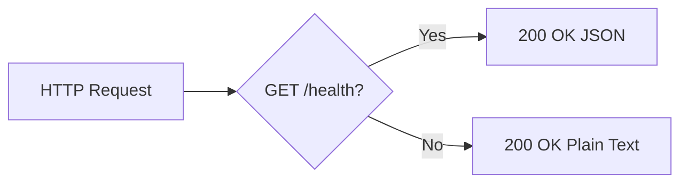

# hao-backprop-test

A minimal HTTP microserver used as a **Backprop integration test harness**, built with Python and Flask. Originally implemented as a Node.js `http.createServer()` server (`server.js`), this project has been migrated to Python/Flask while preserving identical external behavior. The server exposes a JSON health check endpoint (`GET /health`) and a universal catch-all handler that responds to any HTTP method on any path with `Hello, World!\n`. This project is intended for developers, DevOps personnel, and automated pipelines (such as Backprop) interacting with this service. **This is a development/test server and is NOT production-intended.**

## Overview

`hao-backprop-test` is a lightweight Flask-based HTTP microserver designed as a test harness for Backprop integration workflows. It provides two core capabilities:

- **JSON Health Check** — A dedicated `GET /health` endpoint returns `{"status":"ok"}` for programmatic service availability verification by monitoring tools, CI pipelines, and automated deployment checks.
- **Universal Catch-All** — Every other HTTP request (any method, any path) receives a plain-text `Hello, World!\n` response, replicating the behavior of the original Node.js server.

The project was migrated from a Node.js `http.createServer()` implementation to Python Flask while preserving identical external behavior — same host, same port, same response bodies, same status codes. The original Node.js files (`server.js`, `package.json`, `package-lock.json`) were removed during the migration.

This documentation is intended for developers onboarding to the project, DevOps personnel managing the service, and automated pipelines that interact with the server's endpoints.

## Architecture

The application is a **single-file monolithic Flask microserver** contained entirely within `app.py` (93 lines). The architecture consists of three components:

1. **Flask Application Instance** — Created via `Flask(__name__)`, serves as the WSGI application object (`app.py:25`).
2. **Two Route Handlers** — The health check endpoint and the catch-all handler, registered with Flask's routing system (`app.py:41–79`).
3. **Werkzeug Development Server** — Flask's built-in server, started via `app.run()` at the entry point (`app.py:92–93`).

### Request Routing Flow



Flask's route specificity ensures that `GET /health` is matched by the dedicated health check handler before the catch-all route is evaluated. All other method and path combinations — including `POST /health` — are handled by the catch-all handler.

## Project Structure

```
hao-backprop-test/
├── app.py
├── requirements.txt
├── README.md
└── blitzy/
    └── documentation/
```

| File / Directory | Description |
|------------------|-------------|
| `app.py` | Flask application entry point; defines routes, configuration, and server startup (93 lines) |
| `requirements.txt` | Python dependency manifest; pins `Flask==3.1.3` |
| `README.md` | This file; comprehensive project documentation |
| `blitzy/documentation/` | Internal Blitzy-generated technical specifications and project guide (not user-facing) |

> **Note:** The original Node.js files (`server.js`, `package.json`, `package-lock.json`) were removed during the migration from Node.js to Python/Flask. The active server implementation is `app.py` using Python/Flask.

## Prerequisites

- **Python 3.13** or higher
- **pip** (Python package manager)
- **venv** module (usually included with Python 3.13+)

Verify your environment before proceeding:

```bash
python3 --version    # Should output: Python 3.13.x or higher
```

```bash
pip --version        # Should output: pip XX.X.X from ...
```

> **Note:** The `venv` module is included in the Python 3.13+ standard library. If it is missing, install it via your system package manager (e.g., `sudo apt install python3.13-venv` on Debian/Ubuntu).

## Installation

**1. Clone the repository:**

```bash
git clone <repository-url>
cd hao-backprop-test
```

**2. Create a virtual environment:**

```bash
python -m venv venv
```

**3. Activate the virtual environment:**

Linux / macOS:

```bash
source venv/bin/activate
```

Windows:

```bash
venv\Scripts\activate
```

After activation, your terminal prompt should be prefixed with `(venv)`.

**4. Install dependencies:**

```bash
pip install -r requirements.txt
```

Expected output (versions may vary for transitive dependencies):

```
Successfully installed Flask-3.1.3 Jinja2-3.1.6 MarkupSafe-3.0.3 Werkzeug-3.1.7 blinker-1.9.0 click-8.3.1 itsdangerous-2.2.0
```

**5. Verify installation:**

```bash
python -c "import flask; print(flask.__version__)"
```

Expected output:

```
3.1.3
```

## Running the Server

Start the server by running:

```bash
python app.py
```

Expected terminal output:

```
 * Serving Flask app 'app'
 * Debug mode: off
WARNING: This is a development server. Do not use it in a production deployment. Use a production WSGI server instead.
 * Running on http://127.0.0.1:3000
Press CTRL+C to quit
```

### Verify Endpoints

In a separate terminal, verify the server is responding correctly:

```bash
curl -s http://127.0.0.1:3000/health
# Expected: {"status":"ok"}
```

```bash
curl -s http://127.0.0.1:3000/
# Expected: Hello, World!
```

### Shutdown

Stop the server by pressing `Ctrl+C` in the terminal where it is running.

> ⚠️ **Development Server Only:** Flask's built-in server (Werkzeug) is a **development server only** and is **NOT suitable for production use**. It is not designed to handle concurrent traffic, security hardening, or high availability. For production deployments, use a production-grade WSGI server such as Gunicorn or uWSGI behind a reverse proxy. This project is explicitly scoped as a development/test harness and does not target production deployment.

## API Reference

### Health Check Endpoint

| Property | Value |
|----------|-------|
| **Method** | `GET` |
| **Path** | `/health` |
| **Response Content-Type** | `application/json` |
| **Response Body** | `{"status":"ok"}` |
| **Status Code** | `200 OK` |
| **Source** | `app.py:41–48` |

**Purpose:** Programmatic service availability verification for monitoring tools, CI/CD pipeline health checks, and automated deployment validation.

**Example:**

```bash
curl -s http://127.0.0.1:3000/health
```

Expected response:

```json
{"status":"ok"}
```

### Catch-All Handler

| Property | Value |
|----------|-------|
| **Methods** | `GET`, `POST`, `PUT`, `DELETE`, `PATCH`, `HEAD`, `OPTIONS` |
| **Path** | `/` and `/<any-path>` |
| **Response Content-Type** | `text/plain` |
| **Response Body** | `Hello, World!\n` (with trailing newline) |
| **Status Code** | `200 OK` |
| **Source** | `app.py:64–79` |

**Purpose:** Replicates the original Node.js universal request handler behavior — every request receives an identical plain-text response regardless of HTTP method or URL path.

**Examples:**

```bash
curl -s http://127.0.0.1:3000/
# Expected: Hello, World!
```

```bash
curl -s -X POST http://127.0.0.1:3000/any/path
# Expected: Hello, World!
```

```bash
curl -s -X DELETE http://127.0.0.1:3000/foo/bar
# Expected: Hello, World!
```

### Routing Behavior Matrix

The following table shows how different request patterns are routed between the two handlers:

| Request | Handler | Response |
|---------|---------|----------|
| `GET /health` | `health()` | `{"status":"ok"}` (JSON) |
| `POST /health` | `catch_all()` | `Hello, World!\n` (text) |
| `GET /` | `catch_all()` | `Hello, World!\n` (text) |
| `GET /any/path` | `catch_all()` | `Hello, World!\n` (text) |
| `DELETE /foo` | `catch_all()` | `Hello, World!\n` (text) |
| `OPTIONS /health` | Flask auto-OPTIONS | (empty body, `Allow` header) |
| `PUT /some/resource` | `catch_all()` | `Hello, World!\n` (text) |

> **Note:** Only `GET /health` is handled by the health check endpoint. All other method and path combinations — including non-GET requests to `/health` (except `OPTIONS /health`, which Flask handles automatically by returning an empty body with an `Allow` header) — are handled by the catch-all handler.

## Configuration

The server's runtime configuration is defined as hardcoded constants in `app.py` (lines 30–33). These are **not** configurable via environment variables — to change them, edit `app.py` directly.

| Constant | Value | Type | Description |
|----------|-------|------|-------------|
| `HOST` | `'127.0.0.1'` | `str` | Server bind address — localhost only, prevents external network exposure |
| `PORT` | `3000` | `int` | Server listen port — matches the original Node.js server for behavioral parity |
| `METHODS` | `['GET', 'POST', 'PUT', 'DELETE', 'PATCH', 'HEAD', 'OPTIONS']` | `list[str]` | HTTP methods accepted by the catch-all handler — covers all standard methods |

Source: `app.py:30–33`

## Technology Stack

- **Runtime:** Python 3.13+
- **Framework:** Flask 3.1.3
- **WSGI Server:** Werkzeug (Flask's built-in development server)

### Dependency Tree

Only `Flask==3.1.3` is declared in `requirements.txt`. All other packages are **transitive dependencies** installed automatically by pip when Flask is installed.

| Package | Version | Purpose | Active in Code |
|---------|---------|---------|----------------|
| Flask | 3.1.3 | Web framework — application core | Yes (`app.py` line 18) |
| Werkzeug | 3.1.7 | WSGI server and HTTP utilities | Yes (powers `app.run()`) |
| Jinja2 | 3.1.6 | Template rendering engine | No (no templates used) |
| MarkupSafe | 3.0.3 | HTML/XML string escaping | No (no markup generation) |
| itsdangerous | 2.2.0 | Cryptographic data signing | No (no sessions/tokens) |
| click | 8.3.1 | CLI argument parsing framework | No (no CLI commands) |
| blinker | 1.9.0 | Signal/event dispatching | No (no signal handlers) |

> **Active in Code** = the package's functionality is directly used by `app.py` at runtime. Packages marked "No" are installed as dependencies of Flask but are not utilized by this minimal application.

## Troubleshooting

### Port 3000 Already in Use (OSError)

**Symptom:**

```
OSError: [Errno 98] Address already in use
```

**Solution:** Another process is using port 3000. Identify and stop it, or change the `PORT` constant in `app.py`.

```bash
# Find the process using port 3000
lsof -i :3000
# or
netstat -tlnp | grep 3000
```

```bash
# Kill the process (replace <PID> with the actual process ID)
kill <PID>
```

### Flask Not Installed (ImportError)

**Symptom:**

```
ModuleNotFoundError: No module named 'flask'
```

**Solution:** Ensure the virtual environment is activated and dependencies are installed.

```bash
# Activate virtual environment
source venv/bin/activate    # Linux/macOS
# or
venv\Scripts\activate       # Windows

# Install dependencies
pip install -r requirements.txt
```

**Verification:**

```bash
pip list | grep Flask
# Expected: Flask    3.1.3
```

### Python Version Incompatibility

**Symptom:** `SyntaxError` or unexpected behavior when starting the server.

**Solution:** Ensure Python 3.13 or higher is installed.

```bash
python3 --version
# Should output: Python 3.13.x or higher
```

**Verification:**

```bash
python3 -c "import sys; assert sys.version_info >= (3, 13), f'Python {sys.version} is too old'"
```

If the assertion fails, install Python 3.13+ from [python.org](https://www.python.org/downloads/) or via your system package manager.
