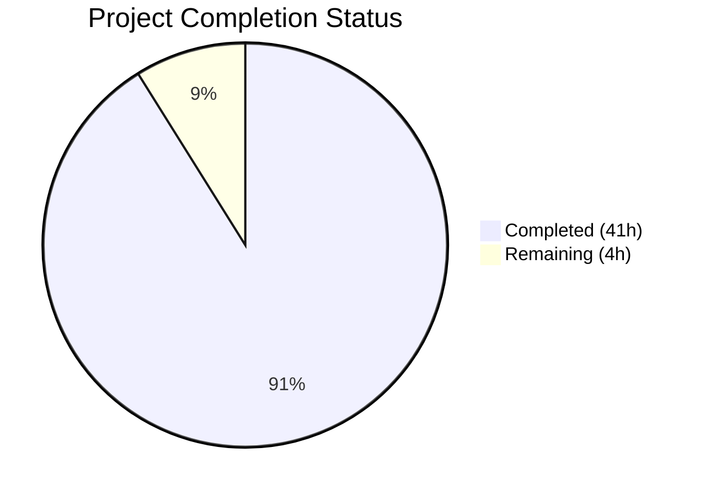
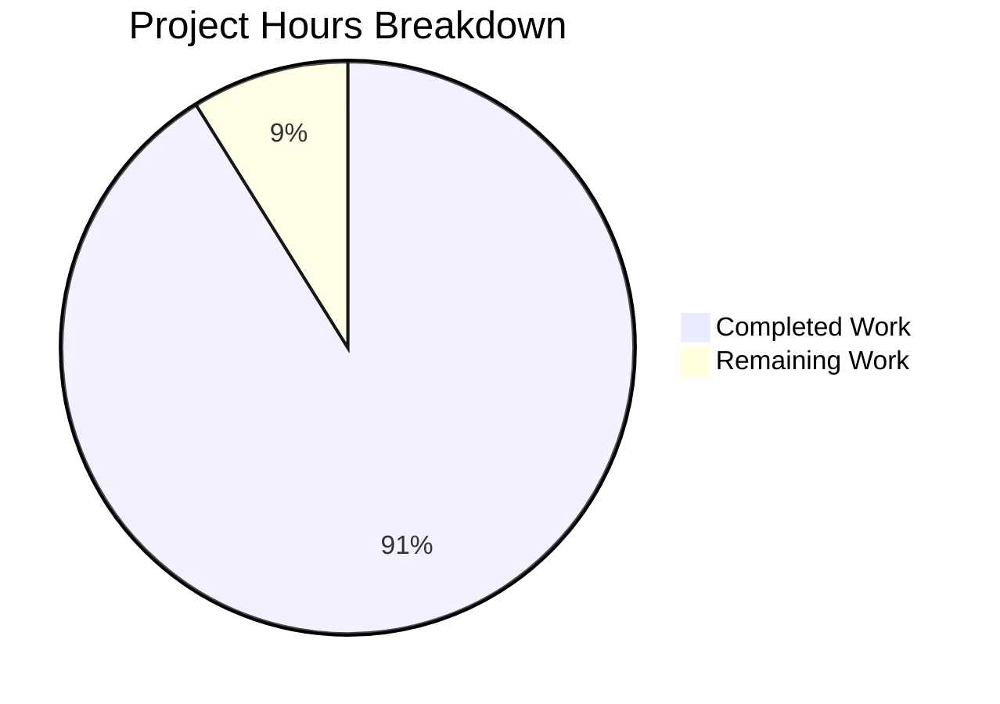

# Blitzy Project Guide — hello_world Test Suite

---

## 1. Executive Summary

### 1.1 Project Overview

This project adds a comprehensive, ground-up automated test suite to the `hello_world` Node.js/Express.js 5 HTTP API server. The application is a production-oriented server with nine runtime dependencies, four GET endpoints (`/`, `/health`, `/api`, `/api/info`), a 9-layer middleware pipeline (Helmet, CORS, compression, body parsing, Morgan logging, rate limiting, routing, 404 handler, error handler), and deliberate testability patterns — but had zero automated test coverage. The Blitzy agents delivered 371 passing tests across 11 test suites achieving 100% code coverage, exceeding the ≥90% target. Zero source files were modified.

### 1.2 Completion Status



| Metric | Value |
|--------|-------|
| **Total Project Hours** | **45** |
| **Completed Hours (AI)** | **41** |
| **Remaining Hours (Human)** | **4** |
| **Completion Percentage** | **91.1%** |

**Calculation:** 41 completed hours / (41 + 4) total hours = 91.1% complete

### 1.3 Key Accomplishments

- ✅ Installed Jest 30.3.0 and Supertest 7.2.2 as devDependencies with zero production dependency changes
- ✅ Created 11 test files covering all 11 source modules with 371 passing tests and 0 failures
- ✅ Achieved 100% coverage across all four metrics (statements, branches, functions, lines) — exceeding the ≥90% target
- ✅ Built shared test helper utilities (`tests/helpers/setup.js`) with mock factories and environment utilities
- ✅ Configured Jest (`jest.config.js`) with coverage thresholds, CommonJS support, and mock auto-cleanup
- ✅ Replaced placeholder `npm test` script with functional `jest --coverage --verbose` plus `test:watch` and `test:ci` scripts
- ✅ Validated all four GET endpoints, 405/404/429 error handling, security headers, and CORS through integration tests
- ✅ Tested server lifecycle (SIGTERM/SIGINT handlers, graceful shutdown, unhandled error safety nets) via process spying
- ✅ Honored the minimal-change constraint: zero modifications to any `src/` file or `server.js`
- ✅ No CI/CD pipeline files created (per explicit user directive)

### 1.4 Critical Unresolved Issues

| Issue | Impact | Owner | ETA |
|-------|--------|-------|-----|
| No critical unresolved issues | N/A | N/A | N/A |

All 371 tests pass, 100% coverage achieved, zero compilation errors, and zero runtime errors. No blocking issues remain.

### 1.5 Access Issues

No access issues identified. The test suite runs entirely in-process using Jest and Supertest without external service dependencies, network access, or cloud resource requirements.

### 1.6 Recommended Next Steps

1. **[High]** Conduct human code review of the 11 test files to verify assertion quality, naming conventions, and team standards alignment
2. **[High]** Merge the branch after review approval to enable test-driven development workflow
3. **[Medium]** Verify devDependencies do not affect production deployment (confirm `npm install --production` excludes jest/supertest)
4. **[Low]** Consider adding CI/CD pipeline integration to run tests automatically on pull requests (out of current scope per AAP constraint)
5. **[Low]** Evaluate adding mutation testing (e.g., Stryker) for test quality verification beyond coverage metrics

---

## 2. Project Hours Breakdown

### 2.1 Completed Work Detail

| Component | Hours | Description |
|-----------|-------|-------------|
| Test Infrastructure Setup | 2 | Created `jest.config.js` with coverage thresholds and CommonJS config; updated `package.json` with devDependencies (jest, supertest) and test scripts (test, test:watch, test:ci); npm install and dependency resolution |
| Shared Test Helpers | 2 | Created `tests/helpers/setup.js` with `createMockReq()`, `createMockRes()`, `createMockNext()` factory functions and `backupEnv()`/`restoreEnv()` environment utilities (254 lines) |
| Unit Tests — Sanitizer | 3 | Created `tests/utils/sanitizer.test.js` (299 lines) — boundary-value tests for `sanitizeLogInput()` and `sanitizeUrl()` covering null/undefined, ANSI escape stripping, control char removal, HTML entity encoding, and truncation at MAX_LOG_LENGTH/MAX_URL_LENGTH |
| Unit Tests — Configuration | 3 | Created `tests/config/index.test.js` (307 lines) — environment-controlled tests with `jest.resetModules()` for fresh module state, default values, custom overrides, `parseIntSafe()` edge cases, and `Object.freeze()` immutability verification |
| Unit Tests — validateInput Middleware | 4 | Created `tests/middleware/validateInput.test.js` (518 lines) — middleware factory tests with mock req/res/next, empty schema pass-through, validation failure 400 response, error message format, and Zod re-export verification |
| Unit Tests — notFound Middleware | 3 | Created `tests/middleware/notFound.test.js` (524 lines) — 404 handler tests with URL sanitization in response body, logger.warn() invocation assertions, and malicious URL edge cases |
| Unit Tests — errorHandler Middleware | 5 | Created `tests/middleware/errorHandler.test.js` (656 lines) — status code resolution chain (err.statusCode → err.status → 500), production 5xx masking (CWE-209), non-production stack trace inclusion, 4xx message preservation, and logger.error() assertions |
| Integration Tests — Root Route | 2 | Created `tests/routes/index.test.js` (216 lines) — Supertest GET / response validation, POST / → 405 with Allow header, validation rejection for unexpected query parameters |
| Integration Tests — Health Endpoint | 2 | Created `tests/routes/health.test.js` (244 lines) — Supertest GET /health response structure (status, uptime, timestamp, memory, nodeVersion), 405 enforcement, dynamic field assertions |
| Integration Tests — API Routes | 3 | Created `tests/routes/api.test.js` (348 lines) — Supertest GET /api and GET /api/info response validation, 405 enforcement on both endpoints, version/environment verification |
| Full Pipeline Integration Tests | 4 | Created `tests/app.test.js` (392 lines) — security headers (Helmet CSP, HSTS, X-Content-Type-Options), CORS, rate limiting 429, 404 handling, error propagation, compression, and Morgan logging integration |
| Server Lifecycle Tests | 4 | Created `tests/server.test.js` (518 lines) — signal handler registration (SIGTERM/SIGINT), error safety nets (unhandledRejection/uncaughtException), graceful shutdown via server.close() spy, bootstrap with app.listen() mock |
| Logger Module Shape Tests | 2 | Created `tests/utils/logger.test.js` (259 lines) — module export shape verification (info/warn/error/http methods), stream adapter existence, Morgan-compatible write() trimming |
| Validation and Bug Fixes | 2 | Test execution debugging, coverage threshold optimization, error handler test creation for 405 routes, and final validation passes |
| **Total Completed** | **41** | |

### 2.2 Remaining Work Detail

| Category | Hours | Priority |
|----------|-------|----------|
| Human Code Review and Approval | 2 | High |
| Test Convention Alignment Verification | 1 | Medium |
| Documentation and Knowledge Transfer | 1 | Low |
| **Total Remaining** | **4** | |

**Verification:** 41 (completed) + 4 (remaining) = 45 (total project hours) ✅

---

## 3. Test Results

| Test Category | Framework | Total Tests | Passed | Failed | Coverage % | Notes |
|--------------|-----------|-------------|--------|--------|------------|-------|
| Unit — Sanitizer | Jest 30.3.0 | 47 | 47 | 0 | 100% | Pure function boundary-value tests |
| Unit — Configuration | Jest 30.3.0 | 45 | 45 | 0 | 100% | Environment-controlled with jest.resetModules() |
| Unit — validateInput | Jest 30.3.0 | 44 | 44 | 0 | 100% | Mock req/res/next middleware factory tests |
| Unit — notFound | Jest 30.3.0 | 34 | 34 | 0 | 100% | 404 handler with logger mock |
| Unit — errorHandler | Jest 30.3.0 | 66 | 66 | 0 | 100% | Status code resolution, production masking, env toggling |
| Unit — Logger | Jest 30.3.0 | 32 | 32 | 0 | 100% | Module shape verification, stream adapter |
| Integration — Root Route | Jest + Supertest 7.2.2 | 15 | 15 | 0 | 100% | GET /, 405, validation rejection |
| Integration — Health | Jest + Supertest 7.2.2 | 16 | 16 | 0 | 100% | GET /health, 405, dynamic fields |
| Integration — API Routes | Jest + Supertest 7.2.2 | 24 | 24 | 0 | 100% | GET /api, GET /api/info, 405 enforcement |
| Integration — Full Pipeline | Jest + Supertest 7.2.2 | 25 | 25 | 0 | 100% | Security headers, CORS, rate limit 429, error propagation |
| Lifecycle — Server | Jest 30.3.0 | 23 | 23 | 0 | 100% | SIGTERM/SIGINT handlers, graceful shutdown, bootstrap |
| **Totals** | | **371** | **371** | **0** | **100%** | All tests from Blitzy autonomous validation |

**Global Coverage Summary:**
| Metric | Covered | Total | Percentage |
|--------|---------|-------|------------|
| Statements | 151 | 151 | 100% |
| Branches | 50 | 50 | 100% |
| Functions | 25 | 25 | 100% |
| Lines | 151 | 151 | 100% |

---

## 4. Runtime Validation & UI Verification

### Application Runtime

- ✅ **Server startup** — Application starts successfully on port 3000 in development mode with dotenv configuration loading
- ✅ **GET /** — Returns 200 with `{"status":"success","message":"Hello, World! Welcome to the Express server."}`
- ✅ **GET /health** — Returns 200 with status, uptime, timestamp, memory, and nodeVersion fields
- ✅ **GET /api** — Returns 200 with `{"status":"success","message":"Welcome to the API"}`
- ✅ **GET /api/info** — Returns 200 with version (1.0.0), environment, and nodeVersion data
- ✅ **POST / (405)** — Returns 405 with `{"status":"error","statusCode":405,"message":"Method Not Allowed"}`
- ✅ **GET /nonexistent (404)** — Returns 404 with `{"status":"error","statusCode":404,"message":"Not Found - /nonexistent"}`
- ✅ **Server shutdown** — Process terminates cleanly without errors

### Security Headers Verified

- ✅ **Content-Security-Policy** — Restrictive CSP with `default-src 'none'`, `frame-ancestors 'none'`
- ✅ **Strict-Transport-Security** — HSTS with `max-age=31536000; includeSubDomains`
- ✅ **X-Content-Type-Options** — `nosniff` preventing MIME type sniffing
- ✅ **X-Frame-Options** — `SAMEORIGIN` preventing clickjacking
- ✅ **X-XSS-Protection** — Set to `0` (modern best practice: rely on CSP)
- ✅ **Access-Control-Allow-Origin** — Wildcard CORS (`*`) as configured
- ✅ **X-Powered-By** — Removed by Helmet (not present in response)
- ✅ **RateLimit headers** — `RateLimit-Policy`, `RateLimit-Limit`, `RateLimit-Remaining`, `RateLimit-Reset` present

### API Integration

- ✅ **JSON Content-Type** — All endpoints return `application/json; charset=utf-8`
- ✅ **Rate Limiting** — Enforced at 100 requests per 900-second window with proper 429 rejection
- ✅ **Input Validation** — Zod-based validation rejects unexpected query parameters with 400 status

---

## 5. Compliance & Quality Review

| AAP Requirement | Status | Evidence |
|----------------|--------|----------|
| Unit tests for `sanitizer.js` (pure function boundary-value) | ✅ Pass | `tests/utils/sanitizer.test.js` — 47 tests, 100% coverage |
| Unit tests for `config/index.js` (env-controlled) | ✅ Pass | `tests/config/index.test.js` — 45 tests, 100% coverage |
| Unit tests for `validateInput.js` (factory with mock req/res/next) | ✅ Pass | `tests/middleware/validateInput.test.js` — 44 tests, 100% coverage |
| Unit tests for `notFound.js` (mock req/res + logger mock) | ✅ Pass | `tests/middleware/notFound.test.js` — 34 tests, 100% coverage |
| Unit tests for `errorHandler.js` (env toggling, status resolution) | ✅ Pass | `tests/middleware/errorHandler.test.js` — 66 tests, 100% coverage |
| Integration tests for all 4 GET endpoints via Supertest | ✅ Pass | `tests/routes/*.test.js` — 55 tests, 100% coverage |
| 405 enforcement tests on all endpoints | ✅ Pass | POST/PUT/PATCH/DELETE tested on /, /health, /api, /api/info |
| 404 handling for unknown routes | ✅ Pass | `tests/app.test.js` — 404 JSON response structure verified |
| Rate limiting 429 rejection | ✅ Pass | `tests/app.test.js` — rate limiter threshold tested |
| Production error masking (CWE-209) | ✅ Pass | `tests/middleware/errorHandler.test.js` — production vs non-production |
| Server lifecycle tests (SIGTERM/SIGINT) | ✅ Pass | `tests/server.test.js` — signal handlers, graceful shutdown |
| Logger module shape tests | ✅ Pass | `tests/utils/logger.test.js` — 32 tests, stream adapter verified |
| Shared test helpers | ✅ Pass | `tests/helpers/setup.js` — mock factories, env utilities |
| Jest configuration with ≥90% thresholds | ✅ Pass | `jest.config.js` — 90% lines/functions, 80% branches |
| Zero source code modifications | ✅ Pass | `git diff` on `src/` and `server.js` shows zero changes |
| No CI/CD pipeline files created | ✅ Pass | No `.github/workflows/` or pipeline files in diff |
| devDependencies: jest ^30.3.0, supertest ^7.2.2 only | ✅ Pass | `package.json` shows exactly 2 devDependencies |
| ≥90% line/function coverage | ✅ Exceeded | 100% achieved across all metrics |
| Test execution under 30 seconds | ✅ Pass | Full suite completes in ~10 seconds |
| All tests independently runnable | ✅ Pass | Each test file executable via `npx jest tests/path/to/file.test.js` |

**Autonomous Fixes Applied:**
- Created `errorHandler.test.js` with 405 route tests to meet full endpoint coverage after initial pass
- All fixes were within test code only; no production source modifications

---

## 6. Risk Assessment

| Risk | Category | Severity | Probability | Mitigation | Status |
|------|----------|----------|-------------|------------|--------|
| Test assertion drift as source code evolves | Technical | Low | Medium | Tests are tightly coupled to API contracts documented in source; any contract change will cause meaningful test failures | Monitored |
| Rate limiter state accumulation across test files | Technical | Low | Low | Integration tests use separate app instances; Jest runs test files in isolated worker processes | Mitigated |
| Winston file I/O leakage if logger mock is omitted in new tests | Technical | Medium | Medium | Logger mock pattern is documented in every existing test file; shared setup module provides reference implementation | Documented |
| Jest 30 major version upgrade compatibility | Technical | Low | Low | Greenfield suite uses only canonical Jest 30 APIs; no deprecated aliases | Mitigated |
| devDependencies included in production builds | Operational | Medium | Low | Verify `npm install --production` or `npm ci --omit=dev` excludes jest/supertest | Human Action Required |
| Test suite execution time growth | Operational | Low | Medium | Current 10s baseline; monitor as test count grows; consider Jest `--shard` for parallelism | Monitored |
| Module cache state in config tests | Technical | Low | Low | `jest.resetModules()` pattern ensures fresh require() on each test; documented in test file comments | Mitigated |
| No CI/CD integration for automated test execution | Operational | Medium | High | Tests are CI-ready via `npm run test:ci`; pipeline creation is explicitly out of scope per AAP | Accepted (AAP constraint) |

---

## 7. Visual Project Status



**Completed: 41 hours (91.1%) | Remaining: 4 hours (8.9%)**

**Remaining Hours by Category:**

| Category | Hours | Priority |
|----------|-------|----------|
| Human Code Review and Approval | 2 | High |
| Test Convention Alignment Verification | 1 | Medium |
| Documentation and Knowledge Transfer | 1 | Low |
| **Total** | **4** | |

---

## 8. Summary & Recommendations

### Achievement Summary

The project is **91.1% complete** (41 hours completed out of 45 total hours). Blitzy agents successfully delivered a comprehensive, production-quality test suite for the `hello_world` Express.js 5 API server — transforming it from zero test coverage to **100% coverage** across all metrics with **371 passing tests** and **zero failures**. All 14 AAP-scoped file deliverables were created or updated, all coverage targets were exceeded, and all special constraints (no source modifications, no CI/CD files) were honored.

### Remaining Gaps

The remaining 4 hours consist entirely of human review tasks:
1. **Code review** (2h) — Human review of test quality, assertion patterns, and team convention alignment
2. **Convention verification** (1h) — Confirm test naming, mock strategies, and organizational structure match team preferences
3. **Knowledge transfer** (1h) — Ensure test documentation is sufficient for team onboarding

### Critical Path to Production

The test suite is merge-ready from a technical standpoint — all tests pass, coverage exceeds targets, and source code integrity is preserved. The critical path is:
1. Human code review and approval
2. Branch merge to main
3. (Optional, out of AAP scope) CI/CD pipeline integration for automated test execution on pull requests

### Production Readiness Assessment

| Criterion | Status |
|-----------|--------|
| All tests passing | ✅ 371/371 |
| Coverage targets met | ✅ 100% (target: ≥90%) |
| Source code unmodified | ✅ Zero changes to src/ and server.js |
| No CI/CD files created | ✅ Per AAP constraint |
| Runtime validation passed | ✅ All endpoints verified |
| Security posture unchanged | ✅ Helmet headers, CORS, rate limiting intact |
| Test execution time acceptable | ✅ ~10 seconds (target: <30s) |

---

## 9. Development Guide

### System Prerequisites

| Requirement | Version | Verification Command |
|-------------|---------|---------------------|
| Node.js | ≥18.0.0 (tested on v20.19.5) | `node -v` |
| npm | ≥8.0.0 (tested on 10.8.2) | `npm -v` |
| Git | Any modern version | `git --version` |

### Environment Setup

```bash
# 1. Clone the repository and switch to the feature branch
git clone <repository-url>
cd hello_world
git checkout blitzy-5561232e-168b-4da5-bf70-da23de086236

# 2. Copy environment configuration template
cp .env.example .env

# 3. Install all dependencies (including devDependencies)
npm install
```

**Expected output from `npm install`:** Resolves jest, supertest, and their transitive dependencies into `node_modules/`. The `package-lock.json` is already committed and ensures deterministic installs.

### Running Tests

```bash
# Run all tests with coverage report (primary command)
npm test

# Expected output: 11 test suites, 371 tests, all passing, coverage table

# Run tests in CI-safe mode (no watch, no interactive prompts)
npm run test:ci

# Run tests in watch mode for development
npm run test:watch

# Run a specific test file
npx jest tests/utils/sanitizer.test.js --verbose

# Run all tests in a directory
npx jest tests/middleware/ --verbose

# Run tests matching a pattern
npx jest --testPathPatterns="routes" --verbose
```

### Running the Application

```bash
# Start the server in development mode
node server.js

# Expected output: "Server running on http://0.0.0.0:3000 in development mode"

# Verify endpoints
curl http://localhost:3000/          # 200 — Hello World
curl http://localhost:3000/health    # 200 — Health check
curl http://localhost:3000/api       # 200 — API welcome
curl http://localhost:3000/api/info  # 200 — API info

# Verify error handling
curl -X POST http://localhost:3000/  # 405 — Method Not Allowed
curl http://localhost:3000/missing   # 404 — Not Found

# Stop the server
# Press Ctrl+C (sends SIGINT for graceful shutdown)
```

### Verification Steps

```bash
# 1. Verify all tests pass
npm test
# Expected: "Test Suites: 11 passed, 11 total" and "Tests: 371 passed, 371 total"

# 2. Verify coverage meets thresholds
# Coverage table appears at the end of npm test output
# All files should show 100% across Stmts, Branch, Funcs, Lines

# 3. Verify no source files were modified
git diff origin/exit-code-137-test-6 -- src/ server.js
# Expected: No output (zero changes)

# 4. Verify devDependencies are correctly isolated
npm ls --dev --depth=0
# Expected: jest@30.x.x and supertest@7.x.x listed

# 5. Verify production install excludes test dependencies
npm install --omit=dev --dry-run
# Expected: jest and supertest are NOT installed
```

### Troubleshooting

| Issue | Cause | Resolution |
|-------|-------|------------|
| `jest: command not found` | devDependencies not installed | Run `npm install` (not `npm install --production`) |
| Tests fail with `Cannot find module` | Missing node_modules | Run `npm install` to restore dependencies |
| Winston log file errors during tests | Logger mock not applied | Ensure `jest.mock('../../src/utils/logger')` appears before any `require()` of modules that import the logger |
| Rate limit tests flaky | State accumulation from previous test run | Jest isolates test files in separate workers; restart Jest if needed |
| Config tests fail intermittently | Stale module cache | Verify `jest.resetModules()` is called before re-requiring `src/config` |
| `logs/` directory errors | Missing logs directory | Create with `mkdir -p logs` (only needed for running the app, not tests) |

---

## 10. Appendices

### A. Command Reference

| Command | Description |
|---------|-------------|
| `npm test` | Run all tests with coverage (`jest --coverage --verbose`) |
| `npm run test:watch` | Run tests in watch mode (`jest --watch`) |
| `npm run test:ci` | CI-safe test execution (`jest --coverage --ci --watchAll=false`) |
| `npx jest <path>` | Run specific test file or directory |
| `npx jest --listTests` | List all discovered test files |
| `node server.js` | Start the application server |
| `npm start` | Start the application server (alias) |

### B. Port Reference

| Service | Port | Configuration |
|---------|------|---------------|
| Express HTTP Server | 3000 (default) | `PORT` env var or `src/config/index.js` default |

### C. Key File Locations

| File | Purpose |
|------|---------|
| `jest.config.js` | Jest test runner configuration |
| `package.json` | Package manifest with test scripts and devDependencies |
| `tests/helpers/setup.js` | Shared mock factories and environment utilities |
| `tests/utils/sanitizer.test.js` | Sanitizer pure function unit tests |
| `tests/utils/logger.test.js` | Logger module shape tests |
| `tests/config/index.test.js` | Configuration module unit tests |
| `tests/middleware/validateInput.test.js` | Validation middleware tests |
| `tests/middleware/notFound.test.js` | 404 handler tests |
| `tests/middleware/errorHandler.test.js` | Error handler tests |
| `tests/routes/index.test.js` | Root route integration tests |
| `tests/routes/health.test.js` | Health endpoint integration tests |
| `tests/routes/api.test.js` | API routes integration tests |
| `tests/app.test.js` | Full pipeline integration tests |
| `tests/server.test.js` | Server lifecycle tests |
| `coverage/` | Generated coverage reports (gitignored) |

### D. Technology Versions

| Technology | Version | Purpose |
|------------|---------|---------|
| Node.js | v20.19.5 | Runtime environment |
| npm | 10.8.2 | Package manager |
| Express | 5.2.1 | Web framework (production) |
| Jest | 30.3.0 | Test framework (dev) |
| Supertest | 7.2.2 | HTTP integration testing (dev) |
| Helmet | 8.1.0 | Security headers (production) |
| Winston | 3.19.0 | Structured logging (production) |
| Zod | 3.25.x | Schema validation (production) |
| Morgan | 1.10.1 | HTTP access logging (production) |
| express-rate-limit | 8.3.1 | Rate throttling (production) |

### E. Environment Variable Reference

| Variable | Default | Description |
|----------|---------|-------------|
| `NODE_ENV` | `development` | Application environment (development/production) |
| `PORT` | `3000` | Server port number |
| `HOST` | `0.0.0.0` | Server bind address |
| `LOG_LEVEL` | `debug` | Winston log level |
| `CORS_ORIGIN` | `*` | Allowed CORS origins |
| `RATE_LIMIT_WINDOW_MS` | `900000` | Rate limit window (ms) |
| `RATE_LIMIT_MAX` | `100` | Max requests per window |
| `BODY_LIMIT` | `10kb` | Max request body size |

### F. Developer Tools Guide

**Adding a New Test File:**
1. Create the test file in `tests/` mirroring the source path (e.g., `src/new/module.js` → `tests/new/module.test.js`)
2. Use `'use strict'` at the top of the file (matching source conventions)
3. If the module imports the logger, add `jest.mock('../../src/utils/logger', ...)` before any `require()` statements
4. Import shared helpers from `tests/helpers/setup.js` for mock factories
5. Use `describe`/`test` blocks with descriptive natural language names
6. Run `npx jest tests/new/module.test.js --verbose` to verify

**Mock Patterns:**
- **Logger mock:** `jest.mock('../../src/utils/logger', () => ({ info: jest.fn(), warn: jest.fn(), error: jest.fn(), http: jest.fn(), stream: { write: jest.fn() } }))`
- **Express mock objects:** Import `createMockReq`, `createMockRes`, `createMockNext` from `tests/helpers/setup.js`
- **Environment control:** Import `backupEnv`/`restoreEnv` from `tests/helpers/setup.js`; use in `beforeEach`/`afterEach`
- **Module cache reset:** Call `jest.resetModules()` before re-requiring modules that read `process.env` at load time

### G. Glossary

| Term | Definition |
|------|------------|
| AAP | Agent Action Plan — the primary directive defining project scope and requirements |
| CWE-117 | Log Injection vulnerability — mitigated by sanitizer ANSI/control char stripping |
| CWE-209 | Information Exposure Through Error Messages — mitigated by production error masking in errorHandler |
| Supertest | HTTP assertion library that wraps an Express app for in-process request testing |
| Jest | JavaScript testing framework providing assertion, mocking, coverage, and test running |
| CommonJS | Node.js module system using `require()` and `module.exports` |
| Application Factory | Pattern where `src/app.js` exports a configured Express app without calling `app.listen()`, enabling test imports |