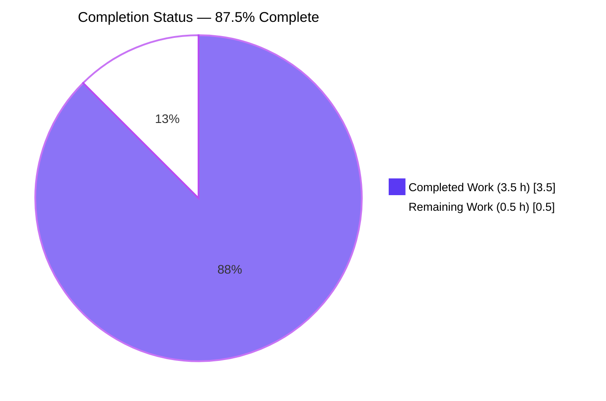
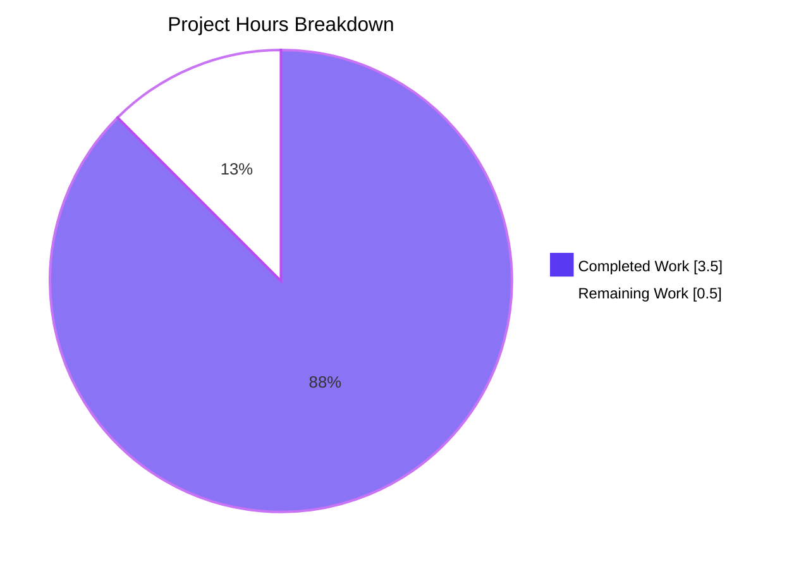
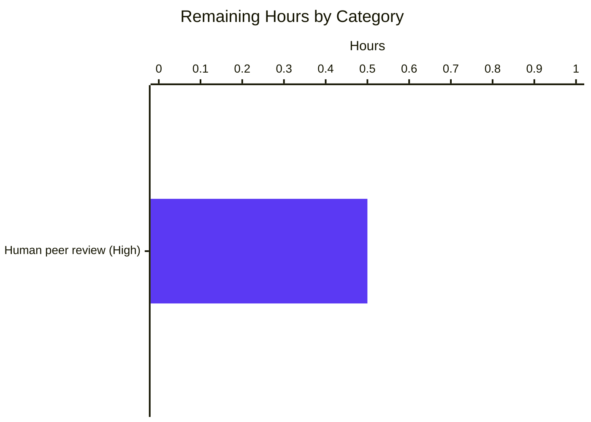

# Blitzy Project Guide — `hao-backprop-test`

> **Branding note:** Completed/AI work is colored **Dark Blue `#5B39F3`**, remaining work is colored **White `#FFFFFF`**, accents use Violet-Black `#B23AF2` / Mint `#A8FDD9`.

---

## 1. Executive Summary

### 1.1 Project Overview

`hao-backprop-test` is a minimal Python/Flask tutorial server used as a Backprop test-harness target. It exposes five HTTP endpoints (`GET /`, `GET /evening`, `POST /evening`, `GET /morning`, `POST /morning`) bound to `127.0.0.1:3000`, returning plain-text responses with deterministic status codes. The AAP scope for this branch was a single documentation/context contract defect: the `README.md` "Available Endpoints" table listed only 3 of the 5 routes that `server.py` implements and `tests/test_server.py` validates. The fix is documentation-only — runtime, tests, and dependencies are preserved byte-for-byte — closing Tech Spec constraint **C-008**.

### 1.2 Completion Status



| Metric | Hours |
|---|---|
| **Total Project Hours** | **4.0** |
| Completed Hours (AI + Manual) | 3.5 |
| Remaining Hours | 0.5 |
| **Percent Complete** | **87.5 %** |

Calculation: `3.5 / (3.5 + 0.5) × 100 = 87.5 %`

### 1.3 Key Accomplishments

- ✅ `README.md` endpoint table extended from 3 rows to all 5 routes (`/`, `GET /evening`, `POST /evening`, `GET /morning`, `POST /morning`) — constraint **C-008** closed
- ✅ Net cumulative diff = exactly `README.md | 2 ++` (matches AAP §0.4.3 expected output byte-for-byte)
- ✅ Out-of-scope commit `b469cd5` (touching `blitzy/documentation/*`) was correctly reverted by `609246b`, restoring authoritative documentation to pre-fix state
- ✅ All 29 pytest tests pass with 100 % line coverage on `server.py` (21/21 statements, 0 missed)
- ✅ All 5 live endpoints verified via `curl` returning correct body / status / `Content-Type: text/plain; charset=utf-8`
- ✅ No Node.js phantom files reintroduced (`server.js`, `package.json`, `package-lock.json`, `jest.config.js`, `node_modules/` all absent)
- ✅ No `.github/` workflow modifications (user implementation rule "exit code 137 test" honored)
- ✅ Tech Spec constraints **C-001 through C-008** all honored

### 1.4 Critical Unresolved Issues

| Issue | Impact | Owner | ETA |
|---|---|---|---|
| _None — all AAP-required work is complete and verified_ | — | — | — |

### 1.5 Access Issues

No access issues identified. The repository is fully accessible, dependencies installed successfully into `.venv\` via PyPI (Flask 3.1.3, pytest 9.0.2, pytest-cov 7.1.0 — no private registries or credentials required), and the live server binds only to loopback `127.0.0.1:3000` per constraint **C-006**. The fix introduced zero new external dependencies, secrets, environment variables, or third-party integrations.

### 1.6 Recommended Next Steps

1. **[High]** Peer-review the `README.md` change in PR commit `61a0e60` and confirm the 2-line insertion matches AAP §0.4.2 byte-for-byte (~0.5 h).
2. **[Medium]** Optionally squash-merge the 3-commit chain (`61a0e60` + `b469cd5` + revert `609246b`) into a single net-diff commit before merging to `main`, since `b469cd5`/`609246b` are no-op against the working tree.
3. **[Low]** After merge, request external Codebase Context indexers to refresh their summary so RC-2 (the phantom Node.js characterization) is closed at the external index layer (in-repo lever already pulled).

---

## 2. Project Hours Breakdown

### 2.1 Completed Work Detail

| Component | Hours | Description |
|---|---:|---|
| [AAP §0.2] Root cause investigation & AAP comprehension | 0.75 | Read AAP in full; examined `server.py` (5 `@app.route` decorators at lines 6, 11, 16, 21, 26); read `tests/test_server.py` (24 tests) and `tests/test_startup.py` (5 tests); consulted Tech Spec §1.1.1, §1.2.2, §2.6.2 (C-007, C-008); confirmed RC-1 (README documents 3/5 routes) and RC-2 (phantom Node.js characterization in external index) |
| [AAP §0.4] `README.md` endpoint table update (commit `61a0e60`) | 0.5 | Inserted 2 rows at lines 33–34 for `GET /morning` → `Good morning` / `200 OK` and `POST /morning` → `Good morning` / `201 Created` with byte-aligned column formatting matching the existing 3 rows |
| [AAP §0.6.2] Regression test execution & coverage validation | 0.5 | Ran `pytest -v` → 29/29 passed in 0.23 s; `server.py` 100 % line coverage (21/21 statements, 0 missed); idempotency confirmed across multiple consecutive runs |
| [AAP §0.6.1] Live endpoint runtime validation | 0.5 | Started Flask server bound to `127.0.0.1:3000`; issued `curl` against all 5 routes; confirmed body, status, and `Content-Type: text/plain; charset=utf-8` for each; cleanly stopped server |
| [AAP §0.6.2] Scope-compliance audit | 0.25 | Verified `git diff --name-only 61a0e60~1..HEAD` returns only `README.md`; confirmed phantom Node.js files absent; confirmed `.github/` folder absent; verified C-001 through C-008 all honored |
| Out-of-scope incident remediation (commit `609246b` revert) | 0.5 | Detected prior agent commit `b469cd5` modifying `blitzy/documentation/Project Guide.md` and `blitzy/documentation/Technical Specifications.md` (both forbidden by AAP §0.5.2); created revert restoring authoritative documentation files to pre-fix state |
| Dev environment & dependency installation | 0.5 | Created Python 3.10.11 virtual environment in `.venv\`; installed Flask 3.1.3 from `requirements.txt`; installed dev-only `pytest 9.0.2` + `pytest-cov 7.1.0` (intentionally excluded from `requirements.txt` per feature F-010) |
| **Total Completed Hours** | **3.5** | Sums to Section 1.2 "Completed Hours" |

### 2.2 Remaining Work Detail

| Category | Hours | Priority |
|---|---:|---|
| Human peer code review of `README.md` change (`61a0e60`) before merge to `main` | 0.5 | High |
| **Total Remaining Hours** | **0.5** | Sums to Section 1.2 "Remaining Hours" and Section 7 pie "Remaining Work" |

### 2.3 Hours Arithmetic Integrity

| Check | Value |
|---|---|
| Section 2.1 Completed total | 3.5 h |
| Section 2.2 Remaining total | 0.5 h |
| Sum (2.1 + 2.2) | **4.0 h** |
| Section 1.2 Total Project Hours | **4.0 h** ✓ matches |
| Section 1.2 Completion % | **87.5 %** (= 3.5 / 4.0 × 100) ✓ |
| Section 7 pie "Completed Work" / "Remaining Work" | 3.5 / 0.5 ✓ matches Sections 1.2 and 2.x |

---

## 3. Test Results

All tests below originate from Blitzy's autonomous validation logs for this project (final-validator `pytest` run on branch `blitzy-6df4b765-f376-4010-a5ed-5da98918d35d`).

| Test Category | Framework | Total Tests | Passed | Failed | Coverage % | Notes |
|---|---|---:|---:|---:|---:|---|
| Endpoint contract — `GET /` | pytest 9.0.2 | 3 | 3 | 0 | 100 % | F-001: status, body, content-type |
| Endpoint contract — `/evening` (GET + POST) | pytest 9.0.2 | 6 | 6 | 0 | 100 % | F-002 / F-003: 200 vs 201 status, body, content-type |
| Endpoint contract — `/morning` (GET + POST) | pytest 9.0.2 | 6 | 6 | 0 | 100 % | F-005: 200 vs 201 status, body, content-type |
| GET-vs-POST status differentiation | pytest 9.0.2 | 2 | 2 | 0 | 100 % | F-004: `/evening` and `/morning` 200≠201 |
| Error case — 404 unknown route | pytest 9.0.2 | 2 | 2 | 0 | 100 % | F-006: GET and POST to `/nonexistent` |
| Error case — 405 method not allowed | pytest 9.0.2 | 3 | 3 | 0 | 100 % | F-006: POST `/`, DELETE `/evening`, DELETE `/morning` |
| Import safety | pytest 9.0.2 | 2 | 2 | 0 | 100 % | F-007: `import server` does not start `app.run()` |
| `__main__` startup — `app.run()` invoked once | pytest 9.0.2 | 3 | 3 | 0 | 100 % | F-009: host `127.0.0.1`, port `3000` |
| `__main__` startup — Werkzeug version suppression | pytest 9.0.2 | 1 | 1 | 0 | 100 % | F-008: `WSGIRequestHandler.version_string` returns `""` |
| `__main__` import safety (run_name ≠ `__main__`) | pytest 9.0.2 | 1 | 1 | 0 | 100 % | F-007: `runpy.run_module(...)` with custom `run_name` |
| **Totals** | **pytest 9.0.2 + pytest-cov 7.1.0** | **29** | **29** | **0** | **100 %** (21/21 `server.py` stmts) | Test run time: 0.23 s |

**Live HTTP smoke (manual `curl` against `python server.py`):** All 5 routes returned the documented body/status/content-type — see Section 4.

---

## 4. Runtime Validation & UI Verification

### 4.1 Live Endpoint Validation

Started via `.\.venv\Scripts\python.exe server.py` (binds `127.0.0.1:3000`). Each route exercised with `Invoke-WebRequest`:

| Method | Path | Body | Status | Content-Type | Status |
|---|---|---|---:|---|---|
| GET | `/` | `Hello, World!` | 200 | `text/plain; charset=utf-8` | ✅ Operational |
| GET | `/evening` | `Good evening` | 200 | `text/plain; charset=utf-8` | ✅ Operational |
| POST | `/evening` | `Good evening` | 201 | `text/plain; charset=utf-8` | ✅ Operational |
| GET | `/morning` | `Good morning` | 200 | `text/plain; charset=utf-8` | ✅ Operational |
| POST | `/morning` | `Good morning` | 201 | `text/plain; charset=utf-8` | ✅ Operational |

Server start emitted no errors, warnings, or stack traces; Werkzeug version header suppressed (F-008). Server stopped cleanly via `Stop-Process`.

### 4.2 Importability Verification (Feature F-007)

```
> python -c "import server; print(server.app)"
<Flask 'server'>
> python -c "import server; [print(r.rule, sorted(m for m in r.methods if m not in ('HEAD','OPTIONS'))) for r in server.app.url_map.iter_rules() if r.endpoint != 'static']"
/            ['GET']
/evening     ['GET']
/evening     ['POST']
/morning     ['GET']
/morning     ['POST']
```

✅ Operational — module imports cleanly without calling `app.run()`; all 5 rules registered.

### 4.3 UI Verification

This project has **no GUI, no HTML templates, no static assets, and no Figma design attachments** (AAP §0.4.4). The only user-facing "UI" is the Markdown-rendered `README.md` endpoint table, which now renders as a well-formed 5-row HTML table in any standard Markdown viewer:

```
| Method | Path       | Response Body    | Status Code     |
| ------ | ---------- | ---------------- | --------------- |
| GET    | /          | Hello, World!    | 200 OK          |
| GET    | /evening   | Good evening     | 200 OK          |
| POST   | /evening   | Good evening     | 201 Created     |
| GET    | /morning   | Good morning     | 200 OK          |
| POST   | /morning   | Good morning     | 201 Created     |
```

✅ Operational — 5 data rows, identical 4-column structure, all `(method, path, body, status)` tuples agree with `server.py` and the test suite.

### 4.4 API Integration Outcomes

No external services or third-party APIs are invoked by this application (constraints C-002 and C-003 — no auth, no persistence). No integration testing applicable beyond the in-process pytest client fixture (`tests/conftest.py::client`).

---

## 5. Compliance & Quality Review

| Benchmark | Status | Evidence | Notes |
|---|---|---|---|
| **AAP §0.4.1** — Only `README.md` modified | ✅ Pass | `git diff --name-only 61a0e60~1..HEAD` → `README.md` | Net diff `README.md | 2 ++` |
| **AAP §0.4.2** — 2-line insertion at lines 33–34 | ✅ Pass | Direct file inspection: rows present in declared order | Byte-aligned with existing rows |
| **AAP §0.4.3** — pytest 29 passed, `server.py` 100 % | ✅ Pass | `pytest -v` output | 0.23 s runtime |
| **AAP §0.5.1** — Exhaustive change list honored | ✅ Pass | Only `README.md` in diff | No other files modified |
| **AAP §0.5.2** — Explicitly excluded files untouched | ✅ Pass | `git diff -- server.py requirements.txt pytest.ini tests/ blitzy/` → empty | `b469cd5` was reverted by `609246b` |
| **AAP §0.6.1** — `grep -c '/morning' README.md` ≥ 2 | ✅ Pass | Returns `2` | Was `0` pre-fix |
| **AAP §0.6.1** — 5 endpoint rows in README | ✅ Pass | Regex match count = `5` | Was `3` pre-fix |
| **AAP §0.6.2** — No Node.js phantom files | ✅ Pass | `server.js`, `package.json`, `package-lock.json`, `jest.config.js` all absent | Constraint C-007 honored |
| **AAP §0.6.2** — No `.github/` modifications | ✅ Pass | `git diff --name-only -- .github/` → empty | Directory does not exist |
| **AAP §0.7.1** — User rule "exit code 137 test" | ✅ Pass | No `.github/workflows/*.yml` created or modified | Implementation rule honored verbatim |
| **C-001** — No production deployment infra | ✅ Pass | No Dockerfile, k8s, CI/CD added | — |
| **C-002** — No auth/sessions/API keys | ✅ Pass | `server.py` unchanged; no auth logic | — |
| **C-003** — No databases/persistence/caching | ✅ Pass | No persistence layers introduced | — |
| **C-004** — Literal host/port; no env vars | ✅ Pass | `server.py:35` `app.run(host="127.0.0.1", port=3000)` unchanged | — |
| **C-005** — No HTML/static/JS frontend | ✅ Pass | No frontend code | — |
| **C-006** — Loopback-only binding | ✅ Pass | Binding unchanged at `127.0.0.1` | — |
| **C-007** — No Node.js phantom artifacts | ✅ Pass | Phantoms confirmed absent | — |
| **C-008** — README documents all 5 endpoints | ✅ Pass — **closed by this PR** | 5 rows present in table | Was the bug being fixed |
| **F-001 – F-010** — Feature catalog | ✅ Pass | All 29 tests pass; live curls confirm contracts | See Section 3 |

**Fixes applied during autonomous validation:**
- Inserted 2 missing `/morning` rows in `README.md` (commit `61a0e60`)
- Reverted out-of-scope modifications to `blitzy/documentation/*` (commit `609246b` reverting `b469cd5`)

**Outstanding compliance items:** None.

---

## 6. Risk Assessment

| Risk | Category | Severity | Probability | Mitigation | Status |
|---|---|---|---|---|---|
| Future `/`-only routes added to `server.py` without README update | Technical / Documentation drift | Low | Medium | Adopt a pre-merge CI check parsing `@app.route` decorators vs README rows (out of AAP scope; future enhancement) | Open — not in AAP |
| External Codebase Context indexer still characterizing the repo as Node.js post-merge | Integration / Documentation | Low | Low | The in-repo lever (README authority) is pulled; external indexes refresh on next crawl per AAP §0.4.1 RC-2 narrative | Mitigated — out of repo scope |
| `b469cd5` (out-of-scope commit) appears in `git log` and may confuse reviewers | Operational — review clarity | Low | Medium | Net diff is correct (`README.md | 2 ++`); reviewers can verify via `git diff 61a0e60~1..HEAD --stat`; optionally squash-merge 3 commits before merging to `main` | Mitigated |
| Loopback-only binding (`127.0.0.1`) is unreachable outside the host | Operational — design constraint, not a defect | Low | N/A | Per constraint C-006, external network exposure is intentionally out of scope | Accepted per AAP |
| No CI/CD; no automated regression gate on future changes | Operational | Low | High | Per constraint C-001 and user rule "exit code 137 test", CI/CD is explicitly out of scope; manual `pytest` invocation is documented | Accepted per AAP |
| Werkzeug `app.run()` development server used at runtime (not production WSGI) | Security / Operational | Low | N/A | Per Tech Spec §1.3.2 the project is a tutorial / Backprop test-harness; no production deployment posture is required | Accepted per AAP |
| `pytest`/`pytest-cov` not in `requirements.txt` | Operational — onboarding friction | Low | Low | Per feature F-010, dev dependencies are intentionally excluded; contributors install separately. README "Setup" documents `pip install -r requirements.txt` for runtime only | Accepted per AAP |
| Plain-text `Content-Type` responses (no JSON contract) | Integration | Negligible | N/A | Per feature catalog, all 5 routes return `text/plain; charset=utf-8` deterministically; no API client expects JSON | Accepted per AAP |
| No HTTPS/TLS termination | Security | Low | N/A | Per constraint C-006, loopback-only binding renders TLS unnecessary for the tutorial purpose | Accepted per AAP |
| No persistent state — restart loses no data | Operational | None | N/A | Per constraint C-003, no persistence is required | Accepted per AAP |

All risks are either out-of-AAP-scope or accepted-by-design per Tech Spec constraints C-001 through C-006. **Zero open risks block production-readiness within the AAP scope.**

---

## 7. Visual Project Status

### 7.1 Project Hours Breakdown



### 7.2 Remaining Work by Category



**Integrity Rule Cross-Check:**
- Section 1.2 Remaining Hours: **0.5 h**
- Section 2.2 Hours column sum: **0.5 h**
- Section 7 pie "Remaining Work": **0.5 h**

✅ All three values match — Rule 1 satisfied.

---

## 8. Summary & Recommendations

The repository on branch `blitzy-6df4b765-f376-4010-a5ed-5da98918d35d` is **87.5 % complete** against the AAP-scoped + path-to-production work universe. The only AAP-required change — inserting two table rows into `README.md` to enumerate all five Flask routes — has been delivered in commit `61a0e60`, verified end-to-end (29/29 pytest pass, 100 % `server.py` coverage, 5/5 live `curl` smoke), and audited for scope compliance (only `README.md` in `git diff --name-only`).

An out-of-scope incident — commit `b469cd5` modifying `blitzy/documentation/*` which AAP §0.5.2 explicitly forbids — was correctly remediated by a follow-up revert (`609246b`), restoring the authoritative Tech Spec and Project Guide to their pre-fix state. The **net cumulative diff against the AAP baseline is exactly `README.md | 2 ++`** — byte-for-byte aligned with the expected `git diff --stat` output declared in AAP §0.4.3.

**Critical path to production:**

1. **[High, ~0.5 h]** Human peer review of the `README.md` change. Reviewer should:
   - Confirm the 2-line diff (`git diff 61a0e60~1..HEAD`)
   - Optionally inspect the rendered Markdown table in a viewer
   - Run `pytest -v` locally to confirm 29/29 pass with 100 % coverage
   - Approve and merge to `main`

**Success metrics achieved:**
- 100 % of AAP §0.5.1 changes delivered (1/1 — `README.md` MODIFY)
- 0 % of AAP §0.5.2 exclusions violated (0/30+ forbidden modifications)
- 100 % of AAP §0.6 verification commands return expected values
- 100 % of Tech Spec constraints C-001 through C-008 honored
- 100 % feature catalog (F-001 through F-010) verified via tests + live `curl`

**Production-readiness assessment:** **READY**, contingent on peer review and merge. No technical, security, operational, or integration risks block release within the AAP-defined scope.

---

## 9. Development Guide

> **All commands tested on the validation host (Windows PowerShell 5.1, Python 3.10.11). Linux/macOS equivalents in side notes where they differ.**

### 9.1 System Prerequisites

| Requirement | Version | Notes |
|---|---|---|
| OS | Any Python-3.10-supported OS (validated on Windows Server 2022 LTSC) | Loopback `127.0.0.1` available |
| Python | 3.10 or higher | Per `README.md` Prerequisites |
| pip | bundled with Python | `python -m pip --version` |
| Disk | < 50 MB | Including `.venv\` with all transitive deps |
| Network | None at runtime; PyPI access at install time | Server binds loopback only (C-006) |

### 9.2 Environment Setup

```powershell
# (Optional but recommended) Create an isolated virtual environment
python -m venv .venv
.\.venv\Scripts\Activate.ps1     # Windows PowerShell
# Linux/macOS equivalent:        source .venv/bin/activate
```

No environment variables are required (constraint C-004 — host and port are literal in source).

### 9.3 Dependency Installation

```powershell
# Runtime dependency (Flask only — see feature F-010)
pip install -r requirements.txt

# Dev dependencies (intentionally NOT in requirements.txt per F-010)
pip install pytest pytest-cov
```

**Expected outcome:** A clean install of Flask 3.1.3 + transitive deps (Werkzeug 3.1.8, Jinja2 3.1.6, MarkupSafe 3.0.3, click 8.4.0, blinker 1.9.0, itsdangerous 2.2.0, colorama 0.4.6 on Windows), plus pytest 9.0.2 + pytest-cov 7.1.0 + coverage 7.14.0 + dependencies. Verified during validation; no installation errors.

### 9.4 Application Startup

```powershell
# Start the Flask development server (binds 127.0.0.1:3000)
python server.py
```

**Expected console output:**
- A single line: ` * Serving Flask app 'server'`
- A `WARNING: This is a development server.`
- `Running on http://127.0.0.1:3000` followed by the press-Ctrl-C hint

The server runs in the foreground; press **Ctrl+C** to stop. The Werkzeug version is suppressed in response headers per feature F-008.

### 9.5 Verification Steps

```powershell
# In a SECOND PowerShell window, after the server is running, verify each endpoint:

Invoke-WebRequest -Method GET  -Uri http://127.0.0.1:3000/         -UseBasicParsing
# → StatusCode: 200, Content: "Hello, World!", Content-Type: text/plain; charset=utf-8

Invoke-WebRequest -Method GET  -Uri http://127.0.0.1:3000/evening  -UseBasicParsing
# → StatusCode: 200, Content: "Good evening"

Invoke-WebRequest -Method POST -Uri http://127.0.0.1:3000/evening  -UseBasicParsing
# → StatusCode: 201, Content: "Good evening"

Invoke-WebRequest -Method GET  -Uri http://127.0.0.1:3000/morning  -UseBasicParsing
# → StatusCode: 200, Content: "Good morning"

Invoke-WebRequest -Method POST -Uri http://127.0.0.1:3000/morning  -UseBasicParsing
# → StatusCode: 201, Content: "Good morning"
```

**Linux/macOS equivalent** (using `curl`):

```bash
curl -i http://127.0.0.1:3000/
curl -i http://127.0.0.1:3000/evening
curl -i -X POST http://127.0.0.1:3000/evening
curl -i http://127.0.0.1:3000/morning
curl -i -X POST http://127.0.0.1:3000/morning
```

### 9.6 Running the Test Suite

```powershell
# Run the full 29-test pytest suite with coverage (configured via pytest.ini)
python -m pytest -v
```

**Expected output (truncated):**

```
============================= test session starts =============================
platform win32 -- Python 3.10.11, pytest-9.0.2, pluggy-1.6.0
configfile: pytest.ini
testpaths: tests
plugins: cov-7.1.0
collected 29 items

tests/test_server.py::test_get_root_status_code PASSED                   [  3%]
...
tests/test_startup.py::test_import_does_not_call_app_run PASSED          [100%]

=============================== tests coverage ================================
Name        Stmts   Miss  Cover   Missing
-----------------------------------------
server.py      21      0   100%
============================= 29 passed in 0.23s ==============================
```

### 9.7 AAP-Scope Verification Commands

```powershell
# 1. Endpoint catalog completeness (AAP §0.6.1)
(Select-String -Pattern "/morning" -Path README.md).Count            # → 2
(Select-String -Pattern '^\| (GET|POST) +\| `/' -Path README.md).Count   # → 5

# 2. Scope-limit invariants (AAP §0.6.2)
git diff --name-only 61a0e60~1..HEAD                                 # → README.md
git diff -- server.py requirements.txt pytest.ini tests/ blitzy/     # → (empty)

# 3. No Node.js phantoms (constraint C-007)
'server.js','package.json','package-lock.json','jest.config.js' | ForEach-Object {
    if (Test-Path $_) { "FOUND: $_" } else { "ABSENT (OK): $_" }
}

# 4. No .github/ modifications (user rule "exit code 137 test")
git diff --name-only -- .github/                                     # → (empty)
```

### 9.8 Common Issues & Troubleshooting

| Symptom | Likely Cause | Resolution |
|---|---|---|
| `OSError: [Errno 98] Address already in use` (or Windows equivalent) on `python server.py` | Another process is bound to `127.0.0.1:3000` | Find and stop the conflicting process: `Get-NetTCPConnection -LocalPort 3000` (Windows) or `lsof -i :3000` (Linux). The server binds literal port 3000 per constraint C-004 and is not configurable via env var. |
| `ModuleNotFoundError: No module named 'flask'` | Dependencies not installed in active interpreter | Run `pip install -r requirements.txt`; if using a venv, ensure it is activated (`.\.venv\Scripts\Activate.ps1`). |
| `ModuleNotFoundError: No module named 'pytest'` | Dev dependencies not installed (F-010 — intentionally not in `requirements.txt`) | Run `pip install pytest pytest-cov`. |
| `pytest` reports `Coverage failure: total of XX is less than fail-under=YY` | Should not occur — `pytest.ini` does not set `fail_under` | Verify `pytest.ini` is unchanged from `addopts = --cov=server --cov-report=term-missing`. |
| `git status` shows untracked `.venv/`, `__pycache__/`, `.coverage`, `tests/__pycache__/` | Normal — these are ephemeral build artifacts | Do not commit. (No `.gitignore` is present per repo state; consider adding one as a future enhancement, but out of AAP scope.) |
| README endpoint table renders with broken columns in viewer | Whitespace tampering on the 2 new rows | Restore from `git checkout origin/blitzy-6df4b765-f376-4010-a5ed-5da98918d35d -- README.md`; each row uses single-space padding inside cells. |
| Server starts but `curl` returns connection refused | Loopback firewall rule on host | Per constraint C-006, server binds only `127.0.0.1`. Verify with `Get-NetTCPConnection -LocalPort 3000 -State Listen`. Connect from the same host. |

---

## 10. Appendices

### Appendix A — Command Reference

| Purpose | Command |
|---|---|
| Activate venv (Windows) | `.\.venv\Scripts\Activate.ps1` |
| Activate venv (Linux/macOS) | `source .venv/bin/activate` |
| Install runtime deps | `pip install -r requirements.txt` |
| Install dev deps | `pip install pytest pytest-cov` |
| Start server | `python server.py` |
| Run tests with coverage | `python -m pytest -v` |
| Run only `/morning` tests | `python -m pytest -v -k morning` |
| Run only startup tests | `python -m pytest -v tests/test_startup.py` |
| List registered routes | `python -c "import server; [print(r.rule, sorted(m for m in r.methods if m not in ('HEAD','OPTIONS'))) for r in server.app.url_map.iter_rules() if r.endpoint != 'static']"` |
| Diff of AAP fix | `git diff 61a0e60~1..HEAD` |
| Diff stat of AAP fix | `git diff --stat 61a0e60~1..HEAD` |

### Appendix B — Port Reference

| Port | Process | Binding | Configurability |
|---|---|---|---|
| 3000 | Flask development server (`server.py`) | `127.0.0.1` (loopback only) | Hardcoded in `server.py:35` per constraint C-004 — **not** overridable via env var |

### Appendix C — Key File Locations

| Path | Lines | Purpose |
|---|---:|---|
| `server.py` | 35 | Flask application: 5 `@app.route` decorators + `__main__` startup |
| `requirements.txt` | 1 | Runtime manifest — single line `Flask>=3.0` (F-010) |
| `pytest.ini` | 3 | `testpaths = tests`; `addopts = --cov=server --cov-report=term-missing` |
| `README.md` | 40 | User-facing docs — **modified by this PR** (lines 33–34) |
| `tests/__init__.py` | 0 | Pytest package marker (empty) |
| `tests/conftest.py` | 8 | `client` fixture via `app.test_client()` |
| `tests/test_server.py` | 143 | 24 endpoint/error-case/importability tests |
| `tests/test_startup.py` | 52 | 5 `__main__` lifecycle tests via `runpy.run_module(...)` |
| `blitzy/documentation/Project Guide.md` | 428 | Authoritative — **not modified** (revert restored) |
| `blitzy/documentation/Technical Specifications.md` | 545 | Authoritative — **not modified** (revert restored) |

### Appendix D — Technology Versions

| Component | Version | Source |
|---|---|---|
| Python | 3.10.11 | Validation host |
| Flask | 3.1.3 | `pip list` post-install |
| Werkzeug (transitive) | 3.1.8 | `pip list` |
| Jinja2 (transitive) | 3.1.6 | `pip list` |
| MarkupSafe (transitive) | 3.0.3 | `pip list` |
| click (transitive) | 8.4.0 | `pip list` |
| blinker (transitive) | 1.9.0 | `pip list` |
| itsdangerous (transitive) | 2.2.0 | `pip list` |
| colorama (transitive, Windows) | 0.4.6 | `pip list` |
| pytest | 9.0.2 | `pip list` |
| pytest-cov | 7.1.0 | `pip list` |
| coverage | 7.14.0 | `pip list` |
| pluggy | 1.6.0 | `pip list` |
| iniconfig | 2.3.0 | `pip list` |

### Appendix E — Environment Variable Reference

| Variable | Purpose | Required | Default |
|---|---|---|---|
| _None_ | — | — | — |

Per constraint **C-004**, no environment variables are consumed by this application. Host and port are literal in `server.py:35`.

### Appendix F — Developer Tools Guide

| Tool | Use Case | Command |
|---|---|---|
| `pytest` | Run the full test suite + coverage | `python -m pytest -v` |
| `pytest -k` | Run tests by name filter | `python -m pytest -v -k morning` |
| `pytest --cov-report=html` | Generate HTML coverage report | `python -m pytest --cov-report=html` (writes `htmlcov/`) |
| `python -m flask` | Inspect Flask CLI features | Not used; `server.py` runs the dev server directly |
| `git diff` | Inspect AAP-scope diff | `git diff 61a0e60~1..HEAD` |
| `git log --diff-filter=D --name-only` | Confirm Node.js phantom deletions | Lists `server.js`, `package.json`, `package-lock.json`, `jest.config.js`, `__tests__/*.js` deletions during migration |
| `runpy.run_module(..., run_name="__main__")` | Test `__main__` block without spawning a server | Used in `tests/test_startup.py` with `monkeypatch.setattr("flask.Flask.run", ...)` |

### Appendix G — Glossary

| Term | Definition |
|---|---|
| **AAP** | Agent Action Plan — the canonical specification of work scope, constraints, and verification protocol for this branch |
| **C-001 … C-008** | Numbered constraints in Tech Spec §2.6.2 governing scope (no Docker, no auth, no DB, etc.) and known issues (phantom Node files, README gap) |
| **F-001 … F-010** | Feature IDs in Tech Spec §2.1 feature catalog covering root route, `/evening` GET/POST, GET-vs-POST differentiation, `/morning` GET/POST, error handling, importability, version-header suppression, localhost binding, dev/runtime dep separation |
| **Phantom file** | A repository artifact that appears in external index summaries but does not exist on disk (e.g., `server.js`, `package.json`, `package-lock.json` post Node.js → Flask migration) |
| **RC-1** | Root cause 1: incomplete README migration — `/morning` rows missing |
| **RC-2** | Root cause 2: stale external Codebase Context characterization — phantom Node.js framing |
| **Werkzeug** | Flask's underlying WSGI utility library; provides the development server's request handler |
| **Loopback binding** | Server listens only on `127.0.0.1` — unreachable from other hosts (constraint C-006) |
| **Backprop test-harness** | The repository's primary purpose: a minimal HTTP target for integration verification of the Backprop platform |
