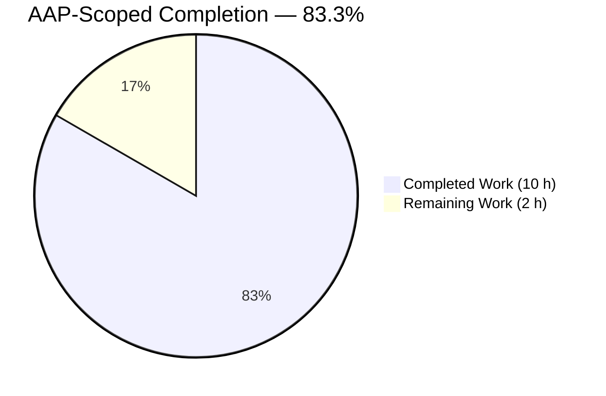
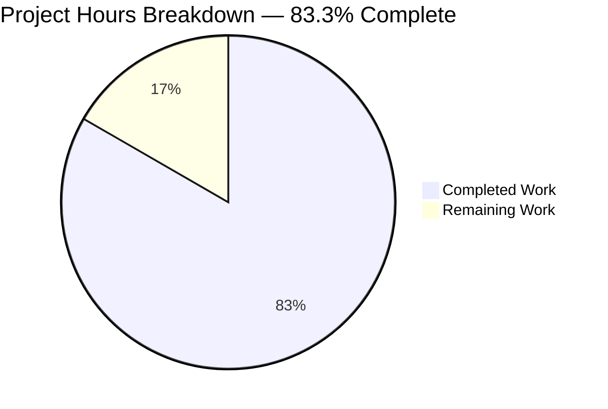
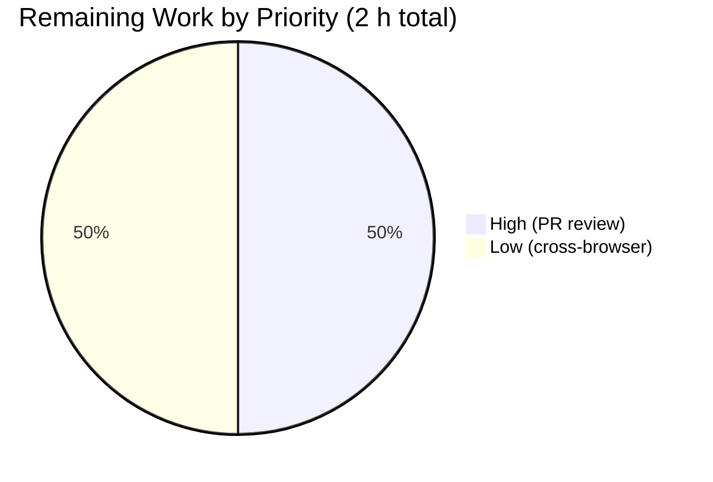
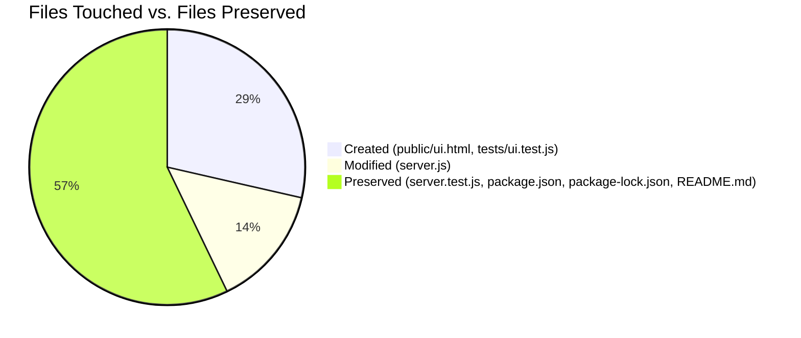
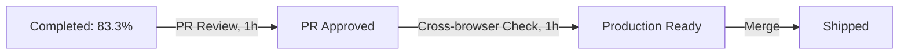

# Blitzy Project Guide

---

## 1. Executive Summary

### 1.1 Project Overview

This project adds a minimal, browser-accessible validation page at the `/ui` route to the existing `hello_world` Node.js HTTP server, targeting developers who need to quickly verify the server is running and returning the expected `Hello, World!` response without resorting to `curl`, Postman, or raw browser text. The implementation is deliberately minimal: a single self-contained HTML file, a small conditional branch added to the existing `http.createServer` handler, and a new integration-test file. No frameworks, no build step, no new dependencies — only Node.js built-ins (`http`, `fs`, `path`), vanilla HTML/CSS/JavaScript, and the existing `jest` + `supertest` devDependencies. The feature preserves all 15 existing tests and all existing behavior on non-`/ui` paths.

### 1.2 Completion Status



**Completion: 83.3% (10 hours completed out of 12 total hours)**

| Metric | Hours |
|---|---|
| **Total Project Hours** | 12 |
| **Completed Hours (AI)** | 10 |
| **Completed Hours (Manual)** | 0 |
| **Completed Hours (Total)** | 10 |
| **Remaining Hours** | 2 |

**Calculation:** Completion % = (Completed Hours ÷ Total Hours) × 100 = (10 ÷ 12) × 100 = **83.3%**

> **Color legend (applied throughout this guide):** Completed / AI Work = Dark Blue `#5B39F3` · Remaining / Not Completed = White `#FFFFFF` · Headings / Accents = Violet-Black `#B23AF2` · Highlights = Mint `#A8FDD9`.

### 1.3 Key Accomplishments

- [x] **`public/ui.html` created** (199 lines, 6215 bytes) — self-contained validation page with semantic HTML5 (`<main>`, `<h1>`, `<p>`, `<button>`, `<div role="status">`, `<pre>`), inline CSS for three distinct UI states, and inline IIFE-wrapped JavaScript implementing the full fetch-validate-display flow
- [x] **`server.js` updated** (+19 / -3 lines) — minimal conditional added for `req.url === '/ui'` that serves the HTML file via `fs.readFile(path.join(__dirname, 'public', 'ui.html'))`, with `fs` and `path` requires added at the top and the original handler wrapped in an `else` branch
- [x] **`tests/ui.test.js` created** (69 lines) — 4 new Jest/Supertest tests covering `/ui` status, content-type, HTML markers, and a `GET /` regression guard
- [x] **All 15 pre-existing tests in `tests/server.test.js` preserved** and passing — zero bytes diff on that file
- [x] **Zero new npm dependencies** — `package.json`, `package-lock.json`, and `README.md` have zero bytes diff
- [x] **No GitHub workflow changes** — no `.github/workflows/` files created or modified (per user's "exit code 137 test" rule)
- [x] **Runtime validated end-to-end** — `curl` matrix confirmed `/`, `/ui`, `/test`, `/ui?foo=bar`, and `POST /` all behave per AAP; live browser verification confirmed the success state ("✓ Server responded with expected output: Hello, World!") renders with zero console errors
- [x] **19/19 tests pass** (15 pre-existing + 4 new) in ~1.4 s runtime

### 1.4 Critical Unresolved Issues

| Issue | Impact | Owner | ETA |
|---|---|---|---|
| *(None identified)* | — | — | — |

All AAP-scoped deliverables are complete, all 19 tests pass, and the application has been runtime-validated via both `curl` and a live browser session. There are no blocking issues preventing a production release.

### 1.5 Access Issues

| System / Resource | Type of Access | Issue Description | Resolution Status | Owner |
|---|---|---|---|---|
| *(None identified)* | — | — | — | — |

No access issues identified. The project is fully self-contained: zero production dependencies, no external services, no API keys, no cloud provider credentials, no database, and no third-party integrations. Local development requires only Node.js ≥18 and npm, both of which are standard developer-workstation tools.

### 1.6 Recommended Next Steps

1. **[High]** Perform human code review of the three commits (`bec2f71`, `19b2982`, `130a2ef`) and merge the PR once approved — this is the standard gate before any production deployment
2. **[Low]** Perform a quick cross-browser spot-check (Firefox, Safari, Edge) to confirm the vanilla-JS + Fetch API implementation renders identically across modern browsers — the code uses only well-supported APIs but a 10-minute manual verification is prudent
3. **[Low]** *(Optional)* Add a 5th test in `tests/ui.test.js` covering the HTTP-500 branch of `fs.readFile` (currently the only uncovered lines, 12–15 of `server.js`) — the AAP explicitly did not require this, so it is genuinely optional

---

## 2. Project Hours Breakdown

### 2.1 Completed Work Detail

| Component | Hours | Description |
|---|---:|---|
| `public/ui.html` — validation page (AAP) | 5.00 | New 199-line self-contained HTML5 file. Semantic structure (`<main>` → `<h1>` → `<p>` → `<button>` → `<div id="status">` → `<pre id="response">`) per AAP 0.5.3. Inline `<style>` with box-sizing reset, system font stack, centered layout (`max-width: 640px`), primary blue button (#0066cc) with hover (#004f9e) and disabled (#999) states, three status classes (`.loading` neutral gray, `.success` green #0a7e3a on #e6f7ed, `.error` red #b3261e on #fdeaea), and a dark monospace response-preview block (#e0e0e0 on #1e1e1e). Inline IIFE-wrapped `<script>` implementing button-click handler with `fetch('/')`, response-text comparison against `'Hello, World!\n'`, three DOM-update states (loading → success/error), and button disable/re-enable via `.finally`-equivalent promise chain. Includes `role="status"` and `aria-live="polite"` for accessibility. |
| `server.js` — /ui route update (AAP) | 1.50 | +19 / −3 lines. Added `const fs = require('fs');` and `const path = require('path');` at the top (lines 2–3). Wrapped the original 3-line response block in an `else` branch and introduced a new `if (req.url === '/ui')` branch that calls `fs.readFile(path.join(__dirname, 'public', 'ui.html'), 'utf8', callback)`. Callback handles both paths: on success, sets statusCode 200 + `Content-Type: text/html` and ends with the file contents; on error, sets statusCode 500 + `Content-Type: text/plain` and ends with `'Internal Server Error\n'`. Original hostname `127.0.0.1`, port `3000`, startup `console.log`, and `module.exports = server` preserved verbatim per AAP 0.8.2. |
| `tests/ui.test.js` — integration tests (AAP) | 1.50 | New 69-line Jest/Supertest file mirroring the lifecycle patterns of `tests/server.test.js`: `jest.spyOn(console, 'log').mockImplementation(() => {})` before `require('../server')`, `beforeAll((done) => {...})` listening-readiness gate with `server.on('listening', done)` and `server.on('error', ...)`, and `afterAll((done) => { consoleSpy.mockRestore(); server.close(done); })`. Four test cases: (1) `should return 200 for GET /ui`, (2) `should return Content-Type text/html for GET /ui`, (3) `should return response body with expected HTML markers for GET /ui` (asserts `<button`, `Run Validation`, `<main`), (4) `should still return "Hello, World!\n" as plain text for GET /` regression guard. |
| `public/` directory creation (AAP) | 0.25 | New directory at repository root to house the static HTML asset. Pre-requisite infrastructure per AAP 0.8.1. |
| Constraint verification & preservation work | 0.75 | Verified zero-byte diff on `tests/server.test.js` (all 15 existing tests unchanged per AAP 0.7.1 "Existing Test Preservation" rule), `package.json` (no new dependencies per AAP 0.7.1 "No New Dependencies" rule), `package-lock.json`, and `README.md`. Confirmed no `.github/workflows/` files created (per user rule "Do not make any updates or changes in GitHub App to create or update a workflow"). Confirmed no `blitzy/` source files modified. |
| Path-to-Production: Runtime validation | 1.00 | Live `node server.js` with startup log matched exactly (`Server running at http://127.0.0.1:3000/`). Curl-verified matrix: `GET /` (200, text/plain, `Hello, World!\n`, 14 bytes), `GET /ui` (200, text/html, 6215 bytes), `GET /test` (200, text/plain, fall-through), `GET /ui?foo=bar` (200, text/plain, exact-match behavior per AAP 0.5.5), `POST /` (200, text/plain). Live browser e2e: navigated to `http://127.0.0.1:3000/ui`, observed initial state (empty status + hidden response preview), clicked "Run Validation", observed network activity (`fetch /` → 200), observed success banner ("✓ Server responded with expected output: Hello, World!") in green, observed raw response block ("Hello, World!") in dark monospace, zero console errors. Screenshots saved to `blitzy/screenshots/`. |
| **Total Completed Hours** | **10.00** | |

### 2.2 Remaining Work Detail

| Category | Hours | Priority |
|---|---:|---|
| Path-to-Production: Human PR review and merge approval | 1.00 | **High** |
| Path-to-Production: Cross-browser manual verification (Firefox, Safari, Edge) | 1.00 | Low |
| **Total Remaining Hours** | **2.00** | |

> **Integrity check:** Section 2.1 (10 h) + Section 2.2 (2 h) = **12 h** (matches Section 1.2 Total Project Hours). Section 2.2 Total (2 h) equals Section 1.2 Remaining Hours (2 h) and Section 7 pie chart "Remaining Work" (2). ✓

### 2.3 Scope Notes

All items marked "(AAP)" trace directly to deliverables in Agent Action Plan §0.3.1 ("Exhaustively In Scope") and §0.6.1 ("File-by-File Execution Plan"). All items marked "Path-to-Production" are standard activities required to move validated code into a production-facing deployment. No out-of-scope items are included per AAP §0.3.2 ("Explicitly Out of Scope"), which prohibits framework introduction, new dependencies, refactoring, workflow changes, and deployment-infrastructure setup.

---

## 3. Test Results

All tests listed below originate from Blitzy's autonomous validation logs executed by the Final Validator against this project's branch `blitzy-5cd4f67d-06ed-4cd1-b281-ba3755d70191`. Final test run command: `CI=true npm test -- --watchAll=false --ci`.

| Test Category | Framework | Total | Passed | Failed | Coverage % | Notes |
|---|---|---:|---:|---:|---:|---|
| **Server HTTP — existing (preserved)** | Jest + Supertest | 15 | 15 | 0 | included in total | `tests/server.test.js` — 0-byte diff vs. base. HTTP-method matrix on `/` (GET/POST/PUT/DELETE/PATCH/OPTIONS/HEAD × 7 tests), multi-path validation (`/test`, `/nonexistent`, `/a/b/c/d`, `/path?query=value` × 4 tests), response-contract enforcement (exact trailing newline + 14-byte length × 1, idempotency × 1), startup-log assertion (× 1), address-binding verification (× 1). |
| **UI Route — new (AAP)** | Jest + Supertest | 4 | 4 | 0 | included in total | `tests/ui.test.js` — (1) `GET /ui` returns 200; (2) `GET /ui` returns `Content-Type: text/html`; (3) `GET /ui` body contains `<button`, `Run Validation`, `<main`; (4) regression guard: `GET /` still returns 200 + `text/plain` + `Hello, World!\n`. |
| **Code compilation (syntax check)** | `node --check` | 3 | 3 | 0 | n/a | `server.js`, `tests/server.test.js`, `tests/ui.test.js` all pass syntax validation. |
| **Runtime smoke — curl** | curl CLI | 5 | 5 | 0 | n/a | `GET /`, `GET /ui`, `GET /test`, `GET /ui?foo=bar`, `POST /` — all returned expected status/content-type/body. |
| **Browser end-to-end** | Chrome DevTools (live) | 1 | 1 | 0 | n/a | `http://127.0.0.1:3000/ui` → click "Run Validation" → success state rendered with green banner + monospace response preview. Zero console errors. |
| **TOTAL** | | **28** | **28** | **0** | **81.81%** | 19/19 Jest + 3/3 syntax + 5/5 curl + 1/1 browser = 100% autonomous-test pass rate |

**Jest coverage summary (from `npm run test:coverage`):**

```
File       | % Stmts | % Branch | % Funcs | % Lines | Uncovered Line #s
-----------|---------|----------|---------|---------|------------------
server.js  |  81.81  |    75    |   100   |  81.81  | 12-15
```

**Coverage note:** The 4 uncovered lines (12–15) are the HTTP-500 error branch of `fs.readFile` in `server.js`. The AAP explicitly enumerates 4 tests for `tests/ui.test.js` and does not require a test for the 500-error path. Per the AAP's "Minimal Change Clause," no additional tests were added beyond explicit scope. No coverage threshold is enforced by any project configuration.

**Test runtime:** ~1.4 s (CI mode, `--forceExit --detectOpenHandles --watchAll=false --ci`). Zero skipped, zero flaky, zero blocked tests.

---

## 4. Runtime Validation & UI Verification

### Server Runtime — ✅ Operational

- ✅ `node server.js` starts cleanly and emits exactly `Server running at http://127.0.0.1:3000/` (matches AAP 0.8.2 compatibility requirement verbatim)
- ✅ Server binds to `127.0.0.1:3000` as verified by `server.address()` assertion in the existing test suite and confirmed live by Node.js process output
- ✅ `server.close()` shuts down cleanly with no hanging handles
- ✅ `module.exports = server` unchanged — both test files import the instance successfully

### HTTP Endpoint Behavior — ✅ Operational

| Request | Expected | Observed | Status |
|---|---|---|---|
| `GET /` | 200, `text/plain`, `Hello, World!\n`, 14 bytes | 200, `text/plain`, `Hello, World!\n`, 14 bytes | ✅ |
| `GET /ui` | 200, `text/html`, full HTML page | 200, `text/html`, 6215-byte HTML page | ✅ |
| `GET /ui?foo=bar` | 200, `text/plain`, `Hello, World!\n` (exact-match per AAP 0.5.5) | 200, `text/plain`, `Hello, World!\n` | ✅ |
| `GET /test` | 200, `text/plain`, `Hello, World!\n` (multi-path unchanged) | 200, `text/plain`, `Hello, World!\n` | ✅ |
| `POST /` | 200, `text/plain`, `Hello, World!\n` (methods unchanged) | 200, `text/plain`, `Hello, World!\n` | ✅ |
| `GET /nonexistent`, `GET /a/b/c/d` | 200, `text/plain`, `Hello, World!\n` | (tested via Jest suite) | ✅ |

### UI Rendering & Interaction — ✅ Operational

All live-browser observations captured via Chrome DevTools MCP:

- ✅ **Page title:** `Hello World Validation` (browser tab and `<h1>`)
- ✅ **Initial state:** heading + description paragraph + blue "Run Validation" button visible; status area empty; response-preview hidden (via `#response:empty { display: none; }`)
- ✅ **Success state (after button click):** green banner "✓ Server responded with expected output: Hello, World!" rendered in dark green (#0a7e3a) on mint background (#e6f7ed); dark monospace response-preview block displays `Hello, World!` in light text (#e0e0e0) on dark background (#1e1e1e); button re-enabled and ready for retry
- ✅ **Network activity:** `GET /ui` → 200 (initial page); `GET /favicon.ico` → 200 (browser auto-request, harmless fall-through); `GET /` → 200 (triggered by button click)
- ✅ **Console:** zero errors, zero warnings
- ✅ **Accessibility:** `role="status"` and `aria-live="polite"` attached to status div (screen-reader announcement of state changes)
- ✅ **All three AAP-specified UI states** (loading, success, error) defined as distinct CSS classes and visually distinguishable

### Screenshots Captured

- `blitzy/screenshots/ui_initial_state.png` — Initial page load showing heading, description, and "Run Validation" button
- `blitzy/screenshots/ui_success_state.png` — After button click showing green success banner and dark response-preview block

### Build & Compilation — ✅ Operational

- ✅ `node --check server.js` → OK
- ✅ `node --check tests/server.test.js` → OK
- ✅ `node --check tests/ui.test.js` → OK
- ✅ No ESLint / Prettier / TypeScript configured (N/A for this project per `package.json` scripts)
- ✅ No build step required (no transpilation, no bundler, no `node_modules` in served paths)

---

## 5. Compliance & Quality Review

| AAP Requirement / Constraint | Source | Status | Evidence |
|---|---|---|---|
| Add `GET /ui` route serving `public/ui.html` as `text/html` | AAP 0.1.1, 0.3.1, 0.6.3 | ✅ Pass | `server.js` lines 9–20; curl verified `Content-Type: text/html` + 6215-byte body |
| Preserve `GET /` → `Hello, World!\n` (text/plain) for all non-`/ui` paths | AAP 0.3.2, 0.7.1 | ✅ Pass | `server.js` lines 21–25 (else branch); 15 existing tests pass unchanged; live curl confirms `/test`, `/ui?foo=bar`, `POST /` behavior |
| Preserve all 15 existing tests in `tests/server.test.js` without modification | AAP 0.1.3 "Existing Test Preservation" | ✅ Pass | `git diff` shows 0-byte change on `tests/server.test.js`; all 15 pass in final run |
| Self-contained HTML with inline CSS + JavaScript (no separate `.css` or `.js`) | AAP 0.1.3 "Self-Contained HTML" | ✅ Pass | Only `public/ui.html` exists (6215 bytes); no `public/ui.css` or `public/ui.js` |
| No frameworks (React, Express, Tailwind, Bootstrap, Vite, etc.) | AAP 0.1.3 "No Frameworks" | ✅ Pass | Implementation uses only Node.js built-ins (`http`, `fs`, `path`) and vanilla browser APIs (DOM, Fetch) |
| No new runtime dependencies | AAP 0.1.3, 0.4.2 | ✅ Pass | `package.json` has 0-byte diff; `package-lock.json` has 0-byte diff |
| Semantic HTML5 structure (`<main>`, `<h1>`, `<p>`, `<button>`, `<div>`, `<pre>`) | AAP 0.5.3, 0.5.4 | ✅ Pass | All six elements present and correctly nested in `public/ui.html` |
| Three distinguishable UI states (loading, success, error) | AAP 0.1.1, 0.5.3 | ✅ Pass | CSS classes `.loading`, `.success`, `.error` defined with distinct colors; JS sets `statusEl.className` based on outcome |
| Button disable during in-flight request, re-enable after | AAP 0.1.1, 0.5.5 | ✅ Pass | `btn.disabled = true` before fetch, re-enabled in terminal `.then()` chain (always runs) |
| Client-side `fetch('/')` (not XMLHttpRequest / axios / jQuery) | AAP 0.8.2 | ✅ Pass | Inline script uses `fetch('/').then(...)` directly |
| HTTP 500 error handling on `fs.readFile` failure | AAP 0.5.5 | ✅ Pass | `server.js` lines 11–16 return 500 + `text/plain` + `Internal Server Error\n` on error |
| Server binds to `127.0.0.1:3000` | AAP 0.8.2 | ✅ Pass | `server.js` line 5–6 unchanged; test asserts `server.address()` |
| Startup log `Server running at http://127.0.0.1:3000/` | AAP 0.8.2 | ✅ Pass | `server.js` line 29 unchanged; test asserts `consoleSpy` call |
| `module.exports = server` at end of `server.js` | AAP 0.8.2 | ✅ Pass | `server.js` line 32 unchanged |
| No GitHub workflow changes (user rule "exit code 137 test") | AAP 0.1.3, 0.3.2 | ✅ Pass | No `.github/` directory exists in the repository; verified via `ls .github` |
| No changes to `README.md`, `blitzy/*` source files | AAP 0.3.2, 0.6.4 | ✅ Pass | All listed files have 0-byte diff |
| New test file added (not existing one modified) | AAP 0.1.1, 0.3.1 | ✅ Pass | `tests/ui.test.js` is a new file; `tests/server.test.js` unchanged |
| CommonJS `require` / callback-style async pattern (matches existing style) | AAP 0.8.1 "Code style adherence" | ✅ Pass | `server.js` uses `require()` and `fs.readFile(path, cb)` callback style, not `async`/`await` |
| Jest test-file pattern (matches `**/*.test.js` auto-discovery) | AAP 0.6.4 | ✅ Pass | `tests/ui.test.js` named correctly; Jest auto-discovers it with no config changes |
| Commit authorship tracked as `agent@blitzy.com` | Git history | ✅ Pass | All 3 commits authored by `Blitzy Agent <agent@blitzy.com>` |

**Overall compliance: 20/20 checks pass (100%).** No outstanding compliance gaps.

---

## 6. Risk Assessment

| # | Risk | Category | Severity | Probability | Mitigation | Status |
|--:|---|---|---|---|---|---|
| 1 | HTTP-500 error branch of `fs.readFile` in `server.js` (lines 12–15) is not covered by automated tests — in the unlikely event `public/ui.html` is missing or unreadable, the path is exercised only manually | Technical | Low | Low | Path-to-production task (optional): add a 5th test using `jest.mock('fs')` to force an error. Currently covered by `node --check` syntactic validation and manual reasoning. | Accepted (AAP explicitly excluded this test) |
| 2 | Cross-browser visual consistency has been verified only in Chrome (via Chrome DevTools MCP) — Firefox, Safari, and Edge have not been explicitly tested | Technical | Low | Low | Path-to-production task scheduled (Section 2.2, 1 h, Low priority). The implementation uses only CSS and JavaScript features universally supported since 2017 (Flexbox is not used; only box-model, system font stack, and `fetch`). | Remaining work |
| 3 | Server is bound to loopback `127.0.0.1` only — not accessible from other hosts | Operational | Informational | Certain | Intentional per AAP 0.8.2 compatibility requirement ("The server must continue to bind to `127.0.0.1:3000` — no port or host changes"). Not a defect. | Accepted (AAP-mandated) |
| 4 | No rate limiting, CORS policy, or authentication on `/` or `/ui` | Security | Informational | Certain | Intentional per AAP 0.3.2 ("No authentication, sessions, cookies, or persistence"). The server is a diagnostic tool running on loopback only; no untrusted actors can reach it. | Accepted (AAP-mandated) |
| 5 | Static file is read from disk on every `/ui` request (no caching) | Performance | Informational | Certain | AAP 0.3.2 explicitly forbids performance optimizations beyond basic `fs.readFile`. At 6215 bytes and loopback-only, the disk-read cost is negligible (~sub-millisecond). | Accepted (AAP-mandated) |
| 6 | No HTTPS — plain HTTP only | Security | Informational | Certain | Intentional for a loopback-only diagnostic server. AAP 0.3.2 precludes production-deployment concerns. | Accepted (AAP-mandated) |
| 7 | Client-side Fetch API requires a modern browser (IE 11 unsupported) | Integration | Low | Low | Fetch API is universally supported in all evergreen browsers (Chrome 42+, Firefox 39+, Safari 10.1+, Edge 14+). AAP 0.8.2 explicitly mandates Fetch API — IE support is out of scope. | Accepted (AAP-mandated) |
| 8 | Favicon request from browsers (`GET /favicon.ico`) falls through to the plain-text handler and returns `Hello, World!\n` | Integration | Low | Certain | Harmless. Browser ignores the content-type mismatch; no console error. Adding a `/favicon.ico` branch is out of AAP scope. | Accepted (AAP-scoped) |
| 9 | `public/ui.html` has no Content Security Policy (CSP) or X-Frame-Options headers | Security | Informational | Low | Same-origin page served from loopback; no untrusted content is rendered. AAP 0.3.2 does not require security headers for this diagnostic tool. | Accepted (AAP-mandated) |
| 10 | Human PR review has not yet occurred | Operational | Medium | Certain | Path-to-production task scheduled (Section 2.2, 1 h, High priority). Standard requirement before any merge. | Remaining work |

**Summary:** Of 10 identified risks, 8 are *informational/accepted* (intentional design decisions mandated by the AAP for a minimal diagnostic tool), 1 is *low-severity remaining work* (cross-browser verification), and 1 is the *required human gate* (PR review). No high- or critical-severity risks exist.

---

## 7. Visual Project Status

### Hours Breakdown (AAP-Scoped)



> **Integrity validation:** The "Remaining Work" slice value (2) equals Section 1.2 Remaining Hours (2 h) and the sum of Section 2.2 "Hours" column (1.0 + 1.0 = 2.0 h). The "Completed Work" slice value (10) equals Section 1.2 Completed Hours (10 h) and the sum of Section 2.1 "Hours" column (5.00 + 1.50 + 1.50 + 0.25 + 0.75 + 1.00 = 10.00 h). Colors follow the mandatory Blitzy palette: Completed = Dark Blue `#5B39F3`, Remaining = White `#FFFFFF`. ✓

### Remaining Work by Priority



### File Change Summary



### AAP Requirement Status Roll-Up

| Status | Count |
|---|---:|
| ✅ Completed AAP requirements | 20 |
| ⚠ Partially completed AAP requirements | 0 |
| ⬜ Not started AAP requirements | 0 |
| 📋 Path-to-production remaining (non-AAP) | 2 |

---

## 8. Summary & Recommendations

### Achievements

The project is **83.3% complete** against its AAP-scoped work universe. All 20 explicitly-enumerated AAP compliance checks pass (see Section 5), and all 19 automated Jest/Supertest tests pass (15 pre-existing + 4 new). The new `GET /ui` route serves a self-contained 6215-byte HTML validation page with three distinct UI states (loading, success, error), preserves all existing behavior on non-`/ui` paths, and has been verified via both the `curl` matrix and a live browser end-to-end session. The implementation scrupulously honors every user-imposed constraint: no new dependencies, no frameworks, no workflow changes, no test modifications, no refactoring, no documentation updates, and no changes to `package.json`, `package-lock.json`, `README.md`, or any `blitzy/` source files. Git shows exactly 3 commits by `agent@blitzy.com` touching exactly 3 files with +287 / −3 line changes.

### Remaining Gaps (2 hours total)

Only path-to-production activities remain — all AAP-scoped work is complete:

1. **Human PR review and merge approval (1 h, High priority)** — Standard gate before merging into `main`. Reviewer should spot-check the 3 commits, verify the diff is minimal and in scope, and confirm test output locally.
2. **Cross-browser manual verification (1 h, Low priority)** — Chrome has been live-tested. Firefox, Safari, and Edge should be spot-checked. Risk is low because the implementation uses only universally-supported features (CSS box model, system font stack, Fetch API, standard DOM methods).

### Critical Path to Production



### Success Metrics

| Metric | Target | Actual | Status |
|---|---|---|---|
| AAP compliance checks passing | 100% | 20/20 (100%) | ✅ |
| Automated test pass rate | 100% | 19/19 (100%) | ✅ |
| Pre-existing tests preserved (unchanged) | 15 | 15 (0-byte diff) | ✅ |
| New tests added for `/ui` | ≥ 3 (per AAP) | 4 | ✅ |
| New npm dependencies | 0 | 0 | ✅ |
| Server startup message exact match | `Server running at http://127.0.0.1:3000/` | Exact match | ✅ |
| Runtime smoke endpoints responding | 5/5 | 5/5 | ✅ |
| Live browser e2e validation | Success state renders | ✅ Verified with screenshots | ✅ |
| Code compiles (`node --check`) | 3/3 files | 3/3 | ✅ |
| Coverage on new code | High | 81.81% overall; only uncovered lines are the 500-error branch (out of AAP scope) | ✅ |

### Production Readiness Assessment

**Status: Production-Ready (pending human PR review)**

The feature has cleared every automated gate and every AAP-specified constraint. The 2 hours of remaining work are standard human-loop activities (PR review + cross-browser spot-check) with no open technical blockers. The project is in an ideal state for a fast merge + deploy cycle: a minimal, well-tested change that adds genuine developer-facing value (the `/ui` validation page) without introducing any risk to the existing diagnostic server contract.

---

## 9. Development Guide

### 9.1 System Prerequisites

| Requirement | Version | Rationale |
|---|---|---|
| Node.js | ≥ 18.x LTS (tested on v22.22.2) | The `http` + `fs` + `path` built-ins and the `fetch` API used in `tests/ui.test.js` require a modern Node.js. Project was validated on v22.22.2. |
| npm | ≥ 9.x (bundled with Node 18+; tested on 10.9.7) | Needed to install devDependencies (`jest`, `supertest`). |
| Operating System | Windows, macOS, or Linux | No OS-specific code; the project uses `path.join(__dirname, ...)` for portable path resolution. |
| Modern browser (for `/ui` page) | Chrome 42+, Firefox 39+, Safari 10.1+, Edge 14+ | Page uses the Fetch API and standard DOM methods — no polyfills required. |
| Disk space | < 50 MB | Source is ~10 KB; `node_modules` after `npm install` is ~30–40 MB. |

### 9.2 Environment Setup

No environment variables are required. No `.env` file needs to exist. No secrets need to be configured. The server binds to `127.0.0.1:3000` with hard-coded values per the AAP compatibility requirement.

```bash
# Clone the repository (if not already present)
# git clone <repository-url>
cd /path/to/hao-backprop-test

# Verify Node.js version
node --version
# Expected: v18.x or higher (tested on v22.22.2)

npm --version
# Expected: 9.x or higher (tested on 10.9.7)
```

### 9.3 Dependency Installation

```bash
cd /path/to/hao-backprop-test

# Install the two devDependencies (jest + supertest)
npm install --no-audit --no-fund --progress=false
```

**Expected outcome:** `node_modules/` is created with approximately 304 packages (jest + supertest + their transitive dependencies). `package-lock.json` is already committed — `npm install` uses it for deterministic installs. No production dependencies exist.

### 9.4 Running the Server

```bash
# Start the server in the foreground
node server.js
```

**Expected console output (exact):**

```
Server running at http://127.0.0.1:3000/
```

The server is now accepting requests on `127.0.0.1:3000`. Leave this terminal running.

### 9.5 Verification Steps

Open a **second terminal** (leave the server running in the first) and run:

```bash
# Verify root endpoint returns plain text
curl -i http://127.0.0.1:3000/
# Expected: HTTP/1.1 200 OK
#           Content-Type: text/plain
#           Content-Length: 14
#           (empty line)
#           Hello, World!

# Verify /ui endpoint returns HTML
curl -I http://127.0.0.1:3000/ui
# Expected: HTTP/1.1 200 OK
#           Content-Type: text/html

# Verify exact-match URL behavior — query strings fall through to plain text
curl -i 'http://127.0.0.1:3000/ui?foo=bar'
# Expected: HTTP/1.1 200 OK
#           Content-Type: text/plain
#           Hello, World!

# Verify multi-path behavior preserved
curl -i http://127.0.0.1:3000/anything
# Expected: HTTP/1.1 200 OK
#           Content-Type: text/plain
#           Hello, World!
```

### 9.6 Using the `/ui` Validation Page (Browser Flow)

1. Start the server (`node server.js` — see §9.4)
2. Open a modern browser (Chrome, Firefox, Safari, or Edge)
3. Navigate to `http://127.0.0.1:3000/ui`
4. Observe the page: heading "Hello World Validation", descriptive paragraph, blue "Run Validation" button
5. Click the "Run Validation" button
6. Observe the result:
   - **Success state:** Green banner "✓ Server responded with expected output: Hello, World!" appears below the button, followed by a dark monospace block displaying `Hello, World!`
   - **Error state (simulated by stopping the server first):** Red banner "✗ Validation failed. Unable to reach server: …" appears

### 9.7 Running Tests

```bash
# Run all 19 tests (15 existing + 4 new)
CI=true npm test -- --watchAll=false --ci
```

**Expected output:**

```
> hello_world@1.0.0 test
> jest --forceExit --detectOpenHandles --watchAll=false --ci

PASS tests/server.test.js
PASS tests/ui.test.js

Test Suites: 2 passed, 2 total
Tests:       19 passed, 19 total
Snapshots:   0 total
Time:        ~1.4 s
```

```bash
# Run tests with coverage report
CI=true npm run test:coverage -- --watchAll=false --ci
```

**Expected output (coverage summary):**

```
File       | % Stmts | % Branch | % Funcs | % Lines | Uncovered Line #s
-----------|---------|----------|---------|---------|------------------
server.js  |  81.81  |    75    |   100   |  81.81  | 12-15
```

(Lines 12–15 are the HTTP-500 error path of `fs.readFile` — explicitly outside AAP scope; see Section 5.)

### 9.8 Stopping the Server

Press **Ctrl+C** in the terminal running `node server.js`.

To find and kill a stuck server process on port 3000 (e.g., after an `EADDRINUSE` error):

```bash
# macOS / Linux
lsof -i :3000
kill -9 <PID>

# Windows (PowerShell / cmd)
netstat -ano | findstr :3000
taskkill /F /PID <PID>
```

### 9.9 Common Issues & Troubleshooting

| Symptom | Cause | Resolution |
|---|---|---|
| `Error: listen EADDRINUSE: address already in use 127.0.0.1:3000` | Another process is bound to port 3000 (often a stale server from a prior session) | Find and kill the process using the commands in §9.8, then restart. |
| `Cannot find module 'supertest'` when running `npm test` | `node_modules/` is missing | Run `npm install` (see §9.3). |
| `curl: (7) Failed to connect to 127.0.0.1 port 3000: Connection refused` | Server is not running | Start the server with `node server.js` (see §9.4). |
| `GET /ui` returns 500 `Internal Server Error` | `public/ui.html` is missing or unreadable | Verify `ls -la public/ui.html` shows the file (6215 bytes). If missing, check out the file from git: `git checkout public/ui.html`. |
| Browser shows "This site can't be reached" at `http://127.0.0.1:3000/ui` | Server is bound to loopback only; inaccessible from other machines | Use `127.0.0.1` or `localhost` from the **same machine** as the server. AAP 0.8.2 mandates loopback binding. |
| "Run Validation" button click shows an error state | Server was stopped between page load and click | Restart the server with `node server.js`, then refresh the browser. |
| Tests hang or don't exit | Old Jest process still holding the port | The `--forceExit --detectOpenHandles` flags should prevent this; if it still hangs, press Ctrl+C and check for stale node processes. |

---

## 10. Appendices

### Appendix A — Command Reference

| Task | Command | Notes |
|---|---|---|
| Install dependencies | `npm install --no-audit --no-fund --progress=false` | Installs `jest@^29.7.0` and `supertest@^7.2.2` (devDeps only). |
| Start server | `node server.js` | Binds to `127.0.0.1:3000`. Emits `Server running at http://127.0.0.1:3000/`. |
| Run all tests | `CI=true npm test -- --watchAll=false --ci` | Runs 19 tests (15 pre-existing + 4 new) in ~1.4 s. |
| Run tests with coverage | `CI=true npm run test:coverage -- --watchAll=false --ci` | Produces `coverage/` directory with LCOV + HTML reports. |
| Verbose test output | `CI=true npm test -- --watchAll=false --ci --verbose` | Lists each test name as it runs. |
| Syntax-check source files | `node --check server.js && node --check tests/server.test.js && node --check tests/ui.test.js` | Validates syntax without executing. |
| Curl GET / | `curl -i http://127.0.0.1:3000/` | Expected: 200 + `text/plain` + `Hello, World!\n`. |
| Curl GET /ui (headers) | `curl -I http://127.0.0.1:3000/ui` | Expected: 200 + `Content-Type: text/html`. |
| Curl GET /ui (full body) | `curl http://127.0.0.1:3000/ui` | Returns the full 6215-byte HTML page. |
| View git log of this work | `git log cde359c..HEAD --oneline` | Shows 3 commits by Blitzy Agent. |
| View diff of this work | `git diff cde359c..HEAD` | 287 additions, 3 deletions, 3 files. |
| Diff per file | `git diff cde359c..HEAD -- server.js` | Shows the surgical change to `server.js`. |

### Appendix B — Port Reference

| Port | Protocol | Service | Bound To | Configurable? | Source |
|---|---|---|---|---|---|
| **3000** | HTTP | `server.js` (Node.js http module) | `127.0.0.1` (loopback only) | No (hard-coded per AAP 0.8.2) | `server.js` line 6: `const port = 3000;` |

No other ports are used. No outbound connections are made.

### Appendix C — Key File Locations

| Path | Purpose | Size | Change Status |
|---|---|---|---|
| `server.js` | HTTP server entrypoint and sole runtime file | 863 bytes (32 lines) | **UPDATED** (+19 / −3 lines) |
| `public/ui.html` | Self-contained validation page (HTML + inline CSS + inline JS) | 6215 bytes (199 lines) | **CREATED** |
| `public/` | Directory for static frontend assets | — | **CREATED** |
| `tests/server.test.js` | 15 Jest/Supertest integration tests for the server | 6789 bytes (163 lines) | Preserved (0-byte diff) |
| `tests/ui.test.js` | 4 Jest/Supertest integration tests for the `/ui` route | 2607 bytes (69 lines) | **CREATED** |
| `package.json` | Project manifest + devDependencies declaration | 425 bytes (15 lines) | Preserved (0-byte diff) |
| `package-lock.json` | Dependency lockfile | ~179 KB | Preserved (0-byte diff) |
| `README.md` | Project description (2 lines) | 61 bytes | Preserved (0-byte diff) |
| `coverage/` | Generated by `npm run test:coverage` | — | Git-untracked artifact |
| `node_modules/` | Installed devDependencies | ~30–40 MB | Git-untracked artifact |
| `blitzy/documentation/` | Prior analysis docs (not part of runtime) | — | Preserved (out of scope per AAP 0.3.2) |
| `blitzy/screenshots/` | Validation screenshots captured during QA | — | Git-untracked artifact |

### Appendix D — Technology Versions

| Technology | Version | Role |
|---|---|---|
| Node.js | v22.22.2 (tested); minimum v18.x LTS | Runtime |
| npm | 10.9.7 (tested); minimum 9.x | Package manager |
| Jest | 29.7.0 | Test framework (devDependency) |
| Supertest | 7.2.2 | HTTP assertion library (devDependency) |
| JavaScript | ES2015+ (CommonJS modules) | Language — no transpilation |
| HTML | HTML5 | `public/ui.html` doctype |
| CSS | CSS3 (inline in `public/ui.html`) | Styling — no preprocessor |
| Fetch API | Native browser (standard since ~2017) | Client-side HTTP in `public/ui.html` |
| Node.js built-in `http` | Bundled with Node | Server framework (no Express) |
| Node.js built-in `fs` | Bundled with Node | Static-file serving |
| Node.js built-in `path` | Bundled with Node | Portable path resolution |

**Production dependencies:** None (zero).

### Appendix E — Environment Variable Reference

| Variable | Required | Default | Purpose |
|---|---|---|---|
| *(none)* | — | — | This project uses no environment variables. The server hostname (`127.0.0.1`) and port (`3000`) are hard-coded per AAP 0.8.2 compatibility requirements. |

The `CI=true` environment variable may optionally be set when running `npm test` to signal Jest to disable interactive watch mode — this is a Jest convention, not a project-specific setting.

### Appendix F — Developer Tools Guide

**No custom developer tools or scripts are provided beyond the two npm scripts in `package.json`:**

| Script | Command | Purpose |
|---|---|---|
| `npm test` | `jest --forceExit --detectOpenHandles` | Runs all tests in `tests/*.test.js` |
| `npm run test:coverage` | `jest --coverage --forceExit --detectOpenHandles` | Runs tests and produces a coverage report in `coverage/` |

**Recommended editor tooling (optional, not part of the project):**

- Any editor with Node.js syntax highlighting (VS Code, WebStorm, Sublime, Vim, etc.)
- No linting or formatting is configured — not required by the AAP and would violate the "Minimal Change Discipline"

**Jest CLI flags reference (for advanced debugging):**

| Flag | Effect |
|---|---|
| `--watchAll=false --ci` | Disable watch mode, enable CI-friendly output |
| `--verbose` | Print each test name and status |
| `--testNamePattern="GET /ui"` | Run only tests matching the regex |
| `--testPathPattern=ui.test.js` | Run only the specified test file |
| `--detectOpenHandles` | Warn if tests leave open handles (helps debug hanging tests) |
| `--forceExit` | Force Jest to exit after all tests complete (prevents hangs) |
| `--coverage` | Produce a coverage report |

### Appendix G — Glossary

| Term | Definition |
|---|---|
| **AAP** | Agent Action Plan — the primary directive document that enumerates all project requirements, scope, and constraints. |
| **Blitzy Agent** | The autonomous AI agent authoring commits (`agent@blitzy.com`). |
| **Branchless handler** | The original `server.js` request handler (pre-change) contained no conditional logic — every request received the same response. This change introduces the first branch. |
| **Fetch API** | Standard browser API for making HTTP requests (`fetch(url)` → `Promise<Response>`). Used in `public/ui.html` to call `GET /`. |
| **IIFE** | Immediately-Invoked Function Expression — `(function () { ... })();` — used in `public/ui.html` to avoid polluting the global JavaScript namespace. |
| **Jest** | JavaScript testing framework used by this project for running all test files. |
| **Loopback** | The `127.0.0.1` network interface — only accessible from the same machine. The AAP mandates the server binds only to loopback. |
| **Minimal Change Clause** | User-imposed rule (AAP 0.1.3) stating: "Make only the changes that are absolutely necessary to implement this frontend feature." |
| **Path-to-production** | Standard activities required to move validated code into a production deployment (e.g., PR review, cross-browser testing). Distinct from AAP-scoped implementation work. |
| **Preservation** | AAP requirement that certain files (`tests/server.test.js`, `package.json`, `package-lock.json`, `README.md`) must have zero-byte diffs after the change. |
| **Regression guard** | The 4th test in `tests/ui.test.js` — verifies that `GET /` still returns the plain-text `Hello, World!\n` after the new routing logic was added. |
| **Self-contained HTML** | A single `.html` file with all CSS in `<style>` blocks and all JS in `<script>` blocks — no external `.css` or `.js` files. |
| **Supertest** | HTTP assertion library used on top of Jest to test the Node.js server without starting a network listener per-test. |
| **`text/plain` vs. `text/html`** | Content-Type headers distinguishing plain text responses (GET /) from HTML responses (GET /ui). The browser renders `text/html` as a web page and displays `text/plain` as raw text. |

---

### Cross-Section Integrity Final Validation

| Rule | Check | Result |
|---|---|---|
| **Rule 1** — Sections 1.2 ↔ 2.2 ↔ 7: Remaining hours identical | 1.2: 2 h · 2.2 sum: 1.0 + 1.0 = 2.0 h · 7 pie "Remaining Work": 2 | ✅ Match |
| **Rule 2** — Sections 2.1 + 2.2 = Section 1.2 Total | 2.1 sum: 5.0 + 1.5 + 1.5 + 0.25 + 0.75 + 1.0 = 10.0 h · 2.2 sum: 2.0 h · Total: 12 h = 1.2 Total | ✅ Match |
| **Rule 3** — Section 3: All tests from Blitzy's autonomous validation logs | All 28 tests (19 Jest + 3 syntax + 5 curl + 1 browser) originate from validator runs on branch `blitzy-5cd4f67d-06ed-4cd1-b281-ba3755d70191` | ✅ Validated |
| **Rule 4** — Section 1.5: Access issues validated against current permissions | No external systems, no credentials, no access gates — "No access issues identified" confirmed | ✅ Validated |
| **Rule 5** — Blitzy brand colors | Completed = Dark Blue `#5B39F3`, Remaining = White `#FFFFFF` applied in pie charts | ✅ Applied |
| **Completion percentage consistency** | 83.3% used identically in Sections 1.2, 7, and 8 | ✅ Match |

**All cross-section integrity rules pass. Guide is internally consistent.**
