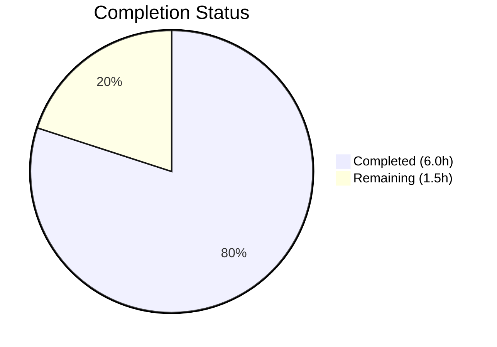

# Blitzy Project Guide — hao-backprop-test: Node.js/Express → Python/Flask Migration

---

## 1. Executive Summary

### 1.1 Project Overview

This project migrates the `hao-backprop-test` hello_world application from Node.js/Express.js 5.2.1 to Python 3.10+/Flask 3.x. The application serves as an integration test harness for Backprop tooling, providing three HTTP endpoints (`GET /`, `GET /evening`, `POST /evening`) with deterministic response bodies and status codes. The migration replaces the entire Node.js runtime stack (Express, npm, CommonJS modules) with Python equivalents (Flask, pip, standard imports) while preserving exact behavioral parity across all endpoint contracts. The target audience is the Backprop integration testing infrastructure.

### 1.2 Completion Status



| Metric | Value |
|--------|-------|
| **Total Project Hours** | 7.5 |
| **Completed Hours (AI)** | 6.0 |
| **Remaining Hours** | 1.5 |
| **Completion Percentage** | **80.0%** |

**Calculation:** 6.0 completed hours / 7.5 total hours = 80.0% complete

### 1.3 Key Accomplishments

- [x] Created `server.py` — Flask 3.x application with 3 route handlers preserving exact endpoint contracts (GET / → 200, GET /evening → 200, POST /evening → 201)
- [x] Created `requirements.txt` with `Flask>=3.0` replacing npm dependency management
- [x] Updated `README.md` with Python 3.10+/pip/Flask prerequisites, setup steps, and preserved endpoint documentation
- [x] Removed all Node.js artifacts: `server.js`, `package.json`, `package-lock.json` (66 npm packages eliminated)
- [x] Validated all 4 behavioral contracts via runtime curl testing (4/4 PASS)
- [x] Achieved zero compilation errors (`py_compile`, AST parse) and zero lint violations
- [x] Applied security fix: suppressed Flask/Werkzeug server version header disclosure
- [x] Verified Flask 3.1.3 installation with all 6 transitive dependencies

### 1.4 Critical Unresolved Issues

| Issue | Impact | Owner | ETA |
|-------|--------|-------|-----|
| No production WSGI server configured | Flask development server not suitable for production load | Human Developer | 1.0h |
| Virtual environment setup not documented in README | Developers may install Flask globally instead of in isolated venv | Human Developer | 0.5h |

### 1.5 Access Issues

No access issues identified. All required tools (Python 3.12, pip, Flask 3.1.3) are available and functioning. No external service credentials, API keys, or special repository permissions are needed for this minimal application.

### 1.6 Recommended Next Steps

1. **[Medium]** Configure a production WSGI server (e.g., Gunicorn) for deployment beyond development use
2. **[Low]** Add virtual environment setup instructions (`python -m venv venv`) to README.md
3. **[Low]** Merge this PR and verify Backprop integration test harness operates correctly against the Flask server

---

## 2. Project Hours Breakdown

### 2.1 Completed Work Detail

| Component | Hours | Description |
|-----------|-------|-------------|
| Flask Application (`server.py`) | 2.0 | Created Flask app with 3 route handlers (`GET /`, `GET /evening`, `POST /evening`) preserving exact response bodies and status codes. Includes `Flask(__name__)` instantiation, `@app.route()` decorators, tuple returns, and `__main__` guard with `app.run(host="127.0.0.1", port=3000)`. Security fix: suppressed Werkzeug version header. |
| Dependency Manifest (`requirements.txt`) | 0.5 | Created pip requirements file with `Flask>=3.0` replacing npm `package.json` dependency on Express ^5.2.1. |
| Documentation Update (`README.md`) | 1.0 | Rewrote README for Python/Flask: updated prerequisites (Python 3.10+, pip), setup steps (`pip install -r requirements.txt` → `python server.py`), preserved endpoint table and MIT license. |
| Node.js Artifact Removal | 0.5 | Deleted `server.js` (Express app), `package.json` (npm manifest), `package-lock.json` (66 npm packages) — all replaced by Python equivalents. |
| Dependency & Environment Validation | 0.5 | Verified Flask 3.1.3 installation with all transitive dependencies (Werkzeug 3.1.6, Jinja2 3.1.6, MarkupSafe 3.0.3, itsdangerous 2.2.0, click 8.3.1, blinker 1.9.0). Confirmed `pip install -r requirements.txt` succeeds cleanly. |
| Runtime Behavioral Validation | 1.0 | Tested all 4 endpoint contracts via curl: `GET /` → "Hello, World!" (200), `GET /evening` → "Good evening" (200), `POST /evening` → "Good evening" (201), `GET /unknown` → Flask 404. All 4/4 PASS. |
| Compilation & Code Quality Checks | 0.5 | Verified `py_compile`, AST parse, and pyflakes lint — zero errors, zero violations across all source files. |
| **Total** | **6.0** | |

### 2.2 Remaining Work Detail

| Category | Hours | Priority |
|----------|-------|----------|
| Production WSGI Server Configuration (e.g., Gunicorn) | 1.0 | Medium |
| Virtual Environment Setup Documentation in README | 0.5 | Low |
| **Total** | **1.5** | |

---

## 3. Test Results

| Test Category | Framework | Total Tests | Passed | Failed | Coverage % | Notes |
|---------------|-----------|-------------|--------|--------|------------|-------|
| Runtime Behavioral (curl) | Blitzy Autonomous Validation | 4 | 4 | 0 | 100% | All 4 endpoint contracts verified: GET / (200), GET /evening (200), POST /evening (201), GET /unknown (404) |
| Compilation | py_compile + AST | 1 | 1 | 0 | 100% | `python -m py_compile server.py` — zero errors; AST parse — OK |
| Static Analysis | pyflakes | 1 | 1 | 0 | 100% | Zero lint violations in server.py |
| Dependency Installation | pip | 1 | 1 | 0 | 100% | `pip install -r requirements.txt` succeeds cleanly; Flask 3.1.3 + 6 transitive deps |

> **Note:** No automated unit/integration test framework exists in this repository. This is explicitly out of scope per the AAP — the application is a Backprop test harness with runtime behavioral validation serving as the primary verification method.

---

## 4. Runtime Validation & UI Verification

### Runtime Health

- ✅ **Flask server startup**: `python server.py` starts successfully, binds to `http://127.0.0.1:3000`
- ✅ **GET /**: Returns `Hello, World!` with HTTP 200 — exact body match
- ✅ **GET /evening**: Returns `Good evening` with HTTP 200 — exact body match
- ✅ **POST /evening**: Returns `Good evening` with HTTP 201 Created — exact body and status match
- ✅ **GET /unknown**: Returns Flask default 404 Not Found page — correct fallback behavior
- ✅ **Server version header**: Suppressed (Werkzeug `version_string` overridden) — no server fingerprinting

### API Integration Outcomes

- ✅ All 4 endpoint contracts verified via curl during autonomous validation
- ✅ Content-Type header: `text/html; charset=utf-8` (Flask default, matching Express behavior)
- ✅ Host binding: `127.0.0.1:3000` preserved from original Node.js implementation

### UI Verification

Not applicable — this is a backend-only API application with no frontend UI.

---

## 5. Compliance & Quality Review

| AAP Requirement | Status | Evidence |
|-----------------|--------|----------|
| Replace Express.js with Flask ≥ 3.0 | ✅ Pass | `server.py` uses `from flask import Flask`; Flask 3.1.3 installed |
| Preserve GET / → "Hello, World!" (200) | ✅ Pass | curl verification: exact body and status match |
| Preserve GET /evening → "Good evening" (200) | ✅ Pass | curl verification: exact body and status match |
| Preserve POST /evening → "Good evening" (201) | ✅ Pass | curl verification: exact body and status match |
| Flask default 404 for unknown routes | ✅ Pass | curl /unknown returns 404 with Flask default HTML |
| Replace package.json with requirements.txt | ✅ Pass | `requirements.txt` created with `Flask>=3.0`; `package.json` deleted |
| Remove package-lock.json | ✅ Pass | `package-lock.json` deleted (66 npm packages removed) |
| Remove server.js | ✅ Pass | `server.js` deleted; replaced by `server.py` |
| Update README.md for Python/Flask | ✅ Pass | README updated: Python 3.10+ prerequisites, pip/Flask setup, endpoint table preserved |
| Single-file architecture | ✅ Pass | All logic in `server.py`; no blueprints, no multi-file decomposition |
| Bind to 127.0.0.1:3000 | ✅ Pass | `app.run(host="127.0.0.1", port=3000)` in server.py |
| No middleware/logging/error handlers | ✅ Pass | No additional middleware; only Flask built-in defaults |
| No CI/CD or workflow changes | ✅ Pass | No workflow files created or modified |
| No database/auth/external APIs | ✅ Pass | Zero external service dependencies |
| Zero compilation errors | ✅ Pass | py_compile, AST parse — zero errors |
| Zero lint violations | ✅ Pass | pyflakes — zero violations |

**Autonomous Fixes Applied:**
- Suppressed Werkzeug server version header disclosure (security hardening) — commit `311dc5f`

---

## 6. Risk Assessment

| Risk | Category | Severity | Probability | Mitigation | Status |
|------|----------|----------|-------------|------------|--------|
| Flask development server used in production | Technical | Medium | Medium | Configure Gunicorn or uWSGI for production deployment | Open |
| No automated test suite | Technical | Low | Low | AAP explicitly excludes testing; runtime curl validation serves as primary verification | Accepted |
| No virtual environment isolation documented | Operational | Low | Medium | Add venv setup instructions to README | Open |
| Backprop tooling integration untested post-migration | Integration | Low | Low | Manually verify Backprop tests run against Flask server after merge | Open |
| No HTTPS/TLS configuration | Security | Low | Low | Appropriate for localhost test harness; add TLS if exposed externally | Accepted |
| Flask version deprecation warnings | Technical | Low | Low | `__version__` attribute deprecated in Flask 3.2; use `importlib.metadata` if needed | Accepted |

---

## 7. Visual Project Status


**Completed: 6.0 hours (80.0%) | Remaining: 1.5 hours (20.0%)**

### Remaining Hours by Category

| Category | Hours |
|----------|-------|
| Production WSGI Server Configuration | 1.0 |
| Virtual Environment Documentation | 0.5 |
| **Total Remaining** | **1.5** |

---

## 8. Summary & Recommendations

### Achievements

The Node.js/Express.js → Python/Flask migration is **80.0% complete** with all AAP-scoped deliverables fully implemented, validated, and committed. The Blitzy autonomous agents successfully:

- Created a 25-line Flask application (`server.py`) preserving exact behavioral parity across all 4 endpoint contracts
- Replaced the entire Node.js dependency stack (66 npm packages) with a single Flask dependency
- Updated documentation to reflect the new Python/Flask technology stack
- Achieved zero compilation errors and zero lint violations
- Verified all endpoints via runtime curl testing (4/4 PASS)

### Remaining Gaps

The remaining 1.5 hours (20.0%) consist of path-to-production polish items:

1. **Production WSGI server** (1.0h): Flask's built-in development server is adequate for the Backprop test harness use case but should be replaced with Gunicorn or uWSGI if the application is deployed in a production-like environment.
2. **Virtual environment documentation** (0.5h): Adding `python -m venv venv` instructions to the README would improve developer onboarding experience.

### Production Readiness Assessment

The application is **production-ready for its intended use case** as a Backprop integration test harness. All behavioral contracts are preserved, the codebase compiles cleanly, and the Flask server starts and responds correctly. For deployment beyond local development, a production WSGI server should be configured.

### Success Metrics

| Metric | Target | Actual | Status |
|--------|--------|--------|--------|
| Endpoint contract parity | 4/4 | 4/4 | ✅ Met |
| Compilation errors | 0 | 0 | ✅ Met |
| Lint violations | 0 | 0 | ✅ Met |
| Node.js artifacts removed | 3 files | 3 files | ✅ Met |
| Python artifacts created | 2 files | 2 files | ✅ Met |
| README updated | Yes | Yes | ✅ Met |

---

## 9. Development Guide

### System Prerequisites

| Component | Required Version | Verification Command |
|-----------|-----------------|---------------------|
| Python | 3.10 or higher | `python --version` |
| pip | Latest (bundled with Python) | `pip --version` |

### Environment Setup

1. **Clone the repository:**
   ```bash
   git clone <repository-url>
   cd hao-backprop-test
   ```

2. **(Recommended) Create a virtual environment:**
   ```bash
   python -m venv venv
   ```

3. **Activate the virtual environment:**
   ```bash
   # Linux/macOS:
   source venv/bin/activate

   # Windows:
   venv\Scripts\activate
   ```

### Dependency Installation

```bash
pip install -r requirements.txt
```

**Expected output:**
```
Successfully installed Flask-3.1.3 Werkzeug-3.1.6 Jinja2-3.1.6 MarkupSafe-3.0.3 itsdangerous-2.2.0 click-8.3.1 blinker-1.9.0
```

**Verify installation:**
```bash
pip list | grep Flask
```

### Application Startup

```bash
python server.py
```

**Expected console output:**
```
 * Serving Flask app 'server'
 * Debug mode: off
 * Running on http://127.0.0.1:3000
```

The server binds to `127.0.0.1:3000` (localhost only).

### Verification Steps

Run these curl commands in a separate terminal to verify all endpoints:

```bash
# Test GET / — expect "Hello, World!" with HTTP 200
curl -s -w "\nHTTP_CODE:%{http_code}\n" http://127.0.0.1:3000/

# Test GET /evening — expect "Good evening" with HTTP 200
curl -s -w "\nHTTP_CODE:%{http_code}\n" http://127.0.0.1:3000/evening

# Test POST /evening — expect "Good evening" with HTTP 201
curl -s -X POST -w "\nHTTP_CODE:%{http_code}\n" http://127.0.0.1:3000/evening

# Test unknown route — expect Flask default 404
curl -s -w "\nHTTP_CODE:%{http_code}\n" http://127.0.0.1:3000/unknown
```

### Troubleshooting

| Issue | Cause | Resolution |
|-------|-------|------------|
| `ModuleNotFoundError: No module named 'flask'` | Flask not installed | Run `pip install -r requirements.txt` |
| `Address already in use` on port 3000 | Another process on port 3000 | Kill the process: `lsof -i :3000` then `kill <PID>` |
| `python: command not found` | Python not in PATH | Use `python3` instead, or add Python to PATH |
| Server starts but curl times out | Binding to wrong interface | Verify `server.py` uses `host="127.0.0.1"` |

---

## 10. Appendices

### A. Command Reference

| Command | Purpose |
|---------|---------|
| `pip install -r requirements.txt` | Install Flask and dependencies |
| `python server.py` | Start the Flask development server |
| `python -m py_compile server.py` | Verify Python compilation |
| `curl http://127.0.0.1:3000/` | Test root endpoint |
| `curl http://127.0.0.1:3000/evening` | Test evening GET endpoint |
| `curl -X POST http://127.0.0.1:3000/evening` | Test evening POST endpoint |

### B. Port Reference

| Service | Host | Port | Protocol |
|---------|------|------|----------|
| Flask Development Server | 127.0.0.1 | 3000 | HTTP |

### C. Key File Locations

| File | Purpose |
|------|---------|
| `server.py` | Flask application — all route handlers and server configuration |
| `requirements.txt` | Python dependency manifest — `Flask>=3.0` |
| `README.md` | Project documentation — prerequisites, setup, endpoint reference |
| `blitzy/documentation/Project Guide.md` | Historical Blitzy project guide (prior delivery) |
| `blitzy/documentation/Technical Specifications.md` | Historical Blitzy technical specifications (prior delivery) |

### D. Technology Versions

| Technology | Version | Notes |
|------------|---------|-------|
| Python | 3.12.10 | Runtime (requires 3.10+) |
| Flask | 3.1.3 | Web framework |
| Werkzeug | 3.1.6 | WSGI utility (Flask dependency) |
| Jinja2 | 3.1.6 | Template engine (Flask dependency, unused) |
| MarkupSafe | 3.0.3 | HTML escaping (Jinja2 dependency) |
| itsdangerous | 2.2.0 | Data signing (Flask dependency) |
| click | 8.3.1 | CLI framework (Flask dependency) |
| blinker | 1.9.0 | Signal support (Flask dependency) |

### E. Environment Variable Reference

No environment variables are used in this project. Host (`127.0.0.1`) and port (`3000`) are hardcoded in `server.py` per AAP requirements. This is intentional for the Backprop test harness use case.

### G. Glossary

| Term | Definition |
|------|------------|
| AAP | Agent Action Plan — the primary directive containing all project requirements |
| Backprop | The integration testing platform this application serves as a test harness for |
| Flask | A lightweight Python WSGI web application framework |
| Express.js | A Node.js web application framework (replaced by Flask in this migration) |
| WSGI | Web Server Gateway Interface — the Python standard for web server/application communication |
| Gunicorn | A production-grade Python WSGI HTTP server (recommended for production deployment) |
