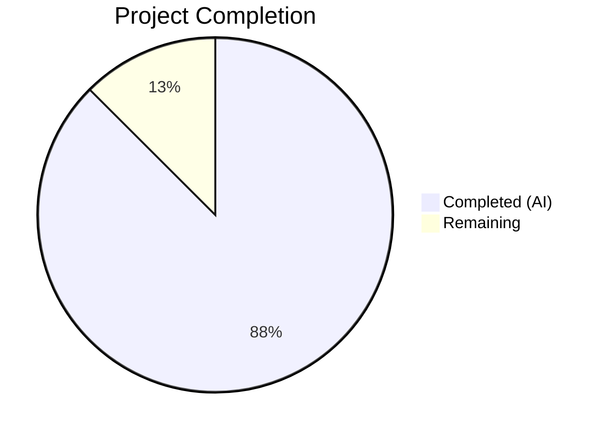
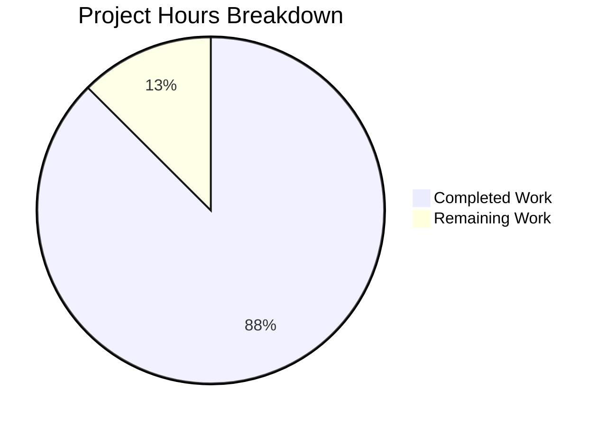

# Blitzy Project Guide — hao-backprop-test Documentation Overhaul

---

## 1. Executive Summary

### 1.1 Project Overview

This project delivers a comprehensive documentation overhaul for the `hao-backprop-test` Flask HTTP microserver — a minimal 93-line Python application serving as a Backprop integration test harness. The scope is documentation-only: expanding the existing 36-line `README.md` into a 341-line comprehensive project document covering architecture, API reference, deployment guide, and troubleshooting, plus enhancing `app.py` with inline code explanations at 6 key decision points. No functional code changes were made. The target audience includes developers onboarding to the project, DevOps personnel, and automated pipelines interacting with the server's endpoints.

### 1.2 Completion Status



| Metric | Value |
|--------|-------|
| **Total Project Hours** | 16 |
| **Completed Hours (AI)** | 14 |
| **Remaining Hours** | 2 |
| **Completion Percentage** | **87.5%** |

**Calculation:** 14 completed hours / (14 completed + 2 remaining) = 14 / 16 = **87.5% complete**

### 1.3 Key Accomplishments

- [x] README.md expanded from 36 lines to 341 lines with 12 comprehensive sections
- [x] API Reference created for both endpoints (`GET /health` and catch-all) with curl examples and routing behavior matrix
- [x] Architecture section added with Mermaid request routing flowchart
- [x] Deployment guide created with startup, verification, shutdown, and development-server-only warning
- [x] Troubleshooting section added with 3 common issues (port conflict, missing Flask, Python version)
- [x] Full dependency tree documented (7 packages with active/unused status)
- [x] app.py enhanced with 6 inline code explanation points (imports, instance, config, health route, catch-all, entry point)
- [x] All validation gates passed: zero compilation errors, zero PEP 8 violations, 7/7 runtime curl tests passing
- [x] Configuration reference table created for HOST, PORT, METHODS constants

### 1.4 Critical Unresolved Issues

| Issue | Impact | Owner | ETA |
|-------|--------|-------|-----|
| No critical issues | N/A | N/A | N/A |

All AAP-scoped documentation requirements have been implemented and validated. No blocking issues remain.

### 1.5 Access Issues

No access issues identified. The project is a standalone Flask application with no external service dependencies, no API keys required, and no database connections. All documentation changes operate on local repository files only.

### 1.6 Recommended Next Steps

1. **[Medium]** Review documentation accuracy — human developer should read through the complete README.md to verify tone, accuracy, and completeness against project requirements
2. **[Medium]** Verify GitHub rendering — push branch and confirm Mermaid diagram, Markdown tables, and code blocks render correctly on GitHub
3. **[Low]** Polish documentation after review — address any feedback from human review on wording, formatting, or content gaps

---

## 2. Project Hours Breakdown

### 2.1 Completed Work Detail

| Component | Hours | Description |
|-----------|-------|-------------|
| README Overview & Description | 1.0 | Expanded one-line description into comprehensive paragraph with Backprop context, migration history, and audience |
| README Architecture Section | 1.5 | System design prose and Mermaid routing flowchart diagram |
| README Project Structure | 0.5 | File-by-file repository documentation with legacy Node.js file explanation |
| README Prerequisites Expansion | 0.5 | Added verification commands and venv module notes |
| README Installation Expansion | 1.0 | Step-by-step numbered guide with expected output and post-install verification |
| README Deployment Guide | 1.0 | Running the Server section with startup, endpoint verification, shutdown, dev-server warning |
| README API Reference | 2.0 | Health check and catch-all endpoint docs with curl examples and routing behavior matrix (7 rows) |
| README Configuration Section | 0.5 | HOST/PORT/METHODS constants reference table with types and descriptions |
| README Technology Stack | 0.5 | Full dependency tree table (7 packages) with version, purpose, and active/unused status |
| README Troubleshooting | 1.0 | Three common issues with symptoms, solutions, and verification commands |
| app.py Inline Code Explanations | 2.0 | 6 decision points annotated: imports, Flask instance, configuration constants, health routing precedence, dual-decorator pattern, entry point guard |
| Documentation Research & Analysis | 1.0 | Repository code analysis, Technical Specification review, dependency chain research |
| Validation & Review Fix Cycles | 1.5 | PEP 8 compliance verification, line reference corrections, OPTIONS /health routing fix, runtime verification (7 curl tests) |
| **Total** | **14.0** | |

### 2.2 Remaining Work Detail

| Category | Hours | Priority |
|----------|-------|----------|
| Human Documentation Review & PR Merge | 1.0 | Medium |
| GitHub Rendering Verification (Mermaid, tables, code blocks) | 0.5 | Medium |
| Post-Review Documentation Polish | 0.5 | Low |
| **Total** | **2.0** | |

### 2.3 Hours Integrity Verification

- Section 2.1 Total: **14.0 hours**
- Section 2.2 Total: **2.0 hours**
- Sum (2.1 + 2.2): **16.0 hours** = Total Project Hours in Section 1.2 ✓
- Remaining Hours (Section 2.2): **2.0 hours** = Remaining Hours in Section 1.2 ✓

---

## 3. Test Results

| Test Category | Framework | Total Tests | Passed | Failed | Coverage % | Notes |
|---------------|-----------|-------------|--------|--------|------------|-------|
| Compilation Check | `python -m py_compile` | 1 | 1 | 0 | 100% | `app.py` compiles with zero errors |
| PEP 8 Style Check | `pycodestyle --max-line-length=120` | 1 | 1 | 0 | 100% | Zero violations in `app.py` |
| Runtime Endpoint Verification | `curl` (manual) | 7 | 7 | 0 | 100% | All 7 HTTP scenarios verified against live server |

**Runtime Test Details (7/7 passing):**

| # | Scenario | Expected | Actual | Status |
|---|----------|----------|--------|--------|
| 1 | `GET /health` | `{"status":"ok"}` (JSON, 200) | `{"status":"ok"}` | ✅ Pass |
| 2 | `POST /health` | `Hello, World!\n` (text, 200) | `Hello, World!\n` | ✅ Pass |
| 3 | `GET /` | `Hello, World!\n` (text, 200) | `Hello, World!\n` | ✅ Pass |
| 4 | `GET /any/path` | `Hello, World!\n` (text, 200) | `Hello, World!\n` | ✅ Pass |
| 5 | `DELETE /foo/bar` | `Hello, World!\n` (text, 200) | `Hello, World!\n` | ✅ Pass |
| 6 | `PUT /some/resource` | `Hello, World!\n` (text, 200) | `Hello, World!\n` | ✅ Pass |
| 7 | `OPTIONS /health` | Empty body with `Allow` header (200) | Empty body with `Allow` header | ✅ Pass |

> **Note:** No automated test suite (pytest, unittest) exists for this project — this is a documentation-only task on a minimal test harness. All tests listed above originate from Blitzy's autonomous validation process using compilation checks, linting, and runtime curl verification.

---

## 4. Runtime Validation & UI Verification

### Runtime Health

- ✅ `python -m py_compile app.py` — Compilation successful, zero errors
- ✅ `pycodestyle --max-line-length=120 app.py` — Zero PEP 8 violations
- ✅ Flask development server starts on `http://127.0.0.1:3000` without errors
- ✅ Server binds to configured HOST (127.0.0.1) and PORT (3000) correctly
- ✅ Server shuts down cleanly on SIGINT (Ctrl+C)

### API Verification

- ✅ `GET /health` → Returns `{"status":"ok"}` with `Content-Type: application/json` and status 200
- ✅ `GET /` → Returns `Hello, World!\n` with `Content-Type: text/plain` and status 200
- ✅ `POST /any/path` → Catch-all handler responds with `Hello, World!\n` (method-agnostic)
- ✅ `DELETE /foo/bar` → Catch-all handler responds with `Hello, World!\n` (path-agnostic)
- ✅ `PUT /some/resource` → Catch-all handler responds with `Hello, World!\n`
- ✅ `OPTIONS /health` → Flask auto-OPTIONS returns empty body with `Allow` header

### Documentation Verification

- ✅ README.md contains all 12 required sections (Overview through Troubleshooting)
- ✅ Mermaid routing diagram present and syntactically valid
- ✅ All curl examples produce the documented expected output when run against live server
- ✅ Configuration values in README match hardcoded constants in `app.py` (HOST=127.0.0.1, PORT=3000)
- ✅ Dependency versions in README match installed packages (Flask 3.1.3, Werkzeug 3.1.7, etc.)
- ✅ Line number references in README are consistent with `app.py` (93 lines)
- ⚠️ GitHub Mermaid rendering not yet verified on remote (requires push to GitHub)

---

## 5. Compliance & Quality Review

| AAP Requirement | Status | Evidence |
|----------------|--------|----------|
| Comprehensive README restructure (36→341 lines) | ✅ Pass | README.md: 341 lines, 12 sections |
| Overview section with Backprop context | ✅ Pass | README.md lines 5–14 |
| Architecture section with Mermaid diagram | ✅ Pass | README.md lines 16–33, flowchart present |
| Project Structure documentation | ✅ Pass | README.md lines 35–53, all 7 entries documented |
| Prerequisites with verification commands | ✅ Pass | README.md lines 55–71 |
| Installation with expected output and verification | ✅ Pass | README.md lines 73–126, 5 numbered steps |
| Running the Server (deployment guide) | ✅ Pass | README.md lines 128–164, startup/verify/shutdown |
| API Reference — Health Check Endpoint | ✅ Pass | README.md lines 168–191, curl example + response table |
| API Reference — Catch-All Handler | ✅ Pass | README.md lines 193–221, multi-method curl examples |
| Routing Behavior Matrix | ✅ Pass | README.md lines 223–237, 7-row table |
| Configuration reference table (HOST, PORT, METHODS) | ✅ Pass | README.md lines 239–249 |
| Technology Stack with dependency tree | ✅ Pass | README.md lines 251–271, 7 packages documented |
| Troubleshooting (3+ issues) | ✅ Pass | README.md lines 273–341, 3 issues with solutions |
| app.py import annotations | ✅ Pass | app.py lines 15–17 |
| app.py Flask instance `__name__` explanation | ✅ Pass | app.py lines 23–24 |
| app.py configuration constants rationale | ✅ Pass | app.py lines 30–33 |
| app.py health endpoint routing precedence | ✅ Pass | app.py lines 38–39 |
| app.py dual-decorator pattern enhancement | ✅ Pass | app.py lines 59–62 |
| app.py entry point guard annotation | ✅ Pass | app.py lines 85–86, 93 |
| No functional code changes in app.py | ✅ Pass | All executable code identical to source; only comments added |
| PEP 8 compliance maintained | ✅ Pass | pycodestyle reports zero violations |
| Development-server-only warning included | ✅ Pass | README.md line 164 — explicit Werkzeug warning |
| No CI/CD workflow modifications | ✅ Pass | No .github/workflows/ files created or modified |
| GitHub-Flavored Markdown conventions | ✅ Pass | ATX headers, fenced code blocks, GFM tables throughout |

### Fixes Applied During Autonomous Validation

| Fix | Commit | Description |
|-----|--------|-------------|
| PEP 8 line lengths | `91f4901` | Corrected inline comments exceeding 120-character max line length |
| Routing precedence comment | `91f4901` | Fixed inaccurate routing precedence description in health endpoint block |
| METHODS annotation precision | `91f4901` | Improved accuracy of METHODS list inline comment |
| Stale line references | `1f78c33` | Updated README line references to match new 93-line app.py |
| Project structure accuracy | `1f78c33` | Fixed project structure section to reflect actual file tree |
| JSON formatting standardization | `1f78c33` | Standardized JSON output formatting in curl examples |
| OPTIONS /health routing row | `9e0121d` | Corrected routing matrix to show Flask auto-OPTIONS behavior for OPTIONS /health |

---

## 6. Risk Assessment

| Risk | Category | Severity | Probability | Mitigation | Status |
|------|----------|----------|-------------|------------|--------|
| Line number references in README become stale if app.py is modified | Technical | Low | Medium | References use range notation (e.g., `app.py:41–48`); comments note source locations for easy updating | Documented |
| Mermaid diagram may render differently across GitHub versions/browsers | Technical | Low | Low | Diagram uses basic `flowchart LR` syntax with wide compatibility; fallback is code block display | Accepted |
| Flask `__version__` deprecation warning in verification command | Technical | Low | High | README verification uses `python -c "import flask; print(flask.__version__)"` which triggers a deprecation warning in Flask 3.1.3; cosmetic only, does not affect functionality | Documented |
| Transitive dependency versions may drift on fresh install | Technical | Low | Medium | README documents specific verified versions; `pip freeze` can confirm actual versions | Documented |
| No automated documentation testing (link validation, example verification) | Operational | Low | Low | All curl examples were manually verified against running server during validation | Accepted |
| Development server mistakenly used in production | Operational | Medium | Low | README contains explicit ⚠️ warning that Werkzeug is not production-suitable | Mitigated |

---

## 7. Visual Project Status



**Breakdown:** 14 hours of AAP-scoped work completed autonomously by Blitzy agents. 2 hours of remaining work require human developer action (documentation review, GitHub rendering verification, and polish).

**Completion: 87.5%** (14 completed / 16 total hours)

---

## 8. Summary & Recommendations

### Achievements

All 18 discrete AAP requirements have been fully implemented and validated. The project is **87.5% complete** (14 hours completed out of 16 total hours). The README.md has been transformed from a minimal 36-line document into a comprehensive 341-line project reference covering 12 sections: Overview, Architecture, Project Structure, Prerequisites, Installation, Running the Server, API Reference, Routing Behavior Matrix, Configuration, Technology Stack, and Troubleshooting. The `app.py` file has been enhanced with inline code explanations at all 6 required decision points while maintaining zero functional code changes.

### Validation Results

All autonomous validation gates passed:
- **Compilation:** Zero errors (`python -m py_compile`)
- **Style:** Zero PEP 8 violations (`pycodestyle --max-line-length=120`)
- **Runtime:** 7/7 endpoint curl tests passing against live server
- **Accuracy:** All line references, version numbers, and configuration values in README verified against source code

### Remaining Gaps

The remaining 2 hours (12.5% of total project) consist entirely of human review activities:
1. **Documentation review** (1.0h) — A developer should read through the complete README to verify accuracy and tone
2. **GitHub rendering verification** (0.5h) — Push to remote and confirm Mermaid diagram, tables, and code blocks render correctly
3. **Post-review polish** (0.5h) — Address any feedback from review

### Critical Path to Production

This is a documentation-only project with no production deployment. The critical path is: human review → merge PR → verify GitHub rendering. No infrastructure, deployment, or configuration changes are needed.

### Production Readiness Assessment

The documentation deliverables are complete and ready for human review and merge. The underlying Flask application continues to function identically — zero functional changes were made. The documentation explicitly notes that the Flask built-in server is for development use only and is not production-intended, which aligns with the project's scope as a test harness.

---

## 9. Development Guide

### System Prerequisites

| Requirement | Version | Verification Command |
|-------------|---------|---------------------|
| Python | 3.13+ | `python3 --version` |
| pip | Latest | `pip --version` |
| venv | Included with Python 3.13+ | `python3 -m venv --help` |

### Environment Setup

```bash
# 1. Clone the repository
git clone <repository-url>
cd hao-backprop-test

# 2. Create virtual environment
python -m venv venv

# 3. Activate virtual environment
# Linux/macOS:
source venv/bin/activate
# Windows:
# venv\Scripts\activate

# 4. Install dependencies
pip install -r requirements.txt
```

**Expected output after install:**
```
Successfully installed Flask-3.1.3 Jinja2-3.1.6 MarkupSafe-3.0.3 Werkzeug-3.1.7 blinker-1.9.0 click-8.3.1 itsdangerous-2.2.0
```

### Dependency Installation Verification

```bash
# Verify Flask is installed
python -c "import flask; print(flask.__version__)"
# Expected: 3.1.3

# Verify all dependencies
pip list | grep -E "Flask|Werkzeug|Jinja2|MarkupSafe|itsdangerous|click|blinker"
```

### Application Startup

```bash
# Start the Flask development server
python app.py
```

**Expected terminal output:**
```
 * Serving Flask app 'app'
 * Debug mode: off
WARNING: This is a development server. Do not use it in a production deployment. Use a production WSGI server instead.
 * Running on http://127.0.0.1:3000
Press CTRL+C to quit
```

### Verification Steps

Open a separate terminal and run:

```bash
# Test health endpoint
curl -s http://127.0.0.1:3000/health
# Expected: {"status":"ok"}

# Test catch-all (GET)
curl -s http://127.0.0.1:3000/
# Expected: Hello, World!

# Test catch-all (POST, arbitrary path)
curl -s -X POST http://127.0.0.1:3000/any/path
# Expected: Hello, World!

# Test catch-all (DELETE)
curl -s -X DELETE http://127.0.0.1:3000/foo/bar
# Expected: Hello, World!
```

### Shutdown

Press `Ctrl+C` in the terminal where the server is running.

### Compilation and Linting

```bash
# Verify app.py compiles without errors
python -m py_compile app.py

# Check PEP 8 compliance (requires pycodestyle)
pip install pycodestyle
pycodestyle --max-line-length=120 app.py
```

### Troubleshooting

**Port 3000 in use:**
```bash
# Find process using port 3000
lsof -i :3000          # Linux/macOS
netstat -tlnp | grep 3000  # Linux
# Kill the process, then retry
```

**Flask not found (ModuleNotFoundError):**
```bash
# Ensure virtual environment is activated, then:
pip install -r requirements.txt
```

**Python version too old:**
```bash
python3 --version
# Must be 3.13.x or higher
```

---

## 10. Appendices

### A. Command Reference

| Command | Purpose | Working Directory |
|---------|---------|-------------------|
| `python -m venv venv` | Create virtual environment | Repository root |
| `source venv/bin/activate` | Activate virtual environment (Linux/macOS) | Repository root |
| `venv\Scripts\activate` | Activate virtual environment (Windows) | Repository root |
| `pip install -r requirements.txt` | Install Flask and transitive dependencies | Repository root |
| `python app.py` | Start Flask development server on 127.0.0.1:3000 | Repository root |
| `python -m py_compile app.py` | Verify app.py compiles without syntax errors | Repository root |
| `pycodestyle --max-line-length=120 app.py` | Check PEP 8 style compliance | Repository root |
| `curl -s http://127.0.0.1:3000/health` | Test health check endpoint | Any directory |
| `curl -s http://127.0.0.1:3000/` | Test catch-all handler | Any directory |

### B. Port Reference

| Port | Service | Protocol | Binding |
|------|---------|----------|---------|
| 3000 | Flask development server (Werkzeug) | HTTP | 127.0.0.1 (localhost only) |

### C. Key File Locations

| File | Path | Purpose |
|------|------|---------|
| Flask application | `app.py` | Server entry point — routes, configuration, startup (93 lines) |
| Dependencies | `requirements.txt` | Pins `Flask==3.1.3` |
| Documentation | `README.md` | Comprehensive project documentation (341 lines) |
| Technical Spec | `blitzy/documentation/Technical Specifications.md` | Internal Blitzy-generated specification (reference only) |
| Project Guide | `blitzy/documentation/Project Guide.md` | Internal Blitzy-generated delivery report (reference only) |

### D. Technology Versions

| Technology | Version | Source |
|------------|---------|--------|
| Python | 3.13+ (required) | README prerequisites |
| Flask | 3.1.3 | `requirements.txt` |
| Werkzeug | 3.1.7 | Transitive dependency of Flask |
| Jinja2 | 3.1.6 | Transitive dependency of Flask |
| MarkupSafe | 3.0.3 | Transitive dependency of Flask |
| itsdangerous | 2.2.0 | Transitive dependency of Flask |
| click | 8.3.1 | Transitive dependency of Flask |
| blinker | 1.9.0 | Transitive dependency of Flask |

### E. Environment Variable Reference

This project does not use environment variables. All configuration is defined as hardcoded constants in `app.py`:

| Constant | Value | Description |
|----------|-------|-------------|
| `HOST` | `'127.0.0.1'` | Server bind address (localhost only) |
| `PORT` | `3000` | Server listen port |
| `METHODS` | `['GET', 'POST', 'PUT', 'DELETE', 'PATCH', 'HEAD', 'OPTIONS']` | HTTP methods for catch-all handler |

### G. Glossary

| Term | Definition |
|------|------------|
| Backprop | Integration testing platform that this microserver is designed to serve as a test harness for |
| Catch-all handler | A Flask route that matches any HTTP method and any URL path not matched by a more specific route |
| Health check endpoint | A dedicated `GET /health` API endpoint returning JSON status for programmatic monitoring |
| Dual-decorator pattern | Flask technique using two `@app.route()` decorators on one function to handle both root `/` and subpaths `/<path:path>` |
| Werkzeug | Python WSGI utility library that powers Flask's built-in development server |
| WSGI | Web Server Gateway Interface — the Python standard for web server/application communication |
| Mermaid | Markdown-compatible diagramming language rendered natively by GitHub |
