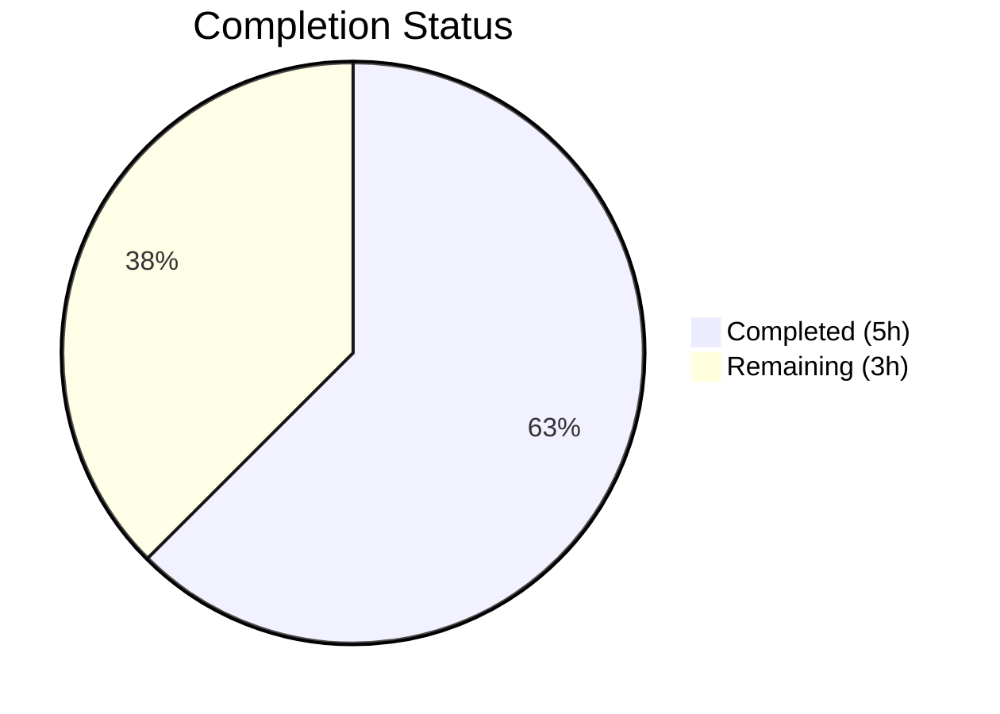

# Blitzy Project Guide

---

## 1. Executive Summary

### 1.1 Project Overview

This project migrates the `hello_world` Node.js tutorial HTTP server from the built-in `http` module to **ExpressJS v5.2.1**. The refactoring introduces route-based request handling with two distinct endpoints: `GET /` (preserving the original "Hello, World!" response) and a new `GET /good-evening` endpoint. The scope covers dependency integration, server refactoring, lockfile regeneration, and documentation updates across all 4 repository files. The project targets tutorial learners and Backprop integration testing.

### 1.2 Completion Status

**Completion: 62.5% (5 of 8 total hours)**

Formula: 5 completed hours / (5 completed hours + 3 remaining hours) × 100 = 62.5%


*Completed = Dark Blue (#5B39F3) | Remaining = White (#FFFFFF)*

| Metric | Value |
|--------|-------|
| **Total Project Hours** | 8 |
| **Completed Hours (AI)** | 5 |
| **Remaining Hours** | 3 |
| **Completion Percentage** | 62.5% |

### 1.3 Key Accomplishments

- ✅ Integrated ExpressJS v5.2.1 as project dependency with 65 transitive packages and 0 vulnerabilities
- ✅ Refactored `server.js` from raw `http` module to Express application with route-based handling
- ✅ Implemented `GET /` route preserving original `"Hello, World!\n"` response (text/plain, HTTP 200)
- ✅ Implemented new `GET /good-evening` route returning `"Good evening"` (text/plain, HTTP 200)
- ✅ Fixed `package.json` metadata: corrected `main` field, added `start` script, updated description
- ✅ Regenerated `package-lock.json` with Express and all transitive dependencies
- ✅ Rewrote `README.md` with endpoint documentation, prerequisites, and setup instructions
- ✅ Applied security hardening: disabled `x-powered-by` header, explicit `text/plain` Content-Type
- ✅ Validated all endpoints via runtime testing with correct HTTP status codes and response bodies
- ✅ Honored user constraint: no GitHub workflow files created or modified

### 1.4 Critical Unresolved Issues

| Issue | Impact | Owner | ETA |
|-------|--------|-------|-----|
| No test framework or test suite | Cannot verify endpoint behavior automatically in CI; regressions possible | Human Developer | 2 hours |
| Hardcoded port and hostname | Server cannot be configured via environment variables for different deployment environments | Human Developer | 0.5 hours |

### 1.5 Access Issues

No access issues identified. The project uses only the public npm registry for dependencies. No private packages, API keys, service credentials, or third-party integrations are required.

### 1.6 Recommended Next Steps

1. **[High]** Add a test framework (e.g., Jest or Mocha) and write endpoint tests for `GET /` and `GET /good-evening` to enable automated regression validation
2. **[Medium]** Introduce environment variable support for `PORT` and `HOST` to allow configurable deployment
3. **[Medium]** Add Express error-handling middleware for consistent error responses
4. **[Low]** Consider adding a health check endpoint (`GET /health`) for production monitoring
5. **[Low]** Add `.gitignore` for `node_modules/` directory if not already covered by repository settings

---

## 2. Project Hours Breakdown

### 2.1 Completed Work Detail

| Component | Hours | Description |
|-----------|-------|-------------|
| Express dependency integration & package configuration | 1.5 | Added `express@^5.2.1` to `package.json` dependencies, fixed `main` field from `index.js` to `server.js`, added `start` script, updated description, regenerated `package-lock.json` with 65 transitive dependencies |
| Core server refactoring (`server.js`) | 2 | Complete rewrite from Node.js `http.createServer` to Express app with `GET /` and `GET /good-evening` route handlers, security hardening (disabled `x-powered-by`, explicit `text/plain` Content-Type), preserved `127.0.0.1:3000` binding |
| Documentation (`README.md`) | 1 | Full content rewrite with project description, prerequisites (Node.js v18+), installation instructions, endpoint reference table, usage examples, and MIT license section |
| Validation & code review fixes | 0.5 | Syntax validation, JSON validation, runtime endpoint testing, applied code review fixes (localhost binding, Content-Type header, x-powered-by removal) |
| **Total** | **5** | |

### 2.2 Remaining Work Detail

| Category | Hours | Priority |
|----------|-------|----------|
| Test framework setup & endpoint tests | 2 | Medium |
| Environment variable configuration (PORT, HOST) | 0.5 | Low |
| Error-handling middleware | 0.5 | Low |
| **Total** | **3** | |

---

## 3. Test Results

| Test Category | Framework | Total Tests | Passed | Failed | Coverage % | Notes |
|--------------|-----------|-------------|--------|--------|------------|-------|
| Syntax Check | `node -c` | 1 | 1 | 0 | N/A | `node -c server.js` — syntax OK |
| JSON Validation | Node.js `JSON.parse` | 1 | 1 | 0 | N/A | `package.json` — valid JSON |
| Dependency Audit | `npm audit` | 1 | 1 | 0 | N/A | 0 vulnerabilities found across 65 packages |
| Runtime Endpoint — GET / | `curl` | 1 | 1 | 0 | N/A | HTTP 200, Content-Type: text/plain, body: `Hello, World!\n` |
| Runtime Endpoint — GET /good-evening | `curl` | 1 | 1 | 0 | N/A | HTTP 200, Content-Type: text/plain, body: `Good evening` |
| Runtime Endpoint — 404 handling | `curl` | 1 | 1 | 0 | N/A | Unknown routes return HTTP 404 with Express default error page |

> **Note:** No formal test framework (Jest, Mocha, etc.) exists in this project. The project's `npm test` script is a placeholder (`echo "Error: no test specified" && exit 1`) per the original project design. All tests listed above were performed by Blitzy's autonomous validation system via syntax checks, dependency audits, and runtime HTTP endpoint verification.

---

## 4. Runtime Validation & UI Verification

### Server Startup
- ✅ `node server.js` — Server starts successfully, logs `Server running at http://127.0.0.1:3000/`
- ✅ `npm start` — Invokes `node server.js` via start script, starts correctly
- ✅ Server binds to `127.0.0.1:3000` as specified

### Endpoint Verification
- ✅ `GET /` — HTTP 200, Content-Type: `text/plain; charset=utf-8`, body: `Hello, World!\n`
- ✅ `GET /good-evening` — HTTP 200, Content-Type: `text/plain; charset=utf-8`, body: `Good evening`
- ✅ `GET /nonexistent` — HTTP 404, Express default error response (`Cannot GET /nonexistent`)

### Dependency Validation
- ✅ `npm install` — Completes successfully, installs Express 5.2.1 with 65 transitive dependencies
- ✅ `npm audit` — 0 vulnerabilities detected
- ✅ `package-lock.json` — lockfileVersion 3, correctly records all dependency versions and integrity hashes

### Security Hardening
- ✅ `x-powered-by` header disabled via `app.disable('x-powered-by')`
- ✅ Explicit `text/plain` Content-Type set via `res.type('text').send()` on both endpoints

### UI Verification
- Not applicable — this is a backend-only HTTP server with no user interface

---

## 5. Compliance & Quality Review

| AAP Requirement | Status | Evidence |
|----------------|--------|----------|
| Integrate ExpressJS into server.js | ✅ Pass | `server.js` uses `require('express')`, `const app = express()` |
| Preserve GET / "Hello, World!" endpoint | ✅ Pass | `app.get('/', ...)` responds with `Hello, World!\n`, verified via curl |
| Add GET /good-evening endpoint | ✅ Pass | `app.get('/good-evening', ...)` responds with `Good evening`, verified via curl |
| Add express@^5.2.1 dependency | ✅ Pass | `package.json` contains `"express": "^5.2.1"` in dependencies |
| Fix main field to server.js | ✅ Pass | `package.json` `main` is `server.js` (was `index.js`) |
| Add start script | ✅ Pass | `package.json` scripts includes `"start": "node server.js"` |
| Update description | ✅ Pass | Description is `"Hello world Express.js server in Node.js"` |
| Regenerate package-lock.json | ✅ Pass | 827-line lockfile with Express 5.2.1 and 65 transitive deps |
| Update README.md | ✅ Pass | 59-line comprehensive README with endpoints, prerequisites, setup |
| No GitHub workflow files | ✅ Pass | No `.github/workflows/` files exist in repository |
| CommonJS module system | ✅ Pass | Uses `require()` syntax, no ES module imports |
| Preserve port 3000 and localhost binding | ✅ Pass | `const hostname = '127.0.0.1'; const port = 3000;`, verified via runtime |
| Tutorial simplicity maintained | ✅ Pass | Single-file server, no unnecessary middleware or abstractions |
| Plain-text responses | ✅ Pass | Both endpoints use `res.type('text').send()`, verified Content-Type header |

### Autonomous Fixes Applied
| Fix | Commit | Description |
|-----|--------|-------------|
| Localhost binding | `9c0aef8` | Server binds to `127.0.0.1` via `app.listen(port, hostname, ...)` instead of Express default all-interfaces |
| Content-Type header | `9c0aef8` | Explicit `text/plain` via `res.type('text')` instead of Express default `text/html` |
| x-powered-by disabled | `9c0aef8` | `app.disable('x-powered-by')` removes Express fingerprint header |

---

## 6. Risk Assessment

| Risk | Category | Severity | Probability | Mitigation | Status |
|------|----------|----------|-------------|------------|--------|
| No automated test suite | Technical | Medium | High | Add Jest or Mocha with endpoint tests for regression detection | Open |
| Hardcoded port/hostname | Operational | Low | Medium | Introduce `process.env.PORT` and `process.env.HOST` with defaults | Open |
| No error-handling middleware | Technical | Low | Medium | Add Express error-handling middleware for consistent JSON/text error responses | Open |
| No graceful shutdown handling | Operational | Low | Low | Add `SIGTERM`/`SIGINT` handlers to close server cleanly | Open |
| Express 5.x is relatively new | Technical | Low | Low | Express 5.2.1 is the latest stable release; monitor for patch updates | Monitoring |
| No `.gitignore` file | Operational | Low | Medium | Add `.gitignore` to exclude `node_modules/` from commits | Open |
| No rate limiting or request validation | Security | Low | Low | Not needed for tutorial scope; add if exposed publicly | Accepted |

---

## 7. Visual Project Status


*Completed = Dark Blue (#5B39F3) | Remaining = White (#FFFFFF)*

### Remaining Hours by Category

| Category | Hours | Priority |
|----------|-------|----------|
| Test framework & endpoint tests | 2 | Medium |
| Environment variable configuration | 0.5 | Low |
| Error-handling middleware | 0.5 | Low |
| **Total Remaining** | **3** | |

---

## 8. Summary & Recommendations

### Achievements

All 4 files in the repository have been successfully modified per the Agent Action Plan. The project has been migrated from the raw Node.js `http` module to ExpressJS v5.2.1 with two functioning endpoints: `GET /` (preserving the original "Hello, World!" response) and `GET /good-evening` (new endpoint). The `package.json` metadata has been corrected, Express has been added as a dependency with 0 vulnerabilities, and the README has been comprehensively rewritten with endpoint documentation and setup instructions. Security hardening was applied beyond original requirements (x-powered-by disabled, explicit Content-Type).

### Current Status

The project is **62.5% complete** (5 of 8 total hours). All AAP-scoped deliverables — Express integration, both endpoint implementations, package configuration, lockfile regeneration, and documentation — are fully implemented and validated. The remaining 3 hours consist of standard path-to-production activities: test framework setup (2h), environment configuration (0.5h), and error-handling middleware (0.5h).

### Critical Path to Production

1. **Test coverage** is the highest-priority remaining item. Without automated tests, endpoint regressions cannot be caught by CI pipelines. A test framework (Jest or Mocha) with basic endpoint tests for both routes would bring the project to a production-ready state.
2. **Environment configuration** for port and hostname would enable deployment flexibility.
3. **Error handling** middleware would provide consistent error responses.

### Production Readiness Assessment

The project is **functional and validated** for its tutorial purpose. All endpoints respond correctly with proper HTTP status codes, Content-Types, and response bodies. Zero vulnerabilities exist in the dependency tree. For a production deployment (beyond tutorial use), the three remaining tasks should be completed.

---

## 9. Development Guide

### System Prerequisites

| Software | Minimum Version | Recommended | Purpose |
|----------|----------------|-------------|---------|
| Node.js | v18.0.0 | v20.x LTS | JavaScript runtime (Express 5 requires Node.js v18+) |
| npm | v9.0.0 | v10.x (bundled with Node.js) | Package manager |
| Git | v2.x | Latest | Version control |

### Environment Setup

1. **Clone the repository:**
```bash
git clone <repository-url>
cd hello_world
```

2. **Verify Node.js version:**
```bash
node -v
# Expected: v18.x.x or higher (v20.x recommended)
```

### Dependency Installation

```bash
npm install
```

**Expected output:**
```
added 65 packages, and audited 66 packages in Xs
found 0 vulnerabilities
```

**Verify installation:**
```bash
npm audit
# Expected: found 0 vulnerabilities
```

### Application Startup

**Option A — Using npm start:**
```bash
npm start
```

**Option B — Using node directly:**
```bash
node server.js
```

**Expected output:**
```
Server running at http://127.0.0.1:3000/
```

### Verification Steps

1. **Test the Hello World endpoint:**
```bash
curl http://127.0.0.1:3000/
# Expected: Hello, World!
```

2. **Test the Good Evening endpoint:**
```bash
curl http://127.0.0.1:3000/good-evening
# Expected: Good evening
```

3. **Test 404 handling:**
```bash
curl -s -o /dev/null -w "%{http_code}" http://127.0.0.1:3000/nonexistent
# Expected: 404
```

4. **Verify Content-Type headers:**
```bash
curl -sI http://127.0.0.1:3000/ | grep content-type
# Expected: content-type: text/plain; charset=utf-8
```

### Stopping the Server

Press `Ctrl+C` in the terminal running the server, or if running in background:
```bash
kill $(lsof -t -i:3000)
```

### Troubleshooting

| Issue | Cause | Resolution |
|-------|-------|------------|
| `Error: Cannot find module 'express'` | Dependencies not installed | Run `npm install` |
| `EADDRINUSE: address already in use :::3000` | Port 3000 is occupied | Kill the process on port 3000: `kill $(lsof -t -i:3000)` |
| `npm start` fails | Missing start script | Verify `package.json` contains `"start": "node server.js"` in scripts |
| Node.js version error | Node.js < v18 | Upgrade to Node.js v18+ (Express 5 requirement) |

---

## 10. Appendices

### A. Command Reference

| Command | Purpose |
|---------|---------|
| `npm install` | Install Express and all transitive dependencies |
| `npm start` | Start the server via the npm start script |
| `node server.js` | Start the server directly |
| `node -c server.js` | Check server.js syntax without executing |
| `npm audit` | Check installed packages for vulnerabilities |
| `curl http://127.0.0.1:3000/` | Test the Hello World endpoint |
| `curl http://127.0.0.1:3000/good-evening` | Test the Good Evening endpoint |

### B. Port Reference

| Service | Port | Host | Protocol |
|---------|------|------|----------|
| Express HTTP Server | 3000 | 127.0.0.1 | HTTP |

### C. Key File Locations

| File | Purpose | Lines |
|------|---------|-------|
| `server.js` | Express application with route handlers | 20 |
| `package.json` | npm manifest with Express dependency | 15 |
| `package-lock.json` | Dependency lockfile (65 transitive packages) | 827 |
| `README.md` | Project documentation with endpoint reference | 59 |

### D. Technology Versions

| Technology | Version | Notes |
|-----------|---------|-------|
| Node.js | v20.19.5 | Runtime environment (v18+ required by Express 5) |
| npm | v10.8.2 | Package manager |
| Express | v5.2.1 | Web framework (`^5.2.1` semver range) |
| Lockfile format | v3 | npm lockfileVersion 3 |

### E. Environment Variable Reference

No environment variables are currently required. The server uses hardcoded values:

| Constant | Value | Location | Notes |
|----------|-------|----------|-------|
| `hostname` | `127.0.0.1` | `server.js` line 5 | Loopback address only |
| `port` | `3000` | `server.js` line 6 | HTTP listen port |

*Recommendation: Future enhancement should read from `process.env.PORT` and `process.env.HOST` with these as defaults.*

### G. Glossary

| Term | Definition |
|------|-----------|
| Express | Minimal, flexible Node.js web application framework for building HTTP servers |
| Route handler | A function that processes HTTP requests matching a specific method and path |
| Transitive dependency | A package that is not directly declared but is required by a direct dependency |
| CommonJS | Node.js module system using `require()` and `module.exports` |
| Semver | Semantic versioning scheme (`^5.2.1` allows compatible updates within v5.x) |