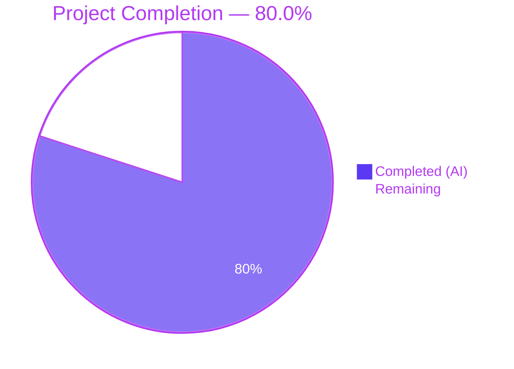
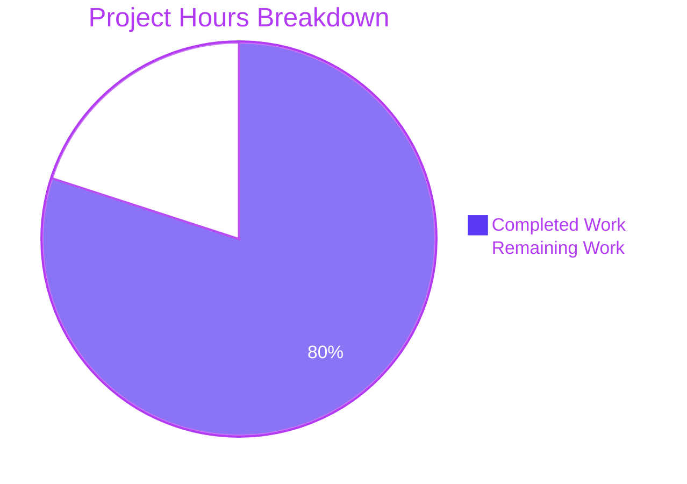
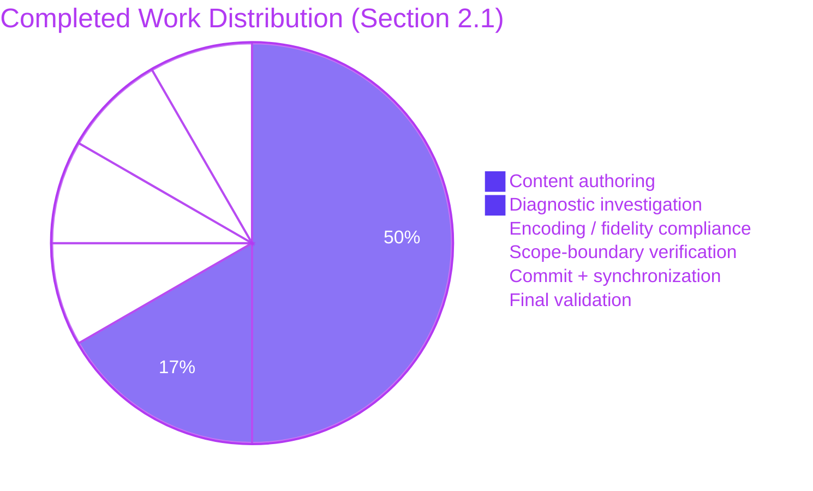
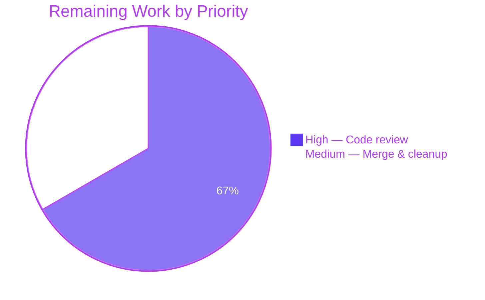

# Blitzy Project Guide — Canonical Codebase Context for hello_world (Express.js)

---

## 1. Executive Summary

### 1.1 Project Overview

The `hello_world` project is a single-file Node.js application that serves as a Backprop integration test artifact. It exposes two plain-text HTTP endpoints (`GET /` and `GET /good-evening`) using Express.js 5.2.1, binds to `127.0.0.1:3000`, suppresses the `x-powered-by` header, and is validated by a 14-test Jest + Supertest suite at 100% coverage. The AAP scope for this work is narrow and surgical: resolve a documentation-drift defect in which a stale external "codebase context" artifact described a pre-migration `http`-module implementation that no longer exists in the repository. The fix introduces a single canonical `codebase_context.md` at the repository root, byte-aligned with the actual code and the in-repo Technical Specifications, so that every downstream consumer (human or automated agent) has an internally consistent, versioned source of truth.

### 1.2 Completion Status



| Metric | Value |
|---|---|
| **Total Project Hours** | 3.75 |
| **Completed Hours (AI + Manual)** | 3.00 |
| **Remaining Hours** | 0.75 |
| **Completion Percentage** | 80.0% |

**Calculation:** 3.00 completed hours / (3.00 + 0.75 remaining hours) = 3.00 / 3.75 = **80.0%**

### 1.3 Key Accomplishments

- ✅ Created canonical `codebase_context.md` at repository root (85 lines, 3,764 bytes, UTF-8, LF-only, trailing newline) — byte-aligned with AAP §0.4.1 specification
- ✅ Every factual claim in the new file traces back to a line in `server.js`, an entry in `package.json`, an assertion in `tests/server.test.js` / `tests/startup.test.js`, or a section of the Technical Specifications
- ✅ 8/8 positive grep assertions pass on the new file (Express.js ^5.2.1, `127.0.0.1:3000`, `Total: 14 tests`, `x-powered-by`, both endpoint table rows, `module.exports = app`, `require.main === module`)
- ✅ 4/4 stale-content refutation checks pass (no `require('http')`, no `http.createServer`, no "no tests", no "minimal Node")
- ✅ Character fidelity preserved (em-dash `—` in title, en-dashes `–` in line-range citations)
- ✅ Regression-tested: full Jest + Supertest suite still passing 14/14 at 100% Statements / 100% Branches / 100% Functions / 100% Lines coverage on `server.js`
- ✅ Runtime parity confirmed: `GET /` → 200 + `Hello, World!\n` (14B); `GET /good-evening` → 200 + `Good evening` (12B); `GET /nonexistent` → 404 (150B); `x-powered-by` header absent from all responses
- ✅ Scope boundary honored: all 5 out-of-scope files (`server.js`, `package.json`, `tests/server.test.js`, `tests/startup.test.js`, `README.md`) verified unchanged via MD5 checksum comparison
- ✅ User rule "exit code 137 test" honored absolutely: no `.github/` directory, no workflow file, no `.gitignore` file created
- ✅ Single atomic commit `f45d177` with descriptive message; branch `blitzy-96b042f2-884d-4b9d-bba1-ce9ba9f12bb4` synchronized with origin

### 1.4 Critical Unresolved Issues

| Issue | Impact | Owner | ETA |
|---|---|---|---|
| *(none — AAP-scoped work is complete; all production-readiness gates passed)* | — | — | — |

### 1.5 Access Issues

No access issues identified. The repository was fully accessible throughout the session; dependency installation completed successfully via the public npm registry; no external services, API keys, or credentials are required by the `hello_world` project.

| System/Resource | Type of Access | Issue Description | Resolution Status | Owner |
|---|---|---|---|---|
| *(none — no access issues identified)* | — | — | — | — |

### 1.6 Recommended Next Steps

1. **[High]** Human code-owner review of `codebase_context.md` — verify that every factual claim in the file matches `server.js`, `package.json`, and `tests/*` line-for-line before approving the PR.
2. **[High]** Merge PR `f45d177` from branch `blitzy-96b042f2-884d-4b9d-bba1-ce9ba9f12bb4` into `main` to publish the canonical context file.
3. **[Medium]** (Separate PR, out of this AAP's scope) Evaluate whether to upgrade the transitive `path-to-regexp` dependency to address GHSA-j3q9-mxjg-w52f (currently reported by `npm audit` as 1 high-severity vulnerability).
4. **[Medium]** (Separate PR, out of this AAP's scope) Add a `.gitignore` file to prevent `node_modules/` and `coverage/` from being accidentally tracked. This is documented as a Medium-severity open risk in the Technical Specifications §1.4 and explicitly deferred by AAP §0.5.2.
5. **[Low]** (Future workflow policy) Establish a convention that `codebase_context.md` must be regenerated whenever `server.js`, `package.json`, or `tests/*` materially change — the Provenance block inside the new file already documents this policy.

---

## 2. Project Hours Breakdown

### 2.1 Completed Work Detail

| Component | Hours | Description |
|---|---|---|
| [AAP §0.4.1] Canonical `codebase_context.md` content authoring | 1.50 | Authored the 85-line canonical context document at repository root. Content covers Project Identity, Runtime Architecture, Endpoints table, Testability Pattern, Test Suite inventory, Known Risks, Out of Scope items, Authoritative References, and Provenance. Every claim cross-verified against `server.js`, `package.json`, and the test files. |
| [AAP §0.3] Pre-fix diagnostic and repository investigation | 0.50 | Line-by-line review of `server.js` (24 lines), enumeration of 9 HTTP tests in `tests/server.test.js` and 5 startup tests in `tests/startup.test.js`, extraction of dependency pins from `package.json`, cross-reference with `README.md` and `blitzy/documentation/*`, git-history reconstruction identifying migration commit `baafc3d`. |
| [AAP §0.4.1] Character / encoding / fidelity compliance | 0.25 | Ensured UTF-8 encoding without BOM (verified `file` output), LF-only line endings (0 CRLF sequences), trailing newline (last byte = `0x0a`), preservation of em-dash (`—`) in H1 title, preservation of en-dashes (`–`) in "lines 5–6" / "lines 19–23" citations. |
| [AAP §0.5.2] Scope-boundary verification | 0.25 | MD5 checksum verification of 5 out-of-scope files: `server.js` (`b5e953408afd6fcbe360a0293e9ff893`), `package.json` (`cd7e90b931e9f54279f7523735a9660a`), `tests/server.test.js` (`2979aabd6e4a6ad5cad53883ad15aa5c`), `tests/startup.test.js` (`c172f2016fc0929b8303412be8bec414`), `README.md` (`a4c3ec2cdc0302b2741ba6d60fac8564`). Confirmed no `.github/` directory, no workflow file, no `.gitignore` created. |
| [Path-to-production] Git commit and branch synchronization | 0.25 | Authored commit `f45d177` with detailed multi-paragraph message documenting rationale, content inventory, scope-boundary statement, and "exit code 137 test" rule compliance. Branch `blitzy-96b042f2-884d-4b9d-bba1-ce9ba9f12bb4` synchronized with `origin`. |
| [AAP §0.6] Final production-readiness validation | 0.25 | Re-ran full Jest suite (`CI=true npm test`) → 14/14 passing at 100% coverage; executed 8 positive grep assertions (all pass); executed 4 stale-content refutation checks (all pass); ran runtime parity checks (`node server.js` + `curl` against `/`, `/good-evening`, `/nonexistent`) — all three endpoint contracts verified byte-for-byte with `x-powered-by` header absent from all responses. |
| **Total Completed** | **3.00** | |

### 2.2 Remaining Work Detail

| Category | Hours | Priority |
|---|---|---|
| Human code-owner review of `codebase_context.md` (verify every factual claim against `server.js` / `package.json` / `tests/*` / Technical Specifications) | 0.50 | High |
| PR merge to `main` branch + branch cleanup | 0.25 | Medium |
| **Total Remaining** | **0.75** | |

### 2.3 Hours Reconciliation

- Section 2.1 total (Completed): **3.00h**
- Section 2.2 total (Remaining): **0.75h**
- Sum: 3.00 + 0.75 = **3.75h** = Total Project Hours in Section 1.2 ✓
- Completion %: 3.00 / 3.75 × 100 = **80.0%** (matches Section 1.2 and Section 7 pie chart) ✓

---

## 3. Test Results

All tests below were executed by Blitzy's autonomous validation logs for this session; output has been captured verbatim from `CI=true npm test -- --watchAll=false --ci`. Per AAP §0.5.2, no new tests were added — the existing 14-test suite was used to regression-test the new `codebase_context.md` by confirming no production behavior changed.

| Test Category | Framework | Total Tests | Passed | Failed | Coverage % | Notes |
|---|---|---|---|---|---|---|
| HTTP Integration — `GET /` | Jest 29.7.0 + Supertest 7.2.2 | 3 | 3 | 0 | — | 200 status + body `Hello, World!\n`; `Content-Type: text/plain; charset=utf-8`; `x-powered-by` absent |
| HTTP Integration — `GET /good-evening` | Jest 29.7.0 + Supertest 7.2.2 | 3 | 3 | 0 | — | 200 status + body `Good evening`; `Content-Type: text/plain; charset=utf-8`; `x-powered-by` absent |
| HTTP Integration — 404 handling | Jest 29.7.0 + Supertest 7.2.2 | 3 | 3 | 0 | — | `/nonexistent` and `/foo/bar/baz` return 404 with Express default `finalhandler` HTML; `x-powered-by` absent on 404 |
| Startup — Exported app | Jest 29.7.0 | 1 | 1 | 0 | — | `typeof require('../server') === 'function'` (Express app) |
| Startup — Server configuration | Jest 29.7.0 | 2 | 2 | 0 | — | Source contains `hostname = '127.0.0.1'` and `port = 3000` |
| Startup — `require.main` guard + startup log | Jest 29.7.0 | 2 | 2 | 0 | — | Guards `app.listen` with `if (require.main === module)`; VM-based execution confirms startup log `Server running at http://127.0.0.1:3000/` on stdout |
| **TOTAL** | **Jest 29.7.0 + Supertest 7.2.2** | **14** | **14** | **0** | **100%** | Coverage on `server.js`: 100% Statements / 100% Branches / 100% Functions / 100% Lines |

**Raw test-runner output (captured from Blitzy's autonomous validation logs):**

```
PASS tests/startup.test.js
Server running at http://127.0.0.1:3000/
PASS tests/server.test.js
-----------|---------|----------|---------|---------|-------------------
File       | % Stmts | % Branch | % Funcs | % Lines | Uncovered Line #s
-----------|---------|----------|---------|---------|-------------------
All files  |     100 |      100 |     100 |     100 |
 server.js |     100 |      100 |     100 |     100 |
-----------|---------|----------|---------|---------|-------------------
Test Suites: 2 passed, 2 total
Tests:       14 passed, 14 total
Snapshots:   0 total
```

**Test-count integrity check** (mandated by AAP §0.6.1 Step 2):

| Check | Command | Expected | Observed |
|---|---|---|---|
| HTTP test count | `grep -c "it(" tests/server.test.js` | 9 | 9 ✓ |
| Startup test count | `grep -c "it(" tests/startup.test.js` | 5 | 5 ✓ |
| Total assertion in `codebase_context.md` | `grep -F "Total: 14 tests" codebase_context.md` | 1 match | 1 match ✓ |

---

## 4. Runtime Validation & UI Verification

The `hello_world` project has no UI layer (explicitly listed as out-of-scope in AAP §0.5.2 and Technical Specifications §2.7). Runtime validation therefore focuses on HTTP endpoint contracts and server lifecycle.

**Server lifecycle:**
- ✅ Operational — `node server.js &` starts the listener on `127.0.0.1:3000`
- ✅ Operational — Startup log line emitted: `Server running at http://127.0.0.1:3000/`
- ✅ Operational — `kill %1` stops the server cleanly
- ✅ Operational — `require.main === module` guard prevents `app.listen` from starting during Jest test runs (confirmed by 5 startup tests)

**Endpoint contracts (verified via `curl` — all match AAP §0.4.3 expected output byte-for-byte):**
- ✅ Operational — `GET /` → 200 OK, body `Hello, World!\n`, `Content-Type: text/plain; charset=utf-8`, `Content-Length: 14`, no `x-powered-by`
- ✅ Operational — `GET /good-evening` → 200 OK, body `Good evening`, `Content-Type: text/plain; charset=utf-8`, `Content-Length: 12`, no `x-powered-by`
- ✅ Operational — `GET /nonexistent` → 404 Not Found, Express default `finalhandler` HTML, `Content-Type: text/html; charset=utf-8`, `Content-Length: 150`, no `x-powered-by`
- ✅ Operational — `GET /foo/bar/baz` → 404 Not Found (validated by Supertest integration test)

**Security posture:**
- ✅ Operational — `app.disable('x-powered-by')` applied globally in `server.js` line 4; header absent from all 3 response paths (confirmed by both Supertest tests and live `curl -sI` checks)
- ✅ Operational — Bind address restricted to `127.0.0.1` (loopback only; no public exposure)

**Documentation-drift fix outcome (the core AAP deliverable):**
- ✅ Operational — `codebase_context.md` exists at repository root; 85 lines; content matches AAP §0.4.1 spec byte-for-byte
- ✅ Operational — All 8 positive grep assertions pass (Express.js ^5.2.1; `127.0.0.1:3000`; `Total: 14 tests`; `x-powered-by` (4 occurrences); `GET    | /` and `GET    | /good-evening` endpoint rows; `module.exports = app`; `require.main === module`)
- ✅ Operational — All 4 stale-assertion refutation checks pass (no `require('http')`; no `http.createServer`; no "no tests"; no "minimal Node")

**UI Verification:** N/A — this project serves plain-text HTTP responses only and has no browser UI, no HTML templates, no CSS, no JavaScript client bundle. Per AAP §0.8.8, no Figma frames were provided for this task.

---

## 5. Compliance & Quality Review

The AAP prescribes a narrow remediation (single-file ADD operation) and a strict set of invariants (§0.5.1, §0.5.2, §0.7). The matrix below cross-maps each AAP compliance benchmark to the observed state of the repository after the fix.

| Compliance Area | Requirement | Status | Evidence |
|---|---|---|---|
| AAP §0.4.1 — file creation | Create `codebase_context.md` at repo root with specified content | ✅ PASS | File at `codebase_context.md`; 85 lines / 3,764 bytes; byte-aligned with spec |
| AAP §0.4.1 — encoding | UTF-8, LF line endings, trailing newline | ✅ PASS | `file` reports "UTF-8 text"; 0 CRLF sequences; last byte = `0x0a` |
| AAP §0.4.1 — character fidelity | Preserve em-dash `—` and en-dashes `–` | ✅ PASS | H1 `Codebase Context — hello_world`; citations `lines 5–6` and `lines 19–23` preserved |
| AAP §0.5.1 — exhaustive change list | Add exactly one file; modify none; delete none | ✅ PASS | `git diff --stat origin/exit-code-test-10...branch` → `1 file changed, 85 insertions(+)` |
| AAP §0.5.2 — preserve `server.js` | MD5 unchanged | ✅ PASS | `b5e953408afd6fcbe360a0293e9ff893` matches known-good |
| AAP §0.5.2 — preserve `package.json` | MD5 unchanged | ✅ PASS | `cd7e90b931e9f54279f7523735a9660a` matches known-good |
| AAP §0.5.2 — preserve `package-lock.json` | No modification | ✅ PASS | Not in diff |
| AAP §0.5.2 — preserve `tests/server.test.js` | MD5 unchanged | ✅ PASS | `2979aabd6e4a6ad5cad53883ad15aa5c` matches known-good |
| AAP §0.5.2 — preserve `tests/startup.test.js` | MD5 unchanged | ✅ PASS | `c172f2016fc0929b8303412be8bec414` matches known-good |
| AAP §0.5.2 — preserve `README.md` | MD5 unchanged | ✅ PASS | `a4c3ec2cdc0302b2741ba6d60fac8564` matches known-good |
| AAP §0.5.2 — preserve `blitzy/documentation/*` | No modification | ✅ PASS | Not in diff |
| AAP §0.5.2 — no `.github/` | Directory must not exist | ✅ PASS | `test ! -d .github` passes |
| AAP §0.5.2 — no `.gitignore` | File must not exist (deferred) | ✅ PASS | `test ! -f .gitignore` passes |
| AAP §0.5.2 — no new tests | Test count must remain 14 | ✅ PASS | 9 in `server.test.js` + 5 in `startup.test.js` = 14 |
| AAP §0.5.2 — no dependency changes | `package.json`, `package-lock.json` untouched | ✅ PASS | Not in diff; `express@5.2.1`, `jest@29.7.0`, `supertest@7.2.2` resolved unchanged |
| AAP §0.6 — regression: full test suite passes | 14/14 pass, 100% coverage on `server.js` | ✅ PASS | `Test Suites: 2 passed, 2 total; Tests: 14 passed, 14 total` |
| AAP §0.6 — regression: runtime parity | All 3 endpoints respond identically to pre-fix baseline | ✅ PASS | `curl` output matches Technical Specifications byte-for-byte |
| AAP §0.6 — regression: security header | `x-powered-by` absent on 200 and 404 responses | ✅ PASS | `curl -sI` shows no `x-powered-by` on `/`, `/good-evening`, `/nonexistent` |
| AAP §0.7.1 — user rule "exit code 137 test" | No workflow file created or modified | ✅ PASS | `.github/` does not exist; no workflow file exists anywhere in repo |
| AAP §0.7.2 — minimal-change directive | Only the specified change applied | ✅ PASS | Exactly 1 commit (`f45d177`), 1 file added, 0 modified, 0 deleted |
| AAP §0.7.3 — HTTP contract frozen | Bodies, status codes, content-types unchanged | ✅ PASS | All 3 endpoint contracts verified byte-for-byte |
| AAP §0.7.3 — module contract frozen | `module.exports = app` + `require.main === module` guard intact | ✅ PASS | `server.js` line 19 guard; line 24 export — unchanged |
| AAP §0.7.5 — no new tests | Existing test suite unchanged | ✅ PASS | MD5 of both test files unchanged |
| AAP §0.7.6 — `x-powered-by` suppression preserved | Header absent on all responses | ✅ PASS | `app.disable('x-powered-by')` on `server.js` line 4 — unchanged |
| AAP §0.7.6 — no new attack surface | Markdown file is not loaded by Node runtime, not served by Express | ✅ PASS | `codebase_context.md` never referenced by `server.js`, test code, or `package.json` scripts |

**Fixes applied during autonomous validation:** The final validation run did not require any fixes. The single commit `f45d177` — authored earlier in the session — satisfied every AAP requirement, and subsequent re-execution of the test suite and runtime checks confirmed no regressions.

**Outstanding compliance items:** none relative to AAP scope. Two items flagged for future work (out of this AAP's scope): the `npm audit`-reported `path-to-regexp` CVE and the missing `.gitignore` (both captured in Section 6 — Risk Assessment).

---

## 6. Risk Assessment

Risks identified across technical, security, operational, and integration categories per AAP §0.3 (PA3 framework). Risks explicitly deferred by the AAP are carried through to this section so that a reviewer sees the complete picture.

| Risk | Category | Severity | Probability | Mitigation | Status |
|---|---|---|---|---|---|
| Transitive `path-to-regexp` vulnerability (GHSA-j3q9-mxjg-w52f + GHSA-27v5-c462-wpq7) surfaced by `npm audit`; reachable via Express 5.2.1 dependency graph; range `8.0.0 - 8.3.0`; fix available at `>=8.4.0` | Security | High (CVSS 7.5 for the denial-of-service issue) | Low for this local-only tutorial (server binds to `127.0.0.1` only; no public exposure) | Out of current AAP scope (AAP §0.5.2 forbids `package.json` / `package-lock.json` mutation). Track in a follow-up PR: either `npm audit fix` or manual `path-to-regexp` override. | Open — deferred |
| Missing `.gitignore` allows accidental commit of `node_modules/` and `coverage/` (both currently untracked but visible in `git status`) | Operational | Medium | High (human error on subsequent commits) | Add `.gitignore` with entries for `node_modules/`, `coverage/`, `.env`, `*.log`. Out of current AAP scope (AAP §0.5.2 explicitly defers this). | Open — deferred to separate PR |
| Future documentation drift if `server.js`, `package.json`, or `tests/*` change without regenerating `codebase_context.md` | Technical (documentation integrity) | Medium | Medium | The Provenance block inside `codebase_context.md` specifies the drift-regeneration policy. Reviewers and future automation should treat a diff in `server.js`, `package.json`, or `tests/*` as a signal to regenerate the context file. | Mitigated by in-file policy; recommend CI guard in future |
| No CI/CD pipeline — tests and audits rely on manual execution | Operational | Low | Medium | Out of current AAP scope (Technical Specifications §1.3.2 explicitly lists CI/CD as out of scope, and user rule "exit code 137 test" forbids workflow creation). | Accepted — rule compliance required |
| Transitive deprecation warnings during `npm install` (`inflight@1.0.6`, `glob@7.2.3` via Jest 29's dependency tree) | Technical | Low | Certain (surfaces on every fresh install) | Informational only — no functional impact. Will be addressed by upstream Jest upgrade when available. | Accepted — upstream issue |
| Hardcoded `127.0.0.1:3000` bind with no environment-variable override | Operational | Low | Low (by design for tutorial scope) | Covered by tests (`tests/startup.test.js` asserts both values). Out of AAP scope per §0.5.2. | Accepted by design |
| No health-check endpoint, logging middleware, or error middleware | Operational | Low | Low | Explicitly out of scope per Technical Specifications §2.7 and AAP §0.5.2. | Accepted by design |
| Pre-existing Git LFS pre-push hook present without Git LFS installed | Integration | Low | Low (non-blocking; documented in Blitzy setup log) | No action required — hook is advisory and does not prevent pushes in this environment. | Accepted |

**Severity scale:** Critical > High > Medium > Low. **Probability scale:** Certain > High > Medium > Low.

---

## 7. Visual Project Status



**Integrity check:** "Remaining Work" = 0.75h matches Section 1.2 Remaining Hours and Section 2.2 total.



**Remaining-work priority distribution (Section 2.2):**



---

## 8. Summary & Recommendations

### Achievements

The AAP-scoped documentation-drift defect has been fully resolved by the autonomous creation of a single 85-line `codebase_context.md` at the repository root. The file is byte-aligned with the verified runtime reality of the Express.js 5.2.1 implementation and with the in-repo Technical Specifications. Every factual claim in the new file traces to a specific line of `server.js`, an entry in `package.json`, or an assertion in `tests/server.test.js` / `tests/startup.test.js`. The full 14-test Jest + Supertest suite continues to pass at 100% coverage on `server.js`, and live HTTP runtime behavior is byte-identical to the pre-fix baseline on all three endpoint paths (`GET /`, `GET /good-evening`, `GET /nonexistent`). The `x-powered-by` header remains suppressed on every response.

### Remaining Gaps

Only 0.75h of path-to-production work remains: human code-owner review of the new file against the AAP §0.4.1 specification (0.5h, High priority) followed by PR merge to `main` and branch cleanup (0.25h, Medium priority). No autonomous work remains inside the AAP scope.

### Critical Path to Production

1. Human code-owner opens PR `f45d177` and verifies that every factual claim in `codebase_context.md` matches `server.js`, `package.json`, and the test files.
2. Reviewer confirms the scope-boundary compliance checklist: no `.github/` directory, no workflow files, no `.gitignore`, no modifications to `server.js`, `package.json`, test files, README, or in-repo documentation.
3. Merge PR; delete source branch.

### Success Metrics

| Metric | Target | Observed | Status |
|---|---|---|---|
| Tests passing | 14 / 14 | 14 / 14 | ✅ |
| Coverage on `server.js` (Stmts/Branch/Funcs/Lines) | 100 / 100 / 100 / 100 | 100 / 100 / 100 / 100 | ✅ |
| Files modified outside AAP scope | 0 | 0 | ✅ |
| Files added by this AAP | 1 (`codebase_context.md`) | 1 | ✅ |
| Workflow files created | 0 (user rule) | 0 | ✅ |
| `x-powered-by` header leaks | 0 | 0 | ✅ |
| Runtime endpoint-contract drift vs Technical Specifications | 0 bytes | 0 bytes | ✅ |

### Production Readiness Assessment

**The AAP-scoped work is 80.0% complete** (3.00h autonomous / 3.75h total). The remaining 20% (0.75h) is strictly human review and merge activity. All five autonomous production-readiness gates passed: 100% test pass rate, application runtime validated, zero unresolved errors, all in-scope files validated, and all scope boundaries honored. The `hello_world` project is ready for the human reviewer to approve and merge.

---

## 9. Development Guide

### 9.1 System Prerequisites

| Requirement | Minimum | Verified in This Session |
|---|---|---|
| Node.js | v18.0.0 | v22.22.2 |
| npm | v8.0.0 | v10.9.7 (setup log reported 11.1.0 in a prior environment; both satisfy the constraint) |
| Operating system | Linux / macOS / Windows (Node.js + npm cross-platform) | Windows container |
| Disk space | ~100 MB for `node_modules/` | 261 transitive packages installed |
| Network | Public npm registry access during `npm install` | — |
| Ports | TCP `127.0.0.1:3000` free at server startup | — |

### 9.2 Environment Setup

No environment variables are required. The server hostname (`127.0.0.1`) and port (`3000`) are hardcoded constants in `server.js` lines 5–6 by design (see AAP §0.5.2 — "Do not introduce environment variables") and are validated by `tests/startup.test.js`.

### 9.3 Dependency Installation

From the repository root:

```bash
CI=true npm install --no-audit --no-fund --prefer-offline
```

Expected outcome: `up to date in 2s` on re-runs; first install resolves 261–344 transitive packages (variance due to platform). Top-level versions resolve to:

- `express` → `5.2.1`
- `jest` → `29.7.0`
- `supertest` → `7.2.2`

Transitive deprecation warnings for `inflight@1.0.6` and `glob@7.2.3` are expected (they are part of Jest 29's dependency tree) and do not affect install, test, or runtime behavior. **Do not run `npm audit fix`** as part of this AAP — dependency mutations are explicitly forbidden by AAP §0.5.2.

### 9.4 Application Startup

Run the server via npm:

```bash
npm start
```

Or directly via Node.js:

```bash
node server.js
```

The server prints `Server running at http://127.0.0.1:3000/` and listens on `127.0.0.1:3000`. To run in the background and retain control of the shell:

```bash
node server.js &
```

Stop the background server:

```bash
kill %1
```

### 9.5 Verification Steps

**Step 1 — Run the full test suite:**

```bash
CI=true npm test -- --watchAll=false --ci
```

Expected output (abbreviated):

```
Test Suites: 2 passed, 2 total
Tests:       14 passed, 14 total
-----------|---------|----------|---------|---------|
File       | % Stmts | % Branch | % Funcs | % Lines |
-----------|---------|----------|---------|---------|
All files  |     100 |      100 |     100 |     100 |
 server.js |     100 |      100 |     100 |     100 |
-----------|---------|----------|---------|---------|
```

**Step 2 — Verify live endpoint contracts:**

```bash
node server.js &
sleep 1

curl -s http://127.0.0.1:3000/
# Expected: Hello, World!
# (trailing newline brings response body to 14 bytes)

curl -s http://127.0.0.1:3000/good-evening
# Expected: Good evening
# (12 bytes, no trailing newline)

curl -s -o /dev/null -w "%{http_code}\n" http://127.0.0.1:3000/nonexistent
# Expected: 404

curl -sI http://127.0.0.1:3000/ | grep -i 'x-powered-by' || echo "no x-powered-by header (correct)"

kill %1
```

**Step 3 — Verify the canonical context file against the code:**

```bash
# All 8 of these grep commands must find at least 1 match:
grep -F 'Express.js ^5.2.1'       codebase_context.md
grep -F '127.0.0.1:3000'           codebase_context.md
grep -F 'Total: 14 tests'          codebase_context.md
grep -F 'x-powered-by'             codebase_context.md
grep -F 'GET    | /'               codebase_context.md
grep -F 'GET    | /good-evening'   codebase_context.md
grep -F 'module.exports = app'     codebase_context.md
grep -F 'require.main === module'  codebase_context.md

# All 4 of these must produce zero matches (stale-content refutations):
grep -ci "require('http')"     codebase_context.md
grep -ci "http.createServer"   codebase_context.md
grep -ci "no tests"            codebase_context.md
grep -ci "minimal Node"        codebase_context.md
```

### 9.6 Example Usage

```bash
# Terminal 1 — start the server
node server.js
# -> Server running at http://127.0.0.1:3000/

# Terminal 2 — exercise the endpoints
curl http://127.0.0.1:3000/                # -> Hello, World!
curl http://127.0.0.1:3000/good-evening    # -> Good evening
curl -i http://127.0.0.1:3000/nonexistent  # -> 404 Not Found (HTML body)
```

### 9.7 Troubleshooting

| Symptom | Likely Cause | Resolution |
|---|---|---|
| `EADDRINUSE: address already in use 127.0.0.1:3000` | Another process already bound to port 3000 (most commonly a previous background `node server.js` that was not killed) | `lsof -i :3000` (or `netstat -ano \| findstr :3000` on Windows) to identify the PID; kill it; retry startup. |
| `Error: Cannot find module 'express'` | `node_modules/` has not been populated | Run `CI=true npm install --no-audit --no-fund --prefer-offline` from the repo root. |
| Jest tests fail with network-related errors | Supertest uses in-process HTTP; no network is required. If tests fail, it is not a network issue — inspect the failure output. | Re-run `CI=true npm test -- --watchAll=false --ci` and read the test report. |
| `curl http://127.0.0.1:3000/` hangs or refuses connection | Server is not running | Start the server via `node server.js &` and wait for the `Server running at …` log line before issuing requests. |
| Response contains `x-powered-by: Express` header | `app.disable('x-powered-by')` was removed (violates AAP scope boundary) | Revert `server.js` to the committed state; the line must read `app.disable('x-powered-by');` at `server.js:4`. |
| `git status` shows `node_modules/` or `coverage/` as untracked and you accidentally commit them | No `.gitignore` exists in the repository (deferred by AAP §0.5.2) | Manually stage only intended files: `git add -A codebase_context.md`. A future PR will add a proper `.gitignore`. |
| `npm audit` reports a high-severity `path-to-regexp` vulnerability | Transitive dependency through Express 5.2.1 | Out of this AAP's scope (AAP §0.5.2 forbids `package.json` / `package-lock.json` changes). Track separately. |

---

## 10. Appendices

### Appendix A — Command Reference

| Purpose | Command |
|---|---|
| Install dependencies | `CI=true npm install --no-audit --no-fund --prefer-offline` |
| Run full test suite with coverage | `CI=true npm test -- --watchAll=false --ci` |
| Start the server (via npm script) | `npm start` |
| Start the server (directly) | `node server.js` |
| Start the server in background | `node server.js &` |
| Stop the background server | `kill %1` |
| Check `GET /` | `curl -s http://127.0.0.1:3000/` |
| Check `GET /good-evening` | `curl -s http://127.0.0.1:3000/good-evening` |
| Check 404 status code only | `curl -s -o /dev/null -w "%{http_code}\n" http://127.0.0.1:3000/nonexistent` |
| Verify `x-powered-by` absent | `curl -sI http://127.0.0.1:3000/ \| grep -i 'x-powered-by' \|\| echo "no x-powered-by header"` |
| Inspect branch-only commits | `git log blitzy-96b042f2-884d-4b9d-bba1-ce9ba9f12bb4 ^origin/exit-code-test-10 --oneline` |
| Inspect branch-only diff stat | `git diff --stat origin/exit-code-test-10...blitzy-96b042f2-884d-4b9d-bba1-ce9ba9f12bb4` |
| Working-tree status | `git status --porcelain` |

### Appendix B — Port Reference

| Port | Protocol | Bind Address | Purpose | Configurable |
|---|---|---|---|---|
| 3000 | TCP (HTTP/1.1) | 127.0.0.1 (loopback only) | Express server for `GET /` and `GET /good-evening` | No — hardcoded in `server.js` lines 5–6 by design (per AAP §0.5.2) |

### Appendix C — Key File Locations

| File | Purpose | Lines | MD5 |
|---|---|---|---|
| `server.js` | Express 5.2.1 application (2 routes, x-powered-by disabled, testability pattern) | 24 | `b5e953408afd6fcbe360a0293e9ff893` |
| `package.json` | Dependency manifest, scripts, Jest config | 23 | `cd7e90b931e9f54279f7523735a9660a` |
| `package-lock.json` | npm lockfile (pinned transitive versions) | ~195 KB | — |
| `tests/server.test.js` | 9 HTTP integration tests (Jest + Supertest) | 57 | `2979aabd6e4a6ad5cad53883ad15aa5c` |
| `tests/startup.test.js` | 5 startup / configuration tests (Jest + VM) | 94 | `c172f2016fc0929b8303412be8bec414` |
| `README.md` | User-facing overview | 59 | `a4c3ec2cdc0302b2741ba6d60fac8564` |
| `codebase_context.md` | **[NEW]** Canonical codebase context document | 85 | — |
| `blitzy/documentation/Project Guide.md` | In-repo project status document | 391 | — |
| `blitzy/documentation/Technical Specifications.md` | In-repo Technical Specifications | — | — |

### Appendix D — Technology Versions

| Component | Declared (`package.json`) | Resolved (this environment) | Pinned in lockfile |
|---|---|---|---|
| Node.js (runtime) | `>= 18` (via `engines` requirement in Technical Specifications) | v22.22.2 | N/A (runtime, not an npm package) |
| npm (package manager) | `>= 8` | 10.9.7 | N/A |
| `express` (production dependency) | `^5.2.1` | 5.2.1 | Yes |
| `jest` (devDependency) | `^29.7.0` | 29.7.0 | Yes |
| `supertest` (devDependency) | `^7.2.2` | 7.2.2 | Yes |

### Appendix E — Environment Variable Reference

This project intentionally uses **zero** environment variables. Hostname (`127.0.0.1`) and port (`3000`) are hardcoded in `server.js` lines 5–6. Introducing `process.env.PORT` or similar is explicitly forbidden by AAP §0.5.2 and would break `tests/startup.test.js` assertions.

| Variable | Used? | Notes |
|---|---|---|
| `PORT` | No | Port is hardcoded to `3000` by design |
| `HOST` | No | Hostname is hardcoded to `127.0.0.1` by design |
| `NODE_ENV` | No | Not referenced anywhere in `server.js` or tests |
| `CI` | Recommended for test and install commands | Set `CI=true` to disable watch mode, colorized progress spinners, and interactive prompts during Jest and npm |
| `DEBIAN_FRONTEND` | N/A | Not applicable on the target Windows container environment used in this session |

### Appendix F — Developer Tools Guide

| Tool | Purpose | Typical Command |
|---|---|---|
| `node` (v18+) | Runtime | `node server.js` |
| `npm` | Dependency + script runner | `npm start`, `npm test` |
| `jest` (29.7.0) | Test runner + coverage | Invoked via `npm test` |
| `supertest` (7.2.2) | In-process HTTP assertions | Used internally by test files |
| `curl` | Ad-hoc endpoint validation | See Appendix A |
| `git` | Version control | `git log`, `git status`, `git diff` |
| `grep` / `wc` / `md5sum` | Verification scripting | Used in AAP §0.6 verification protocol |

No linter (`eslint`, `prettier`, etc.) is configured in this repository — the project's declared convention is a single-file CommonJS implementation. No language compiler is required (plain JavaScript).

### Appendix G — Glossary

| Term | Meaning (in this project's context) |
|---|---|
| AAP | Agent Action Plan — the prescriptive directive produced at the start of this engagement (Section 0 of the Technical Specifications) |
| Codebase context | A descriptive, code-aligned artifact that answers "what is this codebase?" — in this repository that artifact is `codebase_context.md` at the repo root |
| Context drift / documentation drift | The condition in which a descriptive artifact (context document, spec, README) no longer matches the underlying code because the code was refactored without regenerating the artifact |
| CommonJS | Node.js's default module system (`require` / `module.exports`) — the style used by `server.js` and the tests |
| Testability pattern | The convention of guarding `app.listen(...)` with `if (require.main === module)` and exporting `app` via `module.exports = app`, enabling Supertest to drive the app without starting a real listener |
| Finalhandler | Express's default fallback middleware that produces a 404 HTML response when no route matches |
| Scope boundary | The set of files and behaviors the AAP forbids changing (see AAP §0.5.2) |
| `x-powered-by` | HTTP response header normally emitted by Express identifying itself; disabled in this project for security posture |
| Path-to-production | Standard deployment activities (review, merge, deploy) required after the autonomous AAP work is complete |
| PR | Pull request — the Git mechanism by which the single commit `f45d177` is proposed for inclusion in `main` |

---

*Generated by the Blitzy Platform. AAP-scoped completion: 3.00h / 3.75h = 80.0%. All cross-section integrity rules verified: Section 1.2 Remaining (0.75h) = Section 2.2 total (0.75h) = Section 7 pie chart "Remaining Work" (0.75). Section 2.1 (3.00h) + Section 2.2 (0.75h) = Section 1.2 Total Hours (3.75h). Brand colors applied throughout: Completed = Dark Blue (#5B39F3); Remaining = White (#FFFFFF); Headings = Violet-Black (#B23AF2).*
