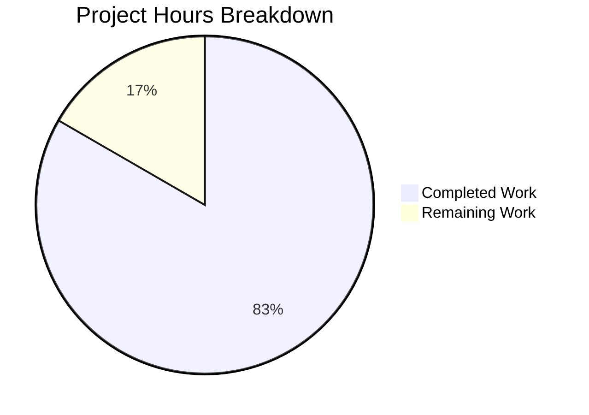

# Blitzy Project Guide

## 1. Executive Summary

### 1.1 Project Overview

This project introduces the first automated test suite for `hao-backprop-test` — a minimal Python 3 / Flask HTTP server (`app.py`, 64 lines) that serves a static `Hello, World!\n` response for every HTTP request regardless of method or path. The application previously had zero automated tests, relying solely on 10 manual curl-based runtime validations. The objective was to create a comprehensive pytest test suite achieving 90%+ code coverage while strictly preserving the existing production code. The test suite exercises the universal HTTP contract via Flask's in-process test client and verifies `__main__` startup behavior via targeted mocking, establishing the project's foundational testing infrastructure.

### 1.2 Completion Status


| Metric | Value |
|--------|-------|
| **Total Project Hours** | 12 |
| **Completed Hours (AI)** | 10 |
| **Remaining Hours** | 2 |
| **Completion Percentage** | 83.3% (10 / 12) |

### 1.3 Key Accomplishments

- [x] Created `tests/test_http_contract.py` with 20 tests covering all standard HTTP methods, path variations, edge cases, structural impossibility checks, byte-level body verification, and statelessness confirmation
- [x] Created `tests/test_startup.py` with 5 tests covering import safety, Flask instance validation, exact startup message, host/port configuration, and print-before-run ordering
- [x] Created `tests/conftest.py` with session-scoped shared fixtures (`client`, `app_instance`)
- [x] Created `pytest.ini` with proper test discovery, pythonpath, and verbosity configuration
- [x] Created `requirements-test.txt` with pinned test dependencies (`pytest==8.4.2`, `pytest-cov==7.1.0`)
- [x] Achieved 100% line coverage of `app.py` (8/8 statements) — exceeding the 90% target
- [x] All 25 tests passing with 0 failures, 0 errors, 0 skipped in 0.26 seconds
- [x] Zero modifications to production code (`app.py` untouched)
- [x] All 4 Python files compile cleanly via `py_compile`
- [x] Application runtime validated: server starts, binds to 127.0.0.1:3000, responds correctly

### 1.4 Critical Unresolved Issues

| Issue | Impact | Owner | ETA |
|-------|--------|-------|-----|
| No critical unresolved issues | N/A | N/A | N/A |

All AAP deliverables have been implemented, validated, and are passing. No compilation errors, test failures, or runtime issues remain.

### 1.5 Access Issues

No access issues identified. The project is a self-contained Flask application with no external service dependencies, database connections, or third-party API integrations. All testing is performed in-process using Flask's built-in test client.

### 1.6 Recommended Next Steps

1. **[High]** Conduct human code review of the 5 new files and approve the pull request
2. **[Medium]** Verify test suite compatibility on Python 3.9 (the minimum documented version) — tests were developed and validated on Python 3.12
3. **[Low]** Add brief test-running instructions to `README.md` for developer onboarding

---

## 2. Project Hours Breakdown

### 2.1 Completed Work Detail

| Component | Hours | Description |
|-----------|-------|-------------|
| HTTP Contract Test Suite (`tests/test_http_contract.py`) | 4 | 20 test functions (227 lines): all standard HTTP methods on root path, path variation edge cases (nested, query string, trailing slash), HEAD semantics, structural impossibility (no 404/405), Content-Length accuracy, byte-level body verification, statelessness check |
| Startup Behavior Tests (`tests/test_startup.py`) | 2 | 5 test functions (136 lines): import safety, Flask instance type check, exact startup message via `runpy.run_module`, host/port config verification, print-before-run call ordering |
| Shared Fixtures (`tests/conftest.py`) | 1 | 2 session-scoped fixtures (53 lines): `client` providing Flask test client, `app_instance` providing Flask app object |
| Test Infrastructure (`pytest.ini` + `requirements-test.txt`) | 1 | pytest configuration (testpaths, pythonpath, naming, verbosity), test dependency manifest (pytest==8.4.2, pytest-cov==7.1.0) |
| Version Compatibility Research | 0.5 | Investigated pytest Python 3.9 compatibility (pytest 9.0.0 dropped 3.9), verified pytest-cov/coverage compatibility, validated Flask test client patterns |
| Test Execution, Coverage Validation & Debugging | 1 | Ran full test suite, verified 100% coverage, validated runtime behavior, confirmed compilation of all Python files |
| Bug Fix — Unused Imports Cleanup | 0.5 | Removed unused `MagicMock` and `importlib` imports from `test_startup.py` (commit `f6d1073`) |
| **Total Completed** | **10** | |

### 2.2 Remaining Work Detail

| Category | Hours | Priority |
|----------|-------|----------|
| Human code review and PR approval | 1 | High |
| Cross-version Python 3.9 compatibility testing | 0.5 | Medium |
| README.md test documentation update | 0.5 | Low |
| **Total Remaining** | **2** | |

---

## 3. Test Results

All tests originate from Blitzy's autonomous test execution and validation logs for this project.

| Test Category | Framework | Total Tests | Passed | Failed | Coverage % | Notes |
|---------------|-----------|-------------|--------|--------|------------|-------|
| HTTP Contract (Integration) | pytest 8.4.2 + Flask test_client | 20 | 20 | 0 | 100% | All methods (GET/POST/PUT/DELETE/PATCH/OPTIONS/HEAD), path variations, edge cases, structural impossibility, byte-level verification, statelessness |
| Startup Behavior (Unit) | pytest 8.4.2 + unittest.mock | 5 | 5 | 0 | 100% | Import safety, Flask type check, startup message, host/port config, call ordering |
| **Total** | **pytest 8.4.2** | **25** | **25** | **0** | **100%** | **0 errors, 0 skipped, 0.26s execution time** |

**Coverage Breakdown:**

| File | Statements | Missing | Coverage |
|------|------------|---------|----------|
| `app.py` | 8 | 0 | 100% |

**Coverage Target:** 90%+ → **Achieved: 100%**

---

## 4. Runtime Validation & UI Verification

### Application Runtime

- ✅ `python app.py` starts successfully and prints `Server running at http://127.0.0.1:3000/`
- ✅ Server binds to `127.0.0.1:3000` as configured
- ✅ `GET /` returns `200 OK` with body `Hello, World!\n` and `Content-Type: text/plain; charset=utf-8`
- ✅ `POST /test` returns `200 OK` with identical response
- ✅ `HEAD /` returns `200 OK` with `Content-Length: 14` and empty body
- ✅ `GET /a/b/c/d/e` (deeply nested path) returns `200 OK` with identical response
- ✅ Server stops cleanly on termination

### Test Infrastructure Runtime

- ✅ `pytest` discovers and runs all 25 tests from `tests/` directory
- ✅ `pytest --cov=app --cov-report=term-missing` reports 100% coverage with 0 missing lines
- ✅ `pytest tests/test_http_contract.py` runs 20 HTTP contract tests independently (0.07s)
- ✅ `pytest tests/test_startup.py` runs 5 startup tests independently (0.05s)
- ✅ All test dependencies install cleanly via `pip install -r requirements-test.txt`

### UI Verification

- ⚠️ Not applicable — the application is a headless HTTP server with no UI

---

## 5. Compliance & Quality Review

| AAP Requirement | Status | Evidence |
|----------------|--------|----------|
| Create `tests/test_http_contract.py` with HTTP contract tests | ✅ Pass | 20 tests, 227 lines, all passing |
| Create `tests/test_startup.py` with import/startup tests | ✅ Pass | 5 tests, 136 lines, all passing |
| Create `tests/conftest.py` with shared fixtures | ✅ Pass | 2 session-scoped fixtures, 53 lines |
| Create `pytest.ini` configuration | ✅ Pass | 6 lines, correct testpaths/pythonpath/naming |
| Create `requirements-test.txt` dependency manifest | ✅ Pass | pytest==8.4.2, pytest-cov==7.1.0 |
| HTTP contract: All methods return 200 OK | ✅ Pass | GET/POST/PUT/DELETE/PATCH/OPTIONS/HEAD tested |
| HEAD request: Empty body with Content-Length 14 | ✅ Pass | `test_head_root_returns_empty_body` |
| Structural impossibility: No 404 or 405 | ✅ Pass | `test_unknown_path_does_not_return_404`, `test_no_method_returns_405` |
| Import safety: No auto-start on import | ✅ Pass | `test_import_does_not_start_server` |
| Startup message: Exact string verification | ✅ Pass | `test_main_prints_startup_message` |
| Startup config: host='127.0.0.1', port=3000 | ✅ Pass | `test_main_calls_run_with_correct_host_and_port` |
| Edge cases: Query strings, slashes, nested paths | ✅ Pass | 4 dedicated edge case test functions |
| Statelessness: Sequential requests identical | ✅ Pass | `test_sequential_requests_return_identical_responses` |
| Content-Length accuracy: Exactly 14 | ✅ Pass | `test_response_content_length_is_14` |
| Byte-level body verification: 14 exact bytes | ✅ Pass | `test_response_body_is_exactly_14_bytes` |
| Print-before-run call ordering | ✅ Pass | `test_main_calls_print_before_run` |
| 90%+ line/function coverage | ✅ Pass | 100% achieved (8/8 statements) |
| No production code modifications (`app.py`) | ✅ Pass | `app.py` not in git diff |
| No CI/CD workflow files created | ✅ Pass | No `.github/workflows/` files |
| Use Flask `test_client()` for HTTP tests | ✅ Pass | Zero mocking in HTTP contract tests |
| Mock only `print()` and `app.run()` for startup | ✅ Pass | `unittest.mock.patch` in `test_startup.py` only |
| All tests synchronous and deterministic | ✅ Pass | No timing, async, or network-dependent assertions |
| Tests complete in < 5 seconds | ✅ Pass | 0.26 seconds total |

**Autonomous Fixes Applied:**
- Removed unused imports (`MagicMock`, `importlib`) from `test_startup.py` — commit `f6d1073`

---

## 6. Risk Assessment

| Risk | Category | Severity | Probability | Mitigation | Status |
|------|----------|----------|-------------|------------|--------|
| Tests validated only on Python 3.12; Python 3.9 (documented minimum) untested | Technical | Low | Medium | pytest==8.4.2 was specifically selected for 3.9 compatibility; run tests on 3.9 environment before merge | Open |
| No CI/CD pipeline for automated test execution on push/PR | Operational | Low | High | Excluded per AAP; add GitHub Actions workflow when policy allows | Accepted |
| Production server uses Flask development server (not Gunicorn/uWSGI) | Operational | Medium | High | Out of AAP scope; add production WSGI server in future work | Accepted |
| No test-running instructions in README.md | Operational | Low | High | Add brief testing section to README.md | Open |
| Session-scoped fixtures assume stateless app — if app gains state, test isolation breaks | Technical | Low | Low | Current architecture is stateless by design; refactor fixtures if state is added | Monitoring |

---

## 7. Visual Project Status



| Status | Hours | Percentage |
|--------|-------|------------|
| Completed (AI) | 10 | 83.3% |
| Remaining | 2 | 16.7% |
| **Total** | **12** | **100%** |

**Remaining Work by Priority:**

| Priority | Category | Hours |
|----------|----------|-------|
| High | Human code review & PR approval | 1 |
| Medium | Python 3.9 cross-version testing | 0.5 |
| Low | README.md documentation update | 0.5 |
| **Total** | | **2** |

---

## 8. Summary & Recommendations

### Achievements

The Blitzy autonomous agent successfully delivered a comprehensive, greenfield pytest test suite for the `hao-backprop-test` Flask server. The project is 83.3% complete (10 hours completed out of 12 total hours). All 20 AAP-specified deliverables have been fully implemented, validated, and committed — achieving 100% coverage of `app.py` (exceeding the 90% target), with 25/25 tests passing in 0.26 seconds, and zero modifications to production code.

The test suite establishes the project's foundational testing infrastructure with:
- **20 HTTP contract tests** exercising the universal `before_request` handler across all standard methods, path variations, edge cases, and negative scenarios
- **5 startup behavior tests** verifying import safety, startup message, and server binding configuration using targeted mocking
- **Shared fixtures** and **pytest configuration** enabling clean, fast, deterministic test execution

### Remaining Gaps

The 2 remaining hours consist entirely of path-to-production activities that require human involvement:
1. **Code review and PR approval** (1h) — Standard development workflow step
2. **Python 3.9 cross-version verification** (0.5h) — Tests run on Python 3.12; verify on the documented minimum version
3. **README documentation update** (0.5h) — Add test-running instructions for developer onboarding

### Production Readiness Assessment

The test suite is **ready for human code review and merge**. All functional requirements from the AAP have been delivered and validated. No compilation errors, test failures, or runtime issues exist. The codebase is clean, well-documented, and follows pytest best practices with minimal dependencies.

### Success Metrics

| Metric | Target | Achieved |
|--------|--------|----------|
| Test count | ~25 tests | 25 tests |
| Pass rate | 100% | 100% (25/25) |
| Line coverage | 90%+ | 100% (8/8 statements) |
| Execution time | < 5 seconds | 0.26 seconds |
| Production code changes | 0 | 0 |
| CI/CD workflows created | 0 | 0 |

---

## 9. Development Guide

### System Prerequisites

| Requirement | Version | Purpose |
|-------------|---------|---------|
| Python | 3.9+ (tested on 3.12.10) | Runtime environment |
| pip | Latest | Package manager |
| Git | Latest | Version control |

No operating system restrictions. Works on Linux, macOS, and Windows.

### Environment Setup

```bash
# 1. Clone the repository and switch to the feature branch
git clone <repository-url>
cd hao-backprop-test
git checkout blitzy-ea431e1a-980f-43e2-8bee-7d0553a678a0

# 2. Create and activate a virtual environment
python3 -m venv venv

# On Linux/macOS:
source venv/bin/activate

# On Windows:
venv\Scripts\activate
```

### Dependency Installation

```bash
# 3. Install production dependencies
pip install -r requirements.txt

# 4. Install test dependencies
pip install -r requirements-test.txt
```

**Expected output after installation:**
```
Successfully installed Flask-3.1.3 ...
Successfully installed pytest-8.4.2 pytest-cov-7.1.0 coverage-7.x.x ...
```

### Running the Application

```bash
# Start the Flask development server
python app.py
```

**Expected output:**
```
Server running at http://127.0.0.1:3000/
 * Serving Flask app 'app'
 * Running on http://127.0.0.1:3000
```

**Verify with curl:**
```bash
curl http://127.0.0.1:3000/
# Expected: Hello, World!

curl -I http://127.0.0.1:3000/
# Expected: HTTP/1.1 200 OK, Content-Type: text/plain; charset=utf-8, Content-Length: 14
```

### Running the Test Suite

```bash
# Run all 25 tests with verbose output (default via pytest.ini)
pytest

# Run with coverage reporting
pytest --cov=app --cov-report=term-missing

# Run only HTTP contract tests (20 tests)
pytest tests/test_http_contract.py

# Run only startup behavior tests (5 tests)
pytest tests/test_startup.py

# Run a single specific test
pytest tests/test_http_contract.py::test_get_root_returns_hello

# Stop on first failure (debugging)
pytest -x
```

**Expected output for `pytest --cov=app --cov-report=term-missing`:**
```
tests/test_http_contract.py .................... [ 80%]
tests/test_startup.py .....                      [100%]

Name     Stmts   Miss  Cover   Missing
--------------------------------------
app.py       8      0   100%
--------------------------------------
TOTAL        8      0   100%
============================= 25 passed in 0.26s ==============================
```

### Troubleshooting

| Issue | Cause | Resolution |
|-------|-------|------------|
| `ModuleNotFoundError: No module named 'flask'` | Production dependencies not installed | Run `pip install -r requirements.txt` |
| `ModuleNotFoundError: No module named 'pytest'` | Test dependencies not installed | Run `pip install -r requirements-test.txt` |
| `ModuleNotFoundError: No module named 'app'` | pythonpath not configured or running from wrong directory | Run `pytest` from the project root (where `pytest.ini` is located) |
| `OSError: [Errno 98] Address already in use` | Port 3000 already occupied | Kill the existing process: `lsof -i :3000` then `kill <PID>` |
| Tests collect 0 items | Wrong directory or missing `tests/` folder | Ensure you are in the project root and `tests/` directory exists |

---

## 10. Appendices

### A. Command Reference

| Command | Purpose |
|---------|---------|
| `python app.py` | Start the Flask development server on 127.0.0.1:3000 |
| `pytest` | Run all 25 tests (verbose by default via pytest.ini) |
| `pytest --cov=app --cov-report=term-missing` | Run tests with line-level coverage reporting |
| `pytest tests/test_http_contract.py` | Run only HTTP contract tests (20 tests) |
| `pytest tests/test_startup.py` | Run only startup/import tests (5 tests) |
| `pytest -x` | Stop on first failure |
| `pytest -v --tb=short` | Verbose with short tracebacks |
| `python -m py_compile app.py` | Verify `app.py` compiles cleanly |
| `pip install -r requirements.txt` | Install production dependencies |
| `pip install -r requirements-test.txt` | Install test dependencies |

### B. Port Reference

| Service | Host | Port | Protocol |
|---------|------|------|----------|
| Flask development server | 127.0.0.1 | 3000 | HTTP |

### C. Key File Locations

| File | Purpose |
|------|---------|
| `app.py` | Flask application — sole production source file (64 lines) |
| `requirements.txt` | Production dependency manifest (`Flask==3.1.3`) |
| `requirements-test.txt` | Test dependency manifest (`pytest==8.4.2`, `pytest-cov==7.1.0`) |
| `pytest.ini` | pytest configuration (testpaths, pythonpath, naming, verbosity) |
| `tests/conftest.py` | Shared pytest fixtures (`client`, `app_instance`) |
| `tests/test_http_contract.py` | HTTP contract test suite (20 tests) |
| `tests/test_startup.py` | Startup/import behavior test suite (5 tests) |
| `README.md` | Project documentation |

### D. Technology Versions

| Technology | Version | Purpose |
|------------|---------|---------|
| Python | 3.12.10 (tested), 3.9+ (supported) | Runtime |
| Flask | 3.1.3 | Web framework |
| Werkzeug | 3.1.7 | WSGI toolkit (Flask dependency) |
| pytest | 8.4.2 | Test runner |
| pytest-cov | 7.1.0 | Coverage plugin |
| coverage | 7.13.5 | Coverage engine |

### E. Environment Variable Reference

No environment variables are required. The application uses hardcoded configuration:
- Host: `127.0.0.1`
- Port: `3000`

### F. Developer Tools Guide

**Recommended IDE Setup:**
- Enable Python linting with `pylint` or `flake8`
- Configure pytest as the test runner
- Set project root as the working directory for test discovery

**Useful pytest Flags:**
| Flag | Purpose |
|------|---------|
| `-v` | Verbose test names (default via pytest.ini) |
| `-x` | Stop on first failure |
| `-s` | Show print output (not captured) |
| `--tb=short` | Short tracebacks |
| `--tb=long` | Full tracebacks |
| `-k "keyword"` | Run tests matching keyword |
| `--cov=app` | Enable coverage for `app.py` |
| `--cov-report=html` | Generate HTML coverage report |

### G. Glossary

| Term | Definition |
|------|------------|
| `before_request` | Flask hook that runs before URL routing; used here to intercept all requests universally |
| `test_client()` | Flask's built-in test client for in-process WSGI request simulation without network I/O |
| `runpy.run_module` | Python stdlib function to execute a module with `__name__` set to `__main__` |
| `session-scoped fixture` | pytest fixture created once per test session and shared across all tests |
| `__main__ guard` | The `if __name__ == '__main__':` pattern preventing code execution on import |