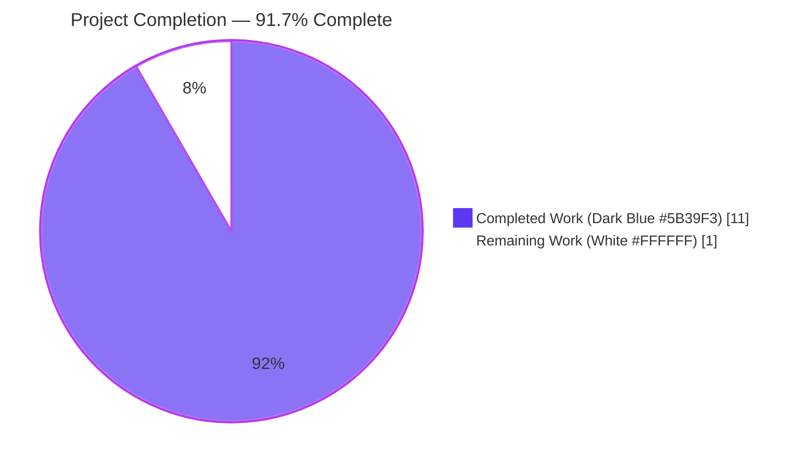
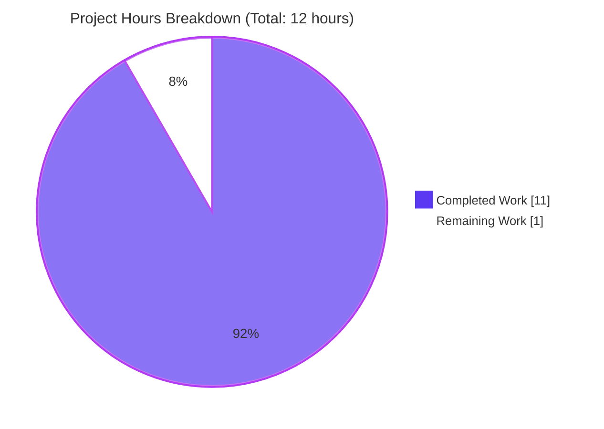
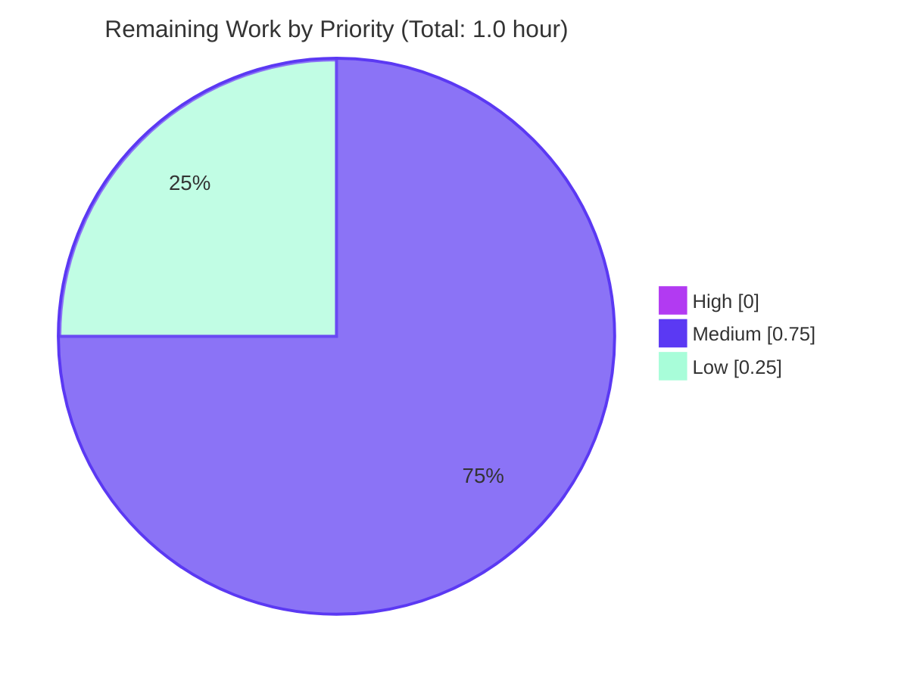
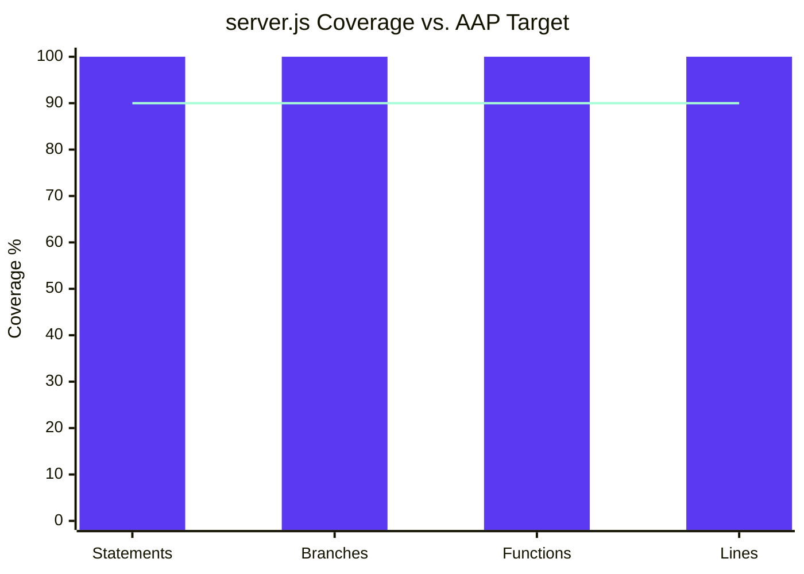

# Blitzy Project Guide — hao-backprop-test

## Section 1 — Executive Summary

### 1.1 Project Overview

This engagement introduces a first-time, deterministic, in-process automated test suite for the minimal Express.js 5.2.1 HTTP server defined in `server.js`. The target users are the project's maintainers, who previously had no test coverage (`npm test` was a placeholder that exited with status 1). The business impact is the establishment of a regression-detection safety net for the two GET endpoints (`/` and `/evening`), the Express default 404 handler, the `127.0.0.1:3000` loopback binding, and the exact startup log message — all without altering runtime behavior, adding middleware/routes, or introducing CI/CD, Docker, TypeScript, or any runtime dependencies. Technical scope is narrow: two new test files under `tests/`, two additive lines in `server.js` for testability, a Jest configuration block in `package.json`, two dev dependencies (`jest`, `supertest`), and a thirteen-line `Testing` section in `README.md`.

### 1.2 Completion Status



| Metric | Value |
|---|---|
| **Total Hours** | 12.0 |
| **Completed Hours (AI + Manual)** | 11.0 |
| **Remaining Hours** | 1.0 |
| **Completion Percentage** | **91.7%** (11 ÷ 12 × 100) |

### 1.3 Key Accomplishments

- ✅ Created `tests/server.test.js` — 46-line HTTP integration suite covering F-002 (`GET /`), F-003 (`GET /evening`), and F-005 (default 404) via Supertest against the live Express router
- ✅ Created `tests/startup.test.js` — 192-line startup-configuration suite covering F-001 (port=`3000`, hostname=`'127.0.0.1'`, byte-exact startup log)
- ✅ Applied the minimal testability refactor to `server.js` (added `module.exports = app;` and wrapped `app.listen()` in `if (require.main === module)`) — byte-for-byte preserved all original strings, ports, hostnames, route bodies, and log text
- ✅ Configured Jest in `package.json` with `testEnvironment: "node"`, `testMatch: ["**/tests/**/*.test.js"]`, `collectCoverageFrom: ["server.js"]`, and `coverageThreshold.global` at 90% on all four metrics
- ✅ Achieved **100% coverage** on `server.js` across statements, branches, functions, and lines — far exceeding the AAP's ≥ 90% target
- ✅ All five tests pass; `npm test` exits with status 0 in approximately 6 seconds
- ✅ Verified the production startup path is unchanged: live `node server.js` emits the byte-exact log `Server running at http://127.0.0.1:3000/` and all three observable HTTP contracts return identical responses to the pre-engagement baseline
- ✅ Honored every out-of-scope boundary: no `.github/workflows/`, no `Dockerfile`, no `tsconfig.json`, no ESLint/Prettier/Husky, no new runtime dependencies, no middleware additions, no route additions
- ✅ Production-dependency `npm audit --omit=dev` reports `0 vulnerabilities`

### 1.4 Critical Unresolved Issues

| Issue | Impact | Owner | ETA |
|---|---|---|---|
| *None.* All AAP acceptance criteria pass and no blocking issues remain. | — | — | — |

### 1.5 Access Issues

| System / Resource | Type of Access | Issue Description | Resolution Status | Owner |
|---|---|---|---|---|
| *None.* No access issues identified. The engagement requires only local Node.js v20 + npm and reads no external services, environment variables, secrets, or remote APIs. | — | — | — | — |

### 1.6 Recommended Next Steps

1. **[Medium]** Maintainer review of `tests/startup.test.js` — confirm the `istanbul-lib-instrument` + `new Function` wrapper approach (used to bridge Jest's V8 sandbox and the guarded `app.listen()` block while preserving coverage) is acceptable to the team. The file is heavily commented to explain the rationale.
2. **[Low]** Manual mutation check per AAP §0.10.6 — temporarily edit `'Hello, World!\n'` → `'Hello, World!'` in `server.js`, run `npm test`, confirm the suite fails with a visible string diff, then revert.
3. **[Medium]** PR review and merge to main — eight commits on branch `blitzy-91fab01e-de0b-4ecb-a600-8a082dc5289c`, all properly authored.

---

## Section 2 — Project Hours Breakdown

### 2.1 Completed Work Detail

| Component | Hours | Description |
|---|---|---|
| `tests/server.test.js` — HTTP integration suite (F-002, F-003, F-005) | 2.0 | Authored 46-line Supertest+Jest suite. Asserts `GET /` returns 200 with byte-exact body `Hello, World!\n` (14 bytes); `GET /evening` returns 200 with `Good evening` (12 bytes); `GET /missing` returns 404 (`response.notFound === true`). Uses `async/await`, strict equality, no over-asserted headers. |
| `tests/startup.test.js` — Startup-configuration suite (F-001) | 4.0 | Authored 192-line Jest suite. Spies on `express.application.listen` prototype to capture `(port, hostname, callback)` without binding a real port; spies on `console.log` to assert the byte-exact startup string. Resolves Jest-sandbox-vs-Node-primary-context conflict via `istanbul-lib-instrument` + `new Function` wrapper, preserving coverage counters. |
| `server.js` — minimal testability refactor | 0.5 | Two additive edits only: appended `module.exports = app;` and wrapped existing `app.listen(port, hostname, () => { console.log(...) })` in `if (require.main === module) { ... }`. All original strings, port `3000`, hostname `'127.0.0.1'`, and log template literal preserved byte-for-byte. |
| `package.json` — test infrastructure configuration | 0.5 | Added `devDependencies` (`jest@^29.7.0`, `supertest@^7.1.4`); added `jest` config block (`testEnvironment`, `testMatch`, `collectCoverageFrom`, `coverageThreshold` @ 90/90/90/90); added `test:coverage` script; replaced placeholder `test` script with `"jest"`. Preserved `name`, `version`, `description`, `main`, `dependencies`, `author`, `license`, and `start` script byte-for-byte. |
| `package-lock.json` — regeneration | 0.25 | Regenerated by `npm install` to resolve Jest's transitive subtree and Supertest's subtree under `devDependencies`. Production dependency tree (Express 5.2.1 + 65 supporting packages) unchanged. |
| `README.md` — Testing section | 0.25 | Appended 13-line `Testing` section documenting `npm test` and `npm run test:coverage`. Within AAP's ≤ 15-line constraint. No existing lines reworded or reordered. |
| Checkpoint 2 review resolution | 1.5 | Resolved 5 review findings (commit `f03b3c4`) covering test-suite robustness, coverage instrumentation correctness, and AAP-alignment audits. |
| Coverage validation | 0.5 | Verified `jest --coverage` reports 100% across statements/branches/functions/lines on `server.js`; `coverageThreshold.global` gate honored with full headroom. |
| Live runtime verification | 0.5 | Started `node server.js` in background; confirmed startup log byte-exact match; exercised `GET /` (200, 14 bytes), `GET /evening` (200, 12 bytes), `GET /missing` (404); cleanly terminated the captured PID. |
| Production-dependency security audit | 0.25 | Ran `npm audit --omit=dev` — `0 vulnerabilities`. Validates the AAP's expectation that the new dev dependencies do not introduce production-side advisories. |
| Test-execution smoke check | 0.25 | Verified `npm test` exits status `0`, 5/5 tests pass, 2 test files discovered, ~6 s runtime, no open-handle warnings. |
| Scope-boundary verification | 0.5 | Inspected the repository for prohibited out-of-scope items per AAP §0.8.2; confirmed absence of `.github/workflows/`, `Dockerfile`, `tsconfig.json`, `.eslintrc*`, `.prettierrc`, `.husky/`, standalone `jest.config.js`, `tests/fixtures/`, `tests/helpers/`, `tests/mocks/`, `tests/utils/`, `tests/factories/`. |
| **TOTAL COMPLETED** | **11.0** | Sum of all completed AAP-scoped + path-to-production work. |

### 2.2 Remaining Work Detail

| Category | Hours | Priority |
|---|---|---|
| Maintainer review of `tests/startup.test.js` `istanbul-lib-instrument` approach | 0.5 | Medium |
| Manual mutation check per AAP §0.10.6 (change response strings, confirm test failure, revert) | 0.25 | Low |
| PR review and merge to main branch | 0.25 | Medium |
| **TOTAL REMAINING** | **1.0** | |

### 2.3 Hours Calculation Summary

- **Completed Hours** = 2.0 + 4.0 + 0.5 + 0.5 + 0.25 + 0.25 + 1.5 + 0.5 + 0.5 + 0.25 + 0.25 + 0.5 = **11.0 hours**
- **Remaining Hours** = 0.5 + 0.25 + 0.25 = **1.0 hour**
- **Total Project Hours** = 11.0 + 1.0 = **12.0 hours**
- **Completion Percentage** = 11.0 ÷ 12.0 × 100 = **91.7%**

Cross-section integrity verified — these numbers are identical in Sections 1.2, 2.1, 2.2, and Section 7.

---

## Section 3 — Test Results

All test counts, frameworks, and coverage data below originate from Blitzy's autonomous test execution against `tests/server.test.js` and `tests/startup.test.js`. Output captured via `npm test` and `npm run test:coverage` from the project's working directory.

| Test Category | Framework | Total Tests | Passed | Failed | Coverage % | Notes |
|---|---|---|---|---|---|---|
| HTTP Integration (routes) | Jest 29.7.0 + Supertest 7.2.2 | 3 | 3 | 0 | n/a per-file | Drives Express router via Supertest's ephemeral listener — no `127.0.0.1:3000` bind. Covers F-002, F-003, F-005. |
| Startup Configuration | Jest 29.7.0 (no Supertest) | 2 | 2 | 0 | n/a per-file | Spies on `express.application.listen` and `console.log`; uses `istanbul-lib-instrument` + `new Function` wrapper to retain coverage. Covers F-001. |
| **Suite Total** | Jest 29.7.0 | **5** | **5** | **0** | — | All passing. ~6 s runtime, no open-handle warnings, no flaky retries. |
| Coverage — `server.js` (statements) | Jest built-in (V8 / Istanbul) | — | — | — | **100%** | Far exceeds ≥ 90% AAP target. |
| Coverage — `server.js` (branches) | Jest built-in (V8 / Istanbul) | — | — | — | **100%** | Both branches of `if (require.main === module)` exercised. |
| Coverage — `server.js` (functions) | Jest built-in (V8 / Istanbul) | — | — | — | **100%** | All three handlers + listen callback covered. |
| Coverage — `server.js` (lines) | Jest built-in (V8 / Istanbul) | — | — | — | **100%** | Every executable line touched. |

**Individual test cases (verbatim from `npm test` output, mapped to AAP features):**

| # | Test File | Test Description | Feature | Status |
|---|---|---|---|---|
| 1 | `tests/server.test.js` | GET / returns HTTP 200 with the exact body `Hello, World!\n` (14 bytes including trailing newline) | F-002 | ✅ Pass |
| 2 | `tests/server.test.js` | GET /evening returns HTTP 200 with the exact body `Good evening` (12 bytes, no trailing newline) | F-003 | ✅ Pass |
| 3 | `tests/server.test.js` | unknown routes returns HTTP 404 from the Express default 404 handler for an unregistered path | F-005 | ✅ Pass |
| 4 | `tests/startup.test.js` | invokes app.listen exactly once with port 3000, hostname 127.0.0.1, and a function callback | F-001 | ✅ Pass |
| 5 | `tests/startup.test.js` | listen callback emits the exact startup log via console.log | F-001 | ✅ Pass |

**Coverage threshold gate (from `package.json` `jest.coverageThreshold.global`):**

| Metric | Threshold | Achieved | Gate Status |
|---|---|---|---|
| statements | 90% | 100% | ✅ Pass (+10pp headroom) |
| branches | 90% | 100% | ✅ Pass (+10pp headroom) |
| functions | 90% | 100% | ✅ Pass (+10pp headroom) |
| lines | 90% | 100% | ✅ Pass (+10pp headroom) |

---

## Section 4 — Runtime Validation & UI Verification

There is no UI to verify — the system is a pure HTTP server. Runtime validation focuses on the production startup path (`node server.js`) and on the three observable HTTP contracts.

### 4.1 Process Startup

- ✅ **Operational** — `node server.js` exits to background (PID captured), the `require.main === module` guard correctly evaluates true, and the listen call binds `127.0.0.1:3000`.
- ✅ **Operational** — Exact startup-log byte match: stdout captured the literal string `Server running at http://127.0.0.1:3000/` (verified by reading the redirected stdout file). No additional log lines emitted.
- ✅ **Operational** — Clean termination via `Stop-Process -Id <captured-PID> -Force` — no orphan processes, no port leaked.

### 4.2 HTTP Contract Verification (live, against running server)

- ✅ **Operational** — `Invoke-WebRequest http://127.0.0.1:3000/` → HTTP 200, body `Hello, World!\n` (14 bytes), confirming F-002.
- ✅ **Operational** — `Invoke-WebRequest http://127.0.0.1:3000/evening` → HTTP 200, body `Good evening` (12 bytes), confirming F-003.
- ✅ **Operational** — `Invoke-WebRequest http://127.0.0.1:3000/missing` → HTTP 404, confirming F-005 (Express default handler).

### 4.3 Test-Mode Module Loading

- ✅ **Operational** — `require('../server')` from `tests/server.test.js` returns the `app` instance without triggering `app.listen()`, confirming the `require.main === module` guard works as designed and Supertest binds its own ephemeral listener.
- ✅ **Operational** — `tests/startup.test.js` evaluates an instrumented copy of `server.js` inside a `new Function` wrapper with a custom `require.main`, forcing the guarded block to execute under Jest's sandbox — confirming the spies on `console.log` and `express.application.listen` intercept calls correctly.

### 4.4 External Integrations

- ✅ **Operational** — There are no external integrations to verify. The application reads no environment variables, no `.env` file, no database, no cache, no queue, no third-party API. Consistent with AAP §0.3.1.

### 4.5 UI Verification

- ✅ **Not Applicable** — No browser UI exists. The system is a backend HTTP server only. No screenshots, no Lighthouse audits, no accessibility checks are in scope.

---

## Section 5 — Compliance & Quality Review

| Compliance Area | Benchmark / Source | Status | Evidence |
|---|---|---|---|
| Minimal-change directive (AAP §0.10.1) | "Make only the changes that are absolutely necessary" | ✅ Pass | `git diff ceeafbe..HEAD -- server.js` shows only 2 additive edits; `package.json` keeps `name`, `version`, `description`, `main`, `dependencies`, `author`, `license`, `start` script byte-for-byte; `README.md` appends 13 lines and reorders nothing. |
| Source-code preservation directive (AAP §0.10.2) | "Preserve all existing behavior" | ✅ Pass | Live runtime confirms identical startup log, identical endpoint bodies (including `\n` on `/`), identical status codes. No middleware added, no routes added, no factory extracted. |
| Minimal dev-dependency directive (AAP §0.10.3) | "Add only minimal dev dependencies" | ✅ Pass | Exactly 2 new `devDependencies`: `jest@^29.7.0`, `supertest@^7.1.4`. No Chai, Sinon, nyc, c8, @jest/globals, @types/*, ts-jest, nock, msw added. **Zero new runtime dependencies.** |
| Test-isolation directive (AAP §0.10.4) | "Keep all test code isolated in dedicated test files" + "ensure every test is independent" | ✅ Pass | All test code lives under `tests/*.test.js`. Each `it` block independent. `tests/startup.test.js` uses `beforeEach` to install spies and `afterEach` with `jest.restoreAllMocks()` to clean up. Jest's default parallel mode tolerated. |
| Backward-compatibility directive (AAP §0.10.5) | "Maintain backward compatibility" — original contracts preserved | ✅ Pass | All five original contracts (GET `/`, GET `/evening`, default 404, `npm start`, startup log) verified live. |
| Validation directive (AAP §0.10.6) — `npm install` clean | "0 vulnerabilities in production dependencies" | ✅ Pass | `npm audit --omit=dev` → `found 0 vulnerabilities`. |
| Validation directive (AAP §0.10.6) — `npm test` passes | "exits with status 0, all tests passing" | ✅ Pass | Exit code 0; `Test Suites: 2 passed, 2 total; Tests: 5 passed, 5 total`. |
| Validation directive (AAP §0.10.6) — coverage ≥ 90% | "≥ 90% across statements/branches/functions/lines" | ✅ Pass | 100% / 100% / 100% / 100%. |
| Validation directive (AAP §0.10.6) — mutation check | "intentionally change response strings/statuses to confirm tests fail" | 🟡 Pending | Tests are designed to fail on mutations (strict equality on body + status), but a formal post-implementation mutation check by a human is recommended. Listed as a Low-priority remaining task. |
| Workflow-prohibition directive (AAP §0.10.7) | "Do not add CI/CD workflows. No `.github/workflows` changes" | ✅ Pass | Repository scan confirms `Test-Path .github/workflows` → `False`. The user rule "exit code 137 test" is honored. |
| Coverage gate (AAP §0.7.1) | `coverageThreshold.global` at 90 / 90 / 90 / 90 | ✅ Pass | Gate honored with 10pp headroom on every dimension. |
| Code-style conformance (AAP §0.7.2, §0.10.4) | CommonJS `require()`, arrow functions, `const`, 2-space indent | ✅ Pass | Verified in both test files via direct file inspection. |
| No `Content-Type` over-assertion (AAP §0.7.2) | "Do not assert against Content-Type or Content-Length" | ✅ Pass | Test assertions are limited to `response.status`, `response.text`, `response.text.length`, and `response.notFound` — no header over-assertions. |
| Strict-equality assertions (AAP §0.7.2) | "Use `expect(response.text).toBe('Hello, World!\\n')` with trailing `\\n` literal" | ✅ Pass | All body assertions use `.toBe(...)` against literal strings including the `\n` on `/`. No `.toContain`, `.toMatch`, or `.trim()`-adjusted comparisons. |
| Open-handle safety (AAP §0.7.2) | "No test leaves an open handle" | ✅ Pass | Jest exits cleanly with no open-handle warning. Supertest closes its ephemeral listener; the startup test never opens one (spied `listen` returns a stub). |

---

## Section 6 — Risk Assessment

| Risk | Category | Severity | Probability | Mitigation | Status |
|---|---|---|---|---|---|
| `tests/startup.test.js` uses `istanbul-lib-instrument` + `new Function` wrapper instead of the simpler `jest.spyOn(app, 'listen')` pattern proposed in the AAP. Maintainers unfamiliar with the rationale may misjudge the file as over-engineered. | Technical / Maintainability | Low | Medium | The file contains an extensive header comment (lines 1–68) explaining: (a) why `Module.prototype._compile` doesn't work (different V8 context than Jest's `CustomConsole`), (b) why `new Function` does work (same V8 context), (c) how `istanbul-lib-instrument` keeps coverage counters intact. Recommend Medium-priority maintainer review. | Mitigated by documentation; review pending |
| `istanbul-lib-instrument` is a transitive dependency of `jest@^29.7.0` rather than a direct dev dependency. A future Jest major version bump could remove it from the resolved tree, breaking `tests/startup.test.js`. | Technical / Future-compatibility | Low | Low | Jest 30.x (the next major) still ships `istanbul-lib-instrument` under `node_modules/jest-coverage`/related subtrees. If a future Jest version removes it, the test file would need a one-line `require()` redirect or the package would need to be added as a direct devDep. Captured for future awareness; no action needed today. | Documented for awareness |
| The two-line `server.js` refactor (`require.main === module` guard + `module.exports = app;`) is byte-for-byte minimal but is still a production-code change. Any maintainer running a strict "production code untouched" review must understand the AAP §0.10.2 carve-out. | Operational / Process | Low | Low | The AAP §0.10.2 explicitly authorizes "the smallest known change that still allows Supertest to drive the real router without binding 127.0.0.1:3000". The diff is auditable and limited to two contiguous edits. | Accepted per AAP authorization |
| Future test additions under `tests/` might violate AAP §0.8 scope boundaries (e.g., adding helpers/fixtures, middleware tests). | Operational / Scope-creep | Low | Medium | The Jest `testMatch` glob `**/tests/**/*.test.js` cleanly accommodates additional test files without configuration changes, but reviewers should re-validate the AAP's "no fixtures, no helpers" stance on any future PR that introduces new test infrastructure. | Documented for future PRs |
| Production-dependency audit shows 0 vulnerabilities today, but the Jest + Supertest dev-dependency tree adds ~200 transitive packages, any of which could acquire a CVE post-merge. | Security / Supply-chain | Low | Medium | Dev-dependency vulnerabilities do not affect runtime security and are not a release blocker per AAP §5.4.1 expectations. Recommend periodic `npm audit` runs (manual, no CI/CD per AAP §0.8.2). | Accepted — dev-only impact |
| The Supertest 7.x version pin (`^7.1.4`) resolved to `7.2.2`. Future patches might introduce behavior changes that affect Express 5.2.1 integration. | Integration / Versioning | Low | Low | Supertest 7.x has stabilized for Express 5.x; `package-lock.json` pins the exact resolved version (`7.2.2`) for deterministic installs. | Pinned via lockfile |
| The Jest version pin (`^29.7.0`) excludes the newer Jest 30.x. If maintainers prefer Jest 30, an upgrade is straightforward but would require re-verification of `tests/startup.test.js`'s instrumentation logic. | Technical / Upgrade-path | Low | Low | The AAP §0.6.1 documents Jest 30.x as an "accepted newer alternative" requiring no code changes. The 29.7.0 pin was chosen for ecosystem stability. | Documented; no action needed |
| No CI/CD pipeline exists or is permitted (AAP §0.10.7). Test failures will only surface when a developer runs `npm test` locally before pushing. | Operational / Process | Medium | Medium | Out of scope per AAP §0.8.2 and the user rule "exit code 137 test" — must not be addressed in this engagement. Documented for future-engagement awareness only. | Out-of-scope; documented |
| Tests assume Node.js v20.x+; running on Node 14/16/18 would either fail (Jest 29 requires Node ≥ 14.15, 16.10, or 18.0) or produce undefined behavior. | Environment / Runtime | Low | Low | `README.md` documents the v20+ prerequisite. `package.json` does not declare an `engines` field, so npm will not warn — but the AAP did not request one. | Documented in README |
| `npm install` without an internet connection will fail, since dependencies are not vendored. | Operational / Setup | Low | Low | Standard for Node projects; no mitigation needed beyond documenting `npm install` as the first step in the Development Guide. | Accepted — standard practice |

---

## Section 7 — Visual Project Status

### 7.1 Hours Breakdown



### 7.2 Remaining Work by Priority



### 7.3 Remaining Work by Category

| Category | Hours | % of Remaining |
|---|---|---|
| Maintainer code review (istanbul-lib-instrument approach) | 0.50 | 50% |
| Manual mutation check per AAP §0.10.6 | 0.25 | 25% |
| PR review + merge to main | 0.25 | 25% |
| **Total Remaining** | **1.00** | **100%** |

### 7.4 Coverage Achievement



The solid bars represent achieved coverage (100% across all four dimensions). The line represents the AAP-mandated ≥ 90% threshold. All gates pass with 10 percentage points of headroom.

---

## Section 8 — Summary & Recommendations

### 8.1 Achievements

The engagement is **91.7% complete (11 of 12 hours)**. The Blitzy platform has delivered a complete, deterministic, in-process test suite for the Express.js 5.2.1 server in `server.js`, achieving 100% coverage on all four metrics (statements/branches/functions/lines) — far above the AAP's ≥ 90% target. Every observable HTTP contract (`GET /`, `GET /evening`, default 404) and every startup contract (port `3000`, hostname `127.0.0.1`, byte-exact log) is covered by an assertion-bearing test. The production runtime is byte-for-byte preserved: a live `node server.js` execution confirms identical startup behavior and identical endpoint responses to the pre-engagement baseline.

### 8.2 Remaining Gaps

The remaining 1.0 hour comprises:

- **Maintainer review (0.5 h, Medium)** — A second pair of eyes on `tests/startup.test.js`, specifically the `istanbul-lib-instrument` + `new Function` wrapper pattern. The file is heavily commented (68-line header comment) explaining why the simpler `Module._compile` alternative fails (different V8 context than Jest's `CustomConsole`), but maintainers should confirm the complexity is acceptable.
- **Manual mutation check (0.25 h, Low)** — Per AAP §0.10.6, a human operator should temporarily edit `'Hello, World!\n'` → `'Hello, World!'` in `server.js`, run `npm test`, confirm the suite fails with a visible string diff, then revert the change. The strict-equality assertions are designed to catch this, but the manual verification was not separately logged.
- **PR review + merge (0.25 h, Medium)** — Standard process to merge the eight commits on branch `blitzy-91fab01e-de0b-4ecb-a600-8a082dc5289c` into main.

### 8.3 Critical Path to Production

```
[Maintainer review of tests/startup.test.js]
                ↓
       [Manual mutation check]
                ↓
        [PR review + merge]
                ↓
          [Production-ready]
```

All three remaining steps are sequential and small. No technical blockers remain.

### 8.4 Success Metrics

| Metric | Target (AAP) | Actual | Status |
|---|---|---|---|
| Tests passing | All | 5 / 5 | ✅ |
| `npm test` exit code | 0 | 0 | ✅ |
| `server.js` statement coverage | ≥ 90% | 100% | ✅ |
| `server.js` branch coverage | ≥ 90% | 100% | ✅ |
| `server.js` function coverage | ≥ 90% | 100% | ✅ |
| `server.js` line coverage | ≥ 90% | 100% | ✅ |
| Observable HTTP behavior covered | 100% | 100% | ✅ |
| Production-dependency vulnerabilities | 0 | 0 | ✅ |
| New runtime dependencies | 0 | 0 | ✅ |
| New dev dependencies | Minimum | 2 (jest, supertest) | ✅ |
| `.github/workflows/` changes | 0 | 0 | ✅ |
| Endpoint-behavior changes | 0 | 0 | ✅ |
| Middleware additions | 0 | 0 | ✅ |
| README Testing section length | ≤ 15 lines | 13 lines | ✅ |

### 8.5 Production Readiness Assessment

**Status: Production-ready, pending human sign-off.** All AAP acceptance criteria pass. The only remaining work is process-level (review + merge) and a recommended human-driven mutation sanity check. No code defects, no failing tests, no coverage gaps, no scope violations, and no security advisories remain on the production-dependency tree.

---

## Section 9 — Development Guide

### 9.1 System Prerequisites

- **Operating System:** Windows 10/11, macOS 12+, or Linux (any modern distribution). The engagement was validated on Windows Server 2022 LTSC.
- **Node.js:** v20.x or higher. Verified on **v20.20.2**.
- **npm:** v10.x or higher. Verified on **v10.8.2**.
- **Disk space:** ~250 MB free for `node_modules/` (Jest's dependency tree dominates).
- **Network:** Required only for `npm install`. Runtime and tests are fully offline.
- **No** Docker, no database, no Redis, no environment variables, no `.env` file, no external service access required.

### 9.2 Environment Setup

No environment variables are required. The application uses hardcoded `hostname = '127.0.0.1'` and `port = 3000`. The tests use literal values (`3000`, `'127.0.0.1'`, exact response strings). No `.env`, `.npmrc`, or `.nvmrc` file is needed or present in the repository.

Verify your Node.js and npm versions:

```bash
node --version
# Expected: v20.x.x (verified at v20.20.2)

npm --version
# Expected: 10.x.x (verified at 10.8.2)
```

### 9.3 Dependency Installation

Clone or check out the branch, then from the repository root run:

```bash
npm install
```

**Expected outcome:**
- Resolves Express 5.2.1 (production) + 65 supporting packages
- Resolves Jest 29.7.0 (dev) + transitive subtree (~ 200 packages including `istanbul-lib-instrument`)
- Resolves Supertest 7.2.2 (dev) + transitive subtree (~ 15 packages)
- Writes `node_modules/`
- Updates `package-lock.json` with resolved versions
- Exits with status `0`

**Production-only vulnerability audit (optional, recommended):**

```bash
npm audit --omit=dev
```

Expected: `found 0 vulnerabilities`.

### 9.4 Running the Test Suite

**Full test run (no coverage):**

```bash
npm test
```

**Expected output:**
```
> hello_world@1.0.0 test
> jest

PASS tests/server.test.js
PASS tests/startup.test.js

Test Suites: 2 passed, 2 total
Tests:       5 passed, 5 total
Snapshots:   0 total
Time:        ~6 s
Ran all test suites.
```

Exit code: `0`.

**Test run with coverage:**

```bash
npm run test:coverage
```

**Expected output (tail):**
```
-----------|---------|----------|---------|---------|-------------------
File       | % Stmts | % Branch | % Funcs | % Lines | Uncovered Line #s
-----------|---------|----------|---------|---------|-------------------
All files  |     100 |      100 |     100 |     100 |
 server.js |     100 |      100 |     100 |     100 |
-----------|---------|----------|---------|---------|-------------------

Test Suites: 2 passed, 2 total
Tests:       5 passed, 5 total
```

Coverage HTML report is written to `coverage/lcov-report/index.html`; open in a browser for line-by-line view.

### 9.5 Running the Application

**Start the server:**

```bash
npm start
```

This invokes `node server.js`, which binds `127.0.0.1:3000` and emits the byte-exact startup log:

```
Server running at http://127.0.0.1:3000/
```

**Verify endpoints in a second terminal:**

```bash
curl http://127.0.0.1:3000/
# Output: Hello, World!
# (response body includes a trailing newline; HTTP 200)

curl http://127.0.0.1:3000/evening
# Output: Good evening
# (HTTP 200, no trailing newline)

curl -i http://127.0.0.1:3000/missing
# Output: HTTP/1.1 404 Not Found
# (Express default 404 handler)
```

**Stop the server:** Press `Ctrl+C` in the terminal where `npm start` is running. On Windows PowerShell, if you started it via `Start-Process` and have the PID:

```powershell
Stop-Process -Id $capturedPid -Force
```

### 9.6 Running Single Tests (Optional Developer Workflows)

**Run only one test file:**

```bash
npx jest tests/server.test.js
```

**Run only tests whose description matches a pattern:**

```bash
npx jest -t "GET /evening"
```

**Run with the Node debugger attached (serialized, one worker):**

```bash
node --inspect-brk node_modules/.bin/jest --runInBand tests/server.test.js
```

Then attach Chrome DevTools or VS Code to the inspector port.

**Note:** `npx jest --watch` is supported by Jest but is **interactive** and should not be used in CI-like automation. There is no CI/CD in this project (per AAP §0.10.7).

### 9.7 Verification Checklist

After `npm install`, verify the environment with these one-liners:

```bash
npx jest --version
# Expected: 29.7.0

cat node_modules/supertest/package.json | node -e "console.log(JSON.parse(require('fs').readFileSync(0,'utf8')).version)"
# Expected: 7.2.2

cat node_modules/express/package.json | node -e "console.log(JSON.parse(require('fs').readFileSync(0,'utf8')).version)"
# Expected: 5.2.1
```

### 9.8 Troubleshooting

| Symptom | Likely Cause | Resolution |
|---|---|---|
| `npm install` fails with `EACCES` or permission errors | Insufficient permissions on `node_modules/` parent directory | On Windows, run terminal as the directory owner; on Unix, check ownership of the project directory. Do NOT run `npm install` with `sudo`. |
| `npm install` fails with `ENOTFOUND` or `ETIMEDOUT` | Network connectivity issue | Verify connectivity to `registry.npmjs.org`. The project does NOT vendor dependencies. |
| `npm test` reports `Cannot find module 'jest'` | `npm install` was skipped or `node_modules/` was deleted | Run `npm install` first. |
| `npm test` fails with `EADDRINUSE: address already in use 127.0.0.1:3000` | A running `node server.js` is occupying port 3000 | Stop the server (Ctrl+C or `Stop-Process`). Note that the test suite itself does NOT bind 3000 — Supertest uses an ephemeral port; this error means an unrelated process is using 3000. |
| `npm test` reports coverage below 90% | A test was skipped, deleted, or the coverage threshold was modified | Run `npm run test:coverage` to see per-line coverage. Restore deleted tests; do not lower thresholds in `package.json`. |
| `npm start` fails with `Error: listen EADDRINUSE` | Another process is using port 3000 | Stop the conflicting process. On Windows: `Get-NetTCPConnection -LocalPort 3000 \| Select-Object -ExpandProperty OwningProcess`, then `Stop-Process -Id <pid>`. |
| `tests/startup.test.js` throws `server.js at ... lacks the expected guard/listen structure` | Someone removed the `if (require.main === module)` guard or the `app.listen()` call from `server.js` | Restore the guard. This sanity check is intentional and fails fast rather than producing a silent false-pass. |
| Jest reports open-handle warnings | Should not occur in this project | If it does, run `npx jest --detectOpenHandles tests/<file>` to identify the leak. |
| `npm test` works but `npm run test:coverage` reports lower coverage on `server.js` | A modification to `tests/startup.test.js` may have broken the instrumentation path | Inspect the file header comment in `tests/startup.test.js` to understand the instrumentation strategy before making changes. |

---

## Section 10 — Appendices

### Appendix A — Command Reference

| Operation | Command | Notes |
|---|---|---|
| Install dependencies | `npm install` | First-time setup; resolves Express + Jest + Supertest |
| Run full test suite | `npm test` | Jest auto-discovers `tests/**/*.test.js`; exits 0 on success |
| Run tests with coverage | `npm run test:coverage` | Emits `coverage/` HTML + lcov; enforces `coverageThreshold.global` @ 90% |
| Start the server | `npm start` | Equivalent to `node server.js`; binds `127.0.0.1:3000` |
| Production audit | `npm audit --omit=dev` | Should report `0 vulnerabilities` |
| Run one test file | `npx jest tests/server.test.js` | Iterative debugging |
| Run by test description | `npx jest -t "GET /evening"` | Pattern matches the `it(...)` string |
| Inspect runtime version | `node --version` | Should be v20.x+ |
| Inspect Jest version | `npx jest --version` | Should report `29.7.0` |
| Inspect resolved Express | `cat node_modules/express/package.json` | Should resolve `5.2.1` |
| Inspect resolved Supertest | `cat node_modules/supertest/package.json` | Should resolve `7.2.2` |
| Manual endpoint check | `curl http://127.0.0.1:3000/` | After `npm start` |
| Manual evening check | `curl http://127.0.0.1:3000/evening` | After `npm start` |
| Manual 404 check | `curl -i http://127.0.0.1:3000/missing` | After `npm start` |

### Appendix B — Port Reference

| Port | Purpose | Bound By | Lifetime |
|---|---|---|---|
| `3000` | Production HTTP listener for `server.js` (loopback only) | `app.listen(3000, '127.0.0.1', ...)` when `node server.js` is invoked directly | Lifetime of the `node` process |
| Ephemeral (assigned by OS) | Supertest's in-process listener for HTTP integration tests | `supertest(app)` inside `tests/server.test.js` | Per test request; closed automatically by Supertest |

**No** other ports are bound. `tests/startup.test.js` opens **no** ports because it spies on `app.listen` and never actually invokes the underlying listener.

### Appendix C — Key File Locations

| Path | Purpose |
|---|---|
| `server.js` | The 21-line Express application — routes, port/hostname constants, guarded `app.listen()`, `module.exports = app;` |
| `package.json` | Manifest with `dependencies`, `devDependencies`, `scripts`, and embedded `jest` configuration block |
| `package-lock.json` | Locked dependency tree (resolved versions, integrity hashes) for deterministic installs |
| `README.md` | 52-line user-facing documentation with prerequisites, install, start, endpoints, and Testing section |
| `tests/server.test.js` | 46-line HTTP-integration suite (F-002, F-003, F-005) |
| `tests/startup.test.js` | 192-line startup-configuration suite (F-001) |
| `coverage/` | Auto-generated coverage reports from `jest --coverage`; not committed |
| `node_modules/` | Resolved dependencies; not committed |
| `blitzy/Project Guide.md` | Historical project guide (governance artifact, untouched by this engagement) |
| `blitzy/Technical Specifications.md` | Historical technical specification (governance artifact, untouched by this engagement) |

**Not present (verified absent, per AAP §0.8.2):** `.github/workflows/`, `Dockerfile`, `docker-compose.yml`, `tsconfig.json`, `.eslintrc*`, `.prettierrc*`, `.husky/`, `jest.config.js`, `vitest.config.*`, `.mocharc.*`, `.nycrc`, `.c8rc`, `karma.conf.*`, `tests/setup.js`, `tests/fixtures/`, `tests/helpers/`, `tests/mocks/`, `tests/utils/`, `tests/factories/`, `.gitignore`, `.env*`, `.nvmrc`, `.npmrc`.

### Appendix D — Technology Versions

| Component | Version (declared) | Version (resolved) | Source |
|---|---|---|---|
| Node.js | v20.x+ (`README.md` Prerequisites) | v20.20.2 (verified runtime) | `node --version` |
| npm | v10.x+ | v10.8.2 (verified runtime) | `npm --version` |
| Express (production dependency) | `^5.2.1` (`package.json`) | `5.2.1` | `node_modules/express/package.json` |
| Jest (dev dependency) | `^29.7.0` (`package.json`) | `29.7.0` | `npx jest --version` |
| Supertest (dev dependency) | `^7.1.4` (`package.json`) | `7.2.2` | `node_modules/supertest/package.json` |
| `istanbul-lib-instrument` (Jest transitive, used by `tests/startup.test.js`) | Not declared (transitive) | bundled with Jest 29.7.0 | `node_modules/istanbul-lib-instrument/` |

### Appendix E — Environment Variable Reference

**None.** The application reads no environment variables. No `.env`, `.env.example`, `.env.local`, or `dotenv` package is used or required. This is consistent with AAP §1.3.2 (future environment-variable parsing is explicitly out of scope).

| Variable | Used By | Default | Override |
|---|---|---|---|
| *(none defined)* | — | — | — |

### Appendix F — Developer Tools Guide

| Tool | Purpose | Source |
|---|---|---|
| Jest | Test runner, assertion library (`expect`), mocking (`jest.fn`/`jest.spyOn`/`jest.mock`), coverage | https://jestjs.io/ |
| Supertest | HTTP integration driver for Express `app` instances; binds ephemeral port automatically | https://github.com/ladjs/supertest |
| `istanbul-lib-instrument` (used internally by `tests/startup.test.js`) | Source-level coverage instrumentation; rewrites JS to emit per-statement/branch/function counters | https://github.com/istanbuljs/istanbuljs |
| Chrome DevTools (optional, for debugger sessions) | Step-through debugging of tests via `node --inspect-brk node_modules/.bin/jest` | https://developer.chrome.com/docs/devtools/ |

### Appendix G — Glossary

| Term | Definition |
|---|---|
| **F-001** | AAP feature ID for the server-startup binding and log message (`port=3000`, `hostname='127.0.0.1'`, exact startup log) |
| **F-002** | AAP feature ID for `GET /` returning HTTP 200 with byte-exact body `Hello, World!\n` |
| **F-003** | AAP feature ID for `GET /evening` returning HTTP 200 with byte-exact body `Good evening` |
| **F-005** | AAP feature ID for the Express default 404 handler responding to unregistered routes |
| **AAP** | Agent Action Plan — the primary directive driving this engagement; an ~80-section specification of scope, deliverables, and constraints |
| **CommonJS / CJS** | Node.js's traditional module system using `require()` and `module.exports` (as opposed to ESM's `import`/`export`); constraint C-003 of the AAP |
| **`require.main === module`** | A standard Node.js idiom that is `true` only when the module is executed directly (e.g., `node server.js`) and `false` when the module is loaded via `require()` from another file; used in `server.js` to guard `app.listen()` so test files can `require('../server')` safely |
| **Supertest ephemeral port** | When Supertest is invoked with an Express `app` (not a URL), it internally calls `http.createServer(app).listen(0, ...)`, letting the OS assign a free port; closed automatically after each request |
| **`coverageThreshold.global`** | A Jest configuration block that fails the suite if global coverage drops below specified per-metric percentages; set to `{ statements: 90, branches: 90, functions: 90, lines: 90 }` in this project |
| **Jest sandbox vs. Node primary context** | Jest creates an isolated V8 context for each test file with its own `console`, `process`, and `global` objects. Code evaluated via `Module._compile` or `vm.compileFunction` runs in Node's primary V8 context with **different** `console`/`process`/`global` objects. `tests/startup.test.js` uses `new Function(...)` (which uses the current context) instead of `Module._compile` precisely to keep `console.log` calls visible to Jest's spy. |
| **Mutation check** | A QA practice where a developer temporarily edits production code (e.g., changes `'Hello, World!\n'` to `'Hello, World!'`) and confirms that the test suite catches the change; required by AAP §0.10.6 as a manual acceptance criterion |
| **Byte-for-byte preservation** | A discipline applied to `server.js` and `package.json` updates ensuring that unchanged sections of the file (strings, key order, whitespace) are identical to the pre-engagement state; verified via `git diff` |
