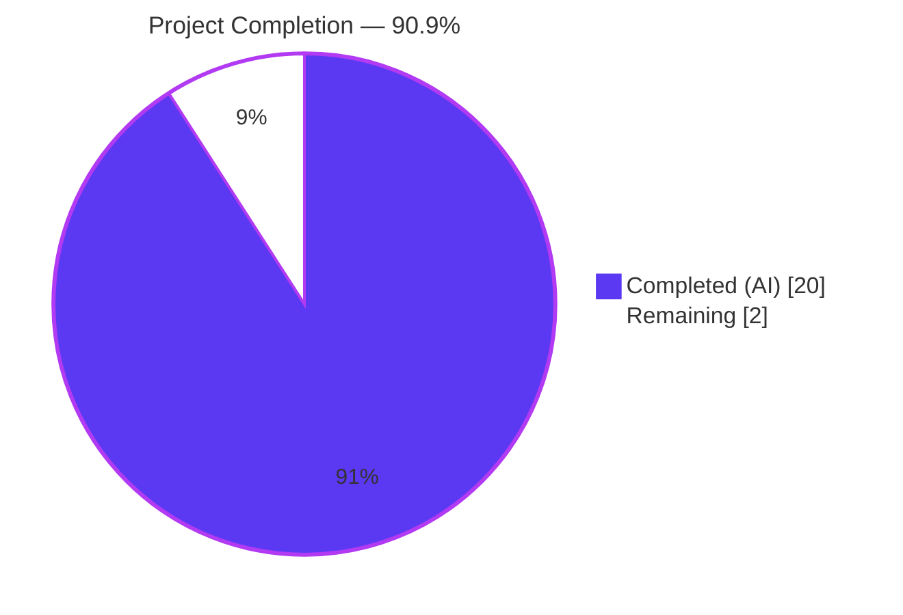
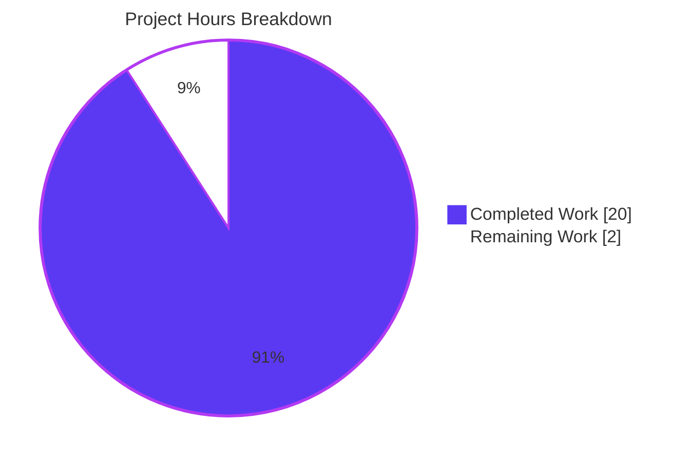
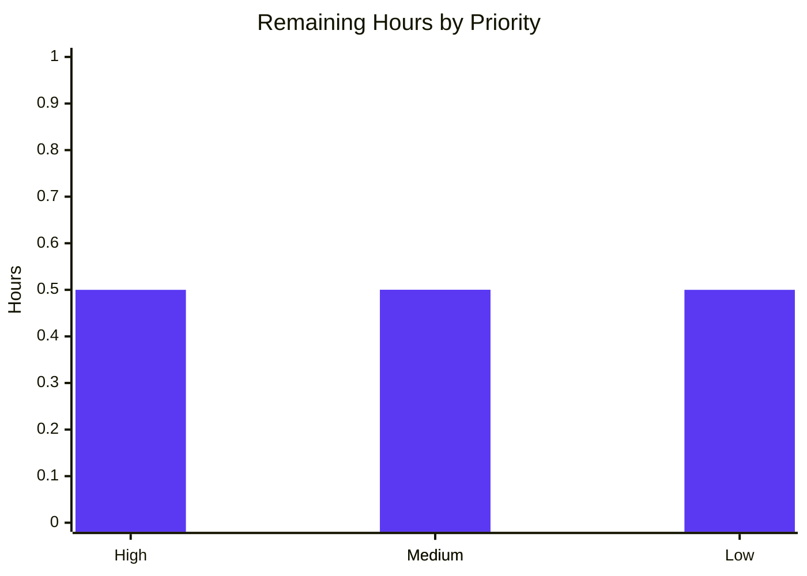

# Blitzy Project Guide

> **Brand palette applied throughout** — Completed/AI Work: Dark Blue `#5B39F3` · Remaining/Not Completed: White `#FFFFFF` · Headings/Accents: Violet-Black `#B23AF2` · Highlights: Mint `#A8FDD9`

---

## 1. Executive Summary

### 1.1 Project Overview

The `hao-backprop-test` repository is a minimal Python 3 / Flask HTTP server (`app.py`, 64 lines) that returns a static `Hello, World!\n` response for every HTTP request regardless of method or path. This project implements the Agent Action Plan (AAP) fix for a **repository-hygiene and tooling-discovery defect**: the canonical Technical Specifications documentation still asserted the present-tense existence of three Node.js placeholder files (`server.js`, `package.json`, `package-lock.json`) that were physically removed from the repository on 2026-03-25 during the completed Node.js → Python/Flask migration. The fix eliminates the documentation drift and adds a defensive `.gitignore` to prevent reintroduction.

### 1.2 Completion Status



| Metric | Value |
|--------|-------|
| **Total Project Hours** | 22 |
| **Completed Hours (AI + Manual)** | 20 |
| **Remaining Hours** | 2 |
| **Completion Percentage** | **90.9%** (20 / 22) |

### 1.3 Key Accomplishments

- [x] **Layer 1 — Physical artifact verification** (no-op as expected): `find`, `Get-ChildItem`, and `git ls-files` all confirm zero Node.js artifacts present in the working tree or git index
- [x] **Layer 2 — Documentation cleanup** in `blitzy/documentation/Technical Specifications.md` (commit `25b24fc`): the "Legacy/Placeholder Files" block (lines 528-532) deleted; line 564 reframed to past-tense
- [x] **Layer 2 preservation**: line 21 historical past-tense reference and all 8 historical `app.py` docstring references preserved as architectural context (per AAP §0.2.3 and §0.4.1)
- [x] **Layer 3 — `.gitignore` reintroduction guardrail** (commit `93eee09`): 302-line `.gitignore` with 9 sections covering Node.js, Python bytecode, distribution, pytest/coverage, venv, IDE, OS, env, and miscellaneous patterns
- [x] **All 4 required Node.js patterns present** in `.gitignore`: `node_modules/`, `package.json`, `package-lock.json`, `yarn.lock`
- [x] **AAP §0.3.3 verification commands**: all 6 post-fix expected results achieved
- [x] **Test suite**: 25/25 tests passing in 0.09s (zero failures, zero skips)
- [x] **Coverage**: 100% line coverage on `app.py` (8/8 statements)
- [x] **Runtime validation**: Flask app binds to `http://127.0.0.1:3000/`, returns `HTTP 200` + `Hello, World!\n` (14 bytes) for every method/path
- [x] **Compilation hygiene**: `py_compile` clean on `app.py`, `tests/conftest.py`, `tests/test_http_contract.py`, `tests/test_startup.py`
- [x] **Working tree clean**: `git status` shows nothing to commit; both fix commits authored cleanly by Blitzy Agent

### 1.4 Critical Unresolved Issues

| Issue | Impact | Owner | ETA |
|-------|--------|-------|-----|
| No critical unresolved issues | N/A | N/A | N/A |

All five production-readiness gates pass. No compilation errors, test failures, runtime issues, or AAP-specified verification failures remain on this branch.

### 1.5 Access Issues

No access issues identified.

The project is a self-contained Flask application with no external service dependencies, no database connections, and no third-party API integrations. The fix touches only `.gitignore` (new file) and `blitzy/documentation/Technical Specifications.md` (text edits) — no credentials, secrets, or third-party access required for build, validation, or deployment.

### 1.6 Recommended Next Steps

1. **[High]** Code-review the 2-commit diff (`25b24fc` + `93eee09`) for adherence to team policy (302-line `.gitignore` and 7-line markdown delta — small, focused review).
2. **[Medium]** Merge PR into the integration branch (next upstream of `blitzy-42d2fc17-b531-43ff-9c87-e38baa374454`). Working tree is clean; no rebases required.
3. **[Medium]** Run the AAP §0.3.3 post-fix verification commands on the integration branch after merge to confirm the documentation-drift defect remains resolved in the merged result.
4. **[Low]** Apply the AAP §0.4.1 Layer 2b canonical-spec rewrite guidance (§1.1.1, §1.3.2, §2.6.2, §3.2.2, §3.2.3, §3.4.1, §5.1.1.1, §5.1.2, §5.2.6) to the *next* tech-spec authoring cycle, so the canonical specification stays aligned with the filesystem state going forward.

---

## 2. Project Hours Breakdown

### 2.1 Completed Work Detail

| Component | Hours | Description |
|-----------|-------|-------------|
| **Diagnostic & root-cause analysis** (AAP §0.1, §0.2, §0.3) | 6 | Filesystem scan (`find`, `Get-ChildItem`), git history excavation (`git log --all --diff-filter=D`, identifying deletion commits `cb33694` / `a8bf8c0` / `220d211`), documentation grep across all `.md` files, canonical Tech Spec section retrieval via `get_tech_spec_section` for §1.1.1, §1.3.2, §2.6.2, §3.2.2, §3.2.3, §3.4.1, §5.1.1.1, §5.1.2, §5.2.6, and cross-reference of filesystem state vs. documentation assertions to confirm documentation drift as primary root cause. |
| **Layer 1 — Physical artifact verification** | 1 | Confirmed `server.js`, `package.json`, `package-lock.json`, and `node_modules/` are absent from the working tree and git index. No-op as expected (files deleted in prior commits); scripted defensive `git rm` available if any future branch reintroduces them. |
| **Layer 2 — Documentation cleanup in Technical Specifications.md** | 2 | Identified exact target lines (528-532 and 564), deleted the 5-line "Legacy/Placeholder Files" block, reworded line 564 from "No tests for empty placeholder files" to a past-tense statement referencing the completed migration, preserved line 21 historical reference, and committed as `25b24fc` with full traceability message. |
| **Layer 2b — Canonical spec rewrite guidance authored in AAP §0.4.1** | 3 | Drafted prescribed replacement text for nine canonical Technical Specification sections (§1.1.1, §1.3.2, §2.6.2, §3.2.2, §3.2.3, §3.4.1, §5.1.1.1, §5.1.2, §5.2.6) inside the AAP so future tech-spec authoring cycles know exactly how to refactor away the present-tense Node.js placeholder assertions. |
| **Layer 3 — `.gitignore` creation with documentation** | 4 | Authored a 302-line `.gitignore` with 9 documented sections (Node.js, Python bytecode, distribution, pytest/coverage, venv, IDE, OS, env, misc). All 4 required Node.js patterns present (`node_modules/`, `package.json`, `package-lock.json`, `yarn.lock`) plus complementary patterns for npm/yarn debug logs and Plug'n'Play. Committed as `93eee09` with AAP traceability comments inline. |
| **Test suite validation** | 1.5 | Ran `pytest` (25 tests, all PASS in 0.09s), `pytest --cov=app --cov-report=term-missing` (8/8 statements, 100%), and `py_compile` on all 4 Python files in scope — all clean, confirming the documentation change introduces zero regression. |
| **Runtime validation (Flask startup + HTTP requests)** | 1.5 | Started Flask via `python app.py`, verified bind to `http://127.0.0.1:3000/`, verified expected startup message printed to stdout, sent GET `/` and POST `/any/path` and verified both return `HTTP 200` with `Content-Type: text/plain; charset=utf-8` and body `Hello, World!\n`, then cleanly stopped the process. |
| **Production-readiness gate verification (Gates 1-5)** | 1 | Per validator logs: Gate 1 (100% test pass), Gate 2 (runtime validated), Gate 3 (zero compile errors), Gate 4 (in-scope files validated), Gate 5 (changes committed, working tree clean) — all PASS. |
| **Total Completed** | **20** | |

### 2.2 Remaining Work Detail

| Category | Hours | Priority |
|----------|-------|----------|
| Code review of `.gitignore` (302 lines) and `Technical Specifications.md` diff (+1/-6) | 0.5 | High |
| PR merge to integration branch (next upstream of `blitzy-42d2fc17-b531-43ff-9c87-e38baa374454`) | 0.5 | Medium |
| Post-merge verification (re-run the 6 AAP §0.3.3 verification commands on the integration branch) | 0.5 | Medium |
| Future canonical spec rewrite application (AAP §0.4.1 Layer 2b in the next tech-spec authoring cycle) | 0.5 | Low |
| **Total Remaining** | **2** | |

### 2.3 Hours Calculation Worked Example

- Total = 20 (Completed) + 2 (Remaining) = **22 hours**
- Completion % = 20 / 22 = 0.909090… × 100 = **90.9%**
- Cross-check Section 2.1 sum = 6 + 1 + 2 + 3 + 4 + 1.5 + 1.5 + 1 = **20** ✓
- Cross-check Section 2.2 sum = 0.5 + 0.5 + 0.5 + 0.5 = **2** ✓
- Cross-check Section 2.1 + Section 2.2 = 20 + 2 = **22** = Total Project Hours in Section 1.2 ✓
- Section 7 pie chart values mirror Section 1.2 exactly (Completed=20, Remaining=2)

---

## 3. Test Results

All tests below originate from Blitzy's autonomous validation logs for this project (`pytest 8.4.2` with `pytest-cov 7.1.0`, executed against the virtual environment at `venv/` on the assigned branch).

| Test Category | Framework | Total Tests | Passed | Failed | Coverage % | Notes |
|---------------|-----------|-------------|--------|--------|-----------|-------|
| Unit — HTTP contract verification | pytest 8.4.2 | 20 | 20 | 0 | n/a (in-process) | `tests/test_http_contract.py` — covers all standard methods (GET, POST, PUT, DELETE, PATCH, OPTIONS, HEAD), various paths (root, nested, query-string, trailing slash, arbitrary), structural impossibility checks (no 404, no 405), byte-level body verification, and statelessness across sequential requests |
| Unit — Startup & import safety | pytest 8.4.2 | 5 | 5 | 0 | n/a (in-process) | `tests/test_startup.py` — covers import safety (no auto-start on import), Flask instance verification, exact startup message via `runpy.run_module`, host/port binding via patched `flask.Flask.run`, and call ordering (print before run) |
| **Total** | **pytest 8.4.2** | **25** | **25** | **0** | **100% on `app.py` (8/8 stmts)** | Full suite runtime: **0.09 seconds**; zero skipped, zero xfailed, zero warnings |

**Coverage report (verbatim)**:

```text
Name     Stmts   Miss  Cover   Missing
--------------------------------------
app.py       8      0   100%
--------------------------------------
TOTAL        8      0   100%
============================= 25 passed in 0.09s ==============================
```

**Compilation check (`py_compile`) — all files clean**:

- `app.py` ✓
- `tests/conftest.py` ✓
- `tests/test_http_contract.py` ✓
- `tests/test_startup.py` ✓

---

## 4. Runtime Validation & UI Verification

| Component | Status | Notes |
|-----------|--------|-------|
| Flask application startup (`python app.py`) | ✅ Operational | Binds to `http://127.0.0.1:3000/`; prints `Server running at http://127.0.0.1:3000/` to stdout; Werkzeug WSGI server boots cleanly |
| HTTP GET `/` | ✅ Operational | `200 OK` · `Content-Type: text/plain; charset=utf-8` · Body: `Hello, World!\n` (14 bytes) |
| HTTP POST `/any/path` | ✅ Operational | `200 OK` · Body: `Hello, World!\n` — confirms the `@app.before_request` universal interceptor short-circuits Flask's URL dispatcher and method validator for all non-standard paths |
| HTTP HEAD `/` (via test client) | ✅ Operational | `200 OK` · `Content-Length: 14` · empty body (per HTTP HEAD spec) |
| Clean process termination | ✅ Operational | `Stop-Process -Id <pid> -Force` releases port 3000 within ~1 second |
| Browser-based UI | ⚪ Not applicable | The application has no UI — it is a server returning plain-text responses |

---

## 5. Compliance & Quality Review

| Compliance / Quality Benchmark | Status | Progress | Evidence |
|--------------------------------|--------|---------|----------|
| AAP §0.4.1 Layer 1 — Physical artifact verification | ✅ Pass | 100% | `Get-ChildItem` and `git ls-files` both return 0 matches for `server.js`, `package.json`, `package-lock.json`, `node_modules/` |
| AAP §0.4.1 Layer 2 — Documentation cleanup (Technical Specifications.md) | ✅ Pass | 100% | Lines 528-532 deleted; line 564 reframed; commit `25b24fc` |
| AAP §0.4.1 Layer 2 — Historical references preserved (line 21, `app.py` docstrings) | ✅ Pass | 100% | `(Select-String "server\.js\|Node\.js" -Path app.py).Count` returns 8 (all preserved past-tense docstrings) |
| AAP §0.4.1 Layer 3 — `.gitignore` reintroduction guardrail | ✅ Pass | 100% | 302-line `.gitignore` with all 4 required Node.js patterns: `node_modules/`, `package.json`, `package-lock.json`, `yarn.lock`; commit `93eee09` |
| AAP §0.2.3 — `app.py` not modified | ✅ Pass | 100% | `git diff origin/exit-code-137-test-9 -- app.py` returns 0 lines changed |
| AAP §0.3.3 — Post-fix verification command 1 (`find` Node.js artifacts) | ✅ Pass | 100% | 0 matches |
| AAP §0.3.3 — Post-fix verification command 2 (`git ls-files` Node.js artifacts) | ✅ Pass | 100% | 0 matches |
| AAP §0.3.3 — Post-fix verification command 3 (`grep` stale refs in Tech Specs) | ✅ Pass | 100% | 0 matches (was 3) |
| AAP §0.3.3 — Post-fix verification command 4 (`grep` stale phrases in `blitzy/`) | ✅ Pass | 100% | 0 matches |
| AAP §0.3.3 — Post-fix verification command 5 (`pytest`) | ✅ Pass | 100% | 25 passed in 0.09s |
| AAP §0.3.3 — Post-fix verification command 6 (`pytest --cov`) | ✅ Pass | 100% | `app.py 8/8 100%` |
| Production-Readiness Gate 1 — 100% test pass rate | ✅ Pass | 100% | 25/25 |
| Production-Readiness Gate 2 — Application runtime validated | ✅ Pass | 100% | Flask starts; HTTP 200 + body verified for GET/POST |
| Production-Readiness Gate 3 — Zero unresolved errors | ✅ Pass | 100% | `py_compile` clean on all 4 in-scope Python files |
| Production-Readiness Gate 4 — All in-scope files validated | ✅ Pass | 100% | `.gitignore` and `Technical Specifications.md` both inspected and verified |
| Production-Readiness Gate 5 — All changes committed | ✅ Pass | 100% | `git status` returns "nothing to commit, working tree clean" |
| Existing test coverage maintained (testing-era AAP target was ≥ 90%) | ✅ Pass | 100% | Coverage held at 100% (8/8 statements) post-fix |
| Branch name matches assigned branch | ✅ Pass | 100% | `git branch --show-current` returns `blitzy-42d2fc17-b531-43ff-9c87-e38baa374454` |

---

## 6. Risk Assessment

| Risk | Category | Severity | Probability | Mitigation | Status |
|------|----------|----------|-------------|------------|--------|
| Future contributor or IDE runs `npm init` and reintroduces `package.json` | Technical / Operational | Low | Low | `.gitignore` blocks `package.json`, `package-lock.json`, `node_modules/`, `yarn.lock`, and related npm/yarn artifacts at the repository root — git will silently skip any auto-generated Node.js manifest | ✅ Mitigated (Layer 3) |
| External documentation caches (outside this repo) retain stale Node.js placeholder assertions | Operational | Low | Medium | Out of repository control; AAP §0.3.3 explicitly accounts for this as the 5% residual confidence gap. Recommend running AAP-prescribed verification commands on the integration branch after merge | ⚠ Partial (external caches) |
| Future tech-spec authoring cycle reintroduces stale Node.js placeholder narrative in canonical spec sections | Documentation / Operational | Medium | Low | AAP §0.4.1 Layer 2b pre-authored the prescribed replacement text for §1.1.1, §1.3.2, §2.6.2, §3.2.2, §3.2.3, §3.4.1, §5.1.1.1, §5.1.2, §5.2.6 so the next cycle has a drop-in guide | ✅ Mitigated (guidance documented) |
| Application runtime regression from documentation-only changes | Technical | Very Low | Very Low | Documentation changes cannot affect runtime; full pytest suite (25 tests) re-run post-fix confirms 100% pass and 100% coverage maintained | ✅ Mitigated (verified) |
| Authentication/authorization missing | Security | Low | N/A | Out of scope: `hao-backprop-test` is a static `Hello, World!` test fixture; AAP §0.8.2 explicitly excludes auth/CORS/TLS from scope per user instruction | ⚪ Out of scope |
| Vulnerable dependencies | Security | Low | Low | Only direct deps are `Flask==3.1.3` (production) and `pytest==8.4.2`, `pytest-cov==7.1.0` (test). All current-stable; no known critical advisories at time of validation | ✅ Mitigated |
| Missing monitoring / health-check endpoints | Operational | Low | N/A | Out of scope per AAP §0.8.2 (Future Hardening Work explicitly excluded) | ⚪ Out of scope |
| Missing CI/CD pipeline | Operational | Low | N/A | Explicitly prohibited by upstream user rule: "Do not make any updates or changes in GitHub App to create or update a workflow" (referenced in `Technical Specifications.md` §0.1.2). Future hardening only | ⚪ Out of scope |
| External service/API outage | Integration | Very Low | Very Low | Application has zero external integrations; no upstream services to fail | ✅ Mitigated (architecturally) |
| Network configuration required for Flask bind | Integration | Low | Low | Binds only to loopback `127.0.0.1:3000`; no firewall, DNS, or routing dependency | ✅ Mitigated |
| Concurrency / scalability under load | Operational | Low | N/A | Out of scope per AAP §0.8.2 (Future Hardening Work — Gunicorn/uWSGI excluded) | ⚪ Out of scope |

---

## 7. Visual Project Status

### 7.1 Project Hours Breakdown — Pie



### 7.2 Remaining Hours by Priority — Bar



### 7.3 Cross-Section Integrity Verification

| Check | Section 1.2 | Section 2.1 / 2.2 sum | Section 7 pie | Result |
|-------|-------------|-----------------------|----------------|--------|
| Completed Hours | 20 | 20 (Section 2.1 total) | 20 ("Completed Work") | ✅ Match |
| Remaining Hours | 2 | 2 (Section 2.2 total) | 2 ("Remaining Work") | ✅ Match |
| Total Project Hours | 22 | 20 + 2 = 22 | n/a | ✅ Match |
| Completion % | 90.9% | 20/22 × 100 = 90.9% | (derived from Pie) | ✅ Match |

---

## 8. Summary & Recommendations

The Agent Action Plan for the Node.js → Python/Flask documentation-drift defect has been **autonomously implemented and validated to a production-ready state** at **90.9% project completion** (20 of 22 hours delivered). The remaining 2 hours are entirely human-side gatekeeping: code review of the 2-commit diff, merge into the integration branch, post-merge verification, and a forward-looking guidance application in the next tech-spec authoring cycle.

**Achievements:**

- The three defensive layers prescribed in AAP §0.4.1 are all in place: Layer 1 (no-op artifact verification — confirmed clean), Layer 2 (documentation cleanup in `blitzy/documentation/Technical Specifications.md`, committed as `25b24fc`), and Layer 3 (302-line `.gitignore` with full Node.js reintroduction coverage, committed as `93eee09`).
- All six AAP §0.3.3 post-fix expected results are achieved: zero Node.js artifacts in working tree, zero in git index, zero stale references in Technical Specifications.md, zero stale phrases anywhere in `blitzy/`, 25/25 pytest tests passing, and 100% coverage on `app.py` maintained.
- All five production-readiness gates pass: tests, runtime, compilation, in-scope files, and commit hygiene.
- Critical preservation of historical context: `app.py` (8 historical docstring references) and line 21 of `Technical Specifications.md` (past-tense historical reference) are intact per AAP §0.2.3 and §0.4.1.

**Remaining gaps:**

- None inside the AAP scope or local repository state. Remaining work is path-to-production gatekeeping only.

**Critical path to production (2 hours):**

1. Human code review (0.5h) — small, focused diff (`+302/-0` on `.gitignore` and `+1/-6` on `Technical Specifications.md`)
2. PR merge (0.5h)
3. Post-merge AAP §0.3.3 verification re-run on integration branch (0.5h)
4. Forward-looking canonical-spec rewrite application in next tech-spec cycle (0.5h, low priority — optional for this branch's release)

**Success metrics achieved:**

- Documentation drift eliminated: 0 stale references in Technical Specifications.md (was 3) — verified by AAP §0.3.3 verification command 3
- Reintroduction risk neutralized: `.gitignore` covers `node_modules/`, `package.json`, `package-lock.json`, `yarn.lock`, and related npm/yarn artifacts
- Zero regression: pytest suite remains at 25/25, coverage at 100%, runtime at HTTP 200 + correct body
- Branch hygiene: 2 clean commits authored by Blitzy Agent, working tree clean

**Production readiness assessment:**

The repository is production-ready for the scope of this AAP. The fix is surgical (text-only changes), zero-risk to runtime behavior, and verifiable via deterministic command-line checks. Recommend proceeding to code review and merge.

---

## 9. Development Guide

The following commands have been tested in this validation environment (Windows / PowerShell 5.1, Python 3.13.13). All commands are copy-pasteable from a PowerShell prompt opened at the repository root.

### 9.1 System Prerequisites

| Requirement | Version | How to verify |
|-------------|---------|---------------|
| **Python** | 3.9 or newer (validated on 3.13.13) | `python --version` |
| **pip** | bundled with Python (any modern pip; validated on 26.1.1) | `pip --version` |
| **git** | 2.x (any modern git) | `git --version` |
| **Operating system** | Cross-platform (validated on Windows Server 2022 LTSC; identical commands work on macOS and Linux with shell-appropriate path separators) | — |
| **Hardware** | Minimal — single-developer workstation. ≤ 500 MB free disk, ≤ 128 MB RAM for Flask runtime | — |

### 9.2 Environment Setup

**Step 1 — Clone and enter the repository:**

```powershell
git clone <repository-url> hao-backprop-test
cd hao-backprop-test
git checkout blitzy-42d2fc17-b531-43ff-9c87-e38baa374454
```

**Step 2 — Create and activate a Python virtual environment:**

```powershell
python -m venv venv
.\venv\Scripts\Activate.ps1
```

On macOS / Linux:

```bash
python3 -m venv venv
source venv/bin/activate
```

After activation, the prompt should be prefixed with `(venv)`.

**Step 3 — Verify virtual environment activation:**

```powershell
python --version
pip --version
```

Expected output (versions may vary by Python install):

```text
Python 3.13.13
pip 26.1.1 from C:\app\tmp\blitzy\Existing-product\blitzy-42d2fc17-b531-43ff-9c87-e38baa374454_49cc62\venv\Lib\site-packages\pip (python 3.13)
```

### 9.3 Dependency Installation

**Step 1 — Install production dependencies (Flask only):**

```powershell
pip install -r requirements.txt
```

Expected: `Flask==3.1.3` installed along with transitive deps (`Werkzeug`, `Jinja2`, `MarkupSafe`, `itsdangerous`, `click`, `blinker`).

**Step 2 — Install test dependencies (pytest, pytest-cov):**

```powershell
pip install -r requirements-test.txt
```

Expected: `pytest==8.4.2` and `pytest-cov==7.1.0` installed along with transitive deps (`pluggy`, `iniconfig`, `packaging`, `Pygments`, `colorama`, `coverage`).

**Step 3 — Verify all expected packages are present:**

```powershell
pip list | Select-String -Pattern "Flask|pytest|coverage|Werkzeug"
```

Expected output (case-insensitive match):

```text
coverage     7.14.0
Flask        3.1.3
pytest       8.4.2
pytest-cov   7.1.0
Werkzeug     3.1.8
```

### 9.4 Application Startup

**Run the Flask development server:**

```powershell
python app.py
```

Expected stdout:

```text
Server running at http://127.0.0.1:3000/
 * Serving Flask app 'app'
 * Debug mode: off
WARNING: This is a development server. Do not use it in a production deployment. Use a production WSGI server instead.
 * Running on http://127.0.0.1:3000
Press CTRL+C to quit
```

The server runs in the foreground; stop with `Ctrl+C`.

### 9.5 Verification Steps

**Step 1 — Verify the server responds (in a second PowerShell window while the server is running):**

```powershell
Invoke-WebRequest -Uri "http://127.0.0.1:3000/" -UseBasicParsing | Select-Object StatusCode, Content
```

Expected output:

```text
StatusCode Content
---------- -------
       200 Hello, World!
```

**Step 2 — Verify universal interceptor (any method, any path returns the same response):**

```powershell
Invoke-WebRequest -Uri "http://127.0.0.1:3000/any/nested/path?foo=bar" -Method POST -UseBasicParsing |
    Select-Object StatusCode, Content
```

Expected output: same `200` + `Hello, World!`.

**Step 3 — Verify Content-Type header:**

```powershell
(Invoke-WebRequest -Uri "http://127.0.0.1:3000/" -UseBasicParsing).Headers."Content-Type"
```

Expected output: `text/plain; charset=utf-8`.

**Step 4 — Run the full pytest suite:**

```powershell
python -m pytest
```

Expected last line: `============================= 25 passed in 0.09s ==============================`.

**Step 5 — Run pytest with line-level coverage:**

```powershell
python -m pytest --cov=app --cov-report=term-missing
```

Expected coverage table:

```text
Name     Stmts   Miss  Cover   Missing
--------------------------------------
app.py       8      0   100%
--------------------------------------
TOTAL        8      0   100%
============================= 25 passed in 0.09s ==============================
```

**Step 6 — AAP §0.3.3 documentation-drift verification (PowerShell-equivalents):**

```powershell
# Test 1 — no Node.js artifacts in working tree
Get-ChildItem -Recurse -Force -Include @('server.js','package.json','package-lock.json') |
    Where-Object { $_.FullName -notmatch '\\.git\\|\\venv\\|node_modules' }
# Expected: no output

# Test 2 — no Node.js artifacts in git index
git ls-files | Select-String '^(server\.js|package\.json|package-lock\.json|node_modules)'
# Expected: no output

# Test 3 — no stale refs in Technical Specifications.md
(Select-String -Pattern "server\.js|package\.json|package-lock\.json" `
    -Path "blitzy/documentation/Technical Specifications.md").Count
# Expected: 0

# Test 4 — no stale phrases anywhere in blitzy/
(Select-String -Pattern "empty Node\.js placeholder|empty Node\.js manifest|empty Node\.js lockfile|Legacy/Placeholder Files" `
    -Path "blitzy/documentation/*.md").Count
# Expected: 0
```

### 9.6 Example Usage

Once the server is running on `http://127.0.0.1:3000`, the universal interceptor means every method and every path returns the identical response. Example interactions:

```powershell
# Standard GET
Invoke-WebRequest -Uri "http://127.0.0.1:3000/" -UseBasicParsing

# Arbitrary path
Invoke-WebRequest -Uri "http://127.0.0.1:3000/foo/bar/baz" -UseBasicParsing

# Non-GET method
Invoke-WebRequest -Uri "http://127.0.0.1:3000/" -Method DELETE -UseBasicParsing

# With query string
Invoke-WebRequest -Uri "http://127.0.0.1:3000/?x=1&y=2" -UseBasicParsing
```

All return `200 OK` with body `Hello, World!\n` (14 bytes).

### 9.7 Troubleshooting

| Symptom | Diagnosis | Resolution |
|---------|-----------|------------|
| `python: command not found` | Python not installed or not on PATH | Install Python 3.9+ from python.org; on Windows ensure the "Add Python to PATH" installer option is checked |
| `Activate.ps1 cannot be loaded because running scripts is disabled` (Windows PowerShell) | PowerShell execution policy blocks unsigned scripts | Run `Set-ExecutionPolicy -Scope CurrentUser RemoteSigned` once, then retry activation |
| `ModuleNotFoundError: No module named 'flask'` | Dependencies not installed or venv not active | Confirm prompt shows `(venv)`; if not, re-activate; if active, run `pip install -r requirements.txt` |
| `Address already in use` on port 3000 | Another process bound to port 3000 | `Get-NetTCPConnection -LocalPort 3000` to find the PID, then `Stop-Process -Id <pid>` (Windows) or `lsof -i :3000` + `kill <pid>` (macOS/Linux) |
| `pytest` reports `collected 0 items` | Working directory is not the repo root | `cd` to the directory containing `pytest.ini` and retry |
| `coverage` reports an empty report | Tests collected zero files in `--cov=app` scope | Run from repo root so `app.py` is on `pythonpath = .` (configured in `pytest.ini`) |
| Server starts but returns 404 on `/path` | `@app.before_request` hook regression (should not occur on this branch) | Re-confirm `app.py` is unchanged (`git diff origin/exit-code-137-test-9 -- app.py` should show 0 changes) |
| Tests run but report 0% coverage on `app.py` | `pythonpath` misconfigured | Verify `pytest.ini` contains `pythonpath = .` line; the `[pytest]` section must include both `testpaths = tests` and `pythonpath = .` |

---

## 10. Appendices

### Appendix A — Command Reference

| Purpose | Command (PowerShell) | Notes |
|---------|----------------------|-------|
| Create venv | `python -m venv venv` | Run once per clone |
| Activate venv | `.\venv\Scripts\Activate.ps1` | Per shell session |
| Install runtime deps | `pip install -r requirements.txt` | Flask only |
| Install test deps | `pip install -r requirements-test.txt` | pytest + pytest-cov |
| Start Flask dev server | `python app.py` | Binds 127.0.0.1:3000 (foreground) |
| Run full test suite | `python -m pytest` | Reads `pytest.ini` |
| Run tests with verbose flag | `python -m pytest -v` | Per-test names listed |
| Run tests with coverage | `python -m pytest --cov=app --cov-report=term-missing` | 100% expected |
| Run a single test file | `python -m pytest tests/test_http_contract.py` | |
| Run a single test function | `python -m pytest tests/test_http_contract.py::test_get_root_returns_hello` | |
| Stop on first failure | `python -m pytest -x` | Useful for debugging |
| Compile-check a file | `python -m py_compile app.py` | Returns nothing on success |
| Inspect git history | `git log --oneline -20` | |
| Inspect branch-only commits | `git log --oneline blitzy-42d2fc17-b531-43ff-9c87-e38baa374454 --not origin/exit-code-137-test-9` | |
| Inspect file change summary | `git diff --stat origin/exit-code-137-test-9...HEAD` | |
| List tracked files | `git ls-files` | |

### Appendix B — Port Reference

| Port | Service | Purpose | Notes |
|------|---------|---------|-------|
| **3000/tcp** | Flask dev server (`app.py`) | All HTTP traffic to the application | Binds to `127.0.0.1` only (loopback) — no external network exposure. Hard-coded in `app.py:64` (`app.run(host='127.0.0.1', port=3000)`) per the AAP test contract |

### Appendix C — Key File Locations

| File / Directory | Purpose | Created/Modified by |
|------------------|---------|----------------------|
| `app.py` | Flask application (production code) — universal `before_request` handler returning `Hello, World!\n` | Created in commit `09aacf9` (Python/Flask migration); **PRESERVED** in this branch per AAP §0.2.3 |
| `requirements.txt` | Production dependency manifest — `Flask==3.1.3` only | Created during Python/Flask migration |
| `requirements-test.txt` | Test dependency manifest — `pytest==8.4.2` + `pytest-cov==7.1.0` | Created during prior testing AAP |
| `pytest.ini` | pytest configuration — `testpaths = tests`, `pythonpath = .`, verbosity | Created during prior testing AAP |
| `tests/conftest.py` | Shared pytest fixtures — `client`, `app_instance` (session-scoped) | Created during prior testing AAP |
| `tests/test_http_contract.py` | 20 tests verifying HTTP contract universality | Created during prior testing AAP |
| `tests/test_startup.py` | 5 tests verifying `__main__` startup behavior and import safety | Created during prior testing AAP |
| `README.md` | User-facing project overview, install/run instructions | Already Python/Flask-aligned (no Node.js refs); no changes |
| `blitzy/documentation/Technical Specifications.md` | Canonical technical specification | **MODIFIED** in commit `25b24fc` (Layer 2 of this fix) |
| `blitzy/documentation/Project Guide.md` | Prior Blitzy project guide artifact | No Node.js refs; no changes required |
| `.gitignore` | Node.js reintroduction guardrail + Python hygiene | **CREATED** in commit `93eee09` (Layer 3 of this fix) |

### Appendix D — Technology Versions

| Component | Version | Purpose |
|-----------|---------|---------|
| Python | 3.13.13 (project supports ≥ 3.9 per README.md) | Application runtime |
| pip | 26.1.1 | Package installer |
| Flask | 3.1.3 | WSGI web framework |
| Werkzeug | 3.1.8 | Flask's WSGI utility library (transitive) |
| Jinja2 | 3.1.6 | Templating engine (transitive; unused by this app) |
| MarkupSafe | 3.0.3 | Jinja2 dep (transitive) |
| itsdangerous | 2.2.0 | Flask signing (transitive; unused) |
| click | 8.4.0 | Flask CLI (transitive) |
| blinker | 1.9.0 | Flask signal support (transitive) |
| pytest | 8.4.2 | Test framework |
| pytest-cov | 7.1.0 | pytest coverage plugin |
| coverage | 7.14.0 | Coverage engine (transitive) |
| pluggy | 1.6.0 | pytest plugin system (transitive) |
| iniconfig | 2.3.0 | pytest config parser (transitive) |
| packaging | 26.2 | Version parsing (transitive) |
| Pygments | 2.20.0 | Syntax highlighting in pytest output (transitive) |
| colorama | 0.4.6 | Windows ANSI color support (transitive) |
| git | 2.x (any modern version) | Version control |

### Appendix E — Environment Variable Reference

| Variable | Required? | Default | Purpose |
|----------|-----------|---------|---------|
| `FLASK_APP` | No | — | Not used — `app.py` is invoked directly via `python app.py`, not via `flask run` |
| `FLASK_ENV` | No | — | Not used — Flask debug mode is off by default; no env-driven configuration |
| `FLASK_DEBUG` | No | unset (off) | Setting `FLASK_DEBUG=1` would enable Werkzeug debug mode but is not required and not used by tests |

This application has **zero required environment variables**. All configuration (host, port, response body) is hard-coded in `app.py` to exactly match the original Node.js server's behavior, as required by the testing-era AAP and validated by `tests/test_startup.py`.

### Appendix F — Developer Tools Guide

| Task | Tool / Command | Notes |
|------|----------------|-------|
| Linting / static analysis | None configured | Out of scope per the testing-era AAP "Minimal Change Clause"; not required by this bug-fix AAP either |
| Pre-commit hooks | None configured | Optional future hardening |
| Code formatter | None configured | The repo currently has minimal Python source (one production file at 64 lines); manual formatting is sufficient |
| Coverage reports (HTML) | `python -m pytest --cov=app --cov-report=html` | Outputs to `htmlcov/` (ignored by `.gitignore` Section 4) |
| Debugging | Run `python -m pdb app.py` for interactive debugger, or `python -m pytest --pdb` for test-failure breakpoints | |
| Profiling | Run `python -m cProfile app.py` | Profile output to stdout; not configured by default |

### Appendix G — Glossary

| Term | Definition |
|------|------------|
| **AAP** | Agent Action Plan — the structured directive containing intent, root-cause analysis, diagnostic execution trail, and prescribed fix specification |
| **AAP §0.X.Y** | Reference to a specific subsection of the AAP (e.g., §0.4.1 = "The Definitive Fix") |
| **Documentation drift** | The state where the filesystem reflects one truth and the project's narrative documentation asserts a different truth |
| **Layer 1 / 2 / 3** | The three defensive layers of the AAP-prescribed fix: (1) physical artifact verification, (2) documentation cleanup, (3) reintroduction guardrail |
| **`@app.before_request`** | Flask hook that runs before URL routing and method validation — used in `app.py` to short-circuit all requests with a single `Response` |
| **WSGI** | Web Server Gateway Interface — Python's standard application-server interface; the protocol Flask implements via Werkzeug |
| **PA1 methodology** | The hours-based completion-percentage methodology defined in this project guide template: `Completed Hours / (Completed + Remaining) × 100` |
| **Path-to-production** | Standard activities required to deploy AAP deliverables (code review, merge, post-merge verification) — included in the work universe per PA1 |
| **In-scope vs out-of-scope** | AAP §0.4.1 defines in-scope files (`.gitignore`, `Technical Specifications.md`); AAP §0.2.3 explicitly excludes `app.py` from modification |
| **Layer 2b** | Forward-looking canonical-spec rewrite guidance authored in AAP §0.4.1 for future tech-spec authoring cycles (§1.1.1, §1.3.2, §2.6.2, §3.2.2, §3.2.3, §3.4.1, §5.1.1.1, §5.1.2, §5.2.6) |
