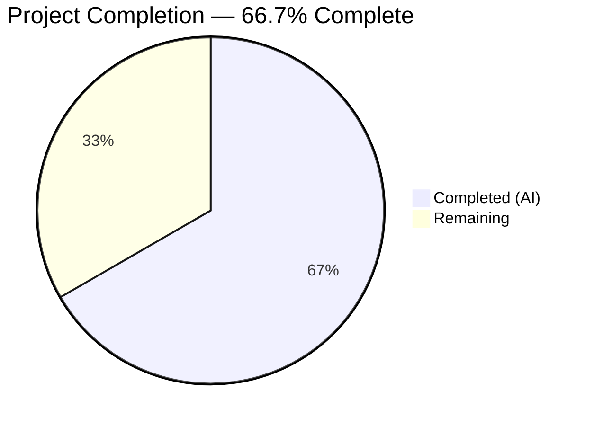
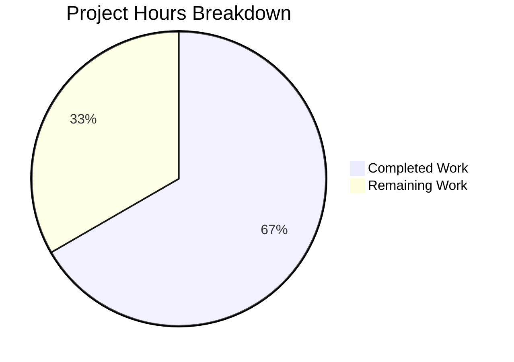

# Blitzy Project Guide — `/health` Endpoint Addition

---

## 1. Executive Summary

### 1.1 Project Overview

This project adds a dedicated HTTP health check endpoint (`GET /health`) to the existing `hao-backprop-test` Flask application. The endpoint returns a JSON response `{"status": "ok"}` with HTTP 200 and `Content-Type: application/json`, enabling DevOps monitoring tools and the Backprop integration pipeline to programmatically verify service availability. The change is confined entirely to `app.py` — no new files, no new dependencies, and all existing behavior is preserved. The Flask application continues to serve `Hello, World!\n` as plain text for all other requests across all HTTP methods and paths.

### 1.2 Completion Status

<!-- Pie chart: Completed = Dark Blue (#5B39F3), Remaining = White (#FFFFFF) -->


| Metric | Hours |
|--------|-------|
| **Total Project Hours** | **6** |
| Completed Hours (AI) | 4 |
| Remaining Hours | 2 |
| **Completion Percentage** | **66.7%** |

**Calculation:** 4 completed hours / (4 completed + 2 remaining) = 4 / 6 = 66.7%

### 1.3 Key Accomplishments

- [x] Added `jsonify` to Flask import statement (line 12)
- [x] Implemented `GET /health` route handler returning `{"status": "ok"}` as `application/json`
- [x] Placed health route before catch-all to ensure correct Flask routing precedence
- [x] Preserved all existing behavior — root route and catch-all unchanged (byte-identical)
- [x] Compilation validation passed — zero syntax errors (`python -m py_compile`)
- [x] Linting validation passed — zero PEP 8 violations (`pycodestyle`)
- [x] Runtime validation passed — 7/7 curl tests confirmed correct behavior
- [x] Maintained single-file constraint — only `app.py` modified, no new files created
- [x] No new dependencies — `requirements.txt` unchanged at `Flask==3.1.3`

### 1.4 Critical Unresolved Issues

| Issue | Impact | Owner | ETA |
|-------|--------|-------|-----|
| No automated test suite for `/health` endpoint | Regression risk if future changes break health check | Human Developer | 1–2 days |

### 1.5 Access Issues

No access issues identified. The repository is fully accessible, the single dependency (`Flask==3.1.3`) is publicly available on PyPI, and no external service credentials or API keys are required for this feature.

### 1.6 Recommended Next Steps

1. **[High]** Write automated tests (pytest) for the `/health` endpoint to prevent regression — verify GET returns JSON 200, POST falls to catch-all, and existing routes remain unchanged
2. **[Medium]** Configure DevOps monitoring tools to poll `GET /health` for service availability checks
3. **[Low]** Update `README.md` to document the new `/health` endpoint and its response format
4. **[Low]** Evaluate production WSGI server (Gunicorn) for deployment readiness beyond development use

---

## 2. Project Hours Breakdown

### 2.1 Completed Work Detail

| Component | Hours | Description |
|-----------|-------|-------------|
| Codebase analysis & implementation planning | 1 | Analyzed existing `app.py` structure (59 lines), Flask routing engine behavior, import dependencies, identified insertion point before catch-all route, and verified `jsonify` availability in Flask 3.1.3 |
| Health endpoint implementation | 1 | Updated import statement (added `jsonify`), created `/health` GET-only route decorator, implemented `health()` handler function with docstring, ensured return of `jsonify(status='ok')`, followed existing code organization conventions (comment separators, PEP 8) |
| Compilation & linting validation | 0.5 | Ran `python -m py_compile app.py` (zero errors) and `pycodestyle app.py` (zero PEP 8 violations), confirming syntactic and stylistic correctness |
| Runtime validation (7 tests) | 1 | Started Flask dev server, executed 7 curl tests covering: GET /health (JSON 200), GET / (text 200), POST /health (catch-all), GET /other (catch-all), PUT /health (catch-all), DELETE / (text 200), PATCH / (text 200) — all 7 passed |
| Constraint compliance verification | 0.5 | Verified: single-file constraint (only `app.py` modified), no new dependencies (`requirements.txt` unchanged), no new files created, existing behavior byte-identical, no CI/CD changes, code style compliant |
| **Total Completed** | **4** | |

### 2.2 Remaining Work Detail

| Category | Hours | Priority |
|----------|-------|----------|
| Automated test suite for `/health` endpoint (pytest unit + integration tests) | 1 | Medium |
| Monitoring/alerting configuration (integrate health endpoint with DevOps tools) | 0.5 | Low |
| Documentation update (`README.md` — document `/health` endpoint) | 0.5 | Low |
| **Total Remaining** | **2** | |

**Integrity check:** Section 2.1 (4h) + Section 2.2 (2h) = 6h = Total Project Hours in Section 1.2 ✓

---

## 3. Test Results

| Test Category | Framework | Total Tests | Passed | Failed | Coverage % | Notes |
|---------------|-----------|-------------|--------|--------|------------|-------|
| Runtime Validation (Manual) | curl / Flask dev server | 7 | 7 | 0 | 100% of endpoints | All 7 curl tests executed by Blitzy's autonomous validation — GET /health, GET /, POST /health, GET /other, PUT /health, DELETE /, PATCH / |
| Compilation | `python -m py_compile` | 1 | 1 | 0 | 100% of source files | Zero syntax errors in `app.py` |
| Linting | `pycodestyle` | 1 | 1 | 0 | 100% of source files | Zero PEP 8 violations in `app.py` |

**Note:** No automated test framework (pytest, unittest) is configured in this repository. All validation was performed via manual curl testing, consistent with the project's existing validation approach documented in the Technical Specifications. The 7 runtime tests were executed by Blitzy's autonomous validation pipeline.

---

## 4. Runtime Validation & UI Verification

### Runtime Health

- ✅ **Flask application starts** — `python app.py` binds to `127.0.0.1:3000` without errors
- ✅ **GET /health** — Returns HTTP 200, `Content-Type: application/json`, body `{"status":"ok"}`
- ✅ **GET /** — Returns HTTP 200, `Content-Type: text/plain`, body `Hello, World!\n` (unchanged)
- ✅ **POST /health** — Falls to catch-all, returns HTTP 200, `text/plain`, `Hello, World!\n`
- ✅ **GET /any/other/path** — Returns HTTP 200, `text/plain`, `Hello, World!\n` (unchanged)
- ✅ **PUT /health** — Falls to catch-all, returns HTTP 200, `Hello, World!\n`
- ✅ **DELETE /** — Returns HTTP 200, `Hello, World!\n` (unchanged)
- ✅ **PATCH /** — Returns HTTP 200, `Hello, World!\n` (unchanged)

### UI Verification

Not applicable — this is a backend-only Flask application with no user interface. All endpoints return plain-text or JSON HTTP responses with no HTML, CSS, or JavaScript.

---

## 5. Compliance & Quality Review

| Compliance Area | Requirement | Status | Notes |
|-----------------|-------------|--------|-------|
| Import update | Add `jsonify` to Flask import on line 12 | ✅ Pass | `from flask import Flask, Response, jsonify` |
| `/health` route implementation | GET-only route returning JSON `{"status":"ok"}` | ✅ Pass | `@app.route('/health', methods=['GET'])` with `jsonify(status='ok')` |
| Route precedence | `/health` placed before catch-all | ✅ Pass | Health route at line 30, catch-all at line 48 |
| Existing behavior preservation | Root and catch-all responses unchanged | ✅ Pass | All non-health requests return `Hello, World!\n` as `text/plain` |
| Single-file constraint | Only `app.py` modified | ✅ Pass | `git diff --name-status` confirms only `app.py` changed |
| No new dependencies | `requirements.txt` unchanged | ✅ Pass | Still contains only `Flask==3.1.3` |
| No new files | Repository structure unchanged | ✅ Pass | No files created or deleted |
| PEP 8 compliance | `pycodestyle` zero violations | ✅ Pass | Linting gate passed with zero findings |
| Code organization | Follow existing comment/docstring patterns | ✅ Pass | Comment separator block, descriptive docstring, consistent style |
| No CI/CD changes | No workflow files created or modified | ✅ Pass | No `.github/workflows/` changes |

### Fixes Applied During Autonomous Validation

No fixes were required — the implementation passed all validation gates (compilation, linting, runtime) on the first attempt.

---

## 6. Risk Assessment

| Risk | Category | Severity | Probability | Mitigation | Status |
|------|----------|----------|-------------|------------|--------|
| No automated test coverage for `/health` endpoint | Technical | Medium | High | Write pytest tests before merging to production branch | Open |
| Development server (Werkzeug) used instead of production WSGI server | Operational | Low | N/A | Out of AAP scope; evaluate Gunicorn for production deployment | Open |
| No authentication on `/health` endpoint | Security | Low | Low | Standard practice for health checks; endpoint reveals minimal information (`{"status":"ok"}`) | Accepted |
| Health endpoint not yet integrated with monitoring tools | Integration | Medium | High | Configure DevOps monitoring to poll `GET /health` after deployment | Open |

---

## 7. Visual Project Status



**Integrity check:** "Remaining Work" (2h) = Section 1.2 Remaining Hours (2h) = Section 2.2 Total (2h) ✓

### Remaining Hours by Category

| Category | Hours |
|----------|-------|
| Automated test suite | 1 |
| Monitoring configuration | 0.5 |
| Documentation update | 0.5 |

---

## 8. Summary & Recommendations

### Achievements

All Agent Action Plan (AAP) deliverables have been fully implemented and validated. The `/health` endpoint is correctly added to `app.py` with proper Flask routing, JSON response formatting, and code organization. Every AAP constraint was met: single-file modification, no new dependencies, existing behavior preserved, PEP 8 compliant, and no CI/CD changes. Runtime validation confirmed 7/7 test scenarios pass, covering the health endpoint, existing routes, and cross-method behavior.

### Completion Assessment

The project is 66.7% complete (4 hours completed out of 6 total hours). All AAP-specified code deliverables are 100% implemented. The remaining 2 hours consist of path-to-production activities: automated test creation (1h), monitoring integration (0.5h), and documentation (0.5h).

### Critical Path to Production

1. **Automated tests** — The highest-priority remaining item. Writing pytest tests for the `/health` endpoint ensures regression protection and enables CI/CD validation in future development cycles.
2. **Monitoring integration** — The health endpoint was built specifically for DevOps monitoring; configuring monitoring tools to consume it completes the intended value chain.
3. **Documentation** — Updating `README.md` ensures discoverability for new developers.

### Production Readiness Assessment

The code change itself is production-ready: it compiles cleanly, passes linting, and all runtime tests confirm correct behavior. The remaining path-to-production items (automated tests, monitoring, documentation) are standard activities that should be completed before promoting to a production branch but do not block the code from functioning correctly in any environment.

---

## 9. Development Guide

### System Prerequisites

| Requirement | Version | Notes |
|-------------|---------|-------|
| Python | 3.12+ (tested on 3.12.10) | AAP targets 3.13+; 3.12+ is compatible |
| pip | Bundled with Python | Used for dependency installation |
| curl | Any modern version | Used for endpoint verification |

### Environment Setup

```bash
# 1. Navigate to the repository root
cd /tmp/blitzy/Existing-product/blitzy-086fa402-6c95-44b3-a9ab-51f869de755b_47eaf5

# 2. Create a Python virtual environment
python -m venv venv

# 3. Activate the virtual environment
# On Linux/macOS:
source venv/bin/activate
# On Windows:
# venv\Scripts\activate
```

### Dependency Installation

```bash
# Install Flask and all transitive dependencies
pip install -r requirements.txt

# Verify Flask is installed
pip show Flask
# Expected: Name: Flask, Version: 3.1.3
```

**Expected installed packages:**
- Flask 3.1.3
- Werkzeug 3.1.6
- Jinja2 3.1.6
- MarkupSafe 3.0.3
- itsdangerous 2.2.0
- click 8.3.1
- blinker 1.9.0

### Application Startup

```bash
# Start the Flask development server
python app.py

# Expected output:
#  * Serving Flask app 'app'
#  * Debug mode: off
#  * Running on http://127.0.0.1:3000
```

The server binds to `127.0.0.1:3000` (localhost only).

### Verification Steps

Open a new terminal and run:

```bash
# Test 1: Health check endpoint (new feature)
curl -s http://127.0.0.1:3000/health
# Expected: {"status":"ok"}

# Test 2: Root route (existing — must be unchanged)
curl -s http://127.0.0.1:3000/
# Expected: Hello, World!

# Test 3: POST to /health (should fall to catch-all)
curl -s -X POST http://127.0.0.1:3000/health
# Expected: Hello, World!

# Test 4: Arbitrary path (catch-all behavior)
curl -s http://127.0.0.1:3000/any/other/path
# Expected: Hello, World!

# Verify HTTP status codes and content types
curl -s -o /dev/null -w "HTTP %{http_code} %{content_type}\n" http://127.0.0.1:3000/health
# Expected: HTTP 200 application/json

curl -s -o /dev/null -w "HTTP %{http_code} %{content_type}\n" http://127.0.0.1:3000/
# Expected: HTTP 200 text/plain; charset=utf-8
```

### Compilation & Linting Verification

```bash
# Syntax check
python -m py_compile app.py
# Expected: no output (success)

# PEP 8 linting (requires pycodestyle)
pip install pycodestyle
pycodestyle app.py
# Expected: no output (zero violations)
```

### Troubleshooting

| Issue | Cause | Resolution |
|-------|-------|------------|
| `ModuleNotFoundError: No module named 'flask'` | Virtual environment not activated or Flask not installed | Run `source venv/bin/activate` then `pip install -r requirements.txt` |
| `Address already in use` on port 3000 | Another process is using port 3000 | Kill the existing process: `lsof -i :3000` then `kill <PID>` |
| `curl: (7) Failed to connect` | Flask server not running | Start the server: `python app.py` |

---

## 10. Appendices

### A. Command Reference

| Command | Purpose |
|---------|---------|
| `python app.py` | Start the Flask development server on `127.0.0.1:3000` |
| `python -m py_compile app.py` | Validate Python syntax (zero output = success) |
| `pycodestyle app.py` | Check PEP 8 compliance (zero output = no violations) |
| `pip install -r requirements.txt` | Install all Python dependencies |
| `curl http://127.0.0.1:3000/health` | Test the health check endpoint |
| `curl http://127.0.0.1:3000/` | Test the root route |

### B. Port Reference

| Port | Service | Protocol |
|------|---------|----------|
| 3000 | Flask development server | HTTP |

### C. Key File Locations

| File | Purpose |
|------|---------|
| `app.py` | Flask application — sole source file (72 lines) |
| `requirements.txt` | Python dependency manifest (`Flask==3.1.3`) |
| `README.md` | Project documentation and setup instructions |
| `venv/` | Python virtual environment (not committed) |

### D. Technology Versions

| Technology | Version |
|------------|---------|
| Python | 3.12.10 |
| Flask | 3.1.3 |
| Werkzeug | 3.1.6 |
| Jinja2 | 3.1.6 |
| MarkupSafe | 3.0.3 |
| itsdangerous | 2.2.0 |
| click | 8.3.1 |
| blinker | 1.9.0 |
| pycodestyle | 2.14.0 |

### E. Environment Variable Reference

No environment variables are required. The application uses hardcoded configuration constants:

| Constant | Value | Location |
|----------|-------|----------|
| `HOST` | `127.0.0.1` | `app.py` line 22 |
| `PORT` | `3000` | `app.py` line 23 |
| `METHODS` | `['GET', 'POST', 'PUT', 'DELETE', 'PATCH', 'HEAD', 'OPTIONS']` | `app.py` line 24 |

### G. Glossary

| Term | Definition |
|------|------------|
| Health check endpoint | An HTTP endpoint that returns a simple status response to confirm a service is running and responsive |
| Catch-all route | A Flask route pattern (`/<path:path>`) that matches any URL path not matched by a more specific route |
| `jsonify` | Flask utility function that serializes keyword arguments to a JSON response with `application/json` content type |
| WSGI | Web Server Gateway Interface — the Python standard for web server/application communication |
| PEP 8 | Python Enhancement Proposal 8 — the style guide for Python code |