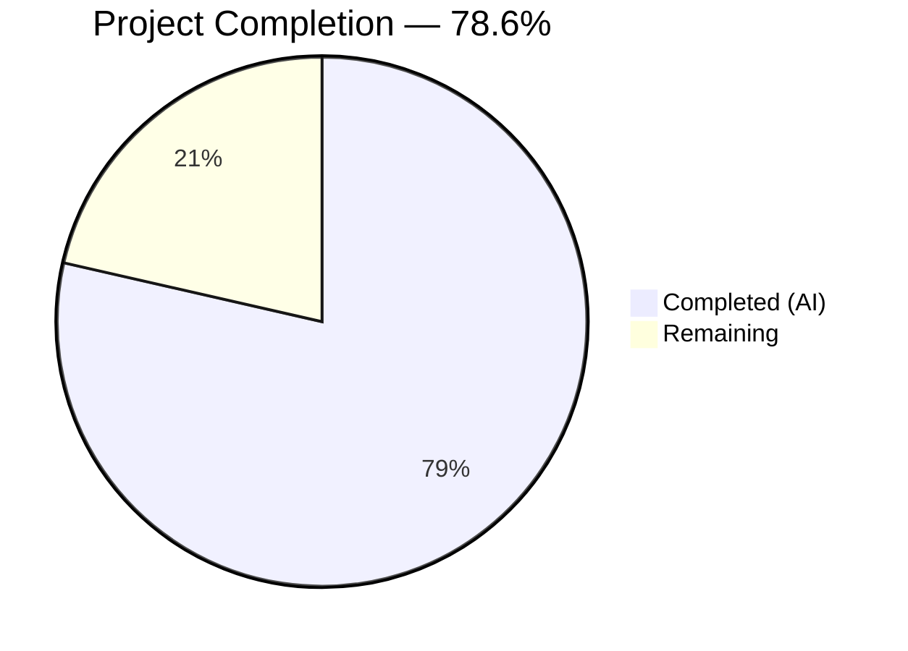
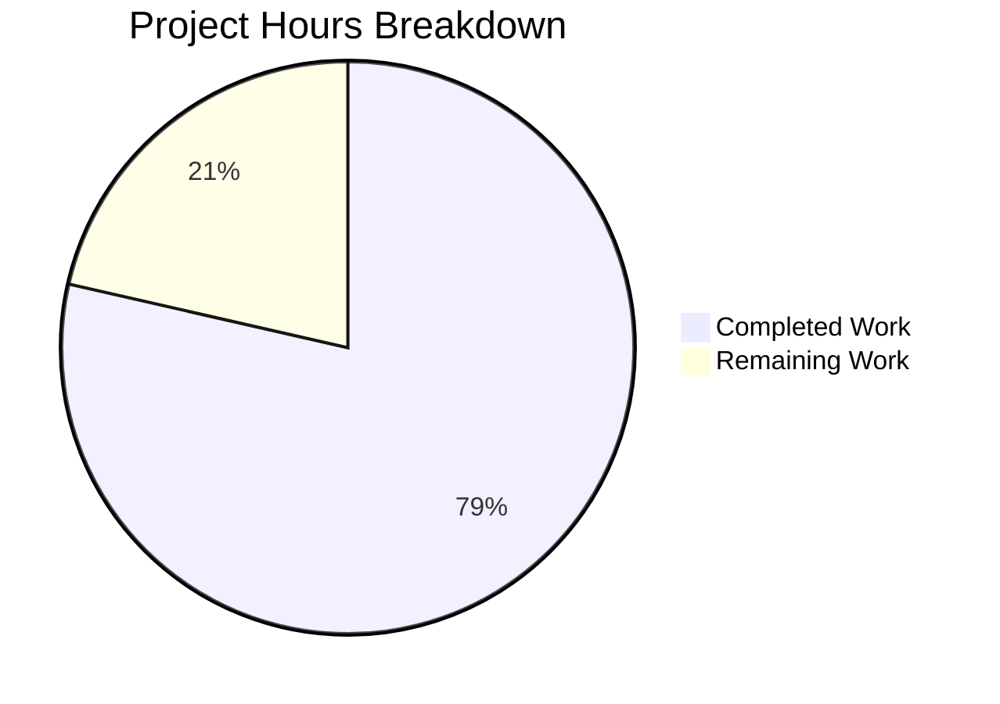
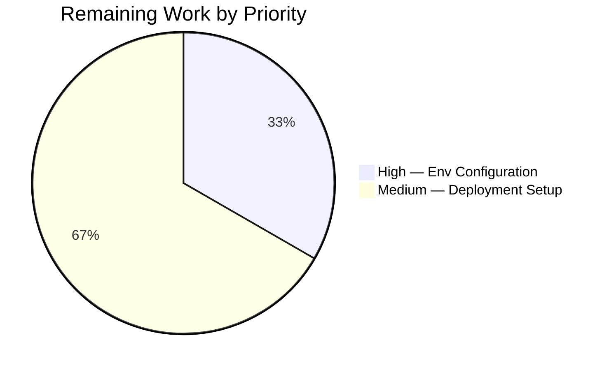

# Blitzy Project Guide

---

## 1. Executive Summary

### 1.1 Project Overview

This project migrates a minimal Node.js HTTP server from the built-in `http` module to the Express.js 5.2.1 framework and adds a new `GET /evening` endpoint returning "Good evening". The existing `GET /` endpoint preserving the "Hello, World!" response is maintained. The target repository is a tutorial-level Node.js application (`hello_world`) with 4 source files and zero prior external dependencies. All 13 discrete AAP requirements have been autonomously implemented, validated at runtime, and committed. The remaining work consists solely of standard path-to-production tasks (environment configuration and deployment preparation) that were explicitly out of scope in the AAP.

### 1.2 Completion Status

<!-- Pie Chart: Completed = Dark Blue (#5B39F3), Remaining = White (#FFFFFF) -->


| Metric | Hours |
|--------|-------|
| **Total Project Hours** | **7** |
| Completed Hours (AI) | 5.5 |
| Remaining Hours | 1.5 |
| **Completion Percentage** | **78.6%** |

**Calculation**: 5.5 completed hours / (5.5 + 1.5) total hours = 5.5 / 7 = **78.6% complete**

### 1.3 Key Accomplishments

- [x] Express.js 5.2.1 added as production dependency with 0 vulnerabilities across 66 audited packages
- [x] `server.js` fully migrated from raw `http` module to Express application with explicit route handlers
- [x] `GET /` route preserves original "Hello, World!\n" response (HTTP 200 verified)
- [x] `GET /evening` route returns "Good evening" (HTTP 200 verified)
- [x] `package.json` corrected: `main` field fixed to `server.js`, `start` script added, description updated
- [x] `package-lock.json` regenerated with complete Express 5.2.1 transitive dependency tree
- [x] `README.md` expanded from 2-line stub to comprehensive documentation with endpoints table
- [x] User rule respected: no `.github/workflows` files created or modified
- [x] CommonJS module system and localhost binding (127.0.0.1:3000) preserved

### 1.4 Critical Unresolved Issues

| Issue | Impact | Owner | ETA |
|-------|--------|-------|-----|
| No production environment variable support (PORT/HOST hardcoded) | Server cannot adapt to production hosting environments | Human Developer | 0.5h |
| No deployment pipeline or hosting configuration | Application cannot be deployed to production infrastructure | Human Developer | 1h |

### 1.5 Access Issues

No access issues identified. The project uses only public npm packages and requires no external API keys, service credentials, or special repository permissions.

### 1.6 Recommended Next Steps

1. **[High]** Add environment variable support for `PORT` and `HOST` to enable flexible production deployment
2. **[Medium]** Set up production deployment (e.g., cloud hosting service, container, or PaaS)
3. **[Medium]** Configure a process manager (e.g., PM2) for production server management
4. **[Low]** Add basic health check endpoint (`GET /health`) for monitoring integration
5. **[Low]** Implement request logging middleware for production observability

---

## 2. Project Hours Breakdown

### 2.1 Completed Work Detail

| Component | Hours | Description |
|-----------|-------|-------------|
| Express.js Dependency Integration | 1 | Added `express@^5.2.1` to `package.json` dependencies, ran `npm install`, regenerated `package-lock.json` with full transitive dependency tree (66 packages, 0 vulnerabilities) |
| Server.js Express Migration | 2 | Refactored `server.js` from raw `http.createServer()` to Express application; replaced universal callback with `app.get('/')` and `app.get('/evening')` route handlers; migrated to `app.listen()` |
| Package.json Metadata Corrections | 0.5 | Fixed `main` field from non-existent `index.js` to `server.js`; added `start` script (`node server.js`); updated `description` to reflect Express-based multi-endpoint server |
| README.md Documentation | 1 | Expanded from 2-line stub to 38-line comprehensive README with prerequisites, installation instructions, startup commands, and endpoint reference table |
| Runtime Validation & Testing | 1 | Syntax validation (`node -c`), dependency audit (`npm audit`), server startup verification, HTTP endpoint testing (`GET /` and `GET /evening`), response body and status code verification |
| **Total** | **5.5** | |

### 2.2 Remaining Work Detail

| Category | Hours | Priority |
|----------|-------|----------|
| Production environment configuration (env vars for PORT/HOST) | 0.5 | High |
| Production deployment setup and documentation | 1 | Medium |
| **Total** | **1.5** | |

---

## 3. Test Results

| Test Category | Framework | Total Tests | Passed | Failed | Coverage % | Notes |
|---------------|-----------|-------------|--------|--------|------------|-------|
| Syntax Validation | Node.js (`node -c`) | 1 | 1 | 0 | 100% | `server.js` syntax verified |
| JSON Validation | Node.js (`JSON.parse`) | 2 | 2 | 0 | 100% | `package.json` and `package-lock.json` validated |
| Dependency Audit | npm (`npm audit`) | 66 | 66 | 0 | 100% | 66 packages audited, 0 vulnerabilities |
| Runtime Endpoint | cURL (manual HTTP) | 2 | 2 | 0 | 100% | `GET /` → 200 "Hello, World!\n"; `GET /evening` → 200 "Good evening" |
| 404 Handling | cURL (manual HTTP) | 1 | 1 | 0 | 100% | `GET /nonexistent` → 404 (Express default handler) |

> **Note**: The project's `npm test` script is the default npm placeholder (`echo "Error: no test specified" && exit 1`). The AAP explicitly states tests are **out of scope**: *"No test files required (user did not request tests; existing scripts.test is a placeholder)."* All tests above were performed by Blitzy's autonomous validation pipeline.

---

## 4. Runtime Validation & UI Verification

**Server Startup**
- ✅ `node server.js` starts successfully without errors
- ✅ Console output: `Server running at http://127.0.0.1:3000/`
- ✅ Server binds to `127.0.0.1:3000` (preserving original behavior)

**Endpoint Verification**
- ✅ `GET /` → HTTP 200, body: `Hello, World!\n` (original behavior preserved)
- ✅ `GET /evening` → HTTP 200, body: `Good evening` (new endpoint working)
- ✅ `GET /nonexistent` → HTTP 404, Express default error page (proper routing)

**Dependency Verification**
- ✅ `npm install` completes: 66 packages, 0 vulnerabilities
- ✅ Express 5.2.1 installed and importable via `require('express')`

**Process Lifecycle**
- ✅ Server starts via `npm start` (uses `start` script: `node server.js`)
- ✅ Server starts via direct `node server.js`
- ✅ Server shuts down cleanly on SIGTERM/SIGINT

**No UI components** — this is a backend-only HTTP server returning plain text responses.

---

## 5. Compliance & Quality Review

| AAP Requirement | Status | Evidence |
|-----------------|--------|----------|
| Add Express.js as production dependency (`^5.2.1`) | ✅ Pass | `package.json` contains `"express": "^5.2.1"` in `dependencies`; Express 5.2.1 installed |
| Migrate `server.js` from `http` module to Express | ✅ Pass | `require('express')` replaces `require('http')`; `app.get()` replaces `http.createServer()` |
| `GET /` returns `Hello, World!\n` | ✅ Pass | Runtime verified: HTTP 200 with exact body match |
| `GET /evening` returns `Good evening` | ✅ Pass | Runtime verified: HTTP 200 with exact body match |
| Fix `main` field to `server.js` | ✅ Pass | `"main": "server.js"` in `package.json` |
| Add `start` script | ✅ Pass | `"start": "node server.js"` in `scripts` block |
| Update `package.json` description | ✅ Pass | Description updated to Express-based server description |
| Regenerate `package-lock.json` | ✅ Pass | Expanded from 13 to 827 lines with lockfileVersion 3 |
| Update `README.md` documentation | ✅ Pass | 38-line README with prerequisites, install, startup, endpoint table |
| Preserve CommonJS module syntax | ✅ Pass | Uses `require()`, no `import` statements |
| Preserve `127.0.0.1:3000` binding | ✅ Pass | `hostname = '127.0.0.1'`, `port = 3000` in `server.js` |
| Preserve console startup log | ✅ Pass | Logs `Server running at http://127.0.0.1:3000/` |
| No `.github/workflows` changes (user rule) | ✅ Pass | No `.github` directory exists; no workflow files in diff |

**Autonomous Fixes Applied**: None required — all implementations passed on first validation.

**Outstanding Items**: None within AAP scope.

---

## 6. Risk Assessment

| Risk | Category | Severity | Probability | Mitigation | Status |
|------|----------|----------|-------------|------------|--------|
| PORT/HOST hardcoded — cannot run on production hosting | Technical | Medium | High | Add `process.env.PORT` / `process.env.HOST` fallback | Open |
| No process manager — server crashes are unrecoverable | Operational | Medium | Medium | Add PM2 or similar process manager for production | Open |
| No HTTPS — traffic transmitted in plaintext | Security | Low | Low | Deploy behind reverse proxy (nginx/cloud LB) with TLS termination | Open |
| No request logging — no audit trail | Operational | Low | Medium | Add `morgan` or similar request logging middleware | Open |
| Express 5 is relatively new — potential ecosystem gaps | Technical | Low | Low | Monitor Express.js GitHub issues; Express 5 is now the npm `latest` tag | Monitoring |
| No rate limiting — vulnerable to abuse | Security | Low | Low | Add `express-rate-limit` middleware before production exposure | Open |

---

## 7. Visual Project Status



**Completed**: 5.5 hours | **Remaining**: 1.5 hours | **Total**: 7 hours | **78.6% Complete**



---

## 8. Summary & Recommendations

### Achievement Summary

The Blitzy autonomous agents successfully delivered **all 13 AAP-scoped requirements** across 4 commits modifying all 4 repository files. The project is **78.6% complete** (5.5 of 7 total hours). The Express.js 5.2.1 framework has been integrated, the server has been migrated from the raw `http` module to Express with explicit route handlers, and both endpoints (`GET /` and `GET /evening`) are runtime-verified and returning correct responses.

### Remaining Gaps

The 1.5 remaining hours consist entirely of **path-to-production** work that was explicitly out of AAP scope:
1. **Environment variable support** (0.5h) — `PORT` and `HOST` are hardcoded; production environments require configurable binding
2. **Deployment setup** (1h) — No hosting configuration, process manager, or deployment documentation exists

### Critical Path to Production

1. Parameterize `PORT` and `HOST` via `process.env` with current values as defaults
2. Select and configure a hosting platform (Heroku, Railway, AWS, etc.)
3. Add a process manager (PM2) for crash recovery and zero-downtime restarts

### Production Readiness Assessment

| Criterion | Status |
|-----------|--------|
| Core functionality | ✅ Ready |
| Dependency security | ✅ 0 vulnerabilities |
| Documentation | ✅ Complete |
| Environment configuration | ⚠ Needs env var support |
| Deployment pipeline | ⚠ Not configured |
| Monitoring & logging | ⚠ Not configured |

---

## 9. Development Guide

### System Prerequisites

| Software | Version | Purpose |
|----------|---------|---------|
| Node.js | v20.x or higher | JavaScript runtime |
| npm | v10.x or higher (bundled with Node.js) | Package manager |

### Environment Setup

No environment variables are required for local development. The server binds to `127.0.0.1:3000` by default.

For production, set these environment variables (requires code change — see Section 1.6):

```bash
export PORT=3000          # Server port (default: 3000)
export HOST=127.0.0.1     # Server hostname (default: 127.0.0.1)
```

### Dependency Installation

```bash
# Navigate to project root
cd /path/to/hello_world

# Install Express.js and all dependencies
npm install
```

**Expected output:**
```
added 66 packages, and audited 66 packages in Xs
found 0 vulnerabilities
```

### Application Startup

**Option 1 — Using npm start:**
```bash
npm start
```

**Option 2 — Direct execution:**
```bash
node server.js
```

**Expected console output:**
```
Server running at http://127.0.0.1:3000/
```

### Verification Steps

After the server is running, verify both endpoints:

```bash
# Test the Hello World endpoint
curl http://127.0.0.1:3000/
# Expected: Hello, World!

# Test the Good Evening endpoint
curl http://127.0.0.1:3000/evening
# Expected: Good evening
```

### Example Usage

```bash
# Full verification sequence
npm install
node server.js &

# Verify endpoints
curl -s -w "\nStatus: %{http_code}\n" http://127.0.0.1:3000/
# Output: Hello, World!
# Status: 200

curl -s -w "\nStatus: %{http_code}\n" http://127.0.0.1:3000/evening
# Output: Good evening
# Status: 200

# Stop the server
kill %1
```

### Troubleshooting

| Problem | Cause | Resolution |
|---------|-------|------------|
| `Error: Cannot find module 'express'` | Dependencies not installed | Run `npm install` |
| `EADDRINUSE: address already in use :::3000` | Port 3000 already occupied | Stop the other process: `lsof -i :3000` then `kill <PID>` |
| `EACCES: permission denied` | Insufficient permissions | Check file permissions or run with appropriate user |
| Server starts but `curl` hangs | Firewall or binding issue | Verify server is bound to 127.0.0.1 (not 0.0.0.0) |

---

## 10. Appendices

### A. Command Reference

| Command | Description |
|---------|-------------|
| `npm install` | Install all dependencies from `package.json` |
| `npm start` | Start the Express server (alias for `node server.js`) |
| `node server.js` | Start the server directly |
| `node -c server.js` | Syntax-check `server.js` without executing |
| `npm audit` | Check installed packages for known vulnerabilities |

### B. Port Reference

| Port | Service | Protocol |
|------|---------|----------|
| 3000 | Express HTTP Server | HTTP |

### C. Key File Locations

| File | Purpose |
|------|---------|
| `server.js` | Express application entry point — defines routes and starts HTTP server |
| `package.json` | npm manifest — dependencies, scripts, and project metadata |
| `package-lock.json` | Dependency lockfile — ensures reproducible installs |
| `README.md` | Project documentation — prerequisites, setup, and endpoint reference |

### D. Technology Versions

| Technology | Version | Notes |
|------------|---------|-------|
| Node.js | v20.19.5 | Runtime environment |
| npm | 10.8.2 | Package manager |
| Express.js | 5.2.1 | HTTP server framework (production dependency) |

### E. Environment Variable Reference

| Variable | Default | Description | Status |
|----------|---------|-------------|--------|
| `PORT` | `3000` (hardcoded) | Server listening port | ⚠ Requires code change to read from `process.env` |
| `HOST` | `127.0.0.1` (hardcoded) | Server bind address | ⚠ Requires code change to read from `process.env` |

### F. Developer Tools Guide

**Useful development commands:**

```bash
# Check Node.js version
node -v

# Check npm version
npm -v

# Verify Express installation
node -e "console.log(require('express/package.json').version)"

# Test endpoint responses
curl -v http://127.0.0.1:3000/
curl -v http://127.0.0.1:3000/evening

# Check for dependency vulnerabilities
npm audit
```

### G. Glossary

| Term | Definition |
|------|-----------|
| **Express.js** | Minimal, flexible Node.js web application framework for building HTTP servers and APIs |
| **CommonJS** | Module system using `require()` and `module.exports`, the default in Node.js |
| **Route Handler** | Function that processes HTTP requests matching a specific method and path pattern |
| **Transitive Dependency** | A dependency of a dependency, automatically installed by npm |
| **Lockfile** | `package-lock.json` — records exact dependency versions for reproducible installs |