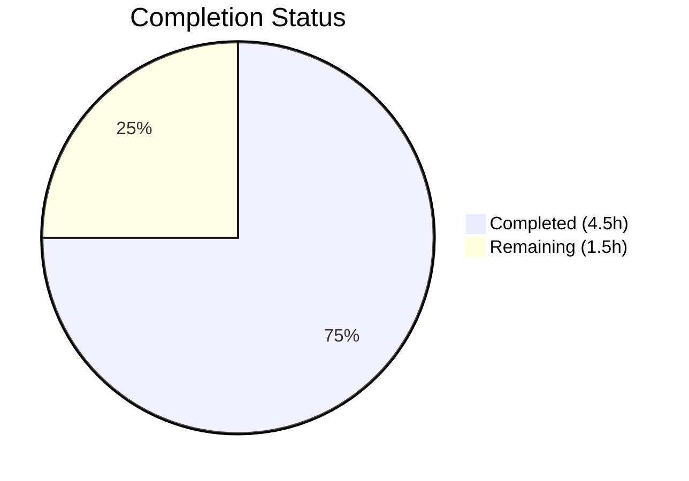
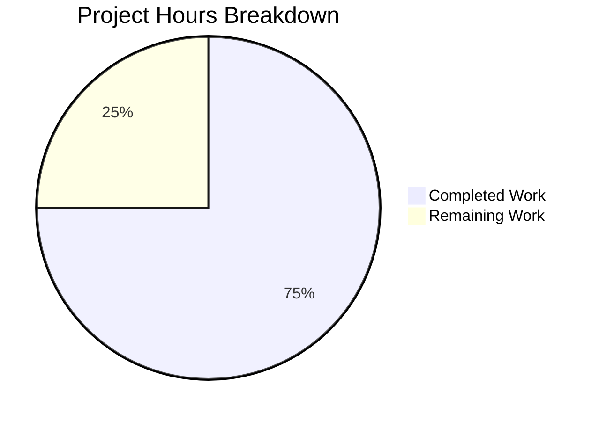

# Blitzy Project Guide

---

## 1. Executive Summary

### 1.1 Project Overview

This project integrates the **Express.js v5.2.1** web framework into an existing minimal Node.js HTTP server tutorial project (`hello_world`). The original server used the built-in Node.js `http` module to respond with "Hello, World!" to all incoming requests. The integration replaces the raw HTTP handler with Express route-based handling, preserves the original `GET /` endpoint, and adds a new `GET /evening` endpoint returning "Good evening". The target audience is developers learning Node.js fundamentals, and the implementation maintains tutorial-level simplicity throughout.

### 1.2 Completion Status



| Metric | Value |
|--------|-------|
| **Total Project Hours** | 6 |
| **Completed Hours (AI)** | 4.5 |
| **Remaining Hours** | 1.5 |
| **Completion Percentage** | **75%** |

**Calculation:** Completed 4.5h / Total 6h = 75% complete

### 1.3 Key Accomplishments

- [x] Migrated `server.js` from Node.js built-in `http` module to Express.js v5.2.1
- [x] Implemented `GET /` route preserving original "Hello, World!\n" response (text/plain, 200)
- [x] Implemented `GET /evening` route returning "Good evening" response (text/plain, 200)
- [x] Added `express@^5.2.1` as production dependency with 0 npm vulnerabilities
- [x] Corrected `package.json` main field from `index.js` to `server.js`
- [x] Added `start` script (`node server.js`) for convenient startup via `npm start`
- [x] Regenerated `package-lock.json` with full Express.js dependency tree (66 packages)
- [x] Disabled `X-Powered-By` header for security hardening
- [x] Updated `README.md` with Express.js documentation, endpoints table, and setup instructions
- [x] All changes committed across 4 agent commits on feature branch

### 1.4 Critical Unresolved Issues

| Issue | Impact | Owner | ETA |
|-------|--------|-------|-----|
| No unresolved issues | N/A | N/A | N/A |

All AAP-scoped deliverables have been implemented, validated at runtime, and committed successfully. No blocking issues remain.

### 1.5 Access Issues

No access issues identified. The project requires only Node.js runtime and npm, both available locally. No external service credentials, API keys, or special repository permissions are needed.

### 1.6 Recommended Next Steps

1. **[High] Code Review & Merge** — Review the PR, verify endpoint behavior locally, merge to `main` branch
2. **[Medium] Environment Variable Configuration** — Externalize `hostname` and `port` constants via `process.env` for deployment flexibility
3. **[Low] Production Deployment Setup** — Configure a process manager (e.g., PM2) and reverse proxy if deploying beyond localhost tutorial use

---

## 2. Project Hours Breakdown

### 2.1 Completed Work Detail

| Component | Hours | Description |
|-----------|-------|-------------|
| Express.js Server Refactoring | 2.0 | Replaced `http.createServer()` with Express app; defined `GET /` and `GET /evening` routes; disabled X-Powered-By header; maintained hostname/port/startup message |
| Package Configuration | 1.0 | Updated `package.json` (main field fix, start script, express dependency); ran `npm install`; verified `package-lock.json` regeneration with 66 packages |
| Documentation | 1.0 | Rewrote `README.md` with Express.js description, endpoints table, Getting Started section, prerequisites, and license |
| Validation & Quality Assurance | 0.5 | Syntax checking (`node -c`), runtime endpoint testing (curl), security header verification, `npm audit` (0 vulnerabilities) |
| **Total** | **4.5** | |

### 2.2 Remaining Work Detail

| Category | Hours | Priority |
|----------|-------|----------|
| Code Review & PR Merge | 0.5 | High |
| Environment Variable Configuration | 0.5 | Medium |
| Production Deployment Setup | 0.5 | Low |
| **Total** | **1.5** | |

**Verification:** Section 2.1 (4.5h) + Section 2.2 (1.5h) = 6h = Total Project Hours in Section 1.2 ✓

---

## 3. Test Results

| Test Category | Framework | Total Tests | Passed | Failed | Coverage % | Notes |
|--------------|-----------|-------------|--------|--------|------------|-------|
| Runtime Validation | curl / Node.js | 4 | 4 | 0 | N/A | Endpoint responses, status codes, content types, and security headers validated via automated curl commands during Blitzy validation |

**Notes:**
- No formal test suite exists in the repository — the `scripts.test` field in `package.json` contains a placeholder (`echo "Error: no test specified" && exit 1`)
- Test infrastructure was **explicitly out of scope** per the AAP: *"No test files or test framework will be added — the current `scripts.test` placeholder is not being replaced as the user did not request test coverage"*
- All runtime validation tests listed above originate from Blitzy's autonomous validation process:
  - `GET /` → 200 OK, `text/plain`, body: `"Hello, World!\n"` ✅
  - `GET /evening` → 200 OK, `text/plain`, body: `"Good evening"` ✅
  - `GET /nonexistent` → 404 (Express default) ✅
  - `X-Powered-By` header → not present ✅

---

## 4. Runtime Validation & UI Verification

### Server Startup
- ✅ `npm install` — 66 packages installed, 0 vulnerabilities
- ✅ `npm start` / `node server.js` — Server starts without errors
- ✅ Console output: `Server running at http://127.0.0.1:3000/`

### Endpoint Validation
- ✅ `GET http://127.0.0.1:3000/` — 200 OK, `Content-Type: text/plain; charset=utf-8`, body: `Hello, World!\n`
- ✅ `GET http://127.0.0.1:3000/evening` — 200 OK, `Content-Type: text/plain; charset=utf-8`, body: `Good evening`
- ✅ `GET http://127.0.0.1:3000/nonexistent` — 404 (Express default 404 handler)

### Security Verification
- ✅ `X-Powered-By` header disabled — confirmed absent in all HTTP responses
- ✅ `npm audit` — 0 vulnerabilities across all 66 packages

### Compilation & Syntax
- ✅ `node -c server.js` — JavaScript syntax check passes
- ✅ `package.json` — Valid JSON, correct schema

### Git State
- ✅ All changes committed on branch `blitzy-94b6e02a-c229-4128-a085-7633d0ea7102`
- ✅ Working tree clean (only `node_modules/` untracked — correctly not committed)

---

## 5. Compliance & Quality Review

| AAP Deliverable | Status | Evidence |
|----------------|--------|----------|
| Install Express.js as production dependency | ✅ Pass | `package.json`: `"express": "^5.2.1"`; `npm audit`: 0 vulnerabilities; Express 5.2.1 resolved in lockfile |
| Refactor server.js from http module to Express | ✅ Pass | `server.js`: uses `express()`, `app.get()`, `app.listen()`; `http` module completely removed |
| GET / returns "Hello, World!\n" text/plain 200 | ✅ Pass | Runtime curl: 200 OK, `text/plain`, exact body match |
| GET /evening returns "Good evening" text/plain 200 | ✅ Pass | Runtime curl: 200 OK, `text/plain`, exact body match |
| Maintain hostname 127.0.0.1 and port 3000 | ✅ Pass | `server.js`: `hostname = '127.0.0.1'`, `port = 3000` |
| Preserve console startup message | ✅ Pass | Template literal format identical to original |
| Fix main field: index.js → server.js | ✅ Pass | `package.json`: `"main": "server.js"` |
| Add start script to package.json | ✅ Pass | `package.json`: `"start": "node server.js"` |
| Regenerate package-lock.json | ✅ Pass | 827 lines, 66 packages, lockfileVersion 3 |
| Update README.md with endpoint documentation | ✅ Pass | Endpoints table, setup instructions, license present |
| CommonJS module system preserved | ✅ Pass | `require('express')` used — no ES module imports |
| No CI/CD workflow changes (user rule) | ✅ Pass | No `.github/workflows/` files created or modified |
| Coding style consistency (2-space indent, single quotes, semicolons) | ✅ Pass | `server.js` follows existing conventions throughout |

**Fixes Applied During Autonomous Validation:**
- `X-Powered-By` header disabled via `app.disable('x-powered-by')` to prevent server framework disclosure (security hardening)

---

## 6. Risk Assessment

| Risk | Category | Severity | Probability | Mitigation | Status |
|------|----------|----------|-------------|------------|--------|
| Hardcoded hostname/port limits deployment flexibility | Operational | Low | Medium | Externalize via `process.env.PORT` and `process.env.HOST` | Open — Recommended for production |
| No test suite to catch regressions | Technical | Low | Low | Add unit tests with a test framework (e.g., Jest, Vitest) when project grows | Open — Out of AAP scope |
| No graceful shutdown handling | Operational | Low | Low | Add SIGTERM/SIGINT handlers for process manager compatibility | Open — Optional |
| Express 5.x is relatively new major version | Technical | Low | Low | Monitor Express.js release notes; ^5.2.1 allows compatible updates | Mitigated — Using latest stable |
| No rate limiting or request validation | Security | Low | Low | Add middleware if endpoints become public-facing | Open — Tutorial scope only |

**Overall Risk Level:** **Low** — This is a tutorial project with minimal attack surface, no data persistence, and no external integrations.

---

## 7. Visual Project Status



**Remaining Work by Priority:**

| Priority | Category | Hours |
|----------|----------|-------|
| 🔴 High | Code Review & PR Merge | 0.5 |
| 🟡 Medium | Environment Variable Configuration | 0.5 |
| 🟢 Low | Production Deployment Setup | 0.5 |
| | **Total Remaining** | **1.5** |

**Integrity Check:** Remaining Work (1.5h) = Section 1.2 Remaining Hours (1.5h) = Section 2.2 Total (1.5h) ✓

---

## 8. Summary & Recommendations

### Achievements

The Blitzy autonomous agents successfully completed **all 10 AAP-scoped deliverables** for the Express.js integration. The project is **75% complete** (4.5h completed out of 6h total). The core feature — migrating from the Node.js `http` module to Express.js with two distinct route endpoints — is fully implemented, runtime-validated, and committed. Additionally, a security enhancement (disabling the `X-Powered-By` header) was proactively applied during validation.

### Remaining Gaps

The 1.5 hours of remaining work consists entirely of path-to-production activities that require human intervention:
1. **Code Review & PR Merge (0.5h)** — Human verification and merge to main
2. **Environment Variable Configuration (0.5h)** — Externalize hardcoded port/hostname for deployment flexibility
3. **Production Deployment Setup (0.5h)** — Process manager and hosting configuration if deploying beyond localhost

### Production Readiness Assessment

The project is **production-ready for its intended purpose as a tutorial**. Both endpoints respond correctly, dependencies are vulnerability-free, documentation is complete, and the codebase follows consistent conventions. For any production deployment beyond tutorial use, the recommended next steps above should be completed.

### Success Metrics

| Metric | Target | Actual | Status |
|--------|--------|--------|--------|
| AAP deliverables completed | 10 | 10 | ✅ 100% |
| Endpoints functional | 2 | 2 | ✅ 100% |
| npm vulnerabilities | 0 | 0 | ✅ Pass |
| Compilation errors | 0 | 0 | ✅ Pass |
| Runtime test failures | 0 | 0 | ✅ Pass |

---

## 9. Development Guide

### System Prerequisites

| Software | Required Version | Purpose |
|----------|-----------------|---------|
| Node.js | >= 18 (v20.x recommended) | JavaScript runtime |
| npm | >= 8 (ships with Node.js) | Package manager |

### Environment Setup

1. **Clone the repository and switch to the feature branch:**

```bash
git clone <repository-url>
cd <repository-name>
git checkout blitzy-94b6e02a-c229-4128-a085-7633d0ea7102
```

2. **Verify Node.js version:**

```bash
node --version
# Expected: v20.x.x (must be >= 18)
```

### Dependency Installation

```bash
npm install
```

**Expected output:** `added 66 packages` with `0 vulnerabilities`

### Application Startup

```bash
npm start
```

Or equivalently:

```bash
node server.js
```

**Expected console output:**
```
Server running at http://127.0.0.1:3000/
```

### Verification Steps

1. **Test the Hello World endpoint:**

```bash
curl http://127.0.0.1:3000/
```
Expected response: `Hello, World!`

2. **Test the Good Evening endpoint:**

```bash
curl http://127.0.0.1:3000/evening
```
Expected response: `Good evening`

3. **Verify security headers:**

```bash
curl -sI http://127.0.0.1:3000/ | grep -i "x-powered-by"
```
Expected: No output (header is disabled)

4. **Verify 404 handling:**

```bash
curl -s -o /dev/null -w "%{http_code}" http://127.0.0.1:3000/nonexistent
```
Expected: `404`

### Stopping the Server

Press `Ctrl+C` in the terminal where the server is running.

### Troubleshooting

| Issue | Cause | Resolution |
|-------|-------|------------|
| `Error: Cannot find module 'express'` | Dependencies not installed | Run `npm install` |
| `EADDRINUSE: address already in use :::3000` | Port 3000 occupied | Kill the existing process: `lsof -ti:3000 \| xargs kill` |
| `node: command not found` | Node.js not installed | Install Node.js >= 18 from https://nodejs.org |
| Server starts but endpoints return errors | Corrupted node_modules | Delete `node_modules/` and `package-lock.json`, then run `npm install` |

---

## 10. Appendices

### A. Command Reference

| Command | Description |
|---------|-------------|
| `npm install` | Install project dependencies |
| `npm start` | Start the Express.js server |
| `node server.js` | Start the server directly |
| `node -c server.js` | Check JavaScript syntax without running |
| `npm audit` | Check dependencies for known vulnerabilities |

### B. Port Reference

| Service | Port | Host | Protocol |
|---------|------|------|----------|
| Express.js HTTP Server | 3000 | 127.0.0.1 | HTTP |

### C. Key File Locations

| File | Purpose |
|------|---------|
| `server.js` | Express.js application with route handlers (main entry point) |
| `package.json` | npm manifest with dependencies and scripts |
| `package-lock.json` | Deterministic dependency lockfile (66 packages) |
| `README.md` | Project documentation with endpoints and setup instructions |

### D. Technology Versions

| Technology | Version | Notes |
|-----------|---------|-------|
| Node.js | v20.19.5 | Runtime (requires >= 18) |
| npm | 10.8.2 | Package manager |
| Express.js | 5.2.1 | HTTP framework (caret range ^5.2.1) |

### E. Environment Variable Reference

The project currently uses hardcoded configuration. For production deployment, the following environment variables are recommended:

| Variable | Default | Description |
|----------|---------|-------------|
| `PORT` | `3000` | HTTP server port (requires code change to read from `process.env.PORT`) |
| `HOST` | `127.0.0.1` | Server bind address (requires code change to read from `process.env.HOST`) |

### G. Glossary

| Term | Definition |
|------|-----------|
| Express.js | Minimal and flexible Node.js web application framework for building HTTP servers with routing and middleware |
| CommonJS | Module system used by Node.js, using `require()` for imports and `module.exports` for exports |
| Route handler | A function registered to respond to HTTP requests matching a specific method and URL path |
| X-Powered-By | An HTTP response header that reveals the server framework; disabled in this project for security |
| package-lock.json | npm lockfile that records the exact dependency tree for deterministic installations |