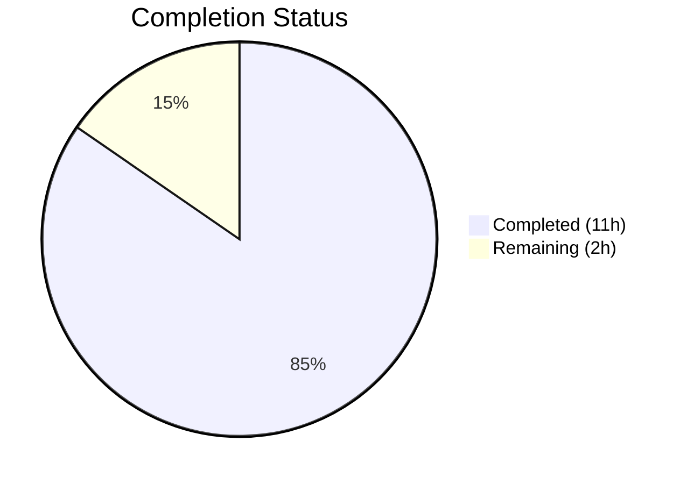
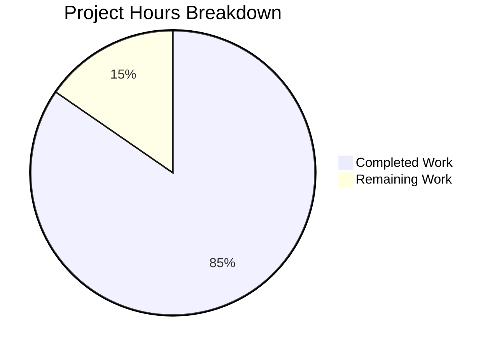

# Blitzy Project Guide

---

## 1. Executive Summary

### 1.1 Project Overview

This project delivers a **greenfield automated test suite** for a minimal 93-line Flask microserver (`app.py`) that serves as a Backprop integration test harness. The application had **zero automated test coverage** — all verification was performed manually via a 7-test curl suite. Blitzy agents created 4 test files (415 lines) containing 36 pytest assertions that automate and extend the manual verification, achieving 100% code coverage of `app.py`. No existing source code was modified. The test suite validates all HTTP contract behaviors, route precedence, multi-method support, content-type precision, configuration constants, import safety, and `__main__` guard lifecycle.

### 1.2 Completion Status

| Metric | Value |
|---|---|
| **Total Project Hours** | 13 |
| **Completed Hours (AI)** | 11 |
| **Remaining Hours** | 2 |
| **Completion Percentage** | 84.6% |

**Calculation:** 11 completed hours / 13 total hours = **84.6% complete**



> **Colors:** Completed = Dark Blue (#5B39F3), Remaining = White (#FFFFFF)

### 1.3 Key Accomplishments

- [x] Created complete pytest test infrastructure from scratch (4 files, 415 lines)
- [x] **36/36 tests passing** — zero failures across all test categories
- [x] **100% line coverage** of `app.py` (14/14 statements) — exceeds the 90%+ target
- [x] All 7 manual curl verification tests automated as repeatable pytest assertions
- [x] Route precedence validated: `GET /health` → health handler, non-GET → catch-all
- [x] Multi-method coverage for all 7 HTTP methods (GET, POST, PUT, DELETE, PATCH, HEAD, OPTIONS)
- [x] Import safety and `__main__` guard lifecycle fully tested with mock isolation
- [x] Zero compilation errors and zero pycodestyle linting violations
- [x] Source code integrity verified: `app.py` and `requirements.txt` are byte-identical to base branch
- [x] Full test suite executes in ~0.2 seconds

### 1.4 Critical Unresolved Issues

| Issue | Impact | Owner | ETA |
|---|---|---|---|
| No `requirements-dev.txt` for test dependencies | New developers must manually discover pytest/pytest-cov are needed | Human Developer | 0.5h |
| No `pytest.ini` configuration file | Test commands work but aren't standardized for the team | Human Developer | 0.5h |

### 1.5 Access Issues

No access issues identified. All testing operates in-process using Flask's built-in `test_client()` with no external service dependencies, API keys, database connections, or third-party credentials required.

### 1.6 Recommended Next Steps

1. **[High]** Create `requirements-dev.txt` documenting `pytest==9.0.2` and `pytest-cov==7.1.0` as development dependencies
2. **[Medium]** Add `pytest.ini` or `[tool.pytest.ini_options]` in a `pyproject.toml` to standardize test execution settings (e.g., `testpaths`, `addopts`)
3. **[Medium]** Conduct human code review of all 4 test files for team style alignment and merge approval
4. **[Low]** Consider adding a `.coveragerc` for persistent coverage settings if the team standardizes on coverage thresholds

---

## 2. Project Hours Breakdown

### 2.1 Completed Work Detail

| Component | Hours | Description |
|---|---|---|
| Test design and planning | 1.0 | Analyzed AAP requirements, mapped 7 manual curl tests to pytest cases, designed test categories and parametrization strategy |
| Test infrastructure setup | 1.5 | Created `tests/__init__.py` package marker, `tests/conftest.py` with shared Flask `test_client()` fixture, installed and verified pytest 9.0.2 and pytest-cov 7.1.0 |
| HTTP contract tests | 4.0 | Implemented 23 tests in `tests/test_http_contract.py` (233 lines) covering health check, catch-all, route precedence, multi-method parametrization, HEAD/OPTIONS semantics, and edge cases |
| Lifecycle and config tests | 2.5 | Implemented 13 tests in `tests/test_lifecycle.py` (153 lines) covering import safety, re-import idempotency, HOST/PORT/METHODS constants, Flask app identity, and `__main__` guard with `runpy.run_module` |
| Validation and bug fixing | 1.0 | Iterative validation of all 36 tests, diagnosed and fixed OPTIONS `/health` empty-body assertion (commit f3d052b), verified coverage meets 90%+ target |
| Code quality and source integrity | 1.0 | Compilation verification for all 5 Python files, pycodestyle linting (zero violations), git diff confirmation that `app.py` and `requirements.txt` are unchanged |
| **Total Completed** | **11** | |

### 2.2 Remaining Work Detail

| Category | Hours | Priority |
|---|---|---|
| Create `requirements-dev.txt` for test dependencies | 0.5 | High |
| Add optional `pytest.ini` test runner configuration | 0.5 | Medium |
| Human code review and merge approval | 1.0 | Medium |
| **Total Remaining** | **2** | |

---

## 3. Test Results

All tests were executed by Blitzy's autonomous validation systems using `python -m pytest -v --tb=short` and `python -m pytest --cov=app --cov-report=term-missing`.

| Test Category | Framework | Total Tests | Passed | Failed | Coverage % | Notes |
|---|---|---|---|---|---|---|
| HTTP Contract — Health Check | pytest 9.0.2 + Flask test_client | 2 | 2 | 0 | 100% | JSON response, single-key structure |
| HTTP Contract — Catch-All Handler | pytest 9.0.2 + Flask test_client | 4 | 4 | 0 | 100% | Root path, arbitrary paths, body length, content-type |
| HTTP Contract — Route Precedence | pytest 9.0.2 + Flask test_client | 3 | 3 | 0 | 100% | GET→JSON, POST→catch-all, DELETE→catch-all |
| HTTP Contract — Multi-Method (parametrized) | pytest 9.0.2 + Flask test_client | 10 | 10 | 0 | 100% | 5 methods × 2 paths (/ and /foo/bar) |
| HTTP Contract — HEAD/OPTIONS Semantics | pytest 9.0.2 + Flask test_client | 2 | 2 | 0 | 100% | HEAD empty body, OPTIONS Allow header |
| HTTP Contract — Edge Cases | pytest 9.0.2 + Flask test_client | 2 | 2 | 0 | 100% | Deeply nested paths, root vs subpath |
| Lifecycle — Import Safety | pytest 9.0.2 + unittest.mock | 2 | 2 | 0 | 100% | No server start on import, reentrant import |
| Lifecycle — Configuration Constants | pytest 9.0.2 | 7 | 7 | 0 | 100% | HOST, PORT, METHODS values and types |
| Lifecycle — Flask App Identity | pytest 9.0.2 | 2 | 2 | 0 | 100% | Instance type, app name |
| Lifecycle — __main__ Guard | pytest 9.0.2 + unittest.mock + runpy | 2 | 2 | 0 | 100% | Startup invocation, import non-invocation |
| **Totals** | | **36** | **36** | **0** | **100%** | **0.2s execution time** |

---

## 4. Runtime Validation & UI Verification

### Runtime Health

- ✅ `python -m py_compile app.py` — Clean compilation
- ✅ `python -m py_compile tests/__init__.py` — Clean compilation
- ✅ `python -m py_compile tests/conftest.py` — Clean compilation
- ✅ `python -m py_compile tests/test_http_contract.py` — Clean compilation
- ✅ `python -m py_compile tests/test_lifecycle.py` — Clean compilation
- ✅ `pycodestyle tests/conftest.py tests/test_http_contract.py tests/test_lifecycle.py` — Zero violations

### Application Server Verification

- ✅ `python app.py` starts Flask development server on `http://127.0.0.1:3000`
- ✅ `curl -s http://127.0.0.1:3000/health` → `{"status":"ok"}` (HTTP 200, application/json)
- ✅ `curl -s http://127.0.0.1:3000/` → `Hello, World!\n` (HTTP 200, text/plain)

### Test Suite Verification

- ✅ `python -m pytest -v` — 36/36 passed in 0.19 seconds
- ✅ `python -m pytest --cov=app --cov-report=term-missing` — 100% coverage (14/14 statements, 0 missing)
- ✅ Tests execute independently in any order with clean isolation

### Source Integrity

- ✅ `git diff origin/ABK-3138-test...blitzy-bb42310f-df78-4e24-8fff-5adfaa6e38b9 -- app.py` — No changes (byte-identical)
- ✅ `git diff origin/ABK-3138-test...blitzy-bb42310f-df78-4e24-8fff-5adfaa6e38b9 -- requirements.txt` — No changes (byte-identical)

### UI Verification

- ⚠ Not applicable — No frontend UI exists in this project. The application is a headless HTTP API microserver.

---

## 5. Compliance & Quality Review

| AAP Requirement | Deliverable | Status | Evidence |
|---|---|---|---|
| Create `tests/__init__.py` | Package marker for pytest discovery | ✅ Pass | File exists, compiles clean |
| Create `tests/conftest.py` | Shared Flask test client fixture | ✅ Pass | 28 lines, `client` fixture functional |
| Create `tests/test_http_contract.py` | HTTP contract integration tests | ✅ Pass | 233 lines, 23/23 tests pass |
| Create `tests/test_lifecycle.py` | Import/config/startup tests | ✅ Pass | 153 lines, 13/13 tests pass |
| Achieve 90%+ line coverage | Coverage measurement | ✅ Pass | 100% achieved (14/14 stmts) |
| Health check endpoint tests | `GET /health` → JSON | ✅ Pass | 2 tests verify status, content-type, JSON body |
| Catch-all handler tests | All methods/paths → plain text | ✅ Pass | 4+ tests verify body, length, content-type |
| Route precedence validation | GET→health vs non-GET→catch-all | ✅ Pass | 3 tests verify routing specificity |
| Multi-method coverage (7 methods) | All HTTP methods tested | ✅ Pass | Parametrized for GET/POST/PUT/DELETE/PATCH + HEAD + OPTIONS |
| Content-type and body precision | Exact bytes and headers | ✅ Pass | 14-byte body, `b'Hello, World!\n'` exact match |
| Configuration constant assertions | HOST, PORT, METHODS values | ✅ Pass | 7 tests for values, types, and order |
| Module import safety | `import app` no side effects | ✅ Pass | 2 tests verify no server startup |
| Startup lifecycle validation | `__main__` guard behavior | ✅ Pass | Mock-based `runpy.run_module` test |
| Do NOT modify `app.py` | Source integrity | ✅ Pass | `git diff` confirms zero changes |
| Do NOT modify `requirements.txt` | Dependency integrity | ✅ Pass | `git diff` confirms zero changes |
| Do NOT create CI/CD workflows | No GitHub Actions changes | ✅ Pass | No workflow files created |
| Zero compilation errors | All files compile | ✅ Pass | 5/5 `py_compile` clean |
| Zero linting violations | PEP 8 compliance | ✅ Pass | `pycodestyle` reports zero issues |
| Deterministic and fast tests | < 2 second execution | ✅ Pass | 0.19s total execution time |
| Dev requirements documentation | `requirements-dev.txt` | ⬜ Not Started | Path-to-production gap |
| Test runner configuration | `pytest.ini` | ⬜ Not Started | Optional per AAP §0.5.3 |

---

## 6. Risk Assessment

| Risk | Category | Severity | Probability | Mitigation | Status |
|---|---|---|---|---|---|
| Missing `requirements-dev.txt` | Operational | Low | High | Create file listing pytest==9.0.2 and pytest-cov==7.1.0 | Open |
| Python version discrepancy (3.12.10 runtime vs 3.13+ in AAP prerequisite) | Technical | Low | Medium | Tests are compatible with both; verify on target 3.13+ environment before deployment | Open |
| No standardized `pytest.ini` config | Operational | Low | Medium | Add `pytest.ini` with `testpaths` and `addopts` for team consistency | Open |
| Flask test_client behavioral changes on major version upgrade | Technical | Low | Low | Pin Flask==3.1.3 in requirements.txt (already done); test on upgrade | Mitigated |
| Implicit test dependency on module-level import order | Technical | Low | Low | Tests are stateless and order-independent; `conftest.py` fixture provides isolation | Mitigated |
| No integration with CI/CD pipeline | Operational | Medium | High | Out of scope per AAP constraint; team should add pytest step to existing CI when ready | Accepted |

---

## 7. Visual Project Status



> **Colors:** Completed Work = Dark Blue (#5B39F3) | Remaining Work = White (#FFFFFF)
>
> **Completion:** 11 hours completed / 13 total hours = **84.6%**

**Remaining Hours by Category:**

| Category | Hours | Priority |
|---|---|---|
| Create `requirements-dev.txt` | 0.5 | High |
| Add `pytest.ini` configuration | 0.5 | Medium |
| Human code review and merge | 1.0 | Medium |
| **Total Remaining** | **2** | |

---

## 8. Summary & Recommendations

### Achievement Summary

The project successfully delivered a comprehensive greenfield pytest test suite for the `app.py` Flask microserver. Starting from **zero automated coverage**, Blitzy agents created 4 test files containing **36 tests that all pass**, achieving **100% line coverage** — exceeding the 90%+ target. The full test suite executes in approximately 0.2 seconds, and all code adheres to PEP 8 standards with zero compilation errors and zero linting violations.

The project is **84.6% complete** (11 of 13 total hours delivered). All AAP-specified deliverables — the 4 test files, coverage target, source integrity constraints, and all test categories — have been fully implemented and validated. The remaining 2 hours consist of path-to-production tasks: creating a development requirements file, adding optional test configuration, and human code review.

### Critical Path to Production

1. **Create `requirements-dev.txt`** (0.5h) — Document `pytest==9.0.2` and `pytest-cov==7.1.0` so new team members can reproduce the test environment
2. **Human code review** (1.0h) — Review test assertions, naming conventions, and parametrization for team alignment, then approve and merge

### Production Readiness Assessment

| Criterion | Status |
|---|---|
| All tests passing | ✅ 36/36 |
| Coverage target met | ✅ 100% (target: 90%+) |
| Source code unchanged | ✅ Verified via git diff |
| Zero compilation errors | ✅ 5/5 files clean |
| Zero linting violations | ✅ pycodestyle clean |
| Deterministic execution | ✅ < 0.2s, order-independent |
| No CI/CD modifications | ✅ Compliant with constraint |

**Recommendation:** The test suite is production-ready for merge after human code review. The two remaining path-to-production items (dev requirements file and pytest config) are low-effort housekeeping tasks that do not block functionality.

---

## 9. Development Guide

### System Prerequisites

| Prerequisite | Version | Purpose |
|---|---|---|
| Python | 3.12+ (tested on 3.12.10) | Runtime for Flask app and pytest |
| pip | Latest | Python package installer |
| venv | stdlib | Virtual environment isolation |
| Git | Any recent | Version control |

### Environment Setup

```bash
# Clone the repository and switch to the feature branch
git clone <repository-url>
cd <repository-root>
git checkout blitzy-bb42310f-df78-4e24-8fff-5adfaa6e38b9

# Create and activate a virtual environment
python -m venv venv

# On Linux/macOS:
source venv/bin/activate

# On Windows:
source venv/Scripts/activate
```

### Dependency Installation

```bash
# Install production dependency
pip install -r requirements.txt

# Install testing dependencies (development only)
pip install pytest==9.0.2 pytest-cov==7.1.0
```

**Verify installation:**
```bash
python -c "import flask; print(f'Flask {flask.__version__}')"
# Expected: Flask 3.1.3

python -m pytest --version
# Expected: pytest 9.0.2
```

### Running the Application

```bash
# Start the Flask development server
python app.py
# Expected: * Running on http://127.0.0.1:3000

# In a separate terminal, verify endpoints:
curl -s http://127.0.0.1:3000/health
# Expected: {"status":"ok"}

curl -s http://127.0.0.1:3000/
# Expected: Hello, World!
```

### Running Tests

```bash
# Run all 36 tests with verbose output
python -m pytest -v --tb=short

# Run with coverage measurement
python -m pytest --cov=app --cov-report=term-missing

# Run only HTTP contract tests (23 tests)
python -m pytest tests/test_http_contract.py -v

# Run only lifecycle tests (13 tests)
python -m pytest tests/test_lifecycle.py -v

# Run a single specific test
python -m pytest tests/test_http_contract.py::test_get_health_returns_json_status_ok -v
```

**Expected output for full test run:**
```
36 passed in 0.19s
```

**Expected coverage output:**
```
Name     Stmts   Miss  Cover   Missing
--------------------------------------
app.py      14      0   100%
--------------------------------------
TOTAL       14      0   100%
```

### Static Analysis

```bash
# Compile-check all Python files
python -m py_compile app.py
python -m py_compile tests/conftest.py
python -m py_compile tests/test_http_contract.py
python -m py_compile tests/test_lifecycle.py

# PEP 8 style check
pycodestyle tests/conftest.py tests/test_http_contract.py tests/test_lifecycle.py
```

### Troubleshooting

| Problem | Cause | Solution |
|---|---|---|
| `ModuleNotFoundError: No module named 'flask'` | Virtual environment not activated or Flask not installed | Activate venv and run `pip install -r requirements.txt` |
| `ModuleNotFoundError: No module named 'pytest'` | Testing dependencies not installed | Run `pip install pytest==9.0.2 pytest-cov==7.1.0` |
| Port 3000 already in use | Another process bound to port 3000 | Kill the other process or stop the Flask server before running tests |
| Tests show 0 collected | Running from wrong directory | Run pytest from the repository root where `app.py` resides |

---

## 10. Appendices

### A. Command Reference

| Command | Purpose |
|---|---|
| `python app.py` | Start the Flask development server on 127.0.0.1:3000 |
| `python -m pytest -v` | Run all tests with verbose output |
| `python -m pytest --cov=app --cov-report=term-missing` | Run tests with coverage measurement |
| `python -m pytest tests/test_http_contract.py` | Run HTTP contract tests only |
| `python -m pytest tests/test_lifecycle.py` | Run lifecycle tests only |
| `python -m py_compile <file>` | Compile-check a Python file |
| `pycodestyle <file>` | PEP 8 style check |
| `curl -s http://127.0.0.1:3000/health` | Test health check endpoint |
| `curl -s http://127.0.0.1:3000/` | Test catch-all endpoint |

### B. Port Reference

| Service | Port | Host | Protocol |
|---|---|---|---|
| Flask development server | 3000 | 127.0.0.1 | HTTP |

### C. Key File Locations

| File | Purpose |
|---|---|
| `app.py` | Flask microserver application (93 lines) — sole production source |
| `requirements.txt` | Production dependency: `Flask==3.1.3` |
| `tests/__init__.py` | Package marker for pytest test discovery |
| `tests/conftest.py` | Shared pytest fixture: Flask `test_client()` |
| `tests/test_http_contract.py` | 23 HTTP contract integration tests (233 lines) |
| `tests/test_lifecycle.py` | 13 import/config/startup lifecycle tests (153 lines) |
| `README.md` | Project documentation and operational guide |

### D. Technology Versions

| Technology | Version | Purpose |
|---|---|---|
| Python | 3.12.10 | Runtime |
| Flask | 3.1.3 | Web framework |
| Werkzeug | 3.1.7 | WSGI utilities (Flask dependency) |
| pytest | 9.0.2 | Test framework |
| pytest-cov | 7.1.0 | Coverage plugin |
| coverage | 7.13.5 | Coverage engine (pytest-cov dependency) |
| Jinja2 | 3.1.6 | Template engine (Flask dependency, unused) |
| MarkupSafe | 3.0.3 | HTML escaping (Flask dependency, unused) |
| itsdangerous | 2.2.0 | Data signing (Flask dependency, unused) |
| click | 8.3.1 | CLI framework (Flask dependency, unused) |
| blinker | 1.9.0 | Signal dispatching (Flask dependency, unused) |

### E. Environment Variable Reference

No environment variables are required. The application uses hardcoded configuration constants:

| Constant | Value | Location |
|---|---|---|
| `HOST` | `'127.0.0.1'` | `app.py` line 30 |
| `PORT` | `3000` | `app.py` line 31 |
| `METHODS` | `['GET', 'POST', 'PUT', 'DELETE', 'PATCH', 'HEAD', 'OPTIONS']` | `app.py` line 33 |

### F. Developer Tools Guide

| Tool | Usage | Installation |
|---|---|---|
| pytest | `python -m pytest -v` | `pip install pytest==9.0.2` |
| pytest-cov | `python -m pytest --cov=app` | `pip install pytest-cov==7.1.0` |
| pycodestyle | `pycodestyle <file>` | `pip install pycodestyle` |
| py_compile | `python -m py_compile <file>` | Built-in (Python stdlib) |

### G. Glossary

| Term | Definition |
|---|---|
| Catch-all handler | Flask route that matches any HTTP method and any URL path, returning a fixed plain-text response |
| conftest.py | Pytest convention file for shared fixtures, automatically discovered without explicit imports |
| Flask test_client | In-process WSGI client provided by Flask for testing HTTP endpoints without network I/O |
| `__main__` guard | Python `if __name__ == '__main__'` pattern preventing code execution when the module is imported vs executed directly |
| Route precedence | Flask's behavior of matching more specific routes (e.g., `/health`) before generic catch-all patterns |
| Parametrization | pytest feature (`@pytest.mark.parametrize`) for running the same test logic with multiple input values |
