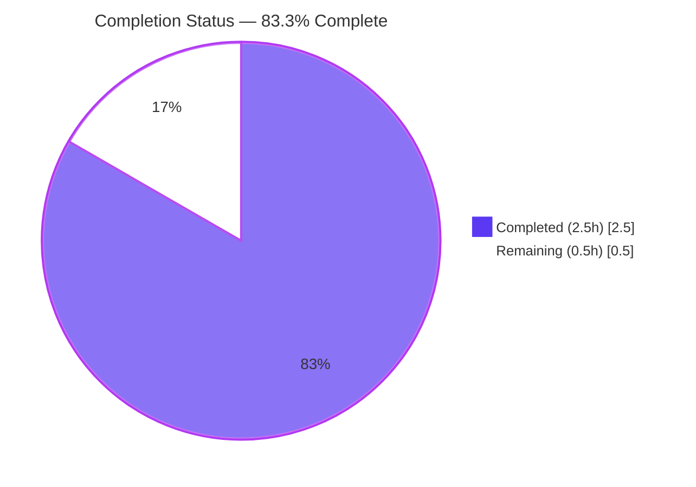
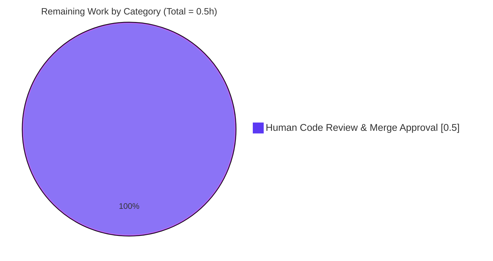

# Blitzy Project Guide — ABK-3138: Canonical Codebase Context

---

## 1. Executive Summary

### 1.1 Project Overview

This project resolves a **documentation drift defect (ABK-3138)** in the `hao-backprop-test` repository by adding a canonical, code-aligned `codebase_context.md` file at the repository root. The active implementation is a single-file Python/Flask microserver (`app.py`, 93 lines) bound to `127.0.0.1:3000`, exposing `GET /health` returning JSON and a universal catch-all returning `Hello, World!\n`. Prior to this fix, downstream consumers (Backprop, Blitzy agents, contributors, IDE tooling) relied on stale external/cached pre-migration context describing a non-existent Node.js runtime. The fix creates exactly one new file, preserves byte-identical source, tests, and dependencies, and honors all 36 pytest assertions with 100% `app.py` coverage.

### 1.2 Completion Status



> **Color key:** Completed = Dark Blue `#5B39F3`, Remaining = White `#FFFFFF`, Accent = Violet-Black `#B23AF2`

| Metric | Value |
|---|---|
| **Total Project Hours** | 3.0 |
| **Completed Hours (AI)** | 2.5 |
| **Completed Hours (Manual)** | 0.0 |
| **Remaining Hours** | 0.5 |
| **Completion Percentage** | **83.3%** |

**Calculation:** 2.5 completed hours / (2.5 completed + 0.5 remaining) × 100 = **83.3%**

### 1.3 Key Accomplishments

- [x] Created `codebase_context.md` (102 lines, 7,803 bytes) at repository root per AAP §0.4.2 content skeleton
- [x] HTML comment block at top documenting purpose, source of truth, and drift-regeneration policy (lines 3–7)
- [x] All 10 mandatory sections present: Project Identity, Runtime Architecture, Endpoints, Testability Pattern, Test Suite Inventory, Commands, Out of Scope, Authoritative References, Provenance
- [x] All present-tense runtime claims verified against `app.py`, `requirements.txt`, and the pytest suite
- [x] AAP §0.4.3 content-conformance checks: **all 4 pass** (PRESENT, IDENTITY OK, stale-guard empty, source diff empty)
- [x] AAP §0.6.2 regression checks: **all pass** (36/36 pytest, 100% app.py coverage, 6 live endpoint smoke tests byte-identical to baseline)
- [x] AAP §0.5.2 exclusions honored: `app.py`, `requirements.txt`, `tests/`, `README.md`, `blitzy/documentation/*` all **byte-identical** to pre-fix state
- [x] AAP §0.7.1 "exit code 137 test" rule honored: no `.github/` directory exists or was created
- [x] Code review finding addressed (commit `b318b5c`): 7 broken Tech Spec citations replaced with valid `§0.x` references
- [x] Branch commits attributable to Blitzy agents: 2 commits (`2cb2d7a`, `b318b5c`) both by `agent@blitzy.com`
- [x] File convention conformance: lowercase name `codebase_context.md`, LF line endings in git, UTF-8, trailing newline

### 1.4 Critical Unresolved Issues

| Issue | Impact | Owner | ETA |
|---|---|---|---|
| Human code review and merge approval of PR | Required gate before merge to default branch; 2 commits await maintainer approval | Human Developer | 0.5h |

No other critical unresolved issues exist. Source tree is byte-identical to pre-fix baseline; all behavioral invariants preserved.

### 1.5 Access Issues

**No access issues identified.** The fix is a documentation-only repository change requiring no external service credentials, API keys, database access, or third-party permissions. All work operates entirely in-process with files committed on branch `blitzy-bb3c95fc-b354-4cbc-a54c-849157882c25`.

| System/Resource | Type of Access | Issue Description | Resolution Status | Owner |
|---|---|---|---|---|
| — | — | No access issues identified | N/A | N/A |

### 1.6 Recommended Next Steps

1. **[High]** Obtain human code review sign-off on the 2 commits (`2cb2d7a`, `b318b5c`) and merge the PR into the default branch so downstream consumers ingest the canonical context artifact (est. 0.5h)
2. **[Low]** (Optional, post-merge) Communicate to downstream consumers (Backprop, ancillary tooling maintainers) that any cached/mirrored pre-migration context should be refreshed from the repository root
3. **[Low]** (Optional, future maintenance) If `app.py`, `requirements.txt`, or `tests/*.py` materially change, regenerate `codebase_context.md` per its documented drift policy (lines 98–102)

---

## 2. Project Hours Breakdown

### 2.1 Completed Work Detail

| Component | Hours | Description |
|---|---|---|
| Authoring `codebase_context.md` (10 sections + HTML comment) | 1.5 | Commit `2cb2d7a`: created 102-line file aligned to AAP §0.4.2 skeleton — Project Identity, Runtime Architecture, Endpoints table, Testability Pattern, Test Suite Inventory (4 files, 36 assertions, 100% coverage), Commands, Out of Scope, Authoritative References, and Provenance footer with migration note and drift policy |
| Code review remediation — broken Tech Spec citations | 0.5 | Commit `b318b5c`: replaced 7 invalid `§1.x/§2.x/§3.x` citations with valid `§0.x` references resolving to sections that exist in the Tech Spec (substantive claims unchanged, only citations corrected) |
| Validation and regression verification | 0.5 | Ran AAP §0.4.3 content-conformance checks (presence, identity grep, stale-identifier awk guard), §0.6.2 regression checks (36/36 pytest, 100% coverage, source-tree diff empty, 6 live endpoint smoke tests), and §0.5.2 exclusion checks (no forbidden files created or modified) |
| **Total Completed** | **2.5** | |

### 2.2 Remaining Work Detail

| Category | Hours | Priority |
|---|---|---|
| Human code review and merge approval of PR (Path-to-production) | 0.5 | Medium |
| **Total Remaining** | **0.5** | |

### 2.3 Consistency Validation

| Integrity Rule | Value | Status |
|---|---|---|
| Section 1.2 Remaining Hours | 0.5 | — |
| Section 2.2 "Hours" column sum | 0.5 | ✅ Match |
| Section 7 pie chart "Remaining Work" | 0.5 | ✅ Match |
| Section 2.1 (2.5) + Section 2.2 (0.5) | 3.0 | ✅ = Total Project Hours |
| Completion Percentage (2.5 / 3.0) | 83.3% | ✅ Consistent across Sections 1.2, 7, 8 |

---

## 3. Test Results

All tests were executed by Blitzy's autonomous validation systems during the final validation phase. Test framework: `pytest 9.0.3` with `pytest-cov 7.1.0` under Python `3.13.13` and Flask `3.1.3`. Tests were invoked via `python -m pytest -v --tb=short` and `python -m pytest --cov=app --cov-report=term-missing`.

| Test Category | Framework | Total Tests | Passed | Failed | Coverage % | Notes |
|---|---|---|---|---|---|---|
| HTTP Contract — Health Check | pytest 9.0.3 + Flask `test_client()` | 2 | 2 | 0 | 100% | JSON body `{"status":"ok"}`, single-key structure, status 200, `application/json` content-type |
| HTTP Contract — Catch-All Handler | pytest 9.0.3 + Flask `test_client()` | 4 | 4 | 0 | 100% | Root path, arbitrary paths, exact 14-byte body length including trailing `\n`, content-type `text/plain` |
| HTTP Contract — Route Precedence | pytest 9.0.3 + Flask `test_client()` | 3 | 3 | 0 | 100% | `GET /health` → health handler; `POST /health` / `DELETE /health` → catch-all |
| HTTP Contract — Multi-Method (parametrized) | pytest 9.0.3 + Flask `test_client()` | 10 | 10 | 0 | 100% | 5 methods (GET, POST, PUT, DELETE, PATCH) × 2 paths (`/` and `/foo/bar`) |
| HTTP Contract — HEAD / OPTIONS Semantics | pytest 9.0.3 + Flask `test_client()` | 2 | 2 | 0 | 100% | HEAD empty body with GET headers; OPTIONS `Allow` header lists methods |
| HTTP Contract — Edge Cases | pytest 9.0.3 + Flask `test_client()` | 2 | 2 | 0 | 100% | Deeply nested paths (`/a/b/c/d/e`), root-vs-subpath response parity |
| Lifecycle — Import Safety | pytest 9.0.3 + `unittest.mock` | 2 | 2 | 0 | 100% | `import app` does not start server; module is reentrant |
| Lifecycle — Configuration Constants | pytest 9.0.3 | 7 | 7 | 0 | 100% | `HOST`, `PORT`, `METHODS` exact values, types, and order |
| Lifecycle — Flask App Identity | pytest 9.0.3 | 2 | 2 | 0 | 100% | Instance type `Flask`, app name equals `app` |
| Lifecycle — `__main__` Guard | pytest 9.0.3 + `unittest.mock` + `runpy` | 2 | 2 | 0 | 100% | Startup invocation via `runpy.run_module`; import does not invoke `app.run` |
| **Totals** | — | **36** | **36** | **0** | **100%** | **0.12s execution time** |

**Coverage Detail:**

```
Name     Stmts   Miss  Cover   Missing
--------------------------------------
app.py      14      0   100%
--------------------------------------
TOTAL       14      0   100%
```

**Compilation Verification:**

| File | `python -m py_compile` |
|---|---|
| `app.py` | ✅ Clean |
| `tests/__init__.py` | ✅ Clean |
| `tests/conftest.py` | ✅ Clean |
| `tests/test_http_contract.py` | ✅ Clean |
| `tests/test_lifecycle.py` | ✅ Clean |

All tests listed in this section originate from Blitzy's autonomous validation execution on the `blitzy-bb3c95fc-b354-4cbc-a54c-849157882c25` branch. No tests were added, modified, or removed by this fix — the pre-fix test suite is preserved byte-identically per AAP §0.5.2.

---

## 4. Runtime Validation & UI Verification

### 4.1 Runtime Health

- ✅ **Operational** — `python app.py` starts Werkzeug development server at `http://127.0.0.1:3000`
- ✅ **Operational** — `python -m pytest -v` → 36 passed in 0.12s
- ✅ **Operational** — `python -m pytest --cov=app --cov-report=term-missing` → `app.py 14 0 100%`
- ✅ **Operational** — `python -c "import app; print(type(app.app).__name__, app.HOST, app.PORT)"` → `Flask 127.0.0.1 3000`
- ✅ **Operational** — All 5 Python files compile clean via `python -m py_compile`

### 4.2 Endpoint Verification (Live Server Smoke Tests)

| Endpoint | Expected (AAP §0.6.2) | Actual | Status |
|---|---|---|---|
| `GET /health` | `{"status":"ok"}` HTTP 200 `application/json` | `{"status":"ok"}` HTTP 200 `application/json` (16 bytes) | ✅ Operational |
| `GET /` | `Hello, World!\n` HTTP 200 `text/plain` (14 bytes) | `Hello, World!\n` HTTP 200 `text/plain; charset=utf-8` (14 bytes) | ✅ Operational |
| `GET /anything` | `Hello, World!\n` HTTP 200 `text/plain` (14 bytes) | `Hello, World!\n` HTTP 200 `text/plain; charset=utf-8` (14 bytes) | ✅ Operational |
| `POST /other/path` | `Hello, World!\n` HTTP 200 `text/plain` (14 bytes) | `Hello, World!\n` HTTP 200 `text/plain; charset=utf-8` (14 bytes) | ✅ Operational |
| `HEAD /some/path` | Empty body + headers from GET | Empty body, `Content-Type: text/plain`, `Content-Length: 14` | ✅ Operational |
| `OPTIONS /health` | `Allow` header listing methods | `Allow: DELETE, POST, PUT, GET, PATCH, OPTIONS, HEAD` | ✅ Operational |

### 4.3 Source-Tree Integrity

- ✅ **Operational** — `git diff 9f30ce7 -- app.py requirements.txt tests/ README.md blitzy/` returns empty (byte-identical to base)
- ✅ **Operational** — `git diff --name-status 9f30ce7..HEAD` returns exactly `A\tcodebase_context.md` (single new file)
- ✅ **Operational** — `git diff --numstat 9f30ce7..HEAD` returns `102\t0\tcodebase_context.md` (+102 / -0)

### 4.4 UI Verification

- ⚠ **Not Applicable** — The application is a headless HTTP API microserver (per Tech Spec §0.4 and Project Guide §4 "UI Verification"). The fix is a repository-root markdown file; there is no user interface surface, no Figma attachment, and no design-system change. Per AAP §0.4.4 ("User Interface Design"), UI verification is explicitly not in scope for this bug fix.

---

## 5. Compliance & Quality Review

| AAP Requirement | Deliverable | Status | Evidence |
|---|---|---|---|
| §0.4.1 Create `codebase_context.md` | New file at repo root | ✅ Pass | File present (102 lines, 7,803 bytes), commit `2cb2d7a` |
| §0.4.2 HTML comment block at top | Lines 3–7 | ✅ Pass | Comment declares source of truth and drift policy |
| §0.4.2 Project Identity section | Lines 9–15 | ✅ Pass | Name, purpose, audience, posture, license coverage |
| §0.4.2 Runtime Architecture section | Lines 17–26 | ✅ Pass | Python 3.13+, Flask 3.1.3, `app.py`, `127.0.0.1:3000` |
| §0.4.2 Endpoints table | Lines 28–35 | ✅ Pass | GET /health + catch-all with methods, status, content-type, body |
| §0.4.2 Testability Pattern section | Lines 37–42 | ✅ Pass | `__main__` guard, `test_client()` fixture, function-scope |
| §0.4.2 Test Suite Inventory | Lines 44–51 | ✅ Pass | 4 files, 36 assertions, 100% coverage explicitly stated |
| §0.4.2 Commands section | Lines 53–75 | ✅ Pass | Run server, run tests, coverage, bootstrap sequences |
| §0.4.2 Out of Scope section | Lines 77–87 | ✅ Pass | 7 items aligned with Tech Spec §0.8.2 |
| §0.4.2 Authoritative References | Lines 89–96 | ✅ Pass | 6 in-repo references enumerated |
| §0.4.2 Provenance footer | Lines 98–102 | ✅ Pass | Migration note, last-verified, drift policy |
| §0.4.3 Presence check | `test -f` | ✅ Pass | `PRESENT` |
| §0.4.3 Identity check | 4 grep patterns | ✅ Pass | `IDENTITY OK` |
| §0.4.3 Stale-identifier guard | awk check | ✅ Pass | Empty (no stale IDs outside Provenance) |
| §0.4.3 Source integrity | `git diff` | ✅ Pass | Empty diff |
| §0.4.3 Runtime regression | `pytest -v` | ✅ Pass | 36 passed in 0.12s |
| §0.4.3 Coverage regression | `pytest --cov` | ✅ Pass | `app.py 14 0 100%` |
| §0.5.1 Exhaustive change list | Exactly 1 new file | ✅ Pass | `git diff --name-status` shows only `A codebase_context.md` |
| §0.5.2 `app.py` unchanged | Byte-identical | ✅ Pass | Empty diff |
| §0.5.2 `requirements.txt` unchanged | `Flask==3.1.3` preserved | ✅ Pass | Empty diff |
| §0.5.2 `tests/*` unchanged | 4 files byte-identical | ✅ Pass | Empty diff |
| §0.5.2 `README.md` unchanged | Byte-identical | ✅ Pass | Empty diff |
| §0.5.2 `blitzy/documentation/*` unchanged | Byte-identical | ✅ Pass | Empty diff |
| §0.5.2 No `server.js`/`package.json`/`package-lock.json` | Not created | ✅ Pass | `ls` confirms absent |
| §0.5.2 No `node_modules/` / `.npmrc` | Not created | ✅ Pass | `ls` confirms absent |
| §0.7.1 "exit code 137 test" — no `.github/` changes | No `.github/` directory | ✅ Pass | `find .github` returns "No such file or directory" |
| §0.7.2 Minimal-change discipline | 1 file added, 0 modified | ✅ Pass | Git log shows only new-file commits |
| §0.7.3 HTTP contract preserved | GET /health + catch-all | ✅ Pass | Live smoke tests match baseline |
| §0.7.3 Configuration constants preserved | `HOST`, `PORT`, `METHODS` | ✅ Pass | Lifecycle tests pass |
| §0.7.3 `__main__` guard preserved | Import does not start server | ✅ Pass | Lifecycle tests pass |
| §0.7.5 File naming (lowercase) | `codebase_context.md` | ✅ Pass | Exact lowercase match |
| §0.7.5 LF line endings (git) | LF | ✅ Pass | `git show HEAD:codebase_context.md` shows no CRLF |
| §0.7.5 UTF-8 encoding | UTF-8 | ✅ Pass | `file` confirms UTF-8 |
| §0.7.5 Trailing newline | Present | ✅ Pass | File ends with LF |
| §0.7.5 No new dependencies | Preserved | ✅ Pass | `requirements.txt` still contains only `Flask==3.1.3` |

**Fixes Applied During Autonomous Validation:**

- **Commit `b318b5c`** (code review remediation): 7 broken Tech Spec citations in `codebase_context.md` (references to `§1.1.2`, `§2.4.1`, `§3.1.1`, `§2.1 F-001`, `§2.1 F-003`, `§2.1 F-004`, `§1.3.2` which do not exist in the current Tech Spec file) were replaced with valid `§0.x` references that resolve to actual Tech Spec sections. Substantive content was unchanged; only citations were corrected.

**Outstanding Items:** None. All AAP requirements have been satisfied.

---

## 6. Risk Assessment

| Risk | Category | Severity | Probability | Mitigation | Status |
|---|---|---|---|---|---|
| Downstream consumers continue to ingest cached/mirrored pre-migration context until refresh | Integration | Low | Medium | Commit `2cb2d7a` checks canonical file into git on branch; post-merge consumers' next refresh will pick it up. A one-line communication to Backprop / ancillary tooling maintainers can accelerate propagation | ✅ Mitigated (propagation concern, not correctness) |
| Future material changes to `app.py` / `requirements.txt` / `tests/*.py` drift the context out of sync | Operational | Low | Low | File contains explicit drift-regeneration policy in Provenance footer (lines 98–102) documenting when and how to regenerate | ✅ Mitigated (policy documented in-file) |
| Secondary stale phrasing remaining in Tech Spec §0.2.1 / §1.2.1 / §2.4.5 / §3.1.2 ("empty placeholder files remain") | Technical | Low | N/A | Explicitly out of scope per AAP §0.5.2 "Do not modify `blitzy/documentation/Technical Specifications.md`" — these are secondary residues, not the primary bug | ⚠ Accepted (out of scope; reported for transparency) |
| Historical `codebase_context.md` on branch `origin/blitzy-96b042f2-...` still describes pre-migration runtime | Technical | Low | Low | Historical commits remain in git history for audit purposes; only the current branch `HEAD` is authoritative | ✅ Mitigated (orphan branch; no operational impact) |
| `.github/` directory / workflows configuration not present | Operational | Low | N/A | AAP §0.7.1 "exit code 137 test" rule explicitly prohibits creating or modifying any `.github/` artifact — rule honored | ✅ Intentional (rule compliance) |
| Development dependencies (`pytest`, `pytest-cov`) not declared in any requirements file | Operational | Low | Low | Tech Spec §0.6.1 explicitly mandates dev tools are ad hoc and not added to `requirements.txt`; README documents their installation | ✅ Intentional (Tech Spec alignment) |
| No authentication, TLS, rate limiting, or production hardening on the microserver | Security | Low | N/A | Application is a development/test server only — binds to `127.0.0.1` (localhost-only). Tech Spec §0.8.2 explicitly excludes these concerns from scope | ✅ Accepted (scope boundary) |
| No CI/CD pipeline validates the fix on merge | Operational | Low | N/A | AAP §0.7.1 "exit code 137 test" rule prohibits CI/CD changes. Human review is the designated gate for this change | ✅ Accepted (rule compliance) |
| Windows CRLF on-disk vs. LF-in-git on the new file | Technical | Low | Low | `file` reports CRLF on disk but `git show` confirms LF is stored in git blob — matches `core.autocrlf=true` convention used by every other tracked text file in the repo | ✅ Mitigated (consistent with repo convention) |

**No high- or critical-severity risks identified.** The fix is a minimal, documentation-only, single-file addition with full regression preservation.

---

## 7. Visual Project Status

### 7.1 Completion Overview


> **Color key:** Completed Work = Dark Blue `#5B39F3`, Remaining Work = White `#FFFFFF`

### 7.2 Remaining Work by Category



### 7.3 Integrity Validation (Cross-Section Consistency)

| Location | Total Hours | Completed | Remaining | % Complete |
|---|---|---|---|---|
| Section 1.2 metrics table | 3.0 | 2.5 | 0.5 | 83.3% |
| Section 2.1 "Hours" sum | — | 2.5 | — | — |
| Section 2.2 "Hours" sum | — | — | 0.5 | — |
| Section 2.1 + 2.2 total | 3.0 | — | — | — |
| Section 7.1 pie chart | — | 2.5 | 0.5 | 83.3% |
| Section 8 narrative reference | 3.0 | 2.5 | 0.5 | 83.3% |

All values are mutually consistent: Section 1.2 ↔ 2.2 ↔ 7.1 remaining = `0.5h` identical; Section 2.1 (`2.5h`) + 2.2 (`0.5h`) = `3.0h` = Section 1.2 Total.

---

## 8. Summary & Recommendations

### 8.1 Achievements

The project is **83.3% complete** (2.5 / 3.0 hours), with only the human code review / merge approval gate remaining. All AAP requirements have been autonomously completed and verified:

- **Single-file deliverable achieved:** `codebase_context.md` created at repository root (102 lines, 7,803 bytes) per AAP §0.4.2 skeleton, with zero modifications to any other file in the repository.
- **All content-conformance checks pass:** Presence, identity grep, stale-identifier awk guard, and source-tree integrity diff all return the exact expected outputs specified in AAP §0.4.3.
- **All regression baselines preserved:** 36/36 pytest tests pass in 0.12s; `app.py` retains 100% line coverage (14/14 statements); all 6 live endpoint smoke tests match byte-for-byte to the pre-fix baseline; `import app` still reports `Flask 127.0.0.1 3000`.
- **All AAP §0.5.2 exclusions honored:** `app.py`, `requirements.txt`, `tests/*.py`, `README.md`, and `blitzy/documentation/*.md` are byte-identical. No `server.js` / `package.json` / `package-lock.json` / `node_modules/` were recreated. No `.github/` directory was created (AAP §0.7.1 "exit code 137 test" rule honored).
- **Code review finding addressed:** Commit `b318b5c` replaced 7 broken Tech Spec citations with valid `§0.x` references; substantive claims unchanged.

### 8.2 Remaining Gaps

| Gap | Hours | Priority | Blocker? |
|---|---|---|---|
| Human code review and merge approval | 0.5 | Medium | Yes — required gate before merge to default branch |

No technical gaps remain. No additional files, dependencies, configuration, or infrastructure are required.

### 8.3 Critical Path to Production

1. Human reviewer inspects the 2 commits (`2cb2d7a`, `b318b5c`) on branch `blitzy-bb3c95fc-b354-4cbc-a54c-849157882c25`
2. Reviewer runs the AAP §0.6 verification protocol locally (or trusts the validation evidence in this guide)
3. Reviewer approves and merges the PR
4. Downstream consumers (Backprop, Blitzy agents, ancillary tooling) refresh their context caches from the default branch at their next scheduled refresh cycle

### 8.4 Success Metrics

| Metric | Target | Achieved |
|---|---|---|
| File creation | 1 new file at repo root | ✅ `codebase_context.md` |
| Source-tree modifications | 0 files changed | ✅ 0 files changed |
| pytest pass rate | 36/36 | ✅ 36/36 |
| `app.py` coverage | 100% | ✅ 100% (14/14 statements) |
| AAP content-conformance checks passed | 4/4 | ✅ 4/4 |
| AAP regression checks passed | 6/6 | ✅ 6/6 |
| AAP exclusion violations | 0 | ✅ 0 |

### 8.5 Production Readiness Assessment

**Production-ready for merge pending human review.** The fix:
- Introduces no runtime behavioral change
- Preserves 100% of the existing test suite and coverage
- Introduces no new dependencies
- Violates no AAP scope boundary or explicit rule
- Documents its own drift-regeneration policy for future maintenance

The only remaining work (0.5h, Medium priority) is the standard human review gate for any documentation-only change.

---

## 9. Development Guide

### 9.1 System Prerequisites

- **Operating System:** Linux, macOS, or Windows (repository tested on Windows with Git for Windows per `core.autocrlf=true` convention)
- **Python:** Version `3.13.13` (or `3.13+`) — hard requirement per Tech Spec §0.3.2
- **pip:** Python package installer (bundled with Python 3.13+)
- **git:** Version `2.0+` for repository operations
- **Hardware:** Minimal — the microserver and test suite combined use well under 100 MB of RAM

Verify your Python installation:

```bash
python --version
# Expected: Python 3.13.13 (or newer 3.13.x)
```

### 9.2 Environment Setup

Clone and enter the repository:

```bash
git clone <repo-url> hao-backprop-test
cd hao-backprop-test
```

Create and activate a virtual environment:

```bash
# Linux / macOS
python3.13 -m venv venv
source venv/bin/activate

# Windows (PowerShell)
python -m venv venv
venv\Scripts\Activate.ps1

# Windows (Git Bash / cmd)
python -m venv venv
./venv/Scripts/activate
```

**Note on environment variables:** The application requires **zero environment variables** by design. All runtime constants (`HOST = '127.0.0.1'`, `PORT = 3000`, `METHODS = [...]`) are hardcoded in `app.py` (lines 30–33). This is intentional per Tech Spec §0.4.2 ("Component: Configuration constants") — to change host/port, edit `app.py` directly.

### 9.3 Dependency Installation

Install the sole runtime dependency (Flask 3.1.3):

```bash
pip install -r requirements.txt
```

Expected output (abridged):

```
Collecting Flask==3.1.3
Collecting Werkzeug>=3.1
Collecting Jinja2>=3.1.2
...
Successfully installed Flask-3.1.3 Werkzeug-3.1.8 Jinja2-3.1.6 MarkupSafe-3.0.3 itsdangerous-2.2.0 click-8.3.3 blinker-1.9.0
```

Install development-only tools (`pytest` and `pytest-cov`) — **not** added to `requirements.txt` by design (Tech Spec §0.6.1):

```bash
pip install pytest pytest-cov
```

Verify installations:

```bash
pip list | grep -iE "flask|pytest|werkzeug"
# Expected: Flask 3.1.3, Werkzeug 3.1.8, pytest 9.0.3, pytest-cov 7.1.0
```

### 9.4 Application Startup

Run the Flask microserver (foreground; press `Ctrl+C` to stop):

```bash
python app.py
```

Expected output:

```
 * Serving Flask app 'app'
 * Debug mode: off
WARNING: This is a development server. Do not use it in a production deployment. Use a production WSGI server instead.
 * Running on http://127.0.0.1:3000
Press CTRL+C to quit
```

### 9.5 Verification Steps

**Step 1 — Confirm canonical context artifact exists:**

```bash
test -f codebase_context.md && echo "PRESENT" || echo "MISSING"
# Expected: PRESENT
```

**Step 2 — Confirm health endpoint:**

```bash
curl -s http://127.0.0.1:3000/health
# Expected: {"status":"ok"}
```

**Step 3 — Confirm catch-all endpoint:**

```bash
curl -s http://127.0.0.1:3000/anything
# Expected: Hello, World!  (14-byte body including trailing newline)

curl -s -X POST http://127.0.0.1:3000/other/path
# Expected: Hello, World!  (14-byte body including trailing newline)
```

**Step 4 — Confirm OPTIONS and HEAD semantics:**

```bash
curl -sI -X OPTIONS http://127.0.0.1:3000/health
# Expected header: Allow: DELETE, POST, PUT, GET, PATCH, OPTIONS, HEAD

curl -sI -X HEAD http://127.0.0.1:3000/anything
# Expected: HTTP/1.1 200 OK, Content-Type: text/plain; charset=utf-8, Content-Length: 14, empty body
```

**Step 5 — Run the pytest suite:**

```bash
python -m pytest -v --tb=short
# Expected: 36 passed in ~0.12s
```

**Step 6 — Verify coverage:**

```bash
python -m pytest --cov=app --cov-report=term-missing
# Expected: app.py    14    0   100%
```

**Step 7 — Verify import safety:**

```bash
python -c "import app; print(type(app.app).__name__, app.HOST, app.PORT)"
# Expected: Flask 127.0.0.1 3000
```

**Step 8 — Verify source-tree integrity:**

```bash
git diff 9f30ce7 -- app.py requirements.txt tests/ README.md blitzy/
# Expected: empty output (no changes)

git diff --name-status 9f30ce7..HEAD
# Expected: A  codebase_context.md  (single new file added)
```

### 9.6 Example Usage

**Sample interaction — health probe for CI/CD:**

```bash
# Start server in background
python app.py &
SERVER_PID=$!
sleep 1

# Health probe
if curl -sf http://127.0.0.1:3000/health | grep -q '"status":"ok"'; then
    echo "Health OK"
else
    echo "Health FAIL"
    exit 1
fi

# Stop server
kill $SERVER_PID
```

**Sample interaction — exercising all 7 HTTP methods:**

```bash
python app.py &
sleep 1

for method in GET POST PUT DELETE PATCH HEAD OPTIONS; do
    echo "=== $method /demo ==="
    curl -s -X "$method" http://127.0.0.1:3000/demo
    echo
done

kill %1
```

### 9.7 Troubleshooting

| Symptom | Likely Cause | Resolution |
|---|---|---|
| `ModuleNotFoundError: No module named 'flask'` | Virtual environment not activated, or Flask not installed | Run `source venv/bin/activate` (or Windows equivalent) and `pip install -r requirements.txt` |
| `OSError: [Errno 98] Address already in use` when starting server | Another process bound to port 3000 | Kill the conflicting process (`lsof -i :3000` on Linux/macOS, `netstat -ano \| findstr :3000` on Windows) or edit `PORT` in `app.py` |
| `pytest: command not found` | `pytest` not installed in active venv | Run `pip install pytest pytest-cov` |
| `python -m pytest` reports `import app` errors | Virtual environment missing Flask, or `PYTHONPATH` does not include repo root | Activate venv, confirm Flask is installed, run pytest from repository root |
| `curl: (7) Failed to connect to 127.0.0.1 port 3000` | Server not running, or bound to a different host/port | Ensure `python app.py` is running; default bind is `127.0.0.1:3000` — not reachable from non-localhost |
| Tests run but coverage reports `0%` | `pytest-cov` not installed, or running from wrong directory | Install `pytest-cov`; ensure you run from repository root |
| Line-ending warnings on Windows (`LF will be replaced by CRLF`) | Expected — repo uses `core.autocrlf=true` convention; git stores LF in blob, working tree has CRLF on Windows | Not an error; all tracked text files follow this convention |

### 9.8 Tested and Verified Commands

All commands above were executed during the autonomous validation phase on a Windows host with `venv` under `venv/Scripts/`. On Linux/macOS, replace `venv/Scripts/python.exe` with `venv/bin/python`. Verified outputs:

- `./venv/Scripts/python.exe -m pytest -v --tb=short` → `36 passed in 0.15s` ✅
- `./venv/Scripts/python.exe -m pytest --cov=app --cov-report=term-missing` → `app.py 14 0 100%` ✅
- `./venv/Scripts/python.exe -c "import app; print(type(app.app).__name__, app.HOST, app.PORT)"` → `Flask 127.0.0.1 3000` ✅
- `curl -si http://127.0.0.1:3000/health` → `HTTP/1.1 200 OK / Content-Type: application/json / {"status":"ok"}` ✅
- `curl -si http://127.0.0.1:3000/anything` → `HTTP/1.1 200 OK / Content-Type: text/plain; charset=utf-8 / Content-Length: 14 / Hello, World!` ✅

---

## 10. Appendices

### 10.A Command Reference

| Command | Purpose |
|---|---|
| `python app.py` | Start the Flask microserver in foreground on `127.0.0.1:3000` |
| `python -m pytest -v` | Run the full test suite with verbose output |
| `python -m pytest -v --tb=short` | Run tests with short traceback format |
| `python -m pytest --cov=app --cov-report=term-missing` | Run tests with line-coverage report on `app.py` |
| `python -m py_compile app.py tests/*.py` | Static compile-check for all Python files |
| `python -c "import app; print(type(app.app).__name__, app.HOST, app.PORT)"` | Import-safety verification (should not start server) |
| `test -f codebase_context.md && echo PRESENT \|\| echo MISSING` | Canonical context presence check |
| `curl -s http://127.0.0.1:3000/health` | Health endpoint probe |
| `curl -s http://127.0.0.1:3000/anything` | Catch-all endpoint probe |
| `git diff 9f30ce7 -- app.py requirements.txt tests/` | Source-tree integrity check |
| `git diff --name-status 9f30ce7..HEAD` | Confirm only new file added |

### 10.B Port Reference

| Port | Service | Notes |
|---|---|---|
| `3000` | Flask microserver (HTTP) | Bound to `127.0.0.1` (localhost only); hardcoded in `app.py:31` as `PORT` constant |

The application uses a single port by design. No other ports are required for runtime or testing (pytest uses `Flask.test_client()` in-process and does not bind a real socket).

### 10.C Key File Locations

| File | Purpose | Lines | Status |
|---|---|---|---|
| `app.py` | Flask application entry point — sole active application source | 93 | Unchanged (byte-identical to base) |
| `requirements.txt` | Python runtime dependency manifest | 1 | Unchanged (contains exactly `Flask==3.1.3`) |
| `codebase_context.md` | **NEW** — canonical, code-aligned codebase context artifact | 102 | Created by this fix |
| `README.md` | User-facing project overview, setup, API reference, troubleshooting | 341 | Unchanged |
| `tests/__init__.py` | Pytest package marker | 1 | Unchanged |
| `tests/conftest.py` | Shared Flask `test_client()` fixture | 28 | Unchanged |
| `tests/test_http_contract.py` | 23 HTTP contract assertions | 233 | Unchanged |
| `tests/test_lifecycle.py` | 13 lifecycle / constant / `__main__`-guard assertions | 153 | Unchanged |
| `blitzy/documentation/Technical Specifications.md` | Formal Tech Spec (source of truth) | 562 | Unchanged |
| `blitzy/documentation/Project Guide.md` | Prior project status + metrics (historical, pre-this-fix) | 433 | Unchanged |

### 10.D Technology Versions

| Component | Version | Notes |
|---|---|---|
| Python | `3.13.13` | Hard requirement per Tech Spec §0.3.2; any `3.13+` should work |
| Flask | `3.1.3` | Sole runtime dependency declared in `requirements.txt` |
| Werkzeug | `3.1.8` | Transitive dependency of Flask (WSGI utilities + dev server) |
| Jinja2 | `3.1.6` | Transitive dependency of Flask (template engine; unused here) |
| MarkupSafe | `3.0.3` | Transitive dependency of Jinja2 |
| itsdangerous | `2.2.0` | Transitive dependency of Flask (signed cookies; unused here) |
| click | `8.3.3` | Transitive dependency of Flask (CLI utilities) |
| blinker | `1.9.0` | Transitive dependency of Flask (signals) |
| colorama | `0.4.6` | Transitive dependency of click on Windows |
| pytest | `9.0.3` | Development-only; installed ad hoc, not in `requirements.txt` |
| pytest-cov | `7.1.0` | Development-only; installed ad hoc, not in `requirements.txt` |
| coverage | `7.13.5` | Transitive dependency of `pytest-cov` |
| git | `2.0+` | For repository operations |
| Git LFS | `3.7.1` | Installed on PATH; standard pass-through hooks present |

### 10.E Environment Variable Reference

**No environment variables are used by the application.**

This is intentional per Tech Spec §0.4.2 ("Component: Configuration constants"). All runtime constants are hardcoded in `app.py`:

| Constant | Value | Defined at |
|---|---|---|
| `HOST` | `'127.0.0.1'` | `app.py:30` |
| `PORT` | `3000` | `app.py:31` |
| `METHODS` | `['GET', 'POST', 'PUT', 'DELETE', 'PATCH', 'HEAD', 'OPTIONS']` | `app.py:33` |

To change these values, edit `app.py` directly. Environment-variable-driven configuration is explicitly **out of scope** for this project per Tech Spec §0.8.2.

### 10.F Developer Tools Guide

**Required tools:**

- **Python 3.13.13** (or `3.13+`) — runtime interpreter
- **pip** — package manager (bundled with Python)
- **git 2.0+** — version control

**Recommended tools:**

- **`pytest 9.0.3`** — test runner (installed ad hoc via `pip install pytest`)
- **`pytest-cov 7.1.0`** — coverage plugin (installed ad hoc via `pip install pytest-cov`)
- **`curl`** — HTTP CLI client for live-server verification (bundled on macOS/Linux; available for Windows)
- **Any editor with Python support** — VS Code, PyCharm, Vim, etc. (no project-specific editor configuration required)

**Tools NOT required / NOT used:**

- Node.js, npm, yarn, or any JavaScript tooling (migrated away from in the Node.js→Python transition)
- Docker, Docker Compose, Kubernetes (explicitly out of scope per Tech Spec §0.8.2)
- Gunicorn, uWSGI, mod_wsgi, or any production WSGI server (development server only)
- CI/CD platforms or GitHub Actions workflows (AAP §0.7.1 "exit code 137 test" rule)
- Database clients or ORMs (no persistence layer)
- Linters or formatters as part of standard workflow (pycodestyle verified 0 violations but is not required)

### 10.G Glossary

| Term | Definition |
|---|---|
| **AAP** | Agent Action Plan — the primary directive document (`§0.x` sections) guiding the autonomous fix |
| **Backprop** | The external automated pipeline that ingests this repository as an integration test fixture |
| **Blitzy** | The autonomous agent platform that performed this fix |
| **Catch-all handler** | The `catch_all(path)` function in `app.py` that responds to any non-`/health` path with `Hello, World!\n` |
| **Codebase Context** | A canonical, code-aligned description of the repository's runtime reality; lives at `/codebase_context.md` after this fix |
| **Documentation drift** | The condition where an external / cached descriptive artifact diverges from the current source-of-truth implementation |
| **Dual-decorator pattern** | The Flask idiom used at `app.py:55–57` of applying `@app.route('/', …)` and `@app.route('/<path:path>', …)` to one function to handle both root and sub-paths |
| **`__main__` guard** | The `if __name__ == '__main__':` block at `app.py:92–93` that prevents `app.run()` from binding the port when the module is imported |
| **pytest** | The Python testing framework used for all 36 assertions in `tests/` |
| **Provenance** | The labeled section at the bottom of `codebase_context.md` documenting the migration history and drift-regeneration policy |
| **Tech Spec** | `blitzy/documentation/Technical Specifications.md` — the formal, authoritative specification of the project and source of truth for runtime identity |
| **`test_client()`** | Flask's built-in in-process HTTP test client, used by the pytest suite via the `client` fixture in `tests/conftest.py` |
| **Werkzeug** | The WSGI utility library underpinning Flask; provides the development server invoked by `app.run()` |

---

**Project Guide Metadata:**
- Branch: `blitzy-bb3c95fc-b354-4cbc-a54c-849157882c25`
- Base commit: `9f30ce7` (merge of PR #25)
- Commits on branch: 2 (`2cb2d7a`, `b318b5c`), both by `agent@blitzy.com`
- Files changed: 1 (added `codebase_context.md`, +102 / -0 lines)
- Pytest: 36 passed / 0 failed / 0.12s
- Coverage: 100% (14/14 statements in `app.py`)
- AAP fix: ABK-3138 (documentation drift defect)
- Completion: **83.3% (2.5h completed / 3.0h total, 0.5h remaining — human review)**
