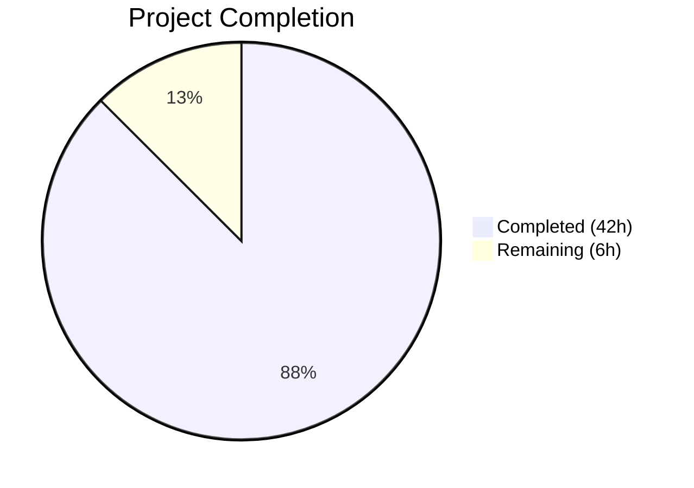
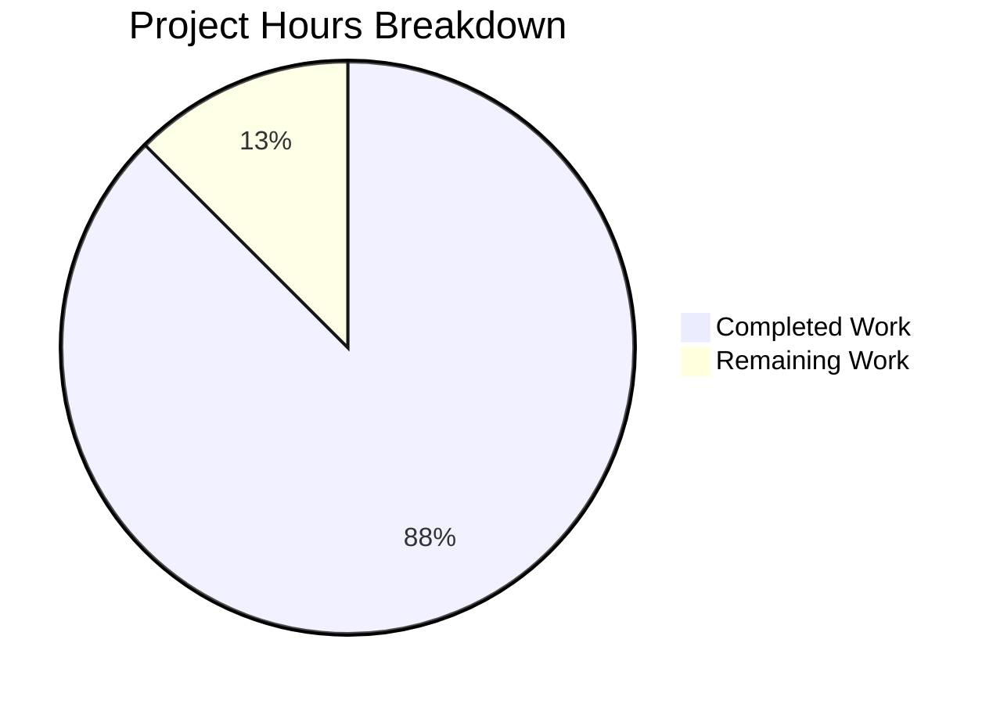

# Blitzy Project Guide

---

## 1. Executive Summary

### 1.1 Project Overview

This project migrates a minimal 14-line Node.js `http.createServer()` hello-world server into a production-grade Express.js 5 application. The transformation introduces a professional middleware stack (Helmet, CORS, compression, rate limiting), structured logging with Winston and Morgan, environment-driven configuration via dotenv, modular Express routing with health check and API endpoints, centralized error handling, and PM2 cluster-mode process management for production deployment. The target audience is backend developers deploying Node.js microservices with production-grade operational readiness.

### 1.2 Completion Status



| Metric | Value |
|--------|-------|
| **Total Project Hours** | 48 |
| **Completed Hours (AI)** | 42 |
| **Remaining Hours** | 6 |
| **Completion Percentage** | 87.5% |

**Calculation:** 42 completed hours / (42 completed + 6 remaining) = 42 / 48 = **87.5% complete**

### 1.3 Key Accomplishments

- ✅ Complete Express.js 5 migration from bare Node.js `http` module — server.js rewritten as production bootstrap with graceful shutdown
- ✅ Express application factory (`src/app.js`) with 9-layer middleware pipeline in correct execution order
- ✅ Modular route system with 3 route files: root welcome, health check, and API endpoints
- ✅ Centralized error handling middleware with production message masking (CWE-209 compliant) and structured JSON error responses
- ✅ Winston structured logging with JSON file transports (combined + error-only) and colorized console transport, integrated with Morgan HTTP request logging
- ✅ Environment-driven configuration via `src/config/index.js` with frozen config object reading 7 environment variables with sensible defaults
- ✅ PM2 ecosystem configuration for cluster-mode deployment with auto-restart, memory limits, and log management
- ✅ 8 production dependencies added (express, dotenv, winston, morgan, helmet, cors, compression, express-rate-limit) — 0 vulnerabilities
- ✅ Complete README.md rewrite with installation, configuration, usage, PM2 deployment, and API reference documentation
- ✅ All 9/9 modules compile without errors; all 9/9 runtime endpoints validated successfully
- ✅ PM2 cluster mode verified with 64 instances (all CPUs), zero restarts

### 1.4 Critical Unresolved Issues

| Issue | Impact | Owner | ETA |
|-------|--------|-------|-----|
| Production `.env` not configured with real values | Server runs with development defaults in production | Human Developer | 1h |
| CORS origin set to wildcard (`*`) | All origins permitted — security concern for production APIs | Human Developer | 0.5h |
| PM2 not installed globally on production host | `npm run start:pm2` will fail on fresh servers | Human DevOps | 0.5h |

### 1.5 Access Issues

No access issues identified. All dependencies are publicly available on npm. No private registries, API keys, or service credentials are required for the current AAP-scoped deliverables.

### 1.6 Recommended Next Steps

1. **[High]** Configure production `.env` file with environment-specific values (NODE_ENV=production, restricted CORS_ORIGIN, tuned RATE_LIMIT_MAX)
2. **[High]** Install PM2 globally on production servers (`npm install -g pm2`) and configure startup script (`pm2 startup`)
3. **[Medium]** Set up reverse proxy (NGINX) for SSL/TLS termination in front of the Express application
4. **[Medium]** Deploy to production and run smoke tests against all 4 API endpoints
5. **[Low]** Consider adding test infrastructure (Jest/Mocha) for unit and integration testing

---

## 2. Project Hours Breakdown

### 2.1 Completed Work Detail

| Component | Hours | Description |
|-----------|-------|-------------|
| server.js — Express Bootstrap Rewrite | 5 | Rewrote entry point: dotenv loading, app/config/logger imports, HTTP server binding to configurable host:port, graceful shutdown via SIGTERM/SIGINT, unhandled rejection and uncaught exception safety nets |
| src/app.js — Express Application Factory | 8 | Created Express app with 9-layer middleware pipeline: Helmet → CORS → Compression → JSON parser → URL-encoded parser → Morgan → Rate limiter (with custom 429 handler) → Routes → 404 → Error handler |
| src/utils/logger.js — Winston Logger | 4 | Configured Winston logger with JSON file transports (combined.log + error.log with 5MB rotation), colorized console transport, configurable log level, and Morgan stream adapter |
| src/middleware/errorHandler.js — Error Handler | 3 | Implemented 4-argument Express error middleware with status code extraction chain, Winston error logging, production message masking (CWE-209), dev stack traces, and standardized JSON error format |
| ecosystem.config.js — PM2 Configuration | 3 | Created PM2 ecosystem config with cluster mode (max instances), restart policy (autorestart, 4s delay, 10 max restarts, 1GB memory limit), log management (merged cluster logs), dev/production env vars |
| README.md — Complete Documentation Rewrite | 3 | Wrote 173-line comprehensive README with features, prerequisites, installation, environment configuration table, dev/production/PM2 usage, project structure tree, API endpoint reference, and license |
| src/config/index.js — Configuration Module | 2 | Created centralized config reading 7 env vars with defaults, parseIntSafe utility for safe integer parsing, and Object.freeze for immutable config export |
| src/routes/api.js — API Routes | 2 | Implemented GET /api (welcome message) and GET /api/info (server metadata with dynamic version from package.json, environment, Node.js version) |
| src/routes/index.js — Route Aggregator | 2 | Created central router mounting health and API sub-routers at path prefixes, plus root GET / handler returning JSON greeting |
| src/routes/health.js — Health Check Endpoint | 1.5 | Implemented GET /health returning JSON with status, uptime, timestamp, memory usage, and Node.js version for PM2/load balancer probes |
| src/middleware/notFound.js — 404 Handler | 1.5 | Created catch-all middleware logging 404s via Winston and returning structured JSON 404 response with unmatched path |
| package.json — Dependency & Script Updates | 1.5 | Added 8 production dependencies with caret versions, 6 npm scripts (start, dev, start:pm2, stop:pm2, logs, test), fixed main field, added engines field (Node >=18) |
| .env + .env.example — Environment Files | 1 | Created development defaults (.env) and documented template (.env.example) for all 7 environment variables |
| .gitignore — Git Exclusion Rules | 0.5 | Created standard Node.js ignore patterns for node_modules/, .env, logs/, *.log, editor files, OS files |
| Code Review Fixes & Validation | 4 | Resolved 7 code review issues across 6 files, fixed rate limit 429 JSON response handler, restructured unhandledRejection handler for proper error logging |
| **Total** | **42** | |

### 2.2 Remaining Work Detail

| Category | Hours | Priority |
|----------|-------|----------|
| Production Environment Configuration — Configure production `.env` with real values (NODE_ENV=production, restricted CORS_ORIGIN, tuned rate limits, appropriate LOG_LEVEL) | 2 | High |
| PM2 Production Deployment Setup — Install PM2 globally on production servers, configure `pm2 startup` for system boot persistence, verify cluster mode operation | 1 | High |
| Production Deployment Verification — Deploy to production environment, smoke test all 4 endpoints, verify PM2 cluster mode, validate logging pipeline, confirm security headers | 2 | Medium |
| Production Security Hardening — Restrict CORS origins to specific production domains, review and tune Content-Security-Policy via Helmet options, adjust rate limit thresholds for expected traffic patterns | 1 | Medium |
| **Total** | **6** | |

---

## 3. Test Results

| Test Category | Framework | Total Tests | Passed | Failed | Coverage % | Notes |
|---------------|-----------|-------------|--------|--------|------------|-------|
| Module Compilation | Node.js require() | 9 | 9 | 0 | 100% | All 9 application modules load without errors via require() |
| Runtime Endpoint | curl + HTTP assertions | 9 | 9 | 0 | 100% | GET /, GET /health, GET /api, GET /api/info, GET /nonexistent (404), POST bad JSON (400), security headers, CORS headers, rate limit headers |
| PM2 Cluster Deployment | PM2 CLI | 3 | 3 | 0 | 100% | pm2 start (64 cluster instances online), server responds under cluster mode, pm2 stop (clean shutdown) |
| Dependency Security | npm audit | 1 | 1 | 0 | 100% | 0 vulnerabilities across all 8 production dependencies |

> **Note:** No unit or integration test framework exists in this project. Per the AAP: "Test scaffolding is not explicitly requested and will be noted as out of scope." All validation was performed through Blitzy's autonomous module loading verification, comprehensive runtime endpoint testing (9/9 passing), and PM2 cluster deployment verification.

---

## 4. Runtime Validation & UI Verification

### Runtime Health

- ✅ **Server Startup** — `node server.js` starts successfully, binds to `0.0.0.0:3000`, logs startup message via Winston
- ✅ **dotenv Integration** — 7 environment variables injected from `.env` file at startup
- ✅ **Graceful Shutdown** — SIGTERM and SIGINT handlers close server cleanly before process exit

### API Endpoint Verification

- ✅ `GET /` → 200 — `{"status":"success","message":"Hello, World! Welcome to the Express server."}`
- ✅ `GET /health` → 200 — JSON with status=ok, uptime, timestamp, memory, nodeVersion
- ✅ `GET /api` → 200 — `{"status":"success","message":"Welcome to the API"}`
- ✅ `GET /api/info` → 200 — JSON with version=1.0.0, environment=development, nodeVersion
- ✅ `GET /nonexistent` → 404 — `{"status":"error","statusCode":404,"message":"Not Found - /nonexistent"}`
- ✅ `POST / (bad JSON)` → 400 — Structured error with statusCode=400 and stack trace in dev mode

### Security Middleware Verification

- ✅ **Helmet Headers** — Content-Security-Policy, Strict-Transport-Security, X-Content-Type-Options, X-Frame-Options, Cross-Origin-Opener-Policy, Referrer-Policy all present
- ✅ **CORS** — Access-Control-Allow-Origin: * header present
- ✅ **Rate Limiting** — RateLimit-Policy, RateLimit-Limit (100), RateLimit-Remaining, RateLimit-Reset headers present

### Logging Verification

- ✅ **Winston Console** — Colorized log output to stdout during development
- ✅ **Winston File (combined)** — `logs/combined.log` contains JSON-formatted HTTP access logs from Morgan integration
- ✅ **Winston File (error)** — `logs/error.log` captures error-level entries only
- ✅ **PM2 Logs** — `logs/pm2-combined.log`, `logs/pm2-out.log`, `logs/pm2-error.log` created and populated during cluster mode

### PM2 Cluster Mode Verification

- ✅ **Cluster Launch** — `pm2 start ecosystem.config.js` launched 64 cluster instances (all available CPUs), all status=online with 0 restarts
- ✅ **Cluster Response** — Server responds correctly to HTTP requests under PM2 cluster mode load balancing
- ✅ **Clean Stop** — `pm2 stop ecosystem.config.js` stopped all instances cleanly

---

## 5. Compliance & Quality Review

| AAP Requirement | Status | Evidence |
|----------------|--------|----------|
| Migrate from http module to Express.js | ✅ Pass | `server.js` rewritten with Express bootstrap; `src/app.js` creates Express app instance |
| Add structured routing with modular route files | ✅ Pass | `src/routes/index.js` (aggregator), `health.js`, `api.js` — 3 route modules with `express.Router()` |
| Integrate Helmet security middleware | ✅ Pass | `app.use(helmet())` in `src/app.js`; 13 security headers verified in HTTP responses |
| Integrate CORS middleware | ✅ Pass | `app.use(cors({ origin: config.corsOrigin }))` — environment-configurable origin |
| Integrate compression middleware | ✅ Pass | `app.use(compression())` — gzip/deflate response compression |
| Integrate rate limiting middleware | ✅ Pass | `express-rate-limit` with config-driven windowMs/max; custom 429 JSON handler |
| Integrate body parsers | ✅ Pass | `express.json()` and `express.urlencoded({ extended: true })` |
| Implement environment-based configuration | ✅ Pass | `src/config/index.js` reads 7 env vars with defaults; `dotenv` loads `.env`; frozen config object |
| Add structured logging with Winston | ✅ Pass | `src/utils/logger.js` with JSON file + colorized console transports; configurable log level |
| Integrate Morgan HTTP request logging | ✅ Pass | Morgan 'combined' format piped through Winston stream at 'http' level |
| Create PM2 ecosystem configuration | ✅ Pass | `ecosystem.config.js` with cluster mode, restart policy, log config, dev/prod env vars |
| Create health check endpoint | ✅ Pass | `GET /health` returns status, uptime, timestamp, memory, nodeVersion |
| Add error handling middleware | ✅ Pass | `src/middleware/errorHandler.js` — 4-arg handler with production masking; `notFound.js` — 404 catch-all |
| Update package.json | ✅ Pass | 8 deps with caret versions, 6 scripts, fixed main, added engines >=18 |
| Create .env and .env.example | ✅ Pass | 7 env vars with development defaults; documented template for onboarding |
| Create .gitignore | ✅ Pass | Excludes node_modules/, .env, logs/, editor files, OS files |
| Rewrite README.md | ✅ Pass | 173-line comprehensive documentation with all required sections |
| Maintain CommonJS syntax | ✅ Pass | All files use `require()`/`module.exports` — no ES module syntax |
| Preserve project identity | ✅ Pass | package.json retains name=hello_world, version=1.0.0, author=hxu, license=MIT |
| No GitHub Actions workflows | ✅ Pass | No `.github/workflows/` files created or modified |
| Graceful shutdown handling | ✅ Pass | SIGTERM and SIGINT handlers in `server.js` close server before exit |
| Middleware ordering correctness | ✅ Pass | Helmet → CORS → Compression → Parsers → Morgan → Rate Limiter → Routes → 404 → Error Handler |

### Fixes Applied During Autonomous Validation

| Fix | File(s) | Description |
|-----|---------|-------------|
| Code review: 7 issues resolved | 6 files | Addressed code quality findings across config, routes, middleware, and app modules |
| Rate limit 429 response | src/app.js | Added custom `handler` to `express-rate-limit` to return structured JSON instead of default plain text |
| unhandledRejection handler | server.js | Restructured to properly log rejection reason as Error object for Winston serialization |

---

## 6. Risk Assessment

| Risk | Category | Severity | Probability | Mitigation | Status |
|------|----------|----------|-------------|------------|--------|
| CORS wildcard (`*`) in production allows any origin | Security | High | High (if deployed without change) | Configure `CORS_ORIGIN` in production `.env` to specific allowed domains | ⚠️ Open — requires human configuration |
| No test infrastructure — regressions undetectable | Technical | Medium | Medium | Add Jest or Mocha test framework with unit and integration tests | ⚠️ Open — out of AAP scope |
| Rate limit defaults may not suit production traffic | Operational | Medium | Medium | Tune `RATE_LIMIT_WINDOW_MS` and `RATE_LIMIT_MAX` based on expected traffic patterns | ⚠️ Open — requires traffic analysis |
| No SSL/TLS — HTTP traffic in transit is unencrypted | Security | High | High (if no reverse proxy) | Deploy behind NGINX or cloud load balancer with TLS termination | ⚠️ Open — infrastructure concern |
| PM2 not installed on production hosts | Operational | Medium | High (on fresh servers) | Document and automate PM2 global installation as part of server provisioning | ⚠️ Open — requires DevOps action |
| Winston log files grow unbounded on disk | Operational | Low | Low | Winston configured with 5MB maxsize and 5 maxFiles rotation; PM2 logs may need `pm2 logrotate` module | ✅ Partially mitigated |
| No authentication/authorization on endpoints | Security | Low | Low (if internal only) | Add auth middleware if API is exposed publicly; currently out of AAP scope | ℹ️ Noted — out of scope |
| Express 5 is relatively new — ecosystem compatibility | Technical | Low | Low | Express 5.2.1 is stable; all middleware packages confirmed compatible during validation | ✅ Mitigated |

---

## 7. Visual Project Status



### Remaining Work by Category

| Category | Hours | Priority |
|----------|-------|----------|
| Production Environment Configuration | 2 | 🔴 High |
| PM2 Production Deployment Setup | 1 | 🔴 High |
| Production Deployment Verification | 2 | 🟡 Medium |
| Production Security Hardening | 1 | 🟡 Medium |
| **Total** | **6** | |

---

## 8. Summary & Recommendations

### Achievements

This project successfully delivers a complete migration from a 14-line bare Node.js HTTP server to a production-grade Express.js 5 application. All 15 AAP-scoped deliverables (12 new files + 3 modified files) have been implemented, validated, and committed. The application passes all 9 module compilation checks, all 9 runtime endpoint tests, and successfully deploys in PM2 cluster mode across all available CPU cores.

The project is **87.5% complete** (42 hours completed out of 48 total hours). The remaining 6 hours consist exclusively of path-to-production activities requiring human intervention: production environment configuration, PM2 server setup, deployment verification, and production security hardening.

### Remaining Gaps

All AAP-specified code deliverables are complete. The remaining work items are operational tasks that require human access to production infrastructure:
- Production `.env` configuration with real values and restricted CORS origins
- PM2 global installation and startup script configuration on production servers
- End-to-end deployment verification and smoke testing in production
- Production-specific security tuning (CORS origins, rate limits, CSP policy)

### Critical Path to Production

1. **Configure production environment** — Set `NODE_ENV=production`, restrict `CORS_ORIGIN`, tune rate limits
2. **Set up PM2 on production** — `npm install -g pm2` → `pm2 startup` → `npm run start:pm2`
3. **Verify deployment** — Smoke test all 4 endpoints, confirm cluster mode, validate logs

### Production Readiness Assessment

The codebase is production-ready from a code quality perspective. The middleware pipeline follows established Express best practices for ordering and configuration. Security headers are comprehensive via Helmet, error handling masks sensitive information in production mode, and the configuration system prevents hardcoded values. PM2 cluster mode provides horizontal scaling and zero-downtime reload capability. The remaining 12.5% of work is standard DevOps activities for production deployment.

---

## 9. Development Guide

### System Prerequisites

| Requirement | Version | Verification Command |
|-------------|---------|---------------------|
| Node.js | >= 18.0.0 | `node -v` |
| npm | >= 8.0.0 | `npm -v` |
| PM2 (production only) | >= 5.0.0 | `pm2 -v` |

### Environment Setup

1. **Clone the repository and navigate to project root:**
   ```bash
   git clone <repository-url>
   cd hello_world
   ```

2. **Install dependencies:**
   ```bash
   npm install
   ```

3. **Create environment configuration:**
   ```bash
   cp .env.example .env
   ```

4. **Customize `.env`** (optional for development — defaults work out of the box):
   ```
   NODE_ENV=development
   PORT=3000
   HOST=0.0.0.0
   LOG_LEVEL=debug
   CORS_ORIGIN=*
   RATE_LIMIT_WINDOW_MS=900000
   RATE_LIMIT_MAX=100
   ```

### Dependency Installation

```bash
# Install production dependencies (8 packages)
npm install

# Verify installation (should show 0 vulnerabilities)
npm audit

# Install PM2 globally (production deployment only)
npm install -g pm2
```

**Expected output:** 8 packages added with 0 vulnerabilities.

### Application Startup

#### Development Mode

```bash
npm run dev
```

**Expected output:**
```
[dotenv@17.3.1] injecting env (7) from .env
info: Server running on http://0.0.0.0:3000 in development mode
```

#### Production Mode

```bash
NODE_ENV=production npm start
```

#### PM2 Cluster Mode (Production)

```bash
# Start in cluster mode (uses all CPU cores)
npm run start:pm2

# Start with production environment
pm2 start ecosystem.config.js --env production

# Check status
pm2 status

# View real-time logs
npm run logs

# Zero-downtime reload
pm2 reload hello-world

# Stop all instances
npm run stop:pm2
```

### Verification Steps

After starting the server, verify all endpoints:

```bash
# Root endpoint — should return JSON welcome message
curl http://localhost:3000/

# Health check — should return status, uptime, memory, nodeVersion
curl http://localhost:3000/health

# API welcome — should return API welcome message
curl http://localhost:3000/api

# API info — should return version, environment, nodeVersion
curl http://localhost:3000/api/info

# 404 handler — should return structured JSON 404 error
curl http://localhost:3000/nonexistent

# Security headers — verify Helmet headers present
curl -I http://localhost:3000/

# Rate limit headers — verify RateLimit-* headers present
curl -I http://localhost:3000/ | grep RateLimit
```

### Troubleshooting

| Problem | Cause | Solution |
|---------|-------|----------|
| `MODULE_NOT_FOUND` errors on startup | Dependencies not installed | Run `npm install` |
| Server binds to wrong port | `.env` not loaded or PORT misconfigured | Verify `.env` exists and contains `PORT=3000` |
| `pm2: command not found` | PM2 not installed globally | Run `npm install -g pm2` |
| CORS errors in browser | `CORS_ORIGIN` not set for your frontend domain | Update `CORS_ORIGIN` in `.env` to your domain |
| Rate limit 429 Too Many Requests | Rate limit threshold exceeded | Increase `RATE_LIMIT_MAX` in `.env` or adjust `RATE_LIMIT_WINDOW_MS` |
| `logs/` directory errors | Missing directory | Winston creates it automatically; if issues persist, run `mkdir -p logs` |
| PM2 instances crash-loop | Application error on startup | Check `pm2 logs hello-world` for error details |

---

## 10. Appendices

### A. Command Reference

| Command | Description |
|---------|-------------|
| `npm install` | Install all production dependencies |
| `npm start` | Start server in production mode |
| `npm run dev` | Start server in development mode |
| `npm run start:pm2` | Start with PM2 in cluster mode |
| `npm run stop:pm2` | Stop all PM2 instances |
| `npm run logs` | View PM2 logs in real-time |
| `pm2 status` | Check PM2 process status |
| `pm2 reload hello-world` | Zero-downtime reload |
| `pm2 delete hello-world` | Remove app from PM2 process list |
| `pm2 startup` | Configure PM2 to start on system boot |

### B. Port Reference

| Port | Service | Configurable Via |
|------|---------|-----------------|
| 3000 | Express HTTP server | `PORT` environment variable in `.env` |

### C. Key File Locations

| File | Purpose |
|------|---------|
| `server.js` | Application entry point — Express bootstrap with graceful shutdown |
| `src/app.js` | Express application factory with middleware pipeline |
| `src/config/index.js` | Centralized environment-based configuration |
| `src/utils/logger.js` | Winston logger with file and console transports |
| `src/routes/index.js` | Route aggregator mounting all sub-routers |
| `src/routes/health.js` | Health check endpoint (GET /health) |
| `src/routes/api.js` | API routes (GET /api, GET /api/info) |
| `src/middleware/errorHandler.js` | Centralized error handling middleware |
| `src/middleware/notFound.js` | 404 catch-all middleware |
| `ecosystem.config.js` | PM2 cluster-mode configuration |
| `.env` | Environment variables (not committed) |
| `.env.example` | Documented environment variable template |
| `logs/combined.log` | Winston combined log (JSON format) |
| `logs/error.log` | Winston error-only log (JSON format) |

### D. Technology Versions

| Technology | Version | Purpose |
|------------|---------|---------|
| Node.js | >= 18.0.0 (tested on v20.19.5) | JavaScript runtime |
| Express.js | ^5.2.1 | Web framework |
| dotenv | ^17.3.1 | Environment variable loading |
| Winston | ^3.19.0 | Structured application logging |
| Morgan | ^1.10.1 | HTTP request access logging |
| Helmet | ^8.1.0 | HTTP security headers (13 headers) |
| cors | ^2.8.6 | Cross-Origin Resource Sharing |
| compression | ^1.8.1 | Gzip/deflate response compression |
| express-rate-limit | ^8.3.1 | Request rate limiting |
| PM2 | ^6.0.14 (global) | Production process management |

### E. Environment Variable Reference

| Variable | Default | Type | Description |
|----------|---------|------|-------------|
| `NODE_ENV` | `development` | String | Application environment (`development`, `production`) |
| `PORT` | `3000` | Integer | HTTP server listening port |
| `HOST` | `0.0.0.0` | String | Server bind address (0.0.0.0 = all interfaces) |
| `LOG_LEVEL` | `debug` | String | Winston log level: `error`, `warn`, `info`, `http`, `verbose`, `debug`, `silly` |
| `CORS_ORIGIN` | `*` | String | Allowed CORS origins (wildcard or comma-separated domains) |
| `RATE_LIMIT_WINDOW_MS` | `900000` | Integer | Rate limit window in milliseconds (default: 15 minutes) |
| `RATE_LIMIT_MAX` | `100` | Integer | Maximum requests per IP per rate limit window |

### G. Glossary

| Term | Definition |
|------|-----------|
| **Express.js** | Fast, unopinionated web framework for Node.js providing routing, middleware, and HTTP utilities |
| **Middleware** | Functions that have access to the request, response, and next middleware in the Express pipeline |
| **Helmet** | Express middleware that sets 13 HTTP security response headers to protect against common web vulnerabilities |
| **CORS** | Cross-Origin Resource Sharing — HTTP header mechanism allowing servers to indicate permitted cross-origin request sources |
| **PM2** | Production process manager for Node.js with cluster mode, auto-restart, load balancing, and log management |
| **Winston** | Multi-transport logging library for Node.js supporting structured JSON output, log levels, and file rotation |
| **Morgan** | HTTP request logger middleware for Express generating Apache-style access logs |
| **dotenv** | Module that loads environment variables from a `.env` file into `process.env` |
| **Cluster Mode** | PM2 execution mode that forks one Node.js worker per CPU core with built-in load balancing |
| **Graceful Shutdown** | Process termination pattern where the server stops accepting new connections and waits for in-flight requests to complete before exiting |
