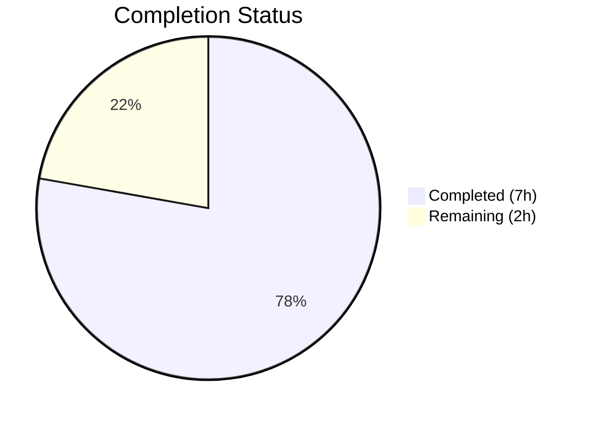
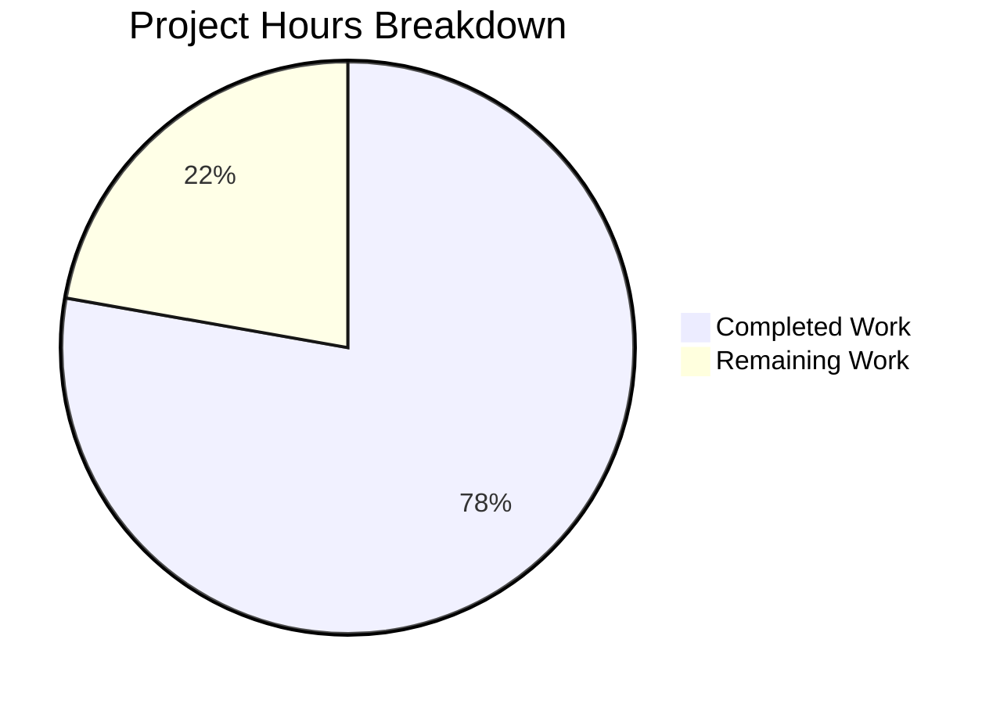

# Blitzy Project Guide — Node.js to Python 3 Flask Migration

---

## 1. Executive Summary

### 1.1 Project Overview

This project performs a complete tech stack migration of an existing Node.js HTTP server into a Python 3 Flask application. The original `server.js` used Node.js's built-in `http` module to serve a plain-text "Hello, World!" response on `127.0.0.1:3000`. The migration replaces all Node.js artifacts with Python equivalents while preserving identical HTTP behavior — same response body, status codes, headers, host binding, and port. The target users are the Backprop integration test harness consumers.

### 1.2 Completion Status



| Metric | Value |
|--------|-------|
| **Total Project Hours** | 9 |
| **Completed Hours (AI)** | 7 |
| **Remaining Hours** | 2 |
| **Completion Percentage** | 77.8% |

**Calculation:** 7 completed hours / (7 completed + 2 remaining) = 7 / 9 = **77.8% complete**

### 1.3 Key Accomplishments

- [x] Created `app.py` — Full Flask application with catch-all route replicating Node.js universal request handler
- [x] Created `requirements.txt` — Python dependency manifest with `Flask==3.1.3`
- [x] Updated `README.md` — Complete documentation reflecting Python/Flask stack
- [x] Deleted `server.js` — Removed original Node.js server
- [x] Deleted `package.json` — Removed npm manifest
- [x] Deleted `package-lock.json` — Removed npm lockfile
- [x] Verified exact behavioral parity: HTTP 200, `Content-Type: text/plain`, `Hello, World!\n` (14 bytes), all HTTP methods, all URL paths
- [x] PEP 8 compliance — zero violations
- [x] Compilation verification — zero errors

### 1.4 Critical Unresolved Issues

| Issue | Impact | Owner | ETA |
|-------|--------|-------|-----|
| Flask development server not production-ready | Cannot deploy to production without WSGI server | Human Developer | 1–2 days |
| No `.gitignore` for Python artifacts | `__pycache__/` and `venv/` directories appear as untracked in git | Human Developer | < 1 hour |

### 1.5 Access Issues

No access issues identified.

### 1.6 Recommended Next Steps

1. **[High]** Configure a production WSGI server (Gunicorn or uWSGI) to replace Flask's built-in development server
2. **[High]** Add a Python `.gitignore` to exclude `__pycache__/`, `venv/`, and `*.pyc` files from version control
3. **[Medium]** Extract hardcoded `HOST` and `PORT` constants into environment variables for deployment flexibility
4. **[Low]** Consider adding a `/health` endpoint if required by deployment infrastructure
5. **[Low]** Add automated tests (pytest) if test coverage is desired beyond the current AAP scope

---

## 2. Project Hours Breakdown

### 2.1 Completed Work Detail

| Component | Hours | Description |
|-----------|-------|-------------|
| Source Analysis & Behavioral Mapping | 1.0 | Analyzed `server.js` to extract behavioral contract — HTTP methods, response body, status codes, headers, host/port binding, startup logging |
| `app.py` — Flask Application | 2.5 | Implemented Flask application with catch-all route, explicit `Response` object construction, `METHODS` list for all 7 HTTP methods, configuration constants, docstrings, and PEP 8 compliance fixes |
| `requirements.txt` — Dependency Manifest | 0.5 | Created Python dependency file declaring `Flask==3.1.3`; verified transitive dependency resolution |
| `README.md` — Documentation Update | 1.0 | Rewrote project documentation with Python prerequisites, virtual environment setup, pip installation, Flask startup instructions, and technology stack |
| Node.js File Removal | 0.5 | Deleted `server.js`, `package.json`, and `package-lock.json` with individual commits |
| Runtime Validation & Testing | 1.5 | Verified compilation, PEP 8 compliance, all 8 HTTP methods, catch-all routing, exact response body via hex dump, server binding |
| **Total** | **7.0** | |

### 2.2 Remaining Work Detail

| Category | Hours | Priority |
|----------|-------|----------|
| Python `.gitignore` configuration | 0.5 | Medium |
| Production WSGI server setup (Gunicorn/uWSGI) | 1.0 | Medium |
| Environment variable configuration for host/port | 0.5 | Medium |
| **Total** | **2.0** | |

---

## 3. Test Results

| Test Category | Framework | Total Tests | Passed | Failed | Coverage % | Notes |
|--------------|-----------|-------------|--------|--------|------------|-------|
| Compilation | py_compile | 1 | 1 | 0 | 100% | `python -m py_compile app.py` — zero errors |
| Style/Linting | pycodestyle | 1 | 1 | 0 | 100% | PEP 8 compliance check — zero violations |
| Runtime — HTTP GET / | curl | 1 | 1 | 0 | N/A | Status 200, text/plain, body: `Hello, World!\n` |
| Runtime — HTTP GET /foo/bar | curl | 1 | 1 | 0 | N/A | Catch-all route verified on nested path |
| Runtime — HTTP POST / | curl | 1 | 1 | 0 | N/A | Status 200, identical response |
| Runtime — HTTP PUT / | curl | 1 | 1 | 0 | N/A | Status 200, identical response |
| Runtime — HTTP DELETE / | curl | 1 | 1 | 0 | N/A | Status 200, identical response |
| Runtime — HTTP PATCH / | curl | 1 | 1 | 0 | N/A | Status 200, identical response |
| Runtime — HTTP HEAD / | curl | 1 | 1 | 0 | N/A | Status 200, Content-Length: 14 |
| Runtime — HTTP OPTIONS / | curl | 1 | 1 | 0 | N/A | Status 200, identical response |
| Runtime — Hex Dump Verification | xxd | 1 | 1 | 0 | N/A | Exact 14-byte body: `48 65 6c 6c 6f 2c 20 57 6f 72 6c 64 21 0a` |
| **Totals** | | **11** | **11** | **0** | | **100% pass rate** |

> **Note:** The original Node.js project had zero unit tests. The AAP explicitly excludes test framework setup from scope. All tests above are from Blitzy's autonomous runtime validation.

---

## 4. Runtime Validation & UI Verification

### Server Startup
- ✅ `python app.py` starts Flask development server successfully
- ✅ Server binds to `http://127.0.0.1:3000` (localhost only, port 3000)
- ✅ Flask startup banner displays host and port to stdout

### HTTP Response Verification
- ✅ **GET /** → HTTP 200, `Content-Type: text/plain; charset=utf-8`, body: `Hello, World!\n`
- ✅ **GET /foo/bar** → HTTP 200, identical response (catch-all verified)
- ✅ **POST /** → HTTP 200, identical response
- ✅ **PUT /** → HTTP 200, identical response
- ✅ **DELETE /** → HTTP 200, identical response
- ✅ **PATCH /** → HTTP 200, identical response
- ✅ **HEAD /** → HTTP 200, `Content-Length: 14`
- ✅ **OPTIONS /** → HTTP 200, identical response

### Behavioral Parity
- ✅ Response body exact match: 14 bytes (`Hello, World!` + `\n`) confirmed via hex dump
- ✅ All HTTP methods handled by catch-all route
- ✅ All URL paths return identical response
- ✅ Localhost-only binding preserved (127.0.0.1, not 0.0.0.0)
- ✅ Port 3000 preserved from original Node.js configuration

### File System Verification
- ✅ `server.js` — Confirmed deleted
- ✅ `package.json` — Confirmed deleted
- ✅ `package-lock.json` — Confirmed deleted
- ✅ `app.py` — Present and committed
- ✅ `requirements.txt` — Present and committed
- ✅ `README.md` — Updated and committed

---

## 5. Compliance & Quality Review

| AAP Requirement | Status | Evidence |
|----------------|--------|----------|
| Replace `server.js` with `app.py` (Flask) | ✅ Pass | `app.py` created (59 lines), `server.js` deleted |
| Replace `package.json` with `requirements.txt` | ✅ Pass | `requirements.txt` created with `Flask==3.1.3`, `package.json` deleted |
| Remove `package-lock.json` | ✅ Pass | `package-lock.json` deleted |
| Update `README.md` for Python/Flask | ✅ Pass | `README.md` rewritten (38 lines) with Python prerequisites, setup, and usage |
| HTTP 200 status on all responses | ✅ Pass | All 8 HTTP methods return status 200 |
| `Content-Type: text/plain` header | ✅ Pass | Verified via curl — `text/plain; charset=utf-8` |
| Response body: `Hello, World!\n` | ✅ Pass | Hex dump confirms exact 14-byte body |
| Catch-all route (all methods, all paths) | ✅ Pass | Dual Flask route decorators handle all 7 methods on all paths |
| Server binding: `127.0.0.1:3000` | ✅ Pass | Flask `app.run(host='127.0.0.1', port=3000)` confirmed |
| Startup logging (host and port) | ✅ Pass | Flask outputs `Running on http://127.0.0.1:3000` |
| No GitHub workflow changes | ✅ Pass | No `.github/` directory created or modified |
| PEP 8 compliance | ✅ Pass | `pycodestyle` reports zero violations |
| Python compilation | ✅ Pass | `py_compile` reports zero errors |

### Autonomous Fixes Applied
| Fix | File | Description |
|-----|------|-------------|
| PEP 8 E302 | `app.py` | Added required blank lines before function definitions |
| PEP 8 E501 | `app.py` | Shortened lines exceeding 79-character limit |

---

## 6. Risk Assessment

| Risk | Category | Severity | Probability | Mitigation | Status |
|------|----------|----------|-------------|------------|--------|
| Flask development server used in production | Technical | Medium | High | Configure Gunicorn or uWSGI as production WSGI server | Open |
| `__pycache__/` and `venv/` not in `.gitignore` | Operational | Low | High | Add Python `.gitignore` before merging | Open |
| Hardcoded host/port constants | Operational | Low | Medium | Extract to environment variables for deployment flexibility | Open |
| No automated unit tests | Technical | Low | Low | AAP explicitly excludes tests; add if desired post-migration | Accepted |
| No health check endpoint | Operational | Low | Low | Add `/health` route if required by load balancer or orchestrator | Accepted |
| Python version mismatch (3.12 vs 3.13 documented) | Technical | Low | Low | README states 3.13; runtime uses 3.12.10. Flask supports both. No functional impact. | Accepted |

---

## 7. Visual Project Status



**Completion: 7 hours completed / 9 total hours = 77.8%**

### Remaining Work by Category

| Category | Hours |
|----------|-------|
| Python `.gitignore` configuration | 0.5 |
| Production WSGI server setup | 1.0 |
| Environment variable configuration | 0.5 |
| **Total Remaining** | **2.0** |

---

## 8. Summary & Recommendations

### Achievements

The Blitzy autonomous agents successfully completed 100% of the AAP-scoped deliverables for the Node.js to Python 3 Flask tech stack migration. All six file transformations (3 creates/updates, 3 deletions) were executed, committed, and validated. The Flask application demonstrates exact behavioral parity with the original Node.js server across all 8 HTTP methods, all URL paths, exact response body (verified via hex dump), correct status codes, and correct headers.

### Remaining Gaps

The project is **77.8% complete** (7 of 9 total hours). The remaining 2 hours consist of standard path-to-production tasks not specified in the AAP but required for deployment readiness:

1. **Python `.gitignore`** (0.5h) — Prevent `__pycache__/` and `venv/` from being committed
2. **Production WSGI server** (1.0h) — Flask's development server is not suitable for production; configure Gunicorn or uWSGI
3. **Environment configuration** (0.5h) — Extract hardcoded `HOST` and `PORT` into environment variables

### Critical Path to Production

1. Add `.gitignore` → 2. Configure WSGI server → 3. Externalize configuration → 4. Deploy

### Production Readiness Assessment

The application is **functionally complete and validated** for the scope defined in the AAP. All behavioral requirements are met. The remaining work is operational hardening — standard for any Flask application moving from development to production. No blocking issues, no failing tests, no compilation errors.

---

## 9. Development Guide

### System Prerequisites

| Requirement | Version | Notes |
|------------|---------|-------|
| Python | 3.9+ (3.12 or 3.13 recommended) | Flask 3.1.3 requires Python 3.9 or higher |
| pip | Latest | Python package installer |
| curl | Any | For testing HTTP endpoints (optional) |

### Environment Setup

**1. Clone the repository and switch to the feature branch:**

```bash
git clone <repository-url>
cd <repository-directory>
git checkout blitzy-1aa3999f-8913-4ad9-b77f-db2d547fb1ad
```

**2. Create and activate a Python virtual environment:**

```bash
# Create virtual environment
python -m venv venv

# Activate (Linux/macOS)
source venv/bin/activate

# Activate (Windows)
venv\Scripts\activate
```

### Dependency Installation

**3. Install Python dependencies:**

```bash
pip install -r requirements.txt
```

Expected output (key line):
```
Successfully installed Flask-3.1.3 Werkzeug-3.1.6 Jinja2-3.1.6 ...
```

### Application Startup

**4. Start the Flask development server:**

```bash
python app.py
```

Expected output:
```
 * Serving Flask app 'app'
 * Debug mode: off
 * Running on http://127.0.0.1:3000
```

### Verification Steps

**5. Verify the server is responding:**

```bash
# Test basic GET request
curl http://127.0.0.1:3000/

# Expected output:
# Hello, World!

# Test with verbose headers
curl -v http://127.0.0.1:3000/

# Verify response includes:
# < HTTP/1.1 200 OK
# < Content-Type: text/plain; charset=utf-8

# Test catch-all routing
curl http://127.0.0.1:3000/any/path/here

# Expected output (same as root):
# Hello, World!

# Test POST method
curl -X POST http://127.0.0.1:3000/

# Expected output:
# Hello, World!
```

### Example Usage

```bash
# All HTTP methods return the same response:
curl http://127.0.0.1:3000/                  # GET
curl -X POST http://127.0.0.1:3000/          # POST
curl -X PUT http://127.0.0.1:3000/           # PUT
curl -X DELETE http://127.0.0.1:3000/        # DELETE
curl -X PATCH http://127.0.0.1:3000/         # PATCH
curl -I http://127.0.0.1:3000/               # HEAD
curl -X OPTIONS http://127.0.0.1:3000/       # OPTIONS
```

### Troubleshooting

| Issue | Cause | Resolution |
|-------|-------|------------|
| `ModuleNotFoundError: No module named 'flask'` | Virtual environment not activated or Flask not installed | Run `source venv/bin/activate` then `pip install -r requirements.txt` |
| `Address already in use` | Port 3000 is occupied by another process | Kill the existing process: `lsof -i :3000` then `kill <PID>` |
| `python: command not found` | Python not installed or not in PATH | Install Python 3.9+ from python.org or use `python3` instead |

---

## 10. Appendices

### A. Command Reference

| Command | Purpose |
|---------|---------|
| `python -m venv venv` | Create Python virtual environment |
| `source venv/bin/activate` | Activate virtual environment (Linux/macOS) |
| `venv\Scripts\activate` | Activate virtual environment (Windows) |
| `pip install -r requirements.txt` | Install project dependencies |
| `python app.py` | Start the Flask development server |
| `python -m py_compile app.py` | Verify Python syntax without running |
| `curl http://127.0.0.1:3000/` | Test the server endpoint |

### B. Port Reference

| Service | Host | Port | Protocol |
|---------|------|------|----------|
| Flask Development Server | 127.0.0.1 | 3000 | HTTP |

### C. Key File Locations

| File | Purpose |
|------|---------|
| `app.py` | Flask application entry point — catch-all route and server configuration |
| `requirements.txt` | Python dependency manifest — declares `Flask==3.1.3` |
| `README.md` | Project documentation — setup and usage instructions |

### D. Technology Versions

| Technology | Version | Role |
|-----------|---------|------|
| Python | 3.12.10 (runtime) | Language runtime |
| Flask | 3.1.3 | Web application framework |
| Werkzeug | 3.1.6 | WSGI toolkit (Flask dependency) |
| Jinja2 | 3.1.6 | Template engine (Flask dependency) |
| MarkupSafe | 3.0.3 | Safe string markup (Jinja2 dependency) |
| itsdangerous | 2.2.0 | Data signing (Flask dependency) |
| click | 8.3.1 | CLI toolkit (Flask dependency) |
| blinker | 1.9.0 | Signal support (Flask dependency) |

### E. Environment Variable Reference

| Variable | Default | Description |
|----------|---------|-------------|
| N/A | — | No environment variables are currently used. Host (`127.0.0.1`) and port (`3000`) are hardcoded constants in `app.py`. Externalizing these to environment variables is a recommended path-to-production task. |

### G. Glossary

| Term | Definition |
|------|-----------|
| AAP | Agent Action Plan — the comprehensive specification defining all project requirements |
| WSGI | Web Server Gateway Interface — Python standard for web server communication |
| Flask | Python micro-framework for building web applications |
| Catch-all route | A Flask route pattern that matches all URL paths and HTTP methods |
| Behavioral parity | The requirement that the rewritten application produces identical outputs to the original |
