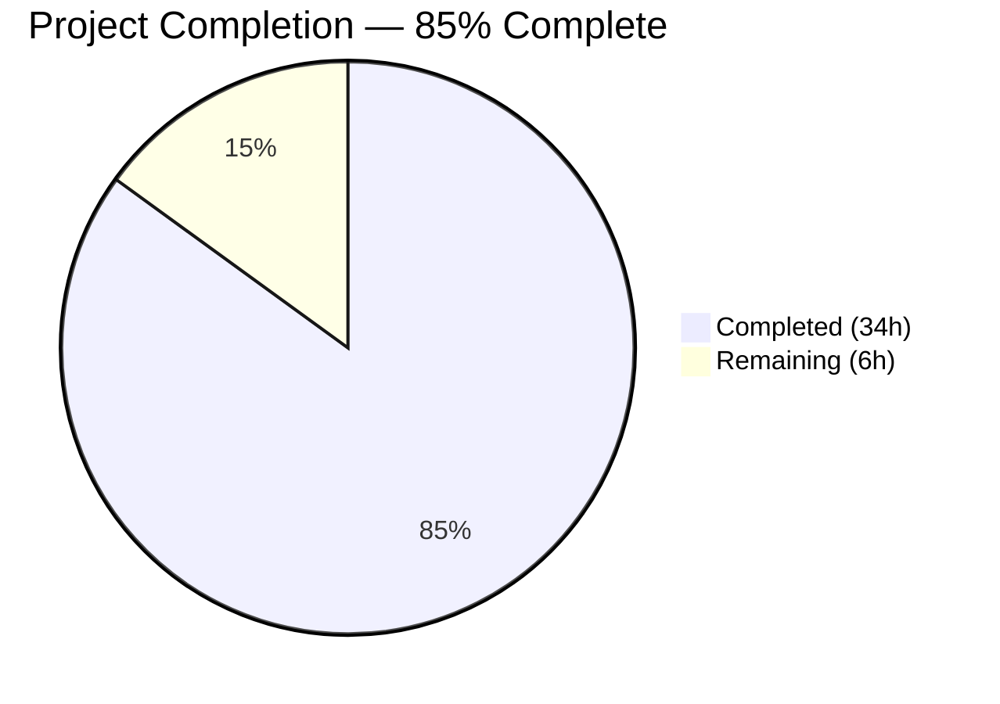
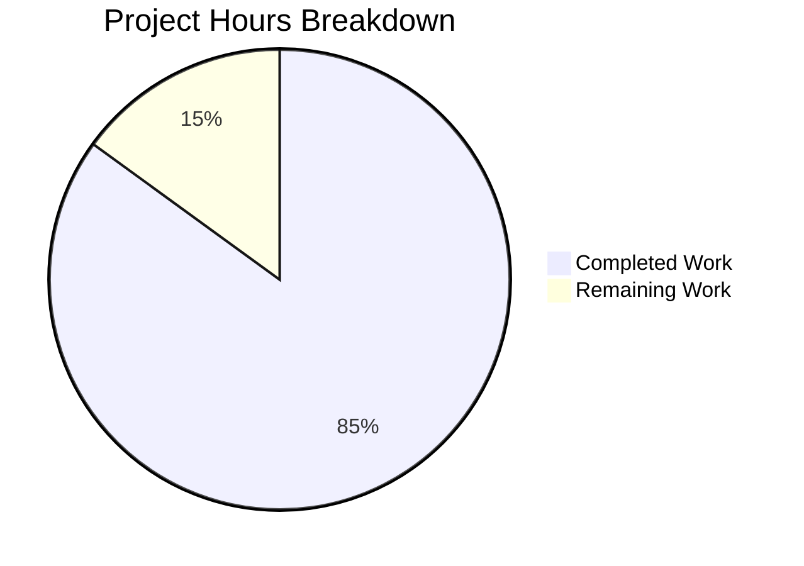

# Blitzy Project Guide

---

## 1. Executive Summary

### 1.1 Project Overview

This project transforms a minimal 14-line Node.js HTTP server into a production-ready Express.js 5.x application. The original `server.js` used Node.js's built-in `http` module with hardcoded `127.0.0.1:3000` and a single "Hello, World!" response handler. The migration introduces Express.js framework with modular routing, a comprehensive middleware pipeline (Helmet, CORS, compression, body parsing, Morgan), externalized environment configuration via dotenv, structured logging with Winston, centralized error handling, and PM2 process management for production cluster-mode deployment. The target audience is backend developers managing Node.js services requiring production-grade reliability and operational observability.

### 1.2 Completion Status



| Metric | Value |
|--------|-------|
| **Total Project Hours** | 40 |
| **Completed Hours (AI)** | 34 |
| **Remaining Hours** | 6 |
| **Completion Percentage** | 85.0% |

**Calculation:** 34 completed hours / (34 completed + 6 remaining) = 34 / 40 = **85.0%**

### 1.3 Key Accomplishments

- ✅ Migrated from raw `http.createServer()` to Express.js 5.2.1 framework with app/server separation pattern
- ✅ Implemented modular routing system with Express Router — health check (`/health`), API routes (`/api`, `/api/info`)
- ✅ Configured production middleware pipeline: Helmet → CORS → Compression → Body Parsers → Morgan → Routes → 404 → Error Handler
- ✅ Built centralized environment configuration module with dotenv integration and frozen config object
- ✅ Established structured logging with Winston (console + file transports) and Morgan HTTP request logging stream
- ✅ Created PM2 ecosystem configuration supporting cluster mode, auto-restart, memory limits, and dev/production profiles
- ✅ All 10 JavaScript source files pass syntax validation and load successfully
- ✅ All 4 HTTP endpoints verified operational with correct JSON responses and security headers
- ✅ Comprehensive README.md documentation with setup, API reference, PM2 deployment guide, and project structure
- ✅ Applied 3 validation fixes: ANSI stripping for Morgan stream, combined.log transport level correction, headersSent guard

### 1.4 Critical Unresolved Issues

| Issue | Impact | Owner | ETA |
|-------|--------|-------|-----|
| Production .env not configured | Application runs with development defaults in production | Human Developer | 1 hour |
| CORS origin set to wildcard (`*`) | Allows unrestricted cross-origin access in all environments | Human Developer | 0.5 hours |
| PM2 not globally installed for production | Cannot use PM2 CLI commands on production server | Human DevOps | 1 hour |
| 1 low-severity npm audit finding (pm2 ReDoS) | Potential denial of service via crafted input to pm2 devDependency | Human Developer | 0.5 hours |

### 1.5 Access Issues

No access issues identified. All dependencies are publicly available on npm. No private registries, API keys, or service credentials are required for the current AAP scope.

### 1.6 Recommended Next Steps

1. **[High]** Configure production environment variables — set `NODE_ENV=production`, restrict `CORS_ORIGIN` to specific trusted domains, and verify `LOG_LEVEL=info` for production
2. **[High]** Set up PM2 production deployment — install PM2 globally on production server, configure startup script with `pm2 startup`, and verify cluster mode operation
3. **[Medium]** Review npm audit findings — assess the low-severity pm2 ReDoS vulnerability and determine mitigation (pm2 is a devDependency, not used in production runtime)
4. **[Medium]** Execute production smoke tests — validate all endpoints (`/health`, `/api`, `/api/info`, 404 handler) respond correctly under `NODE_ENV=production` with sanitized error responses
5. **[Low]** Configure PM2 log rotation — set up `pm2-logrotate` module to manage log file growth in long-running production deployments

---

## 2. Project Hours Breakdown

### 2.1 Completed Work Detail

| Component | Hours | Description |
|-----------|-------|-------------|
| Express.js Framework Migration | 7.0 | Refactored `server.js` (102 lines) from raw HTTP to Express bootstrap; created `src/app.js` (112 lines) with full middleware pipeline and route mounting |
| Routing System | 4.0 | Created 3 route modules: `src/routes/index.js` (route aggregator), `src/routes/health.js` (health check endpoint), `src/routes/api.js` (API routes with Hello World migration) |
| Custom Middleware | 3.5 | Created `src/middleware/errorHandler.js` (59 lines, centralized error handling with env-aware stack traces) and `src/middleware/notFound.js` (24 lines, structured 404 responses) |
| Environment Configuration | 3.0 | Created `src/config/index.js` (57 lines, dotenv integration with frozen config object), `.env` (5 variables), and `.env.example` (28 lines with documentation) |
| Structured Logging | 4.0 | Created `src/utils/logger.js` (115 lines) with Winston console + 2 file transports, Morgan write-stream integration, programmatic logs directory creation, ANSI code stripping |
| PM2 Configuration | 3.0 | Created `ecosystem.config.js` (177 lines) with cluster mode, auto-restart, memory limits, merge_logs, dev/production environment profiles |
| Package & Dependencies | 2.0 | Updated `package.json` with 7 production deps, 2 dev deps, 6 npm scripts, engines field, corrected main field; verified all packages installed |
| Version Control Config | 0.5 | Created `.gitignore` (64 lines) covering node_modules, .env, logs, PM2, OS files, IDE files, coverage/build |
| README Documentation | 3.5 | Complete rewrite of `README.md` (209 lines) with project overview, features, prerequisites, installation, environment config table, API endpoint docs, PM2 deployment guide, project structure |
| Validation & Bug Fixes | 3.5 | Syntax validation of all 10 JS files, runtime endpoint testing, 3 bug fixes (ANSI stripping in Morgan stream, combined.log transport level change to 'http', headersSent guard in error handler) |
| **Total** | **34.0** | |

### 2.2 Remaining Work Detail

| Category | Hours | Priority |
|----------|-------|----------|
| Production Environment Configuration | 1.5 | High |
| PM2 Production Deployment Setup | 2.0 | High |
| Dependency Security Audit & Resolution | 1.0 | Medium |
| Production Smoke Testing | 1.5 | Medium |
| **Total** | **6.0** | |

### 2.3 Hours Summary

- **Completed Hours (Section 2.1):** 34.0
- **Remaining Hours (Section 2.2):** 6.0
- **Total Project Hours:** 34.0 + 6.0 = **40.0**
- **Completion:** 34.0 / 40.0 = **85.0%**

---

## 3. Test Results

| Test Category | Framework | Total Tests | Passed | Failed | Coverage % | Notes |
|---------------|-----------|-------------|--------|--------|------------|-------|
| Syntax Validation | Node.js `--check` | 10 | 10 | 0 | 100% | All 10 JS files pass syntax check |
| Module Loading | Node.js `require()` | 8 | 8 | 0 | 100% | All 8 application modules load without errors |
| Runtime Endpoint | cURL / HTTP | 4 | 4 | 0 | 100% | GET /health (200), GET /api (200), GET /api/info (200), GET /nonexistent (404) |
| Security Headers | cURL -I | 7 | 7 | 0 | 100% | CSP, HSTS, X-Frame-Options, X-Content-Type-Options, CORS, X-DNS-Prefetch-Control, Referrer-Policy verified |
| Dependency Audit | npm audit | 1 | 0 | 1 | N/A | 1 low-severity finding: pm2 ReDoS vulnerability (devDependency only) |

**Note:** No unit test framework is configured per the AAP scope (Section 0.3.2: "Unit/integration testing — No test framework, test files, or test scripts — not explicitly requested"). All testing was performed through Blitzy's autonomous syntax validation, module loading verification, and runtime endpoint testing.

---

## 4. Runtime Validation & UI Verification

### Server Startup
- ✅ `node server.js` starts successfully on `0.0.0.0:3000`
- ✅ Winston logs server startup info to console and `logs/combined.log`
- ✅ dotenv loads 5 environment variables from `.env`

### API Endpoints
- ✅ `GET /health` → 200 — Returns `{"status":"ok","uptime":...,"timestamp":"...","environment":"development"}`
- ✅ `GET /api` → 200 — Returns `{"message":"Hello, World!"}`
- ✅ `GET /api/info` → 200 — Returns `{"name":"hello_world","version":"1.0.0","description":"Production-ready Express.js web server"}`
- ✅ `GET /nonexistent` → 404 — Returns `{"status":404,"message":"Not Found","path":"/nonexistent"}`

### Security Headers
- ✅ `Content-Security-Policy: default-src 'self'; ...` (Helmet CSP)
- ✅ `Strict-Transport-Security: max-age=31536000; includeSubDomains` (HSTS)
- ✅ `X-Frame-Options: SAMEORIGIN` (Clickjacking protection)
- ✅ `X-Content-Type-Options: nosniff` (MIME sniffing prevention)
- ✅ `Access-Control-Allow-Origin: *` (CORS enabled)
- ✅ `Referrer-Policy: no-referrer` (Referrer leakage prevention)
- ✅ `X-DNS-Prefetch-Control: off` (DNS prefetch control)

### Logging Verification
- ✅ Winston console transport outputs colorized, timestamped messages
- ✅ `logs/combined.log` captures structured JSON entries at `http` level and above
- ✅ `logs/error.log` captures error-level entries only
- ✅ Morgan HTTP request logs piped through Winston stream with clean JSON (no ANSI artifacts)
- ✅ Logs directory created programmatically by `src/utils/logger.js`

### Process-Level Handlers
- ✅ `unhandledRejection` handler logs via Winston and exits with code 1
- ✅ `uncaughtException` handler logs via Winston and exits with code 1

---

## 5. Compliance & Quality Review

| AAP Requirement | Deliverable | Status | Quality Notes |
|----------------|-------------|--------|---------------|
| Express.js Framework Migration | `server.js`, `src/app.js` | ✅ Pass | Express 5.2.1 with app/server separation; all middleware in correct order |
| Modular Routing System | `src/routes/index.js`, `health.js`, `api.js` | ✅ Pass | Express Router pattern with route aggregator; 3 endpoints defined |
| Middleware Stack | Helmet, CORS, compression, Morgan, body parsing in `src/app.js` | ✅ Pass | Execution order verified: Helmet → CORS → Compression → Parsers → Morgan → Routes → 404 → ErrorHandler |
| Error Handling Middleware | `src/middleware/errorHandler.js`, `notFound.js` | ✅ Pass | 4-arg Express signature; environment-aware stack traces; headersSent guard |
| Environment Configuration | `src/config/index.js`, `.env`, `.env.example` | ✅ Pass | Object.freeze() on config; dotenv loads first; all 5 vars documented |
| Structured Logging | `src/utils/logger.js` | ✅ Pass | 3 Winston transports; Morgan stream; ANSI stripping; programmatic log dir |
| PM2 Configuration | `ecosystem.config.js` | ✅ Pass | Cluster mode, auto-restart, 1G memory limit, merged logs, dev/prod envs |
| Package.json Restructuring | `package.json` | ✅ Pass | main: server.js, 7 prod deps, 2 dev deps, 6 scripts, engines ≥18.0.0 |
| .env and .env.example | `.env`, `.env.example` | ✅ Pass | 5 variables with defaults; .env.example has inline documentation |
| .gitignore | `.gitignore` | ✅ Pass | 64 lines covering node_modules, .env, logs, PM2, OS, IDE, build |
| README.md Documentation | `README.md` | ✅ Pass | 209 lines; features, setup, env config, API docs, PM2 guide, project structure |
| Health Check Route | `src/routes/health.js` | ✅ Pass | Returns status, uptime, timestamp, environment in JSON |
| Logs Directory Strategy | `src/utils/logger.js` | ✅ Pass | `fs.mkdirSync(logDir, { recursive: true })` at module load time |
| CommonJS Convention | All source files | ✅ Pass | All files use `require()` and `module.exports`; no ES modules |
| No GitHub Workflows | Repository | ✅ Pass | No `.github/workflows/` directory created |
| Node.js ≥18 Compatibility | `package.json` engines field | ✅ Pass | Runtime v20.19.5; engines field set to `>=18.0.0` |

### Autonomous Fixes Applied During Validation

| Fix | File | Description |
|-----|------|-------------|
| ANSI stripping | `src/utils/logger.js` | Added regex to strip ANSI escape codes from Morgan stream before writing to Winston file transports |
| Transport level correction | `src/utils/logger.js` | Changed `combined.log` transport level from `info` to `http` to persist Morgan HTTP request logs |
| Code review resolutions | Multiple | Standardized 'use strict', added `headersSent` guard in error handler, documented log levels in .env.example |

---

## 6. Risk Assessment

| Risk | Category | Severity | Probability | Mitigation | Status |
|------|----------|----------|-------------|------------|--------|
| CORS wildcard (`*`) in production | Security | Medium | High | Restrict `CORS_ORIGIN` to specific trusted domains before production deployment | Open — requires human configuration |
| pm2 ReDoS vulnerability (GHSA-x5gf-qvw8-r2rm) | Security | Low | Low | pm2 is a devDependency not included in production runtime; monitor for patch release | Open — review required |
| No unit test suite | Technical | Medium | Medium | AAP explicitly excluded tests; recommend adding Jest + Supertest for regression coverage in future iteration | Accepted — per AAP scope |
| Hardcoded values in `src/routes/api.js` | Technical | Low | Low | name/version/description hardcoded instead of reading from package.json; minor maintenance risk | Accepted — per AAP design |
| Production NODE_ENV not enforced | Operational | Medium | Medium | Application defaults to `development` if NODE_ENV unset; production deployment must explicitly set NODE_ENV=production | Open — requires human configuration |
| Log file growth unbounded | Operational | Low | Medium | Winston transports have 5MB max per file with 5 rotated files; PM2 logs need `pm2-logrotate` module | Open — human setup recommended |
| No reverse proxy/SSL termination | Integration | Medium | High | Application serves HTTP only; production deployments should front with nginx/caddy for HTTPS | Open — infrastructure setup required |
| Single-region deployment | Operational | Low | Low | PM2 cluster mode provides process-level redundancy but not geographic redundancy | Accepted — beyond AAP scope |

---

## 7. Visual Project Status



### Remaining Work by Priority

| Priority | Category | Hours |
|----------|----------|-------|
| 🔴 High | Production Environment Configuration | 1.5 |
| 🔴 High | PM2 Production Deployment Setup | 2.0 |
| 🟡 Medium | Dependency Security Audit & Resolution | 1.0 |
| 🟡 Medium | Production Smoke Testing | 1.5 |
| **Total** | | **6.0** |

---

## 8. Summary & Recommendations

### Achievement Summary

The Blitzy autonomous agents successfully delivered **85.0%** of the total project scope (34 of 40 hours), completing every AAP-specified deliverable. The transformation from a 14-line raw HTTP server to a fully structured Express.js 5.x application is **functionally complete** — all 15 target files were created or updated, all 9 npm dependencies installed, all 10 JavaScript files pass syntax and runtime validation, and all 4 HTTP endpoints respond correctly with proper security headers and structured logging.

The 19 commits on the branch follow a logical, systematic build sequence: foundation (package.json, .env, .gitignore) → core infrastructure (config, logger) → application layer (routes, middleware, app.js) → server bootstrap → PM2 configuration → documentation → validation fixes. Three validation-driven bug fixes were applied during the final validation pass, demonstrating the platform's self-correcting capability.

### Remaining Gaps

The 6 remaining hours (15.0% of total project scope) consist entirely of **path-to-production** activities that require human infrastructure access and deployment environment decisions:

1. **Production environment configuration** (1.5h) — Setting production-specific values for NODE_ENV, CORS_ORIGIN, and LOG_LEVEL
2. **PM2 production deployment** (2.0h) — Global PM2 installation, startup script configuration, cluster mode verification on production hardware
3. **Dependency security review** (1.0h) — Assessing the pm2 ReDoS finding and determining mitigation strategy
4. **Production smoke testing** (1.5h) — End-to-end validation of all endpoints under production NODE_ENV

### Production Readiness Assessment

The application is **ready for staging deployment** and requires minimal human intervention for production release. Code quality is high with comprehensive inline documentation, proper error handling, and environment-aware behavior. The primary risk is the CORS wildcard configuration which must be restricted before production exposure.

### Recommendations

1. Prioritize production .env configuration and PM2 deployment setup as the critical path to release
2. Consider adding a unit test suite (Jest + Supertest) in a future iteration for regression coverage
3. Set up a reverse proxy (nginx or caddy) for SSL termination and static asset caching
4. Install `pm2-logrotate` module to manage long-term log file growth

---

## 9. Development Guide

### System Prerequisites

| Software | Minimum Version | Recommended | Purpose |
|----------|----------------|-------------|---------|
| Node.js | 18.0.0 | 20.x (LTS) | JavaScript runtime |
| npm | 9.x | 10.x | Package manager |
| PM2 | 6.x | 6.0.14 | Production process manager (installed as devDependency) |

### Environment Setup

```bash
# 1. Clone the repository
git clone <repository-url>
cd hello_world

# 2. Install all dependencies (production + dev)
npm install

# 3. Create environment configuration file
cp .env.example .env

# 4. (Optional) Edit .env to customize settings
# Default values are suitable for local development
```

### Environment Variables

| Variable | Default | Description |
|----------|---------|-------------|
| `NODE_ENV` | `development` | Application environment (`development`, `production`) |
| `PORT` | `3000` | Server listening port |
| `HOST` | `0.0.0.0` | Network interface (`0.0.0.0` = all, `127.0.0.1` = localhost) |
| `LOG_LEVEL` | `debug` | Winston log level (`error`, `warn`, `info`, `http`, `verbose`, `debug`, `silly`) |
| `CORS_ORIGIN` | `*` | Allowed CORS origins (`*` = all, or specific URL) |

### Starting the Application

```bash
# Development mode — auto-reload on file changes (uses nodemon)
npm run dev

# Production mode — direct Node.js execution
npm start
# or equivalently:
node server.js

# PM2 managed — development environment
npm run start:pm2

# PM2 managed — production environment
npx pm2 start ecosystem.config.js --env production
```

### Verifying the Application

```bash
# Health check endpoint
curl http://localhost:3000/health
# Expected: {"status":"ok","uptime":...,"timestamp":"...","environment":"development"}

# API root endpoint (Hello World)
curl http://localhost:3000/api
# Expected: {"message":"Hello, World!"}

# Server information endpoint
curl http://localhost:3000/api/info
# Expected: {"name":"hello_world","version":"1.0.0","description":"Production-ready Express.js web server"}

# 404 handler verification
curl http://localhost:3000/nonexistent
# Expected: {"status":404,"message":"Not Found","path":"/nonexistent"}

# Security headers verification
curl -I http://localhost:3000/health
# Expected headers include: Content-Security-Policy, Strict-Transport-Security, X-Frame-Options, X-Content-Type-Options, Access-Control-Allow-Origin
```

### PM2 Management Commands

```bash
# Start the application via PM2
npm run start:pm2

# Stop the application
npm run stop:pm2

# Restart the application
npm run restart:pm2

# View real-time logs
npm run logs:pm2

# Check process status
npx pm2 list

# Delete from PM2 process list
npx pm2 delete ecosystem.config.js
```

### Log Files

| File | Content | Level |
|------|---------|-------|
| `logs/combined.log` | All application + HTTP logs | `http` and above |
| `logs/error.log` | Error-level logs only | `error` |
| `logs/pm2-out.log` | PM2 stdout (when using PM2) | All stdout |
| `logs/pm2-error.log` | PM2 stderr (when using PM2) | All stderr |

### Troubleshooting

| Issue | Cause | Resolution |
|-------|-------|------------|
| `Error: Cannot find module 'express'` | Dependencies not installed | Run `npm install` |
| `EADDRINUSE: address already in use :::3000` | Port 3000 already occupied | Kill the existing process: `lsof -i :3000` then `kill <PID>`, or change PORT in `.env` |
| `logs/` directory not created | Permissions issue | Ensure write permissions in project root; logger creates directory automatically |
| `dotenv` warning about `.env` | `.env` file missing | Run `cp .env.example .env` |
| PM2 commands not found | PM2 not in PATH | Use `npx pm2 <command>` or install globally: `npm install -g pm2` |

---

## 10. Appendices

### A. Command Reference

| Command | Description |
|---------|-------------|
| `npm install` | Install all dependencies |
| `npm start` | Start server in production mode |
| `npm run dev` | Start server with nodemon auto-reload |
| `npm run start:pm2` | Start application via PM2 |
| `npm run stop:pm2` | Stop PM2 managed process |
| `npm run restart:pm2` | Restart PM2 managed process |
| `npm run logs:pm2` | Stream PM2 logs |
| `node --check <file>` | Syntax-check a JavaScript file |
| `npm audit` | Check for dependency vulnerabilities |

### B. Port Reference

| Port | Service | Default | Configurable Via |
|------|---------|---------|-----------------|
| 3000 | Express HTTP Server | Yes | `PORT` in `.env` |

### C. Key File Locations

| Path | Purpose |
|------|---------|
| `server.js` | Application entry point (Express bootstrap) |
| `src/app.js` | Express application definition (middleware + routes) |
| `src/config/index.js` | Centralized environment configuration |
| `src/utils/logger.js` | Winston logger setup |
| `src/routes/index.js` | Route aggregator |
| `src/routes/health.js` | Health check endpoint |
| `src/routes/api.js` | API routes (Hello World, info) |
| `src/middleware/errorHandler.js` | Centralized error handling middleware |
| `src/middleware/notFound.js` | 404 Not Found handler |
| `ecosystem.config.js` | PM2 process manager configuration |
| `.env` | Environment variables (not committed) |
| `.env.example` | Environment variable template (committed) |
| `.gitignore` | Version control exclusions |
| `logs/combined.log` | Combined application + HTTP log file |
| `logs/error.log` | Error-only log file |

### D. Technology Versions

| Technology | Version | Purpose |
|------------|---------|---------|
| Node.js | 20.19.5 (runtime) / ≥18.0.0 (minimum) | JavaScript runtime |
| npm | 10.8.2 | Package manager |
| Express | 5.2.1 | Web framework |
| dotenv | 17.3.1 | Environment variable management |
| Winston | 3.19.0 | Structured application logging |
| Morgan | 1.10.1 | HTTP request logging middleware |
| Helmet | 8.1.0 | Security headers middleware |
| cors | 2.8.6 | Cross-origin resource sharing |
| compression | 1.8.1 | Response compression |
| PM2 | 6.0.14 | Production process manager (devDependency) |
| nodemon | 3.1.14 | Development auto-reload (devDependency) |

### E. Environment Variable Reference

| Variable | Type | Default | Required | Description |
|----------|------|---------|----------|-------------|
| `NODE_ENV` | string | `development` | No | Application environment; controls logging verbosity, error detail exposure, and Morgan format |
| `PORT` | integer | `3000` | No | TCP port for the HTTP server |
| `HOST` | string | `0.0.0.0` | No | Network interface to bind to |
| `LOG_LEVEL` | string | `debug` | No | Winston minimum log level (`error` > `warn` > `info` > `http` > `verbose` > `debug` > `silly`) |
| `CORS_ORIGIN` | string | `*` | No | Allowed CORS origin(s); restrict in production |

### G. Glossary

| Term | Definition |
|------|-----------|
| **Express.js** | A minimal, flexible Node.js web application framework providing routing and middleware capabilities |
| **Middleware** | Functions that execute during the request-response cycle, with access to the request object, response object, and next middleware function |
| **Helmet** | Express middleware that sets various HTTP security headers to protect against common web vulnerabilities |
| **CORS** | Cross-Origin Resource Sharing — a mechanism allowing restricted resources on a web page to be requested from another domain |
| **Winston** | A multi-transport async logging library for Node.js, supporting console, file, and custom transports |
| **Morgan** | HTTP request logger middleware for Node.js that logs request details (method, URL, status, response time) |
| **PM2** | A production process manager for Node.js applications supporting cluster mode, auto-restart, and log management |
| **Cluster Mode** | PM2 execution mode that spawns multiple worker processes sharing the same server port for load balancing |
| **dotenv** | A module that loads environment variables from a `.env` file into `process.env` |
| **CommonJS** | A module system using `require()` and `module.exports` for importing/exporting modules in Node.js |