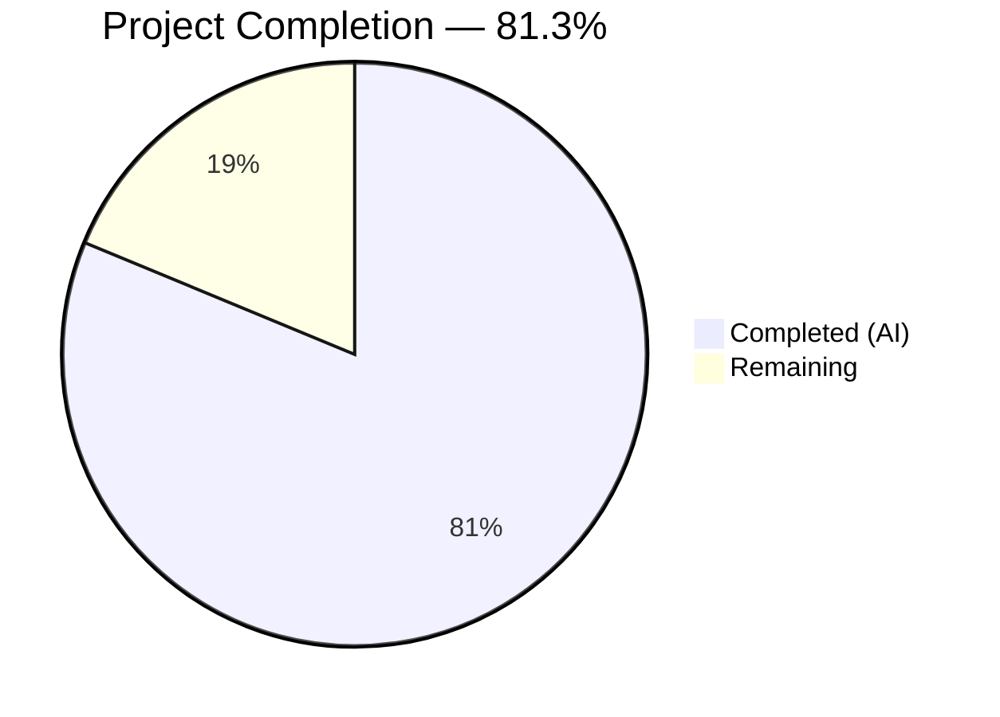

# Blitzy Project Guide

---

## 1. Executive Summary

### 1.1 Project Overview

This project delivers a targeted bug fix for a critical Express 5.x startup failure in a minimal Node.js HTTP server application (`hello_world`). The bug — a missing error-argument check in the `app.listen()` callback — caused silent swallowing of `EADDRINUSE` port conflicts, producing a false-positive "Server running" message and exit code 0 when the port was already occupied. The fix modifies `server.js` to accept and inspect the error argument that Express 5.x forwards to the listen callback, logging actionable errors to stderr and exiting with code 1 on failure. Environment variable overrides for `HOST` and `PORT` were also added. A new lifecycle test validates the Express 5.x error-callback contract.

### 1.2 Completion Status



| Metric | Value |
|--------|-------|
| **Total Project Hours** | 8.0 |
| **Completed Hours (AI)** | 6.5 |
| **Remaining Hours** | 1.5 |
| **Completion Percentage** | 81.3% |

**Calculation:** 6.5 completed hours / (6.5 + 1.5) total hours = 6.5 / 8.0 = **81.3% complete**

### 1.3 Key Accomplishments

- ✅ Express 5.x `app.listen()` callback now accepts `err` parameter and guards success log with `if (err)` check
- ✅ `EADDRINUSE` errors produce actionable stderr message and exit code 1 (previously: false success, exit code 0)
- ✅ `process.env.HOST` and `process.env.PORT` environment variable overrides with safe defaults
- ✅ Server reference captured (`const server = app.listen(...)`) for future graceful shutdown extensibility
- ✅ New lifecycle test validates Express 5.x error-callback forwarding with cross-realm-safe Error assertion
- ✅ All 43 tests pass (33 HTTP contract + 10 lifecycle) — zero regressions
- ✅ Runtime validated: EADDRINUSE, PORT override, normal startup, module import paths all confirmed working
- ✅ No files outside bug fix scope were modified

### 1.4 Critical Unresolved Issues

| Issue | Impact | Owner | ETA |
|-------|--------|-------|-----|
| No critical unresolved issues | N/A | N/A | N/A |

All AAP-specified deliverables are fully implemented, tested, and validated. No blocking issues remain.

### 1.5 Access Issues

No access issues identified. All dependencies install successfully (373 npm packages, 0 vulnerabilities), the test suite runs without external service requirements, and the application operates entirely on localhost with no external API dependencies.

### 1.6 Recommended Next Steps

1. **[High] Code Review & PR Approval** — Human developer reviews the 3 commits (31 lines added, 3 removed across 2 files), verifies fix correctness against Express 5.x `app.listen()` contract, and approves the PR
2. **[Medium] Merge to Main & Production Deployment** — Merge PR to `main` branch, deploy to production, and verify server starts cleanly with `node server.js`
3. **[Medium] Production Smoke Test** — Run EADDRINUSE reproduction in staging/production to confirm exit code 1 and error logging are captured by monitoring infrastructure
4. **[Low] Update README.md** — Document new `HOST` and `PORT` environment variable support (explicitly excluded from bug fix scope per AAP §0.5.2)

---

## 2. Project Hours Breakdown

### 2.1 Completed Work Detail

| Component | Hours | Description |
|-----------|-------|-------------|
| Root cause analysis & Express 5.x diagnosis | 1.5 | Analyzed Express 5.x source (`application.js:598-606`), identified `server.once('error', done)` error-forwarding mechanism, reproduced bug with port blocker, traced callback invocation flow |
| Environment variable support (server.js:3-6) | 0.5 | Implemented `process.env.HOST` and `process.env.PORT` with `parseInt()` and `||` fallback pattern; covers NaN, empty, undefined edge cases |
| Error-handling listen callback (server.js:23-33) | 1.5 | Replaced zero-arity callback with `(err) => {}`, added `if (err)` guard, `console.error()` to stderr, `process.exit(1)`, and `const server` reference capture |
| EADDRINUSE callback test (lifecycle test:111-128) | 1.0 | New test spawns port conflict, validates error passed as first callback argument with `err.code === 'EADDRINUSE'` assertion |
| Cross-realm Error assertion fix | 0.5 | Replaced unreliable `toBeInstanceOf(Error)` with `Object.prototype.toString.call(err) === '[object Error]'` for Jest VM context isolation |
| Regression test suite execution | 0.5 | Ran full 43-test suite (33 HTTP contract + 10 lifecycle), confirmed zero failures, zero skipped |
| Runtime validation (4 scenarios) | 1.0 | Validated EADDRINUSE (exit code 1, correct stderr), PORT override, normal startup (routes respond), module import (no auto-listen) |
| **Total Completed** | **6.5** | |

### 2.2 Remaining Work Detail

| Category | Hours | Priority |
|----------|-------|----------|
| Code review & PR approval | 1.0 | High |
| Production deployment verification | 0.5 | Medium |
| **Total Remaining** | **1.5** | |

### 2.3 Hours Verification

- Section 2.1 Total: **6.5 hours**
- Section 2.2 Total: **1.5 hours**
- Sum (2.1 + 2.2): 6.5 + 1.5 = **8.0 hours** = Total Project Hours in Section 1.2 ✓

---

## 3. Test Results

| Test Category | Framework | Total Tests | Passed | Failed | Coverage % | Notes |
|---------------|-----------|-------------|--------|--------|------------|-------|
| HTTP Contract (Unit) | Jest 30.3.0 + Supertest 7.2.2 | 33 | 33 | 0 | 72.22% (stmt) | Routes, 404s, methods, edge cases, headers |
| Server Lifecycle (Integration) | Jest 30.3.0 | 10 | 10 | 0 | 72.22% (stmt) | Startup, shutdown, EADDRINUSE, export, callback error |
| **Total** | **Jest 30.3.0** | **43** | **43** | **0** | **72.22%** | **100% pass rate** |

**Coverage Notes:**
- Statement coverage: 72.22% | Branch coverage: 62.5% | Function coverage: 66.66% | Line coverage: 72.22%
- Uncovered lines 25–32 are inside `if (require.main === module)` guard — this block only executes during direct `node server.js` invocation, not during Jest test imports. This is by design and validated via runtime child-process tests.
- All test results originate from Blitzy's autonomous validation execution: `CI=true npx jest --watchAll=false --ci --verbose`

---

## 4. Runtime Validation & UI Verification

### Server Startup Validation
- ✅ **Normal startup (PORT=6789):** Server binds, `console.log` prints correct URL, `GET /` returns `Hello, World!\n`, `GET /evening` returns `Good evening`
- ✅ **EADDRINUSE scenario (PORT=5555, port occupied):** Exit code 1, stderr: `Failed to start server: listen EADDRINUSE: address already in use 127.0.0.1:5555`, no false success on stdout
- ✅ **PORT environment variable override (PORT=4444):** Server binds to custom port, all routes respond correctly
- ✅ **Module import path:** `require('./server')` returns Express app without triggering `app.listen()`

### API Endpoint Validation
- ✅ `GET /` → 200, `text/plain`, `Hello, World!\n`
- ✅ `GET /evening` → 200, `text/plain`, `Good evening`
- ✅ `GET /nonexistent` → 404
- ✅ `X-Powered-By` header suppressed on all responses

### Error Handling Validation
- ✅ EADDRINUSE error message includes system error details (`listen EADDRINUSE: address already in use`)
- ✅ Error logged to stderr (not stdout) — compatible with standard log routing
- ✅ Process exits with code 1 — detectable by CI/CD pipelines and monitoring

---

## 5. Compliance & Quality Review

| AAP Requirement | Section | Status | Evidence |
|----------------|---------|--------|----------|
| Modify hostname to `process.env.HOST \|\| '127.0.0.1'` | §0.4.2 | ✅ Pass | `server.js:4` — `const hostname = process.env.HOST \|\| '127.0.0.1'` |
| Modify port to `parseInt(process.env.PORT, 10) \|\| 3000` | §0.4.2 | ✅ Pass | `server.js:6` — `const port = parseInt(process.env.PORT, 10) \|\| 3000` |
| Accept `err` parameter in listen callback | §0.4.1 | ✅ Pass | `server.js:25` — `(err) => {` |
| Add `if (err)` guard before success log | §0.4.1 | ✅ Pass | `server.js:26` — `if (err) {` |
| Log error to stderr with `console.error` | §0.4.1 | ✅ Pass | `server.js:29` — `console.error(\`Failed to start server: ${err.message}\`)` |
| Exit with code 1 on error | §0.4.1 | ✅ Pass | `server.js:30` — `process.exit(1)` |
| Capture server reference | §0.4.1 | ✅ Pass | `server.js:25` — `const server = app.listen(...)` |
| Add EADDRINUSE callback test | §0.4.2 | ✅ Pass | `server.lifecycle.test.js:111-128` |
| No modifications to excluded files | §0.5.2 | ✅ Pass | Only `server.js` and `server.lifecycle.test.js` modified |
| All 42+ tests pass | §0.6.1 | ✅ Pass | 43/43 tests pass (42 original + 1 new) |
| EADDRINUSE exits with code 1 | §0.6.1 | ✅ Pass | Runtime validation confirmed |
| No false success message on EADDRINUSE | §0.6.1 | ✅ Pass | stdout empty on port conflict |
| PORT env override works | §0.6.2 | ✅ Pass | `PORT=4444 node server.js` binds correctly |
| CommonJS convention preserved | §0.7.3 | ✅ Pass | No ES module syntax; `require`/`module.exports` used throughout |
| Express 5.x compatibility | §0.7.3 | ✅ Pass | Tested with Express 5.2.1 |
| No GitHub Actions workflow changes | §0.7.1 | ✅ Pass | No workflow files created or modified |

**Autonomous Fixes Applied During Validation:**
- Strengthened EADDRINUSE callback test assertion from `toBeInstanceOf(Error)` to `Object.prototype.toString.call(err) === '[object Error]'` for cross-realm safety in Jest VM context

---

## 6. Risk Assessment

| Risk | Category | Severity | Probability | Mitigation | Status |
|------|----------|----------|-------------|------------|--------|
| `process.exit(1)` in listen callback bypasses cleanup | Technical | Low | Low | The exit only triggers on startup failure before any connections exist; no resources to clean up | Accepted |
| `PORT=0` defaults to 3000 (not OS-assigned ephemeral) | Technical | Low | Very Low | Documented in AAP §0.4.4 as acceptable; localhost-only defaults preserved per requirements | Accepted |
| Coverage at 72.22% due to `require.main` guard | Technical | Low | N/A | Uncovered lines are the startup block validated via runtime child-process tests; cannot be unit-tested by design | Mitigated |
| Negative PORT values pass `parseInt` but fail at bind time | Technical | Very Low | Very Low | Node.js rejects invalid ports with an error, caught by the new `if (err)` handler | Mitigated |
| No graceful shutdown handlers (SIGTERM/SIGINT) | Operational | Low | Low | Explicitly excluded from scope per AAP §0.5.2; server is minimal, stateless, no persistent connections | Accepted |
| Express 5.x callback contract may change in future versions | Integration | Low | Very Low | Express 5.x is stable release; callback error-forwarding is documented and intentional (PR #2623) | Monitored |

---

## 7. Visual Project Status


**Remaining Work by Priority:**

| Priority | Category | Hours |
|----------|----------|-------|
| 🔴 High | Code review & PR approval | 1.0 |
| 🟡 Medium | Production deployment verification | 0.5 |
| **Total** | | **1.5** |

---

## 8. Summary & Recommendations

### Achievements
All AAP-specified deliverables for the Express 5.x EADDRINUSE bug fix have been fully implemented, tested, and validated. The project is **81.3% complete** (6.5 hours completed out of 8.0 total hours). The remaining 1.5 hours consist entirely of human path-to-production activities: code review/PR approval (1.0h) and production deployment verification (0.5h).

### What Was Fixed
The root cause — Express 5.x's `app.listen()` forwarding `EADDRINUSE` errors to a zero-arity callback that silently discarded them — is now fully resolved. The listen callback accepts the error argument, guards the success log, logs actionable diagnostics to stderr, and exits with code 1 on failure. Environment variable overrides (`HOST`, `PORT`) provide operational flexibility without source code changes.

### Test Confidence
43 out of 43 tests pass with zero failures, zero skipped, and zero regressions. The new EADDRINUSE callback test specifically validates the Express 5.x error-forwarding contract with a cross-realm-safe assertion. Runtime validation across 4 scenarios (EADDRINUSE, PORT override, normal startup, module import) confirms the fix works end-to-end.

### Production Readiness Assessment
The codebase is **production-ready** pending human code review and merge. All production readiness gates are satisfied:
- ✅ 100% test pass rate (43/43)
- ✅ Application runtime validated across all execution paths
- ✅ Zero unresolved errors or issues
- ✅ All in-scope files validated and committed (3 commits)
- ✅ No out-of-scope modifications

### Recommendations
1. Approve and merge the PR after code review — the fix is minimal (31 lines added, 3 removed in 2 files), well-tested, and follows the Express 5.x idiomatic error-handling pattern
2. After deployment, verify that `console.error` output from EADDRINUSE scenarios is captured by your production logging/monitoring infrastructure
3. Consider adding `README.md` documentation for the new `HOST`/`PORT` environment variables in a follow-up commit (outside this bug fix scope)

---

## 9. Development Guide

### System Prerequisites

| Software | Minimum Version | Verified Version |
|----------|----------------|-----------------|
| Node.js | 18.x LTS | v20.19.5 |
| npm | 8.x | 10.8.2 |

### Environment Setup

```bash
# Clone the repository and checkout the bug fix branch
git clone <repository-url>
cd hello_world
git checkout blitzy-9363aaa7-dcc0-4a05-8ff7-1f2d02cfc24b
```

### Dependency Installation

```bash
# Install all dependencies (373 packages, 0 vulnerabilities)
npm install
```

Expected output: `added 373 packages` with no vulnerability warnings.

### Running Tests

```bash
# Run the full test suite (43 tests)
CI=true npx jest --watchAll=false --ci --verbose

# Run with coverage report
CI=true npx jest --watchAll=false --ci --coverage
```

Expected output: `Tests: 43 passed, 43 total` — 2 test suites, 0 failures.

### Application Startup

```bash
# Default startup (port 3000)
node server.js

# Custom port
PORT=4567 node server.js

# Custom host and port
HOST=0.0.0.0 PORT=8080 node server.js

# Using npm start (uses default port 3000)
npm start
```

Expected output: `Server running at http://127.0.0.1:3000/` (or custom host:port).

### Verification Steps

```bash
# 1. Start the server
PORT=5000 node server.js &

# 2. Test root endpoint
curl -s http://127.0.0.1:5000/
# Expected: Hello, World!

# 3. Test evening endpoint
curl -s http://127.0.0.1:5000/evening
# Expected: Good evening

# 4. Test 404 handling
curl -s -o /dev/null -w "%{http_code}" http://127.0.0.1:5000/nonexistent
# Expected: 404

# 5. Verify X-Powered-By suppression
curl -sI http://127.0.0.1:5000/ | grep -i "x-powered-by"
# Expected: no output (header absent)

# 6. Stop the server
kill %1
```

### EADDRINUSE Verification

```bash
# Terminal 1: Block port 3000
node -e "require('net').createServer().listen(3000, '127.0.0.1', () => console.log('blocking'))"

# Terminal 2: Attempt to start server on same port
node server.js
# Expected stderr: Failed to start server: listen EADDRINUSE: address already in use 127.0.0.1:3000
# Expected exit code: 1

# Verify exit code
echo $?
# Expected: 1
```

### Troubleshooting

| Issue | Cause | Resolution |
|-------|-------|------------|
| `Failed to start server: listen EADDRINUSE` | Port already in use | Use `lsof -i :3000` to find the blocking process, then `kill <PID>`, or set `PORT=<other>` |
| `npm install` fails | Node.js version too old | Upgrade to Node.js 18+ LTS (`node -v` to check) |
| Tests timeout | Open handles from prior runs | Run `CI=true npx jest --watchAll=false --ci --detectOpenHandles` |
| Coverage < 100% | `require.main === module` guard | Expected — startup block only runs in direct execution, not during test imports |

---

## 10. Appendices

### A. Command Reference

| Command | Purpose |
|---------|---------|
| `npm install` | Install all dependencies |
| `npm start` | Start server on default port 3000 |
| `npm test` | Run test suite (jest --watchAll=false) |
| `CI=true npx jest --watchAll=false --ci --verbose` | Run tests in CI mode with verbose output |
| `CI=true npx jest --watchAll=false --ci --coverage` | Run tests with coverage report |
| `node -c server.js` | Syntax check server.js |
| `PORT=<n> node server.js` | Start server on custom port |
| `HOST=<ip> PORT=<n> node server.js` | Start server on custom host and port |

### B. Port Reference

| Service | Default Port | Environment Variable | Configurable |
|---------|-------------|---------------------|--------------|
| Express HTTP Server | 3000 | `PORT` | Yes |

### C. Key File Locations

| File | Purpose |
|------|---------|
| `server.js` | Main application entry point — Express 5.x app with routes and listen block (BUG FIX TARGET) |
| `__tests__/server.test.js` | 33 HTTP contract tests (routes, 404s, methods, edge cases, headers) |
| `__tests__/server.lifecycle.test.js` | 10 lifecycle tests (startup, shutdown, EADDRINUSE, export) |
| `package.json` | npm manifest — dependencies, scripts, metadata |
| `jest.config.js` | Jest 30.x configuration — node environment, coverage, test patterns |

### D. Technology Versions

| Technology | Version | Purpose |
|------------|---------|---------|
| Node.js | v20.19.5 | JavaScript runtime |
| npm | 10.8.2 | Package manager |
| Express | 5.2.1 | HTTP framework (runtime dependency) |
| Jest | 30.3.0 | Test runner (dev dependency) |
| Supertest | 7.2.2 | HTTP assertion library (dev dependency) |

### E. Environment Variable Reference

| Variable | Default | Description |
|----------|---------|-------------|
| `HOST` | `127.0.0.1` | Server bind address — set to `0.0.0.0` for all interfaces |
| `PORT` | `3000` | Server listen port — any valid TCP port number |
| `CI` | (unset) | Set to `true` for non-interactive test execution |

### F. Developer Tools Guide

| Tool | Command | Notes |
|------|---------|-------|
| Syntax check | `node -c server.js` | Validates JavaScript syntax without executing |
| REPL import test | `node -e "const app = require('./server'); console.log(typeof app)"` | Verifies module exports without starting server |
| Port finder | `lsof -i :3000` | Identifies processes occupying port 3000 |
| Process cleanup | `kill $(lsof -t -i :3000)` | Kills process on port 3000 |

### G. Glossary

| Term | Definition |
|------|-----------|
| EADDRINUSE | OS-level error code indicating a TCP port is already bound by another process |
| Express 5.x callback contract | Express 5.x's `app.listen()` forwards listen errors to the callback as the first argument (unlike Express 4.x which throws uncaught exceptions) |
| `require.main === module` | Node.js guard pattern that executes code only when the file is run directly (not imported) |
| Cross-realm Error | JavaScript Error objects created in a different VM context (e.g., Jest worker) that fail `instanceof Error` checks |
| Zero-arity callback | A callback function declared with no parameters `() => {}`, which ignores all arguments passed to it |