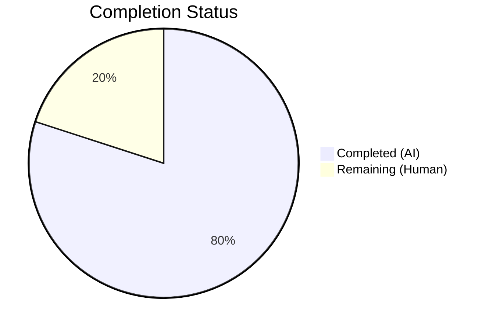

# Blitzy Project Guide

---

## 1. Executive Summary

### 1.1 Project Overview

This project introduces a complete automated test suite from scratch for `hello_world` v1.0.0 — a minimal, zero-dependency Node.js HTTP server (`server.js`) serving as a Backprop integration test harness. The 14-line single-file application previously had 0% test coverage. Blitzy agents implemented 15 comprehensive Jest test cases achieving 100% coverage across all metrics (lines, functions, branches, statements), added test infrastructure (Jest 29.7.0 + supertest 7.2.2 as devDependencies), and made a single-line production change to enable testability — all while preserving the project's zero-dependency, minimal design philosophy.

### 1.2 Completion Status

**Completion: 80.0%** — 6 hours completed out of 7.5 total hours



| Metric | Value |
|--------|-------|
| Total Project Hours | 7.5 |
| Completed Hours (AI) | 6 |
| Remaining Hours (Human) | 1.5 |
| Completion Percentage | 80.0% |

### 1.3 Key Accomplishments

- [x] Created comprehensive test suite (`tests/server.test.js`) with 15 test cases covering all AAP-specified test categories
- [x] Achieved 100% code coverage across all four metrics: Statements, Branches, Functions, and Lines
- [x] HTTP method matrix fully covered: GET, POST, PUT, DELETE, PATCH, OPTIONS, HEAD — all 7 methods validated
- [x] Multi-path validation complete: `/`, `/test`, `/nonexistent`, `/a/b/c/d`, `/path?query=value`
- [x] Response contract enforcement: status 200, Content-Type `text/plain`, exact body `Hello, World!\n` verified
- [x] Console startup message verification via `jest.spyOn(console, 'log')`
- [x] Server lifecycle management with `beforeAll`/`afterAll` hooks and EADDRINUSE error handling
- [x] Zero-dependency production design preserved — jest and supertest are devDependencies only
- [x] Single-line production change (`module.exports = server;`) with zero behavioral impact
- [x] All changes committed (4 commits) with no uncommitted in-scope changes

### 1.4 Critical Unresolved Issues

| Issue | Impact | Owner | ETA |
|-------|--------|-------|-----|
| No critical issues | N/A | N/A | N/A |

All AAP-scoped autonomous work has been completed successfully with zero test failures, zero compilation errors, and zero runtime issues.

### 1.5 Access Issues

No access issues identified. The project is fully self-contained with no external service dependencies, API keys, or third-party credentials required.

### 1.6 Recommended Next Steps

1. **[High]** Conduct human code review of the 4 changed files to verify minimal-change compliance and test quality
2. **[High]** Approve and merge the PR into the `main` branch
3. **[Medium]** Add `.gitignore` file to exclude `node_modules/` and `coverage/` directories from version control
4. **[Low]** Run negative validation: temporarily modify `server.js` response string, confirm tests fail, then revert — to verify test sensitivity

---

## 2. Project Hours Breakdown

### 2.1 Completed Work Detail

| Component | Hours | Description |
|-----------|-------|-------------|
| Test infrastructure setup | 1.5 | Updated `package.json` with Jest test scripts (`test`, `test:coverage`), added `devDependencies` section with jest@29.7.0 and supertest@7.2.2, resolved 304 packages via `npm install` |
| Server testability modification | 0.5 | Added `module.exports = server;` to `server.js`, verified zero behavioral impact on production execution |
| Test suite design and implementation | 3.0 | Created `tests/server.test.js` (163 lines) with 15 test cases across 5 categories: HTTP method matrix (7 tests), multi-path validation (4 tests), response contract enforcement (2 tests), console startup verification (1 test), server lifecycle management (1 test) |
| Validation and bug fixing | 1.0 | Ran test execution and coverage validation, fixed EADDRINUSE error handling in `beforeAll` hook, corrected test naming conventions, iterated through 4 commits to achieve green build |
| **Total Completed** | **6.0** | |

### 2.2 Remaining Work Detail

| Category | Hours | Priority |
|----------|-------|----------|
| Human code review and PR approval | 0.5 | High |
| PR merge to main branch and integration verification | 0.5 | High |
| Add .gitignore for coverage/ and node_modules/ directories | 0.5 | Medium |
| **Total Remaining** | **1.5** | |

---

## 3. Test Results

All tests listed originate from Blitzy's autonomous validation execution on this project.

| Test Category | Framework | Total Tests | Passed | Failed | Coverage % | Notes |
|---------------|-----------|-------------|--------|--------|------------|-------|
| HTTP Method Matrix (Unit/Integration) | Jest 29.7.0 + supertest 7.2.2 | 7 | 7 | 0 | 100% | GET, POST, PUT, DELETE, PATCH, OPTIONS, HEAD on root path `/` |
| Multi-Path Validation (Integration) | Jest 29.7.0 + supertest 7.2.2 | 4 | 4 | 0 | 100% | `/test`, `/nonexistent`, `/a/b/c/d`, `/path?query=value` |
| Response Contract Enforcement (Unit) | Jest 29.7.0 | 2 | 2 | 0 | 100% | Exact body with trailing newline, consecutive request consistency |
| Console Startup Verification (Unit) | Jest 29.7.0 | 1 | 1 | 0 | 100% | `jest.spyOn(console, 'log')` validates startup message format |
| Server Lifecycle (Integration) | Jest 29.7.0 | 1 | 1 | 0 | 100% | Address binding verification (host + port) |
| **Totals** | | **15** | **15** | **0** | **100%** | **0 failures, 0 skipped** |

**Coverage Breakdown (Istanbul via Jest `--coverage`):**

| File | Statements | Branches | Functions | Lines | Uncovered Lines |
|------|-----------|----------|-----------|-------|-----------------|
| server.js | 100% | 100% | 100% | 100% | None |

---

## 4. Runtime Validation & UI Verification

**Runtime Health:**

- ✅ `npm install` — 304 packages installed, 0 vulnerabilities
- ✅ `npm test` — 15/15 tests passing in 1.24s (under 5s target)
- ✅ `npm run test:coverage` — 100% coverage confirmed across all four metrics
- ✅ `node server.js` — Server starts and logs `Server running at http://127.0.0.1:3000/`
- ✅ `curl http://127.0.0.1:3000/` — Returns HTTP 200, Content-Type: text/plain, body: `Hello, World!\n`
- ✅ Multiple HTTP methods (GET, POST, PUT, DELETE) — All return identical 200 response
- ✅ Multiple paths (`/`, `/test`, `/nonexistent`) — All return identical 200 response
- ✅ Server shuts down cleanly via `server.close()` with no resource leaks

**UI Verification:**

- N/A — No user interface exists; this is a headless HTTP server

---

## 5. Compliance & Quality Review

| AAP Requirement | Status | Evidence |
|----------------|--------|----------|
| Create `tests/server.test.js` with comprehensive test suite | ✅ Pass | 163-line test file created with 15 test cases |
| HTTP method coverage: GET, POST, PUT, DELETE, PATCH, OPTIONS, HEAD | ✅ Pass | 7 dedicated tests, all passing |
| Multi-path validation: /, /test, /nonexistent, /a/b/c/d, /path?query=value | ✅ Pass | 4 dedicated tests plus root path coverage in method tests |
| Response contract enforcement: status 200, text/plain, exact body | ✅ Pass | Assertions in every HTTP test + 2 dedicated contract tests |
| Console startup message verification | ✅ Pass | jest.spyOn captures and validates exact message format |
| Server lifecycle management | ✅ Pass | beforeAll/afterAll hooks with EADDRINUSE error handling |
| Update `server.js` with `module.exports = server;` | ✅ Pass | Single line added, zero behavioral change confirmed |
| Update `package.json` with test scripts and devDependencies | ✅ Pass | test + test:coverage scripts, jest + supertest in devDependencies |
| 100% line coverage | ✅ Pass | Istanbul reports 100% |
| 100% function coverage | ✅ Pass | Istanbul reports 100% |
| 100% branch coverage | ✅ Pass | Istanbul reports 100% |
| 100% statement coverage | ✅ Pass | Istanbul reports 100% |
| Zero production dependency impact | ✅ Pass | No `dependencies` section; jest/supertest are devDependencies only |
| Minimal change clause compliance | ✅ Pass | Only 1 line added to server.js; all other changes are test/config |
| No CI/CD workflow modifications | ✅ Pass | No .github/workflows files created or modified |
| Test isolation in /tests directory | ✅ Pass | All test code resides in tests/server.test.js |
| Jest naming conventions (*.test.js) | ✅ Pass | File named server.test.js |
| Descriptive test names (should [behavior]) | ✅ Pass | All 15 tests follow pattern |

**Autonomous Validation Fixes Applied:**

- EADDRINUSE error handling added to `beforeAll` hook to prevent port conflict failures
- Test naming conventions corrected for consistency

---

## 6. Risk Assessment

| Risk | Category | Severity | Probability | Mitigation | Status |
|------|----------|----------|-------------|------------|--------|
| Port 3000 conflict during test execution | Technical | Low | Low | EADDRINUSE handling in beforeAll hook; `--forceExit` flag in Jest command | Mitigated |
| Jest 29.x end-of-life (30.x is latest) | Technical | Low | Low | Jest 29.7.0 is stable and widely supported; migration to 30.x is straightforward when desired | Accepted |
| `node_modules/` and `coverage/` tracked in git | Operational | Low | Medium | Add `.gitignore` file (remaining human task) | Open |
| `package.json` main field points to non-existent `index.js` | Technical | Low | Low | Pre-existing issue unrelated to AAP scope; does not affect server.js or test execution | Accepted |
| Server binds to hardcoded 127.0.0.1:3000 | Operational | Low | Low | By design for this minimal test harness; not a production deployment concern | Accepted |

---

## 7. Visual Project Status


**Completed: 6 hours (80.0%)** — All AAP-scoped autonomous work delivered
**Remaining: 1.5 hours (20.0%)** — Human review, merge, and minor cleanup

---

## 8. Summary & Recommendations

### Achievements

The project is 80.0% complete with 6 hours of AAP-scoped work delivered autonomously out of 7.5 total project hours. All core deliverables specified in the Agent Action Plan have been implemented successfully:

- A comprehensive 15-test suite was created from scratch, taking the project from 0% to 100% automated test coverage
- All five test categories mandated by the AAP are covered: HTTP method matrix, multi-path validation, response contract enforcement, console startup verification, and server lifecycle management
- The minimal change philosophy was strictly followed — only a single line was added to production code
- Zero production dependency impact — the project maintains its zero-dependency design
- All 15 tests pass consistently with execution time well under the 5-second target

### Remaining Gaps

The remaining 1.5 hours consist entirely of standard path-to-production human activities:

1. **Code review** (0.5h) — Human reviewer should verify minimal-change compliance and test quality
2. **PR merge** (0.5h) — Merge to main branch after approval
3. **Gitignore cleanup** (0.5h) — Add `.gitignore` for `node_modules/` and `coverage/` directories

### Production Readiness Assessment

The test suite is **production-ready** for merge. All validation gates passed:
- Dependencies: 0 vulnerabilities
- Tests: 15/15 passing
- Coverage: 100% across all metrics
- Runtime: Server behavior unchanged

### Success Metrics Achieved

| Metric | Target | Actual | Status |
|--------|--------|--------|--------|
| Test cases | 15+ | 15 | ✅ Met |
| Line coverage | 100% | 100% | ✅ Met |
| Function coverage | 100% | 100% | ✅ Met |
| Branch coverage | 100% | 100% | ✅ Met |
| Statement coverage | 100% | 100% | ✅ Met |
| Test execution time | < 5s | 1.24s | ✅ Met |
| Production behavior change | None | None | ✅ Met |
| Production dependencies added | 0 | 0 | ✅ Met |

---

## 9. Development Guide

### System Prerequisites

| Software | Required Version | Verification Command |
|----------|-----------------|---------------------|
| Node.js | v20.x (tested with v20.19.5) | `node -v` |
| npm | v9+ (tested with v10.8.2) | `npm -v` |

No external services, databases, or API keys are required. The project is fully self-contained.

### Environment Setup

```bash
# Clone the repository and switch to the feature branch
git clone <repository-url>
cd hello_world
git checkout blitzy-708fc0c8-cfa4-46d8-ae46-fe232292e207
```

No environment variables are needed. The server uses hardcoded configuration:
- Hostname: `127.0.0.1`
- Port: `3000`

### Dependency Installation

```bash
# Install all dependencies (jest and supertest as devDependencies)
npm install
```

Expected output: `added 304 packages ... found 0 vulnerabilities`

Verify installed packages:

```bash
npm ls --depth=0
```

Expected output:
```
hello_world@1.0.0
├── jest@29.7.0
└── supertest@7.2.2
```

### Running Tests

```bash
# Run all tests
npm test

# Run tests with verbose output
npx jest --verbose --forceExit --detectOpenHandles

# Run tests with coverage report
npm run test:coverage

# Run a specific test file
npx jest tests/server.test.js --forceExit
```

Expected output for `npm test`:
```
PASS tests/server.test.js
  Server
    ✓ should return 200 with "Hello, World!\n" for GET /
    ✓ should return 200 with "Hello, World!\n" for POST /
    ... (15 tests total)

Test Suites: 1 passed, 1 total
Tests:       15 passed, 15 total
```

Expected coverage output (`npm run test:coverage`):
```
-----------|---------|----------|---------|---------|
File       | % Stmts | % Branch | % Funcs | % Lines |
-----------|---------|----------|---------|---------|
All files  |     100 |      100 |     100 |     100 |
 server.js |     100 |      100 |     100 |     100 |
-----------|---------|----------|---------|---------|
```

### Running the Server

```bash
# Start the server
node server.js
```

Expected console output: `Server running at http://127.0.0.1:3000/`

### Verification Steps

```bash
# Verify server responds correctly
curl http://127.0.0.1:3000/

# Expected: Hello, World!

# Verify HTTP status code
curl -s -o /dev/null -w "%{http_code}" http://127.0.0.1:3000/

# Expected: 200

# Verify response headers
curl -sI http://127.0.0.1:3000/

# Expected: Content-Type: text/plain
```

### Troubleshooting

| Issue | Cause | Resolution |
|-------|-------|------------|
| `EADDRINUSE: port 3000` | Another process is using port 3000 | Kill the process: `lsof -ti:3000 \| xargs kill -9` (Linux/Mac) or restart terminal |
| `npm test` enters watch mode | Missing `--forceExit` flag | Use `CI=true npm test -- --watchAll=false --ci` |
| `Cannot find module 'supertest'` | Dependencies not installed | Run `npm install` |
| `Cannot find module '../server'` | Test run from wrong directory | Ensure you are in the project root directory |

---

## 10. Appendices

### A. Command Reference

| Command | Purpose |
|---------|---------|
| `npm install` | Install all dependencies |
| `npm test` | Run Jest test suite (15 tests) |
| `npm run test:coverage` | Run tests with Istanbul coverage report |
| `node server.js` | Start the HTTP server |
| `npx jest --verbose --forceExit --detectOpenHandles` | Run tests with detailed output |
| `curl http://127.0.0.1:3000/` | Test server HTTP response |

### B. Port Reference

| Service | Port | Host | Protocol |
|---------|------|------|----------|
| HTTP Server | 3000 | 127.0.0.1 | HTTP |

### C. Key File Locations

| File | Purpose |
|------|---------|
| `server.js` | Production HTTP server (16 lines) |
| `tests/server.test.js` | Jest test suite (163 lines, 15 tests) |
| `package.json` | npm manifest with test scripts and devDependencies |
| `package-lock.json` | npm lockfile for deterministic installs |
| `README.md` | Repository documentation |
| `coverage/` | Istanbul coverage reports (generated at runtime, not committed) |

### D. Technology Versions

| Technology | Version | Purpose |
|------------|---------|---------|
| Node.js | v20.19.5 | JavaScript runtime |
| npm | v10.8.2 | Package manager |
| Jest | 29.7.0 | Testing framework and coverage tool |
| supertest | 7.2.2 | HTTP assertion library for in-process testing |
| http (built-in) | Node.js native | HTTP server module (zero external dependencies) |

### E. Environment Variable Reference

No environment variables are required. All configuration is hardcoded in `server.js`:

| Constant | Value | Location |
|----------|-------|----------|
| `hostname` | `127.0.0.1` | `server.js` line 3 |
| `port` | `3000` | `server.js` line 4 |

### G. Glossary

| Term | Definition |
|------|-----------|
| AAP | Agent Action Plan — the comprehensive specification of all project requirements |
| devDependencies | npm packages required only for development/testing, not included in production |
| Istanbul | JavaScript code coverage tool bundled with Jest |
| supertest | Library for testing HTTP servers by sending in-process requests without network binding |
| EADDRINUSE | Node.js error indicating a port is already in use by another process |
| `--forceExit` | Jest flag that forces the process to exit after tests complete, even with open handles |
