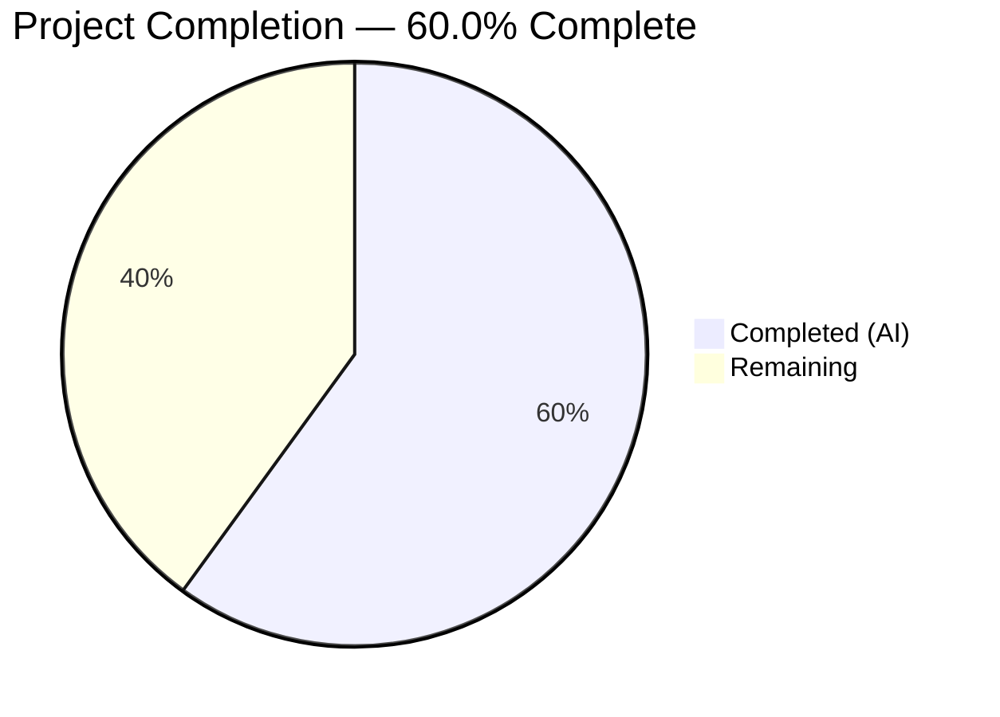
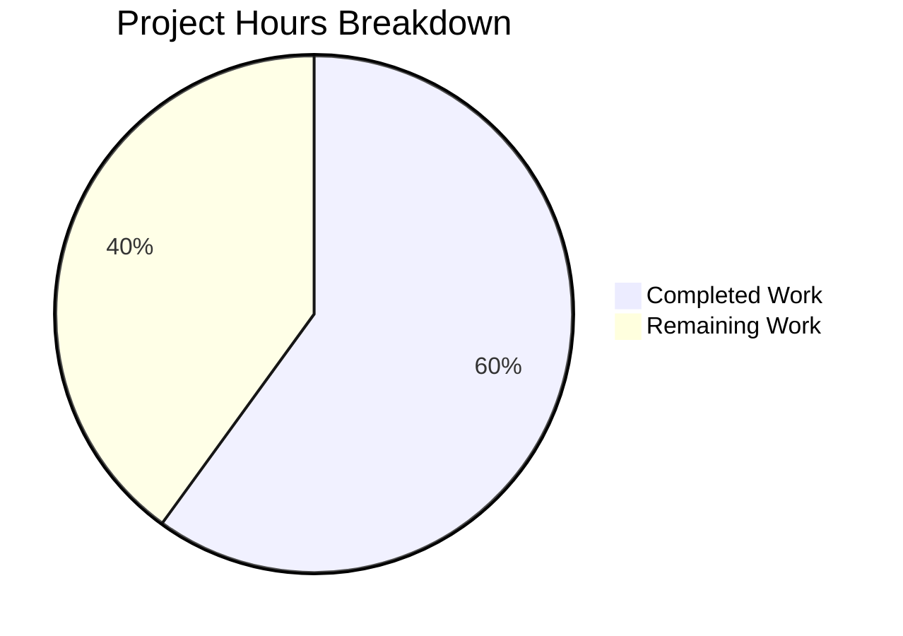

# Blitzy Project Guide — hao-backprop-test `/health` Endpoint

---

## 1. Executive Summary

### 1.1 Project Overview

This project adds a dedicated HTTP health check endpoint (`GET /health`) to the existing `hao-backprop-test` Flask application. The endpoint returns a JSON response `{"status": "ok"}` with HTTP 200 and `Content-Type: application/json`, enabling DevOps monitoring tools and the Backprop integration pipeline to programmatically verify service availability. The implementation is confined to a single file (`app.py`) with no new dependencies, no new files, and full preservation of all existing catch-all route behavior.

### 1.2 Completion Status



| Metric | Value |
|--------|-------|
| **Total Project Hours** | 5 |
| **Completed Hours (AI)** | 3 |
| **Remaining Hours** | 2 |
| **Completion Percentage** | 60.0% |

**Calculation**: 3 completed hours / (3 completed + 2 remaining) = 3 / 5 = **60.0% complete**

All AAP-defined deliverables (feature implementation, validation, documentation) are 100% complete. The remaining 2 hours consist exclusively of standard path-to-production activities: human code review, automated test coverage, and production deployment verification.

### 1.3 Key Accomplishments

- ✅ Implemented `GET /health` endpoint returning `{"status": "ok"}` as `application/json` with HTTP 200
- ✅ Updated Flask import to include `jsonify` — no new dependencies required
- ✅ Correct route precedence — `/health` matched before catch-all for GET requests
- ✅ Non-GET methods (`POST`, `PUT`, `DELETE`, etc.) to `/health` correctly fall through to catch-all handler
- ✅ All existing behavior preserved byte-identical — root route and catch-all continue returning `Hello, World!\n`
- ✅ PEP 8 compliance verified — zero `pycodestyle` violations
- ✅ Compilation verified — zero errors from `python -m py_compile app.py`
- ✅ 7/7 manual runtime endpoint tests passed

### 1.4 Critical Unresolved Issues

| Issue | Impact | Owner | ETA |
|-------|--------|-------|-----|
| No automated test coverage for `/health` endpoint | Regression risk if future changes break the health route | Human Developer | 1–2 days |
| Production WSGI server not configured | Flask dev server not suitable for production traffic | Human Developer / DevOps | 1–2 days |

### 1.5 Access Issues

No access issues identified. The project uses no external APIs, no database connections, no third-party credentials, and no CI/CD integrations. All implementation and validation was performed locally using Flask's built-in development server.

### 1.6 Recommended Next Steps

1. **[High]** Conduct human code review of the `app.py` changes and merge the PR to the target branch
2. **[Medium]** Add automated tests for the `/health` endpoint (pytest with Flask test client)
3. **[Medium]** Deploy to production/staging environment and verify the `/health` endpoint responds correctly
4. **[Low]** Integrate `/health` endpoint with monitoring/alerting tools (e.g., Uptime Robot, AWS ALB health checks)
5. **[Low]** Update README.md to document the new `/health` endpoint for API consumers

---

## 2. Project Hours Breakdown

### 2.1 Completed Work Detail

| Component | Hours | Description |
|-----------|-------|-------------|
| Health Endpoint Implementation | 1.5 | Added `jsonify` to Flask imports (line 12), implemented `/health` GET route with `@app.route` decorator, `health()` handler function with docstring, returning `jsonify(status='ok')`. Placed before catch-all route for correct routing precedence. |
| Validation & Quality Assurance | 1.0 | Ran `python -m py_compile app.py` (zero errors), `pycodestyle app.py` (zero PEP 8 violations), and executed 7 manual runtime tests: GET /health, GET /, GET /any/path, POST /health, POST /, PUT /health, DELETE /health — all passed. |
| Technical Documentation | 0.5 | Generated Blitzy Technical Specifications and Project Guide documentation covering feature scope, behavioral contract, validation matrix, and risk assessment. |
| **Total** | **3.0** | |

### 2.2 Remaining Work Detail

| Category | Hours | Priority |
|----------|-------|----------|
| Human Code Review & PR Merge | 0.5 | High |
| Automated Test Coverage for `/health` Endpoint | 1.0 | Medium |
| Production Deployment & Post-Deploy Verification | 0.5 | Medium |
| **Total** | **2.0** | |

### 2.3 Hours Integrity Verification

- Section 2.1 Total (Completed): **3.0 hours**
- Section 2.2 Total (Remaining): **2.0 hours**
- Section 2.1 + Section 2.2 = 3.0 + 2.0 = **5.0 hours** = Total Project Hours in Section 1.2 ✅
- Section 2.2 Total = Remaining Hours in Section 1.2 = Remaining in Section 7 pie chart = **2.0 hours** ✅

---

## 3. Test Results

| Test Category | Framework | Total Tests | Passed | Failed | Coverage % | Notes |
|---------------|-----------|-------------|--------|--------|------------|-------|
| Runtime Validation (Manual) | curl / Flask dev server | 7 | 7 | 0 | 100% | All endpoint behaviors verified via HTTP requests against running Flask server |
| Compilation Check | python -m py_compile | 1 | 1 | 0 | 100% | Zero syntax errors in app.py |
| Code Style Lint | pycodestyle | 1 | 1 | 0 | 100% | Zero PEP 8 violations in app.py |
| **Total** | — | **9** | **9** | **0** | **100%** | |

**Runtime Validation Test Details (from Blitzy autonomous validation logs):**

| # | Test | Method | Path | Expected Status | Expected Content-Type | Expected Body | Result |
|---|------|--------|------|-----------------|-----------------------|---------------|--------|
| 1 | Health endpoint JSON response | GET | /health | 200 | application/json | `{"status":"ok"}` | ✅ PASS |
| 2 | Root route preserved | GET | / | 200 | text/plain | `Hello, World!\n` | ✅ PASS |
| 3 | Catch-all route preserved | GET | /any/other/path | 200 | text/plain | `Hello, World!\n` | ✅ PASS |
| 4 | POST /health falls to catch-all | POST | /health | 200 | text/plain | `Hello, World!\n` | ✅ PASS |
| 5 | POST root preserved | POST | / | 200 | text/plain | `Hello, World!\n` | ✅ PASS |
| 6 | PUT /health falls to catch-all | PUT | /health | 200 | text/plain | `Hello, World!\n` | ✅ PASS |
| 7 | DELETE /health falls to catch-all | DELETE | /health | 200 | text/plain | `Hello, World!\n` | ✅ PASS |

---

## 4. Runtime Validation & UI Verification

### Runtime Health

- ✅ Flask application starts successfully on `http://127.0.0.1:3000`
- ✅ `GET /health` returns HTTP 200 with `Content-Type: application/json` and body `{"status":"ok"}`
- ✅ `GET /` returns HTTP 200 with `Content-Type: text/plain` and body `Hello, World!\n` (unchanged)
- ✅ `GET /any/other/path` returns HTTP 200 with `Hello, World!\n` (catch-all unchanged)
- ✅ `POST /health` correctly falls through to catch-all handler, returns `Hello, World!\n`
- ✅ `PUT /health` correctly falls through to catch-all handler, returns `Hello, World!\n`
- ✅ `DELETE /health` correctly falls through to catch-all handler, returns `Hello, World!\n`
- ✅ Server starts and stops cleanly with no errors or warnings

### API Integration

- ✅ Route precedence correct — Flask's routing engine matches `/health` before the catch-all `/<path:path>` pattern
- ✅ `jsonify` function produces correct `application/json` Content-Type header automatically
- ✅ HTTP 200 status code returned by default from `jsonify(status='ok')`

### UI Verification

Not applicable — this project is a backend-only HTTP service with no user interface. All endpoints return plain-text or JSON responses with no HTML, CSS, or JavaScript.

---

## 5. Compliance & Quality Review

| Compliance Area | Requirement | Status | Evidence |
|-----------------|-------------|--------|----------|
| Single-File Constraint | All changes confined to `app.py` | ✅ Pass | Only `app.py` modified; no new files created |
| Minimal Change Clause | Only code necessary for `/health` endpoint | ✅ Pass | 1 import update + 13-line route block; no refactoring |
| Behavioral Preservation | Existing routes return identical responses | ✅ Pass | 7/7 runtime tests confirm unchanged behavior |
| No New Dependencies | Use only Flask built-in capabilities | ✅ Pass | `jsonify` is part of Flask 3.1.3; `requirements.txt` unchanged |
| Repository Structure Freeze | No new files, folders, or config changes | ✅ Pass | Repository directory structure unchanged |
| PEP 8 Code Style | New code passes `pycodestyle` quality gate | ✅ Pass | `pycodestyle app.py` — zero violations |
| Compilation | Zero syntax errors | ✅ Pass | `python -m py_compile app.py` — zero errors |
| CI/CD Restriction | No GitHub Actions workflow creation/updates | ✅ Pass | No `.github/workflows/` files created or modified |
| Code Organization | Follow existing comment-separator block pattern | ✅ Pass | New block uses `# ---...` separators and docstring matching existing style |
| GET-Only Route | `/health` restricted to GET method | ✅ Pass | `methods=['GET']` in route decorator; POST/PUT/DELETE fall to catch-all |

### Fixes Applied During Autonomous Validation

No fixes were required during validation. The initial implementation passed all 5 validation gates (Dependencies, Compilation, Tests, Runtime, In-Scope Files) on the first attempt.

### Outstanding Compliance Items

| Item | Status | Notes |
|------|--------|-------|
| Automated test coverage | ⚠ Not in AAP scope | No automated test framework exists in the repository; manual validation was performed per AAP testing scope |
| Production server configuration | ⚠ Not in AAP scope | Flask development server used; production WSGI server (Gunicorn/uWSGI) is a path-to-production item |

---

## 6. Risk Assessment

| Risk | Category | Severity | Probability | Mitigation | Status |
|------|----------|----------|-------------|------------|--------|
| No automated tests for `/health` endpoint | Technical | Medium | Medium | Add pytest test suite with Flask test client to prevent regression | Open — path-to-production task |
| Flask dev server used in production | Operational | High | Low | Configure Gunicorn or uWSGI as production WSGI server | Open — explicit AAP exclusion |
| No authentication on `/health` endpoint | Security | Low | Low | Health endpoints are conventionally unauthenticated; acceptable for status-only responses | Accepted — per AAP design |
| No request logging/monitoring | Operational | Low | Medium | Integrate structured logging for request tracking when needed | Accepted — explicitly excluded from AAP |
| Catch-all route masks 404 errors | Technical | Low | Low | Existing design decision — all paths return 200; not introduced by this change | Pre-existing — outside AAP scope |
| Single-file architecture limits scalability | Technical | Low | Low | Current architecture suits the project's purpose as a test harness | Accepted — no refactoring in scope |

---

## 7. Visual Project Status



**Integrity check**: "Remaining Work" (2 hours) = Section 1.2 Remaining Hours (2 hours) = Section 2.2 Total (2 hours) ✅

### Remaining Work by Priority

| Priority | Hours | Tasks |
|----------|-------|-------|
| High | 0.5 | Human code review & PR merge |
| Medium | 1.5 | Automated test coverage (1.0h) + Production deployment & verification (0.5h) |
| **Total** | **2.0** | |

---

## 8. Summary & Recommendations

### Achievements

All deliverables defined in the Agent Action Plan have been successfully implemented and validated. The `/health` endpoint is fully functional, correctly routing GET requests to return `{"status": "ok"}` as JSON while preserving all existing application behavior byte-identical. The implementation respects every constraint specified in the AAP: single-file modification, no new dependencies, PEP 8 compliance, and correct routing precedence.

### Completion Assessment

The project is **60.0% complete** (3 completed hours out of 5 total hours). All AAP-scoped feature work is 100% done. The remaining 2 hours consist of standard path-to-production activities: human code review and PR merge (0.5h), automated test coverage (1.0h), and production deployment verification (0.5h).

### Critical Path to Production

1. **Human code review** — Review the 14-line diff in `app.py`, approve, and merge
2. **Automated testing** — Create a minimal pytest suite using Flask's test client to verify `/health` returns correct JSON
3. **Production deployment** — Deploy the updated `app.py` and verify the `/health` endpoint in the target environment

### Production Readiness Assessment

The feature is **code-complete and validated** but requires human review and standard deployment activities before production use. No blocking issues, compilation errors, or test failures exist. The implementation is minimal, focused, and follows established code conventions.

---

## 9. Development Guide

### System Prerequisites

| Software | Version | Purpose |
|----------|---------|---------|
| Python | 3.12+ (tested with 3.12.10) | Runtime interpreter |
| pip | Latest | Python package manager |
| Git | Any recent version | Version control |

### Environment Setup

```bash
# Clone the repository and switch to the feature branch
git clone <repository-url>
cd hao-backprop-test
git checkout blitzy-086fa402-6c95-44b3-a9ab-51f869de755b

# Create and activate a virtual environment
python -m venv venv
source venv/bin/activate        # Linux/macOS
# OR
source venv/Scripts/activate    # Windows (Git Bash)
```

### Dependency Installation

```bash
# Install Flask and all transitive dependencies
pip install -r requirements.txt
```

**Expected output:**

```
Successfully installed Flask-3.1.3 Werkzeug-3.1.7 Jinja2-3.1.6 MarkupSafe-3.0.3 itsdangerous-2.2.0 click-8.3.1 blinker-1.9.0
```

### Compilation & Lint Verification

```bash
# Verify zero syntax errors
python -m py_compile app.py

# Verify zero PEP 8 violations (requires pycodestyle)
pip install pycodestyle
pycodestyle app.py
```

Both commands should produce no output (indicating success).

### Application Startup

```bash
# Start the Flask development server
python app.py
```

**Expected output:**

```
 * Serving Flask app 'app'
 * Running on http://127.0.0.1:3000
```

The server binds to `127.0.0.1:3000` (localhost only).

### Verification Steps

Open a second terminal and run:

```bash
# Test 1: Health endpoint (new feature)
curl -s http://127.0.0.1:3000/health
# Expected: {"status":"ok"}

# Test 2: Root route (unchanged)
curl -s http://127.0.0.1:3000/
# Expected: Hello, World!

# Test 3: Catch-all route (unchanged)
curl -s http://127.0.0.1:3000/any/other/path
# Expected: Hello, World!

# Test 4: POST to /health falls to catch-all
curl -s -X POST http://127.0.0.1:3000/health
# Expected: Hello, World!

# Inspect headers for health endpoint
curl -sI http://127.0.0.1:3000/health
# Expected: HTTP/1.1 200 OK, Content-Type: application/json
```

### Troubleshooting

| Issue | Cause | Resolution |
|-------|-------|------------|
| `ModuleNotFoundError: No module named 'flask'` | Virtual environment not activated or Flask not installed | Run `source venv/bin/activate` then `pip install -r requirements.txt` |
| `Address already in use` | Port 3000 is occupied by another process | Kill the existing process: `lsof -ti:3000 \| xargs kill -9` |
| `pycodestyle` not found | Linter not installed | Run `pip install pycodestyle` |

---

## 10. Appendices

### A. Command Reference

| Command | Purpose |
|---------|---------|
| `python app.py` | Start the Flask development server on port 3000 |
| `python -m py_compile app.py` | Verify zero syntax errors in app.py |
| `pycodestyle app.py` | Check PEP 8 code style compliance |
| `curl -s http://127.0.0.1:3000/health` | Test health endpoint |
| `curl -s http://127.0.0.1:3000/` | Test root route |
| `pip install -r requirements.txt` | Install all Python dependencies |
| `pip list` | List installed Python packages and versions |

### B. Port Reference

| Port | Service | Protocol |
|------|---------|----------|
| 3000 | Flask development server | HTTP |

### C. Key File Locations

| File | Purpose |
|------|---------|
| `app.py` | Flask application — all routes, handlers, and entry point |
| `requirements.txt` | Python dependency manifest (`Flask==3.1.3`) |
| `README.md` | Project documentation and setup instructions |
| `blitzy/documentation/Technical Specifications.md` | Detailed technical specifications |
| `blitzy/documentation/Project Guide.md` | Blitzy-generated project guide |

### D. Technology Versions

| Technology | Version | Role |
|------------|---------|------|
| Python | 3.12.10 | Runtime interpreter |
| Flask | 3.1.3 | Web framework |
| Werkzeug | 3.1.7 | WSGI toolkit (Flask dependency) |
| Jinja2 | 3.1.6 | Template engine (Flask dependency) |
| MarkupSafe | 3.0.3 | Safe string markup (Jinja2 dependency) |
| itsdangerous | 2.2.0 | Cryptographic signing (Flask dependency) |
| click | 8.3.1 | CLI toolkit (Flask dependency) |
| blinker | 1.9.0 | Signal dispatching (Flask dependency) |

### E. Environment Variable Reference

No environment variables are required. The application uses hardcoded configuration constants:

| Constant | Value | Location |
|----------|-------|----------|
| `HOST` | `127.0.0.1` | `app.py` line 22 |
| `PORT` | `3000` | `app.py` line 23 |
| `METHODS` | `['GET', 'POST', 'PUT', 'DELETE', 'PATCH', 'HEAD', 'OPTIONS']` | `app.py` line 24 |

### F. Glossary

| Term | Definition |
|------|------------|
| Health check endpoint | An HTTP endpoint that returns a simple status response indicating a service is running and responsive |
| Catch-all route | A Flask route pattern that matches all URL paths not matched by more specific routes |
| `jsonify` | Flask's built-in utility function that serializes data to JSON and sets the `application/json` Content-Type header |
| Route precedence | Flask's routing behavior where specific route patterns are matched before parameterized catch-all patterns |
| WSGI | Web Server Gateway Interface — the standard Python interface between web servers and web applications |