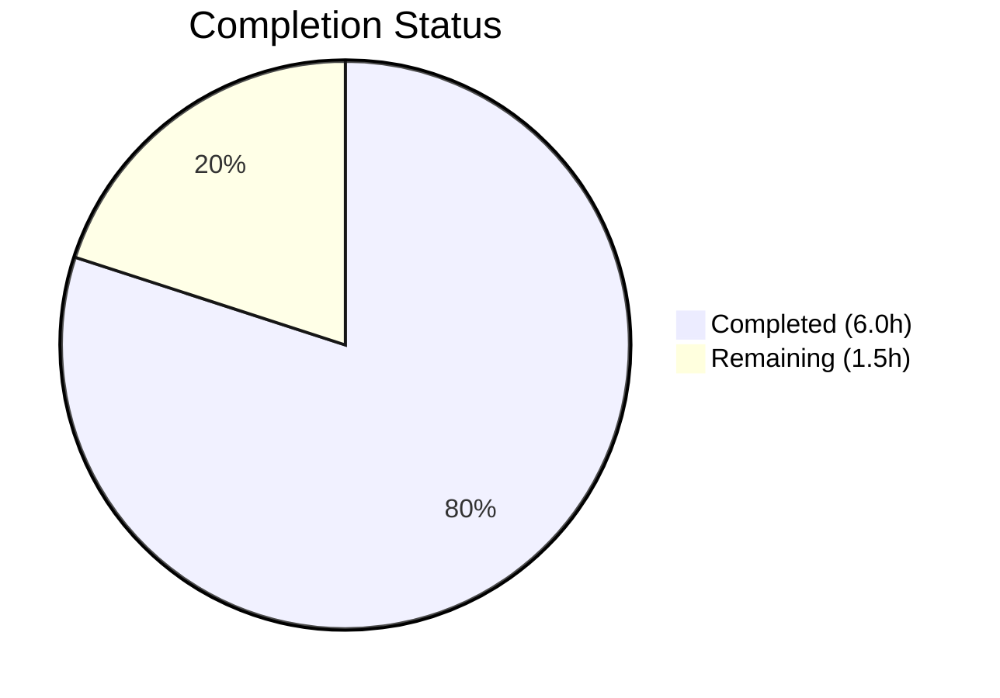

# Blitzy Project Guide

---

## 1. Executive Summary

### 1.1 Project Overview

This project is a targeted bug fix for the `hello_world` Express.js 5.2.1 application. The root `GET /` endpoint violated its documented API contract by returning `Content-Type: application/json` with a JSON-structured body (`{"status":"success","message":"Hello, World! Welcome to the Express server."}`) instead of the required `Content-Type: text/plain` with body `Hello, World!\n`. The fix modifies the route handler in `src/routes/index.js` and aligns 9 test assertions across 2 test files. All 371 tests pass with 100% code coverage. No new dependencies, files, or endpoints were added.

### 1.2 Completion Status



| Metric | Value |
|--------|-------|
| **Total Project Hours** | 7.5h |
| **Completed Hours (AI)** | 6.0h |
| **Remaining Hours** | 1.5h |
| **Completion Percentage** | **80.0%** |

**Calculation:** 6.0h completed / (6.0h + 1.5h) × 100 = 80.0%

### 1.3 Key Accomplishments

- [x] Root cause identified: `res.json()` in `src/routes/index.js:45` sets `Content-Type: application/json` instead of `text/plain`
- [x] Route handler fixed: replaced `res.json({...})` with `res.type('text/plain').send('Hello, World!\n')`
- [x] JSDoc comment updated to document plain-text response contract
- [x] 5 test assertions updated in `tests/routes/index.test.js` (content type, body, shape, HEAD)
- [x] 4 test blocks updated in `tests/app.test.js` (JSON endpoints, body, HEAD, compression)
- [x] All 371 tests passing with 100% code coverage across all metrics
- [x] Runtime verification confirmed: `GET /` returns `text/plain; charset=utf-8` with body `Hello, World!\n`
- [x] Full regression: all other endpoints (`/health`, `/api`, `/api/info`, error handlers) unaffected

### 1.4 Critical Unresolved Issues

| Issue | Impact | Owner | ETA |
|-------|--------|-------|-----|
| No critical issues | N/A | N/A | N/A |

All AAP-scoped deliverables have been implemented and validated. No compilation errors, test failures, or runtime issues remain.

### 1.5 Access Issues

No access issues identified. All dependencies install successfully via `npm ci`, all tests execute without external service requirements, and the application runs standalone on localhost.

### 1.6 Recommended Next Steps

1. **[High]** Human code review of the 3 modified files before merging the pull request
2. **[Medium]** Verify the fix in a staging/production environment after deployment
3. **[Low]** Notify any downstream consumers that `GET /` now returns `text/plain` instead of `application/json` — any client parsing JSON from this endpoint will need adjustment

---

## 2. Project Hours Breakdown

### 2.1 Completed Work Detail

| Component | Hours | Description |
|-----------|-------|-------------|
| Root Cause Analysis & Diagnosis | 1.5 | Express route handler investigation, code path tracing through middleware pipeline, root cause documentation across `src/routes/index.js`, `src/app.js`, and `server.js` |
| Source Code Fix (`src/routes/index.js`) | 1.0 | Replaced `res.json({...})` with `res.type('text/plain').send('Hello, World!\n')` at line 45; updated JSDoc comment at lines 36–39 to reflect plain-text contract |
| Route Test Alignment (`tests/routes/index.test.js`) | 1.5 | Updated 5 test assertions: content-type `application/json` → `text/plain`, body assertions from `res.body.status`/`res.body.message` to `res.text`, JSON shape test replaced with plain-text verification, HEAD test updated |
| Integration Test Alignment (`tests/app.test.js`) | 1.0 | Updated 4 test blocks: removed `/` from JSON endpoint array, replaced JSON body test with plain-text assertion, updated HEAD content-type, updated compression test |
| Regression Testing & Coverage Validation | 0.5 | Executed full 371-test suite across 11 test suites; verified 100% coverage (statements, branches, functions, lines); confirmed all coverage thresholds exceeded |
| Runtime Validation | 0.5 | Live server testing on port 3001: verified `GET /` returns `text/plain; charset=utf-8` with body `Hello, World!\n`; verified `GET /health`, `GET /api`, `POST /` (405) responses unaffected |
| **Total** | **6.0** | |

### 2.2 Remaining Work Detail

| Category | Hours | Priority |
|----------|-------|----------|
| Human Code Review | 1.0 | High — Review 3 modified files (`src/routes/index.js`, `tests/routes/index.test.js`, `tests/app.test.js`) for correctness before merge |
| Production Deployment Verification | 0.5 | Medium — Verify fix in staging/production environment; confirm `GET /` returns `text/plain` in deployed context |
| **Total** | **1.5** | |

### 2.3 Hours Validation

- Section 2.1 Total (Completed): **6.0h**
- Section 2.2 Total (Remaining): **1.5h**
- Sum: 6.0h + 1.5h = **7.5h** = Total Project Hours in Section 1.2 ✓

---

## 3. Test Results

| Test Category | Framework | Total Tests | Passed | Failed | Coverage % | Notes |
|---------------|-----------|-------------|--------|--------|------------|-------|
| Unit Tests — Config | Jest 30.3.0 | 33 | 33 | 0 | 100% | `tests/config/index.test.js` |
| Unit Tests — Middleware (errorHandler) | Jest 30.3.0 | 33 | 33 | 0 | 100% | `tests/middleware/errorHandler.test.js` |
| Unit Tests — Middleware (notFound) | Jest 30.3.0 | 28 | 28 | 0 | 100% | `tests/middleware/notFound.test.js` |
| Unit Tests — Middleware (validateInput) | Jest 30.3.0 | 55 | 55 | 0 | 100% | `tests/middleware/validateInput.test.js` |
| Unit Tests — Utils (logger) | Jest 30.3.0 | 8 | 8 | 0 | 100% | `tests/utils/logger.test.js` |
| Unit Tests — Utils (sanitizer) | Jest 30.3.0 | 42 | 42 | 0 | 100% | `tests/utils/sanitizer.test.js` |
| Integration Tests — App Pipeline | Jest 30.3.0 + Supertest 7.2.2 | 28 | 28 | 0 | 100% | `tests/app.test.js` — includes updated plain-text assertions |
| Integration Tests — Root Route | Jest 30.3.0 + Supertest 7.2.2 | 29 | 29 | 0 | 100% | `tests/routes/index.test.js` — includes updated plain-text assertions |
| Integration Tests — Health Route | Jest 30.3.0 + Supertest 7.2.2 | 29 | 29 | 0 | 100% | `tests/routes/health.test.js` |
| Integration Tests — API Routes | Jest 30.3.0 + Supertest 7.2.2 | 42 | 42 | 0 | 100% | `tests/routes/api.test.js` |
| Integration Tests — Server Lifecycle | Jest 30.3.0 | 44 | 44 | 0 | 100% | `tests/server.test.js` |
| **Totals** | | **371** | **371** | **0** | **100%** | All tests from Blitzy autonomous validation |

**Coverage Summary (Global):**
- Statements: 100%
- Branches: 100%
- Functions: 100%
- Lines: 100%

All thresholds exceeded (required: 90% lines/functions/statements, 80% branches).

---

## 4. Runtime Validation & UI Verification

### Runtime Health

| Endpoint | Method | Expected Status | Actual Status | Content-Type | Result |
|----------|--------|-----------------|---------------|--------------|--------|
| `/` | GET | 200 | 200 | `text/plain; charset=utf-8` | ✅ Operational |
| `/` | HEAD | 200 | 200 | `text/plain; charset=utf-8` | ✅ Operational |
| `/` | POST | 405 | 405 | `application/json; charset=utf-8` | ✅ Operational |
| `/health` | GET | 200 | 200 | `application/json; charset=utf-8` | ✅ Operational |
| `/api` | GET | 200 | 200 | `application/json; charset=utf-8` | ✅ Operational |
| `/api/info` | GET | 200 | 200 | `application/json; charset=utf-8` | ✅ Operational |

### Bug Fix Verification

- ✅ `GET /` returns `Content-Type: text/plain; charset=utf-8` (was `application/json; charset=utf-8`)
- ✅ `GET /` body is exactly `Hello, World!\n` (was `{"status":"success","message":"Hello, World! Welcome to the Express server."}`)
- ✅ `HEAD /` returns `Content-Type: text/plain; charset=utf-8` with empty body
- ✅ HTTP status code remains `200 OK` (unchanged)

### Regression Verification

- ✅ `GET /health` — JSON response with health telemetry (unaffected)
- ✅ `GET /api` — JSON response with API welcome (unaffected)
- ✅ `GET /api/info` — JSON response with server metadata (unaffected)
- ✅ `POST /` — 405 Method Not Allowed with JSON error body and `Allow: GET, HEAD` header (unaffected)
- ✅ `GET /?unexpected=param` — 400 Validation failed with JSON error body (unaffected)
- ✅ Security headers (Helmet) present on all responses (unaffected)
- ✅ CORS headers present (`Access-Control-Allow-Origin: *`) (unaffected)
- ✅ Compression middleware does not interfere with plain-text delivery (verified)

### UI Verification

Not applicable — this is a backend API-only application with no UI components.

---

## 5. Compliance & Quality Review

| AAP Requirement | File(s) | Status | Evidence |
|-----------------|---------|--------|----------|
| Fix `res.json()` → `res.type('text/plain').send()` at line 45 | `src/routes/index.js` | ✅ Pass | `git diff` confirms change from `res.json({...})` to `res.type('text/plain').send('Hello, World!\n')` |
| Update JSDoc comment to reference plain-text | `src/routes/index.js` | ✅ Pass | Lines 36–39 updated: "Returns a plain-text response" |
| Update content-type assertion (lines 53–58) | `tests/routes/index.test.js` | ✅ Pass | Changed from `application/json` to `text/plain` |
| Update body assertion (lines 60–62) | `tests/routes/index.test.js` | ✅ Pass | Changed from `res.body.status` to `res.text === 'Hello, World!\n'` |
| Update message assertion (lines 65–69) | `tests/routes/index.test.js` | ✅ Pass | Changed to `res.text === 'Hello, World!\n'` |
| Replace JSON shape test (lines 72–81) | `tests/routes/index.test.js` | ✅ Pass | Replaced with plain-text body + no JSON structure assertions |
| Update HEAD test (lines 93–97) | `tests/routes/index.test.js` | ✅ Pass | Changed from `application/json` to `text/plain` |
| Remove `/` from JSON endpoint array (line 110) | `tests/app.test.js` | ✅ Pass | Array now `['/health', '/api', '/api/info']` |
| Replace JSON body test (lines 117–123) | `tests/app.test.js` | ✅ Pass | Now asserts `text/plain` and `res.text === 'Hello, World!\n'` |
| Update HEAD content-type (line 136) | `tests/app.test.js` | ✅ Pass | Changed from `application/json` to `text/plain` |
| Update compression test (lines 281–289) | `tests/app.test.js` | ✅ Pass | Changed from JSON body assertions to `res.text === 'Hello, World!\n'` |

### Quality Benchmarks

| Benchmark | Required | Actual | Status |
|-----------|----------|--------|--------|
| All 371 tests pass | 371/371 | 371/371 | ✅ Pass |
| Line coverage ≥ 90% | 90% | 100% | ✅ Pass |
| Function coverage ≥ 90% | 90% | 100% | ✅ Pass |
| Branch coverage ≥ 80% | 80% | 100% | ✅ Pass |
| Statement coverage ≥ 90% | 90% | 100% | ✅ Pass |
| No new dependencies | 0 | 0 | ✅ Pass |
| No files created or deleted | 0 | 0 | ✅ Pass |
| Clean git status | Yes | Yes (only untracked `coverage/`) | ✅ Pass |

### Coding Standard Compliance

| Standard | Status |
|----------|--------|
| CommonJS (`require`/`module.exports`) | ✅ Maintained |
| `'use strict'` declarations | ✅ Present in all modified files |
| Express 5.2.1 idiomatic API (`res.type()`) | ✅ Used correctly |
| JSDoc annotations | ✅ Updated to reflect plain-text |
| 2-space indentation, single quotes, semicolons | ✅ Maintained |
| No TODO/FIXME/placeholder comments | ✅ Verified |

---

## 6. Risk Assessment

| Risk | Category | Severity | Probability | Mitigation | Status |
|------|----------|----------|-------------|------------|--------|
| Downstream consumers parsing JSON from `GET /` will break | Integration | Medium | Medium | Notify API consumers before deployment; update any client documentation | ⚠️ Open — requires human communication |
| `README.md` documents `GET /` as returning JSON | Technical | Low | High | The README at endpoint table states "Welcome message (JSON)" — update documentation post-merge | ⚠️ Open — out of AAP scope per Section 0.5.2 |
| Compression middleware interaction with `text/plain` | Technical | Low | Low | Verified via runtime testing and dedicated compression test — no issues observed | ✅ Mitigated |
| Test assertions encode new behavior correctly | Technical | Low | Low | All 371 tests pass with 100% coverage; assertions verified against git diff | ✅ Mitigated |
| Express 5.2.1 `res.type()` behavior edge cases | Technical | Low | Very Low | `res.type('text/plain')` is the Express-idiomatic API; confirmed charset auto-append behavior | ✅ Mitigated |

---

## 7. Visual Project Status


**Breakdown:**
- **Completed Work: 6.0 hours** (80.0%) — Root cause analysis, source code fix, test alignment, regression testing, runtime validation
- **Remaining Work: 1.5 hours** (20.0%) — Human code review (1.0h), production deployment verification (0.5h)

### Remaining Hours by Category

| Category | Hours |
|----------|-------|
| Human Code Review | 1.0 |
| Production Deployment Verification | 0.5 |
| **Total** | **1.5** |

---

## 8. Summary & Recommendations

### Achievement Summary

The project successfully fixed the `GET /` endpoint response contract violation in the `hello_world` Express.js application. The root cause was a `res.json()` call in `src/routes/index.js` that set `Content-Type: application/json` instead of the required `text/plain`. The fix replaced this with `res.type('text/plain').send('Hello, World!\n')`, and all 9 affected test assertions across 2 test files were aligned with the corrected behavior.

**The project is 80.0% complete** — 6.0 hours of AAP-scoped work completed out of 7.5 total hours. All autonomous deliverables specified in the Agent Action Plan have been implemented and validated. The remaining 1.5 hours consist of human-only activities: code review and production deployment verification.

### Production Readiness Assessment

| Criterion | Status |
|-----------|--------|
| All AAP deliverables implemented | ✅ Complete |
| Full test suite passing (371/371) | ✅ Complete |
| Code coverage at 100% | ✅ Complete |
| Runtime verification successful | ✅ Complete |
| Regression testing passed | ✅ Complete |
| No compilation errors | ✅ Complete |
| Clean git state | ✅ Complete |
| Human code review | ⏳ Pending |
| Production deployment verification | ⏳ Pending |

### Recommendations

1. **Merge after human code review** — The fix is minimal (3 files, 29 insertions, 39 deletions) and fully validated. A focused review of the route handler change and test assertion updates should be sufficient.
2. **Communicate the API contract change** — Any downstream clients consuming JSON from `GET /` should be notified. Although the fix restores the documented contract, the old JSON format may have been depended upon.
3. **Consider updating `README.md`** — The endpoint table in the README references "Welcome message (JSON)" for `GET /`. While out of the AAP scope, updating this documentation would prevent future confusion.

---

## 9. Development Guide

### System Prerequisites

| Software | Required Version | Verified Version |
|----------|-----------------|-----------------|
| Node.js | >= 18.0.0 | v20.19.5 |
| npm | >= 8.0.0 | 10.8.2 |
| Operating System | Any (Linux, macOS, Windows) | Linux (Ubuntu) |

### Environment Setup

1. **Clone the repository and switch to the bug-fix branch:**

```bash
git clone <repository-url>
cd hello_world
git checkout blitzy-4606a2f9-979b-4b7b-b1e7-46c8d0ecf1cd
```

2. **Configure environment variables:**

The `.env` file is pre-configured with development defaults. To create one from scratch:

```bash
cp .env.example .env
```

Default `.env` values:

```
NODE_ENV=development
PORT=3000
HOST=0.0.0.0
LOG_LEVEL=debug
CORS_ORIGIN=*
RATE_LIMIT_WINDOW_MS=900000
RATE_LIMIT_MAX=100
BODY_LIMIT=10kb
```

### Dependency Installation

```bash
npm ci
```

Expected output: `added 432 packages` with 0 vulnerabilities.

### Running Tests

Run the full test suite with coverage:

```bash
CI=true npx jest --watchAll=false --ci --verbose --coverage
```

Expected output:
- `Test Suites: 11 passed, 11 total`
- `Tests: 371 passed, 371 total`
- Coverage: 100% across all metrics

Run a specific test file:

```bash
CI=true npx jest --watchAll=false --ci --verbose tests/routes/index.test.js
```

### Starting the Application

```bash
node server.js
```

Expected console output:
```
Server is running on http://0.0.0.0:3000 in development mode
```

For PM2 production mode:

```bash
npm run start:pm2
```

### Verification Steps

After starting the server, verify the bug fix:

```bash
# Verify GET / returns text/plain
curl -i http://localhost:3000/

# Expected:
# HTTP/1.1 200 OK
# Content-Type: text/plain; charset=utf-8
# Hello, World!
```

Verify other endpoints are unaffected:

```bash
# Health endpoint (should remain JSON)
curl -s http://localhost:3000/health | head -c 100

# API endpoint (should remain JSON)
curl -s http://localhost:3000/api | head -c 100

# 405 Method Not Allowed (should return JSON error)
curl -X POST -i http://localhost:3000/
```

### Stopping the Application

```bash
# If running with node:
# Press Ctrl+C

# If running with PM2:
npm run stop:pm2
```

### Troubleshooting

| Issue | Cause | Resolution |
|-------|-------|------------|
| `EADDRINUSE: address already in use :::3000` | Port 3000 is occupied | Kill the process using port 3000: `lsof -ti:3000 \| xargs kill -9` or change `PORT` in `.env` |
| `Cannot find module 'express'` | Dependencies not installed | Run `npm ci` to install dependencies |
| Tests fail with `watch` mode | Jest enters interactive mode | Use `CI=true npx jest --watchAll=false --ci` to prevent watch mode |
| `ENOENT: no such file or directory, open '.env'` | Missing environment file | Run `cp .env.example .env` to create from template |

---

## 10. Appendices

### A. Command Reference

| Command | Purpose |
|---------|---------|
| `npm ci` | Install exact dependency versions from lockfile |
| `node server.js` | Start the Express server |
| `npm test` | Run all tests with coverage and verbose output |
| `npm run test:ci` | Run tests in CI mode (no watch, with coverage) |
| `npm run start:pm2` | Start server via PM2 cluster mode |
| `npm run stop:pm2` | Stop PM2 managed server |
| `CI=true npx jest --watchAll=false --ci --verbose` | Run tests without watch mode |

### B. Port Reference

| Service | Port | Configuration |
|---------|------|---------------|
| Express HTTP Server | 3000 (default) | `PORT` in `.env` |
| Bind Address | 0.0.0.0 (default) | `HOST` in `.env` |

### C. Key File Locations

| File | Purpose |
|------|---------|
| `server.js` | Application entry point and lifecycle management |
| `src/app.js` | Express application factory with middleware pipeline |
| `src/routes/index.js` | Root route handler (`GET /`) — **modified in this fix** |
| `src/routes/health.js` | Health check endpoint (`GET /health`) |
| `src/routes/api.js` | API routes (`GET /api`, `GET /api/info`) |
| `src/config/index.js` | Centralized environment configuration |
| `src/middleware/errorHandler.js` | Global error handler middleware |
| `src/middleware/notFound.js` | 404 catch-all middleware |
| `src/middleware/validateInput.js` | Zod-based input validation middleware |
| `src/utils/logger.js` | Winston structured logger |
| `src/utils/sanitizer.js` | Input sanitization utilities |
| `tests/routes/index.test.js` | Root route tests — **modified in this fix** |
| `tests/app.test.js` | App integration tests — **modified in this fix** |
| `jest.config.js` | Jest test runner configuration |
| `.env` | Runtime environment variables |
| `.env.example` | Environment variable template |
| `ecosystem.config.js` | PM2 production deployment configuration |

### D. Technology Versions

| Technology | Version | Purpose |
|------------|---------|---------|
| Node.js | >= 18.0.0 (verified: v20.19.5) | Runtime environment |
| Express.js | ^5.2.1 | Web framework |
| Jest | ^30.3.0 | Test runner |
| Supertest | ^7.2.2 | HTTP integration testing |
| Helmet | ^8.1.0 | Security headers |
| CORS | ^2.8.6 | Cross-origin resource sharing |
| Compression | ^1.8.1 | Response compression |
| Morgan | ^1.10.1 | HTTP request logging |
| Winston | ^3.19.0 | Structured logging |
| Zod | ^3.25.0 | Input validation schemas |
| express-rate-limit | ^8.3.1 | Rate limiting |
| dotenv | ^17.3.1 | Environment variable loading |

### E. Environment Variable Reference

| Variable | Default | Description |
|----------|---------|-------------|
| `NODE_ENV` | `development` | Application environment (`development`, `production`, `test`) |
| `PORT` | `3000` | HTTP server listen port |
| `HOST` | `0.0.0.0` | HTTP server bind address |
| `LOG_LEVEL` | `debug` | Winston log level (`error`, `warn`, `info`, `http`, `debug`) |
| `CORS_ORIGIN` | `*` | Allowed CORS origins |
| `RATE_LIMIT_WINDOW_MS` | `900000` | Rate limit window in milliseconds (15 minutes) |
| `RATE_LIMIT_MAX` | `100` | Maximum requests per rate limit window |
| `BODY_LIMIT` | `10kb` | Maximum request body size |

### G. Glossary

| Term | Definition |
|------|------------|
| AAP | Agent Action Plan — the primary directive containing all project requirements |
| API Contract | The documented specification of an endpoint's request/response format |
| Content-Type | HTTP header indicating the media type of the response body |
| `res.json()` | Express method that serializes data as JSON and sets `Content-Type: application/json` |
| `res.type()` | Express method that sets the `Content-Type` header to the specified MIME type |
| `res.send()` | Express method that sends the HTTP response body |
| Supertest | HTTP assertion library for testing Express applications without starting a server |
| Zod | TypeScript-first schema validation library used for input validation |