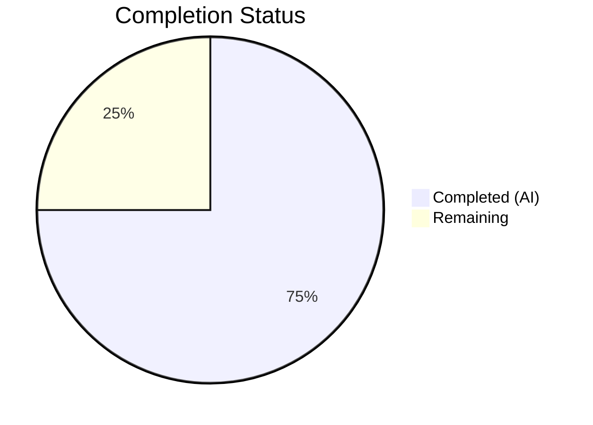
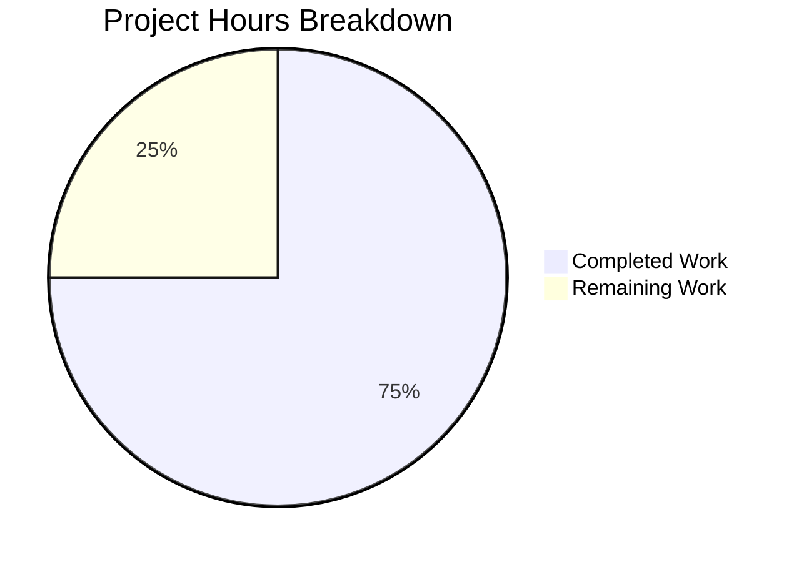

# Blitzy Project Guide

---

## 1. Executive Summary

### 1.1 Project Overview

This project addresses a **package metadata bug** in the `hello_world` Node.js HTTP server package. The `"main"` field in `package.json` declared `"index.js"` as the package entrypoint, but no such file exists — the actual entrypoint is `server.js`. This caused deterministic `MODULE_NOT_FOUND` errors for any consumer relying on Node.js module resolution (`require('.')` or `require('hello_world')`). The fix is a single-field correction in `package.json`, restoring correct entrypoint metadata with zero impact on runtime behavior, HTTP response contracts, or the existing 15-test suite.

### 1.2 Completion Status



| Metric | Value |
|--------|-------|
| **Total Project Hours** | 4 |
| **Completed Hours (AI)** | 3 |
| **Remaining Hours** | 1 |
| **Completion Percentage** | **75%** |

**Calculation:** 3 completed hours / (3 completed + 1 remaining) = 3 / 4 = **75% complete**

### 1.3 Key Accomplishments

- [x] Root cause definitively identified: `"main": "index.js"` in `package.json` line 5 references a non-existent file
- [x] Fix applied: `"main"` field corrected from `"index.js"` to `"server.js"`
- [x] Bug elimination verified: `node -e "require('.')"` loads successfully (previously threw `MODULE_NOT_FOUND`)
- [x] Full regression suite passed: 15/15 tests, 0 failures
- [x] 100% code coverage maintained across statements, branches, functions, and lines
- [x] Runtime verified: server starts on `127.0.0.1:3000`, responds `200 OK` with `Hello, World!\n`
- [x] Metadata consistency confirmed: `main: server.js | exists: true`
- [x] Scope compliance enforced: only `package.json` modified, no other files touched

### 1.4 Critical Unresolved Issues

| Issue | Impact | Owner | ETA |
|-------|--------|-------|-----|
| No critical unresolved issues | N/A | N/A | N/A |

All in-scope AAP work is complete with zero errors. The bug fix is fully validated and ready for human review.

### 1.5 Access Issues

No access issues identified. All dependencies installed successfully via `npm ci`, and all validation commands executed without permission or credential errors.

### 1.6 Recommended Next Steps

1. **[High]** Review and merge the pull request — verify the single-line `package.json` change
2. **[Medium]** Post-merge verification — run `node -e "require('.')"` in the target/integration environment to confirm fix propagates
3. **[Low]** Consider adding a CI check that validates `"main"` field points to an existing file to prevent recurrence

---

## 2. Project Hours Breakdown

### 2.1 Completed Work Detail

| Component | Hours | Description |
|-----------|-------|-------------|
| Root Cause Diagnosis | 1.0 | Analyzed `package.json`, `server.js`, `tests/server.test.js`; confirmed `index.js` does not exist; reproduced `MODULE_NOT_FOUND` error via `node -e "require('.')"` (AAP §0.2–0.3) |
| Fix Implementation | 0.5 | Changed `"main": "index.js"` to `"main": "server.js"` in `package.json` line 5; committed as `108bcf6` (AAP §0.4) |
| Verification & Validation | 1.5 | Executed bug elimination test, full regression suite (15/15 pass), 100% coverage check, runtime server verification, metadata consistency check, and scope compliance audit (AAP §0.6) |
| **Total** | **3.0** | |

### 2.2 Remaining Work Detail

| Category | Hours | Priority |
|----------|-------|----------|
| PR Review & Merge | 0.5 | High |
| Post-Merge Integration Verification | 0.5 | Medium |
| **Total** | **1.0** | |

**Integrity check:** Section 2.1 (3.0h) + Section 2.2 (1.0h) = 4.0h = Total Project Hours in Section 1.2 ✓

---

## 3. Test Results

| Test Category | Framework | Total Tests | Passed | Failed | Coverage % | Notes |
|---------------|-----------|-------------|--------|--------|------------|-------|
| Unit / Integration | Jest 29.7.0 + Supertest 7.2.2 | 15 | 15 | 0 | 100% | HTTP method coverage (GET, POST, PUT, DELETE, PATCH, OPTIONS, HEAD), multi-path validation, response contract enforcement, startup message verification, server lifecycle checks |

**Summary:** All 15 tests executed by Blitzy's autonomous validation pipeline passed with 100% code coverage across statements, branches, functions, and lines for `server.js`. Zero test failures, zero regressions introduced by the fix.

**Coverage Breakdown:**

| File | Statements | Branches | Functions | Lines |
|------|-----------|----------|-----------|-------|
| server.js | 100% | 100% | 100% | 100% |

---

## 4. Runtime Validation & UI Verification

**Runtime Health:**

- ✅ **Server startup:** `node server.js` starts successfully, logs `Server running at http://127.0.0.1:3000/`
- ✅ **HTTP response contract:** `curl http://127.0.0.1:3000/` returns `Hello, World!` with `200 OK`, `Content-Type: text/plain`
- ✅ **Package entrypoint resolution:** `node -e "require('.')"` loads `server.js` without error (previously threw `MODULE_NOT_FOUND`)
- ✅ **Metadata consistency:** `main: server.js | exists: true`
- ✅ **Module export:** `require('.')` returns an `http.Server` object with `listening` property

**Bug Fix Verification:**

- ✅ **Before fix:** `node -e "require('.')"` threw `Error: Cannot find module '.../index.js'`
- ✅ **After fix:** `node -e "require('.')"` loads successfully, returns `Loaded: SUCCESS`

**UI Verification:** N/A — this is a backend-only Node.js HTTP server with no UI component.

---

## 5. Compliance & Quality Review

| Compliance Area | Status | Details |
|-----------------|--------|---------|
| AAP Fix Specification (§0.4) | ✅ Pass | `"main"` field changed from `"index.js"` to `"server.js"` exactly as specified |
| Scope Boundaries (§0.5) | ✅ Pass | Only `package.json` modified; no other files created, deleted, or changed |
| Excluded Files (§0.5.2) | ✅ Pass | `server.js`, `tests/server.test.js`, `package-lock.json`, `README.md`, `blitzy/` all untouched |
| User Rules (§0.7.1) | ✅ Pass | No GitHub Actions workflow files created or modified |
| Bug Fix Discipline (§0.7.2) | ✅ Pass | Zero modifications outside the bug fix; all existing contracts preserved |
| Test Regression (§0.6.2) | ✅ Pass | 15/15 tests pass, 100% coverage maintained, response contract unchanged |
| Node.js v20.x Compatibility | ✅ Pass | Validated on Node.js v20.19.5, npm 10.8.2 |
| CommonJS Module System | ✅ Pass | No ES Module syntax introduced; `require()`/`module.exports` preserved |
| Dependency Security | ✅ Pass | `npm ci` reports 0 vulnerabilities |
| Package Identity | ✅ Pass | `name`, `version`, `description`, `author`, `license`, `scripts`, `devDependencies` all unchanged |

**Autonomous Fixes Applied:** The prior coding agent applied the single-line fix to `package.json` (commit `108bcf6`). The Final Validator confirmed the fix and ran the complete verification protocol with zero issues found.

---

## 6. Risk Assessment

| Risk | Category | Severity | Probability | Mitigation | Status |
|------|----------|----------|-------------|------------|--------|
| External cache of old `main` value | Integration | Low | Low | Clear npm/Node.js module caches after deployment; run `node -e "require('.')"` to verify | Open — requires post-merge verification |
| No CI gate for `main` field validity | Operational | Low | Low | Add a CI check that validates `package.json` `main` points to an existing file | Open — enhancement for future |
| Server binds to localhost only | Technical | Info | N/A | Intentional design for Backprop test harness; not a production web server | Accepted |
| No HTTPS/TLS support | Security | Info | N/A | Out of scope — this is a minimal test harness, not a production service | Accepted |

**Risk Summary:** No high or medium severity risks identified. The fix is a single-field metadata correction with no behavioral side effects. The two open items are low-severity post-deployment hygiene tasks.

---

## 7. Visual Project Status



**Integrity check:** Completed Work (3h) + Remaining Work (1h) = 4h = Total Project Hours ✓
**Remaining Work (1h) matches:** Section 1.2 Remaining Hours (1h) ✓ and Section 2.2 Total (1h) ✓

---

## 8. Summary & Recommendations

### Achievements

The Blitzy autonomous pipeline successfully diagnosed, fixed, and verified a package metadata bug in the `hello_world` Node.js project. The root cause — a `"main"` field in `package.json` pointing to a non-existent `index.js` — was identified through systematic file analysis and reproduction. The fix (a single-field change to `"server.js"`) was applied, committed, and validated through a comprehensive verification protocol including all 15 regression tests (100% pass rate), 100% code coverage confirmation, runtime server verification, and metadata consistency checks.

### Completion

The project is **75% complete** (3 hours completed out of 4 total hours). All AAP-scoped autonomous deliverables are finished. The remaining 1 hour consists of human-required activities: PR review/merge (0.5h) and post-merge integration verification (0.5h).

### Critical Path to Production

1. A human developer reviews and approves the single-line change in `package.json`
2. The PR is merged to the target branch
3. Post-merge verification confirms `require('.')` resolves correctly in the integration environment

### Production Readiness Assessment

The fix is production-ready from a code perspective. All tests pass, coverage is 100%, the runtime behaves identically, and no scope violations were introduced. The only gate to production is human PR review and merge.

---

## 9. Development Guide

### System Prerequisites

| Software | Version | Purpose |
|----------|---------|---------|
| Node.js | v20.x (validated on v20.19.5) | JavaScript runtime |
| npm | v10.x (validated on v10.8.2) | Package manager |
| Git | 2.x+ | Version control |

### Environment Setup

```bash
# Clone the repository
git clone <repository-url>
cd <repository-directory>

# Checkout the fix branch
git checkout blitzy-ef4baa44-8b2e-4b08-acc6-60ec5e23d172
```

No environment variables are required. The server uses hardcoded defaults (`127.0.0.1:3000`).

### Dependency Installation

```bash
# Install dependencies from lockfile (recommended for reproducibility)
npm ci
```

**Expected output:** `found 0 vulnerabilities`

### Running the Application

```bash
# Start the server
node server.js
```

**Expected output:** `Server running at http://127.0.0.1:3000/`

### Verification Steps

```bash
# 1. Verify the server responds correctly
curl http://127.0.0.1:3000/
# Expected: Hello, World!

# 2. Verify the bug fix — package entrypoint resolution
node -e "const s = require('.'); console.log('Type:', typeof s); console.log('Listening:', s.listening !== undefined); s.close();"
# Expected: Type: object / Listening: true

# 3. Verify metadata consistency
node -e "const p=require('./package.json'); const fs=require('fs'); console.log('main:', p.main, '| exists:', fs.existsSync(p.main));"
# Expected: main: server.js | exists: true
```

### Running Tests

```bash
# Run full test suite
CI=true npx jest --forceExit --detectOpenHandles --watchAll=false
# Expected: 15 passed, 0 failed

# Run tests with coverage report
CI=true npx jest --coverage --forceExit --detectOpenHandles --watchAll=false
# Expected: 100% across all metrics
```

### Troubleshooting

| Issue | Cause | Resolution |
|-------|-------|------------|
| `EADDRINUSE: address already in use :::3000` | Port 3000 already occupied | Kill the existing process: `lsof -ti:3000 \| xargs kill -9` |
| `MODULE_NOT_FOUND: Cannot find module './index.js'` | Fix not applied; `main` field still points to `index.js` | Verify `package.json` has `"main": "server.js"` |
| Tests hang in watch mode | Missing `--watchAll=false` flag | Use `CI=true npx jest --forceExit --detectOpenHandles --watchAll=false` |

---

## 10. Appendices

### A. Command Reference

| Command | Purpose |
|---------|---------|
| `node server.js` | Start the HTTP server |
| `npm ci` | Install dependencies from lockfile |
| `CI=true npx jest --forceExit --detectOpenHandles --watchAll=false` | Run test suite |
| `CI=true npx jest --coverage --forceExit --detectOpenHandles --watchAll=false` | Run tests with coverage |
| `node -e "require('.')"` | Verify package entrypoint resolution |
| `curl http://127.0.0.1:3000/` | Test server HTTP response |

### B. Port Reference

| Service | Host | Port | Protocol |
|---------|------|------|----------|
| HTTP Server | 127.0.0.1 | 3000 | HTTP |

### C. Key File Locations

| File | Purpose |
|------|---------|
| `package.json` | npm package manifest (contains the fixed `main` field) |
| `server.js` | HTTP server entrypoint (16 lines, `http.createServer`) |
| `tests/server.test.js` | Jest test suite (163 lines, 15 tests) |
| `package-lock.json` | Dependency lockfile (v3) |
| `README.md` | Project documentation |

### D. Technology Versions

| Technology | Version | Role |
|------------|---------|------|
| Node.js | v20.19.5 | Runtime |
| npm | 10.8.2 | Package manager |
| Jest | ^29.7.0 | Test framework (devDependency) |
| Supertest | ^7.2.2 | HTTP assertion library (devDependency) |

### E. Environment Variable Reference

No environment variables are required. The server uses hardcoded configuration:

| Setting | Value | Location |
|---------|-------|----------|
| Hostname | `127.0.0.1` | `server.js` line 3 |
| Port | `3000` | `server.js` line 4 |

### G. Glossary

| Term | Definition |
|------|------------|
| `main` field | The `package.json` property that defines the default module loaded when a package is required by name or directory path |
| `MODULE_NOT_FOUND` | Node.js error thrown when `require()` cannot locate the specified module file |
| CommonJS | Node.js module system using `require()` and `module.exports` |
| Backprop | The integration/testing platform this `hello_world` package serves as a test harness for |