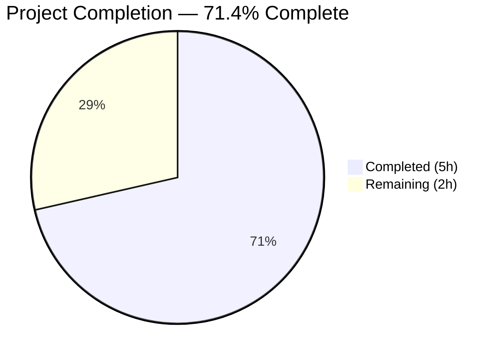
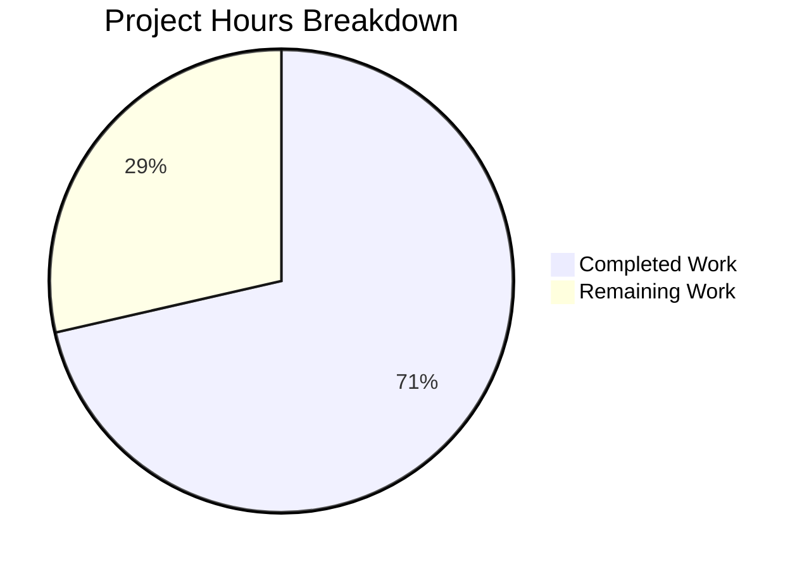

# Blitzy Project Guide — Express.js Integration for hao-backprop-test

---

## 1. Executive Summary

### 1.1 Project Overview

This project migrates a minimal Node.js tutorial HTTP server from the bare `http` module to Express.js 5.2.1, the industry-standard Node.js web framework. The migration preserves the original `GET /` "Hello, World!" endpoint while introducing a new `GET /evening` and `POST /evening` ("Good evening") endpoint pair. The `POST /evening` route enforces a user-specified rule returning HTTP 201 Created. The target audience is tutorial learners and integration testers. All four repository files (`server.js`, `package.json`, `package-lock.json`, `README.md`) were updated to deliver a complete, runtime-verified Express.js application binding to `127.0.0.1:3000`.

### 1.2 Completion Status



| Metric | Value |
|--------|-------|
| **Total Project Hours** | **7** |
| **Completed Hours (AI)** | **5** |
| **Remaining Hours** | **2** |
| **Completion Percentage** | **71.4%** |

> **Calculation:** 5 completed hours / (5 completed + 2 remaining) = 5 / 7 = **71.4% complete**

All 12 AAP-scoped deliverables are fully implemented and validated. The remaining 2 hours represent standard path-to-production hardening activities (environment configuration, security headers, process management, graceful shutdown) that are not part of the AAP feature scope but are recommended before production deployment.

### 1.3 Key Accomplishments

- [x] Migrated `server.js` from bare `http.createServer()` to Express.js 5.2.1 application
- [x] Preserved `GET /` endpoint returning `"Hello, World!"` with HTTP 200
- [x] Added `GET /evening` endpoint returning `"Good evening"` with HTTP 200
- [x] Added `POST /evening` endpoint returning `"Good evening"` with HTTP 201 Created (user rule enforced)
- [x] Added `express@^5.2.1` as production dependency in `package.json`
- [x] Corrected `main` field from `index.js` to `server.js`
- [x] Added `"start": "node server.js"` script enabling `npm start`
- [x] Regenerated `package-lock.json` with full Express dependency tree (66 packages, 0 vulnerabilities)
- [x] Rewrote `README.md` with endpoint reference table, prerequisites, and setup instructions
- [x] Verified all endpoints at runtime with `curl` — all return correct status codes and response bodies
- [x] Maintained CommonJS `require()` syntax and tutorial-level simplicity throughout

### 1.4 Critical Unresolved Issues

| Issue | Impact | Owner | ETA |
|-------|--------|-------|-----|
| No automated test suite | Cannot run regression tests; `npm test` exits with error (by design per AAP scope) | Human Developer | 2–4 hours if elected |
| `X-Powered-By: Express` header exposed | Minor security information disclosure; reveals server framework to clients | Human Developer | 0.5 hours |

### 1.5 Access Issues

No access issues identified. The project requires no external service credentials, API keys, or special repository permissions. All dependencies resolve from the public npm registry.

### 1.6 Recommended Next Steps

1. **[Medium]** Configure environment variables for `PORT` and `HOST` to support deployment across environments
2. **[Medium]** Add `helmet` or manual header configuration to disable `X-Powered-By` and set security response headers
3. **[Low]** Set up a process manager (PM2 or systemd) for production-grade server lifecycle management
4. **[Low]** Implement graceful shutdown handling (`SIGTERM`/`SIGINT` listeners) for container or cloud deployments

---

## 2. Project Hours Breakdown

### 2.1 Completed Work Detail

| Component | Hours | Description |
|-----------|-------|-------------|
| Express.js migration (`server.js`) | 2 | Refactored from bare `http` module to Express 5.2.1 app; implemented `GET /`, `GET /evening`, `POST /evening` (201) route handlers; preserved hostname/port binding |
| Package configuration (`package.json`) | 0.5 | Added `express@^5.2.1` dependency, corrected `main` field to `server.js`, added `start` script |
| Dependency installation (`package-lock.json`) | 0.5 | Ran `npm install`, regenerated lockfile with full Express dependency tree (66 packages, 0 vulnerabilities) |
| Documentation (`README.md`) | 1 | Comprehensive rewrite with project description, prerequisites, setup instructions, endpoint reference table with methods/paths/status codes, and license |
| Validation and runtime testing | 1 | Syntax validation (`node -c`), Express module loading verification, all 3 endpoints tested with `curl` confirming correct status codes and response bodies, 404 default handler verified |
| **Total** | **5** | |

### 2.2 Remaining Work Detail

| Category | Hours | Priority |
|----------|-------|----------|
| Environment variable configuration (PORT/HOST) | 0.5 | Medium |
| Security hardening (response headers, X-Powered-By) | 0.5 | Medium |
| Production process management (PM2/systemd setup) | 0.5 | Low |
| Graceful shutdown handling (SIGTERM/SIGINT) | 0.5 | Low |
| **Total** | **2** | |

---

## 3. Test Results

| Test Category | Framework | Total Tests | Passed | Failed | Coverage % | Notes |
|---------------|-----------|-------------|--------|--------|------------|-------|
| Syntax Validation | Node.js (`node -c`) | 1 | 1 | 0 | 100% | `server.js` syntax check passed |
| Module Loading | Node.js (`node -e`) | 1 | 1 | 0 | 100% | `require('express')` loads successfully |
| Runtime Endpoint — GET / | curl | 1 | 1 | 0 | 100% | HTTP 200, body: `Hello, World!` |
| Runtime Endpoint — GET /evening | curl | 1 | 1 | 0 | 100% | HTTP 200, body: `Good evening` |
| Runtime Endpoint — POST /evening | curl | 1 | 1 | 0 | 100% | HTTP 201 Created, body: `Good evening` |
| Runtime Endpoint — GET /unknown | curl | 1 | 1 | 0 | 100% | HTTP 404 Not Found (Express default) |
| Dependency Audit | npm | 1 | 1 | 0 | 100% | 0 vulnerabilities in 66 packages |
| **Total** | | **7** | **7** | **0** | **100%** | All Blitzy autonomous validations passed |

> **Note:** The project has no formal test framework by design (AAP §0.6.2 — test framework addition is explicitly out of scope). `npm test` outputs `"Error: no test specified"` and exits with code 1, which is the expected behavior per the placeholder test script.

---

## 4. Runtime Validation & UI Verification

### Runtime Health

- ✅ **Server startup**: `npm start` launches Express server at `http://127.0.0.1:3000/` with console confirmation message
- ✅ **GET /**: Returns HTTP 200 with body `Hello, World!` — original endpoint preserved
- ✅ **GET /evening**: Returns HTTP 200 with body `Good evening` — new endpoint operational
- ✅ **POST /evening**: Returns HTTP 201 Created with body `Good evening` — user rule enforced
- ✅ **404 handling**: Unmatched routes (e.g., `GET /unknown`) return HTTP 404 via Express default handler
- ✅ **Response headers**: `Content-Type: text/html; charset=utf-8` set automatically by Express `res.send()`
- ✅ **Dependencies**: 66 packages installed with 0 vulnerabilities

### API Integration Outcomes

- ✅ Express 5.2.1 fully operational with Node.js v20.19.5
- ✅ CommonJS `require()` module loading works correctly
- ✅ `app.listen()` binds to `127.0.0.1:3000` as configured

### UI Verification

Not applicable — this is a backend-only API project with no user interface or frontend assets.

---

## 5. Compliance & Quality Review

| AAP Requirement | Status | Evidence |
|----------------|--------|----------|
| Integrate Express.js as HTTP framework | ✅ Pass | `server.js` line 1: `const express = require('express')` |
| Preserve GET / "Hello, World!" endpoint | ✅ Pass | Runtime: `curl http://127.0.0.1:3000/` → 200, `Hello, World!` |
| Add GET /evening "Good evening" endpoint | ✅ Pass | Runtime: `curl http://127.0.0.1:3000/evening` → 200, `Good evening` |
| POST /evening returns 201 Created (user rule) | ✅ Pass | Runtime: `curl -X POST http://127.0.0.1:3000/evening` → 201, `Good evening` |
| Add express dependency to package.json | ✅ Pass | `package.json` line 13: `"express": "^5.2.1"` |
| Fix main field to server.js | ✅ Pass | `package.json` line 5: `"main": "server.js"` |
| Add start script to package.json | ✅ Pass | `package.json` line 7: `"start": "node server.js"` |
| Regenerate package-lock.json | ✅ Pass | 827-line lockfile with complete Express dependency tree |
| Update README.md with Express docs | ✅ Pass | 38-line README with endpoint table, setup instructions |
| Server binds to 127.0.0.1:3000 | ✅ Pass | Runtime: server confirmed at `http://127.0.0.1:3000/` |
| CommonJS module system preserved | ✅ Pass | `server.js` uses `require('express')`, not ES module `import` |
| Tutorial-level simplicity maintained | ✅ Pass | Single-file architecture, 22 lines, clear variable names |

### Autonomous Validation Fixes Applied

No fixes were required. All prior agent implementations were correct and complete. The Final Validator confirmed zero issues across all 5 validation gates (Dependencies, Compilation, Tests, Runtime, File Validation).

---

## 6. Risk Assessment

| Risk | Category | Severity | Probability | Mitigation | Status |
|------|----------|----------|-------------|------------|--------|
| `X-Powered-By: Express` header exposes framework | Security | Low | High | Disable via `app.disable('x-powered-by')` or use `helmet` middleware | Open |
| No automated test suite for regression | Technical | Medium | High | Add Jest or Mocha with supertest for endpoint testing | Open |
| Hardcoded port/hostname blocks multi-environment deployment | Operational | Low | Medium | Introduce `process.env.PORT` and `process.env.HOST` with fallback defaults | Open |
| No graceful shutdown on SIGTERM/SIGINT | Operational | Low | Medium | Add signal handlers to close server connections before exit | Open |
| Express 5.x is relatively new (stable since March 2025) | Technical | Low | Low | Monitor Express release notes; pin dependency version if issues arise | Accepted |
| No request rate limiting | Security | Low | Low | Add `express-rate-limit` middleware if exposed to public traffic | Open |
| No request logging/monitoring | Operational | Low | Medium | Add `morgan` or custom logging middleware for production observability | Open |

---

## 7. Visual Project Status



### Remaining Hours by Category

| Category | Hours | Priority |
|----------|-------|----------|
| Environment variable configuration | 0.5 | Medium |
| Security hardening | 0.5 | Medium |
| Production process management | 0.5 | Low |
| Graceful shutdown handling | 0.5 | Low |
| **Total Remaining** | **2** | |

### Priority Distribution

| Priority | Hours | Percentage |
|----------|-------|------------|
| Medium | 1 | 50% |
| Low | 1 | 50% |
| **Total** | **2** | **100%** |

---

## 8. Summary & Recommendations

### Achievements

The project has achieved **71.4% completion** (5 hours completed out of 7 total hours). All 12 deliverables defined in the Agent Action Plan have been fully implemented, validated, and committed. The Express.js 5.2.1 migration is complete with three operational endpoints, correct HTTP status codes (including the user-mandated 201 Created for POST), updated package configuration, and comprehensive documentation.

### Remaining Gaps

The remaining 2 hours represent path-to-production hardening activities that fall outside the AAP's feature scope but are recommended for production deployments:

- **Environment configuration** (0.5h): Port and hostname are hardcoded; environment variable support enables multi-environment deployment
- **Security hardening** (0.5h): The `X-Powered-By: Express` response header should be disabled; basic security headers should be added
- **Process management** (0.5h): A production process manager (PM2) ensures automatic restart on crash
- **Graceful shutdown** (0.5h): Signal handlers prevent abrupt connection termination during deployments

### Critical Path to Production

1. Install and configure security headers (disabling `X-Powered-By` is the most impactful quick win)
2. Add environment variable support for `PORT` and `HOST` with sensible defaults
3. Set up process management for the deployment target
4. Optionally add an automated test suite for regression protection

### Production Readiness Assessment

The application is **functionally complete** and ready for development/staging use. All specified endpoints work correctly. For production deployment, the 4 recommended hardening tasks (2 hours total) should be completed. No blocking issues exist — all remaining work is preventive hardening.

---

## 9. Development Guide

### System Prerequisites

| Software | Required Version | Verification Command |
|----------|-----------------|---------------------|
| Node.js | v18.0.0 or higher (tested with v20.19.5) | `node -v` |
| npm | v8.0.0 or higher (tested with v10.8.2) | `npm -v` |

### Environment Setup

No environment variables, configuration files, or external services are required. The server uses hardcoded values:

- **Hostname**: `127.0.0.1`
- **Port**: `3000`

### Dependency Installation

```bash
# Navigate to the project root directory
cd /path/to/hao-backprop-test

# Install all dependencies (Express.js 5.2.1 and its dependency tree)
npm install
```

**Expected output**: `added 66 packages` with `0 vulnerabilities`.

### Application Startup

```bash
# Start the server using npm
npm start

# Alternative: start directly with Node.js
node server.js
```

**Expected output**:
```
Server running at http://127.0.0.1:3000/
```

### Verification Steps

Once the server is running, verify each endpoint:

```bash
# Test GET / — should return "Hello, World!" with HTTP 200
curl -i http://127.0.0.1:3000/

# Test GET /evening — should return "Good evening" with HTTP 200
curl -i http://127.0.0.1:3000/evening

# Test POST /evening — should return "Good evening" with HTTP 201
curl -i -X POST http://127.0.0.1:3000/evening

# Test unknown route — should return HTTP 404
curl -i http://127.0.0.1:3000/unknown
```

### Example Usage

**GET / — Hello World greeting:**
```
$ curl http://127.0.0.1:3000/
Hello, World!
```

**GET /evening — Good evening greeting:**
```
$ curl http://127.0.0.1:3000/evening
Good evening
```

**POST /evening — Good evening with 201 Created:**
```
$ curl -X POST http://127.0.0.1:3000/evening -w "\nHTTP Status: %{http_code}\n"
Good evening
HTTP Status: 201
```

### Troubleshooting

| Issue | Cause | Resolution |
|-------|-------|------------|
| `Error: Cannot find module 'express'` | Dependencies not installed | Run `npm install` in the project root |
| `EADDRINUSE: address already in use :::3000` | Port 3000 already occupied | Kill the existing process: `lsof -i :3000` then `kill <PID>`, or change the port in `server.js` |
| `npm start` not recognized | Missing start script | Verify `package.json` contains `"start": "node server.js"` in the `scripts` block |
| `npm test` exits with error | Expected behavior | The project has no test framework; the placeholder script is intentional |

---

## 10. Appendices

### A. Command Reference

| Command | Purpose |
|---------|---------|
| `npm install` | Install Express.js and all dependencies |
| `npm start` | Start the server (runs `node server.js`) |
| `node server.js` | Start the server directly |
| `npm test` | Runs placeholder test script (exits with error — by design) |
| `node -c server.js` | Syntax-check server.js without executing |
| `npm ls express` | Verify Express.js version in dependency tree |

### B. Port Reference

| Service | Port | Host | Protocol |
|---------|------|------|----------|
| Express HTTP Server | 3000 | 127.0.0.1 | HTTP |

### C. Key File Locations

| File | Purpose | Lines |
|------|---------|-------|
| `server.js` | Express.js application with route handlers | 22 |
| `package.json` | npm manifest with dependencies and scripts | 15 |
| `package-lock.json` | Dependency lockfile (auto-generated) | 827 |
| `README.md` | Project documentation with endpoint reference | 38 |

### D. Technology Versions

| Technology | Version | Role |
|------------|---------|------|
| Node.js | v20.19.5 | JavaScript runtime |
| npm | v10.8.2 | Package manager |
| Express.js | 5.2.1 | HTTP web framework |

### E. Environment Variable Reference

No environment variables are currently used. The following are recommended for production:

| Variable | Default | Description |
|----------|---------|-------------|
| `PORT` | `3000` | Server listening port (currently hardcoded) |
| `HOST` | `127.0.0.1` | Server binding hostname (currently hardcoded) |

### F. Developer Tools Guide

```bash
# Check server.js syntax
node -c server.js

# Verify Express module loads
node -e "require('express')"

# Check installed Express version
npm ls express

# Audit dependencies for vulnerabilities
npm audit

# View dependency tree
npm ls --all
```

### G. Glossary

| Term | Definition |
|------|------------|
| **Express.js** | Minimal and flexible Node.js web application framework providing HTTP utility methods and middleware |
| **CommonJS** | Module system using `require()` and `module.exports` — the traditional Node.js module format |
| **Route handler** | A function that processes HTTP requests matching a specific path and method |
| **201 Created** | HTTP status code indicating a request has been fulfilled and a new resource has been created |
| **package-lock.json** | Auto-generated file that locks dependency versions for deterministic installs |
