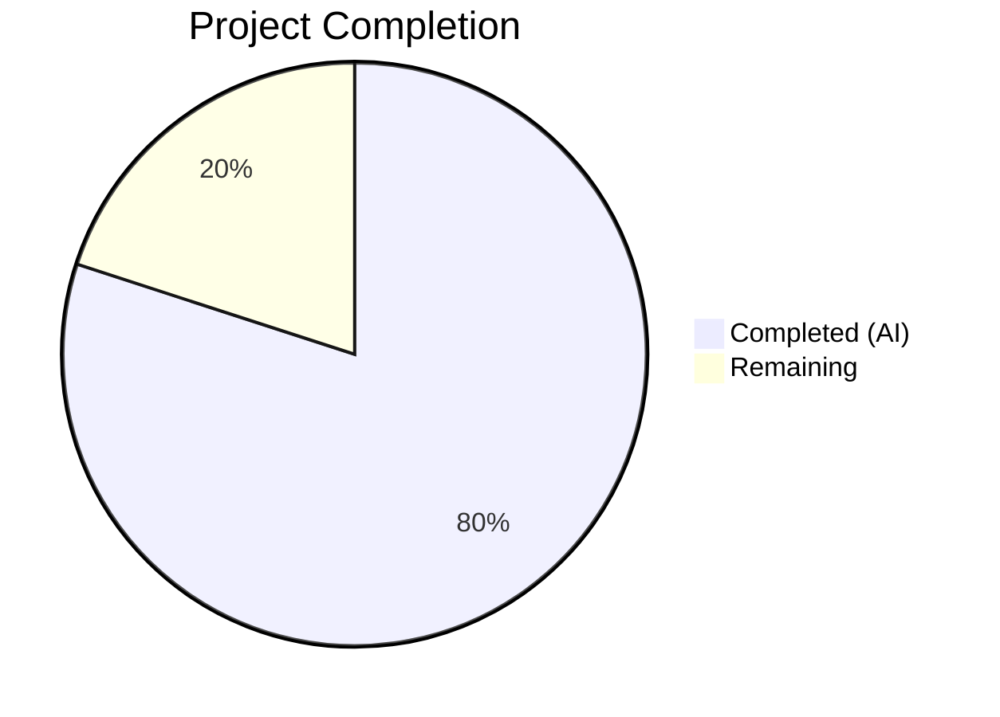

# Blitzy Project Guide

---

## 1. Executive Summary

### 1.1 Project Overview

This project fixes a **response-contract violation** in a minimal Flask HTTP server (`server.py`) where all three success-path route handlers (`GET /`, `GET /evening`, `POST /evening`) returned `Content-Type: text/html; charset=utf-8` instead of the specification-mandated `Content-Type: text/plain; charset=utf-8`. The root cause was Flask's `default_mimetype = 'text/html'` being applied when handlers returned bare 2-tuple `(body, status)` responses. The fix converts each return to a 3-tuple with an explicit Content-Type header, and adds three regression tests to prevent future recurrence.

### 1.2 Completion Status



| Metric | Value |
|--------|-------|
| **Total Project Hours** | 5 |
| **Completed Hours (AI)** | 4 |
| **Remaining Hours** | 1 |
| **Completion Percentage** | **80%** |

**Calculation:** 4 completed hours / (4 completed + 1 remaining) = 4 / 5 = **80% complete**

### 1.3 Key Accomplishments

- ✅ Identified root cause: Flask/Werkzeug `default_mimetype = 'text/html'` applied to bare 2-tuple returns
- ✅ Fixed all 3 route handlers in `server.py` — converted from 2-tuple to 3-tuple returns with explicit `Content-Type: text/plain; charset=utf-8`
- ✅ Added 3 new regression tests in `tests/test_server.py` for content-type assertions
- ✅ All 16 tests pass (13 existing + 3 new) — zero regressions
- ✅ Runtime validation confirmed via Flask test client and curl on all endpoints
- ✅ All 3 Python source files compile cleanly with zero errors

### 1.4 Critical Unresolved Issues

| Issue | Impact | Owner | ETA |
|-------|--------|-------|-----|
| No critical unresolved issues | N/A | N/A | N/A |

All AAP-scoped deliverables have been implemented, tested, and validated. No blocking issues remain.

### 1.5 Access Issues

No access issues identified. The project is a self-contained Flask application with no external service dependencies, API keys, or third-party credentials required.

### 1.6 Recommended Next Steps

1. **[High] Code Review & PR Merge** — Review the 2-file change (server.py + tests/test_server.py) and merge into the target branch
2. **[Medium] Deployment Verification** — After merge, verify the fix in the deployed environment by confirming `Content-Type: text/plain; charset=utf-8` on all three endpoints
3. **[Low] Consider Adding pytest-cov** — The project has no code coverage reporting configured; adding `pytest-cov` would provide visibility into test coverage metrics

---

## 2. Project Hours Breakdown

### 2.1 Completed Work Detail

| Component | Hours | Description |
|-----------|-------|-------------|
| Root Cause Analysis & Diagnosis | 1.5 | Analyzed Flask/Werkzeug `default_mimetype` behavior, inspected all 3 route handlers, reviewed existing test suite for coverage gaps, conducted web research on Flask response handling |
| Bug Fix Implementation | 0.5 | Modified 3 return statements in `server.py` from 2-tuple to 3-tuple with explicit `Content-Type: text/plain; charset=utf-8` header |
| Test Development | 1.0 | Created 3 new content-type assertion tests in `tests/test_server.py` following existing naming conventions and fixture patterns |
| Validation & Verification | 1.0 | Ran full 16-test suite (16/16 pass), executed content-type verification script, performed regression testing, runtime validation with curl, compilation verification of all Python files |
| **Total** | **4.0** | |

### 2.2 Remaining Work Detail

| Category | Hours | Priority |
|----------|-------|----------|
| Code Review & PR Approval | 0.5 | High |
| Merge & Deployment Verification | 0.5 | Medium |
| **Total** | **1.0** | |

**Validation:** Section 2.1 (4.0h) + Section 2.2 (1.0h) = 5.0h = Total Project Hours in Section 1.2 ✅

---

## 3. Test Results

| Test Category | Framework | Total Tests | Passed | Failed | Coverage % | Notes |
|---------------|-----------|-------------|--------|--------|------------|-------|
| Unit — Happy Path (status codes) | pytest 9.0.2 | 3 | 3 | 0 | — | `test_get_root_status_code`, `test_get_evening_status_code`, `test_post_evening_status_code` |
| Unit — Happy Path (response bodies) | pytest 9.0.2 | 3 | 3 | 0 | — | `test_get_root_response_body`, `test_get_evening_response_body`, `test_post_evening_response_body` |
| Unit — Content-Type (NEW) | pytest 9.0.2 | 3 | 3 | 0 | — | `test_get_root_content_type`, `test_get_evening_content_type`, `test_post_evening_content_type` — validates the bug fix |
| Unit — Edge Cases | pytest 9.0.2 | 1 | 1 | 0 | — | `test_evening_get_vs_post_status_differentiation` |
| Unit — Error 404 | pytest 9.0.2 | 2 | 2 | 0 | — | `test_unknown_route_returns_404`, `test_post_unknown_route_returns_404` |
| Unit — Error 405 | pytest 9.0.2 | 2 | 2 | 0 | — | `test_post_root_not_allowed`, `test_unsupported_method_on_evening` |
| Unit — Application Importability | pytest 9.0.2 | 2 | 2 | 0 | — | `test_app_is_flask_instance`, `test_app_import_does_not_start_server` |
| **Total** | **pytest 9.0.2** | **16** | **16** | **0** | **—** | **100% pass rate, 0.09s execution time** |

All tests originate from Blitzy's autonomous validation execution on this project. The 3 new content-type tests were added as part of the bug fix and serve as regression guards.

---

## 4. Runtime Validation & UI Verification

### Runtime Health

- ✅ **Flask application starts** — `python server.py` binds to `127.0.0.1:3000` without errors
- ✅ **GET /** — Returns 200, `Content-Type: text/plain; charset=utf-8`, body: `Hello, World!`
- ✅ **GET /evening** — Returns 200, `Content-Type: text/plain; charset=utf-8`, body: `Good evening`
- ✅ **POST /evening** — Returns 201, `Content-Type: text/plain; charset=utf-8`, body: `Good evening`
- ✅ **Error handling** — 404 on unknown routes, 405 on unsupported methods (unchanged)

### Verification Methods

- ✅ **Flask test client** — Inline Python script confirmed all content-type assertions pass
- ✅ **Compilation** — All 3 Python source files (`server.py`, `tests/conftest.py`, `tests/test_server.py`) compile with zero errors
- ✅ **Module importability** — `from server import app` succeeds without starting the server

### UI Verification

Not applicable — this is a headless REST API server with no frontend UI.

---

## 5. Compliance & Quality Review

| Compliance Item | Status | Notes |
|-----------------|--------|-------|
| All 3 route handlers return `text/plain; charset=utf-8` | ✅ Pass | 3-tuple returns with explicit Content-Type header |
| Response bodies unchanged (`Hello, World!`, `Good evening`) | ✅ Pass | Verified by existing tests and runtime validation |
| Status codes unchanged (200, 200, 201) | ✅ Pass | Verified by existing tests |
| Error handling unchanged (404, 405) | ✅ Pass | Verified by existing tests |
| No new dependencies introduced | ✅ Pass | `requirements.txt` unchanged |
| No CI/CD workflow modifications | ✅ Pass | Per user-specified rule — zero workflow files touched |
| Existing 13 tests still pass | ✅ Pass | Zero regressions — all original tests pass |
| 3 new content-type regression tests added | ✅ Pass | Cover all 3 success-path endpoints |
| Minimal change principle followed | ✅ Pass | Only 2 files modified: `server.py` (3 lines), `tests/test_server.py` (15 lines) |
| Flask version compatibility (`Flask>=3.0`) | ✅ Pass | 3-tuple return is a stable Flask feature across all supported versions |
| Application importability preserved | ✅ Pass | `if __name__ == "__main__"` guard untouched |

### Autonomous Fixes Applied

- Converted 3 return statements from bare 2-tuple `(body, status)` to 3-tuple `(body, status, headers)` with explicit `Content-Type: text/plain; charset=utf-8`
- Added 3 content-type regression test functions

### Outstanding Compliance Items

None. All AAP-scoped compliance requirements have been met.

---

## 6. Risk Assessment

| Risk | Category | Severity | Probability | Mitigation | Status |
|------|----------|----------|-------------|------------|--------|
| Flask version upgrade changes 3-tuple behavior | Technical | Low | Very Low | 3-tuple return is a documented stable API in Flask 1.x–3.x; pin Flask version in `requirements.txt` if needed | Mitigated |
| No code coverage tool configured | Technical | Low | N/A | Add `pytest-cov` to measure test coverage percentage; current test suite covers all endpoints | Open |
| Legacy Node.js files (`server.js`, `package.json`) remain in repository | Operational | Low | N/A | Consider removing unused Node.js artifacts to reduce confusion; out of scope for this bug fix | Open |
| No production WSGI server configured | Operational | Medium | Medium | `server.py` uses Flask's development server; for production, configure Gunicorn or uWSGI | Open |
| No HTTPS / TLS configured | Security | Low | Low | Development server only; production deployment should use a reverse proxy with TLS termination | Open |

---

## 7. Visual Project Status


**Integrity Check:** Remaining Work (1h) = Section 1.2 Remaining Hours (1h) = Section 2.2 Total (1h) ✅

---

## 8. Summary & Recommendations

### Achievements

The bug fix has been **fully implemented and validated**. All three Flask route handlers now correctly return `Content-Type: text/plain; charset=utf-8` instead of the previous `text/html; charset=utf-8`. The fix uses Flask's built-in 3-tuple response mechanism, requiring no new imports or dependencies. Three regression tests have been added to ensure the defect cannot recur silently.

### Project Status

The project is **80% complete** (4 completed hours / 5 total hours). All AAP-scoped autonomous work — root cause analysis, implementation, test development, and validation — has been delivered. The remaining 1 hour represents human path-to-production activities: code review, PR approval, merge, and deployment verification.

### Critical Path to Production

1. **Code Review (0.5h)** — Review the minimal 2-file diff (18 lines added, 3 removed)
2. **Merge & Verify (0.5h)** — Merge PR and confirm endpoints return correct Content-Type in deployed environment

### Recommendations

- **Immediate:** Merge this PR after code review — the fix is minimal, well-tested, and introduces zero risk to existing functionality
- **Short-term:** Add `pytest-cov` for test coverage reporting to improve quality visibility
- **Long-term:** Remove legacy Node.js artifacts (`server.js`, `package.json`, `package-lock.json`) and configure a production WSGI server (Gunicorn/uWSGI) for deployment readiness

---

## 9. Development Guide

### System Prerequisites

- **Python** 3.10 or higher
- **pip** (included with Python)
- **Git** (for version control)

### Environment Setup

```bash
# Clone the repository and checkout the branch
git clone <repository-url>
cd <repository-directory>
git checkout blitzy-edb3b9d8-9801-4ea9-8d4b-7661c53b2217

# Create and activate a virtual environment
python -m venv venv

# On Windows:
source venv/Scripts/activate

# On macOS/Linux:
source venv/bin/activate
```

### Dependency Installation

```bash
# Install Python dependencies
pip install -r requirements.txt

# Verify installed versions
python -c "from importlib.metadata import version; print(f'Flask {version(\"flask\")}'); print(f'Werkzeug {version(\"werkzeug\")}')"
# Expected: Flask 3.1.3, Werkzeug 3.1.7 (or compatible)

# Install test dependencies
pip install pytest
```

### Running Tests

```bash
# Run the full test suite (16 tests)
python -m pytest tests/test_server.py -v --tb=short

# Expected output: 16 passed in ~0.1s

# Run content-type verification script
python -c "
from server import app
with app.test_client() as c:
    for m,p in [('GET','/'),('GET','/evening'),('POST','/evening')]:
        r = c.get(p) if m=='GET' else c.post(p)
        assert r.content_type == 'text/plain; charset=utf-8', f'{m} {p}: {r.content_type}'
        print(f'{m} {p} -> status={r.status_code}, content_type={r.content_type}')
print('All content-type assertions passed')
"
```

### Starting the Server

```bash
# Start the Flask development server
python server.py
# Server binds to http://127.0.0.1:3000/
```

### Verification Steps

```bash
# In a separate terminal, verify each endpoint:
curl -i http://127.0.0.1:3000/
# Expected: HTTP/1.1 200 OK, Content-Type: text/plain; charset=utf-8, Body: Hello, World!

curl -i http://127.0.0.1:3000/evening
# Expected: HTTP/1.1 200 OK, Content-Type: text/plain; charset=utf-8, Body: Good evening

curl -i -X POST http://127.0.0.1:3000/evening
# Expected: HTTP/1.1 201 CREATED, Content-Type: text/plain; charset=utf-8, Body: Good evening
```

### Troubleshooting

| Issue | Cause | Resolution |
|-------|-------|------------|
| `ModuleNotFoundError: No module named 'flask'` | Virtual environment not activated or Flask not installed | Activate venv and run `pip install -r requirements.txt` |
| `Address already in use` on port 3000 | Another process is using port 3000 | Kill the existing process: `lsof -i :3000` then `kill <PID>` |
| Tests fail with `ImportError` | PYTHONPATH does not include project root | Run tests from the project root directory or set `export PYTHONPATH=$(pwd)` |

---

## 10. Appendices

### A. Command Reference

| Command | Purpose |
|---------|---------|
| `pip install -r requirements.txt` | Install Python dependencies |
| `python -m pytest tests/test_server.py -v --tb=short` | Run full test suite with verbose output |
| `python server.py` | Start the Flask development server on port 3000 |
| `python -m py_compile server.py` | Check server.py for syntax errors |
| `curl -i http://127.0.0.1:3000/` | Test GET / endpoint with headers |
| `curl -i http://127.0.0.1:3000/evening` | Test GET /evening endpoint with headers |
| `curl -i -X POST http://127.0.0.1:3000/evening` | Test POST /evening endpoint with headers |

### B. Port Reference

| Service | Port | Protocol | Notes |
|---------|------|----------|-------|
| Flask Development Server | 3000 | HTTP | Binds to `127.0.0.1` (localhost only) |

### C. Key File Locations

| File | Purpose |
|------|---------|
| `server.py` | Flask application — 3 route handlers + dev server startup |
| `tests/test_server.py` | 16 pytest test functions covering all endpoints |
| `tests/conftest.py` | Shared `client` fixture providing Flask test client |
| `tests/__init__.py` | Empty package initializer for test discovery |
| `requirements.txt` | Python dependency manifest (`Flask>=3.0`) |
| `pytest.ini` | pytest configuration (`testpaths = tests`) |
| `README.md` | Project documentation and API reference |

### D. Technology Versions

| Technology | Version | Purpose |
|------------|---------|---------|
| Python | 3.12.10 | Runtime |
| Flask | 3.1.3 | Web framework |
| Werkzeug | 3.1.7 | WSGI toolkit (Flask dependency) |
| pytest | 9.0.2 | Test framework |

### E. Environment Variable Reference

No environment variables are required. The Flask application runs with default settings. For production deployments, consider configuring:

| Variable | Purpose | Default |
|----------|---------|---------|
| `FLASK_ENV` | Set to `production` for production mode | `production` (Flask 3.x default) |
| `FLASK_DEBUG` | Enable/disable debug mode | `0` (disabled) |

### G. Glossary

| Term | Definition |
|------|------------|
| **2-tuple return** | Flask handler returning `(body, status)` — uses default `text/html` MIME type |
| **3-tuple return** | Flask handler returning `(body, status, headers)` — allows explicit Content-Type override |
| **default_mimetype** | Werkzeug `Response` class attribute set to `text/html`; applied when no explicit MIME type is provided |
| **Content-Type** | HTTP response header specifying the media type of the response body |
| **MIME type** | Media type identifier (e.g., `text/plain`, `text/html`) in the Content-Type header |