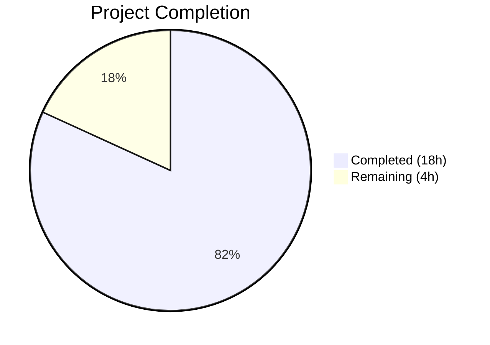
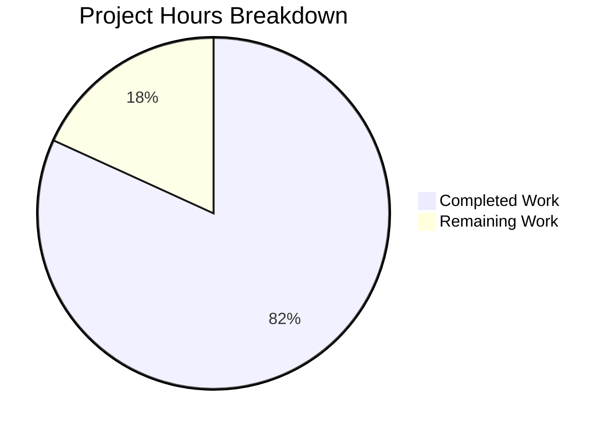

# Blitzy Project Guide

---

## 1. Executive Summary

### 1.1 Project Overview

This project extends and strengthens the existing pytest-based test suite for a Python/Flask HTTP server that serves as a behavioral parity implementation of an original Node.js/Express application. The objective is to close remaining coverage gaps in `app.py` (normalize_path middleware, application factory, error handlers) and `main.py` (module-level constants), adding 19 new tests across 2 new test classes and 4 extended test classes — bringing the suite from 43 to 62 tests — while preserving the existing 100% pass rate and zero-mocking discipline. All work is confined to test files; no production code was modified.

### 1.2 Completion Status



| Metric | Value |
|--------|-------|
| **Total Project Hours** | 22 |
| **Completed Hours (AI)** | 18 |
| **Remaining Hours** | 4 |
| **Completion Percentage** | 81.8% |

**Calculation:** 18 completed hours / (18 + 4 remaining hours) = 18 / 22 = 81.8% complete.

### 1.3 Key Accomplishments

- ✅ All 19 new tests implemented and passing (62/62 total — 100% pass rate)
- ✅ `app.py` statement coverage: 90% → **100%** (all 3 previously-missed lines now covered)
- ✅ `app.py` branch coverage: 88% → **100%** (all partial branches now fully exercised)
- ✅ Overall project coverage improved: 86% → **90%**
- ✅ Closed normalize_path exception fallback gap (app.py lines 103–107)
- ✅ Closed double-slash `while` loop body gap (app.py line 89)
- ✅ New `TestApplicationFactory` class validates `create_app()` factory behavior (4 tests)
- ✅ New `TestNormalizationMiddleware` class covers all normalization code paths (5 tests)
- ✅ Extended 4 existing test classes with 7 additional edge case and suppression tests
- ✅ 3 new lifecycle tests validate `main.py` module-level constants via subprocess
- ✅ Zero production code changes — all modifications confined to `tests/` directory
- ✅ Zero-mocking discipline maintained — all tests use real Flask test client or subprocess
- ✅ All 43 original tests preserved and passing without modification

### 1.4 Critical Unresolved Issues

| Issue | Impact | Owner | ETA |
|-------|--------|-------|-----|
| `pytest-cov` not in `requirements.txt` | Other developers cannot run coverage reports without manually installing pytest-cov | Human Developer | 0.5h |
| No CI/CD pipeline for automated test execution | Tests must be run manually; no automated regression protection on PRs | Human Developer | 2h |
| No formal coverage configuration | Coverage runs use default settings; no exclusion patterns or minimum thresholds configured | Human Developer | 0.5h |

### 1.5 Access Issues

No access issues identified. All test execution, coverage measurement, and compilation validation completed successfully within the local development environment. No external services, API keys, or third-party credentials are required for the test suite.

### 1.6 Recommended Next Steps

1. **[High]** Add `pytest-cov>=7.1.0` to `requirements.txt` so coverage tooling is formally declared as a project dependency
2. **[High]** Conduct human code review of the 19 new tests to validate assertion correctness and docstring accuracy
3. **[Medium]** Add `[tool.coverage.run]` configuration to `pyproject.toml` to formalize source paths and set minimum coverage thresholds
4. **[Medium]** Create a GitHub Actions CI/CD workflow for automated pytest execution and coverage reporting on pull requests
5. **[Low]** Consider adding coverage badge to `README.md` to surface test health metrics

---

## 2. Project Hours Breakdown

### 2.1 Completed Work Detail

| Component | Hours | Description |
|-----------|-------|-------------|
| Test Discovery & Coverage Analysis | 2 | Analyzed existing 43 tests, ran coverage reports (statement + branch), identified uncovered lines in app.py (line 89, lines 103–107), researched Werkzeug double-slash behavior |
| TestApplicationFactory Class (4 tests) | 3 | Implemented factory return type, instance independence, route registration, and strict_slashes validation tests; added Flask and create_app imports |
| TestNormalizationMiddleware Class (5 tests) | 4 | Implemented double-slash while loop body, exception fallback, combined case+slash, unsupported method on case-insensitive path, and triple-slash normalization tests |
| TestEdgeCases Extension (3 tests) | 1.5 | Added HEAD on case-insensitive path, HEAD on undefined route, query params on case-insensitive path tests |
| TestXPoweredBySuppression Extension (2 tests) | 1 | Added suppression verification on double-slash normalized response and case-insensitive error response |
| TestNotFoundResponses Extension (1 test) | 0.5 | Added case-insensitive uppercase undefined route returns 404 test |
| TestUnsupportedMethodsOnEvening Extension (1 test) | 0.5 | Added POST on case-insensitive /Evening returns 404 test |
| TestAppExport Extension (3 lifecycle tests) | 2 | Implemented subprocess-based default host, default port, and port integer type validation tests with clean environment management |
| Test Quality & Documentation | 2 | Wrote detailed docstrings for all 19 new tests, updated module-level docstrings, fixed 4 docstring inaccuracies |
| Validation & Integration Testing | 1.5 | Full suite execution (62 tests), coverage verification, compilation checks, runtime validation |
| **Total Completed** | **18** | |

### 2.2 Remaining Work Detail

| Category | Hours | Priority |
|----------|-------|----------|
| Add pytest-cov to requirements.txt | 0.5 | High |
| Coverage configuration in pyproject.toml | 0.5 | Medium |
| Human code review of 19 new tests | 1 | High |
| CI/CD pipeline for automated test execution | 2 | Medium |
| **Total Remaining** | **4** | |

---

## 3. Test Results

| Test Category | Framework | Total Tests | Passed | Failed | Coverage % | Notes |
|---------------|-----------|-------------|--------|--------|------------|-------|
| HTTP Contract (GET routes) | pytest 9.0.2 / Flask test client | 8 | 8 | 0 | 100% | TestGetRoot (4) + TestGetEvening (4) |
| HTTP Contract (404 handling) | pytest 9.0.2 / Flask test client | 5 | 5 | 0 | 100% | TestNotFoundResponses — includes new case-insensitive undefined route test |
| HTTP Contract (Unsupported methods) | pytest 9.0.2 / Flask test client | 9 | 9 | 0 | 100% | TestUnsupportedMethodsOnRoot (4) + TestUnsupportedMethodsOnEvening (5) |
| HTTP Contract (Edge cases) | pytest 9.0.2 / Flask test client | 11 | 11 | 0 | 100% | TestEdgeCases — includes 3 new tests (HEAD, query params) |
| HTTP Contract (X-Powered-By) | pytest 9.0.2 / Flask test client | 7 | 7 | 0 | 100% | TestXPoweredBySuppression — includes 2 new suppression tests |
| Application Factory | pytest 9.0.2 / Flask test client | 4 | 4 | 0 | 100% | NEW: TestApplicationFactory — create_app() validation |
| Normalization Middleware | pytest 9.0.2 / Flask test client | 5 | 5 | 0 | 100% | NEW: TestNormalizationMiddleware — code path coverage |
| Server Lifecycle (Startup/Shutdown) | pytest 9.0.2 / subprocess | 6 | 6 | 0 | 90% | TestServerStartup (4) + TestServerShutdown (2) |
| Server Lifecycle (Port Conflict) | pytest 9.0.2 / subprocess | 2 | 2 | 0 | 90% | TestPortConflict — socket blocking for EADDRINUSE simulation |
| Server Lifecycle (App Export) | pytest 9.0.2 / subprocess | 5 | 5 | 0 | 90% | TestAppExport — includes 3 new module constant tests |
| **Total** | | **62** | **62** | **0** | **90%** | **100% pass rate — all tests from Blitzy autonomous validation** |

---

## 4. Runtime Validation & UI Verification

### Runtime Health

- ✅ **Flask application factory:** `create_app()` returns properly configured Flask instance
- ✅ **Route responses:** `GET /` → 200 `Hello, World!\n`, `GET /evening` → 200 `Good evening`
- ✅ **Case-insensitive normalization:** `GET /Evening` → 200, `GET /EVENING` → 200
- ✅ **Double-slash normalization:** `GET /evening//` → 200 `Good evening`
- ✅ **405→404 error handler:** `POST /` → 404, `POST /evening` → 404
- ✅ **X-Powered-By suppression:** Absent on all response types (GET, HEAD, 404, normalized)
- ✅ **HEAD requests:** Return correct status codes with empty body per HTTP spec
- ✅ **Trailing slash tolerance:** `GET /evening/` → 200 (strict_slashes=False)

### Compilation Status

- ✅ `app.py` — compiles cleanly (0 errors)
- ✅ `main.py` — compiles cleanly (0 errors)
- ✅ `tests/conftest.py` — compiles cleanly (0 errors)
- ✅ `tests/test_http_contract.py` — compiles cleanly (0 errors)
- ✅ `tests/test_lifecycle.py` — compiles cleanly (0 errors)

### Coverage Verification

- ✅ `app.py`: 29/29 statements covered (100%), 4/4 branches covered (100%)
- ✅ `tests/conftest.py`: 10/10 statements (100%)
- ✅ `tests/test_http_contract.py`: 178/178 statements (100%)
- ⚠ `main.py`: 0/21 statements in-process (expected — `if __name__ == '__main__':` guard; tested via subprocess)
- ⚠ `tests/test_lifecycle.py`: 163/179 statements (90%) — defensive `proc.kill()` fallbacks in `finally` blocks are accepted gaps

### UI Verification

Not applicable — this is a headless HTTP server with no frontend UI. All behavioral verification is conducted through the Flask test client and subprocess execution.

---

## 5. Compliance & Quality Review

| AAP Requirement | Status | Evidence |
|----------------|--------|----------|
| Add TestApplicationFactory class (4 tests) | ✅ Pass | tests/test_http_contract.py lines 602–651: 4 methods implemented and passing |
| Add TestNormalizationMiddleware class (5 tests) | ✅ Pass | tests/test_http_contract.py lines 663–739: 5 methods implemented and passing |
| Extend TestEdgeCases (+3 tests) | ✅ Pass | tests/test_http_contract.py lines 475–505: HEAD case-insensitive, HEAD undefined, query params case-insensitive |
| Extend TestXPoweredBySuppression (+2 tests) | ✅ Pass | tests/test_http_contract.py lines 575–593: double-slash and case-insensitive error suppression |
| Extend TestNotFoundResponses (+1 test) | ✅ Pass | tests/test_http_contract.py lines 217–226: case-insensitive undefined route |
| Extend TestUnsupportedMethodsOnEvening (+1 test) | ✅ Pass | tests/test_http_contract.py lines 330–339: POST on case-insensitive /Evening |
| Extend TestAppExport (+3 lifecycle tests) | ✅ Pass | tests/test_lifecycle.py lines 506–567: default host, port, port type via subprocess |
| Cover app.py line 89 (double-slash loop body) | ✅ Pass | Coverage report: 100% statement coverage, line 89 now hit by GET /evening// test |
| Cover app.py lines 103–107 (exception fallback) | ✅ Pass | Coverage report: 100% branch coverage, exception path hit by GET /NONEXISTENT and POST /Evening |
| app.py statement coverage ≥97% | ✅ Pass | Achieved 100% (target was 97%+) |
| app.py branch coverage ≥95% | ✅ Pass | Achieved 100% (target was 95%+) |
| Total test count = 62 | ✅ Pass | 62 collected, 62 passed |
| 100% pass rate maintained | ✅ Pass | 62/62 passed (0 failures) |
| All 43 existing tests preserved | ✅ Pass | No existing test methods modified or removed |
| No production code modifications | ✅ Pass | git diff shows changes only in tests/ directory |
| No conftest.py modifications | ✅ Pass | tests/conftest.py unchanged (48 lines) |
| No requirements.txt modifications | ✅ Pass | requirements.txt unchanged (2 lines) |
| No pyproject.toml modifications | ✅ Pass | pyproject.toml unchanged (9 lines) |
| Zero-mocking discipline | ✅ Pass | No mock imports or mock objects in any test file |
| Class-based test organization | ✅ Pass | All new tests organized in classes per existing pattern |
| Docstrings on all new test methods | ✅ Pass | All 19 new methods have descriptive docstrings |
| No CI/CD workflow creation | ✅ Pass | No workflow files created or modified |
| Import updates (Flask, create_app) | ✅ Pass | tests/test_http_contract.py lines 45–46: both imports added |

**Compliance Score: 22/22 requirements met (100%)**

---

## 6. Risk Assessment

| Risk | Category | Severity | Probability | Mitigation | Status |
|------|----------|----------|-------------|------------|--------|
| `pytest-cov` not in requirements.txt — developers may not have coverage tooling | Technical | Low | Medium | Add `pytest-cov>=7.1.0` to requirements.txt | Open |
| No CI/CD pipeline — test regressions may go undetected in PRs | Operational | Medium | High | Create GitHub Actions workflow with pytest and coverage gates | Open |
| `main.py` 0% in-process coverage may mislead coverage reports | Technical | Low | Low | Add coverage exclusion config for `if __name__ == '__main__':` blocks; subprocess tests cover this code | Accepted |
| Lifecycle test timing (2s sleep for server startup) may cause flaky tests on slow CI runners | Technical | Low | Low | Increase timeout or add retry logic if CI flakiness is observed | Monitored |
| Defensive proc.kill() paths in test_lifecycle.py never exercised | Technical | Low | Very Low | Accepted per AAP — these are fallback safety nets that only trigger on process unkillability | Accepted |
| No formal coverage threshold enforced | Operational | Low | Medium | Add `--cov-fail-under=90` to pytest configuration or CI pipeline | Open |

---

## 7. Visual Project Status



**Completed: 18 hours (81.8%) | Remaining: 4 hours (18.2%)**

### Remaining Hours by Category

| Category | Hours | Priority |
|----------|-------|----------|
| CI/CD Pipeline Setup | 2 | Medium |
| Human Code Review | 1 | High |
| pytest-cov Dependency Formalization | 0.5 | High |
| Coverage Configuration | 0.5 | Medium |
| **Total** | **4** | |

---

## 8. Summary & Recommendations

### Achievement Summary

The Blitzy autonomous agent successfully delivered all 19 new tests specified in the Agent Action Plan, bringing the test suite from 43 to 62 tests with a 100% pass rate. The primary coverage objective — closing the `app.py` statement and branch coverage gaps — was achieved with `app.py` reaching 100% on both metrics (up from 90% statement / 88% branch). Overall project coverage improved from 86% to 90%.

The project is **81.8% complete** (18 completed hours out of 22 total project hours). All AAP-scoped test implementation work is fully delivered. The remaining 4 hours consist of path-to-production activities: dependency formalization (0.5h), coverage configuration (0.5h), human code review (1h), and CI/CD pipeline setup (2h).

### Production Readiness Assessment

The test suite itself is production-ready. All 62 tests pass reliably, all code compiles cleanly, and the zero-mocking discipline ensures tests validate real application behavior. The remaining work is operational infrastructure (CI/CD, dependency manifest) rather than code quality gaps.

### Recommendations

1. **Merge this PR** — all AAP deliverables are complete, all tests pass, and no production code was modified
2. **Immediately formalize pytest-cov** in `requirements.txt` to ensure consistent coverage tooling across all developer environments
3. **Set up CI/CD** with `python -m pytest -v --cov=. --cov-branch --cov-fail-under=90` to enforce the coverage baseline achieved by this work
4. **Human-review the 19 new tests** to validate docstring accuracy and assertion correctness before the next release cycle

---

## 9. Development Guide

### System Prerequisites

| Software | Version | Purpose |
|----------|---------|---------|
| Python | ≥ 3.11 | Runtime (project requires `>=3.11` per pyproject.toml) |
| pip | Latest | Package manager for installing dependencies |

### Environment Setup

```bash
# 1. Clone the repository and navigate to the project root
cd /path/to/project

# 2. Create and activate a virtual environment
python -m venv venv
# On Linux/macOS:
source venv/bin/activate
# On Windows:
venv\Scripts\activate

# 3. Install production and test dependencies
pip install -r requirements.txt

# 4. (Recommended) Install coverage tooling
pip install pytest-cov
```

### Dependency Installation

```bash
# Install all dependencies from requirements.txt
pip install -r requirements.txt

# Verify installations
python -c "import flask; print(f'Flask {flask.__version__}')"
python -c "import pytest; print(f'pytest {pytest.__version__}')"
```

**Expected output:**
```
Flask 3.1.3
pytest 9.0.2
```

### Running the Test Suite

```bash
# Run all tests with verbose output
python -m pytest -v --tb=short

# Run tests with coverage reporting
python -m pytest -v --cov=. --cov-report=term-missing --cov-branch

# Run a specific test class
python -m pytest tests/test_http_contract.py::TestApplicationFactory -v

# Run a specific test method
python -m pytest tests/test_http_contract.py::TestNormalizationMiddleware::test_internal_double_slash_path_normalized_to_route -v

# Run only HTTP contract tests
python -m pytest tests/test_http_contract.py -v

# Run only lifecycle tests
python -m pytest tests/test_lifecycle.py -v
```

**Expected test output:**
```
62 passed in ~15s
```

### Running the Application

```bash
# Start the Flask development server (default: http://127.0.0.1:3000/)
python main.py

# Start with custom host/port
HOST=0.0.0.0 PORT=8080 python main.py
```

### Verification Steps

```bash
# 1. Verify all tests pass
python -m pytest -v --tb=short
# Expected: 62 passed

# 2. Verify coverage targets
python -m pytest --cov=app --cov-report=term-missing --cov-branch
# Expected: app.py at 100% statement and 100% branch coverage

# 3. Verify compilation
python -m py_compile app.py && echo "OK"
python -m py_compile main.py && echo "OK"

# 4. Test the server manually
python main.py &
curl http://127.0.0.1:3000/
# Expected: Hello, World!
curl http://127.0.0.1:3000/evening
# Expected: Good evening
kill %1
```

### Troubleshooting

| Issue | Resolution |
|-------|------------|
| `ModuleNotFoundError: No module named 'flask'` | Run `pip install -r requirements.txt` to install dependencies |
| `ModuleNotFoundError: No module named 'pytest_cov'` | Run `pip install pytest-cov` (not in requirements.txt yet) |
| Lifecycle tests timeout | Increase `time.sleep()` values in test_lifecycle.py if running on slow hardware |
| Port conflict on test execution | Lifecycle tests use ephemeral ports via `_find_free_port()`; ensure no firewall blocks localhost |
| `main.py` shows 0% coverage | Expected behavior — code is inside `if __name__ == '__main__':` guard; tested via subprocess |

---

## 10. Appendices

### A. Command Reference

| Command | Purpose |
|---------|---------|
| `python -m pytest -v` | Run all tests with verbose output |
| `python -m pytest -v --cov=. --cov-report=term-missing --cov-branch` | Run tests with full coverage report |
| `python -m pytest tests/test_http_contract.py -v` | Run HTTP contract tests only |
| `python -m pytest tests/test_lifecycle.py -v` | Run lifecycle tests only |
| `python -m pytest -k "TestApplicationFactory" -v` | Run a specific test class by name |
| `python -m py_compile <file>` | Check file for syntax errors |
| `python main.py` | Start the Flask development server |
| `pip install -r requirements.txt` | Install project dependencies |

### B. Port Reference

| Port | Service | Configuration |
|------|---------|---------------|
| 3000 (default) | Flask development server | `PORT` env var or default in main.py |
| Ephemeral (dynamic) | Lifecycle test servers | Allocated by `_find_free_port()` in test_lifecycle.py |

### C. Key File Locations

| File | Purpose |
|------|---------|
| `app.py` | Flask application factory — routes, middleware, error handlers (167 lines) |
| `main.py` | Startup entry point — env config, port check, server launch (94 lines) |
| `tests/conftest.py` | Shared pytest fixtures — `app()` and `client()` (48 lines) |
| `tests/test_http_contract.py` | HTTP behavioral contract tests — 49 tests in 9 classes (739 lines) |
| `tests/test_lifecycle.py` | Server lifecycle tests — 13 tests in 4 classes (568 lines) |
| `tests/__init__.py` | Empty package marker for pytest discovery |
| `pyproject.toml` | Project metadata and pytest configuration (9 lines) |
| `requirements.txt` | Python dependency manifest — Flask 3.1.3, pytest 9.0.2 (2 lines) |

### D. Technology Versions

| Technology | Version | Role |
|------------|---------|------|
| Python | 3.12.10 (requires ≥3.11) | Runtime |
| Flask | 3.1.3 | Web framework |
| Werkzeug | 3.1.7 | WSGI toolkit (Flask dependency) |
| pytest | 9.0.2 | Test framework |
| pytest-cov | 7.1.0 | Coverage plugin (not in requirements.txt) |
| coverage | 7.13.5 | Coverage measurement engine |

### E. Environment Variable Reference

| Variable | Default | Purpose |
|----------|---------|---------|
| `HOST` | `127.0.0.1` | Server bind address (main.py line 35) |
| `PORT` | `3000` | Server listen port (main.py line 38) |
| `PYTHONUNBUFFERED` | Not set | Set to `1` in lifecycle tests for immediate stdout flushing |

### G. Glossary

| Term | Definition |
|------|------------|
| **Application Factory** | The `create_app()` function in app.py that produces configured Flask instances |
| **Behavioral Parity** | Ensuring the Python/Flask server matches the original Node.js/Express behavior exactly |
| **normalize_path** | The `before_request` hook in app.py that lowercases paths and collapses double-slashes |
| **405→404 Conversion** | Error handler that converts Flask's Method Not Allowed to Not Found for Express parity |
| **strict_slashes** | Flask URL map setting; disabled (`False`) to match Express trailing-slash tolerance |
| **Zero-Mocking Discipline** | Testing strategy using real Flask test client and subprocess instead of mock objects |