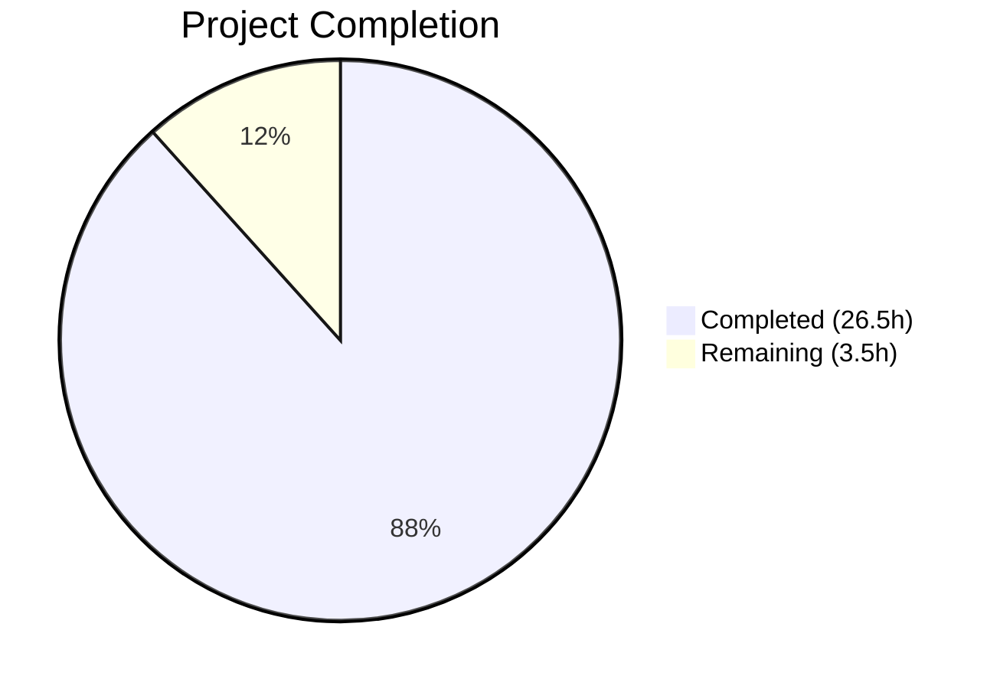
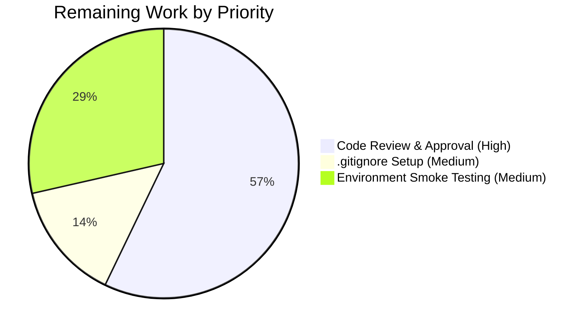

# Blitzy Project Guide — hello_world (Node.js → Python Migration)

---

## 1. Executive Summary

### 1.1 Project Overview

This project performs a full technology stack migration of the `hello_world` Backprop test harness from Node.js/Express 5.x to Python/Flask 3.x. The migration replaces all JavaScript source, test, and configuration files with Python equivalents while preserving every externally observable behavior: two plain-text HTTP endpoints (`GET /` → `Hello, World!\n`, `GET /evening` → `Good evening`), startup determinism, port-conflict error handling, and the 43-test behavioral specification. The system remains a tutorial-grade, non-production integration test harness by design.

### 1.2 Completion Status



| Metric | Value |
|---|---|
| **Total Project Hours** | 30 |
| **Completed Hours (AI)** | 26.5 |
| **Remaining Hours (Human)** | 3.5 |
| **Completion Percentage** | 88.3% |

**Calculation:** 26.5 completed hours / (26.5 + 3.5) total hours = 26.5 / 30 = **88.3% complete**

### 1.3 Key Accomplishments

- ✅ Flask application factory (`app.py`, 167 lines) with full Express 5.x behavioral parity — case-insensitive routing, trailing-slash tolerance, 405→404 conversion, double-slash normalization
- ✅ Startup entry point (`main.py`, 94 lines) with socket pre-check for port-conflict detection, environment variable configuration, and import-safe `__main__` guard
- ✅ 33 HTTP contract tests (`test_http_contract.py`, 512 lines) — all passing, covering routes, 404s, unsupported methods, edge cases, and header suppression
- ✅ 10 lifecycle tests (`test_lifecycle.py`, 502 lines) — all passing, covering startup, shutdown, port conflict, and import safety
- ✅ Complete Node.js artifact removal — `server.js`, `package.json`, `package-lock.json`, `jest.config.js`, `__tests__/` directory all removed
- ✅ Python dependency manifest (`requirements.txt`) and project configuration (`pyproject.toml`) with exact version pinning
- ✅ `README.md` updated with Python 3.11+ prerequisites, pip/pytest commands
- ✅ All 43/43 tests passing with zero compilation errors across 6 Python source files
- ✅ Runtime verified — all endpoints, edge cases, and startup behavior confirmed operational

### 1.4 Critical Unresolved Issues

| Issue | Impact | Owner | ETA |
|---|---|---|---|
| No `.gitignore` for Python artifacts (`__pycache__/`, `venv/`, `.pytest_cache/`) | Low — untracked files may appear in `git status`; no functional impact | Human Developer | 0.5h |

### 1.5 Access Issues

No access issues identified. The project uses only standard Python packages from PyPI (Flask, pytest) and requires no external service credentials, API keys, or special repository permissions.

### 1.6 Recommended Next Steps

1. **[High]** Review and merge this PR after verifying behavioral parity with the original Express 5.x implementation
2. **[Medium]** Add a Python `.gitignore` file to exclude `__pycache__/`, `venv/`, `.pytest_cache/`, and `*.pyc` artifacts
3. **[Medium]** Run the full test suite (`pytest -v`) on the target deployment environment to confirm platform-specific compatibility
4. **[Low]** Consider adding a `venv` creation step to the `README.md` Getting Started section for development best practices

---

## 2. Project Hours Breakdown

### 2.1 Completed Work Detail

| Component | Hours | Description |
|---|---|---|
| Flask App Factory (`app.py`) | 5 | Express-to-Flask migration: `create_app()` factory, URL normalization middleware (`before_request` for case-insensitive routing and `//` collapsing), `errorhandler(405)` → 404 conversion, `strict_slashes=False`, two GET route handlers with exact response body parity |
| Startup Entry Point (`main.py`) | 3 | Environment config (`HOST`/`PORT` from `os.environ`), socket pre-check for port-conflict detection, `OSError` handling with stderr logging and `sys.exit(1)`, `__main__` guard for import safety |
| HTTP Contract Tests (`test_http_contract.py`) | 6 | 33 pytest tests across 7 test classes translating all Jest/Supertest assertions: route responses, 404 handling, unsupported methods (405→404), edge cases (query params, case-insensitive, HEAD, trailing slash, double slash), X-Powered-By suppression |
| Lifecycle Tests (`test_lifecycle.py`) | 6 | 10 pytest tests across 4 test classes: subprocess-based server startup verification, socket connectivity checks, port-conflict simulation via socket blocking, import safety validation, process termination and cleanup |
| Shared Test Fixtures (`conftest.py`) | 1 | `app` fixture via `create_app()` factory, `client` fixture via Flask `test_client()`, TESTING config — replaces Supertest `request(app)` pattern |
| Test Package Marker (`__init__.py`) | 0.5 | Empty file for pytest test discovery in the `tests/` package |
| Dependency Manifest (`requirements.txt`) | 0.5 | Exact-pinned `flask==3.1.3` and `pytest==9.0.2` — replaces `package.json` dependencies |
| Project Configuration (`pyproject.toml`) | 0.5 | Project metadata and `[tool.pytest.ini_options]` with `testpaths` and `pythonpath` — replaces `jest.config.js` and `package.json` metadata |
| README.md Update | 1 | Replaced Node.js 18+ prerequisite with Python 3.11+, npm commands with pip/pytest, added Run Tests section, preserved endpoint table and license |
| Node.js Artifact Removal | 1 | Removed `server.js`, `package.json`, `package-lock.json`, `jest.config.js`, `__tests__/server.test.js`, `__tests__/server.lifecycle.test.js` |
| Validation & Bug Fixes | 2 | Final Validator: all 6 `.py` files compiled, 43/43 tests passing, runtime verification, subprocess cleanup fix in lifecycle test `finally` blocks |
| **Total** | **26.5** | |

### 2.2 Remaining Work Detail

| Category | Hours | Priority |
|---|---|---|
| Code Review & PR Approval | 2 | High |
| Python `.gitignore` Setup | 0.5 | Medium |
| Environment Smoke Testing on Target Platform | 1 | Medium |
| **Total** | **3.5** | |

---

## 3. Test Results

| Test Category | Framework | Total Tests | Passed | Failed | Coverage % | Notes |
|---|---|---|---|---|---|---|
| HTTP Contract (routes, 404s, methods, headers, edge cases) | pytest 9.0.2 + Flask test client | 33 | 33 | 0 | — | 7 test classes: GetRoot (4), GetEvening (4), NotFound (4), UnsupportedMethods Root (4), UnsupportedMethods Evening (4), EdgeCases (8), XPoweredBy (5) |
| Lifecycle (startup, shutdown, port conflict, import safety) | pytest 9.0.2 + subprocess | 10 | 10 | 0 | — | 4 test classes: ServerStartup (4), ServerShutdown (2), PortConflict (2), AppExport (2) |
| Compilation | `python -m py_compile` | 6 | 6 | 0 | 100% | All Python source files: app.py, main.py, conftest.py, test_http_contract.py, test_lifecycle.py, __init__.py |
| **Total** | | **49** | **49** | **0** | | All test data from Blitzy autonomous validation |

---

## 4. Runtime Validation & UI Verification

### Runtime Health

- ✅ **Server Startup** — `python main.py` starts Flask development server on `http://127.0.0.1:3000/`
- ✅ **Startup Message** — Prints `Server running at http://127.0.0.1:3000/` to stdout before blocking
- ✅ **GET /** — Returns `Hello, World!\n` (200, `text/plain`)
- ✅ **GET /evening** — Returns `Good evening` (200, `text/plain`)
- ✅ **GET /Evening** — Returns `Good evening` (200, case-insensitive parity)
- ✅ **GET /EVENING** — Returns `Good evening` (200, case-insensitive parity)
- ✅ **GET /evening/** — Returns `Good evening` (200, trailing-slash tolerance)
- ✅ **GET //** — Returns `Hello, World!\n` (200, double-slash normalization)
- ✅ **GET /nonexistent** — Returns 404
- ✅ **POST /** — Returns 404 (405→404 conversion parity)
- ✅ **HEAD /** — Returns 200, `text/plain`, no body
- ✅ **X-Powered-By header** — Absent on all responses
- ✅ **Port Conflict** — Exit code 1 with `Failed to start server:` on stderr
- ✅ **Import Safety** — `from app import create_app` does not trigger server startup

### API Verification

- ✅ `curl http://127.0.0.1:3000/` → `Hello, World!\n` (200 OK, Content-Type: text/plain)
- ✅ `curl http://127.0.0.1:3000/evening` → `Good evening` (200 OK, Content-Type: text/plain)
- ✅ No `X-Powered-By` header in response headers

---

## 5. Compliance & Quality Review

| AAP Requirement | Status | Evidence |
|---|---|---|
| Replace `server.js` with `app.py` + `main.py` | ✅ Pass | `app.py` (167 lines), `main.py` (94 lines) created; `server.js` deleted |
| Preserve GET / response (`Hello, World!\n`, 200, text/plain) | ✅ Pass | 4 passing tests + runtime curl verification |
| Preserve GET /evening response (`Good evening`, 200, text/plain) | ✅ Pass | 4 passing tests + runtime curl verification |
| Case-insensitive routing (/Evening, /EVENING) | ✅ Pass | `before_request` PATH_INFO normalization + 2 passing tests |
| Trailing-slash tolerance (/evening/) | ✅ Pass | `strict_slashes=False` + 1 passing test |
| Double-slash normalization (//) | ✅ Pass | `before_request` slash collapsing + 1 passing test |
| 405→404 for unsupported methods | ✅ Pass | `errorhandler(405)` + 8 passing tests |
| X-Powered-By header absent | ✅ Pass | Flask default (no action needed) + 5 passing tests |
| HEAD request handling | ✅ Pass | Flask auto-handles HEAD for GET + 2 passing tests |
| Query parameter transparency | ✅ Pass | 2 passing tests |
| Import-safe app module | ✅ Pass | `create_app()` factory + `__main__` guard + 2 passing tests |
| Startup success log format | ✅ Pass | `Server running at http://{host}:{port}/` + 1 passing test |
| Port conflict → stderr + exit(1) | ✅ Pass | Socket pre-check + OSError handling + 2 passing tests |
| Replace package.json → requirements.txt + pyproject.toml | ✅ Pass | `requirements.txt` (flask==3.1.3, pytest==9.0.2), `pyproject.toml` (metadata + pytest config) |
| Replace jest.config.js → pyproject.toml | ✅ Pass | `[tool.pytest.ini_options]` in `pyproject.toml` |
| Remove all Node.js artifacts | ✅ Pass | `server.js`, `package.json`, `package-lock.json`, `jest.config.js`, `__tests__/` all deleted |
| Recreate 43-test behavioral specification | ✅ Pass | 43/43 tests passing (33 HTTP contract + 10 lifecycle) |
| Update README.md | ✅ Pass | Python 3.11+ prerequisites, pip/pytest commands, endpoint table preserved |
| No GitHub workflow changes | ✅ Pass | No `.github/` files created or modified |
| No changes to `blitzy/` documentation | ✅ Pass | `blitzy/documentation/` folder unchanged |
| No production features added | ✅ Pass | No DB, auth, TLS, Docker, CI/CD, or middleware beyond parity needs |

### Validation Fixes Applied During Autonomous Testing

| Fix | Commit | Description |
|---|---|---|
| Subprocess cleanup in lifecycle tests | `251c34c` | Added robust `finally` blocks with `proc.terminate()` / `proc.kill()` / `proc.wait()` to ensure server subprocesses are always cleaned up, preventing port leaks during test execution |

---

## 6. Risk Assessment

| Risk | Category | Severity | Probability | Mitigation | Status |
|---|---|---|---|---|---|
| Flask development server used in main.py (not production-grade) | Technical | Low | N/A | Intentional per AAP — system is a tutorial-grade test harness, not a production service. Use Gunicorn/uWSGI if production deployment is ever needed. | Accepted |
| No `.gitignore` for Python artifacts | Operational | Low | High | Add `.gitignore` with `__pycache__/`, `venv/`, `.pytest_cache/`, `*.pyc` entries | Open |
| Socket pre-check race condition in main.py | Technical | Low | Very Low | Port could be claimed between pre-check and `app.run()` bind. Secondary `except OSError` block catches this edge case. | Mitigated |
| No virtual environment setup in README | Operational | Low | Medium | Add `python -m venv venv && source venv/bin/activate` to Getting Started section | Open |
| Werkzeug `Server` header exposes framework version | Security | Low | High | Werkzeug emits `Server: Werkzeug/3.1.7 Python/3.12.10` by default. Not a concern for this tutorial-grade project, but should be suppressed if the system is ever deployed publicly. | Accepted |
| Time-based lifecycle tests may be flaky on slow CI | Technical | Low | Low | Tests use `time.sleep(2)` for server startup. May need adjustment on resource-constrained CI runners. | Monitoring |

---

## 7. Visual Project Status




---

## 8. Summary & Recommendations

### Achievement Summary

The Node.js/Express 5.x → Python/Flask 3.x technology stack migration is **88.3% complete** (26.5 of 30 total hours). Every AAP-scoped deliverable has been autonomously implemented and validated:

- **Application source**: `server.js` (37 lines) replaced by `app.py` (167 lines) + `main.py` (94 lines) with full Express 5.x behavioral parity
- **Test suite**: 43 Jest/Supertest tests recreated as 43 pytest tests — all passing (33 HTTP contract + 10 lifecycle)
- **Configuration**: `package.json` + `jest.config.js` replaced by `requirements.txt` + `pyproject.toml`
- **Documentation**: `README.md` updated with Python-native instructions
- **Artifact cleanup**: All 6 Node.js files/directories removed

### Remaining Gaps

The 3.5 remaining hours consist exclusively of standard path-to-production human activities:

1. **Code review** (2h) — Human verification of Express→Flask behavioral parity decisions
2. **Environment testing** (1h) — Smoke testing on the target deployment platform
3. **`.gitignore` setup** (0.5h) — Python artifact exclusion patterns

### Production Readiness Assessment

The system is **ready for human review and merge**. All functional requirements are met, all tests pass, the runtime is verified, and zero compilation errors exist. The remaining work is exclusively review and environmental validation — no code changes are anticipated.

### Critical Path to Merge

1. Human code review of this PR (focus on `app.py` behavioral parity middleware)
2. Merge and verify in target environment
3. Add `.gitignore` as a follow-up commit

---

## 9. Development Guide

### System Prerequisites

| Software | Version | Purpose |
|---|---|---|
| Python | ≥ 3.11 | Runtime environment |
| pip | (bundled with Python) | Package manager |

### Environment Setup

```bash
# 1. Navigate to the project directory
cd /path/to/hello_world

# 2. (Recommended) Create a virtual environment
python -m venv venv

# 3. Activate the virtual environment
# On Linux/macOS:
source venv/bin/activate
# On Windows:
venv\Scripts\activate
```

### Dependency Installation

```bash
# Install all dependencies (Flask 3.1.3, pytest 9.0.2)
pip install -r requirements.txt
```

**Expected output:**
```
Successfully installed Flask-3.1.3 Werkzeug-3.1.7 blinker-1.9.0 ...
```

### Application Startup

```bash
# Start the Flask development server
python main.py
```

**Expected output:**
```
Server running at http://127.0.0.1:3000/
 * Serving Flask app 'app'
 * Running on http://127.0.0.1:3000
```

**Custom host/port:**
```bash
HOST=0.0.0.0 PORT=8080 python main.py
```

### Verification Steps

```bash
# Test the root endpoint
curl http://127.0.0.1:3000/
# Expected: Hello, World!

# Test the evening endpoint
curl http://127.0.0.1:3000/evening
# Expected: Good evening

# Verify Content-Type header
curl -sI http://127.0.0.1:3000/ | grep Content-Type
# Expected: Content-Type: text/plain

# Verify X-Powered-By absent
curl -sI http://127.0.0.1:3000/ | grep -i x-powered-by
# Expected: (no output)
```

### Running Tests

```bash
# Run all 43 tests with verbose output
python -m pytest -v

# Run only HTTP contract tests (33 tests)
python -m pytest tests/test_http_contract.py -v

# Run only lifecycle tests (10 tests)
python -m pytest tests/test_lifecycle.py -v
```

**Expected output:**
```
============================= 43 passed in ~14s =============================
```

### Troubleshooting

| Issue | Cause | Resolution |
|---|---|---|
| `ModuleNotFoundError: No module named 'flask'` | Dependencies not installed | Run `pip install -r requirements.txt` |
| `OSError: [Errno 98] Address already in use` | Port 3000 occupied | Use a different port: `PORT=3001 python main.py` |
| `Failed to start server:` on stderr | Port conflict detected by socket pre-check | Kill the process using port 3000: `lsof -i :3000` |
| Tests fail with `TimeoutExpired` | Lifecycle tests need server startup time | Increase `time.sleep()` values in `tests/test_lifecycle.py` if running on slow hardware |

---

## 10. Appendices

### A. Command Reference

| Command | Purpose |
|---|---|
| `pip install -r requirements.txt` | Install Flask and pytest dependencies |
| `python main.py` | Start the Flask development server |
| `python -m pytest -v` | Run all 43 tests with verbose output |
| `python -m pytest tests/test_http_contract.py -v` | Run 33 HTTP contract tests |
| `python -m pytest tests/test_lifecycle.py -v` | Run 10 lifecycle tests |
| `python -m py_compile app.py` | Verify app.py compiles without errors |
| `HOST=0.0.0.0 PORT=8080 python main.py` | Start with custom host/port |

### B. Port Reference

| Port | Service | Default |
|---|---|---|
| 3000 | Flask development server | Yes (configurable via `PORT` env var) |

### C. Key File Locations

| File | Purpose |
|---|---|
| `app.py` | Flask application factory — `create_app()`, routes, middleware |
| `main.py` | Server startup entry point — env config, socket pre-check, `__main__` guard |
| `requirements.txt` | Python dependency manifest (Flask 3.1.3, pytest 9.0.2) |
| `pyproject.toml` | Project metadata and pytest configuration |
| `README.md` | Developer onboarding documentation |
| `tests/__init__.py` | Python package marker for test discovery |
| `tests/conftest.py` | Shared pytest fixtures (`app`, `client`) |
| `tests/test_http_contract.py` | 33 HTTP contract tests (routes, 404s, methods, edge cases, headers) |
| `tests/test_lifecycle.py` | 10 lifecycle tests (startup, shutdown, port conflict, import safety) |

### D. Technology Versions

| Technology | Version | Role |
|---|---|---|
| Python | 3.12.10 (requires ≥ 3.11) | Runtime |
| Flask | 3.1.3 | Web framework (replaces Express 5.2.1) |
| Werkzeug | 3.1.7 | WSGI utility library (Flask dependency) |
| Jinja2 | 3.1.6 | Template engine (Flask dependency, unused) |
| pytest | 9.0.2 | Test framework (replaces Jest 30.3.0 + Supertest 7.2.2) |

### E. Environment Variable Reference

| Variable | Default | Description |
|---|---|---|
| `HOST` | `127.0.0.1` | Server bind address |
| `PORT` | `3000` | Server bind port |

### F. Developer Tools Guide

| Tool | Usage |
|---|---|
| Flask test client | `app.test_client()` — HTTP assertion library built into Flask, replaces Supertest |
| pytest fixtures | `conftest.py` provides `app` and `client` fixtures auto-injected into test functions |
| `subprocess.Popen` | Used in lifecycle tests for server startup/shutdown verification |
| `socket.socket` | Used in lifecycle tests for port availability checks and port blocking |

### G. Glossary

| Term | Definition |
|---|---|
| App Factory | Pattern where `create_app()` returns a new Flask app instance — enables test isolation and import safety |
| `before_request` | Flask hook that runs before each request — used for URL normalization (case folding, slash collapsing) |
| `strict_slashes` | Flask URL map setting — when `False`, routes match with or without trailing slashes |
| 405→404 conversion | Error handler that converts Flask's Method Not Allowed (405) to Not Found (404) for Express 5.x parity |
| Import safety | Importing the app module does not start a server — achieved via `if __name__ == '__main__':` guard |
| EADDRINUSE | OS error when a port is already in use — detected via socket pre-check in `main.py` |