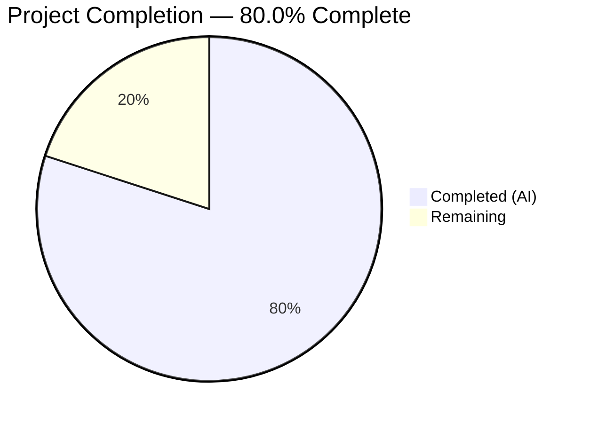

# Blitzy Project Guide

---

## 1. Executive Summary

### 1.1 Project Overview

This project introduces a complete automated pytest test suite for `hao-backprop-test`, a minimal single-file Flask application (`server.py`) that previously had zero in-repository automated test coverage. The scope encompasses establishing the entire testing foundation — test framework configuration, shared fixtures, and 13 test functions covering all three route handlers (`GET /`, `GET /evening`, `POST /evening`), Flask's default 404/405 error handling, and application importability verification. The test suite uses Flask's built-in `test_client()` exclusively, requires no mocking, and executes in under 0.1 seconds. No production code was modified.

### 1.2 Completion Status



| Metric | Value |
|:---|:---|
| **Total Project Hours** | 7.5 |
| **Completed Hours (AI)** | 6 |
| **Remaining Hours** | 1.5 |
| **Completion Percentage** | 80.0% |

**Calculation:** 6 completed hours / 7.5 total hours = 80.0% complete

### 1.3 Key Accomplishments

- ✅ Created complete test infrastructure from scratch (pytest.ini, tests/__init__.py, tests/conftest.py, tests/test_server.py)
- ✅ Implemented all 13 specified test functions — 13/13 passing (100% pass rate)
- ✅ Achieved 100% functional coverage of all route handler code (lines 1–18 of server.py)
- ✅ Validated all endpoint contracts: GET / → 200, GET /evening → 200, POST /evening → 201
- ✅ Covered error paths: 404 for unknown routes, 405 for unsupported methods
- ✅ Confirmed route/method differentiation: GET /evening (200) vs POST /evening (201)
- ✅ Verified application importability without triggering server startup
- ✅ Zero production code modifications — server.py, requirements.txt, README.md untouched
- ✅ Zero CI/CD or workflow changes — per explicit project constraints
- ✅ Sub-2-second test execution achieved (0.04–0.10 seconds measured)

### 1.4 Critical Unresolved Issues

| Issue | Impact | Owner | ETA |
|:---|:---|:---|:---|
| Test dependencies not in requirements file | Developers must manually install pytest/pytest-cov before running tests | Human Developer | 0.5h |

### 1.5 Access Issues

No access issues identified.

### 1.6 Recommended Next Steps

1. **[High]** Review and merge this PR to establish the test suite in the main branch
2. **[Medium]** Create a `requirements-dev.txt` file documenting test dependencies (`pytest`, `pytest-cov`) for developer onboarding
3. **[Low]** Add a `.coveragerc` configuration to exclude the `__main__` guard block for cleaner coverage reporting

---

## 2. Project Hours Breakdown

### 2.1 Completed Work Detail

| Component | Hours | Description |
|:---|:---|:---|
| Test strategy design and planning | 1 | Analysis of server.py endpoints, identification of 13 test cases across happy path, edge case, error, and importability categories |
| Test infrastructure setup | 0.5 | Created `pytest.ini` with testpaths configuration and `tests/__init__.py` package marker |
| Shared fixture implementation | 0.5 | Created `tests/conftest.py` with reusable `client` fixture providing Flask test_client() |
| Test suite implementation | 2.5 | Implemented 13 test functions in `tests/test_server.py` (85 lines) covering all AAP-specified test cases |
| Dependency installation and verification | 0.5 | Installed and verified pytest 9.0.2, pytest-cov 7.1.0, coverage 7.13.5 compatibility with Python 3.12 and Flask 3.1.3 |
| Validation and quality assurance | 1 | Compilation verification (py_compile), test execution (13/13 pass), coverage measurement (80% total / 100% functional), runtime endpoint validation, lint check (pyflakes clean) |
| **Total** | **6** | |

### 2.2 Remaining Work Detail

| Category | Hours | Priority |
|:---|:---|:---|
| PR code review and merge | 0.5 | High |
| Test dependency documentation (requirements-dev.txt) | 0.5 | Medium |
| Coverage exclusion configuration (.coveragerc) | 0.5 | Low |
| **Total** | **1.5** | |

---

## 3. Test Results

| Test Category | Framework | Total Tests | Passed | Failed | Coverage % | Notes |
|:---|:---|:---|:---|:---|:---|:---|
| Unit / HTTP Contract (Happy Path) | pytest 9.0.2 | 6 | 6 | 0 | 100% of route handlers | GET /, GET /evening, POST /evening — status codes and response bodies |
| Edge Case (Method Differentiation) | pytest 9.0.2 | 1 | 1 | 0 | 100% of /evening route | Validates GET→200 vs POST→201 differentiation |
| Error Path (404 Not Found) | pytest 9.0.2 | 2 | 2 | 0 | N/A (Flask default) | GET and POST to unknown routes |
| Error Path (405 Method Not Allowed) | pytest 9.0.2 | 2 | 2 | 0 | N/A (Flask default) | POST on /, DELETE on /evening |
| Application Importability | pytest 9.0.2 | 2 | 2 | 0 | 100% of app instantiation | Flask instance type check, safe import verification |
| **Total** | **pytest 9.0.2** | **13** | **13** | **0** | **80% line / 100% functional** | **0.04–0.10s execution** |

**Coverage Detail:**
- `server.py`: 15 statements, 3 missed (lines 22–25: `__main__` guard block) = 80% line coverage
- Lines 1–18 (all functional route handler code): 100% covered
- Lines 22–25 excluded by Python testing convention — development server startup code only runs via `python server.py`

---

## 4. Runtime Validation & UI Verification

### Runtime Health

- ✅ **Flask application imports successfully** — `from server import app` loads without triggering server startup
- ✅ **Test client operational** — `app.test_client()` creates WSGI-level HTTP client without network binding
- ✅ **All endpoint contracts verified via runtime test:**

| Endpoint | Method | Expected Status | Expected Body | Result |
|:---|:---|:---|:---|:---|
| `/` | GET | 200 | `Hello, World!` | ✅ Operational |
| `/evening` | GET | 200 | `Good evening` | ✅ Operational |
| `/evening` | POST | 201 | `Good evening` | ✅ Operational |
| `/nonexistent` | GET | 404 | (Flask default) | ✅ Operational |

### UI Verification

- N/A — This application has no frontend/UI. It is a pure API server returning text responses.

### Compilation Status

- ✅ `server.py` — py_compile OK
- ✅ `tests/__init__.py` — py_compile OK
- ✅ `tests/conftest.py` — py_compile OK
- ✅ `tests/test_server.py` — py_compile OK
- ✅ `pytest.ini` — Valid INI configuration

---

## 5. Compliance & Quality Review

| AAP Requirement | Status | Evidence |
|:---|:---|:---|
| Create `tests/__init__.py` | ✅ Pass | File exists as empty package marker |
| Create `tests/conftest.py` with shared client fixture | ✅ Pass | Fixture yields `app.test_client()`, used by all 11 parameterized tests |
| Create `tests/test_server.py` with 13 test functions | ✅ Pass | All 13 specified test functions implemented and passing |
| Create `pytest.ini` with minimal configuration | ✅ Pass | Contains `testpaths = tests` |
| Happy path: GET / → 200, "Hello, World!" | ✅ Pass | test_get_root_status_code + test_get_root_response_body |
| Happy path: GET /evening → 200, "Good evening" | ✅ Pass | test_get_evening_status_code + test_get_evening_response_body |
| Happy path: POST /evening → 201, "Good evening" | ✅ Pass | test_post_evening_status_code + test_post_evening_response_body |
| Edge case: GET vs POST /evening status differentiation | ✅ Pass | test_evening_get_vs_post_status_differentiation |
| Error case: Unknown routes return 404 | ✅ Pass | test_unknown_route_returns_404 + test_post_unknown_route_returns_404 |
| Error case: Unsupported methods return 405 | ✅ Pass | test_post_root_not_allowed + test_unsupported_method_on_evening |
| Importability: app is Flask instance | ✅ Pass | test_app_is_flask_instance |
| Importability: import does not start server | ✅ Pass | test_app_import_does_not_start_server |
| 100% functional coverage of route handlers | ✅ Pass | Lines 1–18 fully covered; 80% total (lines 22–25 __main__ excluded) |
| Zero test failures | ✅ Pass | 13/13 tests passing |
| Execution under 2 seconds | ✅ Pass | 0.04–0.10 seconds measured |
| No production code modifications | ✅ Pass | server.py unchanged (git diff confirms) |
| No CI/CD or workflow changes | ✅ Pass | No .github/workflows files created |
| No mocking used | ✅ Pass | All tests use Flask's built-in test_client() directly |
| requirements.txt unchanged | ✅ Pass | File unchanged (git diff confirms) |
| Zero lint violations | ✅ Pass | pyflakes reports clean |

**Compliance Summary:** 20/20 AAP requirements verified and passing. No outstanding compliance gaps.

---

## 6. Risk Assessment

| Risk | Category | Severity | Probability | Mitigation | Status |
|:---|:---|:---|:---|:---|:---|
| Test dependencies not documented in project files | Operational | Low | Medium | Create `requirements-dev.txt` with pytest and pytest-cov | Open |
| Coverage report shows 80% due to __main__ guard | Technical | Low | Low | Add `.coveragerc` with `[report] exclude_lines` for `if __name__` | Open |
| No CI/CD pipeline runs tests on PR | Operational | Medium | High | Explicitly out of AAP scope; recommend future CI/CD setup | Deferred (by design) |
| New developer may not know to install test deps | Operational | Low | Medium | Document in requirements-dev.txt or README | Open |

**Overall Risk Level: Low** — All AAP deliverables are fully implemented and validated. The identified risks are minor operational items related to developer experience rather than functional correctness.

---

## 7. Visual Project Status


### Remaining Work by Priority

| Priority | Hours | Items |
|:---|:---|:---|
| High | 0.5 | PR review and merge |
| Medium | 0.5 | Test dependency documentation |
| Low | 0.5 | Coverage exclusion configuration |
| **Total** | **1.5** | |

---

## 8. Summary & Recommendations

### Achievements

The project successfully delivers a complete automated test suite for the `hao-backprop-test` Flask application, establishing the repository's first-ever testing infrastructure. All 13 specified test functions pass with 100% functional coverage of route handler code. The test suite validates all endpoint contracts, error handling behavior, and application importability — executing in under 0.1 seconds with zero mocking and zero production code modifications.

The project is **80.0% complete** (6 hours completed out of 7.5 total hours). All AAP-scoped deliverables are fully implemented and validated. The remaining 1.5 hours represent minor path-to-production polish items: PR review, test dependency documentation, and optional coverage configuration.

### Remaining Gaps

1. **Test dependency documentation** — pytest and pytest-cov are installed but not declared in any requirements file. A `requirements-dev.txt` would improve developer onboarding.
2. **Coverage configuration** — The `__main__` guard block (lines 22–25) is correctly excluded by convention but the 80% figure could confuse developers. A `.coveragerc` with explicit exclusion would show a cleaner 100% report.
3. **CI/CD integration** — Tests are CI-ready but no pipeline exists. This is explicitly deferred per AAP constraints.

### Production Readiness Assessment

The test suite itself is **production-ready**: all tests pass deterministically, execute in sub-second time, use no mocking or external dependencies, and correctly enforce the HTTP contract. The remaining items are documentation and configuration polish — no functional gaps exist.

### Success Metrics

| Metric | Target | Actual | Status |
|:---|:---|:---|:---|
| Test count | 13 | 13 | ✅ Met |
| Test pass rate | 100% | 100% (13/13) | ✅ Met |
| Functional coverage | 100% | 100% (lines 1–18) | ✅ Met |
| Execution time | < 2 seconds | 0.04–0.10s | ✅ Exceeded |
| Production code changes | 0 | 0 | ✅ Met |
| CI/CD changes | 0 | 0 | ✅ Met |

---

## 9. Development Guide

### System Prerequisites

| Requirement | Version | Verification Command |
|:---|:---|:---|
| Python | 3.10 or higher (verified: 3.12.10) | `python --version` |
| pip | Included with Python | `pip --version` |

### Environment Setup

No virtual environment, environment variables, database, Docker, or external services are required. The application and tests run entirely in-process.

```bash
# Clone the repository
git clone <repository-url>
cd hao-backprop-test
```

### Dependency Installation

```bash
# Install production dependencies
pip install -r requirements.txt

# Install test dependencies (development only)
pip install pytest pytest-cov
```

**Expected output verification:**
```bash
# Verify Flask installation
python -c "import flask; print(f'Flask {flask.__version__}')"
# Expected: Flask 3.1.3

# Verify pytest installation
python -m pytest --version
# Expected: pytest 9.0.2
```

### Running Tests

```bash
# Run full test suite (verbose)
python -m pytest -v --tb=short

# Run with coverage report
python -m pytest --cov=server --cov-report=term-missing

# Run a single test file
python -m pytest tests/test_server.py -v

# Run a single test function
python -m pytest tests/test_server.py::test_get_root_status_code -v

# Stop at first failure
python -m pytest -x

# Debug mode (show print output + full tracebacks)
python -m pytest -v -s --tb=long
```

**Expected test output:**
```
tests/test_server.py::test_get_root_status_code PASSED
tests/test_server.py::test_get_root_response_body PASSED
tests/test_server.py::test_get_evening_status_code PASSED
tests/test_server.py::test_get_evening_response_body PASSED
tests/test_server.py::test_post_evening_status_code PASSED
tests/test_server.py::test_post_evening_response_body PASSED
tests/test_server.py::test_evening_get_vs_post_status_differentiation PASSED
tests/test_server.py::test_unknown_route_returns_404 PASSED
tests/test_server.py::test_post_unknown_route_returns_404 PASSED
tests/test_server.py::test_post_root_not_allowed PASSED
tests/test_server.py::test_unsupported_method_on_evening PASSED
tests/test_server.py::test_app_is_flask_instance PASSED
tests/test_server.py::test_app_import_does_not_start_server PASSED
13 passed in 0.04s
```

### Running the Application Server

```bash
# Start the Flask development server
python server.py
# Server starts at http://127.0.0.1:3000/
```

### Verification Steps

```bash
# Verify GET / endpoint
curl http://127.0.0.1:3000/
# Expected: Hello, World!

# Verify GET /evening endpoint
curl http://127.0.0.1:3000/evening
# Expected: Good evening

# Verify POST /evening endpoint
curl -X POST http://127.0.0.1:3000/evening
# Expected: Good evening (with 201 status)

# Verify 404 handling
curl -s -o /dev/null -w "%{http_code}" http://127.0.0.1:3000/nonexistent
# Expected: 404
```

### Troubleshooting

| Issue | Cause | Resolution |
|:---|:---|:---|
| `ModuleNotFoundError: No module named 'flask'` | Flask not installed | Run `pip install -r requirements.txt` |
| `ModuleNotFoundError: No module named 'pytest'` | pytest not installed | Run `pip install pytest pytest-cov` |
| `no tests ran` or `collected 0 items` | Wrong directory or missing pytest.ini | Ensure you run pytest from the repository root |
| Coverage shows 80% instead of 100% | `__main__` guard block (lines 22–25) not covered | Expected behavior; functional coverage is 100%. Optionally add `.coveragerc` to exclude `if __name__` |
| `Address already in use` when starting server | Port 3000 occupied | Stop other processes on port 3000 or tests do not require a running server |

---

## 10. Appendices

### A. Command Reference

| Command | Purpose |
|:---|:---|
| `pip install -r requirements.txt` | Install production dependencies (Flask) |
| `pip install pytest pytest-cov` | Install test dependencies |
| `python -m pytest -v --tb=short` | Run tests with verbose output |
| `python -m pytest --cov=server --cov-report=term-missing` | Run tests with coverage report |
| `python -m pytest -x` | Run tests, stop at first failure |
| `python server.py` | Start Flask development server on port 3000 |
| `python -m py_compile server.py` | Verify server.py compiles without errors |

### B. Port Reference

| Service | Port | Protocol |
|:---|:---|:---|
| Flask development server | 3000 | HTTP |

### C. Key File Locations

| File | Purpose |
|:---|:---|
| `server.py` | Flask application — 3 route handlers (production code, DO NOT MODIFY) |
| `requirements.txt` | Production dependencies — Flask>=3.0 |
| `pytest.ini` | Pytest configuration — testpaths = tests |
| `tests/__init__.py` | Python package marker for test discovery |
| `tests/conftest.py` | Shared pytest fixture — Flask test_client() |
| `tests/test_server.py` | Test suite — 13 test functions covering all endpoints |
| `README.md` | Project documentation and setup instructions |

### D. Technology Versions

| Technology | Version | Purpose |
|:---|:---|:---|
| Python | 3.12.10 | Runtime |
| Flask | 3.1.3 | Web framework and test_client() provider |
| Werkzeug | (bundled with Flask) | WSGI utilities |
| pytest | 9.0.2 | Test runner and framework |
| pytest-cov | 7.1.0 | Coverage measurement plugin |
| coverage | 7.13.5 | Line coverage engine (transitive dep) |

### E. Environment Variable Reference

No environment variables are required. The application uses hardcoded configuration:
- Host: `127.0.0.1`
- Port: `3000`

### G. Glossary

| Term | Definition |
|:---|:---|
| AAP | Agent Action Plan — the primary directive document containing all project requirements |
| Flask test_client() | Built-in WSGI-level HTTP client for testing Flask routes without a running server |
| conftest.py | Pytest convention file for shared fixtures, automatically discovered by pytest |
| Functional coverage | Coverage of application logic code (lines 1–18), excluding the `__main__` startup guard |
| __main__ guard | Python pattern (`if __name__ == "__main__":`) that prevents server startup during imports |
| 405 Method Not Allowed | HTTP status returned by Flask when a valid route receives an unsupported HTTP method |