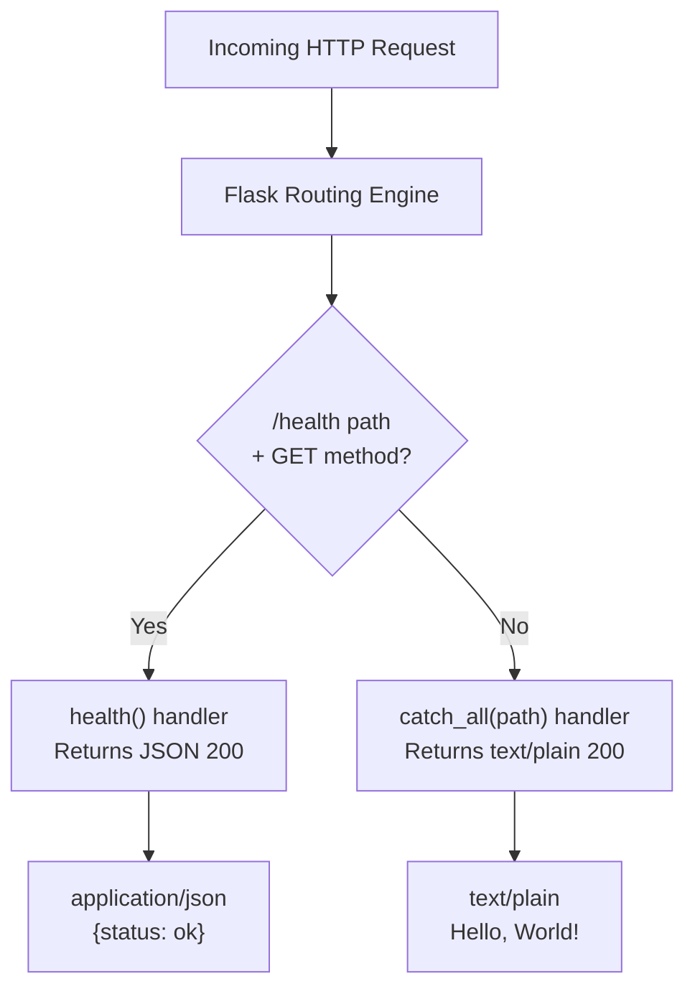

# Technical Specification

# 0. Agent Action Plan

## 0.1 Intent Clarification

### 0.1.1 Core Feature Objective

Based on the prompt, the Blitzy platform understands that the new feature requirement is to add a dedicated HTTP health check endpoint (`/health`) to the existing `hao-backprop-test` Flask application. The specific requirements are:

- **Add a `/health` route** to the Flask application in `app.py` that returns a JSON response `{"status": "ok"}` with HTTP status code `200` and `Content-Type: application/json`
- **Enable programmatic health verification** so that DevOps tooling and the Backprop pipeline can confirm the service is running and responsive, as opposed to only receiving a static `Hello, World!` plain-text response from the catch-all handler
- **Support two primary user flows**:
  - DevOps monitors ping `/health` to confirm service uptime and availability
  - The Backprop integration pipeline validates service readiness before initiating code analysis workflows
- **Preserve all existing behavior** — the root route (`/`) and catch-all handler must continue returning `Hello, World!\n` with `text/plain` content type and HTTP 200 status for all methods and paths, exactly as implemented today

Implicit requirements detected:
- The `/health` endpoint must be a **GET-only** route, as health checks are conventionally read-only operations and the user explicitly tests that POST returns a "proper status"
- The JSON response must use Flask's standard `jsonify` utility (already bundled with Flask) to ensure correct `Content-Type: application/json` headers
- The new route must be registered **before** the catch-all route in `app.py` or leverage Flask's routing specificity to ensure `/health` GET requests are handled by the dedicated endpoint rather than falling through to the catch-all handler
- No new dependencies are required — Flask's built-in `jsonify` function provides all necessary JSON serialization capability

### 0.1.2 Special Instructions and Constraints

The user has specified strict boundaries for this feature addition:

- **Single-file constraint**: All changes must be confined to `app.py` — no new files, no new folders, no changes to `requirements.txt`, `README.md`, or any other file in the repository
- **Minimal change clause**: Only add the code strictly necessary for the `/health` endpoint — no refactoring, no reformatting, no unrelated modifications
- **Behavioral preservation**: The existing root route (`Hello, World!` response) must remain byte-identical in behavior for all HTTP methods and all URL paths (excluding `/health` GET requests)
- **No new frameworks or libraries**: Reuse the existing Flask setup; the `jsonify` function is already available as part of Flask 3.1.3
- **Repository structure freeze**: Do not modify the repository structure — no new directories, no configuration files, no migration files
- **Explicit exclusions**: Authentication, logging enhancements, and code refactoring are explicitly out of scope
- **CI/CD restriction**: User Rule states — "Do not make any updates or changes in GitHub App to create or update a workflow"

### 0.1.3 Technical Interpretation

These feature requirements translate to the following technical implementation strategy:

- To **implement the health endpoint**, we will add a new Flask route decorator and handler function in `app.py` that maps `GET /health` to a function returning `jsonify(status="ok")` with HTTP 200
- To **return a proper JSON response**, we will add `jsonify` to the existing `from flask import Flask, Response` import statement on line 12 of `app.py`
- To **ensure route precedence**, we will place the new `/health` route definition above the existing catch-all route (before line 35) so that Flask's routing engine matches the specific `/health` path before evaluating the catch-all `/<path:path>` pattern
- To **handle invalid methods on /health**, we will restrict the `/health` route to `methods=['GET']` only; POST and other methods to `/health` will fall through to the existing catch-all handler, maintaining consistent behavior with how the application currently handles all requests
- To **validate the implementation**, we will verify: (1) `GET /health` returns `200` with JSON `{"status":"ok"}`, (2) `GET /` still returns `Hello, World!\n` as plain text, (3) other paths remain handled by the catch-all


## 0.2 Repository Scope Discovery

### 0.2.1 Comprehensive File Analysis

The repository has a minimal, flat structure. Every file and folder has been evaluated for relevance to this feature addition.

**Complete Repository Inventory and Impact Assessment:**

| Path | Type | Status | Relevance | Action Required |
|------|------|--------|-----------|-----------------|
| `app.py` | File | UNCHANGED | **Primary target** | MODIFY — Add `/health` route, update imports |
| `requirements.txt` | File | UNCHANGED | Dependency manifest | No change — Flask 3.1.3 already provides `jsonify` |
| `README.md` | File | UNCHANGED | Documentation | No change — per minimal change clause |
| `package.json` | File | UNCHANGED | Empty placeholder (legacy Node.js) | No change — not relevant |
| `package-lock.json` | File | UNCHANGED | Empty placeholder (legacy Node.js) | No change — not relevant |
| `server.js` | File | UNCHANGED | Empty placeholder (legacy Node.js) | No change — not relevant |
| `blitzy/` | Folder | UNCHANGED | Documentation subfolder | No change — migration docs only |
| `blitzy/documentation/` | Folder | UNCHANGED | Migration specifications | No change — reference material only |
| `blitzy/documentation/Technical Specifications.md` | File | UNCHANGED | Migration blueprint | No change — reference only |
| `blitzy/documentation/Project Guide.md` | File | UNCHANGED | Validation dossier | No change — reference only |

**Existing File to Modify — Detailed Analysis:**

- **`app.py`** (59 lines) — The sole application source file containing the Flask application instance, configuration constants, catch-all route handler, and entry point guard. Specific modifications required:
  - **Line 12**: Update the import statement from `from flask import Flask, Response` to `from flask import Flask, Response, jsonify` to bring in the JSON response helper
  - **Lines 33–34 (new code insertion zone)**: Insert the new `/health` route and handler function between the configuration constants block and the catch-all route block, preserving the existing comment structure and code organization
  - **No other lines are modified** — the existing catch-all route (lines 35–49) and entry point guard (lines 58–59) remain untouched

**Integration Point Discovery:**

- **API endpoints connecting to the feature**: The new `/health` endpoint operates alongside the existing catch-all route. Flask's routing engine will match `/health` GET requests to the specific handler before evaluating the catch-all pattern, due to Flask's rule of specificity over generality
- **Database models/migrations**: None — the system has zero database connections
- **Service classes**: None — single-file architecture with no service layer
- **Controllers/handlers**: The existing `catch_all(path)` handler remains unchanged; a new `health()` handler is added
- **Middleware/interceptors**: None — no middleware pipeline exists in this application

### 0.2.2 Web Search Research Conducted

No external web search research is required for this feature addition. The implementation relies entirely on Flask's built-in `jsonify` function, which is a core part of Flask 3.1.3 (already installed and verified in the environment). The health check pattern (`GET /health` returning JSON status) is a well-established convention in HTTP services that requires no additional research.

### 0.2.3 New File Requirements

**No new files are required.** The user has explicitly constrained all changes to `app.py` only. The feature is implemented entirely through modifications to the existing `app.py` file:

- No new source files — the health endpoint is a single route added to the existing Flask application
- No new test files — per the current project scope, no automated test framework is configured (Constraint C-004). Testing will follow the existing manual validation approach using `curl`
- No new configuration files — no feature-specific configuration is needed; the health endpoint uses hardcoded values consistent with the existing application pattern


## 0.3 Dependency Inventory

### 0.3.1 Private and Public Packages

All packages relevant to this feature addition are existing dependencies already installed in the project. No new packages need to be added.

| Registry | Package | Version | Purpose | Status |
|----------|---------|---------|---------|--------|
| PyPI | Flask | 3.1.3 | Core WSGI web framework — provides routing, `Response`, and `jsonify` for JSON responses | Installed (pinned in `requirements.txt` as `Flask==3.1.3`) |
| PyPI | Werkzeug | 3.1.6 | WSGI toolkit — HTTP server, request/response handling | Installed (transitive dependency of Flask) |
| PyPI | Jinja2 | 3.1.6 | Template engine — required internally by Flask, not used directly | Installed (transitive) |
| PyPI | MarkupSafe | 3.0.3 | Safe string markup — transitive dependency of Jinja2 | Installed (transitive) |
| PyPI | itsdangerous | 2.2.0 | Cryptographic data signing for session security | Installed (transitive) |
| PyPI | click | 8.3.1 | CLI toolkit for Flask's command-line interface | Installed (transitive) |
| PyPI | blinker | 1.9.0 | Signal/event dispatching for Flask's signal system | Installed (transitive) |

**Key observation**: The `jsonify` function used by the new `/health` endpoint is a built-in part of Flask (importable via `from flask import jsonify`). It internally uses Python's standard library `json` module for serialization and Werkzeug's `Response` class for constructing the HTTP response with the correct `application/json` content type. No additional packages are needed.

### 0.3.2 Dependency Updates

**No dependency updates are required.** The `requirements.txt` file remains unchanged at `Flask==3.1.3`.

**Import Updates:**

Only one file requires an import modification:

- **`app.py` (line 12)**: The existing import statement must be extended to include `jsonify`
  - Current: `from flask import Flask, Response`
  - Updated: `from flask import Flask, Response, jsonify`

**External Reference Updates:**

- No configuration files require changes
- No documentation files require changes (per minimal change clause)
- No build files require changes — `requirements.txt` remains as-is
- No CI/CD files exist in the repository (Constraint C-001 prohibits GitHub Actions workflows)


## 0.4 Integration Analysis

### 0.4.1 Existing Code Touchpoints

**Direct modifications required:**

- **`app.py` (line 12)** — Update the Flask import statement to include `jsonify`:
  - `from flask import Flask, Response, jsonify`
  - This is the only existing line of code that is modified

- **`app.py` (between lines 33–34, new insertion)** — Add the `/health` route and handler function in the space between the configuration constants block (ending at line 24) and the catch-all route block (starting at line 27's comment). The new code is inserted as a new section before the catch-all route, following the existing code organization pattern of comment-separated blocks.

**Routing engine interaction:**

The new `/health` route interacts with the existing catch-all route through Flask's URL routing engine. The interaction model is:



**Route precedence behavior (verified):**
- `GET /health` → Matched by the specific `/health` route → Returns JSON `{"status":"ok"}`
- `POST /health` → NOT matched by `/health` (GET only) → Falls through to catch-all → Returns `Hello, World!\n`
- `GET /` → Not matched by `/health` → Matched by catch-all → Returns `Hello, World!\n`
- `GET /anything/else` → Not matched by `/health` → Matched by catch-all → Returns `Hello, World!\n`

**Components NOT requiring modification:**

| Component | Location | Reason for No Change |
|-----------|----------|---------------------|
| Flask Application Instance | `app.py`, line 17 | `app = Flask(__name__)` — the new route registers with the same `app` instance |
| Configuration Constants | `app.py`, lines 22–24 | `HOST`, `PORT`, `METHODS` — the health endpoint does not use the `METHODS` constant |
| Catch-All Route Handler | `app.py`, lines 35–49 | Unchanged — continues handling all non-`/health` GET requests |
| Entry Point Guard | `app.py`, lines 58–59 | Unchanged — server startup logic is unaffected |
| `requirements.txt` | Root | Flask 3.1.3 already includes `jsonify` |

**Database/Schema updates:** None — the system has zero database connections and zero persistent state.

**Dependency injections:** None — the application uses no dependency injection container or service registry.


## 0.5 Technical Implementation

### 0.5.1 File-by-File Execution Plan

Only one file requires modification. No files are created or deleted.

**Group 1 — Core Feature Change (single file):**

| Action | File | Purpose |
|--------|------|---------|
| MODIFY | `app.py` | Add `jsonify` import, add `/health` route handler |

**Detailed change specification for `app.py`:**

**Change 1 — Import statement (line 12):**

Update the existing import to include `jsonify`:
```python
from flask import Flask, Response, jsonify
```

**Change 2 — New health route handler (inserted before the catch-all route):**

Add a new comment-separated block containing the `/health` route decorator and handler function. The handler uses `@app.route('/health', methods=['GET'])` and returns `jsonify(status='ok')` with an implicit HTTP 200 status. This block follows the existing code style with separator comments and docstrings.

**Files explicitly NOT modified (per user constraints):**

| File | Reason |
|------|--------|
| `requirements.txt` | No new dependencies needed |
| `README.md` | Minimal change clause |
| `package.json` | Legacy placeholder — not relevant |
| `package-lock.json` | Legacy placeholder — not relevant |
| `server.js` | Legacy placeholder — not relevant |
| `blitzy/documentation/*` | Documentation-only — not relevant |

### 0.5.2 Implementation Approach per File

**`app.py` — Implementation approach:**

- **Establish the feature** by adding the `jsonify` import and the new route handler function
- **Integrate with the existing routing system** by placing the `/health` route before the catch-all route, leveraging Flask's rule that specific routes take precedence over parameterized catch-all patterns
- **Follow existing code conventions** including:
  - Comment separator blocks (`# ---...`) above each logical section
  - Docstring documentation on the handler function
  - Consistent use of Flask decorators and response objects
  - PEP 8 compliance (verified by the project's existing `pycodestyle` validation gate)

**Validation approach:**

- `python -m py_compile app.py` — Verify zero syntax errors
- `GET /health` via `curl` — Confirm JSON response `{"status":"ok"}` with HTTP 200
- `GET /` via `curl` — Confirm `Hello, World!\n` response is unchanged
- `POST /health` via `curl` — Confirm proper handling (falls to catch-all, returns `Hello, World!\n`)

### 0.5.3 User Interface Design

Not applicable. This feature is a backend-only HTTP endpoint returning JSON. The `hao-backprop-test` system has no user interface — it exclusively serves plain-text and JSON HTTP responses with no HTML, CSS, JavaScript, or browser-facing visual content.


## 0.6 Scope Boundaries

### 0.6.1 Exhaustively In Scope

**Source file modification:**
- `app.py` — The sole file modified in this feature addition:
  - Line 12: Import statement update (add `jsonify`)
  - New code block: `/health` route decorator and handler function

**Functional scope:**
- `GET /health` endpoint returning `{"status": "ok"}` as `application/json` with HTTP 200
- Route registration with the existing Flask `app` instance
- Correct routing precedence — `/health` matched before catch-all for GET requests

**Testing scope (manual validation):**
- `GET /health` returns HTTP 200 with JSON `{"status":"ok"}`
- `GET /` returns HTTP 200 with plain-text `Hello, World!\n` (unchanged)
- `GET /any/other/path` returns HTTP 200 with `Hello, World!\n` (unchanged)
- `POST /health` handled by catch-all, returns `Hello, World!\n`

### 0.6.2 Explicitly Out of Scope

| Category | Exclusion | Rationale |
|----------|-----------|-----------|
| Authentication | No auth on `/health` or any other endpoint | User explicitly excludes auth |
| Logging | No logging enhancements or structured logging | User explicitly excludes logging |
| Refactoring | No changes to existing code patterns or structure | Minimal change clause |
| New files | No new source files, test files, or config files | Single-file constraint |
| Dependency changes | No updates to `requirements.txt` | Flask 3.1.3 already sufficient |
| Documentation updates | No `README.md` changes | Minimal change clause |
| CI/CD workflows | No GitHub Actions or pipeline configuration | User rule: no workflow creation/updates |
| Existing route behavior | No modification to `catch_all(path)` handler | Explicit preservation requirement |
| Configuration externalization | No environment variable support for health endpoint | Out of current scope |
| Performance monitoring | No response time tracking or metrics | Not requested |
| Additional endpoints | No other new routes beyond `/health` | Feature scope limited to health check |
| Database/storage | No data persistence for health status | Stateless design maintained |
| Production server | No Gunicorn/uWSGI configuration | Existing Werkzeug dev server retained |


## 0.7 Rules for Feature Addition

The following rules and requirements are explicitly emphasized by the user and must be strictly followed during implementation:

- **Minimal Change Clause**: Only add the code strictly necessary for the `/health` endpoint. No refactoring, no formatting changes, no unrelated edits to any part of `app.py` or any other file in the repository
- **Single-File Constraint**: All modifications must be confined to `app.py`. No new files may be created, no existing files other than `app.py` may be modified, and the repository directory structure must remain unchanged
- **Existing Behavior Preservation**: The root route (`/`) must continue to return the exact response `Hello, World!\n` with HTTP 200 and `Content-Type: text/plain` for all seven supported HTTP methods (GET, POST, PUT, DELETE, PATCH, HEAD, OPTIONS). The catch-all route behavior for all other paths must remain identical
- **No New Frameworks**: The implementation must use only Flask's built-in capabilities (`jsonify` from `flask`). No additional Python packages, libraries, or frameworks may be introduced
- **CI/CD Restriction (User Rule — "exit code 137 test")**: Do not make any updates or changes in GitHub App to create or update a workflow. No `.github/workflows/` files may be created or modified
- **Code Style Compliance**: New code must conform to the project's established PEP 8 style standards, as validated by the existing `pycodestyle` quality gate
- **Existing Code Organization**: Follow the established pattern in `app.py` of comment-separated blocks with descriptive headers and function docstrings


## 0.8 References

### 0.8.1 Repository Files and Folders Searched

The following files and folders were retrieved and analyzed to derive the conclusions in this Agent Action Plan:

| Path | Type | Purpose of Inspection |
|------|------|-----------------------|
| `` (root) | Folder | Enumerate all repository contents and understand project structure |
| `app.py` | File | Full source code analysis — identified import statement (line 12), configuration constants (lines 22–24), catch-all route handler (lines 35–49), and entry point guard (lines 58–59) as the integration points for the new feature |
| `requirements.txt` | File | Confirmed sole dependency `Flask==3.1.3` — verified no new packages needed |
| `README.md` | File | Confirmed Python 3.13+ prerequisite and project purpose as a test harness for Backprop integration |
| `package.json` | File | Confirmed empty/placeholder — no active Node.js configuration |
| `server.js` | File | Confirmed empty/placeholder — no active Node.js code |
| `blitzy/` | Folder | Enumerated documentation subfolder contents |
| `blitzy/documentation/` | Folder | Identified two documentation files for migration context |
| `blitzy/documentation/Technical Specifications.md` | File | Referenced for migration scope, behavioral contract, and architectural decisions |
| `blitzy/documentation/Project Guide.md` | File | Referenced for validation matrix, risk register, and setup procedures |

### 0.8.2 Technical Specification Sections Referenced

| Section | Content Used |
|---------|-------------|
| 1.1 Executive Summary | Project purpose, stakeholders, and value proposition |
| 2.1 Feature Catalog | Existing features F-001, F-002, F-003 and their dependencies |
| 2.2 Functional Requirements | Detailed requirements for existing features including HTTP method coverage |
| 3.1 Programming Languages | Python 3.13 target version, compatibility matrix |
| 3.2 Frameworks & Libraries | Flask 3.1.3 capabilities utilized and unused |
| 3.3 Open Source Dependencies | Complete dependency tree (7 packages total) |
| 5.1 High-Level Architecture | Monolithic single-file architecture, request-sink pattern |
| 5.2 Component Details | Flask application instance, catch-all route handler, response constructor, dual-decorator pattern |
| 6.6 Testing Strategy | Current manual validation approach (11 tests, 100% pass rate), no automated testing |

### 0.8.3 Attachments

No attachments were provided for this project. No Figma URLs or design assets are applicable — this is a backend-only HTTP endpoint with no user interface component.

### 0.8.4 Environment Verification

| Aspect | Value |
|--------|-------|
| Python runtime | 3.13.12 (installed and verified) |
| Virtual environment | `/tmp/venv` (Python 3.13) |
| Flask version | 3.1.3 (installed and verified via `pip list`) |
| Werkzeug version | 3.1.6 (transitive, installed) |
| Compilation test | `python -m py_compile app.py` — passed |
| Runtime test | Flask app starts on `127.0.0.1:3000`, responds correctly |
| Route precedence test | Verified — specific `/health` route takes priority over catch-all for GET requests |


