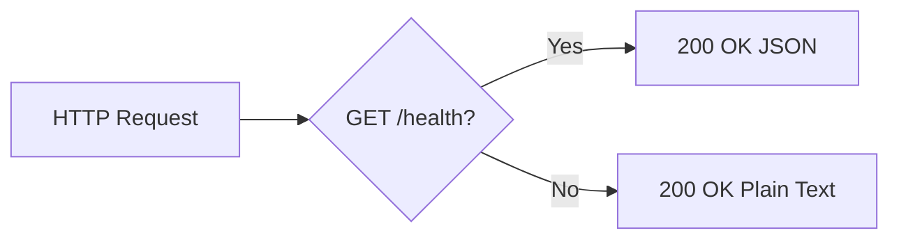

# Technical Specification

# 0. Agent Action Plan

## 0.1 Intent Clarification

### 0.1.1 Core Documentation Objective

Based on the provided requirements, the Blitzy platform understands that the documentation objective is to **comprehensively overhaul and expand the project documentation** for the `hao-backprop-test` Flask HTTP microserver. The user requests creation of a single, consolidated comprehensive README that incorporates setup instructions, API documentation, a deployment guide, and inline code explanations — transforming the currently minimal 36-line `README.md` and lightly-commented `app.py` into a fully self-documenting project.

**Request Categorization:** Update existing documentation + Create new documentation sections + Improve documentation coverage

**Documentation Type:** README file (comprehensive project documentation) + API reference + Deployment guide + Inline code comments

**Documentation Requirements with Enhanced Clarity:**

- **Comprehensive README** — Expand the existing `README.md` from its current minimal form (~36 lines covering only prerequisites, installation, usage, and technology stack) into a full-featured project document that serves as the single authoritative reference for developers, DevOps personnel, and automated pipelines (such as Backprop) interacting with this service.
- **Setup Instructions** — Document the complete environment setup workflow including Python 3.13+ runtime installation, virtual environment creation, dependency installation from `requirements.txt` (pinned `Flask==3.1.3`), environment verification, and first-run confirmation. The existing README has basic setup steps but lacks environment verification, troubleshooting, and prerequisite validation details.
- **API Documentation** — Create a detailed reference for both HTTP endpoints: the `GET /health` JSON health-check endpoint (`app.py` lines 30–37) and the universal catch-all handler accepting all HTTP methods on all paths (`app.py` lines 48–62). This must include request/response formats, status codes, content types, curl examples, and routing behavior.
- **Deployment Guide** — Document how to run the Flask development server locally (`python app.py` binding to `127.0.0.1:3000`), including server configuration constants (`HOST`, `PORT`, `METHODS` defined at `app.py` lines 22–24), startup verification, and operational considerations. Since this is a localhost-only development server (not production-intended), the guide should clarify this scope.
- **Inline Code Explanations** — Enhance the existing docstrings and comments in `app.py` with additional inline annotations that explain the architectural reasoning behind key implementation decisions: the dual-decorator catch-all pattern (lines 48–49), the route registration ordering for precedence correctness, the `jsonify` vs `Response` choice, and the behavioral backward compatibility with the original Node.js server.

**Inferred Documentation Needs:**

- Based on code analysis: `app.py` contains well-structured docstrings for the `health()` and `catch_all()` functions, but lacks inline explanations for the configuration constants block (lines 14–24) and the entry point guard pattern (lines 65–72).
- Based on structure: The project has empty Node.js placeholder files (`package.json`, `package-lock.json`, `server.js`) that require documentation to prevent developer confusion about the active technology stack.
- Based on dependencies: The transitive dependency chain (Flask → Werkzeug, Jinja2, MarkupSafe, itsdangerous, click, blinker) should be documented so developers understand what gets installed and which packages are actively used at runtime.
- Based on user journey: A new developer cloning this repository needs a clear path from "git clone" to "server running and verified" — the current README covers this minimally but omits verification steps and troubleshooting.

### 0.1.2 Special Instructions and Constraints

**User-Specified Rule:**
- "Do not make any updates or changes in GitHub App to create or update a workflow." — This means CI/CD workflow files (`.github/workflows/`) are strictly out of scope. No documentation changes should reference or modify workflow configurations.

**Style Preferences:**
- The existing `README.md` uses standard GitHub-flavored Markdown with bash code blocks — the expanded documentation must maintain this convention.
- Inline code explanations in `app.py` must follow PEP 257 docstring conventions and PEP 8 comment style already established in the file (line-length-appropriate `#` block comments with separator lines `# ---...---`).

**Constraints:**
- This is a documentation-only task — no functional changes to `app.py` logic, no new Python modules, no new dependencies.
- The project is explicitly not production-intended; documentation must not imply production readiness.
- All documentation must accurately reflect the current codebase state (73-line `app.py`, single `Flask==3.1.3` dependency).

### 0.1.3 Technical Interpretation

These documentation requirements translate to the following technical documentation strategy:

- To **create a comprehensive README**, we will update `README.md` by restructuring and expanding it with new sections for project overview, architecture, detailed setup, API reference, deployment, configuration, project structure, troubleshooting, and technology stack details.
- To **document setup instructions**, we will expand the Installation section in `README.md` to include prerequisite validation commands, virtual environment setup with verification steps, dependency installation with expected output, and post-install smoke tests.
- To **create API documentation**, we will add a dedicated API Reference section within `README.md` that documents both the `GET /health` endpoint and the catch-all handler with complete request/response specifications, curl command examples, and a routing behavior matrix.
- To **create a deployment guide**, we will add a Deployment / Running the Server section within `README.md` covering server startup, configuration constants, expected terminal output, endpoint verification, and shutdown procedures.
- To **add inline code explanations**, we will update `app.py` by enhancing existing comments and adding new inline annotations at key decision points — the import block, configuration constants, route registration order, dual-decorator pattern, jsonify usage, Response construction, and the entry point guard.

## 0.2 Documentation Discovery and Analysis

### 0.2.1 Existing Documentation Infrastructure Assessment

Repository analysis reveals a **minimal, README-only documentation structure** with no documentation generation framework, no dedicated docs directory, and no automated documentation tooling.

**Documentation Files Discovered:**

| File | Location | Lines | Status | Purpose |
|------|----------|-------|--------|---------|
| `README.md` | Root | 36 | Exists — Incomplete | Basic project overview, prerequisites, installation, usage, tech stack |
| `Technical Specifications.md` | `blitzy/documentation/` | Large | Exists — Reference only | Blitzy-generated technical specification for the `/health` endpoint feature |
| `Project Guide.md` | `blitzy/documentation/` | Large | Exists — Reference only | Blitzy-generated delivery report and validation record |

**Documentation Infrastructure Status:**

| Infrastructure Element | Status | Details |
|------------------------|--------|---------|
| Documentation framework | **Not present** | No mkdocs.yml, docusaurus.config.js, sphinx/conf.py, or .readthedocs.yml found |
| API documentation tools | **Not present** | No Swagger/OpenAPI spec, no Flask-RESTx, no Flasgger |
| Diagram tools | **Not present** | No Mermaid CLI or PlantUML configuration; Mermaid is used only within `blitzy/documentation/` markdown |
| Documentation hosting | **Not present** | No deployment configuration for documentation sites |
| Inline documentation | **Partial** | `app.py` contains module-level docstring and function docstrings (PEP 257 compliant), but no inline annotations at key decision points |
| Style guide | **Not present** | No CONTRIBUTING.md or documentation style guide; implicit convention is GitHub-Flavored Markdown |

**Current README.md Analysis (`README.md`, 36 lines):**

The existing README contains five sections: a heading with one-line description, Prerequisites (Python 3.13+, pip), Installation (venv creation + pip install), Usage (python app.py + expected behavior), and Technology Stack (Python 3.13, Flask 3.1.3). It is functional but lacks API documentation, deployment guidance, project architecture, troubleshooting, configuration reference, project structure documentation, and contributor information.

### 0.2.2 Repository Code Analysis for Documentation

**Search patterns used for code requiring documentation:**

| Search Target | Pattern | Files Found | Documentation Status |
|---------------|---------|-------------|---------------------|
| Public APIs / Routes | `@app.route` in `app.py` | 3 decorators (2 endpoints) | Docstrings present; no external API reference doc |
| Module interface | `app.py` module-level docstring | 1 file | Docstring present (lines 1–10); describes purpose and behavior |
| Configuration options | `HOST`, `PORT`, `METHODS` constants | `app.py` lines 22–24 | Block comment present; not documented in README |
| Entry point | `if __name__ == '__main__'` | `app.py` lines 71–72 | Block comment present; not explained in README |
| Dependencies | `requirements.txt` | 1 direct dependency | Listed in README; transitive dependencies undocumented |
| Legacy files | `package.json`, `package-lock.json`, `server.js` | 3 empty files | Not documented; may cause confusion |

**Key Directories Examined:**

| Directory | Contents | Documentation Relevance |
|-----------|----------|------------------------|
| Root (`/`) | `app.py`, `README.md`, `requirements.txt`, 3 empty Node.js placeholders | Primary documentation targets |
| `blitzy/documentation/` | Technical Specifications, Project Guide | Reference material for accurate documentation; not user-facing |

**Related Documentation Found (for context):**

- `blitzy/documentation/Technical Specifications.md` — Contains the full behavioral contract for the `/health` endpoint, route precedence rules, and scope boundaries. Useful as an authoritative source for API documentation content.
- `blitzy/documentation/Project Guide.md` — Contains validation results (7/7 curl tests), development commands, and operational context. Useful as a source for deployment guide and troubleshooting content.

### 0.2.3 Web Search Research Conducted

- **Flask README best practices**: Research confirms that comprehensive Flask project READMEs typically include: project description, prerequisites, installation, configuration, usage/running, API reference with examples, project structure, testing, deployment, and contributing sections. The existing README covers only 3 of these 10 recommended sections.
- **Inline code documentation for Python/Flask**: PEP 257 docstring conventions and PEP 8 inline comment guidelines are the established standards. The existing `app.py` already follows these for function-level docstrings but lacks architectural decision annotations.
- **API documentation for minimal Flask services**: For single-file Flask applications without a dedicated API documentation framework, embedding the API reference directly in the README (with curl examples and response tables) is the recommended approach over introducing a documentation framework like Swagger or Sphinx.

## 0.3 Documentation Scope Analysis

### 0.3.1 Code-to-Documentation Mapping

**Module: `app.py` (73 lines — sole source file)**

| Code Element | Lines | Public API | Current Documentation | Documentation Needed |
|--------------|-------|------------|----------------------|---------------------|
| Module docstring | 1–10 | N/A | Present — describes purpose and behavior | Minor enhancement — add migration context note |
| Flask imports | 12 | N/A | No comment | Inline explanation of each imported symbol (`Flask`, `Response`, `jsonify`) |
| `app = Flask(__name__)` | 17 | Application instance | Block comment present | Inline explanation of `__name__` parameter purpose |
| `HOST = '127.0.0.1'` | 22 | Configuration | Block comment present | Inline note explaining localhost-only binding rationale |
| `PORT = 3000` | 23 | Configuration | Block comment present | Inline note explaining Node.js port parity |
| `METHODS` list | 24 | Configuration | Block comment present | Inline note listing all 7 methods with their purpose |
| `health()` function | 30–37 | `GET /health` → JSON | PEP 257 docstring present | Full API reference in README; inline enhancement with routing precedence note |
| `catch_all(path)` function | 48–62 | `ANY /*` → text | PEP 257 docstring present | Full API reference in README; inline enhancement explaining dual-decorator pattern |
| Dual-decorator pattern | 48–49 | Routing config | Block comment present (lines 40–47) | Enhanced inline explanation of why two decorators are needed |
| Entry point guard | 71–72 | Server startup | Block comment present (lines 65–70) | Inline explanation of `__main__` guard and `app.run()` parameters |

**Configuration Options Requiring Documentation:**

| Config Element | Source | Documented in README | Documentation Needed |
|----------------|--------|---------------------|---------------------|
| `HOST = '127.0.0.1'` | `app.py` line 22 | Not explicitly | Add to Configuration section in README |
| `PORT = 3000` | `app.py` line 23 | Mentioned in Usage section | Add to Configuration section with rationale |
| `METHODS` list | `app.py` line 24 | Not mentioned | Document supported HTTP methods in API Reference |
| `Flask==3.1.3` | `requirements.txt` | Listed in Tech Stack | Document pin strategy and transitive dependencies |

**Endpoints Requiring API Documentation:**

| Endpoint | Method(s) | Handler | Response Type | Current API Docs | Docs Needed |
|----------|-----------|---------|---------------|-----------------|-------------|
| `/health` | GET | `health()` | `application/json` — `{"status": "ok"}` | None in README | Full API reference with curl example, response schema, status codes |
| `/` and `/<path:path>` | GET, POST, PUT, DELETE, PATCH, HEAD, OPTIONS | `catch_all(path)` | `text/plain` — `Hello, World!\n` | One-line mention in README | Full API reference with multi-method examples, response format, routing behavior |

### 0.3.2 Documentation Gap Analysis

Given the requirements and repository analysis, documentation gaps include:

**Critical Gaps (required by user):**

| Gap Category | Current State | Required State | Files Affected |
|--------------|---------------|----------------|----------------|
| Comprehensive README | 36-line minimal README with 5 sections | Full-featured README with 10+ sections | `README.md` |
| Setup instructions | Basic 4-command install flow | Complete setup with prerequisites validation, verification, troubleshooting | `README.md` |
| API documentation | Zero API docs in README | Full endpoint reference with examples for both routes | `README.md` |
| Deployment guide | Single `python app.py` command | Complete deployment section with startup, verification, configuration, shutdown | `README.md` |
| Inline code explanations | Docstrings and block comments only | Enhanced inline annotations at all key decision points | `app.py` |

**Significant Gaps (inferred from analysis):**

| Gap Category | Current State | Required State | Files Affected |
|--------------|---------------|----------------|----------------|
| Project structure documentation | Not documented | File-by-file explanation of repository contents | `README.md` |
| Legacy file explanation | No mention of empty Node.js files | Clear documentation of migration context and placeholder status | `README.md` |
| Transitive dependency documentation | Only Flask mentioned | Full dependency tree with active vs. unused distinction | `README.md` |
| Troubleshooting guide | Not present | Common issues (port conflict, missing Flask, Python version) and solutions | `README.md` |
| Architecture overview | Not in README | Brief architecture description with routing flow | `README.md` |

**Undocumented Public APIs:** 2 of 2 endpoints lack README documentation (0% API coverage in user-facing docs)

**Missing User Guides:** Setup verification steps, troubleshooting guide, and server operation guide are entirely absent.

**Outdated Documentation:** None — the existing README content is accurate but incomplete.

## 0.4 Documentation Implementation Design

### 0.4.1 Documentation Structure Planning

Since this is a minimal single-file Flask application, the documentation strategy consolidates all content within a significantly expanded `README.md` rather than introducing a dedicated `docs/` folder or documentation framework. This approach is appropriate because the project has a single source file, one dependency, and two endpoints — a multi-file documentation structure would introduce unnecessary complexity.

**Planned README.md Structure:**

| Section | Heading Level | Content Summary |
|---------|---------------|-----------------|
| Title and Description | `#` | Project name, badges, expanded one-paragraph description |
| Overview | `##` | Purpose, Backprop integration context, capabilities |
| Architecture | `##` | System design overview with Mermaid routing diagram |
| Project Structure | `##` | File-by-file repository explanation including legacy placeholders |
| Prerequisites | `##` | Python 3.13+, pip, venv — with verification commands |
| Installation | `##` | Step-by-step setup with verification and expected output |
| Running the Server | `##` | Startup command, expected output, endpoint verification |
| API Reference | `##` | Complete endpoint documentation (two sub-sections) |
| — Health Check Endpoint | `###` | GET /health — request, response, curl example |
| — Catch-All Handler | `###` | ANY /* — request, response, multi-method examples |
| Configuration | `##` | HOST, PORT, METHODS constants reference table |
| Technology Stack | `##` | Expanded with full dependency tree and active/unused status |
| Troubleshooting | `##` | Common issues (port conflict, missing Flask, Python version) |
| License | `##` | License information if applicable |

**Inline Code Enhancement Plan for `app.py`:**

| Code Region | Lines | Current State | Enhancement |
|-------------|-------|---------------|-------------|
| Module docstring | 1–10 | Purpose and behavior described | Add migration context note |
| Import statement | 12 | No inline comment | Inline comment for each imported symbol |
| Application instance | 14–17 | Block comment present | Inline explanation of `Flask(__name__)` |
| Configuration constants | 19–24 | Block comment present | Inline rationale for each value |
| Health endpoint | 27–37 | Docstring present | Routing precedence note |
| Catch-all handler | 40–62 | Docstring + block comment | Enhanced dual-decorator explanation |
| Entry point guard | 65–72 | Block comment present | `__main__` pattern explanation |

### 0.4.2 Content Generation Strategy

**Information Extraction Approach:**

- Extract API signatures and response formats from `app.py` lines 30–37 (health endpoint) and lines 48–62 (catch-all handler) using direct code inspection.
- Generate curl command examples by referencing the 7 verified test scenarios documented in `blitzy/documentation/Project Guide.md` and the routing behavior matrix from `blitzy/documentation/Technical Specifications.md`.
- Create the architecture overview diagram by mapping the component relationships identified in `app.py` (Flask instance → route handlers → Werkzeug server).
- Derive troubleshooting scenarios from the startup failure modes documented in the Technical Specifications (ImportError, OSError for port conflict, Python version incompatibility).

**Documentation Standards:**

- Markdown formatting: GitHub-Flavored Markdown with ATX-style headers (`#`, `##`, `###`)
- Code examples: Fenced code blocks with `bash` or `python` language identifiers for syntax highlighting
- Mermaid diagram integration: Use fenced mermaid code blocks for the architecture diagram within README.md (GitHub natively renders Mermaid)
- Curl examples: Complete, copy-paste-ready commands with expected output shown beneath
- Source citations: Reference specific `app.py` line numbers in parenthetical annotations (e.g., "defined at `app.py:22`")
- Tables: Used for API response documentation, configuration reference, and project structure

### 0.4.3 Diagram and Visual Strategy

**Mermaid Diagrams to Create:**

| Diagram | Type | Location | Purpose |
|---------|------|----------|---------|
| Request Routing Flow | Flowchart | `README.md` — Architecture section | Visualize how incoming HTTP requests are routed to either the health handler or catch-all handler |

**Diagram Specification — Request Routing Flow:**

This single focused diagram is appropriate for the README context — it conveys the core routing logic without overwhelming developers with framework-level detail that belongs in the Technical Specifications.

## 0.5 Documentation File Transformation Mapping

### 0.5.1 File-by-File Documentation Plan

The following table maps every documentation file to be created, updated, or used as reference material. The target documentation file is listed first in each row.

| Target Documentation File | Transformation | Source Code/Docs | Content/Changes |
|---------------------------|----------------|------------------|-----------------|
| `README.md` | **UPDATE** | `README.md`, `app.py`, `requirements.txt` | Complete restructure and expansion: add Overview, Architecture (with Mermaid routing diagram), Project Structure, expanded Prerequisites with verification commands, expanded Installation with expected output, Running the Server (deployment guide with startup/verification/shutdown), API Reference with two sub-sections (GET /health and catch-all handler with curl examples and response tables), Configuration reference table for HOST/PORT/METHODS, expanded Technology Stack with transitive dependency tree, and Troubleshooting section for common issues |
| `app.py` | **UPDATE** | `app.py` | Add enhanced inline code explanations: import line annotations for Flask/Response/jsonify, rationale comments for HOST (localhost-only binding), PORT (Node.js parity), METHODS (comprehensive HTTP method coverage), route registration ordering note before health endpoint, dual-decorator pattern explanation enhancement, and entry point guard pattern annotation. No functional logic changes. |
| `blitzy/documentation/Technical Specifications.md` | **REFERENCE** | N/A | Use as authoritative source for API behavioral contract (routing precedence rules, response formats, endpoint specifications) and system architecture details when generating README content |
| `blitzy/documentation/Project Guide.md` | **REFERENCE** | N/A | Use as source for validated curl test commands (7/7 scenarios), development workflow commands, and troubleshooting context when generating README content |

### 0.5.2 New Documentation Sections Detail

No new standalone documentation files are being created. All new documentation is embedded within the expanded `README.md`. The following details the new sections:

**File: `README.md` — Section: Overview**
- Type: Project Description
- Source Code: `app.py` lines 1–10 (module docstring), `README.md` line 3 (existing description)
- Content:
    - Expanded project description explaining purpose as Backprop integration test harness
    - Capabilities summary (health check endpoint + universal catch-all)
    - Migration context (Node.js → Python/Flask)
    - Intended audience (developers, DevOps, automated pipelines)
- Key Citations: `app.py:1-10`, `README.md`

**File: `README.md` — Section: Architecture**
- Type: System Overview
- Source Code: `app.py` lines 17–62 (Flask instance, routes)
- Content:
    - Brief architectural description (single-file monolithic Flask microserver)
    - Mermaid flowchart showing request routing decision
    - Component summary (Flask instance, health handler, catch-all handler, Werkzeug server)
- Key Citations: `app.py:17`, `app.py:30-37`, `app.py:48-62`

**File: `README.md` — Section: Project Structure**
- Type: Repository Guide
- Source Code: All root files
- Content:
    - File tree with description of each file
    - Explanation of active files (`app.py`, `requirements.txt`, `README.md`) vs. legacy placeholders (`server.js`, `package.json`, `package-lock.json`)
    - Explanation of `blitzy/documentation/` purpose
- Key Citations: Root directory listing

**File: `README.md` — Section: API Reference**
- Type: API Documentation
- Source Code: `app.py` lines 30–37 (health endpoint), `app.py` lines 48–62 (catch-all)
- Sections:
    - Health Check Endpoint: method, path, response content-type, response body, status code, curl example with expected output
    - Catch-All Handler: supported methods, path pattern, response content-type, response body, status code, multi-method curl examples
    - Routing Behavior Matrix: table showing which handler serves each request pattern
- Key Citations: `app.py:30-37`, `app.py:48-62`, `app.py:24`

**File: `README.md` — Section: Running the Server (Deployment Guide)**
- Type: Deployment/Operations
- Source Code: `app.py` lines 71–72 (entry point), `app.py` lines 22–24 (config)
- Content:
    - Server startup command and expected terminal output
    - Endpoint verification curl commands
    - Configuration constants reference
    - Server shutdown instructions (Ctrl+C)
    - Important note: development server only, not production-intended
- Key Citations: `app.py:22-24`, `app.py:71-72`

**File: `README.md` — Section: Troubleshooting**
- Type: Operations Guide
- Source Code: Derived from `blitzy/documentation/Technical Specifications.md` error analysis
- Content:
    - Port 3000 already in use (OSError resolution)
    - Flask not installed (ImportError resolution)
    - Python version incompatibility (SyntaxError resolution)
    - Verification commands for each scenario
- Key Citations: `app.py:12` (imports), `app.py:72` (app.run), `requirements.txt`

### 0.5.3 Documentation Files to Update Detail

**`README.md` — Complete Restructure and Expansion**

| Existing Section | Action | Changes |
|-----------------|--------|---------|
| `# hao-backprop-test` (heading) | Retain | Keep project title |
| One-line description | Expand | Extend into a full paragraph with purpose, capabilities, and context |
| `## Prerequisites` | Expand | Add verification commands (`python3 --version`, `pip --version`), clarify Python 3.13+ requirement |
| `## Installation` | Expand | Add expected output for each command, add post-install verification step, add virtual environment activation reminder for different shells |
| `## Usage` | Replace | Rename to "Running the Server" and expand with startup output, verification curl commands, shutdown instructions |
| `## Technology Stack` | Expand | Add transitive dependency tree table with active/unused status for each package |
| (new) `## Overview` | Create | Add after title — expanded project description |
| (new) `## Architecture` | Create | System design with Mermaid diagram |
| (new) `## Project Structure` | Create | File tree with descriptions |
| (new) `## API Reference` | Create | Complete endpoint documentation with examples |
| (new) `## Configuration` | Create | Constants reference table |
| (new) `## Troubleshooting` | Create | Common issues and solutions |

**`app.py` — Inline Code Explanation Enhancements**

| Location | Current Comment | Enhancement |
|----------|----------------|-------------|
| Line 12 (imports) | None | Add `# Flask: web framework; Response: custom HTTP responses; jsonify: JSON helper` |
| Lines 22–24 (constants) | Block comment: "match the original Node.js server.js values" | Add per-line annotations explaining localhost-only security rationale, Node.js port parity, and comprehensive method list purpose |
| Before line 30 (health route) | Block comment about programmatic verification | Add note: this route is registered FIRST to ensure Flask routing precedence over the catch-all |
| Lines 48–49 (dual decorator) | Block comment explaining the pattern | Enhance with concise explanation of why two decorators are required (root path vs. subpaths) |
| Line 62 (Response construction) | Part of existing docstring | Add inline note about explicit trailing newline for Node.js behavioral parity |
| Line 72 (app.run) | Block comment about equivalent to Node.js server.listen | Add inline note about Werkzeug development server limitations |

### 0.5.4 Cross-Documentation Dependencies

| Dependency Type | Source | Target | Impact |
|-----------------|--------|--------|--------|
| API contract | `app.py` route definitions | `README.md` API Reference | API docs must exactly match implemented routes |
| Configuration values | `app.py` lines 22–24 | `README.md` Configuration section | Config docs must reflect hardcoded values |
| Startup behavior | `app.py` lines 71–72 | `README.md` Running the Server section | Deployment docs must match actual startup |
| Dependency version | `requirements.txt` | `README.md` Technology Stack | Version references must be synchronized |
| Inline comments | `app.py` comments | `README.md` Architecture section | Architecture description must align with inline explanations |

## 0.6 Dependency Inventory

### 0.6.1 Documentation Dependencies

This documentation task does not require any additional documentation tooling or packages to be installed. The project uses plain Markdown (GitHub-Flavored Markdown) for all documentation, and Mermaid diagrams are rendered natively by GitHub. No documentation generator (mkdocs, Sphinx, Docusaurus) is needed or appropriate for this minimal project.

**Runtime Dependencies (documented, not added):**

The following table lists the project's actual runtime dependencies — these are the packages that must be accurately documented in the expanded README. Versions were verified by installing `Flask==3.1.3` in a Python 3.13.12 virtual environment.

| Registry | Package Name | Version | Purpose | Active in Code |
|----------|-------------|---------|---------|----------------|
| PyPI | Flask | 3.1.3 | Web framework — application core | **Yes** — `app.py` line 12 |
| PyPI | Werkzeug | 3.1.7 | WSGI server and HTTP utilities | **Yes** — powers `app.run()` |
| PyPI | Jinja2 | 3.1.6 | Template rendering engine | No — no templates used |
| PyPI | MarkupSafe | 3.0.3 | HTML/XML string escaping | No — no markup generation |
| PyPI | itsdangerous | 2.2.0 | Cryptographic data signing | No — no sessions or tokens |
| PyPI | click | 8.3.1 | CLI argument parsing framework | No — no CLI commands defined |
| PyPI | blinker | 1.9.0 | Signal/event dispatching | No — no signal handlers |

**Documentation Tooling (native — no installation required):**

| Tool | Purpose | Status |
|------|---------|--------|
| GitHub-Flavored Markdown | README formatting, tables, code blocks | Built into GitHub rendering |
| Mermaid (GitHub native) | Architecture and routing diagrams in README | Built into GitHub Markdown renderer |
| Python inline comments/docstrings | Inline code explanations in `app.py` | Built into Python language |

### 0.6.2 Documentation Reference Updates

No link transformation rules are required since the project has no existing cross-linked documentation files. The expanded `README.md` will be self-contained with all internal references using standard Markdown anchor links to sections within the same file.

**Internal anchor links to be created:**

| Link Source (in README.md) | Link Target (in README.md) | Purpose |
|---------------------------|---------------------------|---------|
| Table of Contents | All `##` sections | Navigation within comprehensive README |
| API Reference intro | Configuration section | Reference to server binding details |
| Troubleshooting items | Installation section | Link back to setup steps for resolution |
| Architecture section | API Reference section | Cross-reference from design to endpoint details |

## 0.7 Coverage and Quality Targets

### 0.7.1 Documentation Coverage Metrics

**Current Coverage Analysis:**

| Coverage Dimension | Documented | Total | Coverage | Target |
|--------------------|-----------|-------|----------|--------|
| Public API endpoints documented in README | 0 | 2 | 0% | 100% |
| Configuration options documented in README | 0 | 3 (HOST, PORT, METHODS) | 0% | 100% |
| Source files with inline explanations | 0 (docstrings exist, inline explanations absent) | 1 (`app.py`) | 0% | 100% |
| Repository files explained in Project Structure | 0 | 7 (app.py, README.md, requirements.txt, package.json, package-lock.json, server.js, blitzy/) | 0% | 100% |
| Setup steps with verification | 0 | 4 (prerequisites, venv, install, run) | 0% | 100% |
| Troubleshooting scenarios documented | 0 | 3 (port conflict, missing Flask, Python version) | 0% | 100% |
| Dependency tree documented (direct + transitive) | 1 (Flask only in current README) | 7 | 14% | 100% |

**Coverage Gaps to Address:**

| Area | Currently | Target | Action |
|------|-----------|--------|--------|
| API Reference | No endpoint documentation | 2/2 endpoints fully documented with curl examples | Create API Reference section in README |
| Setup Guide | Basic 4-command flow | Complete flow with prerequisites check, verification, and expected output | Expand Installation section |
| Deployment Guide | Single `python app.py` line | Full deployment section with config, verification, and operational notes | Create Running the Server section |
| Inline Annotations | Block comments and docstrings only | Inline explanations at 6+ key decision points in `app.py` | Add inline comments in app.py |
| Architecture Overview | Not in README | Mermaid diagram + prose description | Create Architecture section |
| Project Structure | Not documented | All 7 root entries explained | Create Project Structure section |
| Troubleshooting | Not present | 3+ common issue/solution pairs | Create Troubleshooting section |

### 0.7.2 Documentation Quality Criteria

**Completeness Requirements:**

- All public API endpoints (`GET /health` and catch-all) have: description, URL path, HTTP method(s), request format, response content-type, response body example, status codes, and at least one curl example with expected output
- Setup guide includes: prerequisite version checks, virtual environment creation, dependency installation, and post-install verification
- Deployment guide includes: startup command, expected terminal output, endpoint verification commands, and shutdown procedure
- All inline code explanations reference the specific architectural decision being annotated
- All configuration options (HOST, PORT, METHODS) have: name, value, purpose, and configurability status

**Accuracy Validation:**

- All curl examples must produce the exact output documented (verified against the 7/7 test scenarios in `blitzy/documentation/Project Guide.md`)
- API response formats must exactly match the actual Flask handler implementations in `app.py`
- Dependency versions must match the pinned version in `requirements.txt` and the resolved transitive versions from a fresh `pip install`
- Configuration values in documentation must match the hardcoded constants in `app.py` lines 22–24

**Clarity Standards:**

- Technical accuracy with accessible language suitable for developers new to the project
- Progressive disclosure: Overview → Architecture → Setup → Usage → API Reference → Advanced (Config, Troubleshooting)
- Consistent terminology: "health check endpoint" (not "health route" or "health API"), "catch-all handler" (not "default route" or "fallback")
- All code examples are copy-paste-ready with no manual substitution required

**Maintainability:**

- Source citations (`app.py:LineNumber`) embedded in documentation for traceability
- Self-contained README requires no external documentation dependencies
- Inline code comments in `app.py` are concise and will not become stale unless the code logic itself changes

### 0.7.3 Example and Diagram Requirements

| Requirement | Count | Details |
|-------------|-------|---------|
| Curl examples for `/health` endpoint | Minimum 1 | `curl -s http://127.0.0.1:3000/health` with JSON output |
| Curl examples for catch-all handler | Minimum 2 | GET and POST to demonstrate method-agnostic behavior |
| Routing behavior matrix | 1 table | 5+ rows showing request patterns and their matched handler |
| Mermaid diagrams in README | 1 | Request routing flowchart |
| Inline code annotations in `app.py` | Minimum 6 | One per key decision point (imports, config, health route, catch-all, dual-decorator, entry point) |
| Configuration reference table | 1 | All 3 constants with values, types, and descriptions |
| Dependency tree table | 1 | All 7 packages with version, purpose, and active status |
| Troubleshooting entries | Minimum 3 | Port conflict, missing dependency, Python version |

## 0.8 Scope Boundaries

### 0.8.1 Exhaustively In Scope

**Documentation Files to Update:**

| File Pattern | Action | Description |
|-------------|--------|-------------|
| `README.md` | UPDATE | Complete restructure and expansion with Overview, Architecture, Project Structure, Prerequisites, Installation, Running the Server, API Reference, Configuration, Technology Stack, Troubleshooting sections |

**Source Files to Update (inline documentation only):**

| File Pattern | Action | Description |
|-------------|--------|-------------|
| `app.py` | UPDATE (comments only) | Add enhanced inline code explanations at key decision points — import annotations, configuration rationale, routing precedence notes, dual-decorator explanation, entry point guard annotation. No functional logic changes. |

**Documentation Reference Sources:**

| File Pattern | Action | Description |
|-------------|--------|-------------|
| `blitzy/documentation/Technical Specifications.md` | REFERENCE | Authoritative source for API behavioral contract, routing precedence rules, and system architecture |
| `blitzy/documentation/Project Guide.md` | REFERENCE | Source for validated curl commands, development workflow, and troubleshooting scenarios |
| `requirements.txt` | REFERENCE | Source for dependency version information |

**Documentation Content Elements In Scope:**

- Comprehensive project overview with Backprop integration context
- System architecture description with Mermaid routing diagram
- Repository file structure documentation (all 7 root-level entries + blitzy/ subfolder)
- Detailed prerequisites with version verification commands
- Step-by-step installation guide with expected output for each step
- Deployment/running guide with startup, verification, and shutdown procedures
- Complete API reference for both endpoints (GET /health and catch-all)
- Curl examples with expected output for all documented endpoints
- Configuration constants reference (HOST, PORT, METHODS)
- Full dependency tree table (1 direct + 6 transitive) with active/unused status
- Troubleshooting section for common startup/runtime issues
- Inline code annotations in `app.py` at 6+ key decision points

### 0.8.2 Explicitly Out of Scope

| Excluded Item | Category | Rationale |
|---------------|----------|-----------|
| Source code logic modifications in `app.py` | Code changes | This is a documentation-only task; functional behavior must remain identical |
| New Python source files | Code changes | No new modules, tests, or configuration files are to be created |
| New dependency additions | Dependencies | No documentation framework (mkdocs, Sphinx, etc.) to be added to `requirements.txt` |
| CI/CD workflow modifications | DevOps | User rule: "Do not make any updates or changes in GitHub App to create or update a workflow" |
| `.github/workflows/` files | DevOps | Explicitly excluded per user-specified rule |
| Test file creation or modification | Testing | No pytest, unittest, or test files are part of this documentation task |
| `package.json` / `package-lock.json` / `server.js` modifications | Legacy files | These are empty placeholders; documentation explains them but does not modify them |
| `blitzy/documentation/` modifications | Reference docs | These files are used as reference only, not modified |
| Documentation hosting or deployment setup | Infrastructure | No documentation site, GitHub Pages, or ReadTheDocs configuration |
| Production deployment documentation | Operations | The server is explicitly not production-intended; deployment guide covers local development only |
| API versioning or OpenAPI/Swagger specification | API docs | The project has no API versioning; a formal spec is inappropriate for a 2-endpoint test harness |
| New `docs/` directory creation | Structure | All documentation is consolidated in `README.md` — no separate docs folder warranted for this project size |
- Any items not explicitly listed in the "In Scope" section above

## 0.9 Execution Parameters and Rules

### 0.9.1 Documentation-Specific Instructions

| Parameter | Value |
|-----------|-------|
| Documentation format | GitHub-Flavored Markdown (`.md`) |
| Diagram format | Mermaid (rendered natively by GitHub) |
| Documentation build command | N/A — no documentation generator; README renders directly on GitHub |
| Documentation preview command | Open `README.md` in any Markdown previewer or push to GitHub |
| Diagram generation command | N/A — Mermaid diagrams are embedded inline in Markdown |
| Documentation deployment command | N/A — no separate documentation site |
| Citation requirement | Every technical claim in README references source files with line numbers |
| Style guide | Follow existing `README.md` conventions (GFM, ATX headers, fenced code blocks) |
| Documentation validation | Manual review — verify all curl examples produce documented output |
| Inline code style | PEP 8 inline comments (`# comment`), PEP 257 docstrings |

### 0.9.2 Rules for Documentation

The following rules and constraints govern this documentation task:

**User-Specified Rules:**

- **"Do not make any updates or changes in GitHub App to create or update a workflow."** — No CI/CD workflow files (`.github/workflows/`) may be created, modified, or referenced as targets. Documentation may describe the project's current state but must not include workflow configuration changes.

**Inferred Documentation Rules (from project context):**

- **No production claims:** All deployment documentation must explicitly state that the Flask development server (Werkzeug) is not suitable for production use. The README must not imply production readiness.
- **Behavioral accuracy:** All API documentation (request patterns, response formats, status codes) must exactly match the implemented behavior in `app.py`. No aspirational or planned features may be documented as current capabilities.
- **Version accuracy:** All dependency versions referenced in documentation must match `requirements.txt` (`Flask==3.1.3`) and the verified transitive dependency versions. No "latest" or approximate versions.
- **No functional changes:** Inline code explanation enhancements to `app.py` must consist solely of comments and docstring updates. No changes to import statements, function signatures, route definitions, response construction, or control flow.
- **Preserve existing conventions:** Enhanced inline comments in `app.py` must follow the established style: block comments using `# ---...---` separator lines, inline comments using `#`, and function docstrings using PEP 257 triple-quote format.
- **Legacy file transparency:** Documentation must explain the presence of empty Node.js placeholder files (`server.js`, `package.json`, `package-lock.json`) to prevent developer confusion about the active technology stack.
- **Self-contained README:** The comprehensive README must be fully self-contained — all essential information accessible without navigating to other files. The `blitzy/documentation/` files are internal references, not user-facing documentation.

## 0.10 References

### 0.10.1 Repository Files and Folders Searched

The following files and folders were inspected during the analysis phase to derive the conclusions and mappings in this Agent Action Plan:

**Source Files Inspected (full content retrieved):**

| File Path | Lines | Purpose in Analysis |
|-----------|-------|---------------------|
| `app.py` | 73 | Primary source file — analyzed for all code elements requiring documentation: routes, configuration constants, imports, docstrings, comments, entry point |
| `README.md` | 36 | Existing documentation — analyzed for current coverage, structure, style conventions, and content gaps |
| `requirements.txt` | 1 | Dependency manifest — verified pinned Flask version (`Flask==3.1.3`) for documentation accuracy |
| `package.json` | 0 (empty) | Confirmed empty — documented as legacy Node.js placeholder requiring explanation in project structure |
| `server.js` | 0 (empty) | Confirmed empty — documented as legacy Node.js placeholder requiring explanation in project structure |

**Folders Inspected:**

| Folder Path | Children | Purpose in Analysis |
|-------------|----------|---------------------|
| Root (`/`) | 7 entries (4 files, 1 folder, 2 empty files) | Full repository structure discovery — identified all files requiring documentation |
| `blitzy/` | 1 subfolder (`documentation/`) | Identified as documentation-only container — not user-facing |
| `blitzy/documentation/` | 2 files | Identified reference documentation sources |

**Reference Documents Inspected (summary-level):**

| File Path | Purpose in Analysis |
|-----------|---------------------|
| `blitzy/documentation/Technical Specifications.md` | Authoritative source for API behavioral contract, routing precedence rules, scope boundaries, architecture decisions, and constraint documentation |
| `blitzy/documentation/Project Guide.md` | Source for validated test scenarios (7/7 curl tests), development commands, operational workflow, and troubleshooting context |

### 0.10.2 Technical Specification Sections Consulted

The following sections from the existing Technical Specification document were retrieved and analyzed:

| Section | Key Information Extracted |
|---------|--------------------------|
| 1.1 Executive Summary | Project purpose (Backprop integration test harness), stakeholders, value proposition, demo-level classification |
| 1.2 System Overview | Migration history (Node.js → Flask), system capabilities (2 endpoints), component architecture, success criteria |
| 1.3 Scope | In-scope features, out-of-scope items, future considerations including documentation updates |
| 2.1 Feature Catalog | Feature details for F-001 (health check), F-002 (catch-all), F-003 (configuration), F-004 (server execution) |
| 3.1 Technology Stack Overview | Complete stack inventory, migration context, transitive dependency identification |
| 3.4 Open Source Dependencies | Direct dependency (Flask 3.1.3), transitive dependency tree (6 packages), pin strategy, management approach |
| 4.2 Core Process Flows | Server startup sequence, HTTP request routing decision tree, endpoint process details |
| 5.1 HIGH-LEVEL ARCHITECTURE | Monolithic single-file architecture, system boundaries, data flow, integration points |
| 6.1 Core Services Architecture | Non-applicability assessment confirming minimal architecture, failure modes, recovery procedures |
| 8.3 Deployment Environment | Local-only deployment, server configuration (hardcoded HOST/PORT), environment architecture |

### 0.10.3 External Research Conducted

| Search Query | Key Findings Applied |
|-------------|---------------------|
| "Flask README documentation best practices 2024" | Confirmed that comprehensive Flask READMEs should include 10+ sections; validated that embedding API docs directly in README is appropriate for single-file projects without requiring Swagger/Sphinx |

### 0.10.4 Attachments and External Resources

No user attachments (files, images, or Figma URLs) were provided for this task. All analysis was conducted against the repository codebase and the existing Technical Specification document.

### 0.10.5 Environment Verification

| Component | Verified Version | Source |
|-----------|-----------------|--------|
| Python runtime | 3.13.12 | Installed via deadsnakes PPA per README "Python 3.13+" requirement |
| Flask | 3.1.3 | Installed from PyPI per `requirements.txt` pin |
| Werkzeug (transitive) | 3.1.7 | Resolved by pip during Flask installation |
| Jinja2 (transitive) | 3.1.6 | Resolved by pip during Flask installation |
| MarkupSafe (transitive) | 3.0.3 | Resolved by pip during Flask installation |
| itsdangerous (transitive) | 2.2.0 | Resolved by pip during Flask installation |
| click (transitive) | 8.3.1 | Resolved by pip during Flask installation |
| blinker (transitive) | 1.9.0 | Resolved by pip during Flask installation |

