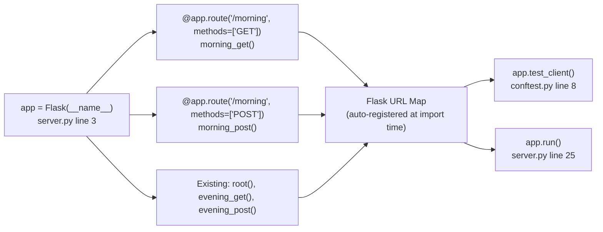

# Technical Specification

# Technical Specification

# Technical Specification

# Technical Specification

# Technical Specification

# Technical Specification

# Technical Specification

# Technical Specification

# Technical Specification

# Technical Specification

# Technical Specification

# 0. Agent Action Plan

## 0.1 Intent Clarification


### 0.1.1 Core Feature Objective

Based on the prompt, the Blitzy platform understands that the new feature requirement is to add a `/morning` HTTP endpoint to the existing Flask application in the **hao-backprop-test** repository. This endpoint will return a static plain-text greeting (`"Good morning"`) with proper HTTP semantics that mirror the existing `/evening` endpoint's behavior:

- **GET `/morning`** — Returns `"Good morning"` with HTTP status `200 OK`
- **POST `/morning`** — Returns `"Good morning"` with HTTP status `201 Created`

The feature directly addresses the need to expand the Backprop integration test surface by introducing an additional endpoint with predictable, deterministic behavior. This enables more comprehensive validation of routing dispatch, response formatting, Content-Type enforcement, and HTTP method differentiation — all within a minimal, controlled test harness.

**Implicit requirements detected:**

- The response body must be the exact byte string `b"Good morning"` — no trailing newline, no surrounding whitespace
- The `Content-Type` header must be explicitly set to `text/plain; charset=utf-8` using Flask's 3-tuple response pattern, consistent with the project's documented fix for the content-type enforcement issue (Feature F-005)
- Unsupported HTTP methods on `/morning` (e.g., PUT, DELETE, PATCH) must return `405 Method Not Allowed` via Flask's default method routing — no custom error handling required
- The new route handlers must not interfere with Flask's import-safe application pattern (Feature F-010), where `app` remains importable without triggering the development server
- All 16 existing tests must continue to pass without any modification

**Feature dependencies and prerequisites:**

- Flask `>=3.0` (already installed as the sole runtime dependency)
- The existing `app = Flask(__name__)` application object in `server.py` (line 3)
- The existing `client` pytest fixture in `tests/conftest.py` (returns `app.test_client()`)

### 0.1.2 Special Instructions and Constraints

The user has provided explicit directives that govern this feature implementation:

- **Minimal change discipline**: Only `server.py` and `tests/test_server.py` may be modified. No new frameworks, services, or architectural changes are permitted.
- **Preserve existing behavior**: All existing endpoints (`/`, `/evening`), their response formats, headers, status codes, and server configuration (host, port, version suppression) must remain completely untouched.
- **Follow existing patterns**: The new `/morning` route must use the same implementation pattern as `/evening` — specifically, separate `@app.route` decorators for GET and POST methods with explicit 3-tuple returns `(body, status, headers)`.
- **No scope creep**: Dynamic responses, time-based greetings, middleware additions, logging, configuration changes, and refactoring of route logic are all explicitly out of scope.
- **Implementation rule**: Do not make any updates or changes in GitHub App to create or update a workflow.

User Example — Expected HTTP interactions:
```
GET /morning  → "Good morning", 200 OK
POST /morning → "Good morning", 201 Created
```

### 0.1.3 Technical Interpretation

These feature requirements translate to the following technical implementation strategy:

- To **implement the GET `/morning` endpoint**, we will create a new route handler function `morning_get()` in `server.py`, decorated with `@app.route("/morning", methods=["GET"])`, returning the 3-tuple `("Good morning", 200, {"Content-Type": "text/plain; charset=utf-8"})`. This follows the exact pattern established by `evening_get()` on lines 11–13.

- To **implement the POST `/morning` endpoint**, we will create a new route handler function `morning_post()` in `server.py`, decorated with `@app.route("/morning", methods=["POST"])`, returning the 3-tuple `("Good morning", 201, {"Content-Type": "text/plain; charset=utf-8"})`. This follows the exact pattern established by `evening_post()` on lines 16–18.

- To **validate the new endpoint**, we will add new test functions in `tests/test_server.py` covering:
  - Happy path: GET status code, GET response body, GET content-type
  - Happy path: POST status code, POST response body, POST content-type
  - Edge case: GET vs. POST status code differentiation on `/morning`
  - Error case: Unsupported method (e.g., DELETE) returns 405

- To **ensure non-regression**, we will confirm that all 16 existing tests continue to pass after the modifications, verifying zero disruption to the existing system.


## 0.2 Repository Scope Discovery


### 0.2.1 Comprehensive File Analysis

The repository is a minimal Flask project with a well-defined file structure. A complete inventory of every file was performed to identify all files affected by this feature addition.

**Active repository files (complete enumeration):**

| File Path | Type | Status | Relevance to Feature |
|---|---|---|---|
| `server.py` | Python source | MODIFY | Primary target — add `/morning` route handlers |
| `tests/test_server.py` | Python test | MODIFY | Add test cases for `/morning` endpoint |
| `tests/conftest.py` | Python fixture | UNCHANGED | Provides `client` fixture — no modification needed |
| `tests/__init__.py` | Python init | UNCHANGED | Package marker — no modification needed |
| `requirements.txt` | Dependency manifest | UNCHANGED | Flask>=3.0 already satisfies requirements |
| `pytest.ini` | Test config | UNCHANGED | `testpaths = tests` already correct |
| `README.md` | Documentation | UNCHANGED | Out of scope per user directive |
| `blitzy/documentation/` | Doc folder | UNCHANGED | Historical documentation — not affected |
| `package.json` | Legacy artifact | UNCHANGED | Empty file — not affected |
| `package-lock.json` | Legacy artifact | UNCHANGED | Empty file — not affected |
| `server.js` | Legacy artifact | UNCHANGED | Empty file — not affected |

**Files requiring direct modification (2 total):**

| File | Current Lines | Modification Type | Specific Changes |
|---|---|---|---|
| `server.py` | 26 lines | ADD new route handlers | Insert two new `@app.route` decorated functions for `/morning` (GET and POST) after the existing `/evening` handlers, before the `if __name__` guard |
| `tests/test_server.py` | 101 lines | ADD new test functions | Append new happy-path tests (status code, response body, content-type for both GET and POST), edge-case test (method differentiation), and error-case test (unsupported method → 405) |

**Integration point discovery:**

- **Route registration**: New routes are registered at import time via Flask's `@app.route` decorator on the module-level `app` object. The existing `app = Flask(__name__)` on `server.py` line 3 serves as the integration point — no additional wiring is needed.
- **Test client**: The `tests/conftest.py` `client` fixture returns `app.test_client()` which automatically gains access to all registered routes. New test functions can use the existing `client` fixture without modification.
- **No database/schema impact**: The application is stateless with zero persistence. No migrations or schema changes are required.
- **No service/middleware impact**: No dependency injection, service containers, or middleware are present in this project. The new routes are self-contained.

### 0.2.2 Existing Code Patterns Analysis

The `/evening` endpoint implementation in `server.py` (lines 11–18) provides the exact template for the `/morning` endpoint:

```python
@app.route("/morning", methods=["GET"])
def morning_get():
    return "Good morning", 200, {"Content-Type": "text/plain; charset=utf-8"}
```

The test patterns in `tests/test_server.py` follow a consistent structure of one assertion per test function, organized by category (happy path → edge case → error case). New tests will replicate this exact pattern.

### 0.2.3 New File Requirements

No new files are required for this feature. All changes are additions within the two existing files identified above:

- **No new source files**: The `/morning` route handlers will be added directly to `server.py`, following the project's single-file architecture
- **No new test files**: Tests will be appended to `tests/test_server.py`, the project's single test module
- **No new configuration files**: No feature-specific configuration is needed — the endpoint returns a hardcoded static response
- **No new migration files**: No database or schema changes apply


## 0.3 Dependency Inventory


### 0.3.1 Private and Public Packages

This feature requires zero new dependencies. All existing packages are sufficient to implement the `/morning` endpoint.

| Registry | Package | Installed Version | Constraint | Purpose | Change Required |
|---|---|---|---|---|---|
| PyPI | Flask | 3.1.3 | `>=3.0` | HTTP routing, response construction, dev server | None |
| PyPI | Werkzeug | 3.1.7 | Transitive (via Flask) | WSGI server, HTTP parsing | None |
| PyPI | Jinja2 | 3.1.6 | Transitive (via Flask) | Template engine (unused by this project) | None |
| PyPI | MarkupSafe | 3.0.3 | Transitive (via Jinja2) | String escaping utilities | None |
| PyPI | itsdangerous | 2.2.0 | Transitive (via Flask) | Data signing (unused by this project) | None |
| PyPI | click | 8.x | Transitive (via Flask) | CLI framework (used by Flask CLI) | None |
| PyPI | blinker | 1.x | Transitive (via Flask) | Signal/event framework | None |
| PyPI | pytest | 9.0.2 | Dev dependency (not in requirements.txt) | Test runner and framework | None |

**Key observations:**
- `requirements.txt` contains a single entry: `Flask>=3.0`
- pytest is intentionally excluded from `requirements.txt` to maintain separation between runtime and development dependencies
- No private or internal packages are used in this project
- No dependency version changes or additions are needed for this feature

### 0.3.2 Dependency Updates

**No dependency updates are required for this feature.**

- **No new imports needed in `server.py`**: The existing `from flask import Flask` on line 1 already provides the `Flask` class and the `@app.route` decorator functionality. No additional Flask modules need to be imported.
- **No new imports needed in `tests/test_server.py`**: The existing imports (`import server`, `from flask import Flask`, `from server import app`) and the `client` fixture from `conftest.py` are sufficient for all new test functions.
- **No external reference updates**: No changes to configuration files, documentation, build files, or CI/CD pipelines are required.
- **No import transformation rules apply**: The codebase uses direct, specific imports that remain valid after the feature addition.


## 0.4 Integration Analysis


### 0.4.1 Existing Code Touchpoints

The integration surface for this feature is intentionally minimal, confined to two files with no cascading effects.

**Direct modifications required:**

| File | Location | Integration Action | Impact |
|---|---|---|---|
| `server.py` | After line 18 (end of `evening_post()`) | Insert two new route handler functions for `/morning` GET and POST | Adds ~10 lines; no existing lines modified |
| `tests/test_server.py` | After line 52 (end of `test_post_evening_content_type`) | Insert new happy-path test functions for `/morning` | Appends new test functions; no existing tests modified |
| `tests/test_server.py` | After line 63 (end of edge-case section) | Insert method differentiation test for `/morning` | Appends one edge-case test |
| `tests/test_server.py` | After line 89 (end of error-case section) | Insert unsupported method test for `/morning` | Appends one error-case test |

**Files with implicit integration (no modification needed):**

| File | Relationship | Why No Change Required |
|---|---|---|
| `tests/conftest.py` | Provides `client` fixture via `app.test_client()` | New routes are automatically available through the test client since they are registered on the same `app` object |
| `tests/__init__.py` | Package initializer | Structural only — no behavioral relationship |
| `pytest.ini` | Directs pytest to `tests/` directory | Already configured to discover all tests in `tests/` |
| `requirements.txt` | Declares `Flask>=3.0` | No new dependencies needed |

### 0.4.2 Flask Route Registration Integration

The integration mechanism for new routes in Flask is decorator-based and requires zero explicit wiring:



- Route handlers are registered at module import time when the `@app.route` decorator executes
- The Flask URL map accumulates all routes on the `app` object
- Both `app.test_client()` (used in tests) and `app.run()` (used for server startup) consume the same URL map
- No dependency injection, service registration, or configuration wiring is involved

### 0.4.3 Database and Schema Updates

Not applicable. The application is entirely stateless with no database, no ORM, no migrations, and no persistent storage of any kind.

### 0.4.4 Non-Regression Verification

After integration, the following must hold true:

- All 16 existing tests pass without modification (verified baseline: 16 passed in 0.03s)
- Existing endpoint responses remain byte-identical:
  - `GET /` → `b"Hello, World!"`, status 200
  - `GET /evening` → `b"Good evening"`, status 200
  - `POST /evening` → `b"Good evening"`, status 201
- Flask's default 404 and 405 error handling continues to function for all routes
- The `app` object remains importable without triggering the server (Feature F-010)


## 0.5 Technical Implementation


### 0.5.1 File-by-File Execution Plan

Every file listed below MUST be created or modified as specified. No other files in the repository are to be touched.

**Group 1 — Core Feature File:**

| Action | File | Purpose | Details |
|---|---|---|---|
| MODIFY | `server.py` | Add `/morning` route handlers | Insert two new decorated functions after the existing `/evening` handlers (after line 18) and before the `if __name__` guard (line 21). Each function returns a 3-tuple with explicit Content-Type header. |

Specific additions to `server.py`:
- `morning_get()` — Decorated with `@app.route("/morning", methods=["GET"])`, returns `("Good morning", 200, {"Content-Type": "text/plain; charset=utf-8"})`
- `morning_post()` — Decorated with `@app.route("/morning", methods=["POST"])`, returns `("Good morning", 201, {"Content-Type": "text/plain; charset=utf-8"})`

**Group 2 — Test Coverage:**

| Action | File | Purpose | Details |
|---|---|---|---|
| MODIFY | `tests/test_server.py` | Add comprehensive tests for `/morning` | Append new test functions following the existing test organization pattern: happy-path, edge-case, and error-case sections. |

Specific test additions to `tests/test_server.py`:

- Happy-path tests (mirroring `/evening` test pattern):
  - `test_get_morning_status_code` — Asserts `client.get("/morning").status_code == 200`
  - `test_get_morning_response_body` — Asserts `client.get("/morning").data == b"Good morning"`
  - `test_get_morning_content_type` — Asserts `client.get("/morning").content_type == "text/plain; charset=utf-8"`
  - `test_post_morning_status_code` — Asserts `client.post("/morning").status_code == 201`
  - `test_post_morning_response_body` — Asserts `client.post("/morning").data == b"Good morning"`
  - `test_post_morning_content_type` — Asserts `client.post("/morning").content_type == "text/plain; charset=utf-8"`

- Edge-case test:
  - `test_morning_get_vs_post_status_differentiation` — Asserts GET returns 200, POST returns 201, and the two status codes are not equal

- Error-case test:
  - `test_unsupported_method_on_morning` — Asserts `client.delete("/morning").status_code == 405`

### 0.5.2 Implementation Approach per File

**`server.py` — Route Addition Strategy:**

- Establish the `/morning` feature by inserting two new route handler functions directly after the existing `/evening` handlers
- Each handler follows the identical 3-tuple return pattern `(body, status_code, headers)` already used by all existing routes
- Placement between the `/evening` handlers and the `if __name__` guard maintains logical grouping of all endpoint definitions together before the server startup block
- No existing lines are modified, moved, or deleted — the change is purely additive

**`tests/test_server.py` — Test Addition Strategy:**

- Append new `/morning` happy-path tests immediately after the existing `/evening` happy-path tests (after line 52), maintaining the file's organizational structure
- Append the `/morning` method differentiation edge-case test in the edge-case section (after line 63)
- Append the `/morning` unsupported-method error-case test in the error-case section (after line 89)
- All new tests use the existing `client` fixture from `conftest.py` — no new fixtures needed
- Each test follows the project's single-assertion-per-function convention

### 0.5.3 Post-Implementation Validation

After implementation, run the full test suite to confirm:

```
python -m pytest tests/ -v
```

Expected outcome:
- All 16 existing tests pass (non-regression)
- All 8 new tests pass (feature validation)
- Total: 24 tests passed
- Execution time: under 1 second


## 0.6 Scope Boundaries


### 0.6.1 Exhaustively In Scope

The following is the complete, definitive list of every file, component, and behavior that falls within the scope of this feature addition.

**Source files to modify:**

| File Pattern | Specific File | Lines Affected | Change Type |
|---|---|---|---|
| `server.py` | `server.py` | Insert after line 18 (before `if __name__` guard) | Add `morning_get()` and `morning_post()` route handlers |

**Test files to modify:**

| File Pattern | Specific File | Lines Affected | Change Type |
|---|---|---|---|
| `tests/test_server.py` | `tests/test_server.py` | Append after existing happy-path, edge-case, and error-case sections | Add 8 new test functions |

**Behavioral scope — new endpoint contract:**

| Method | Path | Response Body | Status Code | Content-Type |
|---|---|---|---|---|
| GET | `/morning` | `Good morning` | 200 OK | `text/plain; charset=utf-8` |
| POST | `/morning` | `Good morning` | 201 Created | `text/plain; charset=utf-8` |
| PUT | `/morning` | N/A (Flask default) | 405 Method Not Allowed | `text/html` (Flask default) |
| DELETE | `/morning` | N/A (Flask default) | 405 Method Not Allowed | `text/html` (Flask default) |

**Test scope — new tests to create:**

| Test Function | Assertion | Category |
|---|---|---|
| `test_get_morning_status_code` | `response.status_code == 200` | Happy path |
| `test_get_morning_response_body` | `response.data == b"Good morning"` | Happy path |
| `test_get_morning_content_type` | `response.content_type == "text/plain; charset=utf-8"` | Happy path |
| `test_post_morning_status_code` | `response.status_code == 201` | Happy path |
| `test_post_morning_response_body` | `response.data == b"Good morning"` | Happy path |
| `test_post_morning_content_type` | `response.content_type == "text/plain; charset=utf-8"` | Happy path |
| `test_morning_get_vs_post_status_differentiation` | GET 200 ≠ POST 201 | Edge case |
| `test_unsupported_method_on_morning` | `response.status_code == 405` for DELETE | Error case |

### 0.6.2 Explicitly Out of Scope

The following items are explicitly excluded from this feature addition. These boundaries are enforced by the user's minimal change directive.

**Files that must NOT be modified:**

| File | Reason for Exclusion |
|---|---|
| `tests/conftest.py` | Existing `client` fixture already works for new routes |
| `tests/__init__.py` | Package marker — no functional change needed |
| `requirements.txt` | No new dependencies required |
| `pytest.ini` | Test discovery already configured correctly |
| `README.md` | Documentation updates out of scope per user directive |
| `blitzy/documentation/**` | Historical documentation — unrelated to feature |
| `package.json` | Legacy artifact — not part of active system |
| `package-lock.json` | Legacy artifact — not part of active system |
| `server.js` | Legacy artifact — not part of active system |

**Behaviors explicitly excluded:**

- Dynamic or time-based greetings (e.g., returning different messages based on time of day)
- Refactoring existing route logic or handler structure
- Adding middleware, logging, or request/response interceptors
- Modifying any existing endpoint (`/`, `/evening`) behavior, response format, or status codes
- Changing server configuration (host, port, version suppression)
- Adding new frameworks, libraries, or architectural patterns
- Custom error handlers for 404 or 405 responses
- Performance optimizations or code refactoring unrelated to the feature
- CI/CD pipeline changes or GitHub workflow modifications
- Environment variable or secrets additions


## 0.7 Rules for Feature Addition


### 0.7.1 Minimal Change Discipline

The user has emphasized the following mandatory rules governing this implementation:

- Make only the changes that are absolutely necessary to implement the feature. Do not refactor, optimize, or modify existing code unless it is directly required for the new feature to work. The goal is to add functionality with minimal disruption to the existing system.
- Make only the minimal necessary changes to implement the feature.
- Do not modify code that is not directly related to this feature.
- Do not refactor existing code unless absolutely required.
- Do not change existing interfaces or behaviors unless specified.
- Isolate new code in dedicated sections when possible.
- Document all changes made to existing files with clear comments.
- If issues are identified in existing code, note them but do not fix unless required for the feature.
- When multiple implementation approaches exist, choose the one that requires the least modification to existing code.

### 0.7.2 Pattern Conformance Rules

The following conventions are derived from the existing codebase and must be followed:

- **Route handler naming**: Use `morning_get` and `morning_post` function names, following the `{endpoint}_{method}` pattern established by `evening_get` and `evening_post`
- **Separate decorators per method**: Register GET and POST as separate route handlers with distinct `@app.route` decorators, not a combined `methods=["GET", "POST"]` decorator — this matches the existing `/evening` pattern
- **Explicit 3-tuple returns**: Always return `(body, status_code, headers)` with the Content-Type explicitly set — never rely on Flask's default MIME type behavior
- **Content-Type value**: Use the exact string `"text/plain; charset=utf-8"` — this is the project's enforced response contract (Feature F-005)
- **Test function naming**: Use the pattern `test_{method}_{endpoint}_{assertion_target}` (e.g., `test_get_morning_status_code`) consistent with existing test names
- **Single assertion per test**: Each test function asserts exactly one condition, matching the project's existing test style

### 0.7.3 Implementation-Specific Rule

- **GitHub workflow restriction**: Do not make any updates or changes in GitHub App to create or update a workflow. This rule is explicitly provided by the user and must be honored throughout the implementation.


## 0.8 References


### 0.8.1 Repository Files and Folders Searched

The following is a comprehensive list of every file and folder inspected during the analysis to derive the conclusions in this Agent Action Plan.

**Root-level exploration:**

| Path | Type | Inspection Method | Key Findings |
|---|---|---|---|
| `` (root) | Folder | `get_source_folder_contents` | Identified 9 children: 6 files + 2 folders + 1 legacy folder |
| `server.py` | File | `read_file` (lines 1–26) | 26-line Flask app with 3 routes; confirmed exact pattern for `/evening` |
| `requirements.txt` | File | `read_file` (line 1) | Single dependency: `Flask>=3.0` |
| `pytest.ini` | File | `read_file` (lines 1–2) | `testpaths = tests` |
| `README.md` | File | `read_file` (lines 1–38) | Documents Python 3.10+ prerequisite, 3 existing endpoints, MIT license |
| `package.json` | File | `read_file` | Empty file (legacy artifact) |

**Tests directory exploration:**

| Path | Type | Inspection Method | Key Findings |
|---|---|---|---|
| `tests/` | Folder | `get_source_folder_contents` | 3 files: `__init__.py`, `conftest.py`, `test_server.py` |
| `tests/__init__.py` | File | `read_file` | Empty package initializer |
| `tests/conftest.py` | File | `read_file` (lines 1–8) | Shared `client` fixture returning `app.test_client()` |
| `tests/test_server.py` | File | `read_file` (lines 1–101) | 16 test functions organized by category; confirmed exact test patterns |

**Blitzy documentation exploration:**

| Path | Type | Inspection Method | Key Findings |
|---|---|---|---|
| `blitzy/` | Folder | `get_source_folder_contents` | Documentation hub with `documentation/` subfolder |

**Technical specification sections reviewed:**

| Section | Key Information Extracted |
|---|---|
| 1.1 Executive Summary | Project context as Backprop test harness; MIT license; 26-line codebase |
| 2.1 Feature Catalog | Complete feature inventory (F-001 through F-011); confirmed `/evening` pattern |
| 2.2 Functional Requirements | Acceptance criteria for all existing features; test-to-requirement mapping |
| 3.1 Programming Languages | Python 3.12.10 tested, 3.10+ minimum; Flask as sole runtime dependency |
| 5.2 Component Details | Flask application architecture; route registration mechanism; test infrastructure design |

**Environment verification performed:**

| Check | Result |
|---|---|
| Python version | 3.12.3 |
| Flask version | 3.1.3 |
| Werkzeug version | 3.1.7 |
| pytest version | 9.0.2 |
| Existing test suite | 16/16 passed in 0.03s |
| `.blitzyignore` search | No files found |

### 0.8.2 Attachments

No attachments were provided for this project. No Figma URLs or design assets were referenced.

### 0.8.3 External Resources

No external web searches were required for this feature. The implementation relies entirely on existing Flask routing patterns already established in the codebase, and no new libraries, tools, or techniques are introduced.


