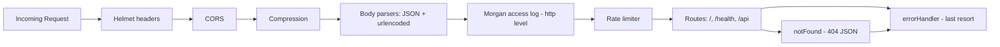

# Technical Specification

# 0. Agent Action Plan

## 0.1 Intent Clarification

### 0.1.1 Core Documentation Objective

Based on the provided requirements, the Blitzy platform understands that the documentation objective is to produce comprehensive, source-citing code documentation for the existing `hello_world` Node.js/Express service without modifying any production code logic or runtime behavior. The documentation must cover module-level Markdown READMEs, cross-cutting `/docs` guides (architecture, API, security, observability, deployment, testing), and JSDoc-style inline comments across every entrypoint, middleware, route, utility, and configuration file already present in the repository.

- Request category: **Create new documentation + Update existing documentation** (mixed-mode). Root `/README.md` exists and is updated, while all module-level READMEs, every `/docs/*.md` guide, and the deeper JSDoc coverage are created new. No documentation is deleted.
- Documentation types involved: **Module README files**, **Architecture documentation**, **API reference documentation**, **Security guide**, **Observability/logging guide**, **Deployment/process-management guide**, **Testing guide**, and **Inline JSDoc code comments**.

Each user-stated documentation requirement is restated below with enhanced technical precision:

- Author a root `README.md` (update if present, create if missing) that introduces the service, its features, prerequisites, install/run instructions, environment contract, PM2 commands, endpoint map, and project layout.
- Author `src/README.md` describing the Express application composition tree and the role of `app.js` as the non-listening factory.
- Author `src/config/README.md` describing the immutable configuration module, `parseIntSafe` semantics, environment variable contract, defaults, and `Object.freeze` guarantees.
- Author `src/middleware/README.md` describing `errorHandler`, `notFound`, and `validateInput` behavior, response shape, pipeline placement, and sanitization integration.
- Author `src/routes/README.md` describing the router aggregation model, `GET /`, `GET /health`, `GET /api`, `GET /api/info`, the 405 method-guard pattern, and Zod-driven empty-body/empty-query validation.
- Author `src/utils/README.md` describing the Winston logger construction, Morgan stream bridge, and sanitization helpers (`sanitizeLogInput`, `sanitizeUrl`).
- Author `/docs/architecture.md` describing bootstrap/app separation (`server.js` vs `src/app.js`), middleware pipeline order with rationale, route aggregation topology, and Mermaid diagrams for the request lifecycle.
- Author `/docs/api.md` as a REST API reference covering `GET /`, `GET /health`, `GET /api`, `GET /api/info`, 404 behavior, 405 method-guard behavior, 400 validation-failure behavior, and 429 rate-limit behavior with exact response bodies.
- Author `/docs/security.md` covering Helmet API-hardened CSP, CORS policy, rate limiting, body-size limits, Zod input validation, error masking per `CWE-209`, and sanitization for log-injection (`CWE-117`) and reflected-content prevention.
- Author `/docs/observability.md` covering Winston JSON file transports, the error-only transport, the console transport, Morgan combined format bridged via `logger.stream`, log rotation (5 MB × 5 files), and PM2 log files under `./logs/`.
- Author `/docs/deployment.md` covering `node server.js`, PM2 cluster mode (`instances: 'max'`, `exec_mode: 'cluster'`), graceful shutdown on `SIGTERM`/`SIGINT`, restart policy, and environment variable overrides.
- Author `/docs/testing.md` covering Jest 30 + Supertest structure, `testMatch`, coverage thresholds (90/90/80/90), logger/`dotenv`/app mocking conventions, and suite organization under `tests/`.
- Add or improve JSDoc for exported functions, middleware, route handlers, utility functions, and config helpers across every production file listed in the instructions, including CommonJS-compatible `@module`, `@param`, `@returns`, and `@example` tags where appropriate.

Implicit documentation needs surfaced from the intent:

- Because the project has two process-level entry points (`server.js` for direct Node execution and `ecosystem.config.js` for PM2), both require inline documentation that cross-references the other.
- Because the middleware pipeline is **order-sensitive** (Helmet → CORS → compression → body parsers → Morgan → rate limiter → routes → `notFound` → `errorHandler`), the architecture and middleware-module READMEs must explicitly document the order AND the consequences of reordering.
- Because `GET /` has a byte-identical contract (`text/plain` with body `Hello, World!\n`) that is enforced by tests, inline comments and the API reference must explicitly call out the contract and its trailing newline.
- Because `/health` is unauthenticated and intended for PM2 and load balancer probes, security and API documentation must state this explicitly and note it is deliberate, not an oversight.
- Because production masks 5xx error messages to `Internal Server Error` per `CWE-209`, the security and middleware docs must explicitly cover the masking policy, its environment trigger, and its client-error preservation behavior.
- Because `req.originalUrl` and `req.method` are sanitized before logging or reflection, docs must explain `CWE-117` (log injection) and the `sanitizeLogInput`/`sanitizeUrl` separation of concerns.
- Because the config object is frozen at module load, downstream modules cannot mutate runtime configuration — this immutability guarantee must be documented for consumers of `src/config`.

### 0.1.2 Special Instructions and Constraints

The user provided the following explicit directives that must be preserved verbatim in execution:

- **CRITICAL — Minimal Change Clause**: "Make only the changes absolutely necessary to implement comprehensive code documentation. Add README files, `/docs` markdown files, JSDoc comments, and clarifying inline comments without modifying production code logic or behavior. Do not refactor, optimize, reorder middleware, change route contracts, alter exports, update dependencies, rename files, or change existing interfaces. Document the existing code as-is."
- **CRITICAL — Format Standard**: "Use Markdown with this structure: `# Module Name`, `## Purpose`, `## Key Files`, `## Architecture Fit`, `## Public Interface`, `## Dependencies`, `## Data Flow`, `## Configuration`, `## Error Handling`, `## Security Notes`, `## Examples`, `## Limitations`."
- **CRITICAL — Fenced Code Blocks**: "Include concise JavaScript examples where helpful. Use fenced code blocks with `js`, `bash`, `json`, or `mermaid`. Include Mermaid diagrams for the middleware pipeline, request lifecycle, and process lifecycle where useful."
- **CRITICAL — Inline Comment Standards**: "Use JSDoc block comments for functions/modules. Use short `//` comments only for local non-obvious logic. Keep lines readable, preferably under 100 characters. Use CommonJS-compatible examples. Do not introduce TypeScript syntax. Keep comments accurate to existing behavior."
- **CRITICAL — Rationale-First Commentary**: Comments must explain *why*, not restate the *what*. Specifically: "Avoid comments that merely restate obvious code."
- **CRITICAL — Boundary Rule**: "Focus only on documenting the existing Node.js/Express service... Do not document nonexistent features such as: authentication, authorization, database persistence, queues, external APIs, frontend UI, CI/CD pipelines not present in the repo."
- **CRITICAL — Historical Preservation**: "If the older codebase context conflicts with the technical spec, document the actual current codebase behavior and preserve historical notes only where relevant."

User Example (preserved exactly as provided):

> **USER PROVIDED TEMPLATE (module README structure)**:
> ```
> # Module Name
> ## Purpose
> ## Key Files
> ## Architecture Fit
> ## Public Interface
> ## Dependencies
> ## Data Flow
> ## Configuration
> ## Error Handling
> ## Security Notes
> ## Examples
> ## Limitations
> ```

User Example (preserved exactly as provided):

> **USER PROVIDED EXAMPLE (rationale-required comment topics)**:
> - Why middleware order matters
> - Why root `GET /` must return byte-identical `Hello, World!\n`
> - Why `/health` is unauthenticated
> - Why production errors are masked
> - Why logs and reflected URLs are sanitized
> - Why config is frozen
> - How graceful shutdown and PM2 restart behavior work

Style preferences captured from the instructions:

- Tone: Professional, technically precise, operator-oriented.
- Structure: Follow the user-provided twelve-section template for every module README exactly.
- Depth: Sufficient to explain the *why* behind each defensive pattern; concise enough to avoid restating code.
- Format: Markdown only (`.md`), with `mermaid`, `js`, `bash`, and `json` fenced blocks as the only code-block languages.

Web search requirements: Research was conducted (and is re-used below in Section 0.2.3) for best practices on JSDoc for CommonJS Node.js modules to confirm that the `@module`, `@param`, `@returns`, and `@example` tag set — which the codebase already partially uses — is the correct style to extend rather than replace.

### 0.1.3 Technical Interpretation

These documentation requirements translate to the following concrete technical documentation strategy:

- **To document the Express application factory**, we will create `src/README.md` that describes `src/app.js` as a non-listening Express factory, cite its ordered `app.use()` calls, explain why the pipeline is a specific order, and include a Mermaid diagram of the middleware chain.
- **To document runtime configuration**, we will create `src/config/README.md` that describes `src/config/index.js`, tabulates the environment variables (`NODE_ENV`, `PORT`, `HOST`, `LOG_LEVEL`, `CORS_ORIGIN`, `BODY_LIMIT`, `RATE_LIMIT_WINDOW_MS`, `RATE_LIMIT_MAX`), captures default values, explains `parseIntSafe` semantics (including the zero-preservation rationale), and calls out the `Object.freeze` contract on both the root object and the nested `rateLimit` object.
- **To document the middleware layer**, we will create `src/middleware/README.md` covering `errorHandler.js`, `notFound.js`, and `validateInput.js`, with their response contract `{ status, statusCode, message }`, production vs non-production error shape, Zod schema factory signature, and citations back to `src/utils/sanitizer.js`.
- **To document HTTP routing**, we will create `src/routes/README.md` covering the router aggregation pattern in `src/routes/index.js`, the `GET /` plain-text contract, `GET /health` metrics payload, the `/api` and `/api/info` JSON contracts, the `router.all()` 405 method guards, and Zod empty-body / empty-query validation.
- **To document utilities**, we will create `src/utils/README.md` covering Winston logger construction, JSON file transports with rotation, the colorized console transport, the Morgan-compatible `logger.stream` adapter, `sanitizeLogInput` and `sanitizeUrl` policies, length caps (1000 / 2048), and the `...[truncated]` indicator.
- **To document end-to-end architecture**, we will create `/docs/architecture.md` covering `server.js` ↔ `src/app.js` separation, the middleware pipeline with Mermaid diagrams, route topology, and the app-vs-server rationale (testability, no network side effects on import).
- **To document the HTTP API**, we will create `/docs/api.md` covering every route (`GET /`, `GET /health`, `GET /api`, `GET /api/info`), exact response bodies, status codes (200, 400, 404, 405, 429, 500), and response headers (`Allow`, `Content-Type`, `RateLimit-*`).
- **To document security policy**, we will create `/docs/security.md` covering Helmet's API-hardened CSP (`default-src 'none'`, `frame-ancestors 'none'`), CORS configuration, rate-limit enforcement, 10 KB body-size cap, Zod validation of empty bodies and queries, production error-message masking, ANSI/control-char sanitization, and HTML-entity encoding for reflected URLs.
- **To document observability**, we will create `/docs/observability.md` covering the Winston logger level selection (`config.logLevel`), `defaultMeta: { service: 'hello-world' }`, the two rotating file transports (`logs/combined.log` and `logs/error.log`, 5 MB × 5 files), the colorized console transport, Morgan `'combined'` format piped through `logger.stream`, and PM2's independent log files under `./logs/`.
- **To document deployment**, we will create `/docs/deployment.md` covering direct `node server.js` execution, `pm2 start ecosystem.config.js [--env production]`, PM2 cluster mode (`instances: 'max'`, `exec_mode: 'cluster'`), `max_memory_restart: '1G'`, `restart_delay: 4000`, `max_restarts: 10`, `merge_logs: true`, signal-driven graceful shutdown, and the `unhandledRejection` / `uncaughtException` safety nets.
- **To document testing**, we will create `/docs/testing.md` covering Jest configuration, test suite layout under `tests/`, the `testMatch` glob, the 90/90/80/90 coverage thresholds, the logger/`dotenv`/`app` mocking conventions used in `tests/app.test.js` and `tests/server.test.js`, and the Supertest in-memory request pattern.
- **To document production code inline**, we will extend the existing JSDoc blocks in every file listed under "INLINE COMMENTS" scope and add rationale-first `//` comments where the *why* is not already obvious, strictly preserving every existing interface.

### 0.1.4 Inferred Documentation Needs

Based on deep code analysis of the repository, the following documentation needs are inferred beyond the user's explicit list:

- Based on code analysis: `src/app.js` contains an exact, non-obvious middleware order that tests enforce (see `tests/app.test.js`). This ordering is a public contract for operators and must be documented with explicit rationale for each step in `/docs/architecture.md` and `src/middleware/README.md`.
- Based on structure: The split between `server.js` (owns `app.listen()`, signals, exit codes) and `src/app.js` (owns middleware + routes, no network binding) is a deliberate testability boundary used by `tests/server.test.js` (which mocks `../src/app`). This boundary must be called out in `/docs/architecture.md` and `src/README.md`.
- Based on dependencies: `morgan` is bridged into Winston through `logger.stream.write` at the `http` level — this integration point is non-obvious and spans two modules, so it requires coverage in both `src/utils/README.md` and `/docs/observability.md`.
- Based on user journey: A new operator needs (a) the getting-started path (root `README.md`), (b) the deployment path (`/docs/deployment.md`), and (c) the troubleshooting path (log locations, PM2 commands, signal behavior — consolidated in `/docs/deployment.md` and `/docs/observability.md`).
- Based on security posture: The sanitization utilities in `src/utils/sanitizer.js` mitigate `CWE-117` (log injection) and reflected-content risks, and the error handler masks 5xx messages to mitigate `CWE-209` (information exposure through error messages). These CWE mappings must be documented in `/docs/security.md` and in `src/middleware/README.md`.
- Based on runtime behavior: PM2 sends `SIGTERM` during `pm2 reload`/`pm2 stop` and `uncaughtException` triggers an exit code `1` which drives PM2's auto-restart policy. This interaction is a cross-module concern (`server.js` ↔ `ecosystem.config.js`) and must be documented in `/docs/deployment.md` with a process-lifecycle Mermaid diagram.
- Based on validation policy: Every public GET endpoint in `src/routes/` applies strict Zod empty-body / empty-query schemas, which is an unusual pattern for a simple "Hello World" service. The rationale (defense-in-depth against injection) must be documented in `src/routes/README.md` and `/docs/security.md`.
- Based on historical context: The `blitzy/documentation/` subtree records a prior root-route contract correction (JSON → plain text). Per the user's "preserve historical notes only where relevant" directive, new documentation will cite the current contract as authoritative and only reference `blitzy/documentation/` where needed for historical traceability, without duplicating its content.

## 0.2 Documentation Discovery and Analysis

### 0.2.1 Existing Documentation Infrastructure Assessment

Repository analysis reveals that the project currently has a **minimal Markdown-only documentation surface** with JSDoc-style inline commentary already present in most production files but no formal documentation generator, no `/docs` directory, no per-module README files, and no API specification format (OpenAPI, Swagger, etc.). Documentation is limited to the root `README.md`, a commented `.env.example`, and a `blitzy/documentation/` subtree tied to a historical root-route contract correction that is not part of the current documentation scope.

- Current documentation framework: **Plain Markdown (CommonMark)** — no static-site generator is configured.
- Documentation generator configuration location: **None present**. There is no `mkdocs.yml`, `docusaurus.config.js`, `sphinx conf.py`, `typedoc.json`, or `.readthedocs.yml` anywhere in the repository.
- API documentation tools in use: **None present**. No OpenAPI/Swagger specification, no generated JSDoc HTML output, no `@typedef`/`@callback` tooling.
- Diagram tools detected: **Mermaid** (via fenced `mermaid` code blocks, supported natively by GitHub Markdown rendering). No PlantUML, Graphviz, or standalone diagram artifacts are present.
- Documentation hosting/deployment setup: **None** — documentation is served as Markdown files in the repository and viewed through the Git hosting platform's native Markdown renderer.

Search patterns employed and their findings:

| Pattern | Result |
|---------|--------|
| `README*` | Only `/README.md` found at repo root |
| `docs/**` | Directory does not exist |
| `*.md` | `README.md` and two files under `blitzy/documentation/` |
| `*.mdx`, `*.rst` | None present |
| `wiki/**` | Not present |
| `mkdocs.yml`, `docusaurus.config.js`, `sphinx.conf.py`, `conf.py`, `.readthedocs.yml` | None present |
| `typedoc.json`, `.jsdocrc*`, `jsdoc.conf*` | None present |
| `openapi*.yaml`, `swagger*.json` | None present |

Inventory of existing documentation assets:

| Existing Asset | Path | Role | Action in This Plan |
|---|---|---|---|
| Root README | `/README.md` | Features list, prereqs, install, env table, PM2 commands, project structure, endpoint table | **UPDATE** — extend with links to new `/docs/*.md` files and new `src/**/README.md` files; preserve existing content structure |
| Environment template | `/.env.example` | Line-by-line commented environment variable reference | **REFERENCE** — do not modify; cite from new docs |
| PM2 ecosystem | `/ecosystem.config.js` | Already includes comprehensive JSDoc-style block comments | **REFERENCE + minor JSDoc polish** per user scope |
| Historical design spec | `/blitzy/documentation/Technical Specifications.md` | Prior root-route fix spec | **REFERENCE ONLY** — do not modify, cite only if historically relevant |
| Historical project guide | `/blitzy/documentation/Project Guide.md` | Prior delivery/ops doc | **REFERENCE ONLY** — do not modify |

### 0.2.2 Repository Code Analysis for Documentation

Search patterns used for code that requires documentation:

- Public module entry points: `server.js`, `src/app.js`, `src/config/index.js`, `src/routes/index.js`, `src/middleware/*.js`, `src/utils/*.js`.
- Module interfaces: All `module.exports` surfaces were inventoried — `server.js` exports nothing (side-effect entrypoint), `src/app.js` exports the Express app instance, `src/config/index.js` exports the frozen config object, `src/middleware/validateInput.js` exports `{ validateInput, z }`, `src/middleware/errorHandler.js` and `src/middleware/notFound.js` each export a single function, `src/routes/*` each export `express.Router()` instances, `src/utils/logger.js` exports the Winston logger with attached `stream`, and `src/utils/sanitizer.js` exports `{ sanitizeLogInput, sanitizeUrl }`.
- Configuration options: `src/config/index.js` fully enumerates the runtime configuration surface; `.env.example` documents the operator-facing variables; `ecosystem.config.js` enumerates the PM2-specific env blocks.
- Route handlers: `src/routes/index.js` (`GET /`, `router.all('/')`), `src/routes/health.js` (`GET /`, `router.all('/')`), `src/routes/api.js` (`GET /`, `GET /info`, `router.all('/')`, `router.all('/info')`).
- CLI commands: The only "CLI" surface is `package.json` scripts (`start`, `dev`, `start:pm2`, `stop:pm2`, `logs`, `test`, `test:watch`, `test:ci`) and PM2 commands documented inside `ecosystem.config.js`.

Key directories examined:

- `/` (root) — entrypoints and manifests (`server.js`, `package.json`, `jest.config.js`, `ecosystem.config.js`, `.env`, `.env.example`, `README.md`, `.gitignore`).
- `/src/` — application factory (`app.js`) and subfolders.
- `/src/config/` — `index.js` only.
- `/src/middleware/` — `errorHandler.js`, `notFound.js`, `validateInput.js`.
- `/src/routes/` — `index.js`, `health.js`, `api.js`.
- `/src/utils/` — `logger.js`, `sanitizer.js`.
- `/tests/` — `app.test.js`, `server.test.js`, plus subfolders `config/`, `helpers/`, `middleware/`, `routes/`, `utils/`.
- `/blitzy/documentation/` — out-of-scope historical docs (reference only).

Related documentation found that will inform new authoring:

- Most production files already carry JSDoc-like block headers that describe their purpose, pipeline role, and security rationale. These will be **preserved verbatim** and, where the user's scope calls for deeper rationale (e.g., "why config is frozen"), extended with additional `//` rationale comments or expanded `@param`/`@returns`/`@example` tags.
- `README.md` already contains install instructions, an environment table, PM2 commands, a project tree, and an endpoints table. The new root README update will layer in links to the new `/docs/*.md` files and new `src/**/README.md` files without rewriting existing content.
- `blitzy/documentation/Technical Specifications.md` and `blitzy/documentation/Project Guide.md` are explicitly excluded from modification per the user's directive and are treated as historical references only.

### 0.2.3 Web Search Research Conducted

Web search was performed to validate that the documentation strategy aligns with current best practices for a Node.js 18+ CommonJS Express service:

- <cite index="2-10,2-11,2-12">JSDoc supports stable versions of Node.js 8.15.0 and later and can be installed globally or in a project's node_modules folder</cite>, confirming that the existing JSDoc-style comments in the repository follow a widely supported convention and that no new tooling dependency is needed to author JSDoc comments as documentation.
- <cite index="3-15">JSDoc is currently published on npm at version 4.0.5</cite> — this is noted for context only. Per the Minimal Change Clause, **no JSDoc generator is added as a dependency** in this plan; the JSDoc *comment style* is used directly in source files.
- <cite index="6-10,6-11">JSDoc recognizes many CommonJS conventions such as adding properties to the exports object and Node.js conventions such as assigning a value to module.exports</cite>, which directly matches the CommonJS `module.exports = ...` pattern used throughout `src/` and justifies using the `@module` tag with path-style module identifiers (e.g., `@module src/middleware/errorHandler`).
- <cite index="6-15,6-16">In most cases, a CommonJS or Node.js module should include a standalone JSDoc comment that contains a @module tag whose value is the module identifier that's passed to the require() function</cite>, confirming the plan to keep `@module` identifiers on every source-file header.

Research conclusions used directly in this plan:

- The JSDoc comment style already present in the repository (`@module`, `@param`, `@returns`, `@example`) is the correct industry-standard idiom to extend — not replace.
- No documentation generator (JSDoc, Typedoc, Docusaurus, MkDocs) will be added; all output is plain Markdown that is renderable directly by GitHub/GitLab/Bitbucket and by standard Markdown previewers.
- Mermaid diagrams will be embedded inline via fenced `mermaid` blocks since they are supported by major Git hosting platforms' Markdown renderers and require no build step.

## 0.3 Documentation Scope Analysis

### 0.3.1 Code-to-Documentation Mapping

The following tables map every production module to the specific documentation artifacts that will cover it, including which JSDoc/inline edits and which Markdown document(s) each module's behavior feeds into.

**Modules requiring documentation:**

| Module | Public Surface | Current Inline Documentation | Documentation Needed |
|---|---|---|---|
| `server.js` | No exports; side-effect entrypoint; registers `SIGTERM`, `SIGINT`, `unhandledRejection`, `uncaughtException` handlers; calls `app.listen(config.port, config.host)` | JSDoc header present with 5-phase startup comments | Extend JSDoc for rationale on `dotenv` being required first; add inline notes on PM2 exit-code contract; covered in `/docs/deployment.md` and `/docs/architecture.md` |
| `src/app.js` | `module.exports = app` (the Express instance, not started) | JSDoc header with pipeline order and 9 numbered middleware steps | Add explicit rationale for each pipeline step; document why the handler is NOT started here; covered in `src/README.md` and `/docs/architecture.md` |
| `src/config/index.js` | `module.exports = Object.freeze(config)` with top-level `env`, `port`, `host`, `logLevel`, `corsOrigin`, `bodyLimit`, and nested frozen `rateLimit.{windowMs, max}` | Inline JSDoc on `parseIntSafe`; high-level header comment | Add rationale for freezing both layers; document `parseIntSafe` zero-preservation; covered in `src/config/README.md` |
| `src/middleware/errorHandler.js` | Default export: `(err, req, res, next) => void` | Extensive JSDoc with Express 5 compatibility, response format, security notes | Preserve existing JSDoc; cross-reference `/docs/security.md`; covered in `src/middleware/README.md` |
| `src/middleware/notFound.js` | Default export: `(req, res, next) => void` (terminal) | JSDoc header with pipeline positioning and usage example | Preserve existing JSDoc; covered in `src/middleware/README.md`, `/docs/security.md`, `/docs/api.md` (404 behavior) |
| `src/middleware/validateInput.js` | `module.exports = { validateInput, z }` | Header-level JSDoc plus `@example` and `@param` tags | Preserve existing JSDoc; covered in `src/middleware/README.md` |
| `src/routes/index.js` | `module.exports = router` (Express Router); `GET /`, `router.all('/')`, `/health` mount, `/api` mount | JSDoc header with hierarchy; per-handler JSDoc | Preserve existing JSDoc; add Mermaid routing-topology diagram in `src/routes/README.md` |
| `src/routes/health.js` | `module.exports = router`; `GET /`, `router.all('/')` | JSDoc header with response-field table; per-handler JSDoc | Preserve existing JSDoc; covered in `src/routes/README.md`, `/docs/api.md`, `/docs/observability.md` |
| `src/routes/api.js` | `module.exports = router`; `GET /`, `GET /info`, paired `router.all()` guards | JSDoc header and per-handler JSDoc | Preserve existing JSDoc; covered in `src/routes/README.md` and `/docs/api.md` |
| `src/utils/logger.js` | `module.exports = logger` with attached `logger.stream.write` | Extensive JSDoc with Winston levels and usage | Preserve existing JSDoc; covered in `src/utils/README.md` and `/docs/observability.md` |
| `src/utils/sanitizer.js` | `module.exports = { sanitizeLogInput, sanitizeUrl }` | Full JSDoc with `@param`, `@returns`, vulnerability descriptions | Preserve existing JSDoc; covered in `src/utils/README.md` and `/docs/security.md` |
| `ecosystem.config.js` | Default export: PM2 ecosystem object | Extensive inline JSDoc on every field | Preserve existing JSDoc; covered in `/docs/deployment.md` |
| `jest.config.js` | Default export: Jest configuration object | Short header and per-field `//` comments | Clarify only unclear intent per user scope; covered in `/docs/testing.md` |

**Configuration options requiring documentation:**

| Configuration Source | Documented In | Missing Documentation | Resolution |
|---|---|---|---|
| `src/config/index.js` (`env`, `port`, `host`, `logLevel`, `corsOrigin`, `bodyLimit`, `rateLimit.{windowMs,max}`) | `.env.example` and `README.md` env table | Detailed rationale for defaults, immutability, and `parseIntSafe` semantics | Full coverage in `src/config/README.md` |
| `.env` and `.env.example` | `.env.example` has commented guidance | Cross-link from docs to `.env.example` is missing | `/docs/deployment.md` and `src/config/README.md` will cite `.env.example` as the canonical template |
| `ecosystem.config.js` (`instances`, `exec_mode`, `autorestart`, `watch`, `max_memory_restart`, `restart_delay`, `max_restarts`, log paths, `merge_logs`, `env`, `env_production`) | Inline comments in the file itself | Operator-facing summary of full PM2 command set, log locations, and env-switching behavior | Full coverage in `/docs/deployment.md` |
| `jest.config.js` (`testEnvironment`, `testMatch`, `collectCoverageFrom`, thresholds, `clearMocks`, `restoreMocks`) | Inline comments in the file itself | Rationale for 90/90/80/90 thresholds and mocking conventions | Full coverage in `/docs/testing.md` |

**Features requiring user/operator guides:**

| Feature | Current Coverage | Gaps | Resolution |
|---|---|---|---|
| Starting and stopping the service | README.md has `npm run dev`/`npm start`/PM2 commands | Graceful shutdown flow, PM2 vs direct-node differences, signal behavior | `/docs/deployment.md` |
| Consuming the HTTP API | README.md endpoint table | Exact response shapes, 404/405/400/429 error contracts, content-types | `/docs/api.md` |
| Operating/observing the service in production | None | Log file locations, log rotation, Morgan→Winston bridging, log level tuning | `/docs/observability.md` |
| Securing the service | None (aside from in-code comments) | Consolidated Helmet/CORS/rate-limit/body-limit/Zod/sanitization/error-masking policy | `/docs/security.md` |
| Running and extending tests | None (aside from `jest.config.js` header) | Suite layout, coverage thresholds, mocking of logger/dotenv/app | `/docs/testing.md` |

### 0.3.2 Documentation Gap Analysis

Given the requirements and repository analysis, documentation gaps include the following. Each gap is tied to the specific target file that resolves it.

- **Undocumented public modules**: No per-module README exists for `src/`, `src/config/`, `src/middleware/`, `src/routes/`, or `src/utils/`. Resolution: create six module READMEs (`src/README.md`, `src/config/README.md`, `src/middleware/README.md`, `src/routes/README.md`, `src/utils/README.md`, and the root-level `/README.md` update). Note the user-specified list is five `src/**/README.md` plus root `/README.md`.
- **Missing operator guides**: No `/docs` directory exists, so there is no deployment, security, observability, testing, API, or architecture guide. Resolution: create six `/docs/*.md` files.
- **Incomplete architecture documentation**: The bootstrap/app separation, pipeline order, and route topology are only documented as inline comments in individual files — there is no single architecture overview. Resolution: `/docs/architecture.md` with Mermaid diagrams.
- **Outdated or incomplete documentation**:
  - The existing `README.md` endpoint table describes `GET /` as "Welcome message (JSON)", but the actual current contract is **plain text** `Hello, World!\n`. This needs an **UPDATE** to reflect the current code behavior (per the user's "document the existing code as-is" directive). Evidence: `src/routes/index.js` line 46 (`res.type('text/plain').send('Hello, World!\n');`) and `tests/routes/index.test.js` asserting `text/plain` and exact body.
  - The existing `README.md` project structure tree omits `src/middleware/validateInput.js`, the `tests/` tree, and several files like `.env.example` and `jest.config.js`. The root README update will include an expanded tree.
- **Undocumented non-obvious rationale in code** (inline comment gaps — every item below is a JSDoc or `//` comment insertion):
  - `server.js`: Why `dotenv` must be loaded before `./src/app` is required (env variables consumed at config module load).
  - `src/app.js`: Why Helmet uses `defaultSrc: ["'none'"]` + `frameAncestors: ["'none'"]` for an API-only service (existing comment already covers this; verify and extend if needed).
  - `src/app.js`: Why the rate-limit handler must return a JSON payload matching `errorHandler`/`notFound` shape (consistency across 400/404/429/500).
  - `src/config/index.js`: Why both the root config object and the nested `rateLimit` object are frozen (prevent runtime mutation).
  - `src/config/index.js`: Why `parseIntSafe` uses explicit `Number.isNaN` instead of `|| fallback` (zero-preservation).
  - `src/routes/index.js`: Why `GET /` must return byte-identical `Hello, World!\n` with `text/plain` (regression-guarded by `tests/routes/index.test.js`).
  - `src/routes/health.js`: Why the endpoint is unauthenticated (PM2 probes and load balancers).
  - `src/routes/*.js`: Why `router.all('/')` comes after `router.get('/')` (405 method-rejection semantics, RFC 9110 §15.5.6).
  - `src/middleware/errorHandler.js`: Why 5xx messages are masked in production but 4xx messages are preserved (`CWE-209`).
  - `src/middleware/notFound.js` + `src/middleware/errorHandler.js`: Why `req.originalUrl` and `req.method` are sanitized before logging or reflection (`CWE-117`, `CWE-113`).
  - `src/utils/logger.js`: Why the console transport overrides the base JSON format with colorized simple output.
  - `src/utils/sanitizer.js`: Why ANSI escapes are stripped before control characters (multi-character pattern must match first).
  - `ecosystem.config.js`: Why `watch: false` in cluster mode (prevents full-cluster restart storms).

All gaps listed above map to at least one target file in the transformation table in Section 0.5 — no gap is left unresolved.

## 0.4 Documentation Implementation Design

### 0.4.1 Documentation Structure Planning

The documentation is organized as a **dual-layer structure**: module-level READMEs that live next to the code they describe, and cross-cutting operator guides under `/docs/`. The root `README.md` serves as the index and links into both layers.

```
├── README.md                          # UPDATED — top-level overview + link index
├── src/
│   ├── README.md                      # NEW — Express application layer
│   ├── app.js                         # inline JSDoc extensions
│   ├── config/
│   │   ├── README.md                  # NEW — configuration module
│   │   └── index.js                   # inline JSDoc extensions
│   ├── middleware/
│   │   ├── README.md                  # NEW — middleware layer
│   │   ├── errorHandler.js            # inline JSDoc preserved + cross-refs
│   │   ├── notFound.js                # inline JSDoc preserved + cross-refs
│   │   └── validateInput.js           # inline JSDoc preserved + cross-refs
│   ├── routes/
│   │   ├── README.md                  # NEW — routing layer
│   │   ├── index.js                   # inline JSDoc extensions
│   │   ├── health.js                  # inline JSDoc extensions
│   │   └── api.js                     # inline JSDoc extensions
│   └── utils/
│       ├── README.md                  # NEW — shared infrastructure (logger + sanitizer)
│       ├── logger.js                  # inline JSDoc preserved
│       └── sanitizer.js               # inline JSDoc preserved
├── docs/
│   ├── architecture.md                # NEW — bootstrap/app separation, pipeline, topology
│   ├── api.md                         # NEW — REST endpoint reference
│   ├── security.md                    # NEW — security controls and CWE mappings
│   ├── observability.md               # NEW — logging and metrics
│   ├── deployment.md                  # NEW — node/PM2 run + lifecycle
│   └── testing.md                     # NEW — Jest + Supertest + coverage
├── server.js                          # inline JSDoc extensions
├── ecosystem.config.js                # inline JSDoc preserved
└── jest.config.js                     # clarifying comments only where intent is unclear
```

Every module README follows the exact user-provided twelve-section template:

```
# Module Name

#### Purpose

#### Key Files

#### Architecture Fit

#### Public Interface

#### Dependencies

#### Data Flow

#### Configuration

#### Error Handling

#### Security Notes

#### Examples

#### Limitations

```

Each `/docs/*.md` file follows a topic-specific structure tailored to its subject (architecture, API reference, security, observability, deployment, testing) rather than the module-README template, because these are operator guides rather than module references.

### 0.4.2 Content Generation Strategy

**Information extraction approach:**

- Extract exported surfaces by inspecting `module.exports = ...` in every file under `src/` and in `server.js`, `ecosystem.config.js`, and `jest.config.js`. Every documented function signature must match the current source.
- Extract HTTP contracts by reading `src/routes/**` and cross-validating against `tests/routes/*.test.js` assertions — every documented status code, `Content-Type`, response body, and `Allow` header must be directly traceable to a route file AND its test.
- Extract middleware pipeline order from `src/app.js` `app.use()` call sequence — every documented step must match the exact order in the file.
- Extract the environment variable contract from `src/config/index.js`, `.env`, and `.env.example`, with defaults traced to `src/config/index.js` and operator guidance traced to `.env.example`.
- Extract the PM2 configuration from `ecosystem.config.js` — no values will be invented; the deployment guide will cite only values that appear in the file.
- Extract the test suite layout by walking `tests/` — every test path referenced in `/docs/testing.md` must exist in the tree.
- Source citations for every technical claim will use the pattern `Source: /path/to/file.js` (and optionally a line number where the cited behavior is defined on a single line).

**Template application:**

- Apply the user's twelve-section module README template to **every** module README. Section headings will match exactly (`## Purpose`, `## Key Files`, `## Architecture Fit`, `## Public Interface`, `## Dependencies`, `## Data Flow`, `## Configuration`, `## Error Handling`, `## Security Notes`, `## Examples`, `## Limitations`).
- Where a template section is genuinely not applicable (e.g., `## Error Handling` for `src/utils/` which only exposes pure helpers), the section header will still be present and the body will clearly state the non-applicability (e.g., "These helpers do not throw; `null`/`undefined` inputs return an empty string. See Source: `src/utils/sanitizer.js`.") rather than omitting the heading.
- Populate `## Examples` in every module README with **concise, CommonJS-compatible** JavaScript or bash examples drawn from real usage in the codebase (e.g., `curl http://localhost:3000/health` for `src/routes/README.md`, `const logger = require('./utils/logger'); logger.info('...')` for `src/utils/README.md`).

**Documentation standards:**

- Markdown formatting: `#` for file title, `##` for major sections, `###` for subsections. No level-4+ headings inside module READMEs to preserve scannability.
- Mermaid integration: ` ```mermaid ` fenced blocks used for the middleware pipeline diagram, the request lifecycle diagram, and the process lifecycle diagram. Each diagram will render natively in GitHub/GitLab Markdown preview.
- Code examples: ` ```js ` for JavaScript, ` ```bash ` for shell, ` ```json ` for response bodies and config snippets.
- Source citations: inline format `Source: src/app.js` or footnote form `[^1]: src/middleware/errorHandler.js`. Section 0.9 below defines this as a hard rule.
- Tables: Used for environment variables, status-code reference, PM2 field reference, and endpoint reference — any place where a parameter grid is clearer than prose.
- Terminology: Consistent with existing code comments — "middleware pipeline", "route aggregator", "application factory", "graceful shutdown", "cluster mode", "sanitizer", "Morgan stream adapter".

### 0.4.3 Diagram and Visual Strategy

**Mermaid diagrams to create:**

- **Middleware pipeline diagram** (`/docs/architecture.md`, `src/README.md`, `src/middleware/README.md`) — flowchart of the 9-step pipeline from incoming request through Helmet → CORS → compression → body parsers → Morgan → rate limiter → routes → `notFound` → `errorHandler`.
- **Request lifecycle diagram** (`/docs/architecture.md`, `/docs/api.md`) — sequence diagram showing a client request through Express, middleware layers, route handler, and back out through error/404 handlers where applicable.
- **Process lifecycle diagram** (`/docs/deployment.md`, `src/README.md`) — state diagram showing `startup → listening → SIGTERM/SIGINT → server.close() → exit(0)` AND the `uncaughtException → exit(1) → PM2 restart` branch.
- **Route topology diagram** (`src/routes/README.md`, `/docs/api.md`) — graph diagram showing the root router mounting `/health` and `/api` subrouters with their respective `GET` and `router.all` guards.
- **Logging data flow diagram** (`/docs/observability.md`, `src/utils/README.md`) — flowchart showing Morgan → `logger.stream.write` → Winston `http` level → JSON format → both file transports AND colorized console transport.
- **Error handling flow diagram** (`/docs/architecture.md`, `src/middleware/README.md`) — flowchart showing how thrown errors, `next(err)` calls, and Express 5 async promise rejections converge at `errorHandler.js`, with production-vs-non-production branching for 5xx masking.

**Example Mermaid: middleware pipeline (illustrative; final form lives in the docs):**



**Screenshot/image requirements:** None. The service has no UI; all diagrams are Mermaid text and render server-side in Markdown previews.

**Architecture diagram specifications:** Each Mermaid diagram in a module README will be labeled with the scope it covers (e.g., "Middleware pipeline in `src/app.js`") and cite the exact file from which it is derived.

## 0.5 Documentation File Transformation Mapping

### 0.5.1 File-by-File Documentation Plan

The table below lists **every** documentation artifact in scope. Target file is listed first; the transformation mode is one of CREATE, UPDATE, DELETE, or REFERENCE. No file is left as "pending" or "to be discovered".

| Target Documentation File | Transformation | Source Code/Docs | Content/Changes |
|---|---|---|---|
| `/README.md` | UPDATE | `/README.md`, `/package.json`, `/.env.example`, `/ecosystem.config.js`, `/src/routes/index.js`, `/src/routes/health.js`, `/src/routes/api.js` | Update `GET /` endpoint row to reflect plain-text contract; expand project-structure tree to include `src/middleware/validateInput.js`, `src/utils/sanitizer.js`, `tests/`, `.env.example`, `jest.config.js`; add a "Documentation" section linking to every `src/**/README.md` and `/docs/*.md`; preserve the existing Features, Prerequisites, Installation, Environment, Usage, PM2, and License sections as-is |
| `/src/README.md` | CREATE | `/src/app.js`, `/server.js` | Module README following the 12-section template — Express application layer; describe `app.js` as non-listening factory; Mermaid middleware pipeline; cite `server.js` as the binding owner |
| `/src/config/README.md` | CREATE | `/src/config/index.js`, `/.env.example`, `/.env` | Module README — frozen config contract; `parseIntSafe` rationale; env variable table with defaults; `Object.freeze` immutability guarantee; nested `rateLimit` freeze |
| `/src/middleware/README.md` | CREATE | `/src/middleware/errorHandler.js`, `/src/middleware/notFound.js`, `/src/middleware/validateInput.js`, `/src/utils/sanitizer.js` | Module README — three middleware exports; response contract `{ status, statusCode, message }`; production masking behavior; Zod schema factory; sanitization integration |
| `/src/routes/README.md` | CREATE | `/src/routes/index.js`, `/src/routes/health.js`, `/src/routes/api.js`, `/src/middleware/validateInput.js` | Module README — router aggregation; `GET /` plain-text contract; `/health`, `/api`, `/api/info` JSON contracts; `router.all()` 405 method guards; empty-body/empty-query Zod schemas; Mermaid route topology |
| `/src/utils/README.md` | CREATE | `/src/utils/logger.js`, `/src/utils/sanitizer.js`, `/src/config/index.js` | Module README — Winston logger construction; two file transports + console; Morgan `logger.stream` bridge; sanitization policy (`sanitizeLogInput` 1000-char cap, `sanitizeUrl` 2048-char cap + HTML encoding) |
| `/docs/architecture.md` | CREATE | `/server.js`, `/src/app.js`, `/src/routes/**`, `/src/middleware/**`, `/src/utils/**`, `/src/config/index.js` | Architecture guide — bootstrap/app separation; 9-step middleware pipeline with per-step rationale; route topology; error flow; Mermaid pipeline, request lifecycle, and error flow diagrams |
| `/docs/api.md` | CREATE | `/src/routes/index.js`, `/src/routes/health.js`, `/src/routes/api.js`, `/src/middleware/notFound.js`, `/src/middleware/errorHandler.js`, `/src/app.js` | API reference — `GET /` (200, `text/plain`, `Hello, World!\n`), `GET /health` (200 JSON with `status`, `uptime`, `timestamp`, `memory`, `nodeVersion`), `GET /api` (200 JSON welcome), `GET /api/info` (200 JSON with `version`, `environment`, `nodeVersion`); 400 validation-failure shape; 404 not-found shape; 405 with `Allow: GET, HEAD`; 429 rate-limit shape; 500 error shape with production masking |
| `/docs/security.md` | CREATE | `/src/app.js`, `/src/middleware/errorHandler.js`, `/src/middleware/notFound.js`, `/src/middleware/validateInput.js`, `/src/utils/sanitizer.js`, `/src/config/index.js` | Security guide — Helmet API-only CSP (`default-src 'none'`, `frame-ancestors 'none'`); `X-Powered-By` disabled; CORS origin via config; rate limit 100 req / 15 min default; body limit 10 KB; Zod empty-body/empty-query validation; `CWE-209` 5xx masking in production; `CWE-117` log sanitization; HTML-entity encoding for reflected URLs |
| `/docs/observability.md` | CREATE | `/src/utils/logger.js`, `/src/app.js`, `/ecosystem.config.js` | Observability guide — Winston level from `config.logLevel`; `defaultMeta: { service: 'hello-world' }`; JSON file transport `logs/combined.log` (`http`+), error-only transport `logs/error.log` (`error`+), 5 MB × 5 files; colorized console; Morgan `'combined'` → `logger.stream.write` → `logger.http()`; PM2 logs `pm2-combined.log`, `pm2-out.log`, `pm2-error.log` under `./logs/`; `merge_logs: true` |
| `/docs/deployment.md` | CREATE | `/server.js`, `/ecosystem.config.js`, `/package.json`, `/.env.example` | Deployment guide — `node server.js` direct run; `pm2 start ecosystem.config.js` and `--env production`; cluster mode (`instances: 'max'`, `exec_mode: 'cluster'`); `max_memory_restart: '1G'`, `restart_delay: 4000`, `max_restarts: 10`; graceful shutdown on `SIGTERM`/`SIGINT`; `uncaughtException` → `exit(1)` → PM2 auto-restart; env variable switching between `env` and `env_production` blocks; Mermaid process lifecycle |
| `/docs/testing.md` | CREATE | `/jest.config.js`, `/tests/app.test.js`, `/tests/server.test.js`, `/tests/config/index.test.js`, `/tests/middleware/*.test.js`, `/tests/routes/*.test.js`, `/tests/utils/*.test.js`, `/tests/helpers/setup.js` | Testing guide — `testEnvironment: 'node'`; `testMatch: ['**/tests/**/*.test.js']`; coverage collection on `src/**/*.js` + `server.js`; thresholds 90% lines/functions/statements, 80% branches; logger/`dotenv`/app mocking patterns; Supertest in-memory HTTP assertions; shared helpers (`backupEnv`, `restoreEnv`, `createMockReq`/`Res`/`Next`) |
| `/server.js` | UPDATE (JSDoc/inline) | Self | Preserve existing header; add rationale comments on why `dotenv` runs first, why `uncaughtException` forces `exit(1)` (PM2 auto-restart), why `unhandledRejection` logs but does not exit, and why `server.close()` callback calls `process.exit(0)` |
| `/src/app.js` | UPDATE (JSDoc/inline) | Self | Preserve existing pipeline comments; ensure each numbered step has a rationale comment (already partially present); verify the note on Helmet's `defaultSrc: 'none'` is explicit about "API-only" rationale |
| `/src/config/index.js` | UPDATE (JSDoc/inline) | Self | Preserve existing header; add explicit rationale on why both root and `rateLimit` are frozen; preserve `parseIntSafe` JSDoc verbatim |
| `/src/routes/index.js` | UPDATE (JSDoc/inline) | Self | Preserve existing JSDoc; ensure the `GET /` comment explicitly states "byte-identical `Hello, World!\n` (test-guarded)"; ensure the `router.all('/')` comment cites RFC 9110 §15.5.6 |
| `/src/routes/health.js` | UPDATE (JSDoc/inline) | Self | Preserve existing JSDoc; ensure the `## Security Notes` rationale that `/health` is unauthenticated by design is captured in a handler-level comment |
| `/src/routes/api.js` | UPDATE (JSDoc/inline) | Self | Preserve existing JSDoc; ensure both `router.all('/')` and `router.all('/info')` guards have 405 / RFC 9110 rationale |
| `/src/middleware/errorHandler.js` | UPDATE (JSDoc/inline) | Self | Preserve existing JSDoc verbatim; confirm the `CWE-209` rationale on 5xx masking is present (already present) |
| `/src/middleware/notFound.js` | UPDATE (JSDoc/inline) | Self | Preserve existing JSDoc verbatim; confirm the `CWE-117` log-injection rationale and the reflected-content sanitization rationale are both present (already present) |
| `/src/middleware/validateInput.js` | UPDATE (JSDoc/inline) | Self | Preserve existing JSDoc verbatim including the `@example` block |
| `/src/utils/logger.js` | UPDATE (JSDoc/inline) | Self | Preserve existing JSDoc verbatim; add a `@see` reference from `logger.stream` to `src/app.js` `morgan('combined', { stream: logger.stream })` |
| `/src/utils/sanitizer.js` | UPDATE (JSDoc/inline) | Self | Preserve existing JSDoc verbatim including the `@param`/`@returns` tags and the `MAX_LOG_LENGTH`/`MAX_URL_LENGTH` commentary |
| `/ecosystem.config.js` | UPDATE (JSDoc/inline) | Self | Preserve existing inline comments verbatim; verify `watch: false` rationale is present (already present) |
| `/jest.config.js` | UPDATE (JSDoc/inline) | Self | Clarify only where intent is unclear (per user scope — "only where configuration intent is unclear"); current header is clear; minimal to no edits expected |
| `/blitzy/documentation/Technical Specifications.md` | REFERENCE | Self | Do not modify; cite in `/docs/api.md` only if a historical-contract reference is needed |
| `/blitzy/documentation/Project Guide.md` | REFERENCE | Self | Do not modify; cite in `/docs/deployment.md` only if a historical-operations reference is needed |
| `/.env.example` | REFERENCE | Self | Do not modify (per Minimal Change Clause); cite as canonical environment template in `/docs/deployment.md` and `src/config/README.md` |
| `/.env` | REFERENCE | Self | Do not modify; it is already a dev-friendly default and is `.gitignore`-listed |
| `/.gitignore` | REFERENCE | Self | Do not modify |
| `/package.json` | REFERENCE | Self | Do not modify (per Minimal Change Clause — "Do not ... update dependencies"); cite as authoritative scripts source in `/docs/testing.md` and `/docs/deployment.md` |
| `/package-lock.json` | REFERENCE | Self | Do not modify; cite as lock source of truth for exact versions |

### 0.5.2 New Documentation Files Detail

**File: `src/README.md`**
```
Type: Module README — Application Layer
Source Code: src/app.js, server.js
Sections (twelve-section user template):
  # src — Express Application Layer
  ## Purpose
  ## Key Files
  ## Architecture Fit
  ## Public Interface
  ## Dependencies
  ## Data Flow
  ## Configuration
  ## Error Handling
  ## Security Notes
  ## Examples
  ## Limitations
Diagrams:
  - Mermaid middleware pipeline (9 steps)
  - Mermaid process lifecycle (startup → listening → shutdown)
Key Citations: src/app.js, server.js, src/config/index.js
```

**File: `src/config/README.md`**
```
Type: Module README — Configuration Layer
Source Code: src/config/index.js
Sections: (twelve-section user template)
Key Content:
  - Environment variable table with defaults (NODE_ENV, PORT, HOST, LOG_LEVEL,
    CORS_ORIGIN, BODY_LIMIT, RATE_LIMIT_WINDOW_MS, RATE_LIMIT_MAX)
  - parseIntSafe zero-preservation rationale
  - Object.freeze immutability on root + rateLimit
  - Load-order requirement (dotenv must run first; handled by server.js)
Diagrams: None (table-driven)
Key Citations: src/config/index.js, .env.example, server.js
```

**File: `src/middleware/README.md`**
```
Type: Module README — Middleware Layer
Source Code: src/middleware/errorHandler.js, src/middleware/notFound.js,
             src/middleware/validateInput.js, src/utils/sanitizer.js
Sections: (twelve-section user template)
Key Content:
  - errorHandler: 4-arg signature, statusCode chain, CWE-209 masking,
    stack inclusion in non-production
  - notFound: 404 JSON, logger.warn, sanitized URL reflection
  - validateInput: Zod schema factory, 400 response format, fail-fast,
    re-export of z
Diagrams:
  - Mermaid error-flow diagram (thrown | next(err) | async rejection → errorHandler)
Key Citations: Same as Source Code row above
```

**File: `src/routes/README.md`**
```
Type: Module README — Routing Layer
Source Code: src/routes/index.js, src/routes/health.js, src/routes/api.js,
             src/middleware/validateInput.js
Sections: (twelve-section user template)
Key Content:
  - Route topology: GET /, GET /health, GET /api, GET /api/info
  - router.all 405 guards with Allow: GET, HEAD
  - Empty body/empty query Zod schema pattern
  - GET / exact text/plain contract (Hello, World!\n)
  - /health unauthenticated rationale
Diagrams:
  - Mermaid route topology (mount graph)
Key Citations: src/routes/index.js, health.js, api.js, src/middleware/validateInput.js
```

**File: `src/utils/README.md`**
```
Type: Module README — Utility Layer
Source Code: src/utils/logger.js, src/utils/sanitizer.js, src/config/index.js
Sections: (twelve-section user template)
Key Content:
  - Winston logger: level from config.logLevel, defaultMeta service,
    JSON file transports (combined.log http+, error.log error+),
    5MB maxsize × 5 maxFiles, colorized console
  - Morgan stream adapter: stream.write(message) → logger.http(message.trim())
  - sanitizeLogInput: ANSI strip, control-char strip, 1000-char cap + …[truncated]
  - sanitizeUrl: ANSI strip, control-char strip, HTML-entity encode &<>"',
    2048-char cap
Diagrams:
  - Mermaid logging data flow (app → morgan → stream → winston → transports)
Key Citations: src/utils/logger.js, src/utils/sanitizer.js
```

**File: `docs/architecture.md`**
```
Type: Architecture Guide
Source Code: server.js, src/app.js, src/routes/**, src/middleware/**,
             src/utils/**, src/config/index.js
Sections:
  - Overview (service purpose, Node 18+, Express 5, CommonJS)
  - Bootstrap / App Separation (why server.js owns listen + signals,
    why src/app.js is a pure factory)
  - Middleware Pipeline (9 numbered steps, per-step rationale)
  - Route Topology
  - Configuration Loading Order
  - Error Flow
  - Logging Architecture
Diagrams:
  - Mermaid middleware pipeline
  - Mermaid request lifecycle (sequence)
  - Mermaid error flow (flowchart)
  - Mermaid process lifecycle (state)
Key Citations: All core src/** files and server.js
```

**File: `docs/api.md`**
```
Type: API Reference
Source Code: src/routes/index.js, src/routes/health.js, src/routes/api.js,
             src/middleware/notFound.js, src/middleware/errorHandler.js,
             src/app.js
Sections:
  - Conventions (all JSON unless noted; content-types; error shape)
  - GET / — exact Hello, World!\n (text/plain)
  - GET /health — JSON {status, uptime, timestamp, memory, nodeVersion}
  - GET /api — JSON {status: 'success', message}
  - GET /api/info — JSON {status: 'success', data: {version, environment, nodeVersion}}
  - 400 Validation failure shape
  - 404 Not found shape (Not Found - <sanitized-url>)
  - 405 Method Not Allowed (Allow: GET, HEAD)
  - 429 Too many requests
  - 500 Internal Server Error (production-masked)
Diagrams:
  - Mermaid status-code routing flow
Key Citations: src/routes/**, src/middleware/**, src/app.js
```

**File: `docs/security.md`**
```
Type: Security Guide
Source Code: src/app.js, src/middleware/errorHandler.js,
             src/middleware/notFound.js, src/middleware/validateInput.js,
             src/utils/sanitizer.js, src/config/index.js, ecosystem.config.js
Sections:
  - Threat Model (API-only service, stateless HTTP, no auth layer)
  - Security Headers (Helmet API-hardened CSP, X-Powered-By disabled)
  - CORS Policy (origin from CORS_ORIGIN env)
  - Rate Limiting (default 100 req / 15 min, RateLimit-* headers)
  - Body Size Limits (BODY_LIMIT default 10kb)
  - Input Validation (Zod empty-body/empty-query on every GET)
  - Error Masking (CWE-209, 5xx generic in production, 4xx preserved)
  - Log Injection Prevention (CWE-117, sanitizeLogInput)
  - Reflected Content Prevention (sanitizeUrl HTML-entity encoding)
Diagrams: None (policy-focused)
Key Citations: All security-relevant src/** files
```

**File: `docs/observability.md`**
```
Type: Observability / Logging Guide
Source Code: src/utils/logger.js, src/app.js, ecosystem.config.js
Sections:
  - Logger Construction (level from config.logLevel, defaultMeta service,
    JSON + timestamp + errors stack)
  - Transports:
    * logs/combined.log — http+, 5MB × 5
    * logs/error.log — error+, 5MB × 5
    * console — colorized simple (overrides base format)
  - Morgan HTTP Access Logs (combined format → logger.stream → logger.http)
  - PM2 Logs (pm2-combined.log, pm2-out.log, pm2-error.log under ./logs/,
    merge_logs: true)
  - Log Level Tuning (development 'debug', production 'warn' — from
    ecosystem.config.js env_production)
  - How to Tail Logs (npm run logs, tail -f, pm2 logs hello-world)
Diagrams:
  - Mermaid log data flow
Key Citations: src/utils/logger.js, src/app.js, ecosystem.config.js
```

**File: `docs/deployment.md`**
```
Type: Deployment / Process Management Guide
Source Code: server.js, ecosystem.config.js, package.json, .env.example
Sections:
  - Prerequisites (Node >= 18, npm, optional PM2 global)
  - Environment Configuration (copy .env.example → .env)
  - Direct Node Execution (node server.js)
  - PM2 Cluster Deployment (pm2 start ecosystem.config.js [--env production])
  - PM2 Restart Policy (autorestart, max_memory_restart 1G, max_restarts 10,
    restart_delay 4000)
  - Graceful Shutdown (SIGTERM/SIGINT handlers, server.close, exit 0)
  - Fatal Errors (uncaughtException → exit 1 → PM2 auto-restart)
  - Unhandled Rejections (logged, process continues)
  - Env Overrides by env and env_production blocks
Diagrams:
  - Mermaid process lifecycle (state)
Key Citations: server.js, ecosystem.config.js
```

**File: `docs/testing.md`**
```
Type: Testing Guide
Source Code: jest.config.js, tests/app.test.js, tests/server.test.js,
             tests/config/index.test.js, tests/middleware/*.test.js,
             tests/routes/*.test.js, tests/utils/*.test.js,
             tests/helpers/setup.js
Sections:
  - Jest Configuration (testEnvironment node, testMatch pattern, coverage
    collection, 90/90/80/90 thresholds, clearMocks + restoreMocks)
  - Suite Layout (tests/app.test.js, server.test.js, config/, helpers/,
    middleware/, routes/, utils/)
  - Mocking Conventions (jest.mock('../src/utils/logger'),
    jest.mock('dotenv'), jest.mock('../src/app'))
  - Supertest Integration Pattern
  - Running Tests (npm test, test:watch, test:ci)
  - Coverage Reports (text, lcov, json-summary in coverage/)
Diagrams: None (table-driven)
Key Citations: jest.config.js, tests/**
```

### 0.5.3 Documentation Files to Update Detail

**`/README.md` — update**

- New/updated sections: update the `GET /` row in the endpoints table from "Welcome message (JSON)" to "Welcome message (plain text `Hello, World!\n`)" per `src/routes/index.js`; expand the Project Structure tree to include `src/middleware/validateInput.js`, `src/utils/sanitizer.js`, `tests/` (full subtree), `.env.example`, `jest.config.js`.
- New links: "Documentation" section at the bottom (before License) with links to every `src/**/README.md` and every `/docs/*.md` file created in this plan.
- Updated examples: none beyond the endpoint row.
- New diagrams: none at root; diagrams live in `/docs/architecture.md` and module READMEs.
- Source citations: `src/routes/index.js`, `src/middleware/validateInput.js`, `src/utils/sanitizer.js`, `jest.config.js`, `.env.example`, `tests/` tree.

**`/server.js` — inline update**

- Preserve existing 5-phase JSDoc header verbatim.
- Add or clarify rationale in existing `//` comments so that:
  - The `Phase 1: Environment Loading` block makes it explicit that `src/config` reads `process.env` during module load, therefore `dotenv` must come first.
  - The `Phase 4: Graceful Shutdown Handlers` block already documents PM2 `SIGTERM` and container shutdowns — preserve verbatim.
  - The `Phase 5: Unhandled Error Safety Nets` block already states the `exit(1)` → PM2 restart contract — preserve verbatim.

**`/src/app.js` — inline update**

- Preserve existing pipeline-order JSDoc header verbatim.
- Preserve all 9 numbered `//` comments verbatim; confirm that each `SECURITY:` rationale comment ties to its `CWE` or design purpose.
- No runtime code changes. No `app.use()` reordering. No new dependencies.

**`/src/config/index.js` — inline update**

- Preserve existing header and `parseIntSafe` JSDoc verbatim.
- Add a short rationale comment immediately above `module.exports = Object.freeze(config);` explaining "why freeze" (prevents runtime mutation by downstream modules) — if not already present.

**`/src/routes/index.js`, `/src/routes/health.js`, `/src/routes/api.js` — inline update**

- Preserve existing JSDoc headers and per-handler blocks verbatim.
- Ensure each `router.all('/')` guard has the RFC 9110 §15.5.6 rationale comment (already present in all three files).
- Ensure the `GET /` handler in `src/routes/index.js` has an explicit "byte-identical `Hello, World!\n`" note — already present.

**`/src/middleware/errorHandler.js`, `/src/middleware/notFound.js`, `/src/middleware/validateInput.js` — inline update**

- Preserve all existing JSDoc and `SECURITY:` comments verbatim.
- Verify each file's JSDoc `@module` tag matches its path — already present.

**`/src/utils/logger.js`, `/src/utils/sanitizer.js` — inline update**

- Preserve all existing JSDoc and `SECURITY:` comments verbatim.
- In `src/utils/logger.js`, verify the Morgan integration block explicitly states the integration point — already present.

**`/ecosystem.config.js` — inline update**

- Preserve all existing inline JSDoc verbatim; no changes expected.

**`/jest.config.js` — inline update**

- Evaluate each field comment for clarity; add short clarifying notes only where intent is not obvious (current comments already explain each field). Expected: zero to minimal additions.

### 0.5.4 Documentation Configuration Updates

- **`mkdocs.yml`** — Not applicable; does not exist and will not be created.
- **`docusaurus.config.js`** — Not applicable; does not exist and will not be created.
- **`.readthedocs.yml`** — Not applicable; does not exist and will not be created.
- **`sphinx/conf.py`** — Not applicable; does not exist and will not be created.
- **`package.json` documentation scripts** — Not modified per the Minimal Change Clause ("Do not ... update dependencies"). No `docs:build` or `docs:serve` script is added.
- **Git hosting platform rendering** — No configuration required; native Markdown + Mermaid rendering is used.

### 0.5.5 Cross-Documentation Dependencies

- **Shared content/includes**: None — Markdown does not support includes by default. Common content (such as the environment variable table) is canonically authored in `src/config/README.md` and linked from `/docs/deployment.md` and `/README.md`.
- **Navigation links between documents**: Every `src/**/README.md` links back to the root `/README.md` and to the nearest relevant `/docs/*.md`. Every `/docs/*.md` links to the relevant `src/**/README.md` and to source files via relative paths.
- **Table of contents updates required**: The root `/README.md` gains a "Documentation" section that indexes every new Markdown artifact.
- **Index/glossary updates needed**: None — no glossary file exists and none is introduced.
- **Canonical source ownership** to prevent drift:
  - Environment variables: owned by `src/config/README.md` + `.env.example`.
  - HTTP contracts: owned by `/docs/api.md`.
  - Security policy: owned by `/docs/security.md`.
  - Logging policy: owned by `/docs/observability.md`.
  - Deployment / PM2: owned by `/docs/deployment.md`.
  - Testing / Jest: owned by `/docs/testing.md`.
  - Architecture: owned by `/docs/architecture.md`.
  - Module-level details: owned by the respective `src/**/README.md`.

## 0.6 Dependency Inventory

### 0.6.1 Documentation Dependencies

Per the Minimal Change Clause — "Do not ... update dependencies" — this documentation exercise introduces **zero new runtime or devDependencies**. All documentation is authored in plain Markdown with embedded Mermaid diagrams that render natively on the Git hosting platform. The table below enumerates the packages already present in `package.json` that are relevant *context* for documentation (because they define the behavior being documented), plus the documentation convention (JSDoc) that is used as a *style* without adding the `jsdoc` CLI package.

| Registry | Package Name | Version | Purpose |
|---|---|---|---|
| npm | express | ^5.2.1 | Web framework whose middleware, routing, and error-handling semantics are the subject of `/docs/architecture.md`, `/docs/api.md`, `src/README.md`, `src/middleware/README.md`, and `src/routes/README.md` |
| npm | helmet | ^8.1.0 | Security-headers middleware; its API-hardened CSP configuration is documented in `/docs/security.md` and `src/middleware/README.md` |
| npm | cors | ^2.8.6 | Cross-origin policy middleware; the `origin: config.corsOrigin` binding is documented in `/docs/security.md` and `src/config/README.md` |
| npm | compression | ^1.8.1 | gzip/deflate response middleware; documented in `/docs/architecture.md` and `src/README.md` |
| npm | morgan | ^1.10.1 | HTTP access log middleware bridged to Winston via `logger.stream`; documented in `/docs/observability.md` and `src/utils/README.md` |
| npm | express-rate-limit | ^8.3.1 | Rate-limit middleware whose `standardHeaders: true`, `legacyHeaders: false`, custom JSON handler, and 429 contract are documented in `/docs/security.md` and `/docs/api.md` |
| npm | winston | ^3.19.0 | Structured logger underpinning `src/utils/logger.js`; its transports, levels, and formats are documented in `/docs/observability.md` and `src/utils/README.md` |
| npm | zod | ^3.25.0 | Schema validator used by `validateInput`; its `safeParse` and `.strict()` semantics are documented in `/docs/security.md` and `src/middleware/README.md` |
| npm | dotenv | ^17.3.1 | `.env` loader called first in `server.js`; the load-order requirement is documented in `/docs/deployment.md` and `src/config/README.md` |
| npm | jest (dev) | ^30.3.0 | Test runner; its configuration and thresholds are documented in `/docs/testing.md` |
| npm | supertest (dev) | ^7.2.2 | In-memory HTTP assertion library used by `tests/app.test.js` and `tests/routes/*.test.js`; documented in `/docs/testing.md` |

Version strings above are taken verbatim from `/package.json` and must not be changed by this plan. The `package-lock.json` file remains authoritative for transitive resolutions.

**Documentation-style conventions (no new packages installed):**

- **JSDoc comment syntax** — used in-source only. The repository already uses JSDoc-compatible block comments with `@module`, `@param`, `@returns`, `@example`, and `@see` tags. This plan extends the existing style without adding the `jsdoc` CLI as a devDependency. Per the research captured in Section 0.2.3, <cite index="6-10,6-11">JSDoc recognizes many of the conventions used in the CommonJS specification and conventions of Node.js modules, which extend the CommonJS standard</cite>, so the CommonJS `module.exports = ...` pattern used throughout `src/` is fully compatible with the chosen JSDoc style.
- **Mermaid** — rendered natively in Markdown previews on GitHub/GitLab/Bitbucket. No build step, no local CLI, no package dependency.
- **CommonMark Markdown** — standard dialect used by every major Git hosting platform; no build step needed.

### 0.6.2 Documentation Reference Updates

Link transformation rules applied to ensure all documentation cross-references are valid:

- The root `/README.md` currently contains no links to `/docs/*.md` or `src/**/README.md` (none exist yet). The update adds new outbound links to every newly created documentation artifact.
- No existing internal links need to change (because no `/docs/` subtree existed before). No old URLs are being migrated.

Documentation files requiring link updates:

- `/README.md` — add a "Documentation" section linking to:
  - `src/README.md`
  - `src/config/README.md`
  - `src/middleware/README.md`
  - `src/routes/README.md`
  - `src/utils/README.md`
  - `docs/architecture.md`
  - `docs/api.md`
  - `docs/security.md`
  - `docs/observability.md`
  - `docs/deployment.md`
  - `docs/testing.md`

Link transformation rules:

- New links are relative paths from the file that hosts the link. Example: from `/README.md`, a link to the module README is `[src module](./src/README.md)`. From `/docs/architecture.md`, a link to `src/app.js` is `[src/app.js](../src/app.js)`.
- All Markdown links to source files use the repository-root relative path so they continue to work when the repo is browsed on GitHub/GitLab/Bitbucket.
- No external-URL link rewriting is needed; all new links are intra-repo.
- The historical `blitzy/documentation/` subtree is not linked from new docs unless a specific historical cross-reference is needed; when referenced, the link will be explicitly annotated as historical (e.g., "for historical context, see `blitzy/documentation/Technical Specifications.md`").

## 0.7 Coverage and Quality Targets

### 0.7.1 Documentation Coverage Metrics

Current documentation coverage analysis, scoped to the files enumerated in Sections 0.3 and 0.5:

- Public modules with README coverage: **0/5** directories (0%) — no `src/**/README.md` files exist.
- Cross-cutting operator guides: **0/6** (0%) — `/docs/` does not exist.
- Production source files with JSDoc/inline rationale comments: **high (≈ 100%)** — every file under `src/`, plus `server.js`, `ecosystem.config.js`, and `jest.config.js`, already carries detailed header JSDoc and security rationale comments. Current inline coverage is strong but not exhaustive for every non-obvious rationale required by the user (e.g., "why config is frozen" is covered by freeze behavior but lacks an explicit one-line rationale comment at the `module.exports = Object.freeze(config)` site).
- HTTP endpoints with formal API reference coverage: **0/4** routes (0%) in a dedicated API-reference document. The root `/README.md` endpoint table is a partial, non-authoritative reference and its `GET /` entry is stale.
- Environment variables with formal documentation: **7/7** (100%) in `.env.example`; **7/7** (100%) in `/README.md`; **0/7** in a dedicated `src/config/README.md` (none exists).

**Target coverage:**

- Module READMEs: **5/5** (100%) — `src/`, `src/config/`, `src/middleware/`, `src/routes/`, `src/utils/`.
- Operator guides: **6/6** (100%) — architecture, api, security, observability, deployment, testing.
- Public exports with up-to-date JSDoc including `@module`, `@param`/`@returns` where applicable: **100%** across every file listed in the inline-comments scope.
- Non-obvious rationale items enumerated under user instruction (why middleware order matters; why `GET /` returns byte-identical `Hello, World!\n`; why `/health` is unauthenticated; why production errors are masked; why logs and reflected URLs are sanitized; why config is frozen; how graceful shutdown and PM2 restart behave): **7/7 items** covered in the combined output — once each in the relevant `/docs/*.md` and reinforced via inline comments where they currently lack an explicit rationale one-liner.
- HTTP endpoint documentation: **4/4** routes (100%) documented in `/docs/api.md` with exact status codes, response bodies, content-types, and headers, including 400, 404, 405, 429, and 500 error shapes.

**Coverage gaps to address:**

- **Module-level coverage**: currently 0%, target 100% — gap closed by creating `src/README.md`, `src/config/README.md`, `src/middleware/README.md`, `src/routes/README.md`, `src/utils/README.md`.
- **Operator-guide coverage**: currently 0%, target 100% — gap closed by creating the six `/docs/*.md` files.
- **Root README accuracy**: currently 3/4 endpoints correct — gap closed by updating the `GET /` row to reflect the plain-text contract.
- **Rationale one-liners inline**: currently 5/7 items have explicit inline rationale (freeze rationale and graceful-shutdown rationale are partially implicit) — gap closed by adding short rationale comments without altering code logic.

### 0.7.2 Documentation Quality Criteria

**Completeness requirements:**

- Every module README must include all twelve sections from the user-provided template, even when a section is marked "N/A" with a short justification. No section may be silently omitted.
- Every `/docs/*.md` operator guide must end with a "Source Citations" or footnotes block listing every production source file it draws from.
- Every public module export must have a JSDoc block with at least `@module` and, for functions, `@param` and `@returns`.
- Every HTTP endpoint documented in `/docs/api.md` must include: method, path, expected status code(s), response `Content-Type`, exact response body example, any route-specific headers (e.g., `Allow`), and failure modes (400, 404, 405, 429, 500).

**Accuracy validation:**

- Code examples in documentation must be drawn verbatim from real usage in the codebase or from the existing JSDoc `@example` blocks — no synthetic or invented examples.
- API signatures must match the current codebase exactly. Every documented function signature will be cross-checked against the source file immediately before the documentation is finalized.
- Environment defaults must match `src/config/index.js` and `.env.example` exactly (`NODE_ENV=development`, `PORT=3000`, `HOST=0.0.0.0`, `LOG_LEVEL=debug`, `CORS_ORIGIN=*`, `BODY_LIMIT=10kb`, `RATE_LIMIT_WINDOW_MS=900000`, `RATE_LIMIT_MAX=100`).
- Status-code tables must match `tests/routes/*.test.js` and `tests/app.test.js` assertions — these tests serve as the executable specification.
- Mermaid diagrams must accurately reflect the middleware order as encoded in `src/app.js` (`app.use()` sequence) and the lifecycle as encoded in `server.js` (signal handlers, `server.close`, exit codes).

**Clarity standards:**

- Prose uses active voice and operator-facing language (e.g., "set `NODE_ENV=production` to enable error masking"; not "`NODE_ENV` may be set to `production`").
- Progressive disclosure: every `/docs/*.md` starts with a one-paragraph summary, then expands into details; module READMEs follow the user template which naturally orders from `## Purpose` to `## Limitations`.
- Consistent terminology — the same term is used across all documents for the same concept. A terminology registry is maintained implicitly by cross-referencing existing inline comments (e.g., "middleware pipeline", "route aggregator", "application factory", "graceful shutdown", "cluster mode", "sanitizer", "Morgan stream adapter").
- Line length: each Markdown paragraph/line readable, preferably under 100 characters where practical (mirrors the inline-comment rule).

**Maintainability:**

- Source citations for every technical claim: a claim such as "GET /health returns JSON with `status: 'ok'`" is followed by `Source: src/routes/health.js`. Footnote form may be used in tables to keep rows clean.
- Every file created includes a one-line footer stating the source files it was derived from, supporting future traceability.
- Template-based structure for module READMEs ensures a new contributor can add a new module's README by filling in the twelve-section template.
- Cross-links between documents form a directed graph (see Section 0.5.5) so that stale references can be detected by simple link-validation scripts in future maintenance (not added in this plan per the Minimal Change Clause).

### 0.7.3 Example and Diagram Requirements

- **Minimum examples per module**: every `src/**/README.md` includes at least two `## Examples` entries — typically one `bash`/`curl` example showing the module's observable behavior and one `js` snippet showing its programmatic usage.
- **Minimum examples per API endpoint**: every endpoint in `/docs/api.md` includes at least one successful-response example and, where applicable, one failure example (400 validation, 405 method-not-allowed).
- **Diagram types required**:
  - `/docs/architecture.md`: middleware pipeline flowchart, request lifecycle sequence, error-flow flowchart, process lifecycle state diagram.
  - `/docs/api.md`: status-code routing flow (optional; table form is primary).
  - `/docs/deployment.md`: process lifecycle state diagram.
  - `/docs/observability.md`: log data flow flowchart.
  - `src/README.md`: middleware pipeline flowchart (reuse from architecture).
  - `src/middleware/README.md`: error-flow flowchart (reuse from architecture).
  - `src/routes/README.md`: route topology flowchart.
  - `src/utils/README.md`: logging data flow flowchart (reuse from observability).
- **Code example testing/validation**: all `bash`/`curl` examples must reference endpoints that exist in `src/routes/**`. All `js` examples must use only exports that exist in the respective module. No example performs I/O that would modify the repo or the system running the documentation.
- **Visual content freshness**: each diagram carries a comment identifying the source file whose structure it represents (e.g., `%% derived from src/app.js middleware pipeline`), so diagrams can be re-validated against code during future audits.

## 0.8 Scope Boundaries

### 0.8.1 Exhaustively In Scope

The following files and patterns are exhaustively in scope for this documentation exercise. Trailing wildcards are used where a class of files is covered in bulk.

**New documentation files:**

- `src/README.md`
- `src/config/README.md`
- `src/middleware/README.md`
- `src/routes/README.md`
- `src/utils/README.md`
- `docs/architecture.md`
- `docs/api.md`
- `docs/security.md`
- `docs/observability.md`
- `docs/deployment.md`
- `docs/testing.md`

**Documentation file updates:**

- `README.md` — project overview, endpoints table accuracy, project structure tree, documentation index.

**Inline JSDoc/comment updates (production code preserved, no behavior change):**

- `server.js`
- `src/app.js`
- `src/config/index.js`
- `src/routes/index.js`
- `src/routes/health.js`
- `src/routes/api.js`
- `src/middleware/errorHandler.js`
- `src/middleware/notFound.js`
- `src/middleware/validateInput.js`
- `src/utils/logger.js`
- `src/utils/sanitizer.js`
- `ecosystem.config.js`
- `jest.config.js` — only where configuration intent is unclear (per user scope).

**Documentation configuration:**

- None required. No `mkdocs.yml`, `docusaurus.config.js`, `.readthedocs.yml`, `sphinx/conf.py`, or equivalent will be created.
- `package.json` is **not** modified (Minimal Change Clause). No `docs:*` scripts are added.

**Documentation assets:**

- `docs/**` (all `.md` files listed above). No images, PNGs, or SVGs are added — all diagrams are Mermaid embedded in Markdown.
- `src/**/README.md` (five files listed above).

**Documentation generation:**

- None. Documentation is hand-authored Markdown. No generation step, no diagram CLI, no documentation build command.

### 0.8.2 Explicitly Out of Scope

The following are explicitly out of scope. Any item below will not be changed by this plan.

- **Source code logic and behavior changes** — per the user's Minimal Change Clause: "without modifying production code logic or behavior. Do not refactor, optimize, reorder middleware, change route contracts, alter exports, update dependencies, rename files, or change existing interfaces. Document the existing code as-is."
- **Test file modifications** — none of the files under `tests/` are edited. Tests are only *cited* in `/docs/testing.md`. This matches the user's explicit exclusion.
- **Feature additions** — no new endpoints, middleware, utilities, or configuration options are introduced by this plan.
- **Code refactoring or optimization** — none.
- **Middleware reordering** — forbidden by the user.
- **Route contract changes** — forbidden by the user.
- **Export signature changes** — forbidden by the user.
- **Dependency updates** — forbidden by the user. `package.json` dependency versions are left untouched, and no new `dependencies` or `devDependencies` are introduced.
- **Renaming of files** — forbidden by the user.
- **Interface changes** — forbidden by the user.
- **Documentation of nonexistent features** — explicitly excluded by the user: "Do not document nonexistent features such as: authentication, authorization, database persistence, queues, external APIs, frontend UI, CI/CD pipelines not present in the repo."
- **Generated coverage output** — `coverage/` is not documented, not edited, and not regenerated by this plan.
- **Log files** — `logs/*.log` are not documented beyond their location; log rotation policy is documented by citing code, not by inspecting generated files.
- **`node_modules/`** — explicitly excluded by the user.
- **`package-lock.json`** — explicitly excluded by the user from scope; not modified and not documented beyond citing it as the lock file of record.
- **Existing Blitzy-generated documentation (`blitzy/documentation/**`)** — explicitly excluded by the user unless a cross-reference is necessary.
- **Test files (`tests/**`)** — excluded by the user unless a test helper or non-obvious assertion pattern needs clarification (none identified that requires inline editing; all explanation of test helpers goes into `/docs/testing.md`).
- **CI/CD pipeline files or configurations** — the repository does not contain any CI/CD pipelines (no `.github/workflows/`, `.gitlab-ci.yml`, `Jenkinsfile`, or `circleci` configs were found), so none are documented or created. This aligns with the `exit code 137 test` rule in the user's implementation rules, which prohibits creating or updating GitHub App workflows (see Section 0.10).
- **Deployment configuration files** — only `ecosystem.config.js` exists for deployment; it is documented but not modified (JSDoc preservation only). No Dockerfile, docker-compose, Kubernetes manifest, or Helm chart is introduced.
- **Unrelated documentation not specified by the user** — no extra guides beyond the eleven documentation artifacts enumerated in Section 0.5.1 are created.
- **Glossary or index documentation** — not requested by the user, not created.
- **Changelog entries** — `CHANGELOG.md` does not exist in the repo and is not introduced; the user did not request a changelog.
- **Contributing guide** — `CONTRIBUTING.md` does not exist and is not introduced; outside the user's scope.

## 0.9 Execution Parameters

### 0.9.1 Documentation-Specific Instructions

- **Documentation build command**: None. Markdown is rendered natively by the Git hosting platform's previewer. No build step is added.
- **Documentation preview command**: None installed. Contributors may preview with any local Markdown viewer (e.g., VS Code's built-in Markdown preview, `grip`, or GitHub's web UI). No command is added to `package.json`.
- **Diagram generation command**: None. Mermaid blocks are embedded inline in Markdown and rendered by the hosting platform. No `mmdc` or Mermaid CLI is installed.
- **Documentation deployment command**: None. Documentation is served as-is from the repository; no static-site generator is configured.
- **Default format**: **Markdown (CommonMark)** with embedded Mermaid fenced blocks for diagrams, per the user directive "Use Markdown with this structure ... Include Mermaid diagrams for the middleware pipeline, request lifecycle, and process lifecycle where useful."
- **Citation requirement**: **Every section that makes a technical claim must reference the source file(s) from which the claim is drawn.** Inline form: `Source: src/<path>/<file>.js`. Footnote form: `[^N]: src/<path>/<file>.js`. In tables, a trailing "Source" column or footnote marker is acceptable. This rule is non-negotiable per the user's documentation style preference on accuracy and traceability.
- **Style guide to follow**: Repository-specific conventions drawn from the existing codebase comments:
  - CommonJS (`require`/`module.exports`) — no `import`/`export` ESM syntax in examples.
  - No TypeScript syntax in comments or examples (explicitly forbidden by the user).
  - `'use strict'` header convention continues to be honored in existing files; not replicated in new Markdown docs (not applicable).
  - Kebab-case or lowercase-with-dashes for new file names (`architecture.md`, not `Architecture.md`) — matches the existing `README.md` convention for the root file while keeping new files lowercase for cross-platform safety.
  - Fenced code block languages: `js`, `bash`, `json`, `mermaid` only, per user directive.
  - Keep inline comment lines preferably under 100 characters.
- **Documentation validation**: No automated link-checking or Markdown-lint tool is introduced by this plan (Minimal Change Clause). Validation is performed manually during authoring:
  - Each endpoint referenced in `/docs/api.md` is verified to exist in `src/routes/**`.
  - Each exported function referenced in a `js` example is verified to exist in its file.
  - Each internal link target is verified to exist in the repository after all new files are written.
  - Each Mermaid diagram is syntax-checked by pasting into a Mermaid live editor (offline step; not part of the repo).
- **Runtime context for examples**: examples assume `Node >= 18.0.0` per `package.json` engines, `npm install` already completed, and `.env` already copied from `.env.example`. Commands shown in docs match `package.json` scripts verbatim (`npm run dev`, `npm start`, `npm run start:pm2`, `npm run stop:pm2`, `npm run logs`, `npm test`, `npm run test:watch`, `npm run test:ci`).
- **Default port and host for examples**: `http://localhost:3000` — derived from `src/config/index.js` defaults (`PORT=3000`, `HOST=0.0.0.0`). Where `HOST=0.0.0.0`, examples use `localhost` because that resolves to the loopback interface the server is bound to.
- **Placement of JSDoc**: the JSDoc header comment (with `@module`) remains at the very top of each production file. Per-function JSDoc sits immediately above the function declaration, above any `'use strict'` directive. Inline `//` rationale comments sit adjacent to the code they explain, above the line(s) of interest.

## 0.10 Rules for Documentation

The following rules are captured verbatim or with minimal paraphrasing from the user's instructions. Every rule is binding on every documentation artifact produced by this plan.

**User-Specified Documentation Rules (explicit directives from the prompt):**

- **Follow existing documentation style and structure.** The JSDoc style already present in `src/app.js`, `src/config/index.js`, `src/middleware/*.js`, `src/routes/*.js`, `src/utils/*.js`, `server.js`, and `ecosystem.config.js` is extended — not replaced.
- **Use the user-provided twelve-section template EXACTLY for every module README** (`# Module Name`, `## Purpose`, `## Key Files`, `## Architecture Fit`, `## Public Interface`, `## Dependencies`, `## Data Flow`, `## Configuration`, `## Error Handling`, `## Security Notes`, `## Examples`, `## Limitations`).
- **Include Mermaid diagrams for the middleware pipeline, request lifecycle, and process lifecycle where useful.** All three diagram types are produced per Section 0.4.3.
- **Use fenced code blocks with `js`, `bash`, `json`, or `mermaid`.** No other code-block languages are used.
- **Use JSDoc block comments for functions/modules.** Applies to every file in the inline-comments scope.
- **Use short `//` comments only for local non-obvious logic.** Applies to every file in the inline-comments scope.
- **Keep lines readable, preferably under 100 characters.**
- **Use CommonJS-compatible examples.** No `import`/`export` ESM syntax in any example.
- **Do not introduce TypeScript syntax.** No type annotations beyond the JSDoc `{Type}` notation already present in the codebase.
- **Keep comments accurate to existing behavior.** No aspirational or speculative commentary.
- **Avoid comments that merely restate obvious code.** Rationale-first; prefer the *why* over the *what*.
- **Document the existing code as-is.** If historical context in `blitzy/documentation/` conflicts with the current code, the current code is authoritative.
- **Preserve historical notes only where relevant.** `blitzy/documentation/` is not linked or duplicated in new docs except where a specific historical reference adds value (and is clearly marked as historical).
- **Comments must explain WHY:**
  - Why middleware order matters
  - Why root `GET /` must return byte-identical `Hello, World!\n`
  - Why `/health` is unauthenticated
  - Why production errors are masked
  - Why logs and reflected URLs are sanitized
  - Why config is frozen
  - How graceful shutdown and PM2 restart behavior work
- **Add source code citations for all technical details.** Every claim of behavior must cite the file that implements it.
- **Keep documentation synchronized with code changes** — implemented here by ensuring every behavior claim maps to a file citation and by placing canonical-ownership guidance in Section 0.5.5.
- **Use consistent terminology across all documents** — implemented by drawing terms directly from existing inline comments and applying them uniformly.
- **Focus only on documenting the existing Node.js/Express service.** The enumerated in-scope surfaces are: Express app factory, HTTP routes, middleware pipeline, configuration, logging/observability, sanitization/security, graceful shutdown, PM2 deployment, test/coverage structure.
- **Do not document nonexistent features** — authentication, authorization, database persistence, queues, external APIs, frontend UI, CI/CD pipelines not present in the repo.
- **Minimal Change Clause**: "Make only the changes absolutely necessary to implement comprehensive code documentation. Add README files, `/docs` markdown files, JSDoc comments, and clarifying inline comments without modifying production code logic or behavior. Do not refactor, optimize, reorder middleware, change route contracts, alter exports, update dependencies, rename files, or change existing interfaces. Document the existing code as-is."

**Project Implementation Rules (from user-specified project rules):**

- **Rule `exit code 137 test`**: *"Do not make any updates or changes in GitHub App to create or update a workflow."* Interpretation: no GitHub Actions workflow files (`.github/workflows/*.yml`) are created or modified. Since the repository currently has no CI/CD workflow files at all, this rule is honored by the exclusion of any workflow creation from this plan. No `.github/`, `.gitlab-ci.yml`, `Jenkinsfile`, `circleci/`, or similar artifacts are introduced.

## 0.11 References

### 0.11.1 Repository Files Examined

The following files were read or summarized to derive the conclusions in this plan:

- `/README.md` — existing top-level overview; endpoint table, environment table, project structure, PM2 commands.
- `/package.json` — runtime and dev dependencies, scripts, engines (`>=18.0.0`), entry point (`server.js`).
- `/package-lock.json` — lock file of record; referenced for exact version resolution (not modified).
- `/.env` — committed development environment defaults.
- `/.env.example` — operator-facing environment variable template with per-variable commentary.
- `/.gitignore` — excludes `node_modules/`, `.env`, `logs/`, `*.log`, editor directories, OS metadata.
- `/server.js` — application bootstrap: `dotenv.config()`, Express app import, `app.listen(config.port, config.host)`, `SIGTERM`/`SIGINT`/`unhandledRejection`/`uncaughtException` handlers.
- `/src/app.js` — Express application factory; 9-step middleware pipeline (Helmet, CORS, compression, body parsers, Morgan, rate limiter, routes, notFound, errorHandler).
- `/src/config/index.js` — centralized config with `parseIntSafe`; exports `Object.freeze(config)` with nested `Object.freeze(rateLimit)`.
- `/src/middleware/errorHandler.js` — 4-arg error middleware; `statusCode` fallback chain; CWE-209 masking; stack inclusion in non-production; `sanitizeLogInput` usage.
- `/src/middleware/notFound.js` — terminal 404 handler; `logger.warn`; `sanitizeLogInput` for logs; `sanitizeUrl` for reflected content.
- `/src/middleware/validateInput.js` — Zod-based validation factory; re-exports `{ validateInput, z }`; fail-fast 400 with formatted error details.
- `/src/routes/index.js` — route aggregator; `GET /` plain-text `Hello, World!\n`; `router.all('/')` 405 guard; mounts `/health` and `/api`.
- `/src/routes/health.js` — `GET /health` JSON with `status`, `uptime`, `timestamp`, `memory`, `nodeVersion`; `router.all('/')` 405 guard.
- `/src/routes/api.js` — `GET /api` welcome; `GET /api/info` metadata; both 405-guarded.
- `/src/utils/logger.js` — Winston logger with JSON + timestamp + errors formats; two rotating file transports and colorized console; Morgan `logger.stream.write` adapter.
- `/src/utils/sanitizer.js` — `sanitizeLogInput` (1000-char cap, ANSI + control-char strip) and `sanitizeUrl` (2048-char cap, HTML-entity encoding).
- `/ecosystem.config.js` — PM2 config: cluster mode, `instances: 'max'`, `autorestart: true`, `watch: false`, `max_memory_restart: '1G'`, `restart_delay: 4000`, `max_restarts: 10`, log paths, `merge_logs: true`, `env` and `env_production` blocks.
- `/jest.config.js` — `testEnvironment: 'node'`, `testMatch: ['**/tests/**/*.test.js']`, coverage on `src/**/*.js` + `server.js`, thresholds `{ lines: 90, functions: 90, branches: 80, statements: 90 }`, `clearMocks: true`, `restoreMocks: true`.
- `/tests/app.test.js` — (summarized) app integration suite asserting middleware behavior across routes.
- `/tests/server.test.js` — (summarized) bootstrap/lifecycle suite asserting signal handlers, graceful shutdown, exit codes.

### 0.11.2 Repository Folders Examined

The following folders were inspected via folder-listing and summary retrieval:

- `/` (root) — 11 top-level children including `.env`, `.env.example`, `README.md`, `ecosystem.config.js`, `server.js`, `jest.config.js`, `package-lock.json`, `package.json`, and folders `src/`, `blitzy/`, `tests/`.
- `/src/` — `app.js` plus subfolders `config/`, `middleware/`, `routes/`, `utils/`.
- `/src/config/` — `index.js`.
- `/src/middleware/` — `errorHandler.js`, `notFound.js`, `validateInput.js`.
- `/src/routes/` — `index.js`, `health.js`, `api.js`.
- `/src/utils/` — `logger.js`, `sanitizer.js`.
- `/tests/` — `app.test.js`, `server.test.js`, and subfolders `config/`, `helpers/`, `middleware/`, `routes/`, `utils/`.
- `/tests/config/` — `index.test.js`.
- `/tests/helpers/` — `setup.js`.
- `/tests/middleware/` — `errorHandler.test.js`, `notFound.test.js`, `validateInput.test.js`.
- `/tests/routes/` — `index.test.js`, `health.test.js`, `api.test.js`.
- `/tests/utils/` — `logger.test.js`, `sanitizer.test.js`.
- `/blitzy/` — `documentation/` only (referenced, not modified).
- `/blitzy/documentation/` — `Technical Specifications.md`, `Project Guide.md` (historical artifacts; reference-only).

### 0.11.3 Attachments

No attachments were provided by the user for this project. The `/tmp/environments_files/` directory specified by the setup instructions was verified to be absent, which is consistent with the user's "No attachments found for this project" declaration.

### 0.11.4 Figma References

No Figma frames, URLs, or design artifacts were provided for this project. The service being documented is a backend-only Node.js/Express HTTP API with no UI, no component library, and no design system. The Design System Compliance sub-section is therefore not applicable and is deliberately omitted.

### 0.11.5 External References (Web Search)

- JSDoc official documentation — <cite index="1-5">How to add JSDoc comments to CommonJS and Node.js modules</cite>. Consulted to confirm that the existing `@module` + CommonJS style in the repository is the correct idiom to extend.
- npm registry entry for `jsdoc` — <cite index="3-15">Version 4.0.5, published six months prior to retrieval</cite>. Referenced for context only; the `jsdoc` CLI package is **not** added to this project (Minimal Change Clause).
- JSDoc: Use JSDoc — CommonJS Modules — <cite index="6-15,6-16">Guidance that a CommonJS or Node.js module should include a standalone JSDoc comment containing a @module tag whose value is the module identifier passed to the require() function</cite>. Applied to every module-header JSDoc block preserved in this plan.
- Node.js version requirement — cross-validated against `/package.json` `engines.node` (`>=18.0.0`), which exceeds JSDoc's minimum supported runtime.

