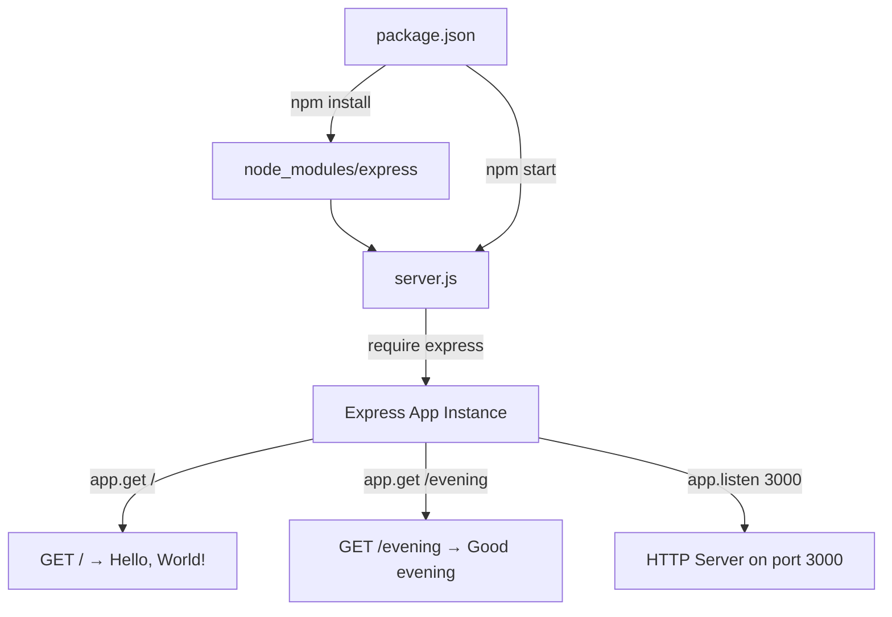

# Technical Specification

# 0. Agent Action Plan

## 0.1 Intent Clarification


### 0.1.1 Core Feature Objective

Based on the prompt, the Blitzy platform understands that the new feature requirement is to:

- **Add ExpressJS as a project dependency**: The existing Node.js server (`server.js`) currently uses only the built-in `http` module with zero external dependencies. The user requests integrating the Express.js framework into the project to serve as the HTTP server foundation, replacing or augmenting the existing raw `http` module usage.

- **Introduce a new HTTP endpoint returning "Good evening"**: In addition to the existing behavior that returns "Hello, World!" for all requests, a new dedicated route must be created that responds with the text "Good evening" when accessed. This transforms the server from a single universal-response handler into a multi-route Express application.

- **Preserve existing "Hello World" behavior**: The current server responds to all HTTP requests with `Hello, World!\n`. The existing behavior must be preserved as a distinct route so that the original functionality remains accessible after the migration to Express.

**Implicit requirements detected:**

- The `package.json` manifest must be updated with Express as a runtime dependency, and `package-lock.json` must be regenerated to reflect the new dependency tree.
- The `main` field in `package.json` currently points to `index.js` (which does not exist); this should be corrected to reference the actual entry point `server.js`.
- A `start` script should be added to `package.json` so the server can be launched via `npm start`.
- The `README.md` should be updated to reflect the addition of Express and the new endpoint.

### 0.1.2 Special Instructions and Constraints

- **User Rule — GitHub Workflow Restriction**: The user has explicitly specified: *"Do not make any updates or changes in GitHub App to create or update a workflow."* This means no `.github/workflows/` files shall be created or modified as part of this feature addition.
- **Maintain backward compatibility**: The existing "Hello, World!" response must remain functional and accessible after the Express migration.
- **Follow existing repository conventions**: The project uses CommonJS (`require()`) module syntax and plain JavaScript (no TypeScript, no ES modules). All new code must follow this convention.
- **Minimal footprint**: The project is intentionally simple — a tutorial-level Node.js server. The Express integration should maintain this simplicity.

### 0.1.3 Technical Interpretation

These feature requirements translate to the following technical implementation strategy:

- To **add ExpressJS**, we will install `express` as a production dependency via `npm install express`, updating both `package.json` and `package-lock.json`.
- To **migrate the server**, we will modify `server.js` to import Express using `const express = require('express')`, create an Express application instance, and define explicit routes instead of the current universal request handler.
- To **preserve the "Hello World" endpoint**, we will create an Express route (e.g., `GET /`) that responds with `Hello, World!\n`, matching the current behavior.
- To **add the "Good evening" endpoint**, we will create a new Express route (e.g., `GET /evening`) that responds with the text `Good evening`.
- To **correct project metadata**, we will update `package.json` to fix the `main` entry point and add a `start` script.
- To **update documentation**, we will modify `README.md` to describe the new Express-based architecture and the available endpoints.


## 0.2 Repository Scope Discovery


### 0.2.1 Comprehensive File Analysis

The repository is a minimal Node.js project consisting of exactly four files at the root level with no subdirectories (aside from `.git`). Every file in the repository is relevant to this feature addition.

**Existing files requiring modification:**

| File Path | Current Purpose | Modification Required |
|---|---|---|
| `server.js` | Minimal HTTP server using Node.js built-in `http` module; binds to `127.0.0.1:3000`; returns `Hello, World!\n` for all requests | Refactor to use Express.js; define explicit `GET /` route for "Hello, World!" and `GET /evening` route for "Good evening" |
| `package.json` | NPM manifest with no dependencies; `main` points to non-existent `index.js`; no `start` script | Add `express` to `dependencies`; fix `main` to `server.js`; add `start` script; update `description` |
| `package-lock.json` | Lockfile with empty dependency tree (lockfileVersion 3) | Will be regenerated by `npm install` to include Express and its transitive dependencies |
| `README.md` | Two-line readme: heading `# hao-backprop-test` and description `test project for backprop integration.` | Update to document Express integration, available endpoints, and how to start the server |

**Integration point discovery:**

- **API endpoints**: The current `server.js` has a single universal handler (`http.createServer` callback at line 6) that must be replaced with Express route definitions. Two explicit endpoints will be registered: `GET /` and `GET /evening`.
- **Server binding**: The current server binds to `hostname = '127.0.0.1'` and `port = 3000` (lines 3–4 of `server.js`). Express will use `app.listen(port)` to achieve equivalent binding.
- **Module system**: The project uses CommonJS with `require('http')` (line 1 of `server.js`). This will change to `require('express')`.

### 0.2.2 Web Search Research Conducted

- **Express.js latest stable version**: Confirmed via npm registry and expressjs.com that Express 5.2.1 is the latest version published on npm. Express 5.1.0 became the default `latest` tag on npm as of March 31, 2025. Express 5 requires Node.js 18 or higher, which is satisfied by the project's Node.js v20.20.2 runtime.
- **Express 5 route patterns**: Express 5 uses the same `app.get(path, handler)` pattern for defining routes. The `res.send()` method is used for sending text responses.
- **CommonJS compatibility**: Express 5 fully supports CommonJS `require('express')` imports, maintaining compatibility with the existing project conventions.

### 0.2.3 New File Requirements

No new source files need to be created for this feature. The project's minimal structure (single `server.js` entry point) is appropriate for a two-endpoint Express application. All changes are modifications to existing files.

**New files — not applicable:**

- No new source files required (feature is implemented within existing `server.js`)
- No new test files required (user did not request tests; existing `scripts.test` is a placeholder)
- No new configuration files required (Express configuration is inline within `server.js`)
- No new migration or schema files required (no database involvement)
- No new CI/CD workflow files (explicitly prohibited by user rule)


## 0.3 Dependency Inventory


### 0.3.1 Private and Public Packages

The project currently has zero external dependencies. This feature introduces Express.js as the sole new production dependency.

| Package Registry | Package Name | Version | Purpose |
|---|---|---|---|
| npm (public) | `express` | `^5.2.1` | HTTP server framework — provides routing, middleware, and request/response handling to replace the raw `http` module server |

**Version verification:**
- Express `5.2.1` is the latest stable version confirmed via the npm registry (`npm view express version` returns `5.2.1`).
- Express 5 requires Node.js 18+. The project runtime is Node.js v20.20.2, which satisfies this constraint.
- No version was specified by the user; the latest stable release is used as the default for `npm install express`.

**Existing dependencies retained:**
- Node.js built-in `http` module — will no longer be directly imported in `server.js` after the Express migration, as Express handles HTTP server creation internally.

### 0.3.2 Dependency Updates

**Import Updates:**

The sole file requiring import changes is `server.js`:

| File | Current Import | New Import |
|---|---|---|
| `server.js` | `const http = require('http');` | `const express = require('express');` |

**Import transformation rules:**
- Old: `const http = require('http');`
- New: `const express = require('express');`
- Apply to: `server.js` (the only source file in the project)

**External Reference Updates:**

| File | Update Type | Details |
|---|---|---|
| `package.json` | Add `dependencies` block | `"dependencies": { "express": "^5.2.1" }` |
| `package.json` | Fix `main` field | Change from `"index.js"` to `"server.js"` |
| `package.json` | Add `start` script | `"start": "node server.js"` |
| `package.json` | Update `description` | Reflect Express-based server with multiple endpoints |
| `package-lock.json` | Regenerate | Will be auto-generated by `npm install` with Express and all transitive dependencies |
| `README.md` | Update documentation | Document Express framework, available endpoints, and startup instructions |


## 0.4 Integration Analysis


### 0.4.1 Existing Code Touchpoints

**Direct modifications required:**

- **`server.js` (lines 1–14)**: The entire file content is replaced. The current implementation creates an HTTP server using `http.createServer()` with a universal callback handler. This must be refactored to:
  - Replace `require('http')` with `require('express')` (line 1)
  - Replace `http.createServer()` with `express()` application instantiation
  - Replace the universal callback with explicit `app.get('/', ...)` and `app.get('/evening', ...)` route definitions
  - Replace `server.listen()` with `app.listen()` for Express server binding

- **`package.json` (lines 1–11)**: Structural modifications at multiple points:
  - Line 4: Change `"main": "index.js"` to `"main": "server.js"` to fix the unresolved entry point
  - Lines 6–8: Add `"start": "node server.js"` to the `scripts` block
  - After line 8: Insert new `"dependencies"` block containing `"express": "^5.2.1"`

- **`package-lock.json` (lines 1–13)**: This file will be completely regenerated by `npm install` to reflect the new Express dependency and its transitive dependency tree. The lockfileVersion (3) will be preserved.

- **`README.md` (lines 1–2)**: Update to include information about Express.js integration and the available endpoints.

**Dependency injections:**
- Not applicable — the project does not use a dependency injection container or service registration pattern.

**Database/Schema updates:**
- Not applicable — the project has no database or persistent storage layer.

### 0.4.2 Integration Flow

The following diagram illustrates how the new Express-based server integrates with the existing project structure:



**Key integration considerations:**
- The Express application internally creates and manages the HTTP server, so the explicit `http.createServer()` call is no longer needed.
- Express's `res.send()` method automatically sets `Content-Type` headers based on the response body type (plain text for strings), replacing the manual `res.setHeader('Content-Type', 'text/plain')` call.
- The `hostname` binding to `127.0.0.1` can be passed as a second argument to `app.listen()` to maintain localhost-only access, consistent with the current behavior.


## 0.5 Technical Implementation


### 0.5.1 File-by-File Execution Plan

**Group 1 — Core Feature File:**

- **MODIFY: `server.js`** — Refactor from raw `http` module to Express.js application
  - Remove `const http = require('http')` and replace with `const express = require('express')`
  - Create Express app instance with `const app = express()`
  - Define `GET /` route that sends `Hello, World!\n` (preserving existing response behavior)
  - Define `GET /evening` route that sends `Good evening`
  - Replace `http.createServer()` and `server.listen()` with `app.listen(port, hostname, callback)`
  - Retain the console log message indicating server startup URL

**Group 2 — Project Configuration:**

- **MODIFY: `package.json`** — Update manifest to include Express dependency and fix metadata
  - Add `"dependencies": { "express": "^5.2.1" }` block
  - Change `"main"` from `"index.js"` to `"server.js"`
  - Add `"start": "node server.js"` to the `scripts` block
  - Update `"description"` to reflect the Express-based multi-endpoint server

- **MODIFY: `package-lock.json`** — Regenerated automatically by running `npm install`
  - Will expand from the current empty dependency tree to include Express and all its transitive dependencies
  - Lockfile version 3 format preserved

**Group 3 — Documentation:**

- **MODIFY: `README.md`** — Update project documentation
  - Add description of Express.js integration
  - Document available endpoints (`GET /` and `GET /evening`) with expected responses
  - Include startup instructions (`npm install` followed by `npm start` or `node server.js`)

### 0.5.2 Implementation Approach per File

**Establish feature foundation** by modifying `server.js`:
- The core transformation converts a 14-line raw `http` server into an Express application with explicit route handlers. The new `server.js` will follow this structure:

```javascript
const express = require('express');
const app = express();
```

- Two routes are defined using `app.get()`, and the server starts with `app.listen()`.

**Update project configuration** by modifying `package.json`:
- Express is declared as a production dependency. The `main` field is corrected and a `start` script is added for conventional npm-based server startup.

```json
"dependencies": { "express": "^5.2.1" }
```

**Regenerate lockfile** by running `npm install`:
- This produces a complete `package-lock.json` reflecting Express and its full transitive dependency graph.

**Update documentation** by modifying `README.md`:
- The readme is expanded to describe the project's Express-based architecture, list the two available endpoints, and provide clear usage instructions.

### 0.5.3 User Interface Design

Not applicable — this project is a backend-only HTTP server with no user interface components. All endpoints return plain text responses.


## 0.6 Scope Boundaries


### 0.6.1 Exhaustively In Scope

**All feature source files:**
- `server.js` — Refactor to Express.js application with two route handlers

**All configuration files:**
- `package.json` — Add Express dependency, fix `main` field, add `start` script
- `package-lock.json` — Regenerate with Express dependency tree

**Documentation:**
- `README.md` — Update with Express integration details, endpoint documentation, and usage instructions

**Complete in-scope file inventory:**

| File Path | Action | Purpose |
|---|---|---|
| `server.js` | MODIFY | Migrate from `http` module to Express; add `GET /` and `GET /evening` routes |
| `package.json` | MODIFY | Add `express` dependency; fix `main`; add `start` script |
| `package-lock.json` | REGENERATE | Reflect new Express dependency and transitive dependencies |
| `README.md` | MODIFY | Document Express integration and available endpoints |

### 0.6.2 Explicitly Out of Scope

- **Test files**: No test framework or test files will be added (user did not request tests; the existing placeholder `scripts.test` remains unchanged)
- **CI/CD workflows**: No `.github/workflows/` files will be created or modified (explicitly prohibited by user rule)
- **TypeScript**: No TypeScript configuration or type definitions will be added (project uses plain JavaScript with CommonJS)
- **Middleware**: No additional Express middleware (e.g., `body-parser`, `cors`, `helmet`) will be added beyond what Express includes by default
- **Environment configuration**: No `.env` files or environment variable management will be introduced
- **Docker or containerization**: No `Dockerfile` or `docker-compose.yml` files will be created
- **Database or data persistence**: No database, ORM, or data storage layer will be added
- **Authentication or security**: No auth middleware, HTTPS configuration, or security headers will be implemented
- **Error handling middleware**: No custom Express error handling middleware will be added beyond Express defaults
- **Additional endpoints**: No endpoints beyond `GET /` and `GET /evening` will be created
- **Performance optimization**: No load balancing, caching, or connection pooling will be implemented
- **Refactoring of unrelated code**: No changes to code unrelated to the Express integration


## 0.7 Rules for Feature Addition


### 0.7.1 User-Specified Rules

The following rule was explicitly provided by the user and must be strictly observed during implementation:

| Rule Name | Rule Content | Impact |
|---|---|---|
| exit code 137 test | Do not make any updates or changes in GitHub App to create or update a workflow. | No `.github/workflows/` files shall be created, modified, or deleted as part of this feature addition |

### 0.7.2 Repository Convention Rules

The following conventions are derived from the existing codebase and must be maintained:

- **CommonJS module system**: All imports must use `require()` syntax. Do not use ES module `import` statements.
- **Plain JavaScript**: No TypeScript, no JSX, no transpilation. All code must be vanilla JavaScript compatible with Node.js v20.
- **Single-file architecture**: The project uses a single `server.js` entry point. This pattern should be preserved for the Express migration — do not split into multiple source files unless strictly necessary.
- **Localhost binding**: The current server binds to `127.0.0.1`. The Express migration should preserve this localhost-only binding for security consistency.
- **Port 3000**: The server listens on port 3000. This should remain unchanged in the Express configuration.
- **Console logging**: The current server logs a startup message to the console. This behavior should be preserved in the Express version.


## 0.8 References


### 0.8.1 Repository Files and Folders Searched

The following is a comprehensive list of all files and folders inspected during analysis to derive the conclusions in this Agent Action Plan:

| Path | Type | Tool Used | Key Findings |
|---|---|---|---|
| `/` (root) | Folder | `get_source_folder_contents` | Identified 4 files: `server.js`, `package.json`, `package-lock.json`, `README.md`. No subdirectories. |
| `server.js` | File | `read_file` | Minimal HTTP server using built-in `http` module; binds to `127.0.0.1:3000`; returns "Hello, World!" for all requests; CommonJS syntax; 14 lines |
| `package.json` | File | `read_file` | Project name `hello_world`; version `1.0.0`; no dependencies; `main` points to non-existent `index.js`; no `start` script; author `hxu`; MIT license |
| `package-lock.json` | File | `read_file` | lockfileVersion 3; empty dependency tree; only root package metadata |
| `README.md` | File | `read_file` | Two lines: heading `# hao-backprop-test` and description `test project for backprop integration.` |

### 0.8.2 External Research Conducted

| Search Query | Source | Key Finding |
|---|---|---|
| `express npm latest stable version 2025` | npmjs.com/package/express | Express latest version is `5.2.1` |
| `express npm latest stable version 2025` | expressjs.com | Express 5.1.0 became the npm `latest` tag on March 31, 2025 |
| `express npm latest stable version 2025` | github.com/expressjs/express | Express 5 requires Node.js 18+; dropped support for older versions |

### 0.8.3 Tech Spec Sections Reviewed

| Section | Purpose of Review |
|---|---|
| 1.1 EXECUTIVE SUMMARY | Confirmed project purpose as a minimal Node.js test harness |
| 1.3 SCOPE | Identified current in-scope elements (HTTP server, universal handler) and out-of-scope items |
| 2.1 FEATURE CATALOG | Reviewed existing features F-001 (HTTP Server Init), F-002 (Universal Request Handler), F-003 (Test Harness) |
| 3.2 PROGRAMMING LANGUAGES | Confirmed Node.js JavaScript with CommonJS module system, no TypeScript |
| 3.3 FRAMEWORKS & LIBRARIES | Confirmed zero external frameworks; only built-in `http` module |
| 5.1 HIGH-LEVEL ARCHITECTURE | Confirmed single-file monolithic architecture, zero-dependency design, stateless operation |

### 0.8.4 Attachments

No attachments were provided for this project. No Figma URLs or design files were specified.

### 0.8.5 Environment Details

| Item | Value |
|---|---|
| Node.js Runtime | v20.20.2 |
| npm Version | 11.1.0 |
| Express Target Version | 5.2.1 |
| Operating Environment | Linux-based container |
| Environment Variables Provided | None |
| Secrets Provided | None |


