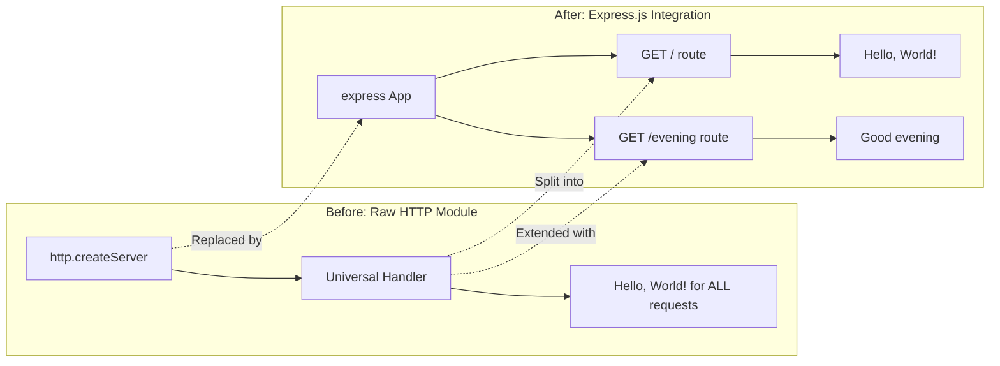

# Technical Specification

# 0. Agent Action Plan

## 0.1 Intent Clarification

### 0.1.1 Core Feature Objective

Based on the prompt, the Blitzy platform understands that the new feature requirement is to:

- **Integrate Express.js framework** into an existing minimal Node.js HTTP server project that currently uses only the built-in `http` module to serve a single "Hello, World!" response to all incoming requests
- **Add a new HTTP endpoint** that returns the plain-text response "Good evening" — this introduces route-based request handling to a project that currently has no routing logic
- **Preserve existing "Hello World" functionality** by ensuring that the original response behavior remains accessible through a dedicated route after the Express.js migration

**Implicit requirements detected:**
- The existing `server.js` must be refactored from the raw Node.js `http` module to use Express.js as the HTTP framework, since Express provides its own server creation and route registration mechanisms
- Route definitions must be introduced where none currently exist — the current server responds identically to all HTTP methods and paths, and this must change to support distinct endpoints
- The `package.json` must be updated with Express.js as a production dependency, and `package-lock.json` will be regenerated accordingly
- The `main` field in `package.json` currently points to `index.js` (which does not exist); this should be corrected to reference `server.js`

**Feature dependencies and prerequisites:**
- Node.js v20.20.1 runtime (already installed and confirmed compatible with Express 5.x which requires Node.js >= 18)
- npm v11.1.0 package manager (already available for dependency installation)

### 0.1.2 Special Instructions and Constraints

- **User Rule — CI/CD Restriction**: "Do not make any updates or changes in GitHub App to create or update a workflow." This means no `.github/workflows/` files should be created or modified as part of this feature addition
- **Maintain tutorial simplicity**: The user describes this as a "tutorial" project, meaning the implementation should remain approachable and straightforward without over-engineering
- **CommonJS module system**: The existing project uses `require()` syntax (CommonJS), and the Express.js integration must follow the same module pattern for consistency
- **Backward compatibility**: The existing "Hello, World!" response must remain accessible after Express.js integration, served from a specific route rather than as a catch-all

### 0.1.3 Technical Interpretation

These feature requirements translate to the following technical implementation strategy:

- To **integrate Express.js**, we will install the `express` npm package (v5.2.1, the current latest stable release) as a production dependency and refactor `server.js` to replace the `http.createServer()` pattern with Express's `express()` application factory and its built-in routing system
- To **preserve the Hello World endpoint**, we will create an Express route handler for `GET /` that returns the plain-text response "Hello, World!" with the same `text/plain` content type and HTTP 200 status code as the current implementation
- To **add the Good Evening endpoint**, we will create a new Express route handler for `GET /evening` that returns the plain-text response "Good evening" with `text/plain` content type and HTTP 200 status code
- To **maintain server configuration**, we will keep the same hostname (`127.0.0.1`) and port (`3000`) bindings, along with the console startup message, ensuring the server behaves identically from a network perspective
- To **update project metadata**, we will correct the `main` field in `package.json` from `index.js` to `server.js` and add a `start` script for convenient server launching

## 0.2 Repository Scope Discovery

### 0.2.1 Comprehensive File Analysis

The repository is a minimal Node.js project containing exactly four files at the root level with no subdirectories (other than `.git`). Every file in the repository has been inspected and assessed for impact.

**Existing Files Requiring Modification:**

| File Path | Current Role | Modification Required |
|-----------|-------------|----------------------|
| `server.js` | Minimal HTTP server using Node.js built-in `http` module; responds to all requests with "Hello, World!" | **Major refactor** — Replace `http.createServer()` with Express.js application; define `GET /` route for "Hello, World!" and `GET /evening` route for "Good evening"; update server binding to use `app.listen()` |
| `package.json` | npm manifest with no dependencies; `main` field incorrectly points to non-existent `index.js` | **Modify** — Add `express` to `dependencies`; correct `main` field from `index.js` to `server.js`; add `start` script (`node server.js`) |
| `package-lock.json` | Lockfile with only root package metadata; no external dependency entries | **Auto-regenerated** — Will be updated automatically by `npm install express` to include the full Express.js dependency tree |
| `README.md` | Contains project title "hao-backprop-test" and brief description | **Modify** — Update to document Express.js integration, available endpoints, and usage instructions |

**Integration Point Discovery:**

- **API Endpoints**: The current server has no route-based endpoints — all requests hit a single universal handler. Express.js will introduce explicit route registration for `GET /` and `GET /evening`
- **Server Initialization**: The `http.createServer()` call in `server.js` (line 6) is the sole integration point where Express replaces the native HTTP module
- **Port Binding**: The `server.listen()` call in `server.js` (line 12) will be replaced by `app.listen()` from Express, maintaining the same port 3000 and hostname 127.0.0.1

### 0.2.2 Web Search Research Conducted

- **Express.js latest stable version**: Confirmed Express.js v5.2.1 as the current latest release on npm, with Node.js >= 18 as the engine requirement — fully compatible with the project's Node.js v20.20.1 runtime
- **Express 5.x notable changes**: Express 5 drops support for Node.js versions before v18, features improved async error handling with automatic promise rejection forwarding, and updated path-to-regexp routing — all relevant for this new integration
- **Express.js basic routing pattern**: The standard pattern for defining routes uses `app.get(path, handler)` with `res.send()` for response delivery, which is the appropriate approach for this tutorial-level project

### 0.2.3 New File Requirements

**New source files to create:**

- No new source files are required beyond modifying the existing `server.js` — the project's tutorial nature and minimal scope mean all Express.js route definitions fit within the single existing server file

**New test files:**

- No test infrastructure currently exists in the project (`scripts.test` in `package.json` echoes an error and exits). Test file creation is not specified in the user's requirements

**New configuration files:**

- No new configuration files are required — Express.js configuration will be handled inline within `server.js`, consistent with the tutorial's simplicity

## 0.3 Dependency Inventory

### 0.3.1 Private and Public Packages

The project currently has zero external dependencies. Express.js will be the first and only production dependency added.

| Registry | Package Name | Version | Purpose |
|----------|-------------|---------|---------|
| npm | `express` | `5.2.1` | HTTP web application framework — provides routing, middleware, and request/response handling to replace the raw Node.js `http` module |

**Version justification:**
- Version `5.2.1` is the current latest stable release on npm (confirmed via `npm view express version`)
- Express 5.x requires Node.js >= 18 (confirmed via `npm view express@5.2.1 engines`), and the project runs Node.js v20.20.1, which satisfies this constraint
- No user-specified version constraint was provided, so the latest stable release is used per npm default behavior

**Transitive dependencies:** Express.js v5.2.1 brings its own dependency tree (including `body-parser`, `content-disposition`, `cookie`, `debug`, `path-to-regexp`, `qs`, `send`, `serve-static`, among others). These will be automatically resolved and locked in `package-lock.json` upon installation.

### 0.3.2 Dependency Updates

**Import Updates:**

The only file requiring import changes is `server.js`:

| File | Current Import | New Import | Reason |
|------|---------------|------------|--------|
| `server.js` | `const http = require('http');` | `const express = require('express');` | Replace native `http` module with Express.js framework |

The `http` module import will be completely removed, as Express handles HTTP server creation internally via `app.listen()`.

**External Reference Updates:**

| File | Update Description |
|------|-------------------|
| `package.json` | Add `"dependencies": { "express": "^5.2.1" }`; correct `"main"` from `"index.js"` to `"server.js"`; add `"start": "node server.js"` to scripts |
| `package-lock.json` | Auto-regenerated with full Express.js dependency tree upon `npm install` |
| `README.md` | Update documentation to reference Express.js as the server framework and document the new endpoint |

## 0.4 Integration Analysis

### 0.4.1 Existing Code Touchpoints

**Direct modifications required:**

- **`server.js` (lines 1–14, full file)**: This is the primary integration point. The entire file undergoes refactoring:
  - Line 1: Replace `const http = require('http');` with `const express = require('express');`
  - Lines 3–4: Retain `hostname` and `port` constants (values `127.0.0.1` and `3000`)
  - Lines 6–10: Replace `http.createServer()` callback with Express app initialization (`const app = express();`) and individual route definitions using `app.get()`
  - Lines 12–14: Replace `server.listen()` with `app.listen()` while preserving the console log startup message

- **`package.json` (lines 1–11)**: Metadata and dependency updates:
  - Line 5: Change `"main": "index.js"` to `"main": "server.js"` to correct the mismatched entry point
  - Lines 6–8: Add `"start": "node server.js"` to the `scripts` block for convenient server startup
  - After line 8: Add new `"dependencies"` block with `"express": "^5.2.1"`

- **`README.md` (lines 1–2)**: Documentation update to reflect the Express.js integration and describe both endpoints

**Dependency injections:**

- Not applicable — the project has no dependency injection container, service registry, or inversion-of-control pattern. Express.js serves as both the application framework and the HTTP server.

**Database/Schema updates:**

- Not applicable — the project has no database, no schema files, and no data persistence layer. Both endpoints return static string responses.

### 0.4.2 Integration Flow Diagram



### 0.4.3 Port and Network Configuration

The server's network binding configuration remains unchanged after Express.js integration:

| Configuration | Current Value | After Integration |
|--------------|---------------|-------------------|
| Hostname | `127.0.0.1` | `127.0.0.1` (unchanged) |
| Port | `3000` | `3000` (unchanged) |
| Protocol | HTTP | HTTP (unchanged) |
| Startup Log | ``Server running at http://${hostname}:${port}/`` | ``Server running at http://${hostname}:${port}/`` (unchanged) |

## 0.5 Technical Implementation

### 0.5.1 File-by-File Execution Plan

Every file listed below MUST be created or modified as part of this feature addition.

**Group 1 — Core Feature File:**

- **MODIFY: `server.js`** — Refactor from raw Node.js `http` module to Express.js application
  - Remove `const http = require('http');` and replace with `const express = require('express');`
  - Initialize Express application with `const app = express();`
  - Define `GET /` route handler returning "Hello, World!\n" with `text/plain` content type to preserve existing behavior
  - Define `GET /evening` route handler returning "Good evening" with `text/plain` content type as the new endpoint
  - Replace `http.createServer()` and `server.listen()` with `app.listen(port, hostname, callback)` preserving the startup console log message

**Group 2 — Project Configuration:**

- **MODIFY: `package.json`** — Update project metadata and add Express.js dependency
  - Add `"dependencies": { "express": "^5.2.1" }` block
  - Correct `"main"` field from `"index.js"` to `"server.js"`
  - Add `"start": "node server.js"` to the `scripts` object
- **AUTO-UPDATE: `package-lock.json`** — Regenerated by npm upon `npm install express` to capture the complete Express.js dependency tree with locked versions

**Group 3 — Documentation:**

- **MODIFY: `README.md`** — Update project documentation
  - Add description of Express.js integration
  - Document available endpoints (`GET /` and `GET /evening`) with expected responses
  - Include setup instructions (`npm install` and `npm start`)

### 0.5.2 Implementation Approach per File

**Step 1 — Install Express.js dependency:**

Run `npm install express` in the project root. This adds Express to `package.json` dependencies and regenerates `package-lock.json` with the resolved dependency tree.

**Step 2 — Refactor `server.js` to use Express:**

The core transformation replaces the raw HTTP handler with Express route definitions. The refactored server structure:

```javascript
const express = require('express');
const app = express();
// Route definitions and app.listen() follow
```

Two route handlers are defined:
- `app.get('/', ...)` — responds with "Hello, World!\n" (preserving original behavior including trailing newline)
- `app.get('/evening', ...)` — responds with "Good evening" (new endpoint)

Both handlers use `res.set('Content-Type', 'text/plain')` followed by `res.send()` to maintain the plain-text response format consistent with the existing server behavior.

**Step 3 — Update `package.json` metadata:**

Correct the `main` entry point and add a `start` script so the server can be launched with `npm start` in addition to `node server.js`.

**Step 4 — Update `README.md`:**

Document the project's transition to Express.js with clear descriptions of both endpoints and how to run the server.

### 0.5.3 Expected Endpoint Behavior

| Endpoint | HTTP Method | Response Body | Content-Type | Status Code |
|----------|------------|---------------|--------------|-------------|
| `/` | GET | `Hello, World!\n` | `text/plain` | 200 |
| `/evening` | GET | `Good evening` | `text/plain` | 200 |

## 0.6 Scope Boundaries

### 0.6.1 Exhaustively In Scope

**Application source files:**
- `server.js` — Full refactor to Express.js with two route definitions

**Project configuration files:**
- `package.json` — Dependency addition, metadata correction, script addition
- `package-lock.json` — Auto-regenerated with Express.js dependency tree

**Documentation files:**
- `README.md` — Updated to reflect Express.js usage and endpoint documentation

**Summary of all in-scope files:**

| File | Action | Scope of Change |
|------|--------|----------------|
| `server.js` | MODIFY | Full file refactor — replace `http` module with Express.js; add `GET /` and `GET /evening` routes |
| `package.json` | MODIFY | Add `express` dependency; fix `main` field; add `start` script |
| `package-lock.json` | AUTO-UPDATE | Regenerated by npm with Express.js dependency tree |
| `README.md` | MODIFY | Document Express.js integration and endpoint details |

### 0.6.2 Explicitly Out of Scope

- **GitHub Actions / CI/CD workflows**: No `.github/workflows/` files will be created or modified, per user-specified rule "Do not make any updates or changes in GitHub App to create or update a workflow"
- **Test infrastructure**: No test files or test framework will be added — the current `scripts.test` placeholder is not being replaced as the user did not request test coverage
- **Middleware additions**: No additional Express middleware (e.g., `body-parser`, `cors`, `helmet`) will be configured beyond what Express includes by default
- **Environment variable management**: No `.env` files, `dotenv` integration, or environment-based configuration will be added
- **Docker/containerization**: No `Dockerfile` or `docker-compose.yml` will be created
- **TypeScript migration**: The project will remain in plain JavaScript with CommonJS modules
- **Additional endpoints**: Only `GET /` and `GET /evening` are in scope — no other routes, HTTP methods, or API resources will be added
- **Database or data persistence**: No database, ORM, or storage layer will be introduced
- **Authentication or security**: No auth middleware, security headers, or HTTPS configuration
- **Performance optimizations**: No clustering, caching, or load balancing
- **Refactoring of unrelated code**: Only changes directly required for Express.js integration and the new endpoint are included

## 0.7 Rules for Feature Addition

### 0.7.1 User-Specified Rules

The following rules were explicitly provided by the user and must be strictly observed throughout implementation:

- **CI/CD Workflow Restriction**: "Do not make any updates or changes in GitHub App to create or update a workflow." No `.github/workflows/` files or GitHub Actions configurations shall be created, modified, or referenced during this feature addition

### 0.7.2 Inferred Conventions from Repository Analysis

The following conventions are derived from the existing codebase and must be maintained for consistency:

- **Module system**: Use CommonJS (`require()` / `module.exports`) — the project does not use ES modules (`import`/`export`), and this pattern must be preserved
- **Coding style**: Follow the existing code style observed in `server.js` — 2-space indentation, single quotes for strings, semicolons at end of statements, `const` for variable declarations
- **Response format**: Maintain `text/plain` content type for all endpoint responses, consistent with the existing "Hello, World!" response
- **Network binding**: Keep the server bound to `127.0.0.1` (localhost only) on port `3000`, matching the current configuration
- **Startup logging**: Preserve the console log message pattern on successful server startup using template literals
- **Simplicity**: This is a tutorial project — implementation should remain minimal, readable, and self-contained in a single server file without unnecessary abstraction layers

## 0.8 References

### 0.8.1 Repository Files and Folders Searched

All files in the repository were exhaustively inspected to derive the conclusions in this action plan:

| File Path | Tool Used | Key Findings |
|-----------|-----------|-------------|
| `server.js` | `read_file`, `get_source_folder_contents` | Minimal HTTP server using Node.js built-in `http` module; responds to all requests with "Hello, World!\n"; binds to `127.0.0.1:3000`; no routing logic; CommonJS module system |
| `package.json` | `read_file`, `get_source_folder_contents` | Project name `hello_world`; version `1.0.0`; no dependencies or devDependencies; `main` field incorrectly points to `index.js`; no `start` script defined; author `hxu`; MIT license |
| `package-lock.json` | `read_file`, `get_source_folder_contents` | Lockfile version 3; only root package metadata present; no external dependency entries |
| `README.md` | `read_file`, `get_source_folder_contents` | Title "hao-backprop-test"; brief description "test project for backprop integration" |
| Root folder (`""`) | `get_source_folder_contents` | Confirmed exactly 4 files at root level; no subdirectories; no CI/CD, Docker, or environment configuration files |

### 0.8.2 Technical Specification Sections Referenced

| Section | Key Information Extracted |
|---------|-------------------------|
| 1.1 Executive Summary | Project is a minimal Node.js HTTP server for Backprop integration testing |
| 1.3 Scope | Current scope limited to single universal handler; no routing, middleware, or external dependencies |
| 2.1 Feature Catalog | Three existing features: F-001 (HTTP Server Initialization), F-002 (Universal Request Handler), F-003 (Test Harness Operations) |
| 3.2 Programming Languages | Node.js JavaScript with CommonJS module system; no TypeScript or ES6 modules |
| 3.3 Frameworks & Libraries | Intentionally zero external frameworks; uses only Node.js built-in `http` module |
| 5.2 Component Details | HTTP Server Foundation, Universal Request Handler, and Test Harness Operations components documented |

### 0.8.3 External Research Conducted

| Search Query | Source | Key Finding |
|-------------|--------|-------------|
| "Express.js latest stable version 2025" | npm registry (`npmjs.com/package/express`) | Latest version confirmed as `5.2.1`; requires Node.js >= 18 |
| "Express.js latest stable version 2025" | expressjs.com (official blog) | Express 5.1.0 became the default `latest` tag on npm as of March 31, 2025; LTS timeline introduced for v4 and v5 |
| "Express.js latest stable version 2025" | GitHub releases (`github.com/expressjs/express`) | Express 5 drops Node.js versions before v18; improved async error handling; updated path-to-regexp routing |
| `npm view express version` (local) | Local npm CLI | Confirmed `5.2.1` as the resolved latest version |
| `npm view express@5.2.1 engines` (local) | Local npm CLI | Confirmed engine constraint `{ node: '>= 18' }` |

### 0.8.4 Attachments

No attachments were provided for this project. No Figma screens or design files were referenced.

