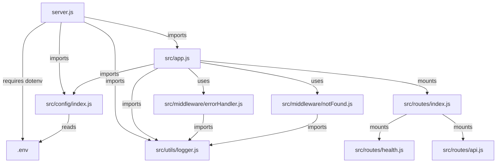

# Technical Specification

# 0. Agent Action Plan

## 0.1 Intent Clarification


### 0.1.1 Core Objective

Based on the provided requirements, the Blitzy platform understands that the objective is to transform a minimal, built-in Node.js HTTP server into a production-grade Express.js application with a professional middleware stack, structured logging, environment-driven configuration, organized routing, and process management via PM2 for production deployment.

The specific requirements, restated with enhanced clarity:

- **Migrate from built-in `http` module to Express.js framework**: Replace the current bare-bones `http.createServer()` implementation in `server.js` with the Express.js web framework, leveraging its routing, middleware pipeline, and request/response abstractions.
- **Add structured routing**: Introduce a modular route system with separate route files for health checks, API endpoints, and a root index, replacing the single catch-all request handler that currently returns `"Hello, World!\n"` for every request regardless of path or method.
- **Integrate production middleware**: Establish a comprehensive middleware pipeline including security headers (Helmet), CORS handling, request body parsing, response compression, and rate limiting to harden the server for production traffic.
- **Implement environment-based configuration**: Replace the hardcoded `hostname = '127.0.0.1'` and `port = 3000` values with a centralized configuration module backed by environment variables loaded from `.env` files via `dotenv`, supporting multiple deployment environments (development, production).
- **Add structured logging**: Replace the single `console.log` statement with a professional logging system using Winston for application-level logging (with console and file transports) and Morgan for HTTP request access logging, producing structured JSON logs suitable for log aggregation tools.
- **Prepare for production deployment with PM2**: Create a PM2 ecosystem configuration file enabling cluster-mode process management, zero-downtime reloads, automatic restarts on failure, and log management for production deployments.

Implicit requirements detected:

- The `package.json` must be updated with all new dependencies, scripts for development and production, and an `engines` field to declare Node.js compatibility.
- The `main` field in `package.json` currently points to a non-existent `index.js` and must be corrected to point to the actual entry point.
- A `.gitignore` file must be created to exclude `node_modules/`, `.env`, and log files from version control.
- A `.env.example` file should be provided as a template for environment variable documentation.
- Proper error handling middleware must be introduced, as Express requires explicit error handlers for production use.
- A health check endpoint is necessary for PM2 and load balancer monitoring.
- The `README.md` needs a complete rewrite to document the new project setup, scripts, and deployment procedures.

### 0.1.2 Task Categorization

- **Primary task type**: Mixed (Framework Migration + Feature Addition + Configuration + Tooling)
- **Secondary aspects**: Security enhancement (Helmet, CORS, rate limiting), Developer experience (structured logging, environment config), Deployment readiness (PM2 configuration)
- **Scope classification**: Cross-cutting change — this enhancement touches every layer of the application from entry point through configuration, routing, middleware, logging, error handling, and deployment configuration.

### 0.1.3 Special Instructions and Constraints

- **User Rule**: "Do not make any updates or changes in GitHub App to create or update a workflow." — No `.github/workflows/` files will be created or modified. CI/CD pipeline changes are explicitly excluded.
- **CommonJS convention**: The existing codebase uses CommonJS (`require()`/`module.exports`). The enhanced project will maintain CommonJS module syntax for consistency with the existing code and `package.json` configuration (no `"type": "module"` change).
- **No existing tests**: The current project has no test infrastructure (`"test": "echo \"Error: no test specified\" && exit 1"`). Test scaffolding is not explicitly requested and will be noted as out of scope.
- **No existing dependencies**: The project currently has zero npm dependencies — all packages are new additions.

### 0.1.4 Technical Interpretation

These requirements translate to the following technical implementation strategy:

- To **adopt Express.js**, we will rewrite `server.js` to serve as the application entry point that loads environment configuration and starts the Express server, and create `src/app.js` as the Express application factory that configures the middleware pipeline and mounts route handlers.
- To **implement structured routing**, we will create a `src/routes/` directory with modular route files (`index.js`, `health.js`, `api.js`) and mount them on the Express app using `express.Router()`.
- To **add production middleware**, we will install and configure `helmet` for HTTP security headers, `cors` for cross-origin resource sharing, `compression` for gzip response compression, `express-rate-limit` for request throttling, and `express.json()`/`express.urlencoded()` for body parsing.
- To **implement environment config**, we will create `src/config/index.js` that centralizes all environment variable access, create `.env` and `.env.example` files for local development, and use `dotenv` to load variables into `process.env`.
- To **add structured logging**, we will create `src/utils/logger.js` configuring Winston with JSON-formatted file transports and colorized console transports, and integrate Morgan HTTP request logging piped through the Winston logger.
- To **prepare PM2 deployment**, we will create `ecosystem.config.js` at the project root with cluster-mode configuration, environment variable definitions, log file paths, and restart policies.


## 0.2 Repository Scope Discovery


### 0.2.1 Comprehensive File Analysis

The repository is a minimal Node.js project containing exactly four files at the root level with no subdirectories:

| File | Purpose | Key Observations |
|------|---------|-----------------|
| `server.js` | Runtime entry point — a 14-line HTTP server using Node.js built-in `http` module | Hardcoded `hostname = '127.0.0.1'` and `port = 3000`; single request handler returns `"Hello, World!\n"` for all paths/methods; binds only to loopback; no error handling; no exports |
| `package.json` | npm manifest | `name: "hello_world"`, `version: "1.0.0"`, `main: "index.js"` (non-existent file), zero dependencies, no start script, test script is a placeholder that exits with error code 1, `license: "MIT"`, `author: "hxu"` |
| `package-lock.json` | npm lockfile (v3 format) | Contains only the root package entry — no external dependency entries recorded |
| `README.md` | Repository documentation | Contains only heading `# hao-backprop-test` and a single line `test project for backprop integration.` — naming mismatch with `package.json` name |

**Notable gaps identified:**
- No `src/` directory or any organized source structure
- No `.gitignore` file — `node_modules/` is unprotected from commits
- No `.env` or environment configuration mechanism
- No logging infrastructure beyond `console.log`
- No middleware or routing layer
- No error handling
- No deployment configuration
- No health check endpoint
- `main` field references non-existent `index.js`
- Name mismatch: README says `hao-backprop-test` while `package.json` says `hello_world`

### 0.2.2 Web Search Research Conducted

The following research was conducted to inform implementation decisions:

- **Express.js latest version and features**: Confirmed Express 5.2.1 is the latest stable version on npm. Express 5 is now the default on npm as of March 2025, with built-in promise support for async middleware and updated path-to-regexp routing. Node.js >= 18 is required.
- **PM2 process management best practices**: Confirmed PM2 6.0.14 is the latest version. Documented cluster mode configuration, ecosystem file format, startup script generation, and log management commands.
- **Winston logging for Node.js**: Confirmed Winston 3.19.0 is the latest version. Reviewed best practices for transport configuration, structured JSON logging, log level hierarchy, and integration with Morgan for HTTP request logging.
- **Morgan HTTP request logging**: Confirmed Morgan 1.10.1 is the latest version. Reviewed predefined formats (`combined`, `dev`, `common`) and custom token creation for integration with Winston logger streams.
- **dotenv environment management**: Confirmed dotenv 17.3.1 is the latest version. Note: Node.js v20.6.0+ supports native `--env-file` flag, but dotenv provides cross-version compatibility and programmatic control.
- **Helmet security middleware**: Confirmed Helmet 8.1.0 is the latest version. Sets 13 HTTP security response headers by default including Content-Security-Policy, Strict-Transport-Security, and X-Content-Type-Options.
- **CORS middleware**: Confirmed cors 2.8.6 is the latest version. Supports origin whitelisting, preflight request handling, and route-specific configuration.
- **Express middleware stack patterns**: Reviewed established patterns for middleware ordering — security (Helmet) first, then CORS, then compression, then body parsing, then logging, then routes, and finally error handling.

### 0.2.3 Existing Infrastructure Assessment

- **Project structure**: Flat root-level layout with no directory organization. All code resides in a single `server.js` file.
- **Existing patterns and conventions**: CommonJS module system (`require()`/`module.exports`), no code style configuration (no `.eslintrc`, `.prettierrc`).
- **Build and deployment configurations**: None present. No Dockerfile, no CI/CD pipeline, no PM2 config, no start scripts.
- **Testing infrastructure**: Absent. The test script in `package.json` is a placeholder that echoes an error message and exits non-zero.
- **Documentation system**: Minimal — `README.md` contains only a project title and one-line description that does not match the project purpose.
- **Runtime**: Node.js v20.20.1 with npm v11.1.0. No `.nvmrc` or `engines` field specified.


## 0.3 Scope Boundaries


### 0.3.1 Exhaustively In Scope

**Source code changes:**
- `server.js` — Rewrite as Express application entry point with environment config loading and graceful shutdown
- `src/app.js` — New Express application factory with full middleware pipeline
- `src/routes/index.js` — Root route aggregator mounting all sub-routers
- `src/routes/health.js` — Health check endpoint for PM2 and monitoring
- `src/routes/api.js` — API route module with sample endpoints demonstrating routing
- `src/middleware/errorHandler.js` — Centralized error handling middleware
- `src/middleware/notFound.js` — 404 catch-all handler for unmatched routes
- `src/config/index.js` — Centralized environment-based configuration module
- `src/utils/logger.js` — Winston logger factory with console and file transports

**Configuration updates:**
- `package.json` — Add all dependencies, npm scripts (`start`, `dev`, `start:pm2`, `stop:pm2`), `engines` field, fix `main` field
- `.env` — Development environment variable defaults
- `.env.example` — Documented environment variable template for onboarding
- `ecosystem.config.js` — PM2 ecosystem configuration for production cluster mode

**Documentation updates:**
- `README.md` — Complete rewrite with project overview, prerequisites, installation, configuration, development usage, production deployment with PM2, project structure, and available API endpoints

**Utility and project files:**
- `.gitignore` — Standard Node.js ignore patterns for `node_modules/`, `.env`, `logs/`, editor files

### 0.3.2 Explicitly Out of Scope

- **GitHub Actions workflows**: Per user rule, no `.github/workflows/` files will be created or modified
- **Test infrastructure**: No test framework, test files, or test scripts will be added (not requested)
- **Docker containerization**: No `Dockerfile` or `docker-compose.yml` will be created (not requested)
- **Database integration**: No database drivers, ORM, or data persistence layer
- **Authentication/authorization**: No auth middleware, JWT handling, or session management
- **Frontend/view engine**: No template engine, static file serving configuration, or client-side assets
- **API documentation tools**: No Swagger/OpenAPI specification generation
- **Code quality tooling**: No ESLint, Prettier, or other linting/formatting configuration
- **TypeScript migration**: The project will remain in JavaScript with CommonJS modules
- **Performance optimization beyond middleware**: No advanced caching, CDN, or load balancer configuration outside PM2 cluster mode
- **Monitoring and alerting**: No APM agents, health dashboard, or external monitoring service integration beyond the health check endpoint


## 0.4 Dependency Inventory


### 0.4.1 Key Private and Public Packages

All packages listed below are new additions. The existing project has zero npm dependencies.

| Registry | Package Name | Version | Purpose |
|----------|--------------|---------|---------|
| npm | express | ^5.2.1 | Web framework — routing, middleware pipeline, request/response handling |
| npm | dotenv | ^17.3.1 | Environment variable loading from `.env` files into `process.env` |
| npm | winston | ^3.19.0 | Structured application logging with multiple transports (console, file) |
| npm | morgan | ^1.10.1 | HTTP request access logging middleware for Express |
| npm | helmet | ^8.1.0 | Security middleware — sets 13 protective HTTP response headers |
| npm | cors | ^2.8.6 | Cross-Origin Resource Sharing middleware for controlled API access |
| npm | compression | ^1.8.1 | Gzip/deflate response compression middleware |
| npm | express-rate-limit | ^8.3.1 | Request rate limiting middleware to prevent abuse |
| npm (global) | pm2 | ^6.0.14 | Production process manager with cluster mode, auto-restart, and log management |

### 0.4.2 Dependency Updates

**New dependencies to add (production):**
- `express`: ^5.2.1 — Core web framework replacing the built-in `http` module
- `dotenv`: ^17.3.1 — Environment configuration management
- `winston`: ^3.19.0 — Application-level structured logging
- `morgan`: ^1.10.1 — HTTP request logging middleware
- `helmet`: ^8.1.0 — HTTP security header middleware
- `cors`: ^2.8.6 — Cross-origin resource sharing control
- `compression`: ^1.8.1 — Response body compression
- `express-rate-limit`: ^8.3.1 — Rate limiting for API protection

**Global tool to install:**
- `pm2`: ^6.0.14 — Installed globally via `npm install -g pm2` for production process management

**Dependencies to remove:** None (no existing dependencies)

**Dependencies to update:** None (no existing dependencies)

### 0.4.3 Import/Reference Updates

Since all packages are new additions, the following new `require()` statements will be introduced:

- `server.js` — `require('dotenv').config()` at the top, `require('./src/app')`, `require('./src/config')`, `require('./src/utils/logger')`
- `src/app.js` — `require('express')`, `require('helmet')`, `require('cors')`, `require('compression')`, `require('morgan')`, `require('express-rate-limit')`, plus local route and middleware imports
- `src/utils/logger.js` — `require('winston')`
- `src/config/index.js` — References to `process.env.*` variables loaded by dotenv
- `src/routes/*.js` — `require('express')` for `express.Router()`
- `src/middleware/*.js` — `require('../utils/logger')` for error logging

No existing imports need modification since the project currently has no external dependencies.


## 0.5 Implementation Design


### 0.5.1 Technical Approach

**Primary objectives with implementation approach:**

- **Achieve Express.js migration** by rewriting `server.js` to serve as the application bootstrap (loading environment, importing the app, binding to port with graceful shutdown handling), and creating `src/app.js` as the Express application factory that assembles the middleware pipeline and mounts all routes. This separation enables the app to be imported independently for testing while keeping server lifecycle management in the entry point.

- **Achieve modular routing** by creating `src/routes/` with individual router modules, each exporting an `express.Router()` instance. The main route index aggregates all sub-routers and mounts them at defined path prefixes (`/health`, `/api`, `/`). This pattern enables route-level middleware and independent route module development.

- **Achieve production middleware stack** by configuring middleware in the correct order within `src/app.js`: Helmet (security headers) → CORS → Compression → Body parsers → Morgan (request logging) → Rate limiter → Routes → 404 handler → Error handler. This ordering ensures security headers are set before any processing, and error handling catches any unhandled failures.

- **Achieve environment-driven configuration** by creating `src/config/index.js` that reads all required environment variables with sensible defaults, validates critical values, and exports a frozen configuration object. The `.env` file provides development defaults, and `dotenv` is loaded at the very top of `server.js` before any other module imports.

- **Achieve structured logging** by creating `src/utils/logger.js` that configures a Winston logger with JSON format for file transports (separate files for combined and error-level logs) and colorized simple format for console output. Morgan is configured with a custom write stream that pipes HTTP request logs through the Winston logger at the `http` level.

- **Achieve PM2 production readiness** by creating `ecosystem.config.js` with cluster mode using all available CPUs, environment variable definitions for production and development, log file configuration, restart strategies (exponential backoff), and watch mode for development.

**Logical implementation flow:**

- First, establish the **foundation** by creating the configuration module (`src/config/index.js`) and logger utility (`src/utils/logger.js`), as these are consumed by all other modules.
- Next, build the **application core** by creating the Express app factory (`src/app.js`) with its full middleware pipeline, and creating the route modules (`src/routes/`) and error handling middleware (`src/middleware/`).
- Then, integrate the **entry point** by rewriting `server.js` to load environment config, import the app, bind to the configured port, and implement graceful shutdown via `SIGTERM`/`SIGINT` signal handling.
- Finally, prepare for **deployment** by creating the PM2 ecosystem configuration, updating `package.json` with scripts and dependencies, creating `.env` / `.env.example` / `.gitignore` files, and rewriting `README.md` with complete documentation.

### 0.5.2 Component Impact Analysis

**Direct modifications required:**

- `server.js`: Complete rewrite — replace 14-line `http` server with Express bootstrap that loads dotenv, imports the app from `src/app.js`, reads config, starts listening, and handles graceful shutdown signals.
- `package.json`: Structural update — add `dependencies` block with all 8 packages, add/modify `scripts` (start, dev, start:pm2, stop:pm2, logs), fix `main` to `server.js`, add `engines` field.
- `README.md`: Complete rewrite — replace 2-line stub with comprehensive project documentation.

**New components introduction:**

- `src/app.js`: Express application factory — configures and exports the Express app instance with the complete middleware pipeline and mounted routes. Rationale: separating the app from the server enables modular testing and reuse.
- `src/config/index.js`: Centralized configuration — reads environment variables, applies defaults, validates required values, and exports frozen config object. Rationale: avoids scattered `process.env` access throughout the codebase.
- `src/utils/logger.js`: Winston logger — exports a configured logger instance used across all modules for consistent, structured logging. Rationale: replaces ad-hoc `console.log` with production-grade logging.
- `src/routes/index.js`: Route aggregator — combines all sub-routers into a single module mounted by `app.js`. Rationale: keeps `app.js` focused on middleware, delegates routing to dedicated modules.
- `src/routes/health.js`: Health endpoint — `GET /health` returns JSON with server status, uptime, timestamp, and memory usage for PM2 and load balancer probes.
- `src/routes/api.js`: API routes — sample `GET /api` and `GET /api/info` endpoints demonstrating Express 5 routing patterns and JSON responses.
- `src/middleware/errorHandler.js`: Central error handler — Express 4-argument error middleware that logs errors via Winston and returns standardized JSON error responses.
- `src/middleware/notFound.js`: 404 handler — catches requests that match no route and returns a structured JSON 404 response.
- `ecosystem.config.js`: PM2 config — declares the application name, entry script, cluster instance count, environment variables, log paths, and restart policy.
- `.env` / `.env.example`: Environment templates — define `NODE_ENV`, `PORT`, `HOST`, `LOG_LEVEL`, `CORS_ORIGIN`, `RATE_LIMIT_WINDOW_MS`, `RATE_LIMIT_MAX`.
- `.gitignore`: Version control exclusions — prevents `node_modules/`, `.env`, `logs/`, and editor artifacts from being committed.

**Indirect impacts and dependencies:**

- `package-lock.json`: Will be regenerated automatically by npm when dependencies are installed. No manual modification needed.

### 0.5.3 Critical Implementation Details

**Middleware ordering strategy** (critical for Express correctness):

```text
Helmet → CORS → Compression → Body Parsers → Morgan → Rate Limiter → Routes → 404 Handler → Error Handler
```

**Graceful shutdown pattern** in `server.js`:

```js
process.on('SIGTERM', () => { server.close(() => process.exit(0)); });
```

**Winston-Morgan integration** — Morgan writes to a custom stream that pipes through Winston:

```js
const stream = { write: (msg) => logger.http(msg.trim()) };
```

**Configuration validation** — critical environment variables are validated at startup. Missing required values cause the process to log an error and exit, preventing silent misconfiguration.

**PM2 cluster mode** — `ecosystem.config.js` uses `instances: 'max'` to fork one worker per CPU core, with `exec_mode: 'cluster'` for zero-downtime reloads via `pm2 reload`.

**Express 5 compatibility considerations:**
- Promise rejection in async route handlers is automatically caught and forwarded to error middleware (no manual `try/catch` needed)
- Updated `path-to-regexp` syntax requires `:param` without sub-expression regex patterns
- `req.query` returns an `Object.create(null)` (no prototype) for security

**Error response format** — standardized JSON structure for all error responses:

```json
{ "status": "error", "statusCode": 500, "message": "..." }
```


## 0.6 File Transformation Mapping


### 0.6.1 File-by-File Execution Plan

| Target File | Transformation | Source File/Reference | Purpose/Changes |
|---|---|---|---|
| `server.js` | UPDATE | `server.js` | Rewrite as Express bootstrap: load dotenv, import app from `src/app.js`, read config, bind to configurable host/port, implement graceful shutdown via SIGTERM/SIGINT |
| `package.json` | UPDATE | `package.json` | Add 8 production dependencies, add npm scripts (start, dev, start:pm2, stop:pm2, logs), fix main field to `server.js`, add engines field for Node.js >=18 |
| `README.md` | UPDATE | `README.md` | Complete rewrite with project overview, prerequisites, installation, env configuration, development/production usage, PM2 deployment, project structure, API endpoints |
| `src/app.js` | CREATE | — | Express application factory: create app, configure middleware pipeline (helmet, cors, compression, body parsers, morgan, rate limiter), mount routes, attach 404 and error handlers, export app |
| `src/config/index.js` | CREATE | — | Centralized configuration module: read environment variables (NODE_ENV, PORT, HOST, LOG_LEVEL, CORS_ORIGIN, rate limit settings), apply defaults, export frozen config object |
| `src/utils/logger.js` | CREATE | — | Winston logger setup: create logger with JSON file transports (logs/combined.log, logs/error.log), colorized console transport, configurable log level, export logger instance and Morgan stream |
| `src/routes/index.js` | CREATE | — | Route aggregator: import and mount health router at /health, api router at /api, and root welcome route at / |
| `src/routes/health.js` | CREATE | — | Health check route: GET /health returns JSON with status, uptime, timestamp, memory usage, and Node.js version for PM2/load balancer probes |
| `src/routes/api.js` | CREATE | — | API routes: GET /api returns API welcome message; GET /api/info returns server metadata (version, environment, Node.js version) |
| `src/middleware/errorHandler.js` | CREATE | — | Central error handler: Express 4-argument error middleware that logs errors via Winston, returns standardized JSON error response with appropriate status code |
| `src/middleware/notFound.js` | CREATE | — | 404 catch-all: middleware that catches unmatched routes and returns structured JSON 404 response with requested path |
| `ecosystem.config.js` | CREATE | — | PM2 ecosystem config: app name, script path, cluster mode with max instances, env variables for development/production, log file paths, restart policy with exponential backoff |
| `.env` | CREATE | — | Development environment defaults: NODE_ENV=development, PORT=3000, HOST=0.0.0.0, LOG_LEVEL=debug, CORS_ORIGIN=*, rate limit defaults |
| `.env.example` | CREATE | — | Environment variable template: documented list of all supported variables with descriptions and example values for developer onboarding |
| `.gitignore` | CREATE | — | Git exclusion rules: node_modules/, .env, logs/, *.log, editor files (.vscode/, .idea/), OS files (.DS_Store, Thumbs.db) |

### 0.6.2 New Files Detail

- **`src/app.js`** — Express application factory
  - Content type: source code
  - Key sections: Express app creation, middleware registration (helmet, cors, compression, json parser, urlencoded parser, morgan, rate limiter), route mounting, 404 handler, error handler
  - Exports: `app` instance

- **`src/config/index.js`** — Configuration module
  - Content type: source code
  - Key sections: Environment variable reading with defaults, validation of critical values, configuration object construction and freezing
  - Exports: frozen `config` object with properties: `env`, `port`, `host`, `logLevel`, `corsOrigin`, `rateLimit.windowMs`, `rateLimit.max`

- **`src/utils/logger.js`** — Winston logger
  - Content type: source code
  - Key sections: Logger creation with `winston.createLogger()`, file transport for `logs/combined.log`, file transport for `logs/error.log` (error-level only), console transport with colorized output, Morgan stream adapter
  - Exports: `logger` instance and `stream` object

- **`src/routes/index.js`** — Route aggregator
  - Content type: source code
  - Key sections: Import sub-routers, mount at path prefixes, root GET handler
  - Exports: `router` instance

- **`src/routes/health.js`** — Health check endpoint
  - Content type: source code
  - Key sections: `GET /` handler returning status JSON with uptime, timestamp, memory, node version
  - Exports: `router` instance

- **`src/routes/api.js`** — API routes
  - Content type: source code
  - Key sections: `GET /` welcome endpoint, `GET /info` server metadata endpoint
  - Exports: `router` instance

- **`src/middleware/errorHandler.js`** — Error handling middleware
  - Content type: source code
  - Key sections: Error logging via Winston, status code extraction, JSON error response formatting, stack trace inclusion in development mode only
  - Exports: error handler function

- **`src/middleware/notFound.js`** — 404 handler
  - Content type: source code
  - Key sections: Catch-all middleware that constructs a 404 JSON response with the unmatched path
  - Exports: notFound handler function

- **`ecosystem.config.js`** — PM2 configuration
  - Content type: configuration
  - Key sections: `apps` array with application definition (name, script, instances, exec_mode, env, env_production, log paths, restart delay, max restarts)
  - Exports: `module.exports` with PM2 config object

- **`.env`** — Environment defaults for development
  - Content type: configuration
  - Key values: `NODE_ENV=development`, `PORT=3000`, `HOST=0.0.0.0`, `LOG_LEVEL=debug`, `CORS_ORIGIN=*`, `RATE_LIMIT_WINDOW_MS=900000`, `RATE_LIMIT_MAX=100`

- **`.env.example`** — Documented environment template
  - Content type: documentation/configuration
  - Key sections: All supported variables with inline comments describing purpose and accepted values

- **`.gitignore`** — Git exclusion rules
  - Content type: configuration
  - Key patterns: `node_modules/`, `.env`, `logs/`, `*.log`, `.vscode/`, `.idea/`, `.DS_Store`, `Thumbs.db`

### 0.6.3 Files to Modify Detail

- **`server.js`** — Complete rewrite
  - Current content: 14 lines using `http.createServer()` with hardcoded hostname/port
  - New content: Load `dotenv` at top, import `app` from `./src/app`, import `config`, import `logger`, create HTTP server from app, bind to `config.host:config.port`, log startup message via Winston, register `SIGTERM`/`SIGINT` handlers for graceful shutdown
  - Lines to remove: All existing lines (full replacement)

- **`package.json`** — Structural updates
  - Sections to update: `main` field (`"index.js"` → `"server.js"`), `description` (update to reflect Express server), `scripts` object (add start, dev, start:pm2, stop:pm2, logs)
  - New content to add: `dependencies` block with all 8 packages, `engines` field (`{ "node": ">=18.0.0" }`)
  - Content to remove: None (additive changes only, aside from `main` fix)

- **`README.md`** — Complete rewrite
  - Current content: 2-line stub with mismatched heading
  - New content: Project name and description, features list, prerequisites, installation steps, environment configuration, development usage, production deployment with PM2, project directory structure, API endpoint reference, license

### 0.6.4 Configuration and Documentation Updates

**Configuration changes:**

- `package.json` — Adding `engines: { "node": ">=18.0.0" }` ensures npm warns users on incompatible Node.js versions. Adding scripts automates development and production workflows.
- `.env` — Defines all runtime-configurable values with development defaults. Impact: the server will bind to `0.0.0.0:3000` in development instead of the previous `127.0.0.1:3000`.
- `ecosystem.config.js` — Enables PM2 to manage the application in cluster mode. Impact: `pm2 start ecosystem.config.js` will launch workers equal to CPU count, enable zero-downtime reloads, and manage log rotation.

**Documentation updates:**

- `README.md` — Complete project documentation covering installation, configuration, development, and production deployment.
- `.env.example` — Self-documenting environment variable reference for new developers.

### 0.6.5 Cross-File Dependencies

**Import/reference chain:**



**Configuration sync requirements:**
- Environment variables defined in `.env` must match the keys consumed by `src/config/index.js`
- `.env.example` must list all variables referenced in `src/config/index.js`
- PM2 `ecosystem.config.js` environment definitions must include the same variable keys as `.env`
- `package.json` scripts must reference the correct entry file (`server.js`) and PM2 config (`ecosystem.config.js`)

**Documentation consistency:**
- `README.md` must document all environment variables listed in `.env.example`
- `README.md` must list all API endpoints defined in `src/routes/`
- `README.md` project structure must reflect all new `src/` files created


## 0.7 Rules


### 0.7.1 User-Specified Rules

The following rules have been explicitly specified by the user and must be strictly adhered to throughout the implementation:

- **No GitHub Actions workflow changes**: "Do not make any updates or changes in GitHub App to create or update a workflow." This means no files within `.github/workflows/` will be created, modified, or deleted. CI/CD pipeline configuration is entirely excluded from this scope.

### 0.7.2 Derived Implementation Rules

The following rules are derived from the project context and best practices applicable to this task:

- **Maintain CommonJS module syntax**: The existing codebase uses `require()`/`module.exports`. All new files must follow this convention. No ES module `import`/`export` syntax or `"type": "module"` in `package.json`.
- **Preserve project identity**: The `package.json` `name` field (`hello_world`), `version` (`1.0.0`), `author` (`hxu`), and `license` (`MIT`) must be retained unless the user explicitly requests changes.
- **Use caret (^) version ranges**: All new dependency versions in `package.json` must use caret ranges (e.g., `^5.2.1`) to permit compatible minor and patch updates while locking the major version.
- **No hardcoded runtime values**: All configurable values (port, host, log level, CORS origin, rate limits) must be read from environment variables with sensible defaults — never hardcoded in source code.
- **Structured JSON logging in production**: File transports must use JSON format for machine-parseable log aggregation. Console transports may use human-readable format for developer convenience.
- **Graceful shutdown handling**: The server must handle `SIGTERM` and `SIGINT` signals to close active connections before exiting, ensuring PM2 cluster mode reloads work without dropping requests.


## 0.8 Special Instructions


### 0.8.1 Special Execution Instructions

- **No test generation required**: The user has not requested test infrastructure. The existing placeholder test script in `package.json` may be retained or updated with a note, but no test files or test framework setup will be generated.
- **PM2 is a global tool**: PM2 must be installed globally (`npm install -g pm2`) and is not included in `package.json` `dependencies`. The `ecosystem.config.js` is the sole project-level PM2 artifact.
- **Log directory creation**: The `logs/` directory referenced by Winston file transports must be created automatically by the logger or documented as a prerequisite step. Winston's file transport will create the directory if it does not exist when using recent versions.
- **Environment file security**: The `.env` file must be listed in `.gitignore` to prevent accidental commit of secrets. Only `.env.example` (with placeholder values) should be committed to version control.

### 0.8.2 Constraints and Boundaries

- **Technical constraints**:
  - Node.js >= 18.0.0 required (Express 5 minimum)
  - CommonJS module system only (no ESM)
  - No breaking changes to the project name or license

- **Process constraints**:
  - No CI/CD pipeline creation or modification (per user rule)
  - No database or external service integration
  - No frontend or view engine setup

- **Output constraints**:
  - All new source files go under `src/` directory for organizational clarity
  - All configuration files remain at the project root
  - Log files are written to `logs/` directory at the project root
  - All JSON responses follow a consistent structure with `status` and `message` fields

- **Compatibility requirements**:
  - The enhanced server must listen on the same default port (3000) as the original to maintain any existing references
  - The root path (`GET /`) must continue to serve a response (updated from plain text to JSON) to preserve basic functionality


## 0.9 References


### 0.9.1 Repository Files and Folders Searched

All files in the repository were exhaustively examined to derive conclusions for this action plan:

| File Path | Type | Analysis Performed |
|-----------|------|-------------------|
| `server.js` | Source code | Full content read — identified as 14-line HTTP server with built-in `http` module, hardcoded hostname/port, single catch-all handler |
| `package.json` | Configuration | Full content read — confirmed zero dependencies, `main` pointing to non-existent `index.js`, placeholder test script, MIT license |
| `package-lock.json` | Lockfile | Full content read — confirmed lockfile v3 format with empty dependency tree |
| `README.md` | Documentation | Full content read — confirmed 2-line stub with naming mismatch vs. `package.json` |
| Root directory (`/`) | Folder | Listed all children — confirmed flat 4-file structure with no subdirectories |

No `.blitzyignore` files were found in the repository.

### 0.9.2 Web Sources Consulted

| Source | URL | Information Retrieved |
|--------|-----|----------------------|
| Express.js Official Blog | https://expressjs.com/2025/03/31/v5-1-latest-release.html | Express 5.1.0 release announcement, LTS timeline, breaking changes from v4 |
| npm — express | https://www.npmjs.com/package/express | Latest version (5.2.1), installation command, package metadata |
| npm — pm2 | https://www.npmjs.com/package/pm2 | Latest version (6.0.14), cluster mode documentation, ecosystem file format |
| PM2 Quick Start | https://pm2.keymetrics.io/docs/usage/quick-start/ | Ecosystem file configuration, cluster mode, startup scripts, CLI commands |
| npm — winston | https://www.npmjs.com/package/winston | Latest version (3.19.0), transport configuration, log level hierarchy |
| Better Stack — Winston Guide | https://betterstack.com/community/guides/logging/how-to-install-setup-and-use-winston-and-morgan-to-log-node-js-applications/ | Winston + Morgan integration patterns, custom logger creation |
| npm — morgan | https://www.npmjs.com/package/morgan | Latest version (1.10.1), predefined formats, custom tokens |
| npm — dotenv | https://www.npmjs.com/package/dotenv | Latest version (17.3.1), usage patterns, `.env` file format |
| npm — helmet | https://www.npmjs.com/package/helmet | Latest version (8.1.0), 13 security headers set by default |
| npm — cors | https://www.npmjs.com/package/cors | Latest version (2.8.6), origin configuration options |
| npm — compression | npm registry query | Latest version (1.8.1) via `npm view` |
| npm — express-rate-limit | npm registry query | Latest version (8.3.1) via `npm view` |
| Express.js GitHub Releases | https://github.com/expressjs/express/releases | Express 5 feature summary: promise support, Node >= 18, updated path-to-regexp |
| Infisical Blog — dotenv | https://infisical.com/blog/stop-using-dotenv-in-nodejs-v20.6.0+ | Node.js v20.6.0+ native `--env-file` flag context; dotenv still recommended for broad compatibility |

### 0.9.3 Attachments and External Metadata

No attachments were provided for this project. No Figma URLs or external design references were specified.


