# Technical Specification

# 0. Agent Action Plan

## 0.1 Executive Summary

Based on the bug description, the Blitzy platform understands that the bug is a **repository-hygiene and tooling-discovery defect** resulting from incomplete cleanup of the Node.js → Python/Flask migration. Specifically, the user reports that three legacy Node.js placeholder files — `server.js`, `package.json`, and `package-lock.json` — remain in the repository even though the active runtime is Python/Flask (`app.py` + `requirements.txt`), and that these empty files mislead tooling, contributors, and automation agents into treating the repository as a Node.js project or searching for a non-existent Node runtime.

### 0.1.1 Precise Technical Translation of the User's Language

| User's Description | Blitzy Technical Interpretation |
|--------------------|---------------------------------|
| "Legacy Node.js placeholder files remain in the repository" | Orphaned repository artifacts (filesystem entries) and/or orphaned documentation references (narrative claims of existence) that imply a Node.js runtime or npm package manager is part of the active system |
| "Can confuse tools, contributors, and automation agents" | Repository-detection heuristics (language classifiers, dependency scanners, IDE project wizards, Backprop ingestion) read either the filesystem listing or the Technical Specification prose and infer Node.js/npm where only Python/pip is active |
| "Occurs during project discovery, dependency detection, Backprop ingestion, or any workflow that scans the repository to infer language, framework, entrypoint, or package manager" | The bug surface is any read-side inference path: `ls`, `git ls-files`, dependency-manifest globbing (`package.json` glob), language-popularity heuristics, or direct reading of `blitzy/documentation/Technical Specifications.md` |
| "Expected behavior" | Repository and its canonical documentation present Python 3.9+ / Flask 3.1.3 as the sole active runtime; `app.py` and `requirements.txt` are the single source of truth |
| "Actual behavior" | Filesystem presents Python-only (verified), but the Technical Specification narrative still asserts `server.js`, `package.json`, `package-lock.json` are present as "empty placeholders that must remain non-executing" — directly contradicting the filesystem state |
| "Consistent" frequency | Deterministic: any process that reads the stale documentation is misled 100% of the time |

### 0.1.2 Reproduction Steps as Executable Commands

The bug is reproduced and confirmed by the following deterministic command sequence from the repository root:

```bash
# Step 1 — confirm no Node.js files physically present

find . -maxdepth 2 -not -path "./.git*" \( -name "server.js" -o -name "package.json" -o -name "package-lock.json" -o -name "node_modules" \)
# Expected output: empty (no Node.js artifacts found)

#### Step 2 — confirm no Node.js files tracked by git

git ls-files | grep -E "^(server\.js|package\.json|package-lock\.json|node_modules)"
# Expected output: empty

#### Step 3 — demonstrate the drift: documentation still claims these files exist

grep -n "server\.js\|package\.json\|package-lock\.json" blitzy/documentation/Technical\ Specifications.md
# Actual output: three bullet lines at 530-532 asserting present-tense existence

```

### 0.1.3 Error Classification

The defect is not a runtime exception (no stack trace). It is a **documentation-drift / repository-hygiene defect** with the following properties:

- **Type**: State inconsistency between the filesystem (source of truth: empty of Node.js artifacts) and the canonical Technical Specification (asserts Node.js artifacts are present as "empty placeholders that must remain non-executing")
- **Trigger surface**: Any read of the Technical Specification document or any repo-level language-classification heuristic that is swayed by documentation narratives
- **Severity**: Medium — non-breaking for runtime, but high-frequency mis-signal to automation tooling and contributors
- **Failure mode**: Incorrect project classification; wasted diagnostic time; potential for contributors to run `npm install` / `node server.js` and receive no-such-file errors

### 0.1.4 Key Diagnostic Findings

Diagnostic evidence confirms two important facts that shape the fix:

- **Fact A — the physical files are already gone**: `server.js`, `package.json`, and `package-lock.json` do not exist in the working tree or in the HEAD commit (`16d3694`) of branch `exit-code-137-test-9`. They were removed in prior commits `cb33694` (server.js), `a8bf8c0` (package.json), and `220d211` (package-lock.json), each committed on 2026-03-25 with messages explicitly tying the deletion to the Node.js → Python/Flask migration.
- **Fact B — the canonical documentation still asserts the files are present**: `blitzy/documentation/Technical Specifications.md` lines 530–532 list the three files as "empty Node.js placeholder / manifest / lockfile", and multiple sections of the canonical Technical Specification (retrieved via `get_tech_spec_section`) — including 1.1.1, 1.3.2, 2.6.2, 3.2.2, 3.2.3, 3.4.1, 5.1.1.1, 5.1.2, and 5.2.6 — describe the files as "remaining in the repository" as empty placeholders and impose a hard constraint that they "remain empty and non-executing".

The fix therefore operates on documentation rather than on production code, with a defensive pre-check that handles the (currently empty) possibility of residual physical files.


## 0.2 Root Cause Identification

Based on thorough investigation of the filesystem, git history, and the Technical Specification narrative, THE root cause is **documentation drift following the Node.js → Python/Flask migration**: the physical Node.js placeholder files were deleted from git in prior commits, but the canonical Technical Specification sections describing them as present were not correspondingly updated. A secondary contributing factor is the **absence of defensive guardrails** (no `.gitignore`) that would block accidental reintroduction of the same artifacts.

### 0.2.1 Primary Root Cause — Documentation Drift

**Located in**: `blitzy/documentation/Technical Specifications.md` (in-repo file) and the canonical Technical Specification content retrieved via the `get_tech_spec_section` tool (section authoring surface for this action plan).

**Specific offending locations**:

| Location | Offending Assertion |
|----------|---------------------|
| `blitzy/documentation/Technical Specifications.md` line 530 | "`server.js` — empty Node.js placeholder, not part of active runtime" |
| `blitzy/documentation/Technical Specifications.md` line 531 | "`package.json` — empty Node.js manifest, not part of active runtime" |
| `blitzy/documentation/Technical Specifications.md` line 532 | "`package-lock.json` — empty Node.js lockfile, not part of active runtime" |
| `blitzy/documentation/Technical Specifications.md` line 564 | "No tests for empty placeholder files" (references a class of files that no longer exists) |
| Canonical spec Section 1.1.1 | "The Node.js-era artifacts (`server.js`, `package.json`, `package-lock.json`) remain in the repository as empty placeholder files" |
| Canonical spec Section 1.3.2 | Out-of-scope row: "`server.js`, `package.json`, `package-lock.json` are empty placeholders" |
| Canonical spec Section 2.6.2 | Hard constraint row: "Legacy artifact inertness \| `server.js`, `package.json`, `package-lock.json` \| These files are empty and must remain non-executing" |
| Canonical spec Section 3.2.2 | Entire subsection titled "Legacy Artifact Language: JavaScript (Inert)" with table listing each file as "Empty placeholder file" |
| Canonical spec Section 3.2.3 | Language Constraints row: "Node.js artifacts must remain empty and inert" |
| Canonical spec Section 3.4.1 | "There is no npm registry usage despite the presence of `package.json` / `package-lock.json` — those files are empty artifacts" |
| Canonical spec Section 5.1.1.1 | "inert legacy placeholders preserved as archaeological evidence of the completed Node.js → Flask migration" |
| Canonical spec Section 5.1.2 | Separate table titled "three inert legacy placeholder files" with rows `server.js` / `package.json` / `package-lock.json` (State: "Empty file", "Empty (not valid JSON)", "Empty") |
| Canonical spec Section 5.2.6 | Mermaid Component Interaction Diagram contains a `LegacyArtifacts["Legacy Placeholders - Inert"]` subgraph with nodes `ServerJS[server.js empty]`, `PackageJSON[package.json empty]`, `PackageLock[package-lock.json empty]` |

**Triggered by**: Any read of the Technical Specification document — whether by a human contributor, by an AI agent ingesting the spec to understand the repo, by a project-detection heuristic that parses markdown for file-name mentions, or by Backprop-style tooling that uses documentation prose to classify project type.

**Evidence**:

- `git log --all --diff-filter=D --name-only` confirms the physical files were deleted in commits `cb33694` (2026-03-25, "Remove server.js: Node.js HTTP server replaced by Python Flask app.py"), `a8bf8c0` (2026-03-25, "Delete package.json: remove Node.js npm manifest as part of Node.js to Python/Flask migration"), and `220d211` (2026-03-25, "Remove package-lock.json: npm lockfile no longer needed after Node.js to Python/Flask migration")
- `git ls-tree -r HEAD --name-only` on the current branch returns only 10 Python/documentation files; zero Node.js files
- `find . -maxdepth 2 -not -path "./.git*" \( -name "server.js" -o -name "package.json" -o -name "package-lock.json" \)` returns zero matches
- `grep -c "server\.js\|package\.json\|package-lock\.json" blitzy/documentation/Technical\ Specifications.md` returns `3` — confirming the narrative still asserts these files

**This conclusion is definitive because**: the filesystem is empirically empty of Node.js artifacts, the git deletion history is unambiguous, and the Technical Specification text still references the files in present tense. The asymmetry between "filesystem says deleted" and "documentation says present" is the textbook definition of documentation drift and is the only mechanism by which the bug's described symptoms (tools misclassifying the repo) could still occur.

### 0.2.2 Secondary Root Cause — Absence of Defensive Guardrails

**Located in**: repository root (the `.gitignore` file is absent).

**Triggered by**: any contributor or tool that runs `npm init`, a JavaScript project scaffolder, or an IDE wizard in the repository root. Such an action would silently create a fresh `package.json` / `package-lock.json`, immediately reintroducing the same bug without any git tripwire.

**Evidence**:

- `ls -la` in repo root shows no `.gitignore` file
- The repo contains `.coverage` and `.pytest_cache/.gitignore` (artifacts generated by pytest) but no top-level `.gitignore`
- Without a `.gitignore` entry for `package.json`, `package-lock.json`, and `node_modules/`, git will silently track any future accidental reintroduction

**This is a secondary, preventive concern**. Fixing it is defensive hardening rather than strict bug remediation. It is included because the user's stated intent — "clearly neutralizing stale Node.js placeholder artifacts" and preventing tools/contributors from being confused — is best served by making reintroduction structurally unlikely.

### 0.2.3 Non-Root-Cause: Historical Docstring References in `app.py`

The file `app.py` contains historical, past-tense references to the Node.js predecessor at lines 1, 4, 8, 24, 30, 47, 61, and 63 (e.g., "Flask application replacing the original Node.js HTTP server (server.js)"). **These are NOT a root cause** and must not be modified:

- They describe the migration's origin, not present-tense existence of files
- The user's rule explicitly instructs: "avoid changing `app.py` unless absolutely necessary"
- They serve as valuable architectural documentation explaining WHY `@app.before_request` was chosen over `@app.route`
- No language-classification or dependency-detection tool will misclassify the repo as Node.js based on Python docstrings alone

These docstring references are explicitly excluded from the fix scope.


## 0.3 Diagnostic Execution

This subsection records the complete diagnostic trail: the exact commands executed, their outputs, the file locations inspected, and the confidence level of the bug-reproduction and fix-verification analysis.

### 0.3.1 Code Examination Results

**File analyzed**: `blitzy/documentation/Technical Specifications.md` (the in-repo testing-era Agent Action Plan)

- Problematic code block: lines 528–532 and line 564
- Specific failure points:
  - Line 529: heading `**Legacy/Placeholder Files (excluded from testing per user instruction):**` introduces the stale block
  - Line 530: asserts `server.js` as "empty Node.js placeholder"
  - Line 531: asserts `package.json` as "empty Node.js manifest"
  - Line 532: asserts `package-lock.json` as "empty Node.js lockfile"
  - Line 564: references "empty placeholder files" as a testing-exclusion category
- Execution flow leading to the bug:
  1. A consumer of the spec (human, AI agent, or classifier) opens the markdown file
  2. Reads the "Legacy/Placeholder Files" block and interprets it as a present-tense assertion
  3. Concludes the repository contains `server.js` / `package.json` / `package-lock.json`
  4. Attempts Node.js-centric action (e.g., `npm install`, language classification as JavaScript/Node)
  5. Action fails silently (file glob matches nothing) or succeeds incorrectly (classifier emits "Node.js")

**File analyzed**: the canonical Technical Specification (authored live for this action plan; retrieved via `get_tech_spec_section`)

- Problematic sections and their stale assertions:
  - Section 1.1.1: paragraph 2 — "remain in the repository as empty placeholder files"
  - Section 1.3.2: table row "Active Node.js Runtime" declaring the three files as "empty placeholders"
  - Section 2.6.2: hard-constraint row "Legacy artifact inertness" asserting they must remain empty and non-executing
  - Section 3.2.2: entire subsection "Legacy Artifact Language: JavaScript (Inert)" with a table of the three files
  - Section 3.2.3: constraint row "Node.js artifacts must remain empty and inert"
  - Section 3.4.1: qualifier "despite the presence of `package.json` / `package-lock.json` — those files are empty artifacts"
  - Section 5.1.1.1: "inert legacy placeholders preserved as archaeological evidence"
  - Section 5.1.2: supplementary table enumerating the "three inert legacy placeholder files"
  - Section 5.2.6: Mermaid diagram subgraph `LegacyArtifacts["Legacy Placeholders - Inert"]` with three file nodes

**File analyzed**: `app.py` (production source)

- Inspection result: contains eight historical, past-tense references to Node.js (lines 1, 4, 8, 24, 30, 47, 61, 63). All are contextual and do not assert present-tense file existence. Classification: **not a bug source**; exempt from modification per user rule.

**File analyzed**: `README.md` (user-facing readme)

- Inspection result: contains zero references to `server.js`, `package.json`, `package-lock.json`, `Node.js`, `npm`, or Express.js. The readme already presents the project as Python/Flask-only. Classification: **clean**; no change required.

**File analyzed**: `blitzy/documentation/Project Guide.md`

- Inspection result: `grep -n -i -E "node|npm|server\.js|package\.json|package-lock\.json|express"` returns zero matches. Classification: **clean**; no change required.

### 0.3.2 Repository File Analysis Findings

| Tool Used | Command Executed | Finding | File:Line |
|-----------|------------------|---------|-----------|
| `find` | `find . -maxdepth 2 -not -path "./.git*" \( -name "server.js" -o -name "package.json" -o -name "package-lock.json" -o -name "node_modules" \)` | Zero matches — no Node.js artifacts in working tree | repository root (empty result) |
| `git ls-files` | `git ls-files \| grep -E "^(server\.js\|package\.json\|package-lock\.json\|node_modules)"` | Zero matches — no Node.js artifacts tracked in git index | git index (empty result) |
| `git ls-tree` | `git ls-tree -r HEAD --name-only` | Returns 10 files: README.md, app.py, blitzy/documentation/Project Guide.md, blitzy/documentation/Technical Specifications.md, pytest.ini, requirements-test.txt, requirements.txt, tests/conftest.py, tests/test_http_contract.py, tests/test_startup.py — confirming HEAD is Python-only | HEAD commit `16d3694` |
| `git log` | `git log --all --diff-filter=D --pretty=format:"%h %ad %s" --date=short --name-only \| grep -B1 -E "^(server\.js\|package\.json\|package-lock\.json)$"` | Deletion commits: `cb33694` (server.js, 2026-03-25), `a8bf8c0` (package.json, 2026-03-25), `220d211` (package-lock.json, 2026-03-25) — all tied to "Node.js to Python/Flask migration" | git history |
| `grep` | `grep -n "server\.js\|package\.json\|package-lock\.json" blitzy/documentation/Technical\ Specifications.md` | Three matches — all on lines 530–532, all asserting present-tense existence as "empty placeholders" | `blitzy/documentation/Technical Specifications.md:530-532` |
| `grep` | `grep -n -i -E "node\|npm\|server\.js\|package\.json\|package-lock\.json" blitzy/documentation/Technical\ Specifications.md` | Four matches — lines 21 (historical binding note), 530, 531, 532 | `blitzy/documentation/Technical Specifications.md` |
| `grep` | `grep -n "server\.js\|Node\.js" app.py` | Eight matches on lines 1, 4, 8, 24, 30, 47, 61, 63 — all historical/past-tense docstring and comment references to the migration origin | `app.py:1,4,8,24,30,47,61,63` |
| `grep` | `grep -rn -i -E "node\|npm\|server\.js\|package\.json\|package-lock\.json\|express" blitzy/documentation/Project\ Guide.md` | Zero matches | `blitzy/documentation/Project Guide.md` |
| `grep` | `grep -rn -i -E "node\|npm\|server\.js\|package\.json\|package-lock\.json\|express" README.md` | Zero matches | `README.md` |
| `ls` | `ls -la` in repo root | No `.gitignore`, no `.dockerignore`, no `Dockerfile`, no `.github/` directory — the repo has no CI/CD or containerization artifacts of any kind | repo root |
| get_tech_spec_section | `get_tech_spec_section(section_heading="1.1 EXECUTIVE SUMMARY")` | Section 1.1.1 paragraph 2 asserts "The Node.js-era artifacts ... remain in the repository as empty placeholder files" | canonical spec §1.1.1 |
| get_tech_spec_section | `get_tech_spec_section(section_heading="1.3 SCOPE")` | Section 1.3.2 out-of-scope table contains row "Active Node.js Runtime" referencing the three files as "empty placeholders" | canonical spec §1.3.2 |
| get_tech_spec_section | `get_tech_spec_section(section_heading="2.6 ASSUMPTIONS AND CONSTRAINTS")` | Section 2.6.2 hard-constraints table contains row "Legacy artifact inertness" asserting the three files "must remain non-executing" | canonical spec §2.6.2 |
| get_tech_spec_section | `get_tech_spec_section(section_heading="3.2 PROGRAMMING LANGUAGES")` | Entire subsection 3.2.2 "Legacy Artifact Language: JavaScript (Inert)" with a table listing each file as "Empty placeholder file"; subsection 3.2.3 contains constraint row "Node.js artifacts must remain empty and inert" | canonical spec §3.2.2, §3.2.3 |
| get_tech_spec_section | `get_tech_spec_section(section_heading="3.4 OPEN SOURCE DEPENDENCIES")` | Section 3.4.1 states "There is no npm registry usage despite the presence of `package.json` / `package-lock.json` — those files are empty artifacts" | canonical spec §3.4.1 |
| get_tech_spec_section | `get_tech_spec_section(section_heading="5.1 HIGH-LEVEL ARCHITECTURE")` | Section 5.1.1.1 says "inert legacy placeholders preserved as archaeological evidence"; section 5.1.2 contains a dedicated table "three inert legacy placeholder files" | canonical spec §5.1.1.1, §5.1.2 |
| get_tech_spec_section | `get_tech_spec_section(section_heading="5.2 COMPONENT DETAILS")` | Section 5.2.6 Mermaid Component Interaction Diagram contains subgraph `LegacyArtifacts["Legacy Placeholders - Inert"]` with three file nodes | canonical spec §5.2.6 |
| `pytest` | `source /tmp/venv2/bin/activate && pytest --tb=short` | 25 passed, 0 failed, in 0.10s — baseline test suite is green | — |
| `pytest --cov` | `source /tmp/venv2/bin/activate && pytest --cov=app --cov-report=term-missing` | 100% line coverage (8/8 statements) on `app.py` | `app.py` |

### 0.3.3 Fix Verification Analysis

**Steps followed to reproduce the bug**:

- Cloned branch `exit-code-137-test-9` at commit `16d3694`
- Ran `find` and `git ls-files` to confirm Node.js artifacts are physically absent
- Ran `grep` to confirm stale documentation references are present
- Ran `pytest` to confirm the baseline test suite (25 tests) passes
- Retrieved canonical Technical Specification sections and catalogued all stale references

**Confirmation tests to ensure the bug is fixed (post-fix expected results)**:

- `find . -maxdepth 2 -not -path "./.git*" \( -name "server.js" -o -name "package.json" -o -name "package-lock.json" -o -name "node_modules" \)` → must continue to return empty output
- `git ls-files | grep -E "^(server\.js|package\.json|package-lock\.json|node_modules)"` → must continue to return empty output
- `grep -n "server\.js\|package\.json\|package-lock\.json" blitzy/documentation/Technical\ Specifications.md` → must return zero matches after fix (the three-line stale block is deleted)
- `grep -rn -i "empty Node\.js placeholder\|empty Node\.js manifest\|empty Node\.js lockfile\|Legacy/Placeholder Files" blitzy/` → must return zero matches after fix
- `pytest` → must continue to report 25 passed
- `pytest --cov=app --cov-report=term-missing` → must continue to report 100% coverage (8/8 statements)

**Boundary conditions and edge cases covered**:

- **Case A — files physically absent and documentation stale (current actual state)**: fix removes documentation references; no file deletion is required. Confirmed by pre-fix diagnostic commands.
- **Case B — files somehow present (defensive)**: `git ls-files` pre-fix check detects them; `git rm -f <file>` removes them. Belt-and-suspenders guard. Currently inapplicable but safely handled.
- **Case C — accidental future reintroduction**: mitigated by creating `.gitignore` with entries for `node_modules/`, `package.json`, `package-lock.json`, `npm-debug.log*` (defensive hardening, Layer 3 of the fix).
- **Case D — preserving historical/past-tense references**: `app.py` docstring and line 21 of the in-repo spec describe the migration origin in past tense and are preserved. Classification confirmed by reading the actual text — no present-tense "remains in the repository" assertions exist in `app.py` or at line 21 of `blitzy/documentation/Technical Specifications.md`.

**Verification success and confidence level**: **95% confidence** that the proposed fix will eliminate the bug's described symptoms. The 5% residual uncertainty is attributable to external tools outside the repo that may cache prior scans of the Technical Specification; those caches are outside this repository's control. Within the repository itself, confidence is complete.


## 0.4 Bug Fix Specification

The fix is executed in three defensive layers — (1) physical artifact verification and removal, (2) documentation reference cleanup, and (3) reintroduction guardrail. Layer 1 is currently a no-op for this branch (files already absent) but is scripted to be safe if applied to a branch where the files re-emerge. Layer 2 is the core editorial work. Layer 3 is optional defensive hardening.

### 0.4.1 The Definitive Fix

**Layer 1 — Physical artifact verification (and, if necessary, removal)**

| File to check | Current status on branch `exit-code-137-test-9` | Action |
|---------------|--------------------------------------------------|--------|
| `server.js` | Absent (verified by `find` and `git ls-files`) | No-op; if detected on any branch, `git rm -f server.js` |
| `package.json` | Absent (verified by `find` and `git ls-files`) | No-op; if detected on any branch, `git rm -f package.json` |
| `package-lock.json` | Absent (verified by `find` and `git ls-files`) | No-op; if detected on any branch, `git rm -f package-lock.json` |
| `node_modules/` directory | Absent | No-op; if detected on any branch, `git rm -rf node_modules/` |

The implementing agent must execute this Layer-1 check before and after Layer 2:

```bash
git ls-files | grep -E "^(server\.js|package\.json|package-lock\.json|node_modules/)" | while read -r f; do git rm -f "$f"; done
```

**Layer 2 — Documentation reference cleanup (core fix)**

Target file: `blitzy/documentation/Technical Specifications.md`

| Location | Current content | Required change |
|----------|-----------------|-----------------|
| Lines 528–532 | ```text<br>**Legacy/Placeholder Files (excluded from testing per user instruction):**<br>- `server.js` — empty Node.js placeholder, not part of active runtime<br>- `package.json` — empty Node.js manifest, not part of active runtime<br>- `package-lock.json` — empty Node.js lockfile, not part of active runtime<br>``` | DELETE the entire block (the heading and all three bullets). Rationale: the files they describe do not exist in the repository; the block creates a false narrative of their presence. |
| Line 564 | `- No tests for empty placeholder files` | MODIFY to `- No tests for Node.js-era artifacts (removed from the repository as part of the completed Node.js → Python/Flask migration)` — this preserves the "nothing was tested for these" statement while reframing it as a statement about deleted files rather than present placeholders. |
| Line 21 | `- **Startup Configuration** — The `app.run()` call must use `host='127.0.0.1'` and `port=3000`, matching the original Node.js server's binding configuration.` | PRESERVE as-is. This is a past-tense, historical reference ("the original Node.js server") and does not assert present-tense existence; it remains valid architectural context. |

Target surface: canonical Technical Specification content (authored during this and subsequent tech-spec generation cycles) — sections that have been retrieved via `get_tech_spec_section` and whose drafts describe the Node.js artifacts as present must be rewritten during their authoring such that:

| Canonical section | Required rewrite |
|-------------------|------------------|
| §1.1.1 | Change "The Node.js-era artifacts ... remain in the repository as empty placeholder files" → "The Node.js-era source files were removed from the repository during the completed migration; the Flask application (`app.py`) and its accompanying pytest-based validation suite are the sole active software components." |
| §1.3.2 | Remove the "Active Node.js Runtime" row from the out-of-scope exclusion table (no longer needed — the absence is already implied by a Python-only codebase). Optionally replace with a brief historical note. |
| §2.6.2 | Remove the "Legacy artifact inertness" row from the Hard Constraints table (the constraint no longer has a subject since the files are gone). |
| §3.2.2 | Replace the subsection "Legacy Artifact Language: JavaScript (Inert)" with a single-paragraph historical note: "JavaScript/Node.js previously hosted the application via `server.js` with `package.json` / `package-lock.json` as the npm manifest. These files were removed as part of the completed Python/Flask migration; no JavaScript source remains in the repository." Remove the three-row table entirely. |
| §3.2.3 | Remove the "Node.js artifacts must remain empty and inert" row from the Language Constraints Summary table. |
| §3.4.1 | Remove the qualifier "despite the presence of `package.json` / `package-lock.json` — those files are empty artifacts". Restate the first paragraph as simply: "The Python Package Index (PyPI) is the sole package registry used by this project. Dependencies are installed exclusively via `pip`. There is no npm registry usage." |
| §5.1.1.1 | Remove the phrase "or inert legacy placeholders preserved as archaeological evidence of the completed Node.js → Flask migration" from the paragraph describing non-active files. |
| §5.1.2 | Delete the supplementary table titled "three inert legacy placeholder files" entirely. |
| §5.2.6 | Delete the `LegacyArtifacts["Legacy Placeholders - Inert"]` subgraph and its three nodes (`ServerJS`, `PackageJSON`, `PackageLock`) from the Mermaid Component Interaction Diagram. No other nodes or edges reference these placeholders, so removal is clean. |

**Layer 3 — Reintroduction guardrail (recommended defensive hardening)**

CREATE `.gitignore` at repository root with the following content. The file is new (no existing `.gitignore` is present) and its creation is a single-file, additive change with zero impact on runtime behavior. Detailed comments explain each pattern's motive.

```gitignore
# .gitignore for hao-backprop-test

#### Prevents accidental reintroduction of Node.js-era artifacts following

#### the completed Node.js -> Python/Flask migration, and ignores standard

#### Python development caches and virtual environments.

## Node.js artifacts - do NOT track; this repository is Python-only

node_modules/
package.json
package-lock.json
npm-debug.log*
yarn-debug.log*
yarn-error.log*
.npm/

#### Python bytecode and caches

__pycache__/
*.py[cod]
*$py.class
*.so

#### Virtual environments

venv/
.venv/
env/
.env/
ENV/

#### pytest and coverage artifacts

.pytest_cache/
.coverage
.coverage.*
htmlcov/
coverage.xml

#### IDE and editor artifacts

.idea/
.vscode/
*.swp
*.swo
```

**How this fixes the root causes**:

- **Layer 1** closes the "files exist on filesystem" vector (currently empty on this branch; defensive against other branches)
- **Layer 2** closes the "documentation asserts files exist" vector — the primary active root cause — by rewriting every stale assertion to reflect the actual (Python-only) repository state
- **Layer 3** closes the "future accidental reintroduction" vector by ensuring git will ignore any `package.json` / `package-lock.json` / `node_modules/` that appears in the working tree (e.g., from an accidental `npm init`)

### 0.4.2 Change Instructions

The implementing agent must perform the following exact edits. Each change block includes a comment block explaining motive.

**Edit 1 — `blitzy/documentation/Technical Specifications.md`: delete lines 528–532**

- DELETE lines 528 through 532 inclusive (the `**Legacy/Placeholder Files ...**` heading and the three bullet points beneath it)
- Motive comment (to be inserted as an HTML comment at the deletion site): `<!-- Removed stale references to deleted Node.js artifacts. The files server.js, package.json, and package-lock.json were removed from the repository in commits cb33694 / a8bf8c0 / 220d211 (2026-03-25) as part of the Node.js -> Python/Flask migration. No present-tense references to these files should remain in any documentation. -->`

**Edit 2 — `blitzy/documentation/Technical Specifications.md`: modify line 564**

- CURRENT: `- No tests for empty placeholder files`
- REPLACEMENT: `- No tests for Node.js-era artifacts (removed from the repository as part of the completed Node.js → Python/Flask migration)`
- Motive: the category "empty placeholder files" is no longer meaningful because the files do not exist. The replacement preserves the semantic intent (these deleted files are not in the test scope) without implying present-tense existence.

**Edit 3 — canonical Technical Specification authoring**

- Any subsequent authoring of canonical Technical Specification sections (§1.1.1, §1.3.2, §2.6.2, §3.2.2, §3.2.3, §3.4.1, §5.1.1.1, §5.1.2, §5.2.6) MUST describe the system as Python/Flask-only, with any reference to Node.js artifacts framed as historical/past-tense ("were removed during the migration") rather than present-tense ("remain in the repository", "must remain non-executing", "inert legacy placeholders preserved").
- Motive: the spec is the canonical source read by downstream tools and agents; it must match the filesystem state.

**Edit 4 — CREATE `.gitignore`**

- CREATE the file at repository root with the content specified in §0.4.1 Layer 3 above
- Motive: prevent accidental reintroduction of Node.js artifacts and apply standard Python hygiene. The file is additive and has zero effect on runtime, tests, or the HTTP contract.

**Edit 5 — `app.py` (NO CHANGE)**

- The implementing agent MUST NOT modify `app.py`. The existing docstring and comment references to "server.js", "Node.js", and "http.createServer" are past-tense historical context explaining architectural decisions (particularly the choice of `@app.before_request` over `@app.route`). They do not assert present-tense file existence and do not mislead tooling.
- Motive: compliance with the user's preservation rule "Preserve `app.py` as the active application entrypoint" and avoidance rule "avoid changing `app.py` unless absolutely necessary".

### 0.4.3 Fix Validation

After the implementing agent has applied Edits 1–4, the following commands must be executed to validate the fix. The expected output for each is recorded.

| Validation step | Command | Expected output |
|-----------------|---------|-----------------|
| V1. Confirm no Node.js files on disk | `find . -maxdepth 2 -not -path "./.git*" \( -name "server.js" -o -name "package.json" -o -name "package-lock.json" -o -name "node_modules" \)` | empty (zero lines) |
| V2. Confirm no Node.js files tracked by git | `git ls-files \| grep -E "^(server\.js\|package\.json\|package-lock\.json\|node_modules)"` | empty (zero lines) |
| V3. Confirm in-repo spec has no stale present-tense refs | `grep -n "server\.js\|package\.json\|package-lock\.json" blitzy/documentation/Technical\ Specifications.md` | empty (zero lines) |
| V4. Confirm stale "empty placeholder" phrases are gone | `grep -n -i "Legacy/Placeholder Files\|empty Node.js placeholder\|empty Node.js manifest\|empty Node.js lockfile\|empty placeholder files" blitzy/documentation/Technical\ Specifications.md` | empty (zero lines) |
| V5. Confirm new `.gitignore` exists and ignores Node.js patterns | `test -f .gitignore && grep -E "^(node_modules/\|package\.json\|package-lock\.json)" .gitignore` | three or more matching lines |
| V6. Regression — all tests still pass | `pytest` | `25 passed in <time>s` |
| V7. Regression — coverage unchanged at 100% | `pytest --cov=app --cov-report=term-missing` | `app.py 8 0 100%` |
| V8. Regression — HTTP contract unchanged | Start `python app.py &`, then `curl -i http://127.0.0.1:3000/` (multiple methods/paths), then `kill %1` | `HTTP/1.1 200 OK`, `Content-Type: text/plain; charset=utf-8`, `Content-Length: 14`, body `Hello, World!\n` |

**Confirmation method**: The implementing agent must execute all eight validation steps and record their outputs. Any deviation from expected output is a fix-failure signal and must be corrected before the fix is considered complete.


## 0.5 Scope Boundaries

This subsection establishes absolute boundaries on which files the implementing agent may touch, what transformations are permitted, and which files and capabilities are explicitly protected from modification.

### 0.5.1 Changes Required (Exhaustive List)

**MODIFIED files**

| File | Lines affected | Change |
|------|----------------|--------|
| `blitzy/documentation/Technical Specifications.md` | 528–532 | DELETE: the `**Legacy/Placeholder Files ...**` heading and three bullet points asserting `server.js` / `package.json` / `package-lock.json` are empty placeholders in the repo |
| `blitzy/documentation/Technical Specifications.md` | 564 | MODIFY: replace `- No tests for empty placeholder files` with `- No tests for Node.js-era artifacts (removed from the repository as part of the completed Node.js → Python/Flask migration)` |

**CREATED files**

| File | Purpose |
|------|---------|
| `.gitignore` (at repository root) | Prevent accidental reintroduction of Node.js artifacts (`node_modules/`, `package.json`, `package-lock.json`, npm logs, yarn artifacts) and apply standard Python development ignores (`__pycache__/`, `*.pyc`, `venv/`, `.pytest_cache/`, `.coverage`, `htmlcov/`) |

**DELETED files**

None on the current branch. Layer-1 guards in §0.4.1 will delete `server.js`, `package.json`, `package-lock.json`, and `node_modules/` **only if they re-appear** in the working tree or git index — currently all four are absent (verified by `find` and `git ls-files`).

**No other files require modification.** The canonical Technical Specification rewrites described in §0.4.1 Layer 2 apply to documentation content that is authored live by the Blitzy platform during tech-spec generation cycles; they do not require edits to files already committed in this repository.

### 0.5.2 Explicitly Excluded (Must NOT Modify)

**Production source code**

- `app.py` — the sole production source file. The user's preservation list explicitly protects every observable property of this file (`@app.before_request` handler, status 200 response, body `Hello, World!\n`, `text/plain; charset=utf-8`, `Content-Length: 14`, acceptance of all methods and paths, `127.0.0.1:3000` binding). Any historical references to "server.js" or "Node.js" inside `app.py`'s docstring (line 1) and inline comments (lines 4, 8, 24, 30, 47, 61, 63) are past-tense architectural context and are NOT in scope for this fix.

**Test suite**

- `tests/conftest.py` — session-scoped fixtures (`client`, `app_instance`); do not modify
- `tests/test_http_contract.py` — 20 HTTP contract tests; do not weaken, rewrite, or remove
- `tests/test_startup.py` — 5 startup/import-safety tests; do not weaken, rewrite, or remove
- `pytest.ini` — test discovery configuration; do not modify

**Dependency manifests**

- `requirements.txt` — pinned to `Flask==3.1.3`; do not add, remove, or re-pin
- `requirements-test.txt` — pinned to `pytest==8.4.2` and `pytest-cov==7.1.0`; do not add, remove, or re-pin

**User-facing documentation**

- `README.md` — already Python/Flask-only with no Node.js references (verified clean); do not modify
- `blitzy/documentation/Project Guide.md` — contains no Node.js references (verified clean); do not modify

**CI/CD and deployment**

- `.github/workflows/*` — explicitly prohibited by user implementation rule "exit code 137 test: Do not make any updates or changes in GitHub App to create or update a workflow." No workflow files currently exist and none must be created.
- No `Dockerfile`, `docker-compose.yml`, `Procfile`, or containerization artifacts
- No `.dockerignore`
- No alternative CI platform configs (GitLab CI, CircleCI, Jenkins, Azure DevOps, Travis, Buildkite)

**Runtime behavior — MUST remain unchanged**

- HTTP status code: `200 OK` for every method and every path
- Response body: `Hello, World!\n` exactly (14 bytes)
- `Content-Type`: `text/plain; charset=utf-8`
- `Content-Length`: `14`
- `@app.before_request` hook architecture (no route decorators may be introduced)
- Localhost binding: `127.0.0.1:3000`
- Startup banner: `Server running at http://127.0.0.1:3000/`
- Import safety: `from app import app` must not bind a socket
- Print-before-run ordering invariant in `__main__`

**Do not refactor**

- Flask `before_request` hook → do NOT rewrite as `@app.route`; doing so would reintroduce 404/405 responses
- Startup guard block → do NOT remove the `if __name__ == '__main__':` guard
- Test fixtures → do NOT change session scope or add/remove fixtures

**Do not add**

- No new Python runtime dependencies (Flask is the only runtime dependency)
- No new test dependencies (pytest and pytest-cov are the only test dependencies)
- No CI/CD, Docker, Procfile, or deployment artifacts
- No authentication, authorization, database, or session infrastructure
- No production WSGI server (Gunicorn, uWSGI) configuration
- No environment-variable handling
- No CORS, TLS, or security-header middleware
- No route decorators (`@app.route`) — would reintroduce 404/405 behavior
- No npm/Node.js tooling of any kind
- No new `*.js`, `*.ts`, `*.jsx`, `*.tsx`, or `*.vue` files
- No Figma-related or UI-related files (no UI exists for this project)

### 0.5.3 Affected Components Diagram

The following diagram illustrates which repository components are in scope for the fix and which are explicitly protected.

```mermaid
flowchart TB
    subgraph InScope["IN SCOPE - Documentation Hygiene"]
        direction TB
        SpecFile[blitzy/documentation/<br/>Technical Specifications.md<br/>Lines 528-532: DELETE<br/>Line 564: MODIFY]
        GitIgnore[.gitignore<br/>CREATE new file<br/>Node.js and Python ignores]
        CanonicalSpec[Canonical Tech Spec Sections<br/>1.1.1, 1.3.2, 2.6.2, 3.2.2,<br/>3.2.3, 3.4.1, 5.1.1.1, 5.1.2, 5.2.6<br/>Rewrite during authoring]
    end

    subgraph Protected["EXPLICITLY EXCLUDED - Must Not Modify"]
        direction TB
        AppPy[app.py<br/>64 lines<br/>Production source]
        TestSuite[tests/ folder<br/>conftest.py<br/>test_http_contract.py<br/>test_startup.py<br/>25 tests]
        Manifests[requirements.txt<br/>requirements-test.txt<br/>pytest.ini]
        Readme[README.md<br/>Already clean]
        ProjectGuide[blitzy/documentation/<br/>Project Guide.md<br/>Already clean]
        Workflows[.github/workflows/<br/>User rule: NO workflow edits]
    end

    subgraph LayerGuards["LAYER 1 - Defensive Checks"]
        direction TB
        Check1[find server.js package.json<br/>package-lock.json node_modules<br/>Current: EMPTY]
        Check2[git ls-files check<br/>Current: EMPTY]
    end

    SpecFile --> FixApplied[Fix applied successfully]
    GitIgnore --> FixApplied
    CanonicalSpec --> FixApplied
    Check1 -.->|guard| FixApplied
    Check2 -.->|guard| FixApplied

    AppPy -.->|untouched| FixApplied
    TestSuite -.->|untouched| FixApplied
    Manifests -.->|untouched| FixApplied
    Readme -.->|untouched| FixApplied
    ProjectGuide -.->|untouched| FixApplied
    Workflows -.->|untouched| FixApplied
```




## 0.6 Verification Protocol

This subsection defines the exact commands, expected outputs, and regression checks that must be satisfied after the implementing agent has applied the bug fix. Verification is divided into bug-elimination confirmation (proving the fix works) and regression checks (proving nothing else was broken).

### 0.6.1 Bug Elimination Confirmation

Execute from the repository root. Every command must produce the specified expected output.

| ID | Command | Expected Output |
|----|---------|-----------------|
| B1 | `find . -maxdepth 2 -not -path "./.git*" \( -name "server.js" -o -name "package.json" -o -name "package-lock.json" -o -name "node_modules" \)` | Empty (zero matching paths) |
| B2 | `git ls-files \| grep -E "^(server\.js\|package\.json\|package-lock\.json\|node_modules)"` | Empty (zero lines) |
| B3 | `grep -n "server\.js\|package\.json\|package-lock\.json" blitzy/documentation/Technical\ Specifications.md` | Empty (no lines; all three stale references at lines 530–532 have been removed) |
| B4 | `grep -cni "empty Node.js placeholder\|empty Node.js manifest\|empty Node.js lockfile\|Legacy/Placeholder Files" blitzy/documentation/Technical\ Specifications.md` | `0` |
| B5 | `grep -cni "empty placeholder files" blitzy/documentation/Technical\ Specifications.md` | `0` |
| B6 | `test -f .gitignore && echo "GITIGNORE_EXISTS"` | `GITIGNORE_EXISTS` |
| B7 | `grep -cE "^(node_modules/\|package\.json\|package-lock\.json)" .gitignore` | At least `3` |
| B8 | `grep -cE "^(__pycache__/\|\*\.py\[cod\]\|\.pytest_cache/\|\.coverage)" .gitignore` | At least `3` |

**Error no longer appears in**: not applicable — this bug produces no runtime error or log entry. The success signal is the absence of misleading present-tense references to the three Node.js file names in any documentation consumed by project-detection tools.

**Validate tooling outcome**:

- Any repository-scanner reading `blitzy/documentation/Technical Specifications.md` must now observe a purely Python/Flask specification with no assertions that `server.js`, `package.json`, or `package-lock.json` exist in the repo.
- Any language classifier using filename heuristics (looking for `package.json`) will continue to correctly identify the project as Python (it already does — this is unchanged).
- Any `.gitignore`-aware tool (IDE, git itself) will refuse to add `node_modules/`, `package.json`, or `package-lock.json` to future commits without explicit `git add -f`.

### 0.6.2 Regression Check

Execute from the repository root with the project virtual environment activated.

| ID | Command | Expected Output |
|----|---------|-----------------|
| R1 | `pytest` | `25 passed in <duration>s` — all 25 tests pass; 0 failed, 0 errors, 0 skipped |
| R2 | `pytest --cov=app --cov-report=term-missing` | Coverage table shows `app.py   8   0   100%`; no missing lines |
| R3 | Wall-time check: `time pytest` | `real` time under 5 seconds |
| R4 | `python app.py &` → `curl -i http://127.0.0.1:3000/` → `kill %1` | Response has status `HTTP/1.1 200 OK`, `Content-Type: text/plain; charset=utf-8`, `Content-Length: 14`, body `Hello, World!\n` |
| R5 | Multi-method probe: for each of GET, POST, PUT, DELETE, PATCH, OPTIONS — `curl -sI -X <METHOD> http://127.0.0.1:3000/anything` | Every invocation returns `HTTP/1.1 200 OK` with `Content-Length: 14` |
| R6 | HEAD semantics: `curl -sI -X HEAD http://127.0.0.1:3000/` | Status `200`, `Content-Length: 14`, empty body (per RFC 7231 §4.3.2) |
| R7 | Path invariance: `for p in / /random /a/b/c/d/e /trailing/ '/?x=1'; do curl -s http://127.0.0.1:3000$p | xxd -c 16 | head -1; done` | Every output shows the 14 bytes `48 65 6c 6c 6f 2c 20 57 6f 72 6c 64 21 0a` |
| R8 | Import safety: `python -c "import app; print(type(app.app).__name__)"` | Prints `Flask` without binding a socket or hanging |
| R9 | Startup banner ordering: inspection of `test_main_calls_print_before_run` in test run | Test passes (proves `print` precedes `app.run`) |
| R10 | No accidental dependency drift: `pip list --format=freeze` | Contains `Flask==3.1.3`, `pytest==8.4.2`, `pytest-cov==7.1.0` and transitively compatible pinned packages; no `express`, `npm`, or Node.js-related entries |

**Verify unchanged behavior in**:

- HTTP contract: every method/path returns 200 with body `Hello, World!\n` (R4, R5, R7)
- Content-Type: `text/plain; charset=utf-8` (R4)
- Content-Length: `14` (R4, R5, R6)
- Localhost binding: `127.0.0.1:3000` (R4, implicit in server startup)
- `@app.before_request` hook architecture: unchanged — structural property preserved via R1 (the test suite proves 404/405 are impossible)
- Startup banner: `Server running at http://127.0.0.1:3000/` (R9)
- Print-before-run ordering: (R9)

**Confirm performance metrics**:

- Full pytest suite wall-clock time under 5 seconds (R3) — baseline measured at ~0.10–0.26 seconds during diagnostic
- Import latency under 1 second (R8)
- Per-request handler overhead under 1 ms (not explicitly benchmarked here but preserved by virtue of unchanged `app.py`)

### 0.6.3 Post-Fix Diff Review

Before considering the fix complete, the implementing agent must execute:

```bash
git diff HEAD -- blitzy/documentation/Technical\ Specifications.md
git diff HEAD -- .gitignore
git diff HEAD --stat
```

The diff must show:

- `blitzy/documentation/Technical Specifications.md`: five lines deleted (528–532) and one line modified (564) — net change of approximately −5 to −6 lines
- `.gitignore`: a new file added with Node.js ignores and standard Python ignores
- No other files in the diff

Any additional files appearing in `git diff HEAD --stat` are outside the fix scope and must be reverted.


## 0.7 Rules

This subsection enumerates every rule — user-supplied, framework-imposed, and Blitzy-discipline — that governs the implementation of this fix. The implementing agent must comply with every rule simultaneously; any conflict between rules resolves in favor of the stricter interpretation.

### 0.7.1 User-Specified Implementation Rules

The user attached the following implementation rule to this project:

| Rule Name | Rule Content | Compliance Commitment |
|-----------|--------------|------------------------|
| exit code 137 test | "Do not make any updates or changes in GitHub App to create or update a workflow." | This fix touches zero files under `.github/workflows/` and makes no modifications to any GitHub App configuration. The fix scope is limited to (a) deleting the stale `Legacy/Placeholder Files` block in `blitzy/documentation/Technical Specifications.md` (lines 528–532), (b) rewording line 564 of the same file, (c) creating a new `.gitignore` at repo root, and (d) guidance for authoring cleaner canonical Technical Specification text in future generation cycles. No GitHub Actions workflow is created, modified, or deleted. |

### 0.7.2 User-Specified Preservation Rules

From the user's "System Boundaries" section, the following runtime behaviors must remain completely untouched during the bug fix:

- `app.py` remains the active application entrypoint
- Universal `@app.before_request` behavior preserved
- Response status `200` preserved
- Response body `Hello, World!\n` preserved (14 bytes, byte-exact)
- `Content-Type: text/plain; charset=utf-8` preserved
- `Content-Length: 14` preserved
- Acceptance of all HTTP methods and paths preserved
- Localhost binding to `127.0.0.1:3000` preserved
- pytest suite behavior and coverage preserved (25 tests, 100% coverage of `app.py`)

The user's HTTP contract invariants (unchanged):

- Any method (standard or non-standard, including TRACE, CONNECT, and custom) → `200 OK`
- Any path (shallow, deep, malformed, with query strings, with trailing slashes) → `200 OK`
- Body exactly `Hello, World!\n`
- No 404 or 405 responses ever

### 0.7.3 User-Specified Avoidance Rules

From the user's "Are there specific areas of the codebase that should be avoided?" section:

- No changes to `app.py` unless absolutely necessary → this fix makes zero changes to `app.py`
- No route decorators (`@app.route`) → not introduced by this fix
- No npm/Node.js tooling added → not introduced by this fix
- No new dependencies, CI/CD, Docker, auth, database, or production server infrastructure → not introduced by this fix
- No weakening or rewriting tests to hide the documentation/tooling issue → the pytest suite remains byte-for-byte unchanged

### 0.7.4 Coding and Development Guidelines

- **Minimal Change Clause**: make the exact specified changes only; zero modifications outside the bug fix surface
- **Evidence-based edits**: every edit must trace to a specific line or section cited in §0.2 Root Cause Identification and §0.3 Diagnostic Execution
- **Historical language preservation**: where past-tense references to Node.js accurately describe migration history (e.g., line 21 of the in-repo spec, docstring of `app.py`), leave them intact
- **Explanatory comments**: any non-trivial deletion or creation must include a motive comment — for example, HTML comments at deletion sites in markdown, or shebang/purpose comments at the top of new files like `.gitignore`
- **Regression intolerance**: any failing pytest test, any change in HTTP response bytes, any change in import latency beyond noise is a blocker; the fix is rolled back and re-attempted
- **Compatibility with pinned versions**: any change must remain compatible with Python 3.9+ (Flask 3.1.3's floor), Flask 3.1.3, pytest 8.4.2, pytest-cov 7.1.0 — though no code changes are made, this constraint applies to any scripts or commands executed during verification

### 0.7.5 Blitzy-Discipline Commitments

- Make the exact specified change only
- Zero modifications outside the bug fix scope
- Extensive testing to prevent regressions (see §0.6 Verification Protocol)
- Document every edit with a motive comment
- Execute all eight bug-elimination validation steps (B1–B8 in §0.6.1) and all ten regression checks (R1–R10 in §0.6.2)
- If any validation step fails, revert the attempted fix and re-diagnose before retrying


## 0.8 References

This subsection catalogues every file, folder, command, tool invocation, and external source consulted to derive the conclusions and proposed fix in §0.1 through §0.7.

### 0.8.1 Repository Files and Folders Searched

The repository root is `/tmp/blitzy/Existing-product/exit-code-137-test-9_76c7d6/` on branch `exit-code-137-test-9` at HEAD commit `16d3694` (Merge pull request #23).

| Path | Type | Inspection Method | Verdict |
|------|------|-------------------|---------|
| `README.md` | file | `cat` — full read | Clean — zero references to Node.js, `server.js`, `package.json`, `package-lock.json`, `npm`, or Express |
| `app.py` | file | `cat` — full read; `grep` for Node.js references | Contains 8 historical past-tense references (lines 1, 4, 8, 24, 30, 47, 61, 63) that describe the migration origin; NOT a bug source; must not be modified |
| `pytest.ini` | file | `cat` — full read | Clean — standard pytest configuration (testpaths=tests, pythonpath=., python_files=test_*.py, python_functions=test_*, addopts=-v) |
| `requirements.txt` | file | `cat` — full read | Single line: `Flask==3.1.3` — clean |
| `requirements-test.txt` | file | `cat` — full read | Two lines: `pytest==8.4.2`, `pytest-cov==7.1.0` — clean |
| `tests/conftest.py` | file | `cat` — full read | Clean — defines session-scoped `client` and `app_instance` fixtures |
| `tests/test_http_contract.py` | file | `cat` — full read | Clean — 20 HTTP contract tests |
| `tests/test_startup.py` | file | `cat` — full read | Clean — 5 startup/import-safety tests |
| `blitzy/documentation/Project Guide.md` | file | `head -50` + `grep` for Node.js refs | Clean — zero Node.js references; describes project as Python/Flask |
| `blitzy/documentation/Technical Specifications.md` | file | `grep` multiple patterns; `sed -n` on specific ranges | Contains stale present-tense references at lines 530–532 (the bug) and line 564 (adjacent phrasing needing correction); line 21 is historical/past-tense and must be preserved |
| `/` (repository root) | folder | `ls -la` | Verified no `.gitignore`, no `.dockerignore`, no `Dockerfile`, no `.github/` directory; only `README.md`, `app.py`, `blitzy/`, `pytest.ini`, `requirements-test.txt`, `requirements.txt`, `tests/` |

### 0.8.2 Git History Consulted

| Command | Purpose | Key Finding |
|---------|---------|-------------|
| `git log --oneline -10` | Recent commit history on current branch | HEAD is `16d3694 Merge pull request #23`; prior commits relate to test infrastructure |
| `git log --all --source --remotes --oneline` | All branches | Multiple branches exist including older ones with Node.js/Express content; current branch `exit-code-137-test-9` is Python-only |
| `git ls-tree -r HEAD --name-only` | Full file listing at HEAD | Returns exactly 10 files — all Python or documentation — confirming no Node.js artifacts tracked |
| `git ls-files` | All files in git index | Matches `git ls-tree` — no Node.js files in index |
| `git log --all --diff-filter=D --pretty=format:"%h %ad %s" --date=short --name-only` | Deletion history across all branches | Commit `cb33694` (2026-03-25) deleted `server.js` with message "Remove server.js: Node.js HTTP server replaced by Python Flask app.py"; commit `a8bf8c0` (2026-03-25) deleted `package.json`; commit `220d211` (2026-03-25) deleted `package-lock.json` |
| `git log -1 --pretty=fuller` | Full metadata of HEAD commit | Merge commit `16d369467af12cda6abcb3aaaa0f6d1215b8b3e9` dated 2026-04-17 |
| `git status` | Working tree cleanliness | `nothing to commit, working tree clean` — no uncommitted changes |

### 0.8.3 Technical Specification Sections Retrieved via `get_tech_spec_section`

| Section Heading | Node.js-related Findings | Requires Rewrite? |
|-----------------|--------------------------|-------------------|
| `1.1 EXECUTIVE SUMMARY` | Section 1.1.1 paragraph 2 asserts "The Node.js-era artifacts (`server.js`, `package.json`, `package-lock.json`) remain in the repository as empty placeholder files" | Yes — §1.1.1 during authoring |
| `1.3 SCOPE` | Section 1.3.2 out-of-scope table contains row "Active Node.js Runtime \| ... \| `server.js`, `package.json`, `package-lock.json` are empty placeholders" | Yes — §1.3.2 during authoring |
| `2.6 ASSUMPTIONS AND CONSTRAINTS` | Section 2.6.2 hard-constraints table contains row "Legacy artifact inertness \| `server.js`, `package.json`, `package-lock.json` \| These files are empty and must remain non-executing" | Yes — §2.6.2 during authoring |
| `3.2 PROGRAMMING LANGUAGES` | Entire subsection 3.2.2 "Legacy Artifact Language: JavaScript (Inert)" with three-row table; subsection 3.2.3 constraint row "Node.js artifacts must remain empty and inert" | Yes — §3.2.2 and §3.2.3 during authoring |
| `3.3 FRAMEWORKS & LIBRARIES` | No Node.js references | No |
| `3.4 OPEN SOURCE DEPENDENCIES` | Section 3.4.1 paragraph contains qualifier "despite the presence of `package.json` / `package-lock.json` — those files are empty artifacts" | Yes — §3.4.1 during authoring |
| `3.7 DEVELOPMENT & DEPLOYMENT` | No Node.js artifact references (does discuss CI/CD prohibition which is relevant to user rule) | No |
| `5.1 HIGH-LEVEL ARCHITECTURE` | Section 5.1.1.1 phrase "inert legacy placeholders preserved as archaeological evidence"; Section 5.1.2 contains dedicated table "three inert legacy placeholder files" | Yes — §5.1.1.1 and §5.1.2 during authoring |
| `5.2 COMPONENT DETAILS` | Section 5.2.6 Mermaid diagram contains subgraph `LegacyArtifacts["Legacy Placeholders - Inert"]` with three nodes for the placeholder files | Yes — §5.2.6 Mermaid diagram during authoring |

### 0.8.4 Repository Analysis Commands Executed

The following bash commands were executed during diagnosis; outputs informed the conclusions in §0.1–§0.7.

- `find / -name ".blitzyignore" -type f 2>/dev/null` → no `.blitzyignore` files exist in the environment
- `ls -la` in repo root
- `find . -maxdepth 3 -type f 2>/dev/null`
- `find . -maxdepth 2 \( -name "server.js" -o -name "package.json" -o -name "package-lock.json" -o -name "node_modules" \) 2>/dev/null`
- `find . -not -path "./.git/*" -not -path "./blitzy/*" -type f 2>/dev/null | sort`
- `git log --all --oneline`
- `git log --all --pretty=format:"%h %s" --name-status | grep -E "^[AMD]\s+(server\.js|package\.json|package-lock\.json)"`
- `git log --all --diff-filter=D --pretty=format:"%h %s" --name-status | grep -E "^D\s+(server\.js|package\.json|package-lock\.json)"`
- `git ls-tree -r HEAD --name-only`
- `git rev-parse --abbrev-ref HEAD`
- `git log -1 --pretty=fuller`
- `git log --all --source --remotes --oneline | head -20`
- `git branch -a`
- `cat README.md`, `cat app.py`, `cat tests/conftest.py`, `cat tests/test_startup.py`, `cat tests/test_http_contract.py`, `cat requirements.txt`, `cat requirements-test.txt`, `cat pytest.ini`
- `grep -rn -l -E "server\.js|package\.json|package-lock\.json|node_modules|npm install|npm start" --include="*.md" --include="*.py" --include="*.txt" --include="*.ini" --include="*.toml" --include="*.yaml" --include="*.yml"`
- `grep -n -E "server\.js|package\.json|package-lock\.json|node_modules|npm install|npm start" app.py`
- `grep -n -E "server\.js|package\.json|package-lock\.json|node_modules|Node\.js|Node runtime|npm install|npm start" "blitzy/documentation/Technical Specifications.md"`
- `sed -n '500,560p' "blitzy/documentation/Technical Specifications.md"`
- `sed -n '555,580p' "blitzy/documentation/Technical Specifications.md"`
- `wc -l blitzy/documentation/Technical\ Specifications.md blitzy/documentation/Project\ Guide.md`
- `grep -n -i -E "node|npm|express|javascript" "blitzy/documentation/Technical Specifications.md"`
- `grep -n -i -E "placeholder|legacy|empty.*file|remain.*repository" "blitzy/documentation/Technical Specifications.md"`
- `head -50 "blitzy/documentation/Project Guide.md"`
- `python3 -m venv --without-pip /tmp/venv2 && source /tmp/venv2/bin/activate && curl -sSLO https://bootstrap.pypa.io/get-pip.py && python get-pip.py -q && rm -f get-pip.py`
- `pip install -q -r requirements.txt -r requirements-test.txt`
- `pip list`
- `pytest --tb=short` → 25 passed in 0.10s
- `pytest --cov=app --cov-report=term-missing` → app.py 8 0 100%
- `pytest --co -q` → 25 tests collected
- `ls /tmp/environments_files 2>/dev/null; ls /app/figma-assets 2>/dev/null` → neither directory exists; no attachments, no Figma assets

### 0.8.5 Web Research Conducted

| Query | Source | Key Finding |
|-------|--------|-------------|
| "Flask 3.1.3 Python version compatibility requirements" | PyPI.org (https://pypi.org/project/Flask/), Pallets Flask documentation (https://flask.palletsprojects.com/en/stable/installation/) | Flask 3.1.3 requires Python ≥ 3.9, confirming the project's declared Python 3.9+ lower bound |

No additional web research was required because the bug is a documentation-drift defect internal to this repository, not a framework or library issue.

### 0.8.6 User-Specified Attachments

| Attachment | Type | Description | Location |
|------------|------|-------------|----------|
| None | — | The user attached 1 environment to this project, but the environment provided no attachment files. `ls /tmp/environments_files` returns an empty listing. | not applicable |

### 0.8.7 User-Specified Environment

| Item | Value |
|------|-------|
| Environment 1 setup instructions | None provided |
| Environment variables | `[]` (empty list) |
| Secrets | `[]` (empty list) |

The implementing agent operates without any user-supplied environment configuration beyond the default Python 3 toolchain.

### 0.8.8 Figma Assets and Design Artifacts

| Artifact | Status |
|----------|--------|
| Figma URLs provided | None |
| Figma frames provided | None |
| Design system specified | None |
| UI screens / wireframes | None |

The project has no UI surface (see canonical spec §7 Consumer Interaction Model) and this bug fix does not involve UI work. Accordingly, the "Figma Design" and "Design System Compliance" subsections of the standard Bug Fix Specification template are intentionally omitted as not applicable.

### 0.8.9 User-Specified Implementation Rules

| Rule Name | Rule Content |
|-----------|--------------|
| exit code 137 test | "Do not make any updates or changes in GitHub App to create or update a workflow." |

This rule is acknowledged and complied with in §0.7.1. No `.github/workflows/*` file is created, modified, or deleted by this fix. No GitHub App configuration is touched.


