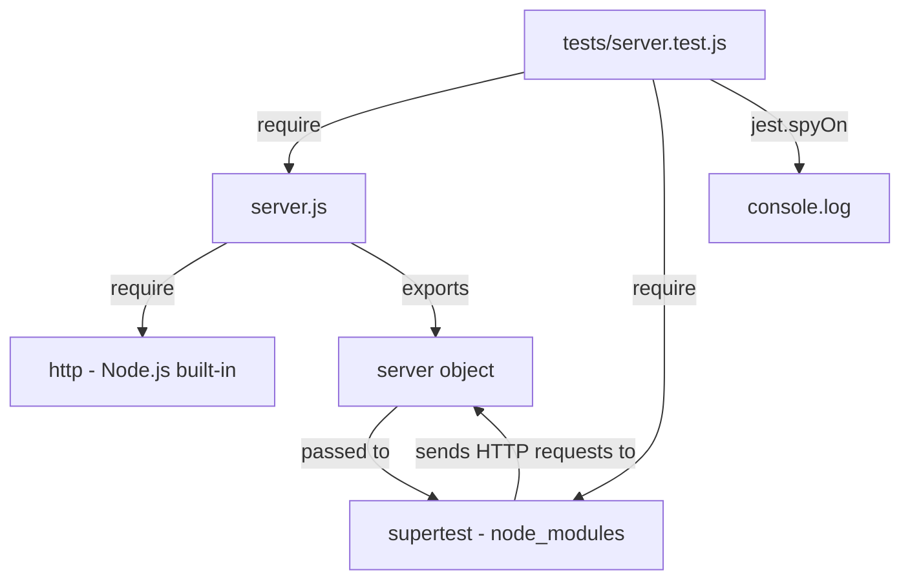

# Technical Specification

# 0. Agent Action Plan

## 0.1 Intent Clarification

### 0.1.1 Core Testing Objective

Based on the provided requirements, the Blitzy platform understands that the testing objective is to **introduce a complete automated test suite from scratch** for a minimal, zero-dependency Node.js HTTP server (`server.js`) that currently has **0% automated test coverage**. The project (`hello_world` v1.0.0) is a 14-line single-file application serving as a Backprop integration test harness.

**Request Categorization:** Add new tests

**Testing Requirements — Restated with Enhanced Clarity:**

- **HTTP Server Initialization Validation** — Verify that `http.createServer()` correctly instantiates a server and that `server.listen()` binds successfully to `127.0.0.1:3000`, confirming the server reaches a "listening" state
- **Universal Request Handler Verification** — Confirm that the single request handler callback processes all HTTP methods (GET, POST, PUT, DELETE, PATCH, OPTIONS, HEAD) and all URL paths (`/`, `/test`, `/any/arbitrary/path`) identically, returning the same response regardless of input
- **Response Contract Enforcement** — Assert that every HTTP response contains exactly: status code `200`, header `Content-Type: text/plain`, and body `Hello, World!\n` (note the trailing newline character)
- **Console Startup Message Verification** — Validate that the server logs the exact string `Server running at http://127.0.0.1:3000/` to `stdout` upon successful startup, using console output capture if achievable without intrusive changes to production code
- **Server Lifecycle Management** — Ensure the server can be cleanly started and stopped within the test harness, preventing port conflicts and resource leaks between test runs

**Implicit Testing Needs Surfaced:**

- **Trailing Newline Precision** — The response body is `'Hello, World!\n'` (with `\n`), and tests must assert the exact string including the newline character
- **Header Case Sensitivity** — Content-Type header value `text/plain` must be validated with appropriate case handling
- **Server Export for Testability** — Since `server.js` executes side effects on `require()` (calling `server.listen()` immediately) and does not export the server object, a minimal one-line production change (`module.exports = server;`) is required to enable in-process testing with `supertest`
- **Port Cleanup** — Tests must properly close the server after each test suite to release port 3000 and prevent `EADDRINUSE` errors
- **Stateless Verification** — Confirm that consecutive requests produce identical responses, validating the absence of any hidden state

### 0.1.2 Special Instructions and Constraints

**Critical Directives Captured:**

- **Minimal Change Clause:** Only changes absolutely necessary for comprehensive testing coverage are permitted. Test files and minimal test infrastructure additions are the primary scope
- **No Production Code Refactoring:** Existing `server.js` logic, behavior, and architecture must remain completely untouched except for the single `module.exports` line required for testability
- **Zero-Dependency Design Preservation:** The production codebase must maintain its zero-dependency philosophy; all new packages (`jest`, `supertest`) are `devDependencies` only
- **Single-File Architecture Preservation:** No restructuring of `server.js` into multiple modules or introduction of new architectural patterns
- **Test Isolation:** All test code must reside exclusively within a `/tests` directory
- **No CI/CD Workflow Modifications:** Per the project implementation rule — "Do not make any updates or changes in GitHub App to create or update a workflow"
- **Least Invasive Approach:** Choose the testing strategy that requires the fewest possible modifications to existing files
- **Avoid Unnecessary Mocking:** Test real HTTP behavior using in-process server; mock only when absolutely necessary (e.g., `console.log` capture)

**Testing Convention Requirements:**

- Follow Jest naming conventions: `*.test.js` files
- Use `describe` / `test` blocks with descriptive names following `should [behavior] when [condition]` pattern
- Keep test structure minimal and aligned with the single-file source architecture
- Use inline test data (no external fixture files needed for static responses)

### 0.1.3 Technical Interpretation

These testing requirements translate to the following technical test implementation strategy:

- To **validate HTTP server initialization**, we will **create** `tests/server.test.js` with test cases that verify the server reaches a `listening` state after `require()` and responds to connections on the expected address
- To **verify universal request handling**, we will **create** test cases within `tests/server.test.js` using `supertest` to send GET, POST, PUT, DELETE, PATCH, and OPTIONS requests to multiple paths (`/`, `/test`, `/nonexistent`) and assert identical `200` responses
- To **enforce the response contract**, we will **create** assertions in `tests/server.test.js` that validate the exact response body (`Hello, World!\n`), status code (`200`), and `Content-Type` header (`text/plain`) for every test case
- To **verify console startup logging**, we will **create** a dedicated test within `tests/server.test.js` that uses `jest.spyOn(console, 'log')` to capture and validate the startup message format
- To **enable in-process testing**, we will **update** `server.js` with a single line addition: `module.exports = server;` — the minimum change required for `supertest` compatibility
- To **manage server lifecycle in tests**, we will use Jest's `afterAll()` hook to call `server.close()`, ensuring clean resource cleanup

### 0.1.4 Coverage Requirements Interpretation

**Explicit Coverage Targets from User:**

- **100% functional coverage** of `server.js` — every behavioral path must be exercised
- Specific areas mandated: server startup logic, request handling behavior, and response output consistency

**Implicit Coverage Expectations:**

- **Line Coverage: 100%** — The 14-line codebase makes complete line coverage both achievable and expected
- **Function Coverage: 100%** — Two functions exist: the `createServer` request handler callback and the `listen` startup callback; both must be exercised
- **Branch Coverage: 100%** — No conditional branches exist in the code, so this is achieved by executing any test
- **Statement Coverage: 100%** — All statements (require, const assignments, createServer, setHeader, end, listen, console.log) must execute during testing

To achieve comprehensive testing, coverage should include:

- All HTTP method variants processed through the universal handler
- Multiple URL paths confirming path-agnostic behavior
- Response body, status code, and header assertions on every request type
- Server startup message format validation
- Server lifecycle (start/stop) clean execution

## 0.2 Test Discovery and Analysis

### 0.2.1 Existing Test Infrastructure Assessment

Repository analysis was conducted across all four files in the project root (`server.js`, `package.json`, `package-lock.json`, `README.md`). No test directories, test files, test configurations, or testing-related dependencies exist anywhere in the repository.

**Search Findings:**

- **Test file patterns searched** (`*test*`, `*spec*`, `test_*`, `*_test.*`, `*_spec.*`): Zero matches. No test files exist in the repository
- **Testing framework detection** (`package.json` dependencies/devDependencies): No `dependencies` or `devDependencies` sections exist. The dependency graph is completely empty
- **Test configuration files** (`jest.config.*`, `.babelrc`, `pytest.ini`, `.mocharc.*`): None found. No test runner configuration exists
- **Existing test suites**: None. The `package.json` test script is a placeholder: `"test": "echo \"Error: no test specified\" && exit 1"`
- **Coverage tools**: None installed or configured
- **Mock/stub libraries**: None detected
- **Test data fixtures or factories**: None present

Repository analysis reveals a **completely untested codebase** with zero automated testing infrastructure. The project intentionally operates as a minimal test harness for Backprop integration with no prior test suite implementation.

**Current Testing Infrastructure Summary:**

| Component | Status | Details |
|-----------|--------|---------|
| Testing framework | Not installed | No jest, mocha, vitest, or any test runner |
| Test runner configuration | Not configured | No config files detected |
| Coverage tools | Not installed | No coverage tooling present |
| Mock/stub libraries | Not installed | No mocking libraries in dependency graph |
| Test data fixtures | Not present | No fixtures directory or files |
| CI/CD test integration | Not configured | No CI/CD pipeline or workflow files |
| npm test script | Placeholder only | Outputs error message and exits with code 1 |

**Source File Analysis for Testability:**

`server.js` (the sole source file) presents a specific testability challenge:

- The file performs side effects at module-evaluation time — `require('http')`, `http.createServer()`, and `server.listen()` all execute immediately when the module is loaded
- No functions or objects are exported (`module.exports` is not used)
- The request handler is an anonymous inline callback passed directly to `createServer()`
- The `listen` callback is an anonymous inline arrow function logging to `console`
- To enable in-process testing with `supertest`, the `server` object must be exported via a single-line addition: `module.exports = server;`

### 0.2.2 Web Search Research Conducted

**Research Area 1: Jest Version Compatibility with Node.js 20**

- Jest 29.7.0 is the latest release in the v29 line, confirmed compatible with Node.js 14, 16, 18, and 20
- Jest 30.x (latest: 30.3.0) was released June 2025, dropping support for Node 14, 16, 19, 21; minimum is Node 18+
- **Decision:** Use Jest 29.7.0 for maximum stability in this simple project — it is battle-tested, widely adopted, and fully compatible with Node.js 20.20.1

**Research Area 2: Supertest HTTP Testing Library**

- Supertest 7.2.2 is the current latest version, published recently with healthy maintenance status
- Supertest can accept an `http.Server` object directly — if the server is already listening, supertest uses the existing connection; if not, it binds to an ephemeral port automatically
- Supertest supports promise-based and callback-based assertion patterns natively since v2.0+
- **Decision:** Use supertest 7.2.2 for in-process HTTP request testing against the server object

**Research Area 3: Testing Patterns for Minimal Node.js HTTP Servers**

- The standard approach for testing Node.js `http.createServer()` apps with supertest requires exporting the server or the app handler
- For servers that auto-start on `require()`, tests must manage the server lifecycle via `afterAll(() => server.close())`
- Jest's built-in coverage tool (`--coverage` flag) produces Istanbul-format reports with line, function, branch, and statement metrics
- Console output capture is achieved via `jest.spyOn(console, 'log')` — non-intrusive and reversible

**Research Area 4: Jest Best Practices for Simple Codebases**

- Zero-config Jest setup is suitable: no `jest.config.js` required when tests follow `*.test.js` naming in a `tests/` directory (configurable via package.json `jest` field or `--roots` flag)
- `--watchAll=false` and `--ci` flags prevent interactive watch mode in automated environments
- `--forceExit` can be used as a safety net to terminate lingering server handles
- `--detectOpenHandles` flag helps identify unreleased resources during development

## 0.3 Testing Scope Analysis

### 0.3.1 Test Target Identification

**Primary Code to Be Tested:**

- **Module:** `server.js` at project root (`./server.js`) — requires unit and integration tests
  - **Function 1:** Anonymous request handler callback (line 6–9) — passed to `http.createServer()`, processes all incoming HTTP requests. Requires HTTP method/path matrix testing and response assertion tests
  - **Function 2:** Anonymous listen callback (line 12–13) — invoked on successful server binding. Requires console output verification tests
  - **Side effect 1:** `http.createServer()` invocation (line 6) — server object creation. Requires server state validation
  - **Side effect 2:** `server.listen(port, hostname, callback)` invocation (line 12) — network binding. Requires server listening state verification

**Existing Test File Mapping:**

| Source File | Existing Test File | Test Categories Present |
|-------------|-------------------|------------------------|
| `server.js` | None | None — 0% coverage |
| `package.json` | None | N/A — configuration only, excluded |
| `package-lock.json` | None | N/A — lockfile, excluded |
| `README.md` | None | N/A — documentation, excluded |

**Dependencies Requiring Mocking:**

- **External services to mock:** None — zero external dependencies
- **Database interactions to stub:** None — no database connectivity
- **File system operations to virtualize:** None — no file I/O operations
- **Console output to spy on:** `console.log` — used in the `listen` callback for the startup message. Spying via `jest.spyOn(console, 'log')` is the only mocking needed, specifically to verify the startup message format `Server running at http://127.0.0.1:3000/`

### 0.3.2 Version Compatibility Research

Based on Node.js v20.20.1 (the runtime in the current environment) and npm v11.1.0, the recommended testing stack is:

| Tool | Package | Recommended Version | Compatibility Rationale |
|------|---------|-------------------|------------------------|
| Testing framework | `jest` | 29.7.0 | Last stable release of v29 line; fully supports Node.js 14–20; zero-config capable; built-in coverage; most widely adopted version currently in production |
| HTTP testing | `supertest` | 7.2.2 | Latest stable release; native promise support; direct `http.Server` compatibility; fluent assertion API for status, headers, and body |
| Coverage tool | Jest built-in (`--coverage`) | N/A (bundled with Jest) | Istanbul-based coverage engine included with Jest; produces line, function, branch, and statement metrics; no additional package needed |
| Console mocking | Jest built-in (`jest.spyOn`) | N/A (bundled with Jest) | Native Jest spy utility; zero additional dependencies; non-intrusive console interception |

**Version Conflict Analysis:**

- **No conflicts detected.** Jest 29.7.0 and supertest 7.2.2 have no known incompatibilities
- Both packages support CommonJS `require()` module loading, matching the project's module system
- Supertest's internal dependency on `superagent` is self-contained and does not conflict with the project's zero-dependency production design
- Jest 29.7.0's test environment (`node`) is the appropriate choice for testing a server-side HTTP application (no `jsdom` required)

**Rationale for Jest 29.7.0 Over Jest 30.x:**

- Jest 30.x (latest: 30.3.0) is very recent (released June 2025) and introduces multiple breaking changes
- For a simple, zero-config project with straightforward testing needs, the stability of 29.7.0 outweighs the performance gains of 30.x
- Jest 29.7.0 documentation and community resources are significantly more extensive
- If a future upgrade to 30.x is desired, the migration path from 29.7.0 is straightforward

## 0.4 Test Implementation Design

### 0.4.1 Test Strategy Selection

**Test Types to Implement:**

- **Unit-style tests:** Focus on the isolated request handler behavior — verifying that for any given HTTP request, the handler produces the deterministic response (status 200, `text/plain`, `Hello, World!\n`). Achieved by sending requests via `supertest` against the in-process server object
- **Integration-style tests:** Cover the full HTTP request/response cycle — server binding, request routing (all methods, all paths), response generation, and header validation. Validated through actual HTTP transactions via `supertest`
- **Edge case tests:** Address boundary conditions including unusual HTTP methods (PATCH, OPTIONS, HEAD), deeply nested paths (`/a/b/c/d`), paths with special characters, and rapid successive requests
- **Error handling tests:** Verify Node.js built-in HTTP error handling for graceful server behavior; confirm the server does not crash or produce unexpected responses under normal operation
- **Server lifecycle tests:** Validate that the server starts cleanly, responds correctly, and shuts down without resource leaks

### 0.4.2 Test Case Blueprint

```
Component: Request Handler (anonymous callback in http.createServer)
Test Categories:
- Happy path:
  - GET / returns 200 with "Hello, World!\n"
  - POST / returns 200 with "Hello, World!\n"
  - PUT / returns 200 with "Hello, World!\n"
  - DELETE / returns 200 with "Hello, World!\n"
- Edge cases:
  - PATCH / returns identical response
  - OPTIONS / returns identical response
  - GET /nonexistent returns identical response
  - GET /deeply/nested/path returns identical response
  - GET /path?query=value returns identical response
- Error cases:
  - Server handles rapid sequential requests without failure
  - Response body is exactly "Hello, World!\n" (trailing newline verified)
- Response contract:
  - Status code is exactly 200 for all requests
  - Content-Type header is "text/plain" for all requests
  - Response body matches exact string with newline
```

```
Component: Server Initialization (server.listen callback)
Test Categories:
- Happy path:
  - Server binds and reaches listening state
  - Console.log outputs "Server running at http://127.0.0.1:3000/"
- Lifecycle:
  - Server can be closed cleanly via server.close()
  - Server address reports correct hostname and port
```

```
Component: HTTP Method Coverage Matrix
Test Categories:
- Verify identical response for: GET, POST, PUT, DELETE, PATCH, OPTIONS
- Each method tested against root path (/)
- HEAD method verified for correct headers (body may be empty per HTTP spec)
```

### 0.4.3 Existing Test Extension Strategy

There are **no existing tests** to extend, refactor, or fix. The entire test suite is a greenfield implementation. All test files are new creations.

**Starting Point:** The `package.json` test script (`"test": "echo \"Error: no test specified\" && exit 1"`) must be replaced with the Jest execution command to enable `npm test` functionality.

### 0.4.4 Test Data and Fixtures Design

**Required Test Data Structures:**

- **Expected response body:** `'Hello, World!\n'` — inline string constant used directly in assertions
- **Expected status code:** `200` — inline numeric literal
- **Expected Content-Type:** `'text/plain'` — inline string used in header assertions
- **Server address constants:** hostname `'127.0.0.1'`, port `3000` — used for startup message verification
- **Expected console message:** `` `Server running at http://127.0.0.1:3000/` `` — used in console spy assertion

**Fixture Organization Strategy:**

- **No external fixture files required.** All test data is static and deterministic (the server always returns the same response)
- Inline test data within each test case provides maximum clarity and minimizes indirection
- Constants like the expected response body can be defined at the top of the test file if reused across multiple test cases

**Mock Object Specifications:**

- **Console spy:** `jest.spyOn(console, 'log')` — captures calls to `console.log` to verify startup message. Restored via `mockRestore()` in teardown
- **No HTTP mocking:** Real HTTP transactions via `supertest` against the in-process server provide authentic behavior verification

**Test State Management Approach:**

- Server starts automatically when `server.js` is `require()`d (side effect of module evaluation)
- `afterAll()` hook calls `server.close()` to release port 3000 and terminate the HTTP server
- Each test is stateless — the server's deterministic behavior means no test-to-test state contamination
- No database, session, or file system state to manage

## 0.5 Test File Transformation Mapping

### 0.5.1 File-by-File Test Plan

| Target File | Transformation | Source File/Reference | Purpose/Changes |
|-------------|---------------|----------------------|-----------------|
| `tests/server.test.js` | CREATE | `server.js` | Comprehensive test suite covering HTTP method matrix (GET, POST, PUT, DELETE, PATCH, OPTIONS, HEAD), multi-path validation, response contract enforcement (status 200, Content-Type text/plain, body "Hello, World!\n"), server startup console message verification, and server lifecycle management |
| `server.js` | UPDATE | `server.js` | Add single line `module.exports = server;` at end of file to export the server object for supertest in-process testing — minimum change required for testability |
| `package.json` | UPDATE | `package.json` | Replace placeholder test script with `jest --forceExit --detectOpenHandles`; add `devDependencies` section with `jest` and `supertest`; optionally add `test:coverage` script |

### 0.5.2 New Test Files Detail

**`tests/server.test.js`** — Primary test suite for the HTTP server

- **Test categories:**
  - **Happy path (6+ test cases):** Validate GET, POST, PUT, DELETE, PATCH, OPTIONS requests to root path `/` return 200 with correct body and headers
  - **Edge cases (5+ test cases):** Test HEAD method (headers only), deeply nested paths, paths with query strings, paths with special characters, root path equivalence
  - **Response contract (3+ test cases):** Exact body match `Hello, World!\n`, status code `200`, Content-Type `text/plain` header verification
  - **Server lifecycle (2+ test cases):** Server address verification (hostname/port), console startup message validation via `jest.spyOn`
- **Mock dependencies:**
  - `jest.spyOn(console, 'log')` — sole mock, for startup message capture
- **Assertions focus:**
  - `expect(res.status).toBe(200)` — status code
  - `expect(res.text).toBe('Hello, World!\n')` — exact body with newline
  - `expect(res.headers['content-type']).toMatch(/text\/plain/)` — header validation
  - `expect(console.log).toHaveBeenCalledWith(...)` — startup message

### 0.5.3 Test Files to Modify Detail

There are no existing test files to modify. All test code is new.

**Production Files Requiring Minimal Modification:**

- **`server.js`** — Add 1 line at end of file:
  - New line: `module.exports = server;`
  - Rationale: Required for `supertest` to access the server object for in-process HTTP testing. Without this export, the server cannot be passed to `request(server)` in the test file
  - Impact: Zero behavioral change — adding `module.exports` does not alter the server's runtime behavior, startup sequence, or response logic. When run via `node server.js`, the export is unused

- **`package.json`** — Modify 2 sections:
  - Replace `scripts.test` value from `echo "Error: no test specified" && exit 1` to `jest --forceExit --detectOpenHandles`
  - Add new `scripts.test:coverage` entry: `jest --coverage --forceExit --detectOpenHandles`
  - Add new `devDependencies` section with `jest` and `supertest` entries

### 0.5.4 Test Configuration Updates

- **`package.json`** — Jest is configured via the `scripts` section and zero-config defaults:
  - Test command: `jest --forceExit --detectOpenHandles`
  - Coverage command: `jest --coverage --forceExit --detectOpenHandles`
  - Jest auto-discovers `*.test.js` files in the project (including the `tests/` directory) by default with no additional configuration needed
  - The `--forceExit` flag ensures Jest terminates even if the server handle is not fully closed
  - The `--detectOpenHandles` flag helps identify resource leaks during development

- **No separate `jest.config.js` file is needed.** The zero-config approach aligns with the project's minimal philosophy. Jest's defaults correctly:
  - Detect `tests/server.test.js` via the `*.test.js` glob pattern
  - Use the `node` test environment (appropriate for server-side code)
  - Include Istanbul-based coverage collection when `--coverage` is passed

- **No `.coveragerc` or coverage configuration file needed.** Jest's built-in coverage defaults are sufficient:
  - Coverage reports include line, function, branch, and statement metrics
  - Coverage output goes to `coverage/` directory (auto-generated, should be `.gitignore`d if desired)

### 0.5.5 Cross-File Test Dependencies

**Shared Fixtures:** None required — all test data is inline

**Mock Objects:**
- `jest.spyOn(console, 'log')` — defined and restored within the test file itself; no shared mock module needed

**Test Utilities:**
- No shared helper files needed for this minimal test suite
- Server start/stop lifecycle is managed directly in the test file via `require()` and `afterAll(server.close)`
- If future tests are added, a shared helper for server lifecycle could be extracted, but this is unnecessary for the current scope

**Import Dependencies:**
- `tests/server.test.js` imports:
  - `require('supertest')` — from `node_modules/supertest` (devDependency)
  - `require('../server')` — from `./server.js` (production source, after the `module.exports` addition)

**Dependency Graph:**



## 0.6 Dependency Inventory

### 0.6.1 Testing Dependencies

All testing packages are installed as `devDependencies` to preserve the project's zero-dependency production design. No production dependencies are added.

| Registry | Package Name | Version | Purpose |
|----------|-------------|---------|---------|
| npm | `jest` | 29.7.0 | Testing framework and test runner with built-in assertions, mocking, and coverage. Last stable v29 release, fully compatible with Node.js 20.20.1. Provides `describe`, `test`, `expect`, `jest.spyOn`, `beforeAll`/`afterAll` lifecycle hooks, and `--coverage` flag |
| npm | `supertest` | 7.2.2 | HTTP assertion library for in-process server testing. Accepts an `http.Server` object and sends real HTTP requests without external network binding. Provides fluent API: `.get()`, `.post()`, `.expect(status)`, `.expect(header, value)` |

**Transitive Dependencies (installed automatically by npm):**

- `supertest` depends on `superagent` (HTTP client library) — this is resolved automatically and confined to `node_modules`
- `jest` depends on its ecosystem packages (`@jest/core`, `jest-cli`, `jest-config`, etc.) — all resolved automatically
- No transitive dependency conflicts with the production codebase (which has zero dependencies)

**Installation Command:**

```bash
npm install --save-dev jest@29.7.0 supertest@7.2.2
```

### 0.6.2 Import Updates

**Test files requiring imports (all new):**

- `tests/server.test.js`:
  - `const request = require('supertest');` — imports the supertest HTTP testing library
  - `const server = require('../server');` — imports the server object from the production file (requires the `module.exports = server;` addition to `server.js`)

**Import Transformation Rules:**

- No import transformations are necessary since this is a greenfield test implementation
- All imports use CommonJS `require()` syntax, matching the project's established module system (no ES Modules)
- The relative path `'../server'` resolves from `tests/server.test.js` to the project root `server.js`

**Production File Import Impact:**

- The addition of `module.exports = server;` to `server.js` does not affect the existing `require('http')` import or any other code in the file
- When `server.js` is run directly via `node server.js`, the `module.exports` assignment is harmless — Node.js does not use the export value for direct execution
- When `server.js` is `require()`d by a test file, the side effects (server creation and listen) execute, and the `server` object is returned to the caller

## 0.7 Coverage and Quality Targets

### 0.7.1 Coverage Metrics

**Current Coverage:**

| Metric | Current | Evidence |
|--------|---------|----------|
| Line Coverage | 0% | No test files or test runner exist |
| Function Coverage | 0% | No automated tests execute any functions |
| Branch Coverage | 0% | No test execution of any code paths |
| Statement Coverage | 0% | No statements exercised by tests |

**Target Coverage:**

| Metric | Target | Rationale |
|--------|--------|-----------|
| Line Coverage | 100% | 14-line codebase makes complete coverage achievable and expected. User explicitly requires 100% functional coverage |
| Function Coverage | 100% | Two anonymous functions (request handler, listen callback) must both be exercised |
| Branch Coverage | 100% | No conditional branches exist; achieved by executing any request through the handler |
| Statement Coverage | 100% | All 10 executable statements (require, const×2, createServer, statusCode assignment, setHeader, end, listen, console.log, module.exports) must execute |

**Coverage Gaps to Address:**

- **Request handler callback (lines 6–9):** Currently 0%, target 100% — addressed by sending HTTP requests via supertest, which triggers the handler execution including `res.statusCode = 200`, `res.setHeader(...)`, and `res.end(...)`
- **Listen callback (lines 12–13):** Currently 0%, target 100% — addressed by the fact that `require('../server')` triggers `server.listen()`, which invokes the callback and executes `console.log(...)`. The console spy test validates this
- **Module-level statements (lines 1, 3, 4, 6, 12):** Currently 0%, target 100% — addressed by the `require('../server')` call in the test file, which evaluates all module-level code

**Per-File Coverage Targets:**

| File | Line Target | Function Target | Branch Target | Statement Target |
|------|-------------|-----------------|---------------|------------------|
| `server.js` | 100% | 100% | 100% | 100% |

### 0.7.2 Test Quality Criteria

**Assertion Density Expectations:**

- Each test case contains at minimum one primary assertion (e.g., status code check)
- HTTP response tests include multiple chained assertions: status, content-type header, and body
- Target: 2–4 assertions per test case for comprehensive validation without redundancy

**Test Isolation Requirements:**

- Each `test()` block operates independently — no shared mutable state between tests
- The server's stateless, deterministic behavior ensures test order independence
- Console spy is set up and restored within the appropriate lifecycle hooks to prevent cross-test contamination
- `afterAll()` handles server shutdown, ensuring resource cleanup regardless of individual test outcomes

**Performance Constraints for Test Execution:**

- Total test suite execution: under 5 seconds (target: under 3 seconds)
- Individual test case: under 500ms
- Server startup overhead occurs once per test file (on `require()`), not per test case
- Supertest performs in-process HTTP transactions, avoiding external network latency

**Maintainability Standards:**

- Descriptive test names following `should [behavior] when [condition]` pattern
- Flat test structure — single `describe` block with individual `test` cases
- No excessive abstraction — assertions are direct and readable
- Minimal mocking — only `console.log` is spied on; all other behavior is tested authentically
- Test file organization mirrors source: one source file → one test file

**Repository Test Pattern Compliance:**

- Since no existing test patterns exist in the repository, the new test suite establishes the foundational conventions:
  - Test directory: `tests/`
  - Test file naming: `[source-name].test.js`
  - Test runner: Jest with CommonJS `require()` imports
  - HTTP testing: Supertest with fluent assertion chains
  - Lifecycle management: `afterAll()` for cleanup

## 0.8 Scope Boundaries

### 0.8.1 Exhaustively In Scope

**New Test Files:**

- `tests/server.test.js` — Complete unit and integration test suite for `server.js`

**Production File Modifications (minimal, required for testability):**

- `server.js` — Single-line addition: `module.exports = server;`

**Configuration File Updates:**

- `package.json` — Update `scripts.test`, add `scripts.test:coverage`, add `devDependencies` with `jest@29.7.0` and `supertest@7.2.2`
- `package-lock.json` — Automatically regenerated by `npm install` to reflect new devDependencies

**Test Infrastructure (generated by npm install):**

- `node_modules/` — Jest, supertest, and their transitive dependencies (development only)

**Test Coverage Artifacts (generated by test execution):**

- `coverage/` — Istanbul coverage reports generated by `jest --coverage` (runtime artifact, not committed)

**Test Categories In Scope:**

- HTTP method coverage: GET, POST, PUT, DELETE, PATCH, OPTIONS, HEAD
- Path coverage: `/`, `/test`, `/nonexistent`, `/deeply/nested/path`, `/path?query=value`
- Response contract validation: status code 200, Content-Type `text/plain`, body `Hello, World!\n`
- Server lifecycle: startup verification, console message validation, clean shutdown
- Deterministic behavior: repeated request consistency, stateless operation confirmation

### 0.8.2 Explicitly Out of Scope

**Source Code Modifications (beyond the single export line):**

- No refactoring of `server.js` request handler logic
- No extraction of the handler function into a separate module
- No modification of hardcoded hostname (`127.0.0.1`) or port (`3000`)
- No introduction of environment variable configuration
- No addition of routing, middleware, or framework logic
- No modification of response body, status codes, or headers

**Files Excluded from Testing:**

- `package.json` — Configuration-only file, not testable application logic
- `package-lock.json` — Lockfile, automatically managed by npm
- `README.md` — Documentation, not executable code

**Test Types Not Implemented:**

- UI/browser tests — No user interface exists
- Database tests — No database connectivity
- External service integration tests — No third-party APIs
- Load/performance testing — Beyond scope of functional coverage objective
- Security/penetration testing — Not applicable to a localhost-only Hello World server
- End-to-end tests with real network binding — Supertest provides in-process equivalent

**Infrastructure and CI/CD:**

- No GitHub Actions workflows created or modified (per implementation rule: "Do not make any updates or changes in GitHub App to create or update a workflow")
- No Docker or containerization changes
- No deployment pipeline modifications
- No pre-commit hooks or git hooks added

**Features Not Tested (not implemented in source):**

- Authentication or authorization
- Logging frameworks beyond `console.log`
- Error handling for malformed requests (deferred to Node.js HTTP module defaults)
- HTTPS/TLS support
- Request body parsing
- Static file serving
- Any functionality mentioned in project descriptions but not present in `server.js`

**Other Exclusions:**

- External Backprop tooling integration
- Performance optimization of existing code
- Code quality tools (linters, formatters) beyond test framework
- Documentation additions beyond minimal `npm test` instruction alignment

## 0.9 Execution Parameters

### 0.9.1 Testing-Specific Instructions

**Test Execution Commands:**

| Purpose | Command | Notes |
|---------|---------|-------|
| Run all tests | `npm test` | Resolves to `jest --forceExit --detectOpenHandles` |
| Run with coverage | `npm run test:coverage` | Resolves to `jest --coverage --forceExit --detectOpenHandles` |
| Run specific test file | `npx jest tests/server.test.js --forceExit` | Direct Jest invocation targeting a single file |
| Run in CI mode (no watch) | `CI=true npm test -- --watchAll=false --ci` | Prevents interactive mode, suitable for automated environments |
| Debug mode | `node --inspect-brk node_modules/.bin/jest --runInBand tests/server.test.js` | Attaches Node.js debugger for step-through test debugging |
| Verbose output | `npx jest --verbose --forceExit --detectOpenHandles` | Displays individual test case results |

**Server Lifecycle in Tests:**

- **Startup:** The server automatically starts when `require('../server')` executes in the test file. This is a side effect of `server.js` module evaluation — `server.listen(3000, '127.0.0.1', callback)` runs immediately
- **During tests:** Supertest sends HTTP requests to the already-listening server via `request(server).get('/').expect(200)`
- **Shutdown:** `afterAll(() => { server.close(); })` releases port 3000 and terminates the HTTP server cleanly after all tests complete
- **Safety net:** The `--forceExit` Jest flag ensures the process terminates even if a handle remains open

**Test Patterns to Follow:**

- **File naming:** `[source-name].test.js` placed in `tests/` directory
- **Test structure:** `describe('Server', () => { ... })` wrapping individual `test()` blocks
- **Assertion style:** Jest's `expect()` with `.toBe()`, `.toMatch()`, and supertest's `.expect()` chain
- **Async handling:** Supertest returns promises natively; tests use `async/await` or return the promise chain
- **Lifecycle hooks:** `afterAll()` for server cleanup; `beforeAll()` or `beforeEach()` only if console spy setup is needed across tests

**Excluded Test Categories per User Instruction:**

- No E2E tests with real browser interaction
- No performance benchmarking tests
- No security scanning tests
- No tests for features not implemented in `server.js`

**Environment Setup Requirements for Tests:**

- Node.js v20.x runtime (v20.20.1 confirmed available)
- npm v9+ (v11.1.0 confirmed available)
- `npm install` must be run to install `devDependencies` (jest, supertest) into `node_modules/`
- No environment variables required — the server uses hardcoded configuration
- No external services, databases, or APIs needed — fully self-contained test execution
- Port 3000 must be available on localhost during test execution (or Jest `--forceExit` handles cleanup if port is occupied from a prior run)

## 0.10 Special Instructions for Testing

### 0.10.1 Minimal Change Clause Compliance

The user has explicitly emphasized the following testing discipline guidelines that must be strictly observed:

- **"ONLY modify test files and test-related configurations"** — The sole exception is `server.js`, which requires a single-line `module.exports = server;` addition for testability. This change is documented, justified, and has zero behavioral impact on production execution
- **"Do not refactor production code"** — No restructuring, rewriting, or reorganization of `server.js` logic. The existing request handler, server creation, and listen call remain exactly as authored
- **"Do not change existing interfaces or behavior"** — The server's HTTP response contract (200, text/plain, "Hello, World!\n") is immutable. The `module.exports` addition creates a new export interface but does not alter any existing behavior
- **"Keep all test code isolated in `/tests`"** — All test logic resides exclusively in `tests/server.test.js`. No test code is embedded in production files
- **"Keep utilities separate and minimal"** — No shared test utility files are created. Server lifecycle management is handled inline via `afterAll()` hooks
- **"Document any required production changes clearly"** — The single production change (`module.exports = server;` in `server.js`) is documented in sections 0.1.3, 0.5.1, 0.5.3, and 0.8.1 of this action plan
- **"Choose the least invasive testing approach"** — In-process testing via supertest with a single export line is the minimum viable modification for comprehensive test coverage. The alternative (spawning a child process) would require more complex test infrastructure and real network binding
- **"Do not introduce new features or architecture changes"** — No routing, middleware, configuration, or modular architecture is added. The single-file design is preserved
- **"Preserve the project's zero-dependency, minimal design philosophy"** — All testing packages (jest, supertest) are `devDependencies` only. The production `dependencies` section remains absent. Running `node server.js` in production requires zero installed packages

### 0.10.2 Implementation Rule Compliance

- **"Do not make any updates or changes in GitHub App to create or update a workflow"** — No `.github/workflows/` directory or files are created. No CI/CD pipeline configuration is added or modified. Tests are executed locally via `npm test` only

### 0.10.3 Testing Validation Procedure

The user has specified a concrete validation process to confirm tests are working correctly:

- **Positive validation:** Run `npm test` and confirm all tests pass with zero failures
- **Negative validation:** Intentionally modify the response string in `server.js` (e.g., change `'Hello, World!\n'` to `'Hello, Test!\n'`) and confirm tests fail — then revert the change
- **Coverage validation:** Run `npm run test:coverage` and confirm 100% line, function, branch, and statement coverage on `server.js`
- **No-regression validation:** Confirm `node server.js` still starts correctly and responds with `Hello, World!` via `curl http://127.0.0.1:3000/` — ensuring production behavior is unchanged

### 0.10.4 Test Reliability Guarantees

- **No flaky tests:** All tests are deterministic — the server always returns the identical response regardless of input, timing, or execution order
- **No timing dependencies:** Supertest handles the HTTP request/response lifecycle synchronously within Jest's async test framework; no `setTimeout` or polling-based assertions
- **Minimal abstraction:** Direct assertions on stable outputs (`toBe('Hello, World!\n')`) eliminate indirection-related fragility
- **No unnecessary mocks:** Only `console.log` is spied on (for startup message verification). All HTTP behavior is tested authentically via real in-process requests
- **Parallel safety:** The test suite is designed for serial execution within a single Jest worker (default for a single test file). No parallelism-related port conflicts

