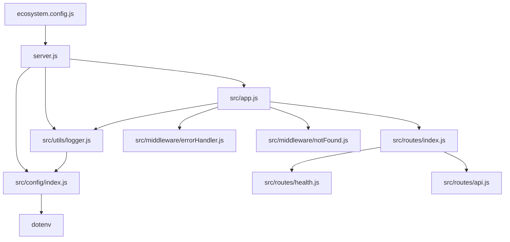

# Technical Specification

# 0. Agent Action Plan

## 0.1 Intent Clarification


### 0.1.1 Core Objective

Based on the provided requirements, the Blitzy platform understands that the objective is to **transform an existing minimal Node.js HTTP server into a production-ready Express.js application** with comprehensive middleware, routing, environment configuration, structured logging, and PM2-based process management for production deployment.

The current codebase (`server.js`) is a 14-line zero-dependency server using only Node.js's built-in `http` module. It binds to `127.0.0.1:3000`, responds to all requests with a static `"Hello, World!\n"` text response, and has no routing, no middleware, no environment configuration, and no production deployment capability. This task represents a full architectural evolution from a test harness to a production-grade web server.

Specifically, the Blitzy platform understands the following requirements:

- **Express.js Framework Migration** — Replace the raw `http.createServer()` approach with the Express.js framework, adopting its middleware pipeline, request/response enhancements, and routing engine as the application's foundation
- **Routing System** — Introduce a modular routing architecture with Express Router, moving from the current single universal request handler to organized, purpose-specific route definitions with proper HTTP method handling
- **Middleware Stack** — Implement a comprehensive middleware pipeline including request parsing (JSON, URL-encoded), security hardening (Helmet), CORS handling, response compression, and request logging (Morgan)
- **Environment Configuration** — Externalize all hardcoded values (hostname `127.0.0.1`, port `3000`) into environment variables managed via `dotenv`, with a centralized configuration module supporting multiple deployment environments
- **Structured Logging** — Replace `console.log` statements with a professional logging system using Winston for application-level logging and Morgan for HTTP request logging, with file-based and console transports
- **PM2 Production Deployment** — Configure PM2 as the process manager for production deployment with an ecosystem configuration file supporting cluster mode, log management, environment-specific settings, and automatic restarts

Implicit requirements detected:

- The `package.json` must be restructured: its `main` field currently points to a nonexistent `index.js`, and it lacks npm scripts entirely
- A `.env` file and `.env.example` template must be created to document all environment variables
- A `.gitignore` file must be created to prevent committing sensitive files (`.env`, `node_modules/`, logs)
- The `README.md` must be updated from its current two-line stub to comprehensive project documentation
- Error handling middleware must be introduced as Express best practice
- A `logs/` directory strategy must be established for Winston file transports
- Health check and 404 handler routes are essential for production readiness

### 0.1.2 Task Categorization

- **Primary task type:** Mixed (Framework Migration + Configuration + Production Deployment)
- **Secondary aspects:** Documentation, Security Enhancement, Logging Infrastructure, Process Management
- **Scope classification:** Cross-cutting change — affects every file in the repository and introduces significant new project structure

### 0.1.3 Special Instructions and Constraints

- **User Rule — GitHub Workflow Restriction:** "Do not make any updates or changes in GitHub App to create or update a workflow." This means no `.github/workflows/` files shall be created or modified.
- **CommonJS Module System:** The existing codebase uses CommonJS (`require()`). The migration must preserve CommonJS syntax throughout to maintain consistency and avoid breaking changes.
- **Node.js v20 Compatibility:** The runtime environment is Node.js v20.20.1. All dependency selections must be compatible with Node.js v18+ (Express 5.x requirement) and leverage v20 features where appropriate.
- **No TypeScript:** The existing project uses plain JavaScript with no build/transpilation step. This convention must be maintained.

### 0.1.4 Technical Interpretation

These requirements translate to the following technical implementation strategy:

- To **migrate to Express.js**, we will replace the `http.createServer()` call in `server.js` with an Express application instance, restructure the file into an `app.js` (Express app definition) and `server.js` (server startup) separation pattern, and install Express 5.x as the core dependency
- To **implement routing**, we will create a `src/routes/` directory with modular route files using `express.Router()`, define an `index.js` route aggregator, and mount routes on the Express app with appropriate path prefixes
- To **add middleware**, we will install and configure `helmet` for security headers, `cors` for cross-origin handling, `compression` for response compression, `morgan` for HTTP request logging, and Express's built-in `express.json()` and `express.urlencoded()` for body parsing — all wired in proper execution order in `app.js`
- To **externalize configuration**, we will install `dotenv`, create a `.env` file with all configurable values, build a `src/config/index.js` module that validates and exports environment variables, and create a `.env.example` template
- To **implement structured logging**, we will install `winston`, create a `src/utils/logger.js` module with console and file transports, integrate Morgan's HTTP logging stream through Winston, and replace all `console.log` usage
- To **prepare PM2 deployment**, we will install `pm2` as a dev dependency, create an `ecosystem.config.js` file with application definitions for development and production modes including cluster mode settings, and add npm scripts for PM2 lifecycle management


## 0.2 Repository Scope Discovery


### 0.2.1 Comprehensive File Analysis

The repository is a minimal project containing exactly **4 files** at the root level, with zero subdirectories. Every file has been read and analyzed in full.

| File | Size | Purpose | Impact Assessment |
|------|------|---------|-------------------|
| `server.js` | 14 lines | Minimal HTTP server using built-in `http` module, binds to `127.0.0.1:3000`, returns `"Hello, World!\n"` for all requests | **Major rewrite** — must be refactored into Express.js app with separated concerns |
| `package.json` | 11 lines | Package manifest: name `hello_world`, version `1.0.0`, main `index.js` (incorrect — file does not exist), zero dependencies, zero scripts | **Major update** — add all dependencies, scripts, correct `main` field, add `engines` field |
| `package-lock.json` | 13 lines | Lockfile v3, zero dependencies, only root package entry | **Auto-regenerated** — will be replaced upon `npm install` with new dependencies |
| `README.md` | 2 lines | Stub: `# hao-backprop-test` and `test project for backprop integration.` | **Major rewrite** — must document the enhanced Express.js application |

**Current codebase characteristics:**
- Zero external dependencies (no `node_modules/`)
- No directory structure — all files at root level
- CommonJS module system (`require('http')`)
- No npm scripts, no `.gitignore`, no `.env`, no configuration files
- No test infrastructure, no CI/CD configuration
- Package name mismatch: `README.md` says `hao-backprop-test`, `package.json` says `hello_world`

**Related file discovery — files that must be created:**
- Express application definition (`src/app.js`) — new application entry point
- Route modules (`src/routes/*.js`) — modular routing
- Middleware modules (`src/middleware/*.js`) — custom middleware
- Configuration module (`src/config/index.js`) — environment configuration
- Logger utility (`src/utils/logger.js`) — Winston logger setup
- Environment files (`.env`, `.env.example`) — environment variables
- PM2 ecosystem file (`ecosystem.config.js`) — process manager configuration
- Git ignore file (`.gitignore`) — version control exclusions

### 0.2.2 Web Search Research Conducted

- **Express.js latest version:** Express 5.1.0 is now the default on npm (tagged `latest`), with 5.2.1 as the current release. Express 5 drops support for Node.js versions before v18, adds native async/await middleware support, and removes deprecated v3/v4 APIs.
- **PM2 latest version:** PM2 6.0.14 is the latest stable release, supporting all Node.js versions from 12.x onward. Provides cluster mode, log management, ecosystem configuration, and startup script generation.
- **Express.js production best practices:** The official Express.js documentation recommends using a logging library like Pino or Winston instead of `console.log()`, setting `NODE_ENV=production` for performance, using Helmet for security headers, and employing a process manager (PM2 or systemd) for automatic restarts.
- **Structured logging conventions:** Winston with console and file transports is the most widely adopted pattern for Express.js applications. Morgan middleware integrates with Winston by piping its HTTP request log stream through Winston's transport system.
- **Environment configuration:** The `dotenv` package remains the de facto standard for managing environment variables in Node.js. Node.js v20.6.0+ also supports native `--env-file` flag, but `dotenv` provides programmatic control, validation capabilities, and broader ecosystem compatibility.
- **Express.js project structure:** The community-standard structure uses `src/` with subdirectories for `routes/`, `middleware/`, `config/`, `utils/`, and `services/`, with `app.js` for Express setup and `server.js` as the entry point.

### 0.2.3 Existing Infrastructure Assessment

- **Current project structure:** Flat root-level layout with no organizational hierarchy — no `src/`, no `config/`, no `routes/`, no `middleware/` directories
- **Existing patterns and conventions:** CommonJS (`require`/`module.exports`), ES5-compatible JavaScript, no linting or formatting configuration
- **Build and deployment configurations:** None present — no Dockerfile, no CI/CD, no PM2 config, no npm scripts
- **Testing infrastructure:** None present — no test files, no test runner configured, no test scripts
- **Documentation system:** Minimal — two-line README.md with project name only
- **Version control:** No `.gitignore` file exists, meaning `node_modules/` and `.env` files would be committed by default if not addressed


## 0.3 Scope Boundaries


### 0.3.1 Exhaustively In Scope

**Source code changes:**
- `server.js` — Refactor from raw HTTP server to Express.js application bootstrap and server startup
- `src/app.js` — New Express application definition with middleware stack and route mounting
- `src/routes/*.js` — New modular route definitions using `express.Router()`
- `src/middleware/*.js` — New custom middleware modules (error handler, not-found handler)
- `src/config/index.js` — New centralized environment configuration module
- `src/utils/logger.js` — New Winston logger setup with console and file transports

**Configuration updates:**
- `package.json` — Add dependencies, devDependencies, npm scripts, correct `main` field, add `engines` field
- `.env` — New environment variable definitions (PORT, NODE_ENV, LOG_LEVEL, HOST)
- `.env.example` — New template documenting all required environment variables
- `ecosystem.config.js` — New PM2 ecosystem configuration for production deployment

**Documentation updates:**
- `README.md` — Complete rewrite with project description, setup instructions, usage guide, API endpoints, environment variables documentation, and PM2 deployment guide

**Build/deployment:**
- `ecosystem.config.js` — PM2 process manager configuration with development and production environments
- npm scripts in `package.json` — `start`, `dev`, `start:pm2`, `stop:pm2`, `logs:pm2`

**Version control:**
- `.gitignore` — New file excluding `node_modules/`, `.env`, `logs/`, PM2 files

### 0.3.2 Explicitly Out of Scope

- **Authentication and authorization** — No user auth, JWT, sessions, or access control (not requested)
- **Database integration** — No database connectivity, ORM, or data persistence layer
- **TypeScript migration** — The project remains plain JavaScript with CommonJS modules
- **Frontend/views** — No template engines, static file serving, or client-side assets
- **HTTPS/TLS configuration** — SSL termination is expected at the reverse proxy/load balancer level, not in the application
- **Docker containerization** — No Dockerfile or docker-compose configuration
- **CI/CD pipelines** — Per user rule: "Do not make any updates or changes in GitHub App to create or update a workflow." No `.github/workflows/` files will be created
- **Unit/integration testing** — No test framework, test files, or test scripts (not explicitly requested)
- **API rate limiting** — Not requested; can be added as a future enhancement
- **Input validation libraries** — No schema validation (Joi, Zod) beyond Express built-in parsing
- **WebSocket support** — Not requested
- **Caching layer** — No Redis or in-memory caching
- **Performance monitoring/APM** — No external monitoring services beyond PM2's built-in capabilities
- **Refactoring unrelated to Express migration** — No changes to project naming conventions or repository metadata beyond what is necessary


## 0.4 Dependency Inventory


### 0.4.1 Key Private and Public Packages

The current project has **zero dependencies**. All packages below are new additions required to fulfill the enhancement requirements.

**Production Dependencies:**

| Registry | Package Name | Version | Purpose |
|----------|-------------|---------|---------|
| npm | express | 5.2.1 | Core web framework — routing, middleware pipeline, request/response handling |
| npm | dotenv | 17.3.1 | Environment variable management — loads `.env` file into `process.env` |
| npm | winston | 3.19.0 | Application-level structured logging with multiple transports (console, file) |
| npm | morgan | 1.10.1 | HTTP request logging middleware — logs method, URL, status, response time |
| npm | helmet | 8.1.0 | Security middleware — sets HTTP security headers (CSP, HSTS, X-Frame-Options) |
| npm | cors | 2.8.6 | Cross-Origin Resource Sharing middleware — configurable CORS policy |
| npm | compression | 1.8.1 | Response compression middleware — gzip/deflate/br compression for responses |

**Development Dependencies:**

| Registry | Package Name | Version | Purpose |
|----------|-------------|---------|---------|
| npm | pm2 | 6.0.14 | Production process manager — cluster mode, auto-restart, log management |
| npm | nodemon | 3.1.9 | Development auto-reload — watches files and restarts server on changes |

### 0.4.2 Dependency Updates

**New dependencies to add:**

- `express@5.2.1` — Core framework replacing raw `http` module; Express 5.x is now the stable `latest` on npm with native async/await error handling and improved routing
- `dotenv@17.3.1` — Enables externalization of hardcoded configuration values (`127.0.0.1`, `3000`) into environment variables
- `winston@3.19.0` — Replaces `console.log` with structured, level-based logging supporting file and console output
- `morgan@1.10.1` — Adds automated HTTP request logging as Express middleware, integrates with Winston stream
- `helmet@8.1.0` — Essential security hardening with sensible default HTTP headers
- `cors@2.8.6` — Enables configurable cross-origin request handling for API consumers
- `compression@1.8.1` — Reduces response payload sizes for improved network performance
- `pm2@6.0.14` (devDependency) — Production process management with cluster mode and ecosystem file support
- `nodemon@3.1.9` (devDependency) — Development convenience for automatic server restart on file changes

**Dependencies to update:** None (no existing dependencies)

**Dependencies to remove:** None (no existing dependencies)

### 0.4.3 Import/Reference Updates

Since the project transitions from zero dependencies to a full Express.js stack, every new source file will contain new imports. The key transformation:

- **Old pattern (`server.js`):**
  ```js
  const http = require('http');
  ```

- **New pattern (`src/app.js`):**
  ```js
  const express = require('express');
  ```

- **Apply to:** All new and modified files under `src/**/*.js`, `server.js`, `ecosystem.config.js`


## 0.5 Implementation Design


### 0.5.1 Technical Approach

**Primary objectives with implementation approach:**

- **Achieve Express.js migration** by replacing the raw `http.createServer()` in `server.js` with an Express application instance defined in a new `src/app.js`, separating app configuration from server bootstrap to enable testability and PM2 integration
- **Achieve modular routing** by creating route modules in `src/routes/` using `express.Router()`, defining API endpoints for health checks and core application functionality, and aggregating all routes through an index file mounted on the Express app
- **Achieve production middleware stack** by configuring middleware in correct execution order in `src/app.js`: security headers (Helmet) → CORS → compression → body parsing → request logging (Morgan) → routes → 404 handler → error handler
- **Achieve environment configuration** by creating a `src/config/index.js` module that loads `dotenv`, validates required variables, exports a typed configuration object, and replaces all hardcoded values throughout the codebase
- **Achieve structured logging** by creating a `src/utils/logger.js` module with Winston configured for console transport (development) and file transports (combined.log, error.log), with Morgan piped through Winston's stream interface
- **Achieve PM2 production deployment** by creating an `ecosystem.config.js` with app definitions for both development and production environments, supporting cluster mode with configurable instance count, and adding npm scripts for PM2 lifecycle commands

**Logical implementation flow:**

- First, establish the project foundation by restructuring `package.json` with correct metadata, dependencies, and npm scripts, then install all packages
- Next, create the configuration layer by implementing `src/config/index.js` with dotenv integration and `.env` / `.env.example` files, providing all subsequent modules with centralized configuration
- Then, build the logging infrastructure by implementing `src/utils/logger.js` with Winston, ensuring all other modules can import and use the structured logger
- After that, create the Express application by implementing `src/app.js` with the full middleware pipeline, body parsing, and route mounting
- Subsequently, implement the routing layer by creating `src/routes/index.js` and `src/routes/health.js` with modular route definitions
- Then, add custom middleware by creating `src/middleware/errorHandler.js` and `src/middleware/notFound.js` for centralized error handling
- Next, refactor `server.js` to import the Express app from `src/app.js` and start listening, using configuration values from the config module
- Finally, configure PM2 deployment by creating `ecosystem.config.js` and add `.gitignore` and update `README.md`

### 0.5.2 Component Impact Analysis

**Direct modifications required:**

- `server.js` — Transform from standalone HTTP server to Express app bootstrap; import app from `src/app.js`, read port/host from config, start listening with structured log output
- `package.json` — Add all production and dev dependencies, define npm scripts (`start`, `dev`, `start:pm2`, `stop:pm2`, `restart:pm2`, `logs:pm2`), correct `main` field to `server.js`, add `engines` field
- `README.md` — Complete rewrite with project overview, prerequisites, installation, configuration, usage, API endpoints, PM2 deployment, and project structure documentation

**New components introduction:**

- `src/app.js` — Express application factory; creates and configures the Express instance with all middleware and routes. Rationale: separating app definition from server startup enables PM2 cluster mode and future testing
- `src/config/index.js` — Configuration module; loads dotenv, validates environment variables, exports structured config object. Rationale: single source of truth for all configurable values, prevents scattered `process.env` access
- `src/utils/logger.js` — Winston logger module; creates logger with console and file transports, exports logger instance and Morgan stream. Rationale: centralized logging enables consistent format and transport management
- `src/routes/index.js` — Route aggregator; mounts all sub-routers onto a parent router. Rationale: single mounting point in `app.js` keeps route registration clean
- `src/routes/health.js` — Health check route; responds with server status, uptime, and timestamp. Rationale: essential for PM2 health monitoring and load balancer integration
- `src/routes/api.js` — API routes; migrates the Hello World response and adds structured API endpoints. Rationale: demonstrates Express routing patterns and provides a foundation for future endpoints
- `src/middleware/errorHandler.js` — Centralized error handler; catches errors, logs them via Winston, sends appropriate JSON responses. Rationale: Express best practice for consistent error responses
- `src/middleware/notFound.js` — 404 catch-all handler; returns structured JSON for unmatched routes. Rationale: prevents Express default HTML 404 pages in an API context
- `ecosystem.config.js` — PM2 ecosystem file; defines app configuration for fork and cluster modes with environment-specific variables. Rationale: declarative PM2 management enabling reproducible deployments
- `.env` / `.env.example` — Environment variable files. Rationale: externalizes configuration per twelve-factor app methodology
- `.gitignore` — Version control exclusions. Rationale: prevents committing sensitive files, dependencies, and logs

**Indirect impacts and dependencies:**

- `package-lock.json` — Will be auto-regenerated by `npm install` with the complete dependency tree
- The `logs/` directory — Must be created at runtime or via npm `postinstall` script; Winston file transports will write `combined.log` and `error.log` here

### 0.5.3 Critical Implementation Details

**Middleware execution order (critical for correctness):**

```
Request → Helmet → CORS → Compression → Body Parsers → Morgan → Routes → NotFound → ErrorHandler → Response
```

**Design patterns employed:**
- **Module pattern** — Each concern (config, logger, routes, middleware) encapsulated in its own module with explicit exports
- **Factory pattern** — Express app created in `src/app.js` and exported for consumption by `server.js` and potential test harnesses
- **Middleware chain** — Express's core pattern for request processing pipeline
- **Router pattern** — Express Router for modular, mountable route handlers
- **Centralized error handling** — Single error-handling middleware at the end of the chain

**Error handling and edge cases:**
- Express 5.x natively handles rejected promises in async route handlers, eliminating the need for `try/catch` wrappers
- The error handler middleware must use the 4-argument signature `(err, req, res, next)` for Express to recognize it
- Winston file transports should handle missing `logs/` directory gracefully
- Configuration module must fail fast with clear error messages for missing required environment variables

**Performance considerations:**
- `compression` middleware enables gzip for responses, reducing bandwidth
- PM2 cluster mode utilizes all available CPU cores for horizontal scaling
- Setting `NODE_ENV=production` enables Express view caching and reduces verbose error output
- Morgan logging in production should use `combined` format for comprehensive request data

**Security considerations:**
- Helmet sets 11+ HTTP security headers by default including Content-Security-Policy, X-Content-Type-Options, and Strict-Transport-Security
- CORS configuration should be restrictive by default, allowing specific origins in production
- Error responses in production must not leak stack traces or internal details
- `.env` file must be excluded from version control via `.gitignore`


## 0.6 File Transformation Mapping


### 0.6.1 File-by-File Execution Plan

| Target File | Transformation | Source File/Reference | Purpose/Changes |
|-------------|----------------|----------------------|-----------------|
| `package.json` | UPDATE | `package.json` | Add all production and dev dependencies, npm scripts, correct `main` to `server.js`, add `engines` field, update description |
| `server.js` | UPDATE | `server.js` | Refactor from raw HTTP server to Express app bootstrap — import app from `src/app.js`, use config for port/host, start with structured logging |
| `README.md` | UPDATE | `README.md` | Complete rewrite with project overview, setup, configuration, API docs, PM2 deployment, and project structure |
| `src/app.js` | CREATE | `server.js` | New Express application definition with middleware stack (Helmet, CORS, compression, body parsing, Morgan) and route mounting |
| `src/config/index.js` | CREATE | — | New centralized configuration module loading dotenv, validating environment variables, exporting structured config |
| `src/utils/logger.js` | CREATE | — | New Winston logger with console and file transports, Morgan stream integration, environment-aware log levels |
| `src/routes/index.js` | CREATE | — | New route aggregator mounting all sub-routers onto a parent Express Router |
| `src/routes/health.js` | CREATE | — | New health check endpoint returning server status, uptime, timestamp, and environment |
| `src/routes/api.js` | CREATE | `server.js` | New API routes migrating Hello World response into structured JSON endpoint with additional demo routes |
| `src/middleware/errorHandler.js` | CREATE | — | New centralized error-handling middleware with structured JSON error responses and Winston logging |
| `src/middleware/notFound.js` | CREATE | — | New 404 catch-all handler returning structured JSON for unmatched routes |
| `.env` | CREATE | — | New environment variable definitions: NODE_ENV, PORT, HOST, LOG_LEVEL, CORS_ORIGIN |
| `.env.example` | CREATE | — | New template documenting all environment variables with placeholder values and descriptions |
| `ecosystem.config.js` | CREATE | — | New PM2 ecosystem configuration with app definitions for development and production environments |
| `.gitignore` | CREATE | — | New version control exclusions for node_modules/, .env, logs/, PM2 files |

### 0.6.2 New Files Detail

- **`src/app.js`** — Express application definition
  - Content type: source
  - Based on: migration of `server.js` logic into Express patterns
  - Key sections: Express instance creation, middleware registration (Helmet, CORS, compression, JSON/URL parsers, Morgan), route mounting, 404 handler, error handler

- **`src/config/index.js`** — Environment configuration module
  - Content type: config/source
  - Based on: dotenv best practices and twelve-factor app methodology
  - Key sections: dotenv initialization, environment variable extraction with defaults, required variable validation, config object export

- **`src/utils/logger.js`** — Winston logging setup
  - Content type: source/utility
  - Based on: Winston documentation and Express logging best practices
  - Key sections: Winston logger creation with `createLogger()`, console transport with colorized output, file transports for `combined.log` and `error.log`, Morgan write stream export

- **`src/routes/index.js`** — Route aggregator
  - Content type: source
  - Based on: Express Router modular routing pattern
  - Key sections: Router instantiation, sub-router imports and mounting (`/health`, `/api`)

- **`src/routes/health.js`** — Health check endpoint
  - Content type: source
  - Based on: standard health check patterns for production servers
  - Key sections: `GET /health` route returning `{ status: 'ok', uptime, timestamp, environment }`

- **`src/routes/api.js`** — API route definitions
  - Content type: source
  - Based on: migration of Hello World response from `server.js`
  - Key sections: `GET /api` root endpoint, `GET /api/info` server information endpoint

- **`src/middleware/errorHandler.js`** — Error handling middleware
  - Content type: source
  - Based on: Express.js error handling best practices
  - Key sections: 4-argument error middleware `(err, req, res, next)`, Winston error logging, environment-aware response (stack traces in development only)

- **`src/middleware/notFound.js`** — 404 handler
  - Content type: source
  - Based on: Express catch-all pattern
  - Key sections: middleware function returning `{ status: 404, message: 'Not Found', path: req.originalUrl }`

- **`.env`** — Environment variables
  - Content type: config
  - Key values: `NODE_ENV=development`, `PORT=3000`, `HOST=0.0.0.0`, `LOG_LEVEL=debug`, `CORS_ORIGIN=*`

- **`.env.example`** — Environment variable template
  - Content type: documentation/config
  - Key sections: all variable names with placeholder values and inline comments

- **`ecosystem.config.js`** — PM2 configuration
  - Content type: config
  - Based on: PM2 ecosystem file documentation
  - Key sections: `apps` array with app definition (name, script, instances, exec_mode, env, env_production), watch settings, log configuration

- **`.gitignore`** — Version control exclusions
  - Content type: config
  - Key sections: `node_modules/`, `.env`, `logs/`, `*.log`, `.pm2/`

### 0.6.3 Files to Modify Detail

- **`server.js`** — Refactor to Express bootstrap
  - Content to remove: entire `http.createServer()` block, hardcoded hostname/port constants, manual response handling
  - New content to add: import of Express app from `./src/app`, import of config module, import of logger, `app.listen()` with config values and structured log output
  - Refactoring: transform from standalone server to thin bootstrap layer that imports and starts the app

- **`package.json`** — Dependency and script management
  - Sections to update: `main` field (change from `index.js` to `server.js`), `description` field, `scripts` section, add `dependencies` and `devDependencies` objects, add `engines` field
  - New content to add:
    - `dependencies`: express, dotenv, winston, morgan, helmet, cors, compression
    - `devDependencies`: pm2, nodemon
    - `scripts`: `start`, `dev`, `start:pm2`, `stop:pm2`, `restart:pm2`, `logs:pm2`
    - `engines`: `{ "node": ">=18.0.0" }`

- **`README.md`** — Complete documentation rewrite
  - Content to remove: existing two-line stub
  - New content to add: project title/description, features list, prerequisites, installation instructions, environment configuration guide, usage/startup instructions, API endpoint documentation, PM2 deployment guide, project structure tree, license

### 0.6.4 Configuration and Documentation Updates

**Configuration changes:**
- `package.json` — Add 7 production dependencies and 2 dev dependencies, 6 npm scripts, `engines` field; Impact: enables full Express.js application lifecycle
- `.env` — Define PORT, HOST, NODE_ENV, LOG_LEVEL, CORS_ORIGIN; Impact: externalizes all runtime configuration from source code
- `ecosystem.config.js` — Define PM2 app with cluster mode, log file paths, environment variables; Impact: enables production process management with zero-downtime restarts

**Documentation updates:**
- `README.md` — Full project documentation covering setup through deployment; Cross-references: links to Express.js docs, PM2 docs, environment variable table

### 0.6.5 Cross-File Dependencies

**Import/reference chain:**
- `server.js` imports from `src/app.js`, `src/config/index.js`, `src/utils/logger.js`
- `src/app.js` imports from `src/routes/index.js`, `src/middleware/errorHandler.js`, `src/middleware/notFound.js`, `src/utils/logger.js`
- `src/routes/index.js` imports from `src/routes/health.js`, `src/routes/api.js`
- `src/utils/logger.js` imports from `src/config/index.js`
- `src/config/index.js` imports `dotenv` (must execute first before any other module reads `process.env`)
- `ecosystem.config.js` references `server.js` as the script entry point

**Configuration sync requirements:**
- Environment variables defined in `.env` must match keys accessed in `src/config/index.js`
- PM2 `ecosystem.config.js` environment variables must mirror `.env` structure
- `.env.example` must document every variable defined in `.env`
- `.gitignore` must exclude `.env` but allow `.env.example`

**Dependency graph:**




## 0.7 Rules


The following rules are explicitly specified by the user and must be strictly observed throughout implementation:

- **No GitHub Workflow Changes:** "Do not make any updates or changes in GitHub App to create or update a workflow." No `.github/workflows/` files shall be created, modified, or referenced. CI/CD pipeline configuration is explicitly excluded from this task.

The following conventions are derived from the existing codebase and must be maintained for consistency:

- **CommonJS Module System:** All source files must use `require()` and `module.exports` syntax. Do not introduce ES modules (`import`/`export`) or add `"type": "module"` to `package.json`.
- **Plain JavaScript:** No TypeScript, no JSX, no transpilation steps. All code must be directly executable by Node.js without a build process.
- **Node.js v18+ Compatibility:** All packages and language features must be compatible with Node.js v18 as the minimum (Express 5.x requirement), while targeting v20.x as the runtime.
- **Express 5.x Patterns:** Use Express 5 conventions including native async error handling (no `try/catch` wrappers needed for async route handlers), and avoid deprecated Express 4 APIs removed in v5.
- **Existing MIT License:** The project is MIT-licensed per `package.json`. Ensure all added dependencies have compatible licenses.


## 0.8 Special Instructions


### 0.8.1 Special Execution Instructions

- **No CI/CD generation:** Per user rule, no GitHub Actions workflows or similar CI/CD pipeline configurations shall be created. Deployment is handled exclusively through PM2.
- **PM2 as deployment target:** The application must be deployable and manageable entirely through PM2 commands. The `ecosystem.config.js` is the single source of truth for production deployment configuration.
- **Development workflow:** Use `nodemon` for development mode auto-reload via `npm run dev`. PM2 is reserved for production and staging use.
- **Logging directory management:** The `logs/` directory for Winston file transports should be created programmatically by the logger module if it does not exist, rather than requiring manual setup.
- **Environment-aware behavior:** The application must adapt its behavior based on `NODE_ENV`:
  - `development` — verbose logging (debug level), stack traces in error responses, Morgan `dev` format
  - `production` — minimal logging (info level), sanitized error responses (no stack traces), Morgan `combined` format, Helmet with strict defaults

### 0.8.2 Constraints and Boundaries

- **Technical constraints:**
  - The server must continue to respond at `localhost:3000` by default (via `.env` configuration) to maintain backward compatibility with any existing integrations referencing this address
  - Express 5.x requires Node.js v18 or higher — the runtime environment (v20.20.1) satisfies this constraint
  - PM2 cluster mode requires the application to be stateless (no in-memory session state), which the current design satisfies

- **Process constraints:**
  - The existing `server.js` file is modified in place (not deleted) to preserve git history
  - All new files follow the `src/` directory convention for source code organization
  - Configuration files (`ecosystem.config.js`, `.env`, `.gitignore`) remain at the project root level

- **Output constraints:**
  - All API responses must be JSON-formatted (no plain text responses except for health checks where JSON is also preferred)
  - Log output must be structured and consistent across Winston and Morgan
  - Error responses must follow a consistent schema: `{ status, message, [stack] }`

- **Compatibility requirements:**
  - The application must start successfully with both `node server.js` (direct execution) and `pm2 start ecosystem.config.js` (PM2 managed)
  - The `npm start` script must work without PM2 installed globally
  - All npm scripts must function correctly on Linux, macOS, and Windows environments


## 0.9 References


### 0.9.1 Repository Files and Folders Searched

All files in the repository were exhaustively read and analyzed:

| File Path | Analysis Outcome |
|-----------|-----------------|
| `server.js` | Full read — 14-line HTTP server with `http.createServer()`, hardcoded host/port, universal request handler |
| `package.json` | Full read — name `hello_world`, version `1.0.0`, main `index.js` (nonexistent), zero dependencies, zero scripts, MIT license |
| `package-lock.json` | Full read — lockfileVersion 3, zero external dependencies |
| `README.md` | Full read — 2-line stub: `# hao-backprop-test` and `test project for backprop integration.` |

**Root folder structure:** Confirmed flat layout with exactly 4 files, no subdirectories.

### 0.9.2 Tech Spec Sections Referenced

| Section | Key Insights Extracted |
|---------|----------------------|
| 1.1 Executive Summary | Project is a minimal Node.js HTTP server for Backprop integration testing |
| 1.3 Scope | Current scope explicitly excludes routing, middleware, databases, logging frameworks — all now being added |
| 3.2 Programming Languages | ES5/CommonJS JavaScript, no TypeScript or transpilation |
| 3.3 Frameworks & Libraries | Intentional zero-framework design with only Node.js `http` module |
| 3.4 Open Source Dependencies | Zero external dependencies, npm v9+ lockfile format |
| 5.1 High-Level Architecture | Monolithic single-file server, stateless, linear data flow |

### 0.9.3 External Research Sources

| Topic | Source | Key Finding |
|-------|--------|-------------|
| Express.js latest version | npmjs.com/package/express | Express 5.2.1 is the latest; 5.1.0 tagged as default `latest` on npm |
| Express.js v5 release | expressjs.com release blog | Express 5 drops Node.js < v18 support, adds native async middleware error handling |
| PM2 latest version | npmjs.com/package/pm2 | PM2 6.0.14 is latest; supports cluster mode, ecosystem files, Node.js 12+ |
| PM2 ecosystem config | pm2.keymetrics.io/docs | Ecosystem file defines apps array with script, instances, exec_mode, env objects |
| Express production best practices | expressjs.com/en/advanced/best-practice-performance.html | Use logging library (not console.log), set NODE_ENV=production, use process manager |
| Winston + Morgan integration | betterstack.com community guide | Morgan stream piped through Winston for unified logging format |
| dotenv best practices | github.com/motdotla/dotenv | Load before any module reads `process.env`; Node.js 20+ also supports native `--env-file` |
| Express project structure | dev.to best practices guide | Standard layout: src/ with config/, routes/, middleware/, utils/, app.js, server.js |

### 0.9.4 Attachments and Figma Screens

No attachments were provided for this project. No Figma screens or design assets were referenced.


