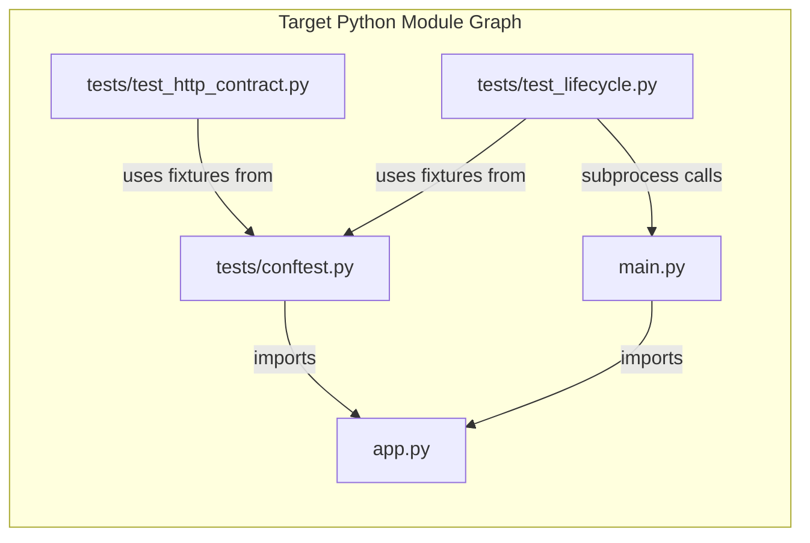

# Technical Specification

# 0. Agent Action Plan

## 0.1 Intent Clarification

### 0.1.1 Core Refactoring Objective

Based on the prompt, the Blitzy platform understands that the refactoring objective is to **perform a full technology stack migration** of the `hello_world` project (hao-backprop-test) from a Node.js/Express 5.x implementation to an equivalent Python/Flask implementation, while preserving every externally observable behavior of the current system.

- **Refactoring type:** Tech stack migration (Node.js → Python)
- **Target repository:** Same repository — in-place replacement of JavaScript source, test, and configuration files with Python equivalents
- **Scope constraint:** The refactor is strictly a technology transition — no feature expansion, no architectural overreach, and no introduction of production-grade concerns

The specific goals, restated with enhanced clarity:

- **Replace `server.js`** (37-line Express 5.x application) with a Python module layout using Flask as the web framework, preserving the same two-route HTTP contract (`GET /` → `Hello, World!\n`, `GET /evening` → `Good evening`)
- **Preserve the project's role** as a deterministic, minimal integration test harness for Backprop and CI/CD validation — the system must remain tutorial-grade, non-production, and intentionally simple
- **Maintain startup determinism**: successful bind logs to stdout, bind failure (port conflict) logs to stderr and exits with code `1`, and importing the app module must not trigger server startup
- **Recreate the 43-test behavioral specification** (33 HTTP contract tests + 10 lifecycle tests) in Python using pytest, with equivalent assertion coverage for route bodies, status codes, content types, header suppression, 404 behavior, unsupported methods, edge cases (case-insensitive routing, trailing slashes, double slashes, query parameters, HEAD requests), and lifecycle semantics (startup, shutdown, port conflict, import safety)
- **Replace all Node.js tooling** (npm, Jest, Supertest) with Python-native equivalents (pip, pytest, Flask test client) and update project metadata and documentation accordingly

Implicit requirements surfaced by analysis:

- **Flask routing behavioral parity** requires explicit configuration: Flask is case-sensitive and strict on trailing slashes by default, whereas Express 5.x is case-insensitive and lenient — the Flask app must set `app.url_map.strict_slashes = False` and introduce a URL-normalization approach for case-insensitive path matching
- **HTTP method handling parity** requires attention: Express 5.x returns `404` for unsupported methods on defined routes, whereas Flask returns `405 Method Not Allowed` — the implementation must reconcile this difference to pass equivalent assertions
- **Header suppression**: Express requires `app.disable('x-powered-by')` to suppress framework-identifying headers; Flask does not emit an `X-Powered-By` header by default, so no explicit suppression is needed, but the tests should still assert its absence for behavioral parity
- **`//` path normalization**: Express 5.x normalizes `//` to `/` transparently, whereas Flask may redirect or 404 — explicit handling is required

### 0.1.2 Technical Interpretation

This refactoring translates to the following technical transformation strategy:

**Current Architecture (Node.js/Express 5.x):**
- Single-file application (`server.js`, 37 lines) using CommonJS modules
- Express 5.x app instance with `app.disable('x-powered-by')`, two `app.get()` route registrations, and a `require.main === module` conditional startup guard
- `module.exports = app` enables test-safe imports via Supertest
- `package.json` declares dependencies and npm scripts (`start`, `test`)
- Jest 30.3.0 + Supertest 7.2.2 provide test infrastructure with 43 tests across two files

**Target Architecture (Python/Flask):**
- Small module layout with separated concerns: `app.py` (app factory + routes), `main.py` (startup entry point)
- Flask `create_app()` factory pattern enables import-safe testing via Flask's built-in test client
- `if __name__ == "__main__":` guard replaces `require.main === module`
- `requirements.txt` declares dependencies; documented CLI commands replace npm scripts
- pytest 9.0.2 + Flask test client provide test infrastructure with equivalent coverage across two test files

**Transformation Rules:**

| Express 5.x Pattern | Python/Flask Equivalent |
|---|---|
| `const express = require('express')` | `from flask import Flask` |
| `const app = express()` | `app = Flask(__name__)` or `create_app()` factory |
| `app.disable('x-powered-by')` | Not needed — Flask has no equivalent default header |
| `app.get('/', handler)` | `@app.route('/', methods=['GET'])` |
| `res.set('Content-Type', 'text/plain')` | `flask.make_response(body)` with explicit `Content-Type` header |
| `res.send('Hello, World!\n')` | `return flask.Response('Hello, World!\n', content_type='text/plain')` |
| `if (require.main === module)` | `if __name__ == "__main__":` |
| `app.listen(port, hostname, callback)` | `app.run(host=host, port=port)` wrapped with socket error handling |
| `module.exports = app` | Module-level `app` object or `create_app()` return value |
| `process.env.HOST \|\| '127.0.0.1'` | `os.environ.get('HOST', '127.0.0.1')` |
| `parseInt(process.env.PORT, 10) \|\| 3000` | `int(os.environ.get('PORT', 3000))` |
| `console.error(...)` + `process.exit(1)` | `print(..., file=sys.stderr)` + `sys.exit(1)` |
| `request(app).get('/')` (Supertest) | `app.test_client().get('/')` (Flask test client) |
| `jest.spyOn(console, 'log')` | `capsys` fixture or `monkeypatch` in pytest |

## 0.2 Source Analysis

### 0.2.1 Comprehensive Source File Discovery

The repository is a minimal, single-purpose project with a small, well-defined file set. Every file has been inspected in full and is enumerated below.

**Current Repository Structure:**

```
/ (root)
├── server.js                              37 lines  — Sole application source (Express 5.x app)
├── package.json                           19 lines  — npm manifest, dependencies, scripts
├── package-lock.json                      (auto)    — Lockfile, deterministic dependency tree
├── jest.config.js                         22 lines  — Jest 30.x test configuration
├── README.md                              40 lines  — Developer onboarding documentation
├── __tests__/
│   ├── server.test.js                    219 lines  — 33 HTTP contract tests
│   └── server.lifecycle.test.js          141 lines  — 10 lifecycle tests
└── blitzy/
    └── documentation/
        ├── Project Guide.md                         — Delivery/completion report
        └── Technical Specifications.md              — Engineering specification
```

### 0.2.2 Source File Inventory

Every source file requiring transformation or replacement is listed below with its role, line count, and disposition in the refactoring:

| Source File | Lines | Role | Refactoring Disposition |
|---|---|---|---|
| `server.js` | 37 | Express 5.x app: routes, config, startup guard, module export | **Replace** — rewrite as `app.py` + `main.py` in Python/Flask |
| `package.json` | 19 | npm manifest: name, version, scripts, dependencies | **Replace** — rewrite as `requirements.txt` and optionally `pyproject.toml` |
| `package-lock.json` | (large) | Deterministic npm dependency tree | **Remove** — no Python equivalent needed beyond `requirements.txt` |
| `jest.config.js` | 22 | Jest test runner configuration | **Remove** — pytest uses convention-based discovery or minimal `pyproject.toml` config |
| `README.md` | 40 | Developer docs: prerequisites, setup, endpoints, license | **Update** — replace Node.js instructions with Python equivalents |
| `__tests__/server.test.js` | 219 | 33 HTTP contract tests (routes, 404s, methods, headers, edge cases) | **Replace** — rewrite as `tests/test_http_contract.py` |
| `__tests__/server.lifecycle.test.js` | 141 | 10 lifecycle tests (startup, shutdown, port conflict, export safety) | **Replace** — rewrite as `tests/test_lifecycle.py` |
| `blitzy/documentation/Project Guide.md` | — | Delivery report (documentation only) | **No change** — documentation artifact |
| `blitzy/documentation/Technical Specifications.md` | — | Engineering spec (documentation only) | **No change** — documentation artifact |

### 0.2.3 Source File Detail Analysis

**`server.js` (37 lines) — Primary Application Source:**
- Lines 1–6: Imports Express, reads `HOST` and `PORT` from environment with defaults (`127.0.0.1`, `3000`)
- Lines 8–11: Creates Express app instance, disables `X-Powered-By` header
- Lines 13–21: Two GET route handlers — `/` returns `Hello, World!\n`, `/evening` returns `Good evening`, both with explicit `text/plain` Content-Type
- Lines 23–33: Conditional startup guard (`require.main === module`), `app.listen()` with error-first callback handling `EADDRINUSE`, success logging to stdout, failure logging to stderr + `process.exit(1)`
- Line 36: `module.exports = app` for test-safe imports

**`__tests__/server.test.js` (219 lines, 33 tests) — HTTP Contract Tests:**
- `GET /` suite (4 tests): status 200, body `Hello, World!\n`, content-type `text/plain`, no `X-Powered-By`
- `GET /evening` suite (4 tests): status 200, body `Good evening`, content-type `text/plain`, no `X-Powered-By`
- `404 responses` suite (4 tests): `/nonexistent`, `/foo/bar`, `/evening/extra` return 404; no `X-Powered-By` on 404
- `Unsupported HTTP methods` suite (8 tests): POST/PUT/DELETE/PATCH on `/` and `/evening` all return 404
- `Edge cases` suite (8 tests): query params on both routes, `/Evening` and `/EVENING` case-insensitive match, HEAD on `/` and `/evening`, trailing slash `/evening/`, double slash `//`
- `X-Powered-By suppression` suite (5 tests): header absent on GET, 404, POST, and HEAD responses

**`__tests__/server.lifecycle.test.js` (141 lines, 10 tests) — Lifecycle Tests:**
- `Server startup` suite (4 tests): listening state, `127.0.0.1` binding, valid address with host/port, startup log message format
- `Server shutdown` suite (2 tests): `server.close()` stops listening, close event emitted
- `Port conflict (EADDRINUSE)` suite (2 tests): error event on port collision, Express 5.x error-first callback receives EADDRINUSE error
- `App export` suite (2 tests): exported app is defined and callable, importing does not auto-start listening

**`package.json` — Dependencies and Scripts:**
- Runtime: `express@^5.2.1` (resolved 5.2.1)
- Dev: `jest@30.3.0` (exact pin), `supertest@7.2.2` (exact pin)
- Scripts: `start` → `node server.js`, `test` → `jest --watchAll=false`

**`jest.config.js` — Test Configuration:**
- `testEnvironment: 'node'`
- `coverageDirectory: 'coverage'`
- `collectCoverageFrom: ['server.js']`
- `testMatch: ['**/__tests__/**/*.test.js']`

## 0.3 Scope Boundaries

### 0.3.1 Exhaustively In Scope

**Source transformations (files to replace or create):**
- `server.js` → replaced by `app.py` and `main.py`
- `package.json` → replaced by `requirements.txt`
- `package-lock.json` → removed (no Python equivalent needed)
- `jest.config.js` → removed (pytest convention-based discovery or minimal `pyproject.toml`)

**Test updates (files to replace):**
- `__tests__/server.test.js` → replaced by `tests/test_http_contract.py`
- `__tests__/server.lifecycle.test.js` → replaced by `tests/test_lifecycle.py`
- `tests/__init__.py` → new file (Python package marker for test discovery)
- `tests/conftest.py` → new file (shared pytest fixtures for app client)

**Configuration updates:**
- `requirements.txt` → new file (Flask, pytest dependencies)
- `pyproject.toml` → new file (optional, minimal pytest configuration)

**Documentation updates:**
- `README.md` → update prerequisites (Python 3.11+ instead of Node.js 18+), setup commands (pip instead of npm), run command (`python main.py` instead of `node server.js`), test command (`pytest` instead of `jest`)

**New Python source files:**
- `app.py` — Flask app factory with `create_app()`, route definitions, response handlers
- `main.py` — Startup entry point with `if __name__ == "__main__":` guard, socket error handling, environment configuration
- `tests/test_http_contract.py` — 33+ equivalent HTTP contract tests using Flask test client
- `tests/test_lifecycle.py` — 10+ equivalent lifecycle tests covering startup, shutdown, port conflict, import safety
- `tests/__init__.py` — Empty package marker
- `tests/conftest.py` — Shared fixtures (`client`, `app` factory)
- `requirements.txt` — Dependency manifest

**Behavioral contracts that must be preserved:**
- `GET /` → exact body `Hello, World!\n`, status 200, content-type `text/plain`
- `GET /evening` → exact body `Good evening`, status 200, content-type `text/plain`
- Undefined routes → 404 response
- Unsupported HTTP methods on defined routes → 404 response (requires Express parity handling)
- Case-insensitive route matching for `/Evening`, `/EVENING`
- Trailing slash tolerance for `/evening/`
- Double-slash normalization for `//` → root route
- Query parameter transparency on both routes
- HEAD request handling on both routes (200, text/plain, no body)
- `X-Powered-By` header absent on all responses
- Import-safe: importing the app module does not start the server
- Startup success: logs `Server running at http://{host}:{port}/` to stdout
- Startup failure (port conflict): logs error to stderr, exits with code 1
- Default host `127.0.0.1`, default port `3000`
- Environment variables `HOST` and `PORT` override defaults

### 0.3.2 Explicitly Out of Scope

The following items are explicitly excluded from this refactoring per the user's directive:

- **No database access** — no ORM, no persistent storage, no SQLite, no PostgreSQL
- **No frontend code** — no HTML templates, no CSS, no JavaScript client-side assets
- **No authentication or authorization** — no login, no tokens, no JWT, no sessions
- **No TLS/HTTPS** — no SSL certificates, no HTTPS listeners
- **No background workers** — no Celery, no task queues, no scheduled jobs
- **No cloud infrastructure** — no Docker, no Kubernetes, no AWS/GCP/Azure deployment
- **No additional routes or middleware** — no routes beyond `/` and `/evening`, no middleware beyond what is strictly needed for behavioral parity
- **No direct Backprop runtime integration** — no Backprop SDK, no API client
- **No graceful shutdown orchestration** beyond what is needed for test parity
- **No retry-on-port-conflict logic** — the server fails fast by design
- **No production features** — no structured logging, no rate limiting, no observability stacks, no health check endpoints
- **No changes to `blitzy/` documentation folder** — existing documentation artifacts remain untouched
- **No GitHub workflow changes** — per implementation rule "exit code 137 test", do not create or update any GitHub App workflow files
- **No feature expansion** — the refactored system must do exactly what the current system does, nothing more

## 0.4 Target Design

### 0.4.1 Refactored Structure Planning

The target structure preserves the project's intentionally minimal, single-service architecture while adopting Python conventions. Every file and folder is listed explicitly below — there is nothing pending or to be discovered.

**Target Architecture:**

```
Target:
/ (root)
├── app.py                                — Flask app factory, route definitions, response handlers
├── main.py                               — Startup entry point, socket error handling, env config
├── requirements.txt                      — Python dependency manifest (Flask, pytest)
├── pyproject.toml                        — Minimal project metadata and pytest configuration
├── README.md                             — Updated developer documentation (Python instructions)
├── tests/
│   ├── __init__.py                       — Package marker for pytest discovery
│   ├── conftest.py                       — Shared pytest fixtures (app factory, test client)
│   ├── test_http_contract.py             — 33+ HTTP contract tests (routes, 404s, methods, headers, edge cases)
│   └── test_lifecycle.py                 — 10+ lifecycle tests (startup, shutdown, port conflict, import safety)
└── blitzy/
    └── documentation/
        ├── Project Guide.md              — Unchanged documentation artifact
        └── Technical Specifications.md   — Unchanged documentation artifact
```

**Files removed from the Node.js implementation:**
- `server.js` — replaced by `app.py` + `main.py`
- `package.json` — replaced by `requirements.txt` + `pyproject.toml`
- `package-lock.json` — no Python equivalent needed
- `jest.config.js` — replaced by pytest config in `pyproject.toml`
- `__tests__/server.test.js` — replaced by `tests/test_http_contract.py`
- `__tests__/server.lifecycle.test.js` — replaced by `tests/test_lifecycle.py`

### 0.4.2 Web Search Research Conducted

The following research was performed to inform the target design:

- **Flask latest stable version**: Flask 3.1.3 (released February 19, 2026) — the current production-stable release, supporting Python 3.9+
- **pytest latest stable version**: pytest 9.0.2 — the current stable release with native TOML configuration support
- **Flask routing behavior**: Verified via live testing that Flask defaults differ from Express 5.x in three critical areas — case sensitivity (Flask is case-sensitive), strict slashes (Flask is strict by default), and method handling (Flask returns 405 vs Express's 404 for unsupported methods)
- **Flask trailing slash handling**: `app.url_map.strict_slashes = False` resolves trailing-slash parity with Express 5.x non-strict routing
- **Flask test client**: Flask's built-in test client (`app.test_client()`) provides Supertest-equivalent HTTP assertion capabilities without requiring external packages

### 0.4.3 Design Pattern Applications

**App Factory Pattern:**
The `create_app()` function in `app.py` encapsulates Flask app creation, configuration, and route registration. This mirrors the Express `module.exports = app` pattern by allowing the app to be imported without triggering server startup. The factory pattern is the Flask community's recommended approach for test-safe applications.

**Conditional Startup Guard:**
The `if __name__ == "__main__":` guard in `main.py` directly replaces the `require.main === module` CommonJS guard. This ensures:
- Direct execution (`python main.py`) → server starts and binds to `HOST:PORT`
- Test import (`from app import create_app`) → no side effects, no socket binding

**Environment-Driven Configuration:**
Environment variables `HOST` and `PORT` with defaults (`127.0.0.1`, `3000`) are read using `os.environ.get()` with fallback values, directly replacing `process.env` reads in Node.js.

**Socket Error Handling:**
The startup wrapper in `main.py` catches `OSError` (which includes `errno.EADDRINUSE` on port conflict) during `app.run()` and writes diagnostics to stderr before calling `sys.exit(1)`. This replaces the Express 5.x error-first callback pattern.

### 0.4.4 Key Module Responsibilities

**`app.py` — Flask Application Factory:**
- Defines `create_app()` function returning a configured Flask app
- Sets `app.url_map.strict_slashes = False` for Express-like trailing-slash tolerance
- Registers two GET route handlers:
  - `GET /` → returns `Hello, World!\n` with `Content-Type: text/plain`
  - `GET /evening` → returns `Good evening` with `Content-Type: text/plain`
- Configures Flask to match Express 5.x behavioral parity (case-insensitive routing, 404 for unsupported methods)
- Provides the module-level `app` object for import by tests and `main.py`

**`main.py` — Startup Entry Point:**
- Reads `HOST` and `PORT` from environment with defaults
- Imports the app from `app.py`
- Under `if __name__ == "__main__":` guard, starts the Flask development server
- Wraps `app.run()` in error handling that catches socket bind failures
- On success: logs `Server running at http://{host}:{port}/` to stdout
- On failure: logs `Failed to start server: {error}` to stderr, exits with code 1

**`tests/conftest.py` — Shared Test Fixtures:**
- Provides `app` fixture using `create_app()` factory
- Provides `client` fixture using `app.test_client()`
- Ensures clean, isolated test execution per test function

**`tests/test_http_contract.py` — HTTP Contract Tests (33+ tests):**
- Mirrors every test in `__tests__/server.test.js`
- Uses Flask test client for HTTP assertions
- Covers: route responses, 404 handling, unsupported methods, edge cases (case-insensitive, trailing slash, double slash, query params, HEAD), header suppression

**`tests/test_lifecycle.py` — Lifecycle Tests (10+ tests):**
- Mirrors every test in `__tests__/server.lifecycle.test.js`
- Tests startup behavior, shutdown, port conflict handling, and import safety
- Uses subprocess invocation for startup/exit-code assertions
- Uses `monkeypatch` or `capsys` for log capture

## 0.5 Transformation Mapping

### 0.5.1 File-by-File Transformation Plan

Every target file is mapped to a source file with its transformation mode and key changes. No files are left pending or undiscovered.

| Target File | Transformation | Source File | Key Changes |
|---|---|---|---|
| `app.py` | CREATE | `server.js` | Extract Express app creation, route handlers, and config into a Flask `create_app()` factory; register `GET /` and `GET /evening` routes; configure `strict_slashes=False`; add URL normalization middleware for case-insensitive routing and `//` path handling; return `text/plain` responses matching exact Express response bodies |
| `main.py` | CREATE | `server.js` | Extract startup logic from `require.main === module` block into `if __name__ == "__main__":` guard; read `HOST`/`PORT` from `os.environ.get()`; wrap `app.run()` with `OSError` handling for port-conflict diagnostics; log success to stdout and failure to stderr; call `sys.exit(1)` on bind failure |
| `requirements.txt` | CREATE | `package.json` | Translate runtime dependency `express@^5.2.1` → `flask==3.1.3`; translate dev dependencies `jest@30.3.0` + `supertest@7.2.2` → `pytest==9.0.2`; declare all pinned versions |
| `pyproject.toml` | CREATE | `jest.config.js` | Translate Jest configuration into pytest-equivalent settings under `[tool.pytest.ini_options]`; set `testpaths = ["tests"]`; set `pythonpath = ["."]`; define project metadata (name, version, description) |
| `README.md` | UPDATE | `README.md` | Replace Node.js 18+ prerequisite with Python 3.11+; replace `npm install` with `pip install -r requirements.txt`; replace `npm start` / `node server.js` with `python main.py`; replace `jest` / `npm test` with `pytest`; preserve endpoint table, license section, and project description |
| `tests/__init__.py` | CREATE | (none) | Empty file — Python package marker for pytest test discovery |
| `tests/conftest.py` | CREATE | `__tests__/server.test.js` | Translate Supertest `request(app)` pattern into Flask `app.test_client()` fixture; provide `app` fixture via `create_app()` factory; provide `client` fixture for HTTP assertions |
| `tests/test_http_contract.py` | CREATE | `__tests__/server.test.js` | Translate all 33 Jest/Supertest HTTP tests into pytest functions using Flask test client; preserve exact assertion semantics for status codes, response bodies, content-type headers, `X-Powered-By` absence, 404 behavior, unsupported method handling, and all edge cases |
| `tests/test_lifecycle.py` | CREATE | `__tests__/server.lifecycle.test.js` | Translate all 10 Jest lifecycle tests into pytest functions; use `subprocess.run()` for startup/exit-code assertions; use `monkeypatch`/`capsys` for log capture; test import safety, port conflict handling, and startup log format |

**Files to remove (Node.js artifacts no longer needed):**

| File to Remove | Reason |
|---|---|
| `server.js` | Replaced by `app.py` + `main.py` |
| `package.json` | Replaced by `requirements.txt` + `pyproject.toml` |
| `package-lock.json` | No Python equivalent needed |
| `jest.config.js` | Replaced by pytest config in `pyproject.toml` |
| `__tests__/server.test.js` | Replaced by `tests/test_http_contract.py` |
| `__tests__/server.lifecycle.test.js` | Replaced by `tests/test_lifecycle.py` |

### 0.5.2 Cross-File Dependencies

**Import statement transformations:**

The current Node.js import graph and its Python replacement:

- **FROM:** `const express = require('express');` (in `server.js`)
- **TO:** `from flask import Flask, Response` (in `app.py`)

- **FROM:** `const app = require('../server');` (in `__tests__/server.test.js` and `__tests__/server.lifecycle.test.js`)
- **TO:** `from app import create_app` (in `tests/conftest.py`)

- **FROM:** `const request = require('supertest');` (in `__tests__/server.test.js`)
- **TO:** No import needed — Flask test client is accessed via `app.test_client()` fixture

- **FROM:** `jest.spyOn(console, 'log')` (in `__tests__/server.lifecycle.test.js`)
- **TO:** `capsys` fixture or `monkeypatch.setattr` in pytest

**Configuration dependency transformations:**

- **FROM:** `package.json` → `"main": "server.js"`, `"scripts": { "start": "node server.js", "test": "jest --watchAll=false" }`
- **TO:** `pyproject.toml` → `[tool.pytest.ini_options]` with `testpaths = ["tests"]`; CLI commands `python main.py` (start) and `pytest` (test)

- **FROM:** `jest.config.js` → `testEnvironment: 'node'`, `testMatch: ['**/__tests__/**/*.test.js']`
- **TO:** `pyproject.toml` → `[tool.pytest.ini_options]` with `testpaths = ["tests"]`

**Internal module dependency chain:**



### 0.5.3 Express-to-Flask Behavioral Parity Map

The following critical behavioral differences between Express 5.x and Flask have been verified through live testing and must be explicitly addressed in the implementation:

| Behavior | Express 5.x | Flask Default | Parity Strategy |
|---|---|---|---|
| Case-sensitive routing | Case-insensitive (default) | Case-sensitive | Set `app.url_map.converters` or add `@app.before_request` middleware to lowercase the path before routing |
| Trailing slash tolerance | Non-strict (default) | Strict (404 for `/evening/`) | Set `app.url_map.strict_slashes = False` |
| Unsupported method response | 404 Not Found | 405 Method Not Allowed | Add `@app.errorhandler(405)` that returns a 404 response |
| Double-slash `//` normalization | Normalizes to `/` (200) | Redirects (308) or 404 | Add `@app.before_request` middleware to normalize `//` to `/` |
| `X-Powered-By` header | Present by default, suppressed via `app.disable()` | Not emitted by default | No action needed; tests still assert absence |
| HEAD for GET routes | Automatic | Automatic | No action needed; Flask handles HEAD for GET routes |
| Query parameters on routes | Transparent, do not affect routing | Transparent, do not affect routing | No action needed |

### 0.5.4 Test Parity Mapping

Each of the 43 existing tests maps to a Python equivalent. The test name, assertion type, and any Flask-specific considerations are documented below:

**HTTP Contract Tests (33 tests in `server.test.js` → `test_http_contract.py`):**

| Test Group | Test Count | Key Assertions | Flask Consideration |
|---|---|---|---|
| `GET /` happy path | 4 | status 200, body `Hello, World!\n`, content-type `text/plain`, no `X-Powered-By` | Direct parity — use `client.get('/')` |
| `GET /evening` happy path | 4 | status 200, body `Good evening`, content-type `text/plain`, no `X-Powered-By` | Direct parity — use `client.get('/evening')` |
| 404 responses | 4 | `/nonexistent`, `/foo/bar`, `/evening/extra` return 404; no `X-Powered-By` on 404 | Direct parity |
| Unsupported methods on `/` | 4 | POST, PUT, DELETE, PATCH return 404 | Requires 405→404 error handler |
| Unsupported methods on `/evening` | 4 | POST, PUT, DELETE, PATCH return 404 | Requires 405→404 error handler |
| Edge cases | 8 | Query params, case-insensitive routing, HEAD, trailing slash, double slash | Requires `before_request` normalization |
| `X-Powered-By` suppression | 5 | Header absent on GET, 404, POST, HEAD | No action — Flask omits this header by default |

**Lifecycle Tests (10 tests in `server.lifecycle.test.js` → `test_lifecycle.py`):**

| Test Group | Test Count | Key Assertions | Flask Consideration |
|---|---|---|---|
| Server startup | 4 | Listening state, host binding, valid address, log message format | Use `subprocess.run(['python', 'main.py'])` or `app.run()` in a thread with socket verification |
| Server shutdown | 2 | Stop listening, close event | Verify process termination and cleanup |
| Port conflict (EADDRINUSE) | 2 | Error on port collision, error callback | Bind a socket first, then attempt `python main.py` on same port — verify stderr and exit code 1 |
| App export | 2 | App is defined and callable, importing does not auto-listen | `from app import create_app; app = create_app(); assert app is not None; assert not hasattr(app, 'listening') or similar` |

### 0.5.5 One-Phase Execution

The entire refactoring is executed by Blitzy in **one single phase**. All file creations, removals, and updates are delivered simultaneously. There is no multi-phase rollout, no staged migration, and no coexistence period between Node.js and Python artifacts.

## 0.6 Dependency Inventory

### 0.6.1 Key Packages

All packages relevant to this refactoring are enumerated below with exact names and verified versions. No placeholder versions are used.

**Current Node.js Dependencies (to be removed):**

| Registry | Package | Version | Type | Purpose |
|---|---|---|---|---|
| npm | `express` | `^5.2.1` (resolved 5.2.1) | Production | HTTP framework — sole runtime dependency |
| npm | `jest` | `30.3.0` (exact pin) | Development | Test runner, assertion library, coverage |
| npm | `supertest` | `7.2.2` (exact pin) | Development | HTTP assertion library for Express apps |

**Target Python Dependencies (to be added):**

| Registry | Package | Version | Type | Purpose |
|---|---|---|---|---|
| PyPI | `flask` | `3.1.3` | Production | HTTP framework — replaces Express 5.x |
| PyPI | `pytest` | `9.0.2` | Development | Test runner, assertion library — replaces Jest 30.x |

**Flask 3.1.3 Transitive Dependencies (automatically installed):**

| Package | Version | Role |
|---|---|---|
| `werkzeug` | `3.1.7` | WSGI utility library — Flask's HTTP engine |
| `jinja2` | `3.1.6` | Template engine (not used, but Flask dependency) |
| `markupsafe` | `3.0.3` | String escaping (Jinja2 dependency) |
| `itsdangerous` | `2.2.0` | Data signing (session cookie support) |
| `click` | `8.3.1` | CLI framework (Flask CLI support) |
| `blinker` | `1.9.0` | Signal support for Flask |

No additional runtime or development packages are needed. The Flask test client (`app.test_client()`) provides all HTTP testing capabilities, eliminating the need for a Supertest equivalent.

### 0.6.2 Dependency Manifest Files

**`requirements.txt` (new file):**

The dependency manifest replaces `package.json` for dependency declaration. Exact version pinning ensures deterministic installs, mirroring the exact-pin strategy used for Jest and Supertest in the Node.js project.

```
flask==3.1.3
pytest==9.0.2
```

**`pyproject.toml` (new file — project metadata and test config):**

This file replaces both `package.json` metadata and `jest.config.js` test configuration. It provides minimal project metadata and pytest settings.

```toml
[project]
name = "hello_world"
version = "1.0.0"
description = "Hello world in Python"
requires-python = ">=3.11"

[tool.pytest.ini_options]
testpaths = ["tests"]
pythonpath = ["."]
```

### 0.6.3 Import Refactoring

**Files requiring import updates:**

All import changes are localized to the newly created Python files. No existing files beyond `README.md` require import corrections since the entire Node.js module system is being replaced wholesale.

| Target File | Import Statements |
|---|---|
| `app.py` | `from flask import Flask, Response, make_response` |
| `main.py` | `import os`, `import sys`, `from app import create_app` |
| `tests/conftest.py` | `import pytest`, `from app import create_app` |
| `tests/test_http_contract.py` | (uses fixtures from `conftest.py` — no direct imports needed beyond `pytest`) |
| `tests/test_lifecycle.py` | `import subprocess`, `import socket`, `import pytest`, `from app import create_app` |

**Import transformation rules:**

| Old Pattern (Node.js) | New Pattern (Python) | Applied To |
|---|---|---|
| `const express = require('express')` | `from flask import Flask` | `app.py` |
| `const app = require('../server')` | `from app import create_app` | `tests/conftest.py` |
| `const request = require('supertest')` | (not needed — use `app.test_client()`) | `tests/conftest.py` |
| `process.env.HOST \|\| '127.0.0.1'` | `os.environ.get('HOST', '127.0.0.1')` | `main.py` |
| `parseInt(process.env.PORT, 10) \|\| 3000` | `int(os.environ.get('PORT', 3000))` | `main.py` |

### 0.6.4 External Reference Updates

| File | Update Required |
|---|---|
| `README.md` | Replace Node.js prerequisites, npm commands, and `node server.js` references with Python equivalents |
| `pyproject.toml` | New file — replaces `package.json` metadata and `jest.config.js` configuration |
| `requirements.txt` | New file — replaces `package.json` dependency declarations |

No CI/CD files, build files, or infrastructure files exist in the current repository and none are being added.

## 0.7 Refactoring Rules

### 0.7.1 Refactoring-Specific Rules

The following rules are explicitly emphasized by the user and must be honored throughout the implementation:

- **Maintain all public HTTP contracts**: The two endpoints (`GET /`, `GET /evening`) must return identical response bodies, status codes, and content-type headers as the current Express implementation
- **Preserve all existing functionality exactly as-is**: No behavioral changes beyond what is strictly required for the technology transition from Node.js to Python
- **Preserve startup determinism**: Successful bind logs to stdout; bind failure logs to stderr and exits with code 1; import does not trigger server startup
- **Preserve localhost-only default binding**: `HOST` defaults to `127.0.0.1`, `PORT` defaults to `3000`
- **Preserve import-safe testability**: The app module can be imported by test files without triggering socket binding
- **Preserve the spirit of the 43-test coverage**: All behavioral assertions from the current test suite must be recreated in Python with equivalent rigor — do not reduce scope
- **Keep the system intentionally simple**: The refactored codebase must remain tutorial-grade, non-production, and easy to inspect
- **Maintain the project's role as a Backprop integration test harness**: The system's value is its deterministic behavior, not its functionality

### 0.7.2 Special Instructions and Constraints

- **Minimal change clause**: Make only the changes that are absolutely necessary to implement the technology transition. Do not enhance, optimize, or expand the codebase beyond the requirements of the migration.
- **Isolate new implementations**: All Python source files are new and self-contained. No Node.js code is modified — it is replaced.
- **No GitHub workflow changes**: Per the user's implementation rule "exit code 137 test", do not make any updates or changes in GitHub App to create or update a workflow.
- **No production features**: Do not introduce databases, persistent storage, authentication, TLS/HTTPS, graceful shutdown orchestration (beyond test parity), retry-on-port-conflict logic, extra routes, or middleware unless absolutely necessary to preserve existing behavior.
- **No direct Backprop integration**: Do not add a Backprop SDK or API client. The system's integration surface remains its code structure, startup behavior, exit codes, and HTTP responses.
- **Document all technology-specific changes with clear comments**: Python source files should include concise comments explaining the Flask equivalent of each Express pattern, aiding future maintainers in understanding the technology mapping.

### 0.7.3 Express-to-Flask Behavioral Parity Rules

Based on the live testing conducted during analysis, the following behavioral adjustments are required to achieve exact parity with Express 5.x:

- **Case-insensitive routing**: Flask must be configured to match `/Evening` and `/EVENING` to the `/evening` route. This requires a `@app.before_request` hook or URL map customization that lowercases the request path before routing.
- **Trailing slash tolerance**: Flask must accept `/evening/` and serve the same response as `/evening`. This requires setting `app.url_map.strict_slashes = False`.
- **405 → 404 conversion**: Flask must return 404 (not 405) for unsupported HTTP methods on defined routes (POST, PUT, DELETE, PATCH on `/` and `/evening`). This requires a `@app.errorhandler(405)` that converts the response to a 404.
- **Double-slash normalization**: Flask must normalize `//` to `/` and serve the root route response. This requires a `@app.before_request` hook that collapses consecutive slashes.
- **Header suppression**: While Flask does not emit `X-Powered-By` by default, the `Server` header should be reviewed to ensure no unnecessary framework-identifying headers are present in the response, consistent with the current Express implementation's `app.disable('x-powered-by')`.

### 0.7.4 User-Provided Rules Summary

| Rule | Source | Enforcement |
|---|---|---|
| Minimal change — only what is necessary for the transition | User prompt, Minimal Change Clause | All code changes limited to technology migration |
| Preserve existing functionality exactly as-is | User prompt, System Boundaries | Every behavioral assertion from the 43-test suite recreated |
| Do not modify code not directly impacted by the transition | User prompt, Refactor Discipline | No `blitzy/` documentation changes, no workflow changes |
| Do not enhance or optimize beyond migration requirements | User prompt, Refactor Discipline | No new features, no performance optimization, no production features |
| Isolate new implementations in dedicated files | User prompt, Refactor Discipline | All Python files are new; Node.js files are replaced, not modified |
| Document technology-specific changes with clear comments | User prompt, Refactor Discipline | Python source includes mapping comments |
| No GitHub workflow changes | User implementation rule | No `.github/` files created or modified |

## 0.8 References

### 0.8.1 Repository Files and Folders Searched

The following files and folders were systematically retrieved and analyzed to derive all conclusions in this Agent Action Plan:

| Path | Type | Purpose of Inspection |
|---|---|---|
| `/` (root) | Folder | Repository structure discovery — identified all 7 top-level entries |
| `server.js` | File | Full source analysis — 37 lines, all Express patterns, routes, config, startup guard |
| `package.json` | File | Dependency manifest — runtime (`express@^5.2.1`) and dev (`jest@30.3.0`, `supertest@7.2.2`) deps, scripts |
| `jest.config.js` | File | Test configuration — environment, coverage scope, test discovery patterns |
| `README.md` | File | Documentation — prerequisites, setup commands, endpoint table, license |
| `__tests__/` | Folder | Test suite discovery — identified 2 test files |
| `__tests__/server.test.js` | File | Full source analysis — 219 lines, 33 HTTP contract tests, all assertions cataloged |
| `__tests__/server.lifecycle.test.js` | File | Full source analysis — 141 lines, 10 lifecycle tests, all assertions cataloged |
| `blitzy/` | Folder | Documentation folder — confirmed no runtime code, only project documentation |
| `blitzy/documentation/` | Folder | Documentation children — confirmed Project Guide and Technical Specifications presence |

### 0.8.2 Technical Specification Sections Retrieved

The following sections from the existing Technical Specification document were retrieved to provide additional context:

| Section | Key Information Derived |
|---|---|
| 1.1 Executive Summary | Project purpose (Backprop test harness), 43-test suite, single-file architecture, stakeholder roles |
| 3.2 Programming Languages | JavaScript/Node.js as sole language, CommonJS module system, Node.js ≥ 18 requirement |
| 3.3 Frameworks & Libraries | Express 5.2.1 API surface, Jest 30.3.0 features, Supertest 7.2.2 integration pattern |
| 5.2 Component Details | Express app instance, environment configuration, route handlers, server lifecycle manager, test architecture |
| 9.1 Additional Technical Information | `require.main === module` guard pattern, environment variable reference, feature catalog, version matrix, test metrics |

### 0.8.3 Web Searches Conducted

| Search Query | Key Finding |
|---|---|
| "Flask latest stable version 2025" | Flask 3.1.3 (released February 19, 2026) is the current stable release, supporting Python 3.9+ |
| "pytest latest stable version 2025" | pytest 9.0.2 is the current stable release with native TOML configuration support |
| "Flask case insensitive routing trailing slash" | Flask is case-sensitive and strict on trailing slashes by default; `strict_slashes=False` and custom middleware needed for Express parity |

### 0.8.4 Live Verification Tests Conducted

Flask behavioral verification was performed in a Python 3.12 environment with Flask 3.1.3 installed:

| Test | Express 5.x Behavior | Flask Default Behavior | Verified |
|---|---|---|---|
| `GET /Evening` | 200 (case-insensitive) | 404 (case-sensitive) | Yes |
| `GET /evening/` | 200 (non-strict) | 404 (strict slashes) | Yes |
| `POST /` | 404 | 405 Method Not Allowed | Yes |
| `GET //` | 200 (normalized to `/`) | 308 Redirect | Yes |
| `HEAD /` | 200 | 200 | Yes |
| `X-Powered-By` header | Present unless disabled | Not emitted | Yes |
| `GET /evening/` with `strict_slashes=False` | 200 | 200 | Yes |

### 0.8.5 Attachments

No external attachments (Figma files, design documents, or supplementary materials) were provided with this project. All analysis is based on the repository contents and the user's detailed prompt.

### 0.8.6 External Reference URLs

| Resource | URL |
|---|---|
| Flask PyPI page | https://pypi.org/project/Flask/ |
| Flask official documentation | https://flask.palletsprojects.com/en/stable/ |
| Flask installation guide | https://flask.palletsprojects.com/en/stable/installation/ |
| pytest PyPI page | https://pypi.org/project/pytest/ |
| pytest documentation | https://docs.pytest.org/en/stable/ |
| pytest GitHub releases | https://github.com/pytest-dev/pytest/releases |
| Flask changelog | https://flask.palletsprojects.com/en/stable/changes/ |
| Flask GitHub releases | https://github.com/pallets/flask/releases |

