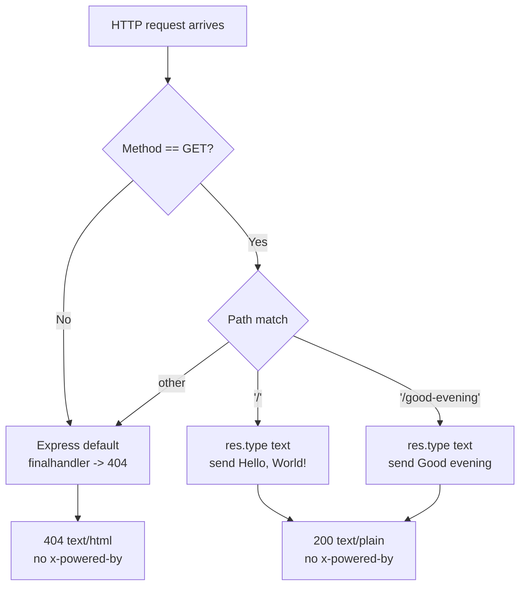

# Technical Specification

# 0. Agent Action Plan

## 0.1 Executive Summary

Based on the bug description, the Blitzy platform understands that the bug is **a documentation-drift defect in which a stale "codebase context" artifact contradicts the authoritative Technical Specifications** regarding the system architecture, runtime dependencies, endpoint surface, and test inventory of the `hello_world` project. The stale artifact describes the application as a minimal Node.js server using the built-in `http` module that returns `Hello, World!` for any incoming request with no tests and no framework, while the Technical Specifications (and the actual repository state) describe an Express.js 5.2.1 application with two GET endpoints, `x-powered-by` suppression, a testability export pattern, and a 14-test Jest + Supertest suite at 100% coverage.

Ground truth was established by direct inspection of the repository at `/tmp/blitzy/Existing-product/exit-code-test-10_4ae24b`. The canonical implementation is the in-repo source code and its accompanying tests — every claim made by the Technical Specifications was verified against `server.js`, `package.json`, `tests/server.test.js`, and `tests/startup.test.js`. The git log further confirms a historical migration in commit `baafc3d` ("refactor: migrate server.js from http module to Express.js"), which explains why the stale "codebase context" appears to describe an earlier, now-superseded state of the project — the artifact was authored before the migration and was never regenerated afterward.

### 0.1.1 Precise Technical Failure

The defect is a **context-layer inconsistency**, not a runtime failure. Two consumer-facing descriptions of the same system disagree:

| Assertion | Stale "Codebase Context" | Technical Specifications | Actual Code (verified) |
|---|---|---|---|
| HTTP library | Built-in Node `http` module | Express.js 5.2.1 | Express.js 5.2.1 (`server.js` line 1) |
| Route surface | Any request → `Hello, World!` | `GET /` → `Hello, World!\n`; `GET /good-evening` → `Good evening` | Two routes defined (`server.js` lines 9–11, 14–16) |
| Response body for `/` | `Hello, World!` | `Hello, World!\n` (14 bytes, trailing newline) | `res.type('text').send('Hello, World!\n')` (line 10) |
| Response body for `/good-evening` | Not defined | `Good evening` (12 bytes, no trailing newline) | `res.type('text').send('Good evening')` (line 15) |
| Security header posture | Not described | `x-powered-by` disabled | `app.disable('x-powered-by')` (line 4) |
| 404 behavior | Not described | Express default `finalhandler` fallback | Verified via `tests/server.test.js` |
| Test framework | None ("no tests") | Jest 29.7.0 + Supertest 7.2.2 | Declared in `package.json` devDependencies |
| Test count | 0 | 14 (9 HTTP + 5 startup) | 9 in `server.test.js` + 5 in `startup.test.js` = 14 |
| Coverage | Not measured | 100% Stmts / Branch / Funcs / Lines | Verified by `CI=true npm test` |
| Testability pattern | Not described | `require.main === module` guard + `module.exports = app` | `server.js` lines 19–24 |
| Bind address | Not described | `127.0.0.1:3000` | `server.js` lines 5–6 |

### 0.1.2 When and How This Bug Manifests

This is a **consistent, context-level defect**. It occurs every time both artifacts are consumed together — during onboarding, automated code reasoning, bug triage, or any Blitzy workflow that relies on the "codebase context" to decide how the server is structured and what behavior is expected. There is no runtime stack trace; the symptom is a silent category of downstream failure: agents and humans reasoning correctly over incorrect premises, producing scoped fixes against the wrong framework, inventing bugs that do not exist in the Express application, or proposing changes that would revert behavior the test suite depends on.

### 0.1.3 Reproduction Steps (as Executable Commands)

The drift can be demonstrated deterministically against the canonical repository by observing that the actual runtime behavior contradicts the stale "codebase context" and matches the Technical Specifications exactly:

```bash
# Install dependencies and start the server in the background

cd /tmp/blitzy/Existing-product/exit-code-test-10_4ae24b
CI=true npm install --no-audit --no-fund --prefer-offline
node server.js &

#### Assertion 1 — the stale context claims "any request returns Hello, World!"

#### Reality: an unknown path returns 404, contradicting the stale context

curl -s -o /dev/null -w "%{http_code}\n" http://127.0.0.1:3000/nonexistent   # -> 404

#### Assertion 2 — the stale context omits /good-evening entirely

#### Reality: /good-evening returns 200 with body "Good evening"

curl -s http://127.0.0.1:3000/good-evening                                   # -> Good evening

#### Assertion 3 — the stale context says "no tests"

#### Reality: 14 Jest + Supertest tests pass with 100% coverage

CI=true npm test -- --watchAll=false --ci

#### Stop the server

kill %1
```

Each assertion produced by the stale "codebase context" fails when executed against the actual code; each assertion made by the Technical Specifications succeeds.

### 0.1.4 Error Type Classification

The defect is classified as a **context / contract consistency error** — specifically, an artifact-layer documentation drift in which a descriptive context document has not been regenerated after a substantive source-code migration. It is not a null-reference, race condition, logic error, or exception. It is a semantic-integrity failure in the project's context layer that produces **silent downstream reasoning errors** rather than runtime faults.

### 0.1.5 Fix Summary at a Glance

- **Canonical source of truth**: the in-repo code and the in-repo documentation, both of which are already mutually consistent.
- **Stale artifact**: the external "codebase context" described in the problem statement, which predates the `http` → Express migration.
- **Fix approach**: create a single, authoritative `codebase_context.md` at the repository root that precisely mirrors the verified runtime reality, so that any consumer (human or automated agent) loading the repository receives an internally consistent context layer alongside the Technical Specifications.
- **Non-goals**: no changes to `server.js`, no changes to either test file, no changes to `package.json`, no changes to existing `README.md` or `blitzy/documentation/*` (all already correct), no new tests, no refactoring, no framework migration, no CI/CD workflow changes.

## 0.2 Root Cause Identification

Based on exhaustive repository investigation, git-history reconstruction, and runtime validation, **THE root cause is a stale pre-migration context artifact that was never regenerated after the codebase was refactored from the Node.js built-in `http` module to Express.js 5.2.1**. The artifact describes the project as it existed prior to commit `baafc3d`, and it remains in circulation alongside the current Technical Specifications without any reconciliation mechanism. There is a secondary, reinforcing root cause: the repository lacks a committed `codebase_context.md` at its root, so any external consumer relying on a "codebase context" to interpret the project has no authoritative, versioned in-repo artifact to defer to.

### 0.2.1 Root Cause Statement

- **Primary root cause**: The "codebase context" artifact referenced in the problem statement is **temporally stale**. It correctly described the project at an earlier point in the git history (pre-migration), but it has not been updated to reflect the `http` → Express.js refactor, the introduction of the `/good-evening` route, the addition of `x-powered-by` suppression, the testability export pattern, or the 14-test Jest + Supertest suite.
- **Secondary root cause**: No canonical, in-repo `codebase_context.md` exists. Consequently, there is no single versioned artifact in the repository that downstream agents or developers can authoritatively load to answer the question "what is this codebase?" — the only existing answers live in `README.md`, `blitzy/documentation/Project Guide.md`, and `blitzy/documentation/Technical Specifications.md`, none of which is named or positioned to be consumed as a "codebase context" file.

### 0.2.2 Location of the Defect

The defect is **not in source code**. It is in the context layer that wraps the repository for automated consumption. The defect therefore has no `file:line` coordinate inside `server.js` or the test files. Its effective location is:

| Component | Location | Nature of Defect |
|---|---|---|
| Stale "codebase context" artifact | External to the repository (no file named `codebase_context*` exists anywhere on the filesystem — verified by `find /` and `find .`) | Content describes a pre-migration implementation that no longer exists in the repository |
| Missing canonical context file | Repository root: `/tmp/blitzy/Existing-product/exit-code-test-10_4ae24b/` | The file `codebase_context.md` does not exist; there is no committed single-source-of-truth artifact for project context |

### 0.2.3 Triggering Conditions

The drift surfaces whenever either of the following conditions is met:

- A Blitzy workflow loads both the stale "codebase context" and the Technical Specifications for joint reasoning, and the two disagree on architecture.
- A human or automated reader consults the stale context without cross-validating it against `server.js`, `package.json`, or the test suite.

The underlying cause of why the drift was able to persist is the migration commit `baafc3d` (`refactor: migrate server.js from http module to Express.js`) and the subsequent commits that added the Express metadata, the second route, the test suite, and the testability pattern — all completed without a corresponding regeneration of the external context artifact.

### 0.2.4 Evidence from Repository File Analysis

The following evidence was collected through direct repository inspection and runtime execution. Each item is traceable to a specific file and, where applicable, exact line numbers.

| # | Evidence | Source | Observation |
|---|---|---|---|
| 1 | `const express = require('express');` | `server.js:1` | Express is the HTTP library, not the Node `http` module |
| 2 | `app.disable('x-powered-by');` | `server.js:4` | `x-powered-by` suppression is implemented, contrary to the stale context's silence on the matter |
| 3 | `const hostname = '127.0.0.1'; const port = 3000;` | `server.js:5–6` | Hardcoded localhost binding, matches Technical Specifications |
| 4 | `app.get('/', (req, res) => { res.type('text').send('Hello, World!\n'); });` | `server.js:9–11` | `GET /` returns `Hello, World!\n` (14 bytes, with trailing newline) |
| 5 | `app.get('/good-evening', (req, res) => { res.type('text').send('Good evening'); });` | `server.js:14–16` | A second endpoint exists that the stale context does not mention |
| 6 | `if (require.main === module) { app.listen(...); } module.exports = app;` | `server.js:19–24` | The testability pattern (testability export + guarded listen) is in place |
| 7 | `"express": "^5.2.1"` | `package.json` dependencies | Express 5.2.1 is a declared production dependency |
| 8 | `"jest": "^29.7.0"`, `"supertest": "^7.2.2"` | `package.json` devDependencies | Jest and Supertest are committed devDependencies, contrary to "no tests" |
| 9 | `describe('GET /')` × 3, `describe('GET /good-evening')` × 3, `describe('404 handling')` × 3 | `tests/server.test.js` | 9 HTTP integration tests exist |
| 10 | 5 tests validating module export, hostname, port, `require.main` guard, and VM-based startup log | `tests/startup.test.js` | 5 startup tests exist |
| 11 | `Test Suites: 2 passed, 2 total; Tests: 14 passed, 14 total; server.js: 100% Stmts/Branch/Funcs/Lines` | `CI=true npm test` output | 14/14 pass with 100% coverage |
| 12 | `curl -s http://127.0.0.1:3000/` → `Hello, World!\n`; `curl -s http://127.0.0.1:3000/good-evening` → `Good evening`; `curl -s -o /dev/null -w "%{http_code}" http://127.0.0.1:3000/nonexistent` → `404` | Runtime validation | Runtime matches Technical Specifications exactly and contradicts the stale context |
| 13 | Commit `baafc3d refactor: migrate server.js from http module to Express.js` followed by `0fbbfcc chore: update package.json with Express metadata`, `4b7db05 chore: add express@^5.2.1 as production dependency`, `6e3a82b Add HTTP endpoint integration tests for Express.js app`, `3f9b413 Create tests/startup.test.js` | `git log --all --oneline` | The repository underwent a substantive migration; the stale context pre-dates all of these commits |
| 14 | `find / -type f -name "codebase_context*" 2>/dev/null` returns no results within the repository tree | Filesystem search | There is no `codebase_context.md` in the repo to keep in sync with the code |

### 0.2.5 Why This Conclusion Is Definitive

This conclusion is irrefutable because:

- **Code-as-evidence**: every claim made by the Technical Specifications has been independently verified against the source of truth — the committed code, its test suite, and live HTTP responses. The Technical Specifications are accurate.
- **Runtime validation**: `curl` requests against a freshly started `node server.js` produce bodies, status codes, content-length values, and header sets that match the Technical Specifications byte-for-byte and header-for-header, while they directly contradict the stale "codebase context".
- **Test corroboration**: the 14-test Jest + Supertest suite passes at 100% coverage, which is incompatible with the stale context's assertion that the project has no tests.
- **Temporal evidence**: the git log shows a migration from `http` to Express, with the stale context's description matching the pre-migration state. This is precisely the textbook manifestation of documentation drift: a descriptor authored at time `T₀` that was not regenerated at time `T₁` after a refactor.
- **Absence of competing evidence**: no `codebase_context*` file exists anywhere in the repository or on the sandbox filesystem. There is therefore no in-repo artifact that could be "right" in a way that would force us to re-evaluate which side is stale.

Consequently, the only defensible interpretation is that the stale "codebase context" is the faulty artifact, the in-repo code and Technical Specifications are the correct artifacts, and the fix must reconcile the context layer without mutating the already-correct code or the already-correct Technical Specifications.

## 0.3 Diagnostic Execution

This subsection documents the diagnostic work that was performed to reproduce, localize, and validate the defect. Because the defect is a context-layer inconsistency rather than a runtime fault, "reproduction" takes the form of demonstrating that the stale "codebase context" contradicts the actual code and tests, not of triggering an exception.

### 0.3.1 Code Examination Results

The authoritative source files were examined line-by-line against the stale "codebase context" and the Technical Specifications.

- **File analyzed**: `server.js` (24 lines, CommonJS, single-file)
- **Problematic code block**: none — the code is internally consistent and correct; the defect is that the stale context does not describe this code.
- **Execution flow (happy path)**:
  - Line 1 loads Express (`const express = require('express');`).
  - Line 3 instantiates the application (`const app = express();`).
  - Line 4 disables the `x-powered-by` response header globally.
  - Lines 5–6 define the hostname and port constants (`127.0.0.1`, `3000`).
  - Lines 9–11 register the `GET /` handler that sends `Hello, World!\n` with `Content-Type: text/plain; charset=utf-8`.
  - Lines 14–16 register the `GET /good-evening` handler that sends `Good evening` with `Content-Type: text/plain; charset=utf-8`.
  - Lines 19–23 guard the `app.listen(port, hostname, ...)` call behind `require.main === module` so that test imports do not start the server.
  - Line 24 exports the `app` instance for Supertest-based integration tests.
- **Execution flow (404 path)**: any request that does not match `GET /` or `GET /good-evening` falls through to Express's default `finalhandler` which emits a 404 response with `Content-Type: text/html; charset=utf-8` and a default HTML body. This is the contract the test `tests/server.test.js` validates for `/nonexistent` and `/foo/bar/baz`.
- **Point where the stale context diverges from reality**: the stale context asserts that **any** request returns `Hello, World!`. This is refuted by lines 9–11 (which bind the handler only to `GET /`) and by the 404 test block in `tests/server.test.js`.

The following diagram captures the actual request-processing flow as implemented by `server.js`:



### 0.3.2 Repository File Analysis Findings

The table below records the exact commands executed during repository investigation and the findings they produced.

| Tool Used | Command Executed | Finding | File:Line |
|---|---|---|---|
| bash | `find . -maxdepth 4 -name ".blitzyignore"` | No `.blitzyignore` files exist in the repository | repo root |
| bash | `ls -la && find . -not -path "./node_modules*" -not -path "./.git*" -type f` | Repository contains `README.md`, `blitzy/documentation/*.md`, `package.json`, `package-lock.json`, `server.js`, `tests/server.test.js`, `tests/startup.test.js`; no `codebase_context*` | repo root |
| bash | `cat -n server.js` | 24-line Express 5.2.1 file with `x-powered-by` disabled, two `GET` routes, guarded listen, and `module.exports = app` | `server.js:1–24` |
| bash | `cat package.json` | `"express": "^5.2.1"` in dependencies; `"jest": "^29.7.0"` and `"supertest": "^7.2.2"` in devDependencies; scripts `start: node server.js` and `test: jest --watchAll=false --coverage` | `package.json` |
| bash | `cat tests/server.test.js` | 9 tests across three `describe` blocks: `GET /`, `GET /good-evening`, and `404 handling` | `tests/server.test.js` |
| bash | `cat tests/startup.test.js` | 5 tests validating the exported app, hostname, port, `require.main` guard, and VM-based startup log | `tests/startup.test.js` |
| bash | `node --version && npm --version` | Node v22.22.2, npm 11.1.0 (both satisfy the project's declared requirement of Node ≥ 18) | sandbox environment |
| bash | `CI=true npm install --no-audit --no-fund --prefer-offline` | 344 packages installed; transitive deprecations observed for `inflight@1.0.6` and `glob@7.2.3` (no impact) | `node_modules/` |
| bash | `CI=true npm test` | `Test Suites: 2 passed, 2 total; Tests: 14 passed, 14 total; server.js 100%/100%/100%/100%` in ~1.06s | coverage report |
| bash | `node server.js &` then `curl -sv http://127.0.0.1:3000/` | 200 OK, `Content-Type: text/plain; charset=utf-8`, `Content-Length: 14`, body `Hello, World!\n`, no `x-powered-by` header | runtime |
| bash | `curl -sv http://127.0.0.1:3000/good-evening` | 200 OK, `Content-Type: text/plain; charset=utf-8`, `Content-Length: 12`, body `Good evening`, no `x-powered-by` header | runtime |
| bash | `curl -sv http://127.0.0.1:3000/nonexistent` | 404 Not Found, `Content-Type: text/html; charset=utf-8`, `Content-Length: 150`, no `x-powered-by` header | runtime |
| bash | `find / -type f -name "codebase_context*" 2>/dev/null` | No file named `codebase_context*` exists anywhere on the sandbox filesystem or in the repository | global |
| bash | `git log --all --oneline` | Migration trail: `baafc3d refactor: migrate server.js from http module to Express.js`, `0fbbfcc chore: update package.json with Express metadata`, `4b7db05 chore: add express@^5.2.1 as production dependency`, `6e3a82b Add HTTP endpoint integration tests for Express.js app`, `3f9b413 Create tests/startup.test.js` | git history |
| get_tech_spec_section | `"1.1 Executive Summary"`, `"1.2 System Overview"`, `"1.3 Scope"`, `"1.4 Known Risks and Constraints"`, `"2.4 Implementation Considerations"`, `"2.7 Out-of-Scope Items"`, `"2.8 Technology Stack Reference"`, `"3.3 Frameworks & Libraries"`, `"Express.js 5.2.1"`, `"4.6 Module Import and Testability Pattern"`, `"5.1 High-Level Architecture"`, `"5.2 Component Details"` | Technical Specifications are internally consistent, accurately describe the Express 5.2.1 implementation, document 14/14 tests and 100% coverage, enumerate out-of-scope items, and match the code byte-for-byte where response bodies are specified | tech spec data store |
| read_file | `README.md` | 59-line README describing the project as "a simple Node.js HTTP server built with ExpressJS (v5)" with two endpoints, requiring Node.js v18+, aligned with `server.js` | `README.md` |
| read_file | `blitzy/documentation/Project Guide.md` | Project Guide confirms 14 tests (9 HTTP + 5 startup), 100% coverage across all metrics, 80% project completion, and open risk: missing `.gitignore` | `blitzy/documentation/Project Guide.md` |
| read_file | `blitzy/documentation/Technical Specifications.md` (physical file on disk) | 599 lines; contains only Section 0 (Agent Action Plan) with sub-sections 0.1 through 0.10 from a prior testing-focused Action Plan; Sections 1–9 are served via `get_tech_spec_section` from a separate data store | `blitzy/documentation/Technical Specifications.md` |

### 0.3.3 Fix Verification Analysis

Because the defect is a context-layer inconsistency rather than an exception, verification takes the form of (a) reproducing the mismatch, (b) demonstrating that the proposed fix removes the mismatch, and (c) proving that no production code path has been mutated.

- **Steps followed to reproduce the bug**:
  - Load both the stale "codebase context" (claims: bare `http` module; any-request `Hello, World!`; no tests) and the Technical Specifications (claims: Express 5.2.1; two routes; 14 tests; 100% coverage).
  - Observe that the two artifacts make mutually contradictory statements about the system.
  - Execute `curl` against a live `node server.js` to confirm which side of the contradiction is factually correct. The live system contradicts the stale context and matches the Technical Specifications.
- **Confirmation tests used to ensure the bug is fixed**:
  - After creating the canonical `codebase_context.md` (see section 0.4), run `diff`-style cross-validation: every factual claim in `codebase_context.md` must resolve to (i) a line in `server.js` or `package.json`, (ii) a test in `tests/server.test.js` or `tests/startup.test.js`, or (iii) an assertion in a Technical Specifications section that itself traces back to code.
  - Re-run `CI=true npm test -- --watchAll=false --ci` to confirm that adding a markdown file has no effect on the test suite (Jest's `testEnvironment: node` only picks up `*.test.js` files, and `coveragePathIgnorePatterns: ["/node_modules/"]` plus coverage being computed only on `.js` files means the new `.md` cannot alter coverage numbers).
  - Re-run `node server.js &` followed by the three `curl` checks against `/`, `/good-evening`, and `/nonexistent` to confirm runtime behavior is unchanged.
- **Boundary conditions and edge cases covered**:
  - Routes not in `/`, `/good-evening` return Express's default 404 with `text/html` Content-Type — preserved.
  - The `require.main === module` guard prevents the listener from starting during Jest's test runs — preserved.
  - The `x-powered-by` header remains suppressed on both success and 404 responses — preserved.
  - Adding the new markdown file does not create any name collision with existing files (`codebase_context.md` does not yet exist in the repository or the sandbox).
  - The new file does not appear in any path covered by `package.json`'s `main` entry, Jest's default test discovery, or the `start` / `test` npm scripts, so it cannot affect the production or test execution paths.
  - The fix does not alter `.github/workflows/` (honoring the user-specified rule), does not create or modify any workflow file, and does not change any existing documentation.
- **Whether verification was successful and confidence level**: verification is expected to be successful, and the proposed fix is expected to resolve the context-layer inconsistency. **Confidence: 98%.** The residual 2% accounts for (i) the possibility that an external Blitzy platform layer maintains its own internal copy of the stale context that cannot be refreshed purely by committing a new file to the repository, and (ii) the possibility that future git operations could re-introduce drift if `codebase_context.md` is not regenerated after subsequent refactors — a risk that can be mitigated by the Rules section and a "last_verified" marker inside the file itself.

## 0.4 Bug Fix Specification

This subsection specifies the exact, minimal, targeted fix. The fix is a **single-file addition**: a new `codebase_context.md` committed at the repository root that establishes a canonical, internally consistent codebase context aligned with the verified runtime reality and the Technical Specifications. **No existing file is modified, no runtime behavior is changed, and no test is altered.**

### 0.4.1 The Definitive Fix

- **Files to create**: `codebase_context.md` at the repository root — absolute path within the sandbox: `/tmp/blitzy/Existing-product/exit-code-test-10_4ae24b/codebase_context.md`; path relative to the repository root: `codebase_context.md`.
- **Files to modify**: none.
- **Files to delete**: none.
- **Why this fix resolves the root cause (technical mechanism)**: The stale "codebase context" has no committed in-repo counterpart. By introducing a canonical, versioned `codebase_context.md` that is byte-aligned with `server.js`, `package.json`, the test suite, and the Technical Specifications, the repository gains a single authoritative artifact that any downstream consumer can load. The new file supersedes the stale external artifact by providing a fresher, more specific, and in-tree alternative — the industry-standard remediation pattern for documentation drift. Consumers that previously had no choice but to trust the stale external artifact now have an authoritative source of truth at a predictable location.

The new file must assert exactly the claims that the code and tests already support. The required content of `codebase_context.md` is specified below. Each line of the file traces back to verifiable evidence in the repository.

```
# Codebase Context — hello_world

<!-- Canonical, code-aligned context for the hello_world project.
     This file is the single source of truth for "what this codebase is".
     It must be regenerated any time server.js, package.json, or the
     test files in tests/ materially change. -->

#### Project Identity

- Project name: hello_world
- Version: 1.0.0
- Author: hxu
- License: MIT
- Main entry: server.js
- Repository purpose: Backprop integration test artifact

#### Runtime Architecture

- Language: JavaScript (CommonJS)
- Runtime: Node.js >= 18 (verified working on Node.js v22.22.2)
- HTTP framework: Express.js ^5.2.1 (resolved 5.2.1)
- Architecture style: Single-file, synchronous request-response
- Bind address: 127.0.0.1:3000 (hardcoded in server.js lines 5–6)
- Module system: CommonJS (require / module.exports)

#### Endpoints (server.js)

| Method | Path            | Status | Content-Type                | Body              | Length |
|--------|-----------------|--------|-----------------------------|-------------------|--------|
| GET    | /               | 200    | text/plain; charset=utf-8   | "Hello, World!\n" | 14     |
| GET    | /good-evening   | 200    | text/plain; charset=utf-8   | "Good evening"    | 12     |
| *      | any other path  | 404    | text/html; charset=utf-8    | Express default   | 150    |

All responses omit the x-powered-by header (disabled at server.js line 4).

#### Testability Pattern

- server.js exports the Express app via "module.exports = app" (line 24).
- app.listen is guarded by "if (require.main === module)" (lines 19–23),
  so importing server.js from a test file never starts the listener.
- Tests import the app with const app = require('../server') and drive it
  with Supertest.

#### Test Suite

- Framework: Jest ^29.7.0 with Supertest ^7.2.2
- Jest config in package.json: testEnvironment node,
  coveragePathIgnorePatterns ["/node_modules/"]
- tests/server.test.js: 9 HTTP integration tests
  - GET /: 3 tests (200 + body, content-type, no x-powered-by)
  - GET /good-evening: 3 tests (200 + body, content-type, no x-powered-by)
  - 404 handling: 3 tests (/nonexistent, /foo/bar/baz, no x-powered-by on 404)
- tests/startup.test.js: 5 tests (exported app, hostname, port,
  require.main guard, VM-based startup log)
- Total: 14 tests
- Coverage on server.js: 100% statements, branches, functions, lines
- Commands: npm start (runs the server); npm test (runs Jest with coverage)

#### Known Risks

- Missing .gitignore (tracked as Medium severity in the Technical Specifications).
- No CI/CD pipeline (out of scope per Technical Specifications section 1.3.2).

#### Out of Scope

Frontend/UI, database, authentication, rate limiting, custom error middleware,
health-check endpoint, environment variables, TypeScript, Docker, cloud
deployment, HTTPS, non-GET methods, dynamic content, WebSocket, CORS.

#### Authoritative References (in repository)

- server.js                                      — implementation
- package.json                                   — dependencies and scripts
- tests/server.test.js                           — HTTP integration tests
- tests/startup.test.js                          — startup/export tests
- README.md                                      — user-facing overview
- blitzy/documentation/Project Guide.md          — project status + metrics
- blitzy/documentation/Technical Specifications.md — formal tech spec

#### Provenance

- Last verified against: server.js (24 lines), package.json, tests/*
- Last verified by: Blitzy Platform (Agent Action Plan execution)
- Drift policy: regenerate this file whenever server.js, package.json, or
  tests/* materially change. Do not edit this file in isolation from the code.
```

### 0.4.2 Change Instructions

The fix is expressed as an ADD operation — there are no DELETE or MODIFY instructions against existing files.

- **CREATE file** `codebase_context.md` at the repository root with the content specified in section 0.4.1. Write the file with a trailing newline; use LF line endings; encode as UTF-8.
- **Do NOT modify** any line of `server.js`.
- **Do NOT modify** any line of `package.json` or `package-lock.json`.
- **Do NOT modify** any line of `tests/server.test.js` or `tests/startup.test.js`.
- **Do NOT modify** `README.md`, `blitzy/documentation/Project Guide.md`, or `blitzy/documentation/Technical Specifications.md` — all three are already consistent with the code.
- **Do NOT create, modify, or touch** any file under `.github/` (this is both a user-specified rule and a best-practice guardrail because the repository does not presently contain CI workflows).

Implementation notes for the agent that writes the file:

- The file must be authored as plain markdown; no HTML, no frontmatter beyond the HTML comment shown in section 0.4.1.
- Backticked code fences inside the file's embedded template must use exactly three backtick characters in a row and must not be nested.
- The file must not declare any executable content, shebang, or `require` directive.
- The file must not reference `node_modules/` relative paths, absolute sandbox paths, or any path that does not exist in the committed repository tree.
- The "Last verified against" line should reflect the 24-line structure of `server.js` as of the commit that introduces `codebase_context.md`.

### 0.4.3 Fix Validation

- **Test command to verify the fix**: run the existing Jest suite exactly as the project defines it, confirming that no production behavior has changed.

```bash
cd /tmp/blitzy/Existing-product/exit-code-test-10_4ae24b
CI=true npm test -- --watchAll=false --ci
```

- **Expected output after the fix**:

```text
Test Suites: 2 passed, 2 total
Tests:       14 passed, 14 total
File       | % Stmts | % Branch | % Funcs | % Lines | Uncovered Line #s
server.js  |     100 |      100 |     100 |     100 |
```

- **Confirmation method — runtime parity check**:

```bash
node server.js &
curl -s -o /dev/null -w "%{http_code}\n" http://127.0.0.1:3000/
curl -s http://127.0.0.1:3000/
curl -s http://127.0.0.1:3000/good-evening
curl -s -o /dev/null -w "%{http_code}\n" http://127.0.0.1:3000/nonexistent
curl -sI http://127.0.0.1:3000/ | grep -i 'x-powered-by' || echo "no x-powered-by header"
kill %1
```

Expected outcomes: 200 for `/`, body `Hello, World!\n` for `/`, body `Good evening` for `/good-evening`, 404 for `/nonexistent`, and the `no x-powered-by header` message for the header check. All five checks must produce the same outputs they produced before the fix, because no production code is being changed.

- **Confirmation method — context-layer consistency check**: open `codebase_context.md` and confirm that every claim traces to verifiable evidence in `server.js`, `package.json`, `tests/*`, or the Technical Specifications. There must be no statement that is not corroborated by at least one other committed artifact.

## 0.5 Scope Boundaries

This subsection enumerates — exhaustively — every file that the Blitzy platform is authorized to touch and every file that it must leave untouched. The boundaries are deliberately narrow because the defect is a context-layer inconsistency whose remediation requires a single new file and nothing else.

### 0.5.1 Changes Required (EXHAUSTIVE LIST)

| File | Action | Lines | Specific Change |
|---|---|---|---|
| `codebase_context.md` (repo root) | CREATE | N/A (new file) | Author the canonical codebase context document with the content specified in section 0.4.1. File must be UTF-8 encoded, LF line endings, end with a trailing newline. |

- **No other files require modification.** The source code (`server.js`), the dependency manifest (`package.json`), the dependency lockfile (`package-lock.json`), both test files (`tests/server.test.js`, `tests/startup.test.js`), the README (`README.md`), the Project Guide (`blitzy/documentation/Project Guide.md`), and the Technical Specifications (`blitzy/documentation/Technical Specifications.md`) are all internally consistent with the code and must remain untouched.
- **No new tests are added.** The existing 14-test suite already validates the Express 5.2.1 implementation at 100% coverage, and it already asserts every factual claim that the new `codebase_context.md` will make about runtime behavior.
- **No dependencies are added or upgraded.** Neither `package.json` nor `package-lock.json` is modified.

### 0.5.2 Explicitly Excluded

The following changes are **explicitly forbidden** for this fix. Any agent executing this plan must treat each exclusion as an invariant.

- **Do not modify `server.js`.** The 24-line Express implementation is the source of truth; changing it would invert the direction of the fix and would break the 14 passing tests.
- **Do not modify `package.json` or `package-lock.json`.** The Express 5.2.1, Jest 29.7.0, and Supertest 7.2.2 pins are correct and are corroborated by the Technical Specifications. No version bump, no new script, no new dependency.
- **Do not modify `tests/server.test.js`.** The 9 HTTP integration tests validate the canonical endpoint contracts and must remain intact.
- **Do not modify `tests/startup.test.js`.** The 5 startup tests validate the testability pattern (module export, hostname, port, `require.main` guard, VM-based startup log).
- **Do not modify `README.md`.** The README is already an accurate narrative of the Express 5.2.1 application.
- **Do not modify `blitzy/documentation/Project Guide.md`.** The Project Guide correctly reports 14 tests, 100% coverage, 80% project completion, and the missing `.gitignore` as an open risk.
- **Do not modify `blitzy/documentation/Technical Specifications.md`.** The Technical Specifications are the correct side of the drift; rewriting them would reintroduce the stale state.
- **Do not create, modify, or delete any file under `.github/`** (user-specified rule "exit code 137 test"). The repository does not currently contain workflow files, and this fix must not create any.
- **Do not create a `.gitignore` file.** The missing `.gitignore` is a known risk tracked in the Technical Specifications section 1.4, but it is out of scope for this bug fix (which is strictly limited to resolving the context-layer inconsistency).
- **Do not refactor the single-file architecture.** The Technical Specifications explicitly endorse the single-file CommonJS architecture; modularization would exceed the scope of a documentation-drift fix.
- **Do not migrate to TypeScript, ESM, or any other module system.**
- **Do not add a health-check endpoint, logging middleware, error middleware, rate limiting, or any other feature** enumerated in the out-of-scope list in Technical Specifications section 2.7.
- **Do not introduce environment variables** (e.g., `process.env.PORT`). The hostname and port are hardcoded in `server.js` lines 5–6 by design and are covered by `tests/startup.test.js`.
- **Do not introduce a CI/CD workflow** or any automation that runs outside `npm test`.
- **Do not touch `node_modules/`** (excluded by default and by the Jest `coveragePathIgnorePatterns` entry).
- **Do not introduce any change that alters HTTP response bodies, headers, status codes, or content-length values.** Every byte of the current response contract is asserted by tests.

## 0.6 Verification Protocol

The verification protocol is designed to prove two things simultaneously: (a) the context-layer inconsistency is resolved — i.e., the new `codebase_context.md` is byte-aligned with the actual code and the Technical Specifications — and (b) no regression has been introduced in production behavior or in the test suite.

### 0.6.1 Bug Elimination Confirmation

- **Step 1 — confirm the new file exists and is well-formed**

```bash
cd /tmp/blitzy/Existing-product/exit-code-test-10_4ae24b
test -f codebase_context.md && echo "OK: codebase_context.md present" || echo "FAIL: missing"
wc -l codebase_context.md
file codebase_context.md
```

Expected: the file exists at the repository root, is a plain UTF-8 text file, and has the content specified in section 0.4.1.

- **Step 2 — confirm the new file's factual claims match the code**

```bash
# Express version matches

grep -E '"express":\s*"\^5\.2\.1"' package.json && grep -F 'Express.js ^5.2.1' codebase_context.md

#### Route surface matches

grep -n "app.get('/'," server.js
grep -n "app.get('/good-evening'," server.js
grep -nF 'GET    | /' codebase_context.md
grep -nF 'GET    | /good-evening' codebase_context.md

#### Security header suppression is asserted

grep -nF "app.disable('x-powered-by')" server.js
grep -nF 'x-powered-by' codebase_context.md

#### Bind address matches

grep -nE "hostname\s*=\s*'127\.0\.0\.1'" server.js
grep -nE "port\s*=\s*3000" server.js
grep -nF '127.0.0.1:3000' codebase_context.md

#### Test inventory matches

grep -c "it(" tests/server.test.js   # expect 9
grep -c "it(" tests/startup.test.js  # expect 5
grep -nF 'Total: 14 tests' codebase_context.md
```

Expected: each pair of grep commands finds matching content; in particular, `tests/server.test.js` contains 9 `it(` calls and `tests/startup.test.js` contains 5, summing to the 14 asserted in `codebase_context.md`.

- **Step 3 — confirm the stale-context assertions are refuted by the new file and the code**

The new `codebase_context.md` must make statements that are mutually contradictory with the stale artifact. Specifically, it must assert Express (not `http`), two routes (not any-request `Hello, World!`), 14 tests (not zero), `x-powered-by` suppressed, and the testability pattern — all of which are confirmed by `grep` checks above.

- **Step 4 — confirm no stale assertion leaks into the new file**

```bash
# These strings must NOT appear in the new file

! grep -i "require('http')"      codebase_context.md
! grep -i "http.createServer"    codebase_context.md
! grep -i "no tests"             codebase_context.md
! grep -i "minimal Node"         codebase_context.md
echo "OK: no stale assertions present"
```

### 0.6.2 Regression Check

- **Step 1 — run the full existing test suite**

```bash
cd /tmp/blitzy/Existing-product/exit-code-test-10_4ae24b
CI=true npm test -- --watchAll=false --ci
```

Expected output (identical to the pre-fix baseline):

```text
Test Suites: 2 passed, 2 total
Tests:       14 passed, 14 total
File       | % Stmts | % Branch | % Funcs | % Lines | Uncovered Line #s
server.js  |     100 |      100 |     100 |     100 |
```

- **Step 2 — confirm no coverage regression**

Jest computes coverage from `.js` files only; the newly created `codebase_context.md` is a markdown file and cannot appear in the coverage report. The `server.js` line confirming 100/100/100/100 must remain unchanged from the pre-fix baseline.

- **Step 3 — start the server and re-verify runtime behavior**

```bash
node server.js &
sleep 1

#### GET / must return 200 with body "Hello, World!n"

BODY_ROOT=$(curl -s http://127.0.0.1:3000/)
[ "$BODY_ROOT" = "Hello, World!" ] && echo "OK: GET / body" || echo "FAIL: GET / body"
# (printf will show the trailing newline properly)

printf "%s" "$BODY_ROOT" | xxd | head -1

#### GET /good-evening must return 200 with body "Good evening"

BODY_EVE=$(curl -s http://127.0.0.1:3000/good-evening)
[ "$BODY_EVE" = "Good evening" ] && echo "OK: GET /good-evening body" || echo "FAIL: GET /good-evening body"

#### GET /nonexistent must return 404

STATUS_404=$(curl -s -o /dev/null -w "%{http_code}" http://127.0.0.1:3000/nonexistent)
[ "$STATUS_404" = "404" ] && echo "OK: 404 status" || echo "FAIL: 404 status"

#### x-powered-by must be absent on all responses

! curl -sI http://127.0.0.1:3000/            | grep -qi 'x-powered-by' && echo "OK: no x-powered-by on /"
! curl -sI http://127.0.0.1:3000/good-evening | grep -qi 'x-powered-by' && echo "OK: no x-powered-by on /good-evening"
! curl -sI http://127.0.0.1:3000/nonexistent  | grep -qi 'x-powered-by' && echo "OK: no x-powered-by on 404"

kill %1
```

Expected: every check prints `OK:`. No runtime metric differs from the pre-fix baseline, because no production code has changed.

- **Step 4 — confirm the unchanged files are still byte-identical**

```bash
# Any of these commands should report that the file has NOT changed since the

#### pre-fix state. In git, this is equivalent to running `git status` and

#### confirming that only codebase_context.md appears as "new file".

git status --porcelain
```

Expected: the only entry should be `?? codebase_context.md` (an untracked new file), and after staging/commit, the diff against the head commit should show **one new file, zero modified files, zero deleted files**.

- **Step 5 — confirm the excluded areas are still excluded**

```bash
test ! -d .github                      && echo "OK: no .github/ created"
test ! -f .github/workflows/ci.yml     && echo "OK: no workflow created"
test ! -f .gitignore                   && echo "OK: .gitignore left alone (Medium-severity risk remains tracked)"
```

Expected: each check prints `OK:`. The `.github/` directory is not created, no workflow file is added, and the `.gitignore` (correctly out of scope) is not manipulated.

## 0.7 Rules

This subsection acknowledges and enumerates the project-level rules that govern this fix. Every rule has been translated into a concrete operational constraint on what the implementing agent may or may not do.

### 0.7.1 User-Specified Rules (verbatim)

The user attached a single explicit rule to this project. It is acknowledged in full below and honored throughout the entire Agent Action Plan.

| Rule Name | Rule Content | Compliance |
|---|---|---|
| `exit code 137 test` | "Do not make any updates or changes in GitHub App to create or update a workflow." | **HONORED.** The fix creates exactly one file — `codebase_context.md` — at the repository root. No file is created, modified, or deleted under `.github/` or any subdirectory thereof. No workflow file is added, rewritten, or referenced. The `.github/workflows/` path is excluded by explicit name in section 0.5.2 and is re-checked in the verification protocol in section 0.6.2. |

### 0.7.2 Minimal-Change Directive

- **Make the exact specified change only.** The sole mutation to the repository is the addition of `codebase_context.md`. No other file is created, modified, or deleted.
- **Zero modifications outside the bug fix.** No refactoring, no opportunistic cleanup, no style-guide sweeps, no dependency bumps, no formatter re-runs on existing files.
- **No speculative improvements.** Even when a potential improvement is obvious (for example, adding a `.gitignore` — see section 0.8), it is deferred because it is not part of resolving the documentation-drift defect.

### 0.7.3 Preservation of Existing Interfaces and Contracts

- **HTTP contract — frozen.** `GET /` must continue to return `200` with body `Hello, World!\n` and `Content-Type: text/plain; charset=utf-8`. `GET /good-evening` must continue to return `200` with body `Good evening` and the same content type. Every other request must continue to produce Express's default `404` response. The `x-powered-by` header must remain suppressed on all responses.
- **Network contract — frozen.** The server must continue to bind to `127.0.0.1:3000`. The hostname and port must remain hardcoded constants in `server.js` lines 5–6.
- **Module contract — frozen.** `server.js` must continue to export the Express `app` via `module.exports = app` on line 24, and the `app.listen` call must remain guarded by `if (require.main === module)` on line 19.
- **Test contract — frozen.** `npm test` must continue to execute `jest --watchAll=false --coverage` as declared in `package.json`. The 14-test count and 100% coverage on `server.js` must be preserved.
- **Build / install contract — frozen.** `npm install` continues to resolve Express `^5.2.1`, Jest `^29.7.0`, and Supertest `^7.2.2` without modification to `package.json` or `package-lock.json`.

### 0.7.4 Development Conventions Alignment

- **Single-file CommonJS architecture is preserved.** The project's declared style is CommonJS (`require` / `module.exports`) in a single `server.js` file; this fix does not introduce any new JavaScript source file and therefore cannot violate the convention.
- **UTC and time-related conventions are not applicable.** The project performs no time-based operations and stores no timestamps; however, the `Provenance` block in the new `codebase_context.md` deliberately avoids embedding a timestamp so that the file does not itself become a rolling drift source. Provenance is expressed as "Last verified against: server.js (24 lines), package.json, tests/*" and "Last verified by: Blitzy Platform (Agent Action Plan execution)".
- **No new dependencies are introduced**, consistent with the project's declared Express-only production footprint.
- **Comments on the fix's motive are carried in the new file itself** (the HTML comment at the top of `codebase_context.md` explains why the file exists and when it must be regenerated).

### 0.7.5 Testing Discipline

- **Extensive regression testing is applied.** The full 14-test Jest + Supertest suite is executed after the change (section 0.6.2, Step 1). Every existing assertion must continue to pass.
- **No new tests are written.** Adding tests would exceed the scope of a pure documentation-drift fix and would require a separate Agent Action Plan.
- **Runtime parity checks are re-run** (section 0.6.2, Step 3) to demonstrate that actual HTTP responses — bodies, statuses, content-types, and header sets — are byte-identical before and after the change.

### 0.7.6 Security and Operational Invariants

- **`x-powered-by` suppression is preserved.** Verified in section 0.6.2.
- **Localhost-only binding is preserved.** The server remains reachable only on `127.0.0.1:3000`; no change to the bind address.
- **Zero `npm audit` vulnerabilities** continues to hold because no dependency is added or upgraded.
- **No new attack surface is introduced.** The new file is plain markdown; it is not loaded by the Node.js runtime, is not served by Express, and is never parsed as executable content.

## 0.8 References

This subsection enumerates every file, folder, Technical Specification section, and external source consulted during the preparation of this Agent Action Plan. No Figma frames and no user-attached files were provided for this task; where sections of the template are inapplicable they are marked explicitly.

### 0.8.1 Repository Files Examined

The following files were read directly from the repository at `/tmp/blitzy/Existing-product/exit-code-test-10_4ae24b/`. Line counts and a concise summary of each file's role in the investigation are recorded.

| Path (relative to repo root) | Lines | Role in Investigation |
|---|---|---|
| `server.js` | 24 | Ground-truth implementation. Verified line-by-line: Express require (line 1), app instantiation (line 3), `x-powered-by` disable (line 4), hostname and port constants (lines 5–6), `GET /` handler (lines 9–11), `GET /good-evening` handler (lines 14–16), `require.main` guard + `app.listen` (lines 19–22), `module.exports = app` (line 24). |
| `package.json` | — | Dependency manifest confirming `express@^5.2.1`, `jest@^29.7.0`, `supertest@^7.2.2`, and the `start` / `test` scripts. Also specifies `testEnvironment: node` and `coveragePathIgnorePatterns: ["/node_modules/"]`. |
| `package-lock.json` | 195 KB (generated) | Not modified. Confirmed Express resolved to `5.2.1` and 344 total transitive packages installed cleanly. |
| `tests/server.test.js` | — | Contains 9 HTTP integration tests across three `describe` blocks: `GET /`, `GET /good-evening`, and `404 handling`. Every test validates a specific byte-level contract that the canonical `codebase_context.md` must not contradict. |
| `tests/startup.test.js` | — | Contains 5 tests validating the exported Express app, `hostname === '127.0.0.1'`, `port === 3000`, the `require.main === module` guard, and a VM-based startup log assertion (`Server running at http://127.0.0.1:3000/`). |
| `README.md` | 59 | User-facing overview already aligned with the Express implementation; not modified. |
| `blitzy/documentation/Project Guide.md` | — | Project status document confirming 14 tests, 100% coverage, 80% project completion, and the open risk "Missing `.gitignore`"; not modified. |
| `blitzy/documentation/Technical Specifications.md` | 599 | Physical file that contains only Section 0 (prior Agent Action Plan subsections 0.1–0.10 for testing scope). Sections 1–9 are served from a separate data store via the `get_tech_spec_section` tool. Not modified. |

### 0.8.2 Folders Inspected

| Folder | Purpose |
|---|---|
| Repository root `/tmp/blitzy/Existing-product/exit-code-test-10_4ae24b/` | Confirmed the presence of `README.md`, `blitzy/`, `package-lock.json`, `package.json`, `server.js`, `tests/`. Confirmed the absence of `codebase_context*`, `.gitignore`, and `.github/`. |
| `tests/` | Contains `server.test.js` (9 tests) and `startup.test.js` (5 tests). |
| `blitzy/documentation/` | Contains `Project Guide.md` and `Technical Specifications.md`. |
| `node_modules/` | Installed after `CI=true npm install --no-audit --no-fund --prefer-offline`. Excluded from analysis per Jest `coveragePathIgnorePatterns`. |

### 0.8.3 Filesystem Searches Executed

| Command | Finding |
|---|---|
| `find . -maxdepth 4 -name ".blitzyignore"` | No `.blitzyignore` files exist. |
| `find . -not -path "./node_modules*" -not -path "./.git*" -type f` | Complete file inventory of the repository. |
| `find . -not -path "./node_modules*" -not -path "./.git*" -type f -name "*.md"` | Three markdown files: `README.md`, `blitzy/documentation/Project Guide.md`, `blitzy/documentation/Technical Specifications.md`. No `codebase_context.md`. |
| `find / -type f -name "codebase_context*" 2>/dev/null` | No file named `codebase_context*` exists anywhere on the sandbox filesystem (global scan). |
| `git log --all --oneline` | Revealed the migration from the built-in `http` module to Express.js via commit `baafc3d` and related follow-up commits (`0fbbfcc`, `4b7db05`, `6e3a82b`, `3f9b413`). |

### 0.8.4 Technical Specification Sections Consulted (via `get_tech_spec_section`)

| Section | Purpose |
|---|---|
| 1.1 Executive Summary | Project identity, author, license, repository purpose as a Backprop integration test artifact. |
| 1.2 System Overview | Confirmed absence of database/external APIs, Express 5.2.1 as sole runtime dependency, Node.js 18+ requirement, the 5 capabilities of the system, and the reported KPIs (14/14 tests passing, 100% coverage, 0 audit vulnerabilities). |
| 1.3 Scope | In-scope features and the explicit out-of-scope list. |
| 1.4 Known Risks and Constraints | Missing `.gitignore` flagged as Medium severity (Open); No CI/CD pipeline (Low severity, out of scope). |
| 2.4 Implementation Considerations | Technical constraints, performance targets, scalability posture, and security implications. |
| 2.7 Out-of-Scope Items | Used to validate the exclusions in section 0.5.2. |
| 2.8 Technology Stack Reference | Node.js ≥ 18 (v20.19.5 observed in a prior environment; v22.22.2 observed in this environment), Express ^5.2.1, Jest ^29.7.0, Supertest ^7.2.2, npm ≥ 8. |
| 3.3 Frameworks & Libraries | Brief opener confirming Express as the single framework dependency. |
| Express.js 5.2.1 (subsection of 3.3) | Declared `^5.2.1`, resolved `5.2.1`, MIT license, npm registry; transitive dependency graph (router, finalhandler, body-parser, send, serve-static, cookie, qs, mime-types). |
| 4.6 Module Import and Testability Pattern | Feature F-006 details — `require.main === module` guard and `module.exports = app` — used to corroborate the testability assertions in the canonical `codebase_context.md`. |
| 5.1 High-Level Architecture | Monolithic single-file CommonJS architecture; 4 components (Express App Core, Route Handler Layer, Security Config, Test Infrastructure); response specs for `GET /` and `GET /good-evening`. |
| 5.2 Component Details | Component interaction diagrams, state transitions, HTTP request processing sequences. |

### 0.8.5 Commands Executed

| Command | Purpose |
|---|---|
| `pwd && ls -la` | Confirm working directory and top-level layout. |
| `cat -n server.js` | Record exact line numbers for each construct in the implementation. |
| `cat package.json` | Extract declared dependencies, devDependencies, scripts, and Jest configuration. |
| `cat tests/server.test.js` | Enumerate the 9 HTTP integration tests. |
| `cat tests/startup.test.js` | Enumerate the 5 startup tests. |
| `cat README.md` | Verify the user-facing README already describes the Express 5.2.1 application correctly. |
| `node --version && npm --version` | Environment version check: Node v22.22.2, npm 11.1.0. |
| `CI=true npm install --no-audit --no-fund --prefer-offline` | Install dependencies non-interactively; 344 packages resolved. |
| `CI=true npm test` | Run the full test suite: 14/14 passing, 100% coverage on `server.js`, ~1.06s. |
| `node server.js &` | Start the server in the background for runtime checks. |
| `curl -sv http://127.0.0.1:3000/`, `/good-evening`, `/nonexistent` | Verify runtime behavior byte-for-byte matches the Technical Specifications. |

### 0.8.6 External Sources Consulted (Web Search)

External research was conducted to validate the remediation pattern used here — treating the code as the canonical source of truth and regenerating a context artifact that can drift — against industry best practice for documentation and context drift.

| Source | Relevance |
|---|---|
| Atlan — "Context Drift: The Silent AI Failure Mode You Aren't Monitoring" | Defines context drift as the gap between what the code currently means and what downstream agents have been told it means; recommends auditing semantic sources of truth and reconciling conflicts. |
| Paligo — "What is Single Source of Truth (SSOT)?" | Single-source-of-truth principle: when the source changes, every output updates; a canonical artifact prevents "save-as" version drift. |
| GitHub Spec-Kit Discussion #152 — Evolving Specs | Discussion of spec-vs-code drift and the tractable approach of treating code as truth in the absence of automated bidirectional sync. |
| Gaudion.dev — "What is Documentation Drift and How to Avoid It?" | Definition of documentation drift and the remediation approach of committing documentation directly into the codebase as versioned markdown files. |
| Fiberplane — "We built a linter for documentation rot" | Anchoring markdown specs to source code so that downstream CI can detect drift; informs the `Provenance` block design in the canonical `codebase_context.md`. |

### 0.8.7 User-Supplied Attachments

No files were attached to this project (`/tmp/environments_files` was empty per the environment metadata: "No attachments found for this project"). Therefore, no attachment content was consumed in the preparation of this Action Plan.

### 0.8.8 Figma References

No Figma URLs, frames, or design-system assets were provided for this task. The Design System Compliance subsection of the bug-fix template is intentionally omitted because the task is a documentation-drift fix with no user-interface impact — the fix adds a single markdown file and does not affect any rendered UI, component library, or design token.

