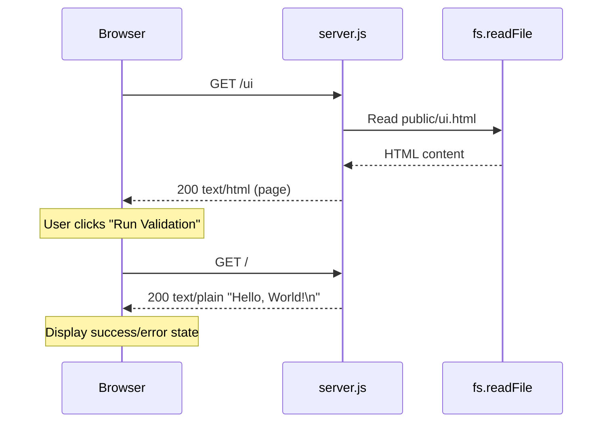
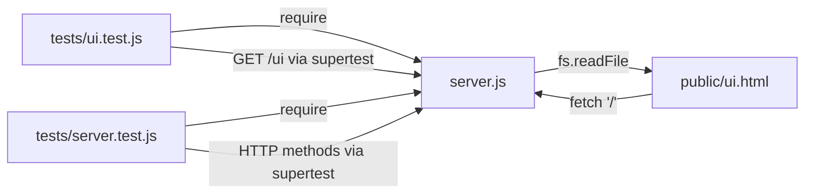

# Technical Specification

# 0. Agent Action Plan

## 0.1 Intent Clarification


### 0.1.1 Core Objective

Based on the provided requirements, the Blitzy platform understands that the objective is to **add a minimal, browser-accessible validation page** at the `/ui` route to the existing `hello_world` Node.js HTTP server. This page will enable developers to verify that the server is running and confirm the existing `Hello, World!` response through a simple graphical interface — replacing the need for raw browser text, `curl`, or Postman for quick validation.

The requirements explicitly specify the following goals:

- **Create a self-contained HTML validation page** (`public/ui.html`) that provides a title, a short description, a "Run Validation" button, and a result display area
- **Add a single new route** (`GET /ui`) to the existing `server.js` request handler that serves the new HTML page with `Content-Type: text/html`
- **Implement a button-triggered validation flow** where clicking "Run Validation" sends a `fetch('/')` request to the existing root endpoint and displays loading, success, or error states based on the response
- **Preserve all existing server behavior** — the root endpoint `GET /` must continue to return `Hello, World!\n` as plain text, all non-`/ui` paths must continue responding identically, and all 15 existing tests must continue to pass without modification
- **Add minimal test coverage** for the new `/ui` route behavior without rewriting or modifying existing tests

Implicit requirements surfaced through analysis:

- The current `server.js` request handler (lines 6–9) is **branchless** — it returns the same response for every request regardless of URL. Introducing `/ui` requires adding URL-based conditional logic via `req.url` parsing, which represents the first branch ever added to this handler
- Serving the HTML file from disk requires importing Node.js built-in modules `fs` and `path`, which are currently not present in `server.js`
- A new `public/` directory must be created at the repository root to house the static HTML file
- The `fs.readFile` operation for serving the HTML file introduces an asynchronous code path that must handle file-read errors gracefully

### 0.1.2 Task Categorization

- **Primary task type:** Add Feature
- **Secondary aspects:** UI development (minimal), server-side routing, integration testing
- **Scope classification:** Isolated change — the feature is confined to a single new route, a new static file, and a minimal update to the existing server handler

### 0.1.3 Special Instructions and Constraints

The user has provided explicit and emphatic constraints that must be respected throughout implementation:

- **Minimal Change Clause:** "Make only the changes that are absolutely necessary to implement this frontend feature. Do not refactor, optimize, or modify existing code unless it is directly required for the new feature to work."
- **No Frameworks:** Do not introduce Express, React, Vite, Tailwind, Bootstrap, or any component library. Use only native HTML elements and the Node.js built-in `http`, `fs`, and `path` modules.
- **No New Runtime Dependencies:** Do not add any production or development packages beyond what already exists in `package.json`. Only `jest` and `supertest` (both devDependencies) are present, and no additions are permitted.
- **Self-Contained HTML:** Prefer a single `public/ui.html` file with minimal inline CSS and JavaScript. A separate `public/ui.js` file is allowed only if absolutely necessary, but the preference is for one self-contained file.
- **Existing Test Preservation:** All 15 existing tests in `tests/server.test.js` must continue to pass without modification. New tests should be added in a separate file (`tests/ui.test.js`) or appended minimally.
- **No Workflow Changes:** User-specified rule: "Do not make any updates or changes in GitHub App to create or update a workflow."
- **Vanilla JavaScript Only:** All client-side interactivity must use plain DOM manipulation — no libraries, no build step, no module bundlers.

### 0.1.4 Technical Interpretation

These requirements translate to the following technical implementation strategy:

- To **serve the validation page**, we will modify `server.js` by adding a conditional check for `req.url === '/ui'` inside the existing `http.createServer` callback. When the URL matches `/ui`, the handler will read `public/ui.html` from disk using `fs.readFile` and respond with `Content-Type: text/html`. All other requests will continue to follow the existing behavior unchanged.
- To **create the validation UI**, we will create `public/ui.html` as a self-contained static HTML file with embedded `<style>` and `<script>` blocks. The page will contain semantic HTML elements (`<main>`, `<h1>`, `<p>`, `<button>`, `<div>`, `<pre>`) that implement the title, description, validation button, and result display area. The inline JavaScript will use `fetch('/')` triggered by a button click to validate the server response.
- To **handle UI states**, the inline JavaScript will manage three states — loading (disable button, show "Validating..."), success (display green success message when response matches `Hello, World!`), and error (display red error message for network failures or unexpected response content). The button will re-enable after each attempt to allow retries.
- To **validate the new route**, we will create `tests/ui.test.js` as a new Jest/Supertest test file that verifies `GET /ui` returns HTTP 200 with `Content-Type: text/html` and contains expected HTML markers, without touching the existing `tests/server.test.js` file.


## 0.2 Repository Scope Discovery


### 0.2.1 Comprehensive File Analysis

The repository `hao-backprop-test` is a minimal Node.js project with the following structure:

```
/
├── server.js                  (16 lines — sole runtime entrypoint)
├── package.json               (manifest with devDependencies only)
├── package-lock.json          (lockfile for jest + supertest)
├── README.md                  (2-line project description)
├── tests/
│   └── server.test.js         (163 lines — 15 integration tests)
└── blitzy/
    └── documentation/         (analysis docs from previous fix)
```

**Files directly affected by the feature:**

| File | Current State | Relevance |
|------|---------------|-----------|
| `server.js` | 16-line branchless HTTP handler returning `Hello, World!\n` for all requests | Must be updated to add `/ui` route conditional and serve the HTML file |
| `public/ui.html` | Does not exist; `public/` directory does not exist | Must be created — the self-contained validation page with inline CSS and JavaScript |
| `tests/ui.test.js` | Does not exist | Must be created — new test file for `/ui` route coverage |
| `tests/server.test.js` | 163 lines, 15 passing tests covering HTTP methods, multi-path, response contract, startup log, address binding | Must remain completely unchanged; all 15 tests must continue to pass |
| `package.json` | `hello_world` v1.0.0, scripts: `test`, `test:coverage`, devDeps: jest ^29.7.0, supertest ^7.2.2 | No changes required — no new dependencies are being added |
| `README.md` | Brief project description | No changes required |
| `package-lock.json` | Lockfile for current dependencies | No changes required |

**Related file discovery — files affected by interface changes:**

- `tests/server.test.js` tests multi-path behavior (paths `/test`, `/nonexistent`, `/a/b/c/d`, `/path?query=value`) and expects `Hello, World!\n` for all of them. Since the new `/ui` route is being carved out exclusively, these paths will not be affected and existing tests will continue to pass. The only route being intercepted is `/ui`.

### 0.2.2 Web Search Research Conducted

- **Node.js static file serving without frameworks:** The standard approach uses `fs.readFile` or `fs.createReadStream` with `path.join(__dirname, ...)` to locate files relative to the module, setting `Content-Type: text/html; charset=UTF-8` in the response header. The MDN documentation and community patterns confirm this is the idiomatic minimal approach.
- **Supertest testing for static HTML routes:** The existing test file already imports the server module and uses `supertest(server)` for HTTP assertions. The new test file can follow the identical pattern — `request(server).get('/ui').expect(200).expect('Content-Type', /html/)` — validating status code, content type, and presence of key HTML elements in the response body.
- **Minimal URL-based routing in Node.js `http` module:** The simplest approach is a direct `req.url` string comparison. For this project, checking `req.url === '/ui'` (or using `url.parse(req.url).pathname === '/ui'` for robustness against query strings) is sufficient. No URL parsing library is needed beyond what Node.js provides built-in.

### 0.2.3 Existing Infrastructure Assessment

- **Project structure:** Single-file server architecture. The entire application logic resides in `server.js` with no modules, routers, middleware, or configuration files. No build step, no transpilation, no environment files.
- **Module system:** CommonJS (`require`/`module.exports`). The server instance is exported via `module.exports = server`, enabling Supertest to bind to it for testing without starting a listener.
- **Existing patterns and conventions:**
  - Server uses `http.createServer` with a single callback function
  - Response always sets `statusCode = 200`, `Content-Type: text/plain`, and ends with `'Hello, World!\n'`
  - Server binds to `127.0.0.1:3000` and logs `Server running at http://127.0.0.1:3000/` on startup
  - Tests use `const request = require('supertest')` and wrap the server instance
  - Test lifecycle: `jest.spyOn(console, 'log')` before `require('../server')`, `beforeAll` readiness gate polling every 100ms, `afterAll` calls `server.close(done)`
- **Testing infrastructure:** Jest 29.7.0 with `--forceExit --detectOpenHandles` flags. Supertest 7.2.2 for HTTP assertions. No Jest configuration file — uses default settings via `package.json` scripts. Single test suite with 15 tests achieving 100% code coverage.
- **Build and deployment:** No CI/CD configuration files (no `.github/workflows/`, no Dockerfile, no Makefile). The project is purely for Backprop integration verification.
- **Documentation system:** Minimal — only `README.md` with a two-line description. The `blitzy/documentation/` folder contains previous change analysis but is not part of the runtime system.


## 0.3 Scope Boundaries


### 0.3.1 Exhaustively In Scope

**Source code changes:**

- `server.js` — Add conditional routing logic to intercept `GET /ui` and serve the HTML file; add `require('fs')` and `require('path')` imports. All other request paths continue to receive the existing `Hello, World!\n` plain-text response unchanged.

**New static assets:**

- `public/ui.html` — Self-contained validation page with embedded `<style>` and `<script>` blocks. Contains a title (`<h1>`), explanatory paragraph (`<p>`), "Run Validation" button (`<button>`), status/result messaging area (`<div>` or `<section>`), and raw response preview (`<pre>` or `<code>`).

**Test updates:**

- `tests/ui.test.js` — New test file covering:
  - `GET /ui` returns HTTP 200 with `Content-Type: text/html`
  - Response body contains expected HTML structural markers (e.g., `<button>`, page title)
  - `GET /` still returns `Hello, World!\n` as plain text (regression guard)

**Directory creation:**

- `public/` — New directory at repository root to house the static HTML file

### 0.3.2 Explicitly Out of Scope

- **Refactoring server architecture:** The existing `server.js` structure will not be reorganized into separate modules, routers, or middleware layers. Only the minimal conditional for `/ui` will be added.
- **Introducing frameworks or libraries:** Express, React, Vite, Tailwind, Bootstrap, or any component library will not be added. No new npm packages will be installed.
- **Adding authentication, sessions, cookies, or persistence:** The validation page is stateless and does not store or transmit any user data.
- **Changing the root endpoint contract:** `GET /` will continue to return `Hello, World!\n` with `Content-Type: text/plain` and status 200 for all HTTP methods.
- **Adding client-side routing:** The `/ui` page is a single static page with no SPA routing or navigation.
- **Converting the project into a full web application:** This remains a minimal diagnostic server. The `/ui` page is purely a developer convenience tool.
- **Modifying unrelated tests or project structure:** The existing 15 tests in `tests/server.test.js` will not be touched. `package.json` dependencies will not be altered. `README.md` will not be changed.
- **Creating or modifying GitHub workflows:** Per user-specified rule, no GitHub App workflow changes will be made.
- **Performance optimizations:** No caching, compression, or streaming optimizations beyond basic `fs.readFile`.
- **Separate CSS or JavaScript files:** Unless absolutely necessary, no `public/ui.css` or `public/ui.js` will be created. All styling and scripting will be inline within `public/ui.html`.
- **Additional API endpoints:** No new endpoints beyond `GET /ui` will be created. No REST API, no JSON responses, no form handling.


## 0.4 Dependency Inventory


### 0.4.1 Key Private and Public Packages

The project has **zero production dependencies** and only two devDependencies. No new packages will be added for this feature.

| Registry | Package Name | Version | Purpose |
|----------|-------------|---------|---------|
| npm | jest | ^29.7.0 (resolved: 29.7.0) | JavaScript testing framework — runs the existing 15 tests and the new UI route tests |
| npm | supertest | ^7.2.2 (resolved: 7.2.2) | HTTP assertion library — used to make programmatic requests against the server instance in tests |

**Node.js Built-in Modules (no installation required):**

| Module | Current Usage | Change for This Feature |
|--------|--------------|------------------------|
| `http` | Used in `server.js` to create the HTTP server | No change — continues to be used as-is |
| `fs` | Not currently imported | Will be added to `server.js` to read `public/ui.html` from disk |
| `path` | Not currently imported | Will be added to `server.js` to resolve the file path to `public/ui.html` relative to `__dirname` |

### 0.4.2 Dependency Updates

**New dependencies to add:** None. The feature is implemented entirely with Node.js built-in modules (`http`, `fs`, `path`) and vanilla HTML/CSS/JavaScript. This is an explicit user requirement.

**Dependencies to update:** None. The existing `jest@^29.7.0` and `supertest@^7.2.2` versions are sufficient for the new test file.

**Dependencies to remove:** None.

**Import/Reference Updates:**

- `server.js` — Add two new `require` statements at the top of the file:
  - `const fs = require('fs');`
  - `const path = require('path');`
  - These are Node.js built-in modules and do not require any `npm install`

- `tests/ui.test.js` — New file will import:
  - `const request = require('supertest');` (already installed as devDependency)
  - `const server = require('../server');` (existing module export)


## 0.5 Implementation Design


### 0.5.1 Technical Approach

**Primary objectives with implementation approach:**

- **Achieve route-based serving** by modifying the `http.createServer` callback in `server.js` to check `req.url` before responding. When the URL matches `/ui`, the handler reads and serves `public/ui.html` with `Content-Type: text/html`. All other URLs continue to receive the existing `Hello, World!\n` plain-text response, preserving backward compatibility.
- **Achieve a self-contained validation UI** by creating `public/ui.html` with semantic HTML, an embedded `<style>` block for minimal styling, and an embedded `<script>` block that uses the Fetch API to call `GET /` and display results. No external files, libraries, or build steps are involved.
- **Achieve test coverage for the new route** by creating `tests/ui.test.js` as a standalone Jest/Supertest test file that follows the identical patterns established in `tests/server.test.js` (import server, use `request(server)`, lifecycle management with `beforeAll`/`afterAll`).

**Logical implementation flow:**

- First, establish the **directory structure** by creating the `public/` folder at the repository root
- Next, create the **static HTML file** (`public/ui.html`) containing the complete validation page with all UI elements, inline styles, and inline JavaScript for the fetch-validate-display flow
- Then, update the **server handler** in `server.js` with the minimal conditional to serve the HTML file when `/ui` is requested, while leaving all other behavior untouched
- Finally, create the **test file** (`tests/ui.test.js`) to verify the new route returns correct status, content type, and HTML content

### 0.5.2 Component Impact Analysis

**Direct modifications required:**

- **`server.js`** — Modify the request handler callback (currently lines 6–9) to introduce a URL check. The current handler unconditionally sets `statusCode = 200`, `Content-Type: text/plain`, and ends with `'Hello, World!\n'`. The modification adds a conditional branch: if `req.url === '/ui'`, read and serve the HTML file; otherwise, fall through to the existing behavior. Two new `require` statements (`fs`, `path`) are added at the top.

**Indirect impacts and dependencies:**

- **`tests/server.test.js`** — The existing multi-path tests (`/test`, `/nonexistent`, `/a/b/c/d`, `/path?query=value`) all expect `Hello, World!\n` as the response. Since `/ui` is the only URL being carved out, and none of these test paths match `/ui`, all 15 existing tests will continue to pass without modification.
- **Module export behavior** — `server.js` currently exports the server instance via `module.exports = server`. This export must remain unchanged so that both the existing test file and the new test file can import and test against the same server instance.

**New components introduction:**

- **`public/ui.html`** — New self-contained HTML file responsible for rendering the validation page and executing the client-side fetch-validate-display logic
- **`tests/ui.test.js`** — New test file responsible for verifying the `/ui` route behavior
- **`public/` directory** — New directory to organize static frontend assets

### 0.5.3 User Interface Design

The validation page implements the following semantic structure as specified by the user:

- **PageContainer** (`<main>`) — Centers content with minimal padding, max-width constraint for readability
- **Title** (`<h1>`) — Displays "Hello World Validation" or similar descriptive heading
- **Description** (`<p>`) — Brief explanatory text such as "Click the button below to verify the server is running and returning the expected response."
- **RunValidationButton** (`<button>`) — Labeled "Run Validation"; disabled during in-flight requests; re-enabled after completion or failure
- **StatusMessage** (`<div>` or `<section>`) — Displays one of three states:
  - **Loading:** "Validating..." shown in neutral color while request is in progress
  - **Success:** "✓ Server responded with expected output: Hello, World!" shown in green when response matches
  - **Error:** "✗ Validation failed" with contextual detail shown in red on network failure or unexpected response
- **ResponsePreview** (`<pre>` or `<code>`) — Displays the raw server response text for developer inspection

Styling is minimal and inline — a small `<style>` block within the HTML `<head>` providing basic layout (centered container, readable font), button styling (cursor pointer, disabled state), and state-specific colors (green for success, red for error, gray for loading).

### 0.5.4 User-Provided Examples Integration

The user provided a detailed component composition suggestion:

> **User Example:** "PageContainer → Title → Description → RunValidationButton → StatusMessage → ResponsePreview"

This composition maps directly to the implementation: each element is a semantic HTML tag within `public/ui.html`, nested inside a `<main>` container. Since this is not a framework-based app, these are implemented as plain DOM sections, not abstracted component files — exactly as the user specified.

The user also provided the preferred implementation approach:

> **User Example:** "Add `public/ui.html` as a self-contained static page with minimal inline CSS and JavaScript. Update `server.js` with the smallest possible conditional so that `/ui` returns `text/html` and all existing behavior remains intact."

This approach is adopted verbatim as the implementation strategy.

### 0.5.5 Critical Implementation Details

**URL matching strategy:**

- Use `req.url === '/ui'` as the primary check in the server handler. This is the simplest conditional that avoids matching `/ui/anything` or other sub-paths. For robustness against query strings (e.g., `/ui?foo=bar`), the implementation may optionally use `new URL(req.url, 'http://localhost').pathname === '/ui'` or `req.url.split('?')[0] === '/ui'`.

**File serving approach:**

- Use `fs.readFile(path.join(__dirname, 'public', 'ui.html'), 'utf8', callback)` for synchronous-style asynchronous reading. The `path.join(__dirname, ...)` pattern ensures correct resolution regardless of the working directory from which Node.js is launched.
- On successful read: respond with `200`, `Content-Type: text/html`, and the file contents.
- On file read error: respond with `500` and a plain-text error message. This handles the edge case where `public/ui.html` is missing or unreadable.

**Client-side fetch logic:**

- The button `onclick` handler disables the button, clears previous results, shows "Validating...", then calls `fetch('/')`.
- On successful response: reads the body as text via `response.text()`, compares against `'Hello, World!\n'` (or the trimmed variant), and displays success or warning accordingly.
- On fetch failure (network error): catches the error and displays a user-friendly message such as "Validation failed. Unable to reach server."
- After any outcome: re-enables the button to allow retry.

**Error handling and edge cases:**

- Server-side: if `fs.readFile` fails (e.g., file not found), the server returns HTTP 500 with a plain-text error rather than crashing
- Client-side: if `fetch('/')` throws (server unreachable), the catch block displays an error message and re-enables the button
- Client-side: if the response succeeds but does not contain the expected `Hello, World!` text, a warning/error state is shown with the actual response content

**Integration pattern:**

- The `public/ui.html` file references the root endpoint (`/`) via a relative `fetch('/')` call, which works correctly because both the HTML page and the API are served from the same origin (`http://127.0.0.1:3000`)
- No CORS configuration is needed since this is a same-origin request




## 0.6 File Transformation Mapping


### 0.6.1 File-by-File Execution Plan

| Target File | Transformation | Source File/Reference | Purpose/Changes |
|-------------|----------------|----------------------|-----------------|
| `public/ui.html` | CREATE | N/A (new file, follows user specification) | Self-contained validation page with inline CSS and inline JavaScript implementing the fetch-validate-display flow with loading/success/error states |
| `server.js` | UPDATE | `server.js` (existing) | Add `fs` and `path` imports, add conditional branch for `req.url === '/ui'` to serve `public/ui.html` as `text/html`, preserve all existing behavior for other URLs |
| `tests/ui.test.js` | CREATE | `tests/server.test.js` (REFERENCE for patterns) | New test file verifying `GET /ui` returns 200 with HTML content type and expected page structure; follows existing Jest/Supertest lifecycle patterns |
| `tests/server.test.js` | REFERENCE | `tests/server.test.js` | Use as reference for test file structure, import conventions, lifecycle management (`beforeAll`/`afterAll`), and assertion patterns — do NOT modify |
| `package.json` | REFERENCE | `package.json` | Verify devDependencies are sufficient (jest, supertest) — do NOT modify |

### 0.6.2 New Files Detail

**`public/ui.html`** — Self-contained validation page

- Content type: Static HTML with embedded CSS and JavaScript
- Based on: User specification (semantic HTML structure with `<main>`, `<h1>`, `<p>`, `<button>`, `<div>`, `<pre>`)
- Key sections:
  - `<head>` — Charset meta, viewport meta, page title, embedded `<style>` block with minimal layout and state-specific styling
  - `<main>` — Page container wrapping all visible content
  - `<h1>` — Page title (e.g., "Hello World Validation")
  - `<p>` — Explanatory description text
  - `<button id="validate-btn">` — "Run Validation" trigger with `onclick` handler
  - `<div id="status">` or `<section id="status">` — Status/result message area for loading, success, and error states
  - `<pre id="response">` — Raw response output display area
  - `<script>` — Inline JavaScript implementing: button click handler, `fetch('/')` call, response text comparison against `Hello, World!`, DOM updates for each state, button disable/re-enable logic, and error catch handling

**`tests/ui.test.js`** — UI route integration tests

- Content type: JavaScript test file (Jest + Supertest)
- Based on: `tests/server.test.js` (follows same import patterns, lifecycle, assertion style)
- Key test cases:
  - `GET /ui` returns status code 200
  - `GET /ui` returns `Content-Type` containing `text/html`
  - `GET /ui` response body contains expected HTML markers (e.g., `<button`, `Run Validation`, `<main`)
  - `GET /` still returns `Hello, World!\n` (regression verification within the new test file)

### 0.6.3 Files to Modify Detail

**`server.js`** — Minimal routing update

- **Lines to add at top (after existing `const http = require('http');` on line 1):**
  - `const fs = require('fs');`
  - `const path = require('path');`
- **Lines to modify (existing handler, lines 6–9):**
  - Wrap existing response logic inside an `else` branch
  - Add new `if (req.url === '/ui')` branch before the existing logic that reads `public/ui.html` and serves it
- **Content to add:** Conditional block that:
  - Checks if `req.url === '/ui'`
  - Calls `fs.readFile(path.join(__dirname, 'public', 'ui.html'), 'utf8', callback)`
  - On success: sets `statusCode = 200`, `Content-Type: text/html`, ends with file content
  - On error: sets `statusCode = 500`, `Content-Type: text/plain`, ends with error message
- **Content to preserve unchanged:**
  - The `else` branch containing the original `res.statusCode = 200`, `res.setHeader('Content-Type', 'text/plain')`, `res.end('Hello, World!\n')` logic
  - Server binding to `127.0.0.1:3000`
  - Console.log startup message
  - `module.exports = server` export statement

### 0.6.4 Configuration and Documentation Updates

**Configuration changes:** None required. No configuration files exist in this project, and none are being added. The `package.json` `scripts.test` command (`jest --forceExit --detectOpenHandles`) will automatically discover the new `tests/ui.test.js` file since Jest's default test file pattern matches `**/*.test.js`.

**Documentation updates:** None required per scope boundaries. The `README.md` is not being updated as part of this feature. The feature is self-documenting through the UI page itself.

### 0.6.5 Cross-File Dependencies

**Import/reference relationships:**

- `server.js` → `public/ui.html`: Server reads the HTML file from disk at request time using `fs.readFile`. The file path is resolved via `path.join(__dirname, 'public', 'ui.html')`. If the file is missing, the server returns HTTP 500.
- `public/ui.html` → `GET /` endpoint: The inline JavaScript in the HTML file calls `fetch('/')`, which hits the same `server.js` handler. This is a same-origin runtime dependency.
- `tests/ui.test.js` → `server.js`: The test file imports the server module via `require('../server')` and uses Supertest to make HTTP requests against it, identical to how `tests/server.test.js` works.
- `tests/ui.test.js` → `public/ui.html`: The test implicitly depends on the HTML file existing on disk, since `GET /ui` triggers `fs.readFile` on it.

**Configuration sync requirements:** None. Jest auto-discovers test files matching `*.test.js` pattern.

**Dependency graph:**




## 0.7 Rules


### 0.7.1 Task-Specific Rules

The following rules are explicitly emphasized by the user and must be strictly observed throughout implementation:

- **Minimal Change Discipline:** "Make only the changes that are absolutely necessary to implement this frontend feature. Do not refactor, optimize, or modify existing code unless it is directly required for the new feature to work. Your goal is to add functionality with minimal disruption to the existing system."
- **No Framework Introduction:** "Do not introduce React, Tailwind, Bootstrap, or any component library." Use only native HTML elements, embedded CSS, and vanilla JavaScript.
- **No New Dependencies:** Do not add any npm packages (neither production nor development dependencies). The only allowed dependencies are the existing `jest` and `supertest` devDependencies.
- **Self-Contained HTML Preference:** "Prefer a single self-contained HTML file with minimal inline JavaScript." A separate `public/ui.js` is permitted only if absolutely necessary.
- **Existing Test Preservation:** Do not modify `tests/server.test.js`. All 15 existing tests must continue to pass as-is. New tests go in a separate `tests/ui.test.js` file.
- **Existing Behavior Preservation:** `GET /` must still return plain text `Hello, World!\n`. Existing non-`/ui` paths must continue behaving exactly as they do now. Existing startup logging must remain unchanged. Existing CommonJS module export behavior must remain unchanged.
- **No Workflow Modifications:** "Do not make any updates or changes in GitHub App to create or update a workflow." (User-specified implementation rule)
- **Isolate New Code:** "Isolate new code in `public/ui.html` whenever possible. Use native HTML/CSS/JS before creating any abstraction."
- **Least Modification Principle:** "When multiple implementation approaches exist, choose the one that requires the least modification to existing code."
- **No Server Architecture Refactoring:** Do not reorganize `server.js` into modules, routers, or separate concerns. Add only the minimal conditional needed.
- **No Persistence or State:** No authentication, sessions, cookies, localStorage, or any form of data persistence. The page is fully stateless.


## 0.8 Special Instructions


### 0.8.1 Special Execution Instructions

- **Implementation preference order:** The user explicitly stated the preferred approach:
  1. Add `public/ui.html` as a self-contained static page with minimal inline CSS and JavaScript
  2. Update `server.js` with the smallest possible conditional so that `/ui` returns `text/html` and all existing behavior for `/` and other paths remains intact
  3. Reuse the existing `GET /` plain-text response for validation
  4. Add only the minimal tests required to cover the new `/ui` behavior without rewriting existing tests
- **No build or deployment changes:** No Dockerfile, CI/CD pipeline, Makefile, or deployment configuration should be created or modified
- **Code style adherence:** Follow the existing code conventions observed in `server.js` — CommonJS `require` statements, single-line `const` declarations, callback-style async patterns (not `async/await`), no semicolons-optional or strict mode directives
- **Test style adherence:** Follow the existing patterns in `tests/server.test.js` — use `describe`/`it` blocks, `supertest` `request(server)` invocation, `.expect()` chaining for status codes and headers, and proper lifecycle management with `beforeAll`/`afterAll`
- **Directory creation:** The `public/` directory does not exist and must be created as part of the implementation. This is an infrastructure prerequisite that must happen before `public/ui.html` can be written.

### 0.8.2 Constraints and Boundaries

- **Technical constraints:**
  - Node.js built-in modules only (`http`, `fs`, `path`) — no third-party runtime modules
  - Client-side JavaScript must use the Fetch API (available in all modern browsers) — no XMLHttpRequest, no axios, no jQuery
  - HTML must be valid HTML5 with semantic elements as specified (`<main>`, `<h1>`, `<p>`, `<button>`, `<div>`, `<section>`, `<pre>`, `<code>`)
  - CSS must be minimal and embedded in a `<style>` block — no external stylesheets, no CSS frameworks, no CSS-in-JS
- **Process constraints:**
  - Do not modify any file that is not listed in the File Transformation Mapping
  - Do not touch `package.json`, `package-lock.json`, `README.md`, or any file in the `blitzy/` directory
  - Do not create any GitHub workflow files or CI/CD configuration
- **Output constraints:**
  - The `/ui` page must be fully functional with a single page load — no multi-page flows, no redirects, no client-side routing
  - The validation button must produce visible feedback within the page — no alerts, no console-only output, no popups
  - All three UI states (loading, success, error) must be visually distinguishable
- **Compatibility requirements:**
  - The server must continue to bind to `127.0.0.1:3000` — no port or host changes
  - The `module.exports = server` statement must remain at the end of `server.js` so that Supertest can import it
  - The startup console.log message `Server running at http://127.0.0.1:3000/` must remain exactly as-is


## 0.9 References


### 0.9.1 Repository Files and Folders Searched

The following files and folders were inspected during context gathering to derive the conclusions in this Agent Action Plan:

| Path | Type | Purpose of Inspection |
|------|------|----------------------|
| `/` (root) | Folder | Identified complete project structure: `server.js`, `package.json`, `package-lock.json`, `README.md`, `tests/`, `blitzy/` |
| `server.js` | File | Read full contents (16 lines) — analyzed request handler, server binding, module export, identified branchless architecture |
| `package.json` | File | Read full contents — confirmed package name (`hello_world`), version (`1.0.0`), scripts (`test`, `test:coverage`), devDependencies (`jest ^29.7.0`, `supertest ^7.2.2`), zero production dependencies |
| `README.md` | File | Read full contents (2 lines) — confirmed project description as "test project for backprop integration" |
| `tests/` | Folder | Listed contents — single file `server.test.js` |
| `tests/server.test.js` | File | Read full contents (163 lines, 15 tests) — analyzed test structure, lifecycle management, HTTP method coverage, multi-path validation, response contract assertions, console spy pattern, address binding verification |
| `blitzy/` | Folder | Listed contents — documentation-only folder, not relevant to runtime changes |

### 0.9.2 Technical Specification Sections Retrieved

| Section | Key Information Extracted |
|---------|-------------------------|
| 1.1 Executive Summary | Project is a lightweight single-file Node.js HTTP server for Backprop integration verification; package `hello_world` v1.0.0, MIT license |
| 3.1 Programming Languages | JavaScript (Node.js) only, CommonJS module system, no transpilation |
| 3.2 Core Runtime Environment | Node.js v20.x LTS (Iron), npm, `http` built-in module is the sole runtime library, zero production dependencies |
| 5.2 Component Details | Detailed component architecture — server.js (sole runtime), package.json (manifest), tests/server.test.js (15 tests, 100% coverage); server responds identically to ALL HTTP methods on ANY path |
| 6.6 Testing Strategy | Integration testing is the primary strategy; 15 Supertest-based HTTP tests; Jest with default config; two npm scripts; beforeAll/afterAll lifecycle pattern |

### 0.9.3 External Research Sources

| Topic Searched | Key Findings |
|---------------|-------------|
| Node.js `http` module serving static HTML files without Express | Standard approach uses `fs.readFile` with `path.join(__dirname, ...)`, setting `Content-Type: text/html; charset=UTF-8`; confirmed as idiomatic by MDN documentation and community patterns |
| Supertest/Jest testing patterns for static HTML routes | Existing `request(server).get('/path').expect(200).expect('Content-Type', /html/)` pattern is standard; new test file can follow identical conventions to existing test suite |

### 0.9.4 Attachments and External Metadata

- **No Figma designs provided** — The user did not attach any design files or Figma URLs. The UI specification is entirely text-based, describing semantic HTML elements and their roles.
- **No external attachments** — No files were provided in `/tmp/environments_files` or elsewhere.
- **No environment variables or secrets** — The user did not specify any environment variables or secrets for this project.
- **User-specified implementation rule:** "Do not make any updates or changes in GitHub App to create or update a workflow." (Applied as rule named "exit code 137 test")


