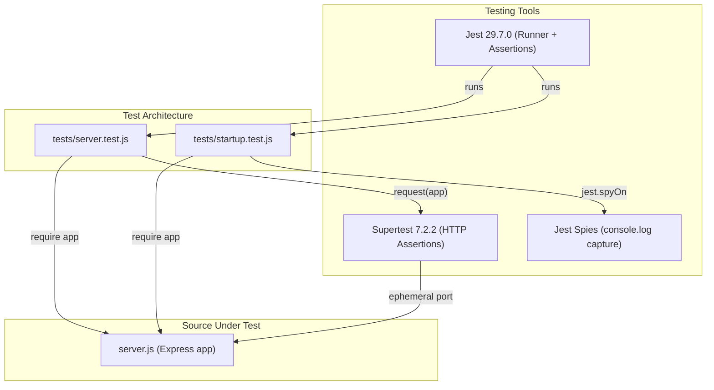

# Technical Specification

# 0. Agent Action Plan

## 0.1 Intent Clarification

### 0.1.1 Core Testing Objective

Based on the provided requirements, the Blitzy platform understands that the testing objective is to **introduce the project's first automated test suite** for a minimal, single-file Node.js/Express.js 5 tutorial application (`server.js`) that currently has zero automated test coverage. The project explicitly identified the absence of an automated test suite as an open medium-severity technology risk (TR-001 in Section 3.9 of the existing tech spec), and this implementation directly remediates that risk.

**Request Category:** Add new tests (greenfield test infrastructure)

The testing requirements, restated with enhanced clarity, are:

- **HTTP Endpoint Contract Testing** — Verify that `GET /` returns exactly `Hello, World!\n` (including trailing newline, 14 bytes) with HTTP 200 and `Content-Type: text/plain; charset=utf-8`, and that `GET /good-evening` returns exactly `Good evening` (no trailing newline, 12 bytes) with HTTP 200 and `Content-Type: text/plain; charset=utf-8`
- **404 Default Behavior Testing** — Verify that requests to any unregistered route (e.g., `GET /nonexistent`, `GET /foo/bar/baz`) return HTTP 404 with the Express default error body pattern `Cannot GET /[path]`
- **Security Hardening Verification** — Verify that the `x-powered-by` HTTP response header is absent from all responses, confirming `app.disable('x-powered-by')` is effective
- **Startup Configuration Testing** — Verify that the server binds to `127.0.0.1:3000` and that the startup callback logs the exact message `Server running at http://127.0.0.1:3000/`
- **Express App Bootstrap Testing** — Verify core app initialization: Express instance creation, route registration, and security configuration

**Implicit testing needs surfaced:**
- Exact body matching must include character-level precision (the `\n` on `Hello, World!\n` vs. no newline on `Good evening`)
- Content-Type assertions must match the full value `text/plain; charset=utf-8`, not just `text/plain`
- The 404 test must cover representative non-matching paths including nested/arbitrary routes to confirm Express's `finalhandler` behavior
- Header absence testing for `x-powered-by` should be verified across multiple endpoints, not just one
- The app module must be exportable for in-process supertest testing without actually binding a network port

### 0.1.2 Special Instructions and Constraints

**Minimal Change Directive:** Only add test files and minimal test infrastructure. Do not modify existing production code (`server.js`) unless absolutely required for testability. The sole permissible production change is enabling module export of the Express app instance for in-process testing.

**Testing Discipline Requirements:**
- Follow existing repository conventions (CommonJS modules, `const` declarations, tutorial-grade simplicity)
- Prefer real in-process HTTP testing over mocking wherever possible
- Mock only when necessary for startup logging assertions or isolating process-level side effects
- Keep test structure simple, readable, and appropriate for tutorial learners
- Ensure all tests can run independently and deterministically
- Use inline expectations for static/deterministic responses — no complex fixtures needed

**CI/CD Constraint:** Do not create or modify `.github/workflows/` files. Tests must be CI-friendly but CI pipeline creation is explicitly out of scope.

**Implementation Rule:** Do not make any updates or changes in GitHub App to create or update a workflow.

**User Example — Expected Responses (preserved exactly):**
- User Example: `GET /` returns `Hello, World!\n` with HTTP 200 and plain-text content
- User Example: `GET /good-evening` returns `Good evening` with HTTP 200 and plain-text content
- User Example: unmatched routes return Express default 404
- User Example: `x-powered-by` is disabled on responses
- User Example: the server starts on `127.0.0.1:3000`
- User Example: startup logs `Server running at http://127.0.0.1:3000/`

### 0.1.3 Technical Interpretation

These testing requirements translate to the following technical test implementation strategy:

- To **test HTTP endpoint contracts**, we will create `tests/server.test.js` using Jest and Supertest to send in-process HTTP requests against the Express app instance and assert exact status codes, response bodies, and Content-Type headers
- To **test 404 default behavior**, we will add test cases in `tests/server.test.js` that send requests to multiple unregistered paths and verify HTTP 404 status codes and Express-generated error body patterns
- To **test security hardening**, we will add assertions across endpoint tests verifying the absence of the `x-powered-by` header in all HTTP responses
- To **test startup configuration**, we will create `tests/startup.test.js` that verifies the server's host/port binding configuration and console output by capturing `console.log` calls and inspecting the listen callback behavior
- To **enable testability**, we will add a minimal `module.exports = app` export and wrap the `app.listen()` call in an `if (require.main === module)` guard in `server.js`, ensuring the server only auto-starts when run directly (not when imported by tests)

### 0.1.4 Coverage Requirements Interpretation

**Explicit coverage targets specified by user:**
- 100% coverage of all externally visible HTTP behavior (both endpoints, 404, security headers)
- Strong coverage of `server.js` startup/configuration logic
- Practical overall target of 90%+ line/function coverage

**Implicit coverage expectations based on analysis:**
- Industry standard for Node.js/Express applications of this size: 90–100% is achievable and expected
- The existing repository has 0% automated coverage (confirmed by tech spec Section 6.6)
- The application comprises only 20 lines of code in a single file with no branching logic beyond route matching
- With full endpoint testing, security assertions, and startup behavior verification, 90%+ coverage is readily achievable

To achieve comprehensive testing, coverage should include:
- All two route handler functions (`GET /`, `GET /good-evening`)
- The `app.disable('x-powered-by')` configuration call path
- The `app.listen()` callback execution path
- The Express default 404 handler delegation to `finalhandler`
- All `res.type('text').send(...)` execution paths

## 0.2 Test Discovery and Analysis

### 0.2.1 Existing Test Infrastructure Assessment

A comprehensive repository search was conducted to assess the current test infrastructure. The repository was inspected at root level, all subdirectories were explored, and pattern-based searches for test-related files were performed.

**Repository analysis reveals zero testing infrastructure of any kind.** The project contains exactly four root-level files (`server.js`, `package.json`, `package-lock.json`, `README.md`) and a `blitzy/documentation/` folder with design documentation. No test files, test directories, test configurations, or testing-related dependencies exist anywhere in the repository.

| Assessment Area | Finding | Evidence |
|----------------|---------|----------|
| Test files (`*.test.js`, `*.spec.js`, `__tests__/`) | None found | `find . -name "*.test.*" -o -name "*.spec.*"` returned zero results |
| Test directories (`tests/`, `test/`, `__tests__/`) | None found | Repository contains only `blitzy/` subdirectory |
| Testing framework | Not installed | `package.json` has no `devDependencies` block |
| Test runner configuration | None found | No `jest.config.*`, `.mocharc.*`, `vitest.config.*`, or `pytest.*` files |
| Coverage tools | Not installed | No Istanbul/nyc, c8, or coverage configuration |
| Mock/stub libraries | Not installed | No Sinon, nock, or jest mocking packages |
| Test data fixtures/factories | None found | No fixture files or factory patterns present |
| npm test script | Placeholder only | `"test": "echo \"Error: no test specified\" && exit 1"` |

**Current testing framework:** None — the `package.json` `scripts.test` entry is a non-functional placeholder that outputs an error message and exits with code 1.

**Test runner configuration location:** Not applicable — no test runner is configured.

**Coverage tools in use:** None — no coverage tooling of any kind is present in the dependency tree. All 65 resolved packages in `package-lock.json` are runtime dependencies of Express.js v5.2.1.

**Mock/stub libraries detected:** None.

**Test data fixtures or factories present:** None needed — all HTTP responses are static string literals with no external data dependencies.

### 0.2.2 Source Code Testability Analysis

The sole source file `server.js` (20 lines) was analyzed for testability:

```javascript
const app = express();
app.disable('x-powered-by');
app.listen(port, hostname, () => { ... });
```

**Testability concern identified:** The current `server.js` immediately calls `app.listen()` upon require, which would bind port 3000 during test execution. This prevents clean in-process testing with Supertest. A minimal one-time modification is required: wrapping `app.listen()` in an `if (require.main === module)` guard and adding `module.exports = app`. This is the standard, industry-recognized pattern for Express testability and represents the least-invasive production code change possible.

**Application architecture characteristics relevant to testing:**
- Single-file monolithic architecture — all logic in one 20-line file
- CommonJS module system (`require()`/`module.exports`)
- Two synchronous route handlers returning static strings
- No middleware chain, no error handlers, no async operations
- No external service calls, no database, no file I/O
- Express 5.2.1 with `finalhandler` providing default 404 responses

### 0.2.3 Web Search Research Conducted

Research was conducted to validate testing tool selection and compatibility:

- **Jest + Supertest for Express.js 5 testing:** Confirmed as the standard, most widely documented approach. Supertest works by passing the Express app instance directly to `request(app)`, which binds to an ephemeral port automatically — no manual port management required.
- **Best practice for Express testability:** The standard pattern involves exporting the Express app separately from the `app.listen()` call, enabling Supertest to create isolated test servers per request. This is documented across official Supertest documentation and major tutorial sources.
- **Jest version compatibility with Node.js 20:** Jest 29.7.0 is fully compatible with Node.js 18+ and is the most stable, widely-documented version for CommonJS projects. Jest 30.x is also compatible but introduces breaking changes unnecessary for this tutorial-grade project.
- **Supertest version compatibility with Express 5:** Supertest 7.2.2 (latest) is fully compatible with Express 5.x and Node.js 20.x. It supports both `require()` and `import` patterns.
- **CommonJS testing patterns:** Jest's default configuration works natively with CommonJS modules — no additional transforms or configuration needed beyond setting `testEnvironment: "node"`.

## 0.3 Testing Scope Analysis

### 0.3.1 Test Target Identification

**Primary code to be tested:**

- **Module:** Express application at `server.js` — requires integration-style HTTP endpoint tests, app configuration tests, and startup behavior tests

**Functions and behaviors requiring test coverage:**

| Function/Behavior | Location | Test Categories Needed |
|-------------------|----------|----------------------|
| `app.get('/', ...)` route handler | `server.js` line 9–11 | Happy path (200, body, content-type), security header absence |
| `app.get('/good-evening', ...)` route handler | `server.js` line 14–16 | Happy path (200, body, content-type), security header absence |
| `app.disable('x-powered-by')` | `server.js` line 4 | Security verification across all endpoints |
| Express default 404 via `finalhandler` | Implicit (Express internals) | Unmatched route paths, error body pattern |
| `app.listen(port, hostname, callback)` | `server.js` line 18–20 | Startup binding config, console output |
| `hostname = '127.0.0.1'` / `port = 3000` | `server.js` lines 5–6 | Configuration value verification |

**Existing test file mapping:**

| Source File | Existing Test File | Test Categories Present |
|-------------|-------------------|----------------------|
| `server.js` | None | None — 0% coverage |
| `package.json` | None | None — no test script functional |

**Dependencies requiring mocking:**

| Dependency | Mocking Strategy | Rationale |
|-----------|-----------------|-----------|
| `console.log` | Jest spy (`jest.spyOn`) | Capture startup log message without side effects |
| `app.listen` | Jest mock (only in startup tests) | Prevent real port binding during startup behavior tests |
| Express framework | No mocking | Use real Express instance via Supertest for maximum confidence |
| Route handlers | No mocking | Test actual HTTP behavior, not mock implementations |

### 0.3.2 Version Compatibility Research

Based on the current Node.js v20.20.1 runtime and Express.js v5.2.1 framework, the recommended testing stack is:

| Tool | Recommended Version | Rationale |
|------|-------------------|-----------|
| **Jest** (test runner + assertions) | 29.7.0 | Most stable LTS-equivalent release for CommonJS; fully compatible with Node.js 18+; all-in-one test runner, assertions, mocking, and built-in coverage; most widely documented version for tutorial-level projects |
| **Supertest** (HTTP assertions) | 7.2.2 | Latest stable release; fully compatible with Express 5.x and Node.js 20.x; provides in-process HTTP testing without real server startup |
| **Jest built-in coverage** (`--coverage`) | Included with Jest 29.7.0 | Uses Istanbul/babel under the hood; no separate `nyc` or `c8` installation needed; produces lcov, text, and HTML reports |

**Version conflict analysis:** No conflicts detected. Jest 29.7.0, Supertest 7.2.2, Express 5.2.1, and Node.js 20.20.1 are all mutually compatible. The CommonJS module system used by the project requires no additional transformers or configuration for Jest.

**Why Jest 29.7.0 over Jest 30.x:** Jest 30.x (latest: 30.3.0) introduces several breaking changes including mandatory `globalConfig` in Runtime constructors and reworked mocking utilities. For a tutorial-grade CommonJS project, Jest 29.7.0 provides identical functionality with superior stability, broader documentation coverage, and zero migration risk. Jest 30.x offers no features needed by this project.

**Why not Mocha:** While the tech spec mentions both Jest and Mocha as options, Jest is preferred here because it provides assertions, mocking, and coverage reporting in a single package, minimizing the number of dependencies. Mocha would require additional packages (Chai for assertions, Sinon for mocking, nyc for coverage), increasing complexity contrary to the "lightest clean setup" directive.

## 0.4 Test Implementation Design

### 0.4.1 Test Strategy Selection

**Test types to implement:**

- **Integration-style HTTP endpoint tests:** Focus on real in-process HTTP requests to the Express app via Supertest, testing the full request-to-route-to-handler-to-response chain including headers, status codes, and body content. This is the primary test category covering `GET /`, `GET /good-evening`, and unmatched routes.
- **App configuration tests:** Lightweight assertions verifying Express app-level settings such as `x-powered-by` disablement, covering the security hardening behavior across all response paths.
- **Startup behavior tests:** Focused assertions around the `app.listen()` callback, console output message, and host/port configuration values. These use minimal mocking to isolate startup side effects from endpoint behavior.
- **Edge case tests:** Address boundary conditions including the exact trailing newline in `Hello, World!\n`, multiple unmatched route patterns (nested paths, arbitrary paths), and Content-Type precision.

**Test types explicitly excluded:**
- Browser/UI tests — no frontend exists
- Database integration tests — no database exists
- External API tests — no outbound calls exist
- Performance/load tests — out of scope for demo workload
- E2E tests — no multi-step workflows exist
- Deployment/infrastructure tests — out of scope

### 0.4.2 Test Case Blueprint

**Component: GET / Route Handler**

- Happy path: Returns HTTP 200, body is exactly `Hello, World!\n`, Content-Type is `text/plain; charset=utf-8`
- Edge cases: Body includes trailing newline character, response is not HTML
- Security: `x-powered-by` header is absent from response

**Component: GET /good-evening Route Handler**

- Happy path: Returns HTTP 200, body is exactly `Good evening`, Content-Type is `text/plain; charset=utf-8`
- Edge cases: Body has no trailing newline, response is not HTML
- Security: `x-powered-by` header is absent from response

**Component: Express Default 404 Handling**

- Error cases: `GET /nonexistent` returns 404, `GET /foo/bar/baz` returns 404
- Edge cases: Body contains `Cannot GET /[path]` pattern
- Security: `x-powered-by` header is absent from 404 responses

**Component: Server Startup Configuration**

- Happy path: Host is `127.0.0.1`, port is `3000`
- Happy path: Listen callback logs `Server running at http://127.0.0.1:3000/`
- Edge cases: `console.log` called exactly once with exact message format

### 0.4.3 Existing Test Extension Strategy

Not applicable — no existing tests to extend. This is a greenfield test implementation. All test files are new creations.

### 0.4.4 Test Data and Fixtures Design

**Required test data structures:** None — all responses are static, deterministic string literals. Expected values are defined inline within test assertions.

**Fixture organization strategy:** No fixture files needed. The two expected response strings (`Hello, World!\n` and `Good evening`) and expected header values are simple enough to express as inline constants within test files.

**Mock object specifications:**
- `console.log` spy — used only in `tests/startup.test.js` to capture and verify the startup log message. Implemented via `jest.spyOn(console, 'log')` with automatic restoration after each test.
- `app.listen` mock — used only in `tests/startup.test.js` to test the listen callback behavior without binding a real port. The callback is extracted and invoked manually to verify its output.

**Test database/state management approach:** Not applicable — no persistent state, no database, no session management. Each test is fully stateless and isolated.



## 0.5 Test File Transformation Mapping

### 0.5.1 File-by-File Test Plan

Every test file to be created, updated, or used as a reference is mapped below with the target test file listed first. This is the exhaustive, complete list — no test files remain pending or to be discovered.

| Target Test File | Transformation | Source File/Test | Purpose/Changes |
|-----------------|----------------|------------------|-----------------|
| `tests/server.test.js` | CREATE | `server.js` | Comprehensive HTTP endpoint tests covering GET /, GET /good-evening, 404 behavior, Content-Type assertions, x-powered-by absence, and response body exactness |
| `tests/startup.test.js` | CREATE | `server.js` | Startup configuration tests covering host/port binding values, console.log output message, and listen callback behavior |
| `server.js` | UPDATE | `server.js` | Minimal testability change: add `module.exports = app` and wrap `app.listen()` in `if (require.main === module)` guard |
| `package.json` | UPDATE | `package.json` | Add `devDependencies` (jest, supertest), update `scripts.test` to invoke Jest, add Jest configuration block |

### 0.5.2 New Test Files Detail

**`tests/server.test.js`** — HTTP endpoint and app behavior tests

- Test categories: happy path responses, exact body assertions, Content-Type verification, security header absence, 404 error handling
- Mock dependencies: None — uses real Express app instance via Supertest for maximum confidence
- Assertions focus:
  - `GET /` → status 200, body exactly `Hello, World!\n` (including newline), Content-Type matches `text/plain`
  - `GET /good-evening` → status 200, body exactly `Good evening` (no newline), Content-Type matches `text/plain`
  - `GET /nonexistent` → status 404, body contains `Cannot GET /nonexistent`
  - `GET /foo/bar/baz` → status 404, body contains `Cannot GET /foo/bar/baz`
  - All responses lack `x-powered-by` header

**`tests/startup.test.js`** — Startup and configuration behavior tests

- Test categories: configuration values, listen callback, console output
- Mock dependencies: `jest.spyOn(console, 'log')` for output capture
- Assertions focus:
  - Verify hostname constant is `127.0.0.1`
  - Verify port constant is `3000`
  - Verify startup log message matches `Server running at http://127.0.0.1:3000/`

### 0.5.3 Test Files to Modify Detail

No existing test files to modify — this is a greenfield test implementation.

### 0.5.4 Production Files Requiring Minimal Testability Changes

**`server.js`** — Add testability export (minimal change)

- New addition: `module.exports = app;` at end of file
- New addition: Wrap `app.listen(...)` in `if (require.main === module) { ... }` guard
- Behavior preservation: When run directly via `node server.js` or `npm start`, behavior is identical to current implementation. When required as a module by tests, the app is exported without starting the listener.
- These two changes are the standard, minimal-impact pattern for Express testability with Supertest

**`package.json`** — Test infrastructure configuration

- New `devDependencies` block with `jest` and `supertest`
- Updated `scripts.test` from placeholder to `jest --watchAll=false --coverage`
- New `jest` configuration block with `testEnvironment: "node"` and `coveragePathIgnorePatterns`

### 0.5.5 Test Configuration Updates

| Config File | Update Description |
|------------|-------------------|
| `package.json` `scripts.test` | Change from `echo "Error: no test specified" && exit 1` to `jest --watchAll=false --coverage` |
| `package.json` `jest` block | Add `{"testEnvironment": "node", "coveragePathIgnorePatterns": ["/node_modules/"]}` |
| `package.json` `devDependencies` | Add `jest: "^29.7.0"` and `supertest: "^7.2.2"` |

No standalone configuration files (e.g., `jest.config.js`) are needed — Jest configuration is embedded in `package.json` to maintain the project's minimal file footprint and tutorial-grade simplicity.

### 0.5.6 Cross-File Test Dependencies

**Shared fixtures:** None required — test data is inline and deterministic.

**Mock objects:** Jest built-in spies (`jest.spyOn`) are used directly in `tests/startup.test.js` — no shared mock files needed.

**Test utilities:** No separate helper files are needed. The Express app import (`const app = require('../server')`) and Supertest request factory (`const request = require('supertest')`) are the only shared patterns, used directly in each test file.

**Import updates required across test files:**
- `tests/server.test.js` imports: `supertest`, `../server`
- `tests/startup.test.js` imports: `../server`

## 0.6 Dependency Inventory

### 0.6.1 Testing Dependencies

All testing packages required for this implementation are listed below with exact names and verified versions from the npm registry. No placeholder versions are used.

| Registry | Package Name | Version | Purpose |
|----------|-------------|---------|---------|
| npm | `jest` | 29.7.0 | All-in-one test runner, assertion library, mocking framework, and built-in coverage reporting. Most stable release for CommonJS/Node.js 20 projects. |
| npm | `supertest` | 7.2.2 | HTTP assertion library for testing Express.js servers in-process without starting a live network listener. Sends requests directly to the Express app instance. |

**Version verification notes:**
- `jest@29.7.0` — Confirmed as the latest stable release in the 29.x line. Published to npm with full Node.js 18+ support. Provides Istanbul-based code coverage via the `--coverage` flag with no additional packages.
- `supertest@7.2.2` — Confirmed as the latest stable release. Compatible with Express 5.x and Node.js 20.x. Depends on `superagent` internally for HTTP client functionality.

**Packages intentionally NOT included:**
- `chai` — Not needed; Jest includes built-in `expect()` assertions
- `sinon` — Not needed; Jest includes built-in `jest.spyOn()` and `jest.fn()` mocking
- `nyc` / `c8` — Not needed; Jest's `--coverage` flag provides Istanbul-based coverage reporting
- `@types/jest` / `@types/supertest` — Not needed; project uses plain JavaScript, not TypeScript
- `jest-cli` — Not needed; the `jest` package includes the CLI
- `mocha` — Not selected; Jest provides a more complete single-package solution

### 0.6.2 Existing Runtime Dependencies (Unchanged)

The existing production dependency remains unchanged:

| Registry | Package Name | Version Range | Resolved Version | Purpose |
|----------|-------------|--------------|-----------------|---------|
| npm | `express` | ^5.2.1 | 5.2.1 | Web application framework (sole runtime dependency) |

### 0.6.3 Import Updates

**Test files requiring import statements:**

- `tests/server.test.js` — Requires:
  - `const request = require('supertest');`
  - `const app = require('../server');`

- `tests/startup.test.js` — Requires:
  - `const app = require('../server');`

**No import transformation rules needed** — this is a greenfield test implementation with no existing imports to migrate. All imports are new additions in new files using the project's established CommonJS `require()` pattern.

## 0.7 Coverage and Quality Targets

### 0.7.1 Coverage Metrics

| Metric | Current Coverage | Target Coverage | Basis |
|--------|-----------------|----------------|-------|
| Overall line coverage | 0% (no tests exist) | 90%+ | User-specified practical target |
| Overall function coverage | 0% | 90%+ | User-specified practical target |
| HTTP behavior coverage | 0% | 100% | User-specified: "100% coverage of all externally visible HTTP behavior" |
| Route handler coverage | 0% | 100% | Both `GET /` and `GET /good-evening` handlers fully exercised |
| Security config coverage | 0% | 100% | `app.disable('x-powered-by')` and `res.type('text')` paths verified |
| Startup logic coverage | 0% | Strong | User-specified: "strong coverage of server.js startup/configuration logic" |

**Coverage gaps to address:**

- **Route handlers** (`server.js` lines 9–16): Currently 0%, target 100% — achieved through Supertest HTTP requests exercising both `GET /` and `GET /good-evening` handlers end-to-end
- **Security configuration** (`server.js` line 4): Currently 0%, target 100% — achieved through header absence assertions on all endpoint responses
- **Startup/listen logic** (`server.js` lines 18–20): Currently 0%, target strong — achieved through startup behavior tests verifying the listen callback and console output
- **Configuration constants** (`server.js` lines 5–6): Currently 0%, target covered — achieved through value assertions on hostname and port constants

**Per-file coverage targets:**

| File | Line Coverage Target | Branch Coverage Target | Function Coverage Target |
|------|---------------------|----------------------|------------------------|
| `server.js` | 90%+ | 100% (only branch is `require.main` guard) | 100% (all 2 route handlers + listen callback) |

### 0.7.2 Test Quality Criteria

**Assertion density expectations:** Each test case includes at minimum one primary assertion (status code or body content) and at least one secondary assertion (Content-Type header or header absence). Endpoint tests target 3–4 assertions per test case for comprehensive verification.

**Test isolation requirements:** Every test is fully independent and stateless. No test depends on the execution or result of any other test. Supertest creates ephemeral connections per request, ensuring complete isolation. Jest spies are restored after each test via `afterEach` cleanup.

**Performance constraints for test execution:** The full test suite must execute in under 5 seconds on a standard development machine. In-process Supertest testing eliminates network latency. No real server startup occurs during endpoint tests. The suite is designed for frequent local execution during development.

**Maintainability standards:**
- Test file structure mirrors the application's simplicity — two test files for one source file
- Test descriptions use human-readable language matching the functional requirement language
- Assertions test stable external behavior (HTTP responses), not internal implementation details
- No reliance on test execution order or shared mutable state
- CommonJS `require()` style matches the project's established module pattern

**Following repository test patterns and conventions:** Since no prior test patterns exist, the new tests establish conventions aligned with the project's tutorial-grade philosophy: minimal files, clear naming (`*.test.js`), CommonJS modules, and inline assertions without complex abstractions.

## 0.8 Scope Boundaries

### 0.8.1 Exhaustively In Scope

**New test files:**
- `tests/server.test.js` — all HTTP endpoint integration tests, 404 behavior tests, security header tests
- `tests/startup.test.js` — startup configuration and logging behavior tests

**Production file updates (minimal testability changes only):**
- `server.js` — add `module.exports = app` and `if (require.main === module)` guard around `app.listen()`
- `package.json` — add `devDependencies`, update `scripts.test`, add `jest` configuration block
- `package-lock.json` — auto-regenerated by `npm install` after adding devDependencies

**Test configuration (embedded in package.json):**
- Jest `testEnvironment: "node"` setting
- Jest `coveragePathIgnorePatterns` for `node_modules`
- `scripts.test` command invoking Jest with coverage

**Test scope coverage areas:**
- Express app initialization and route registration
- `GET /` endpoint: status, body, content-type
- `GET /good-evening` endpoint: status, body, content-type
- Unmatched routes: 404 status, error body pattern
- Security: `x-powered-by` header absence on all responses
- Startup: host/port binding configuration, console log message

### 0.8.2 Explicitly Out of Scope

**Source code modifications beyond testability:**
- No refactoring of route handlers or response logic
- No addition of middleware, error handlers, or new routes
- No architectural changes (single-file structure preserved)
- No module system changes (CommonJS retained)

**Infrastructure and CI/CD:**
- No `.github/workflows/` creation or modification (explicit user constraint and implementation rule)
- No Docker/containerization changes
- No deployment configuration changes

**Features and functionality:**
- No new endpoints beyond `GET /` and `GET /good-evening`
- No environment variable support (deferred per tech spec)
- No error-handling middleware (deferred per tech spec)
- No health check endpoint
- No rate limiting, authentication, or authorization

**Test categories not implemented:**
- Browser/UI tests — no frontend exists
- Database integration tests — no database exists
- External API tests — no outbound calls
- Performance/load tests — excluded per user directive
- E2E workflow tests — no multi-step workflows
- TypeScript type tests — project uses plain JavaScript

**Third-party dependency internals:**
- No testing of Express.js framework internals
- No testing of Supertest or Jest library behavior
- No testing of Backprop or external tooling

**Documentation expansion:**
- No README testing section expansion beyond what is directly required for running tests
- No creation of standalone testing documentation files

## 0.9 Execution Parameters

### 0.9.1 Testing-Specific Instructions

**Test execution command:**

```bash
npm test
```

This invokes `jest --watchAll=false --coverage` as defined in `package.json` `scripts.test`. The `--watchAll=false` flag ensures non-interactive, CI-friendly execution. The `--coverage` flag generates an Istanbul coverage report.

**Coverage measurement command:**

```bash
npx jest --coverage
```

Produces a coverage summary in the terminal and generates detailed reports in the `coverage/` directory (lcov, HTML, and text formats).

**Single test execution pattern:**

```bash
npx jest tests/server.test.js
```

Runs only the specified test file. Useful for focused debugging of endpoint or startup tests individually.

**Debug mode execution:**

```bash
npx jest --verbose tests/server.test.js
```

Runs tests with verbose output showing each individual test case name and result.

**Specific test patterns to follow in the repository:**
- Test files are placed in a dedicated `tests/` directory at the project root
- Test files use the naming convention `[module].test.js`
- Tests use CommonJS `require()` imports matching the project's module system
- Test descriptions use `describe()` for grouping by feature and `it()` for individual assertions
- Assertions use Jest's `expect()` API with Supertest's chainable `.expect()` for HTTP-level checks

**Excluded test categories per user instruction:**
- No browser tests, database tests, external API tests, performance tests, or deployment/infrastructure tests
- No CI/CD workflow modifications

**Environment setup requirements for tests:**
- Node.js v18+ (v20.20.1 installed)
- `npm install` to install both production and dev dependencies
- No environment variables required
- No external services or databases required
- Port 3000 does NOT need to be available (Supertest uses ephemeral ports)

## 0.10 Special Instructions for Testing

### 0.10.1 Testing-Specific Requirements

The following directives are explicitly emphasized by the user and must be strictly observed during implementation:

**Minimal change principle:**
- ONLY add test files (`tests/server.test.js`, `tests/startup.test.js`) and minimal test infrastructure (`package.json` updates)
- DO NOT modify `server.js` source code beyond the two changes absolutely required for testability: `module.exports = app` and `if (require.main === module)` guard around `app.listen()`
- DO NOT refactor production code, add abstraction layers, or change the single-file architecture
- DO NOT modify existing interfaces, behaviors, or API contracts

**Preserve existing functionality exactly:**
- `GET /` must continue to return `Hello, World!\n` with HTTP 200
- `GET /good-evening` must continue to return `Good evening` with HTTP 200
- Express default 404 handling must remain unchanged
- `text/plain` response typing must remain unchanged
- `127.0.0.1:3000` binding must remain unchanged
- CommonJS module style and `server.js` entrypoint structure must remain unchanged

**Test isolation and quality:**
- Follow existing code style: CommonJS `require()`, `const` declarations, tutorial-grade simplicity
- Ensure all tests can run independently and in parallel (Jest default behavior)
- Match the project's tutorial-grade simplicity — no overengineered test abstractions
- Use real in-process HTTP testing via Supertest wherever possible
- Mock only when absolutely necessary (startup logging assertions only)
- Keep assertions explicit and deterministic — test stable external behavior, not internal implementation

**CI/CD constraint:**
- Do not create or modify `.github/workflows/` files (explicit user constraint and implementation rule: "Do not make any updates or changes in GitHub App to create or update a workflow")
- Tests must be CI-friendly (non-interactive execution, deterministic results) but CI pipeline creation is out of scope

**Validation process to confirm tests work correctly:**
- Run the full automated suite via `npm test` and verify all tests pass
- Verify coverage output meets the 90%+ line/function target
- Confirm that intentionally changing a route response (e.g., modifying `Hello, World!\n` to `Hello, World!`) causes the corresponding test to fail meaningfully
- Confirm that tests do not require any production refactors beyond the documented minimal testability changes
- Confirm that `npm start` continues to work identically after the testability changes

**Code quality issues identified during testing analysis (noted but not fixed):**
- The `scripts.test` placeholder in `package.json` will be replaced as part of test infrastructure setup
- No `.gitignore` file exists to exclude `node_modules/` or `coverage/` directories (pre-existing issue, out of scope for this testing implementation)
- No error-handling middleware exists in `server.js` (documented in tech spec as deferred future work, out of scope)

