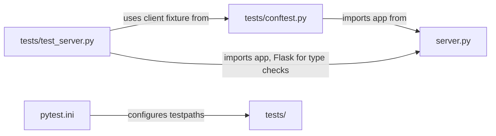

# Technical Specification

# 0. Agent Action Plan

## 0.1 Intent Clarification


### 0.1.1 Core Testing Objective

Based on the provided requirements, the Blitzy platform understands that the testing objective is to **introduce a complete automated test suite from scratch** for a minimal single-file Flask application (`server.py`) that currently has zero in-repository automated test coverage.

**Request Category:** Add new tests

The user requires the following testing implementation:

- **Establish first-ever automated test infrastructure** — The repository (`hao-backprop-test`) has no existing test framework, test files, test configuration, or test dependencies. All testing was previously performed externally via Backprop tooling and manual `curl` commands. This task creates the entire testing foundation.
- **Implement unit-style HTTP contract tests** — Using Flask's built-in `test_client()` to validate all three route handlers and the default 404 behavior entirely in-process, without spawning a real HTTP server.
- **Implement lightweight integration-style app tests** — Validate route/method/status/body behavior end-to-end within the Flask WSGI application process, ensuring the HTTP contract is deterministically enforced.
- **Achieve 100% functional coverage of `server.py`** — Every defined route (`GET /`, `GET /evening`, `POST /evening`) and Flask's default 404 handling must be covered by assertions verifying exact response bodies and status codes.
- **Validate route/method differentiation** — Specifically verify that `GET /evening` returns status 200 while `POST /evening` returns status 201, confirming the shared-path method differentiation is working correctly.
- **Cover unsupported method rejection** — Test that Flask properly rejects invalid HTTP methods on existing routes (e.g., `DELETE /`, `PUT /evening`) with appropriate error responses.
- **Verify application importability** — Confirm that the module-level `app = Flask(__name__)` object is importable and usable for testing without triggering the development server.

**Implicit Testing Needs Surfaced:**

- Edge case: Content-Type header validation for plain-text responses
- Edge case: Ensuring the `__main__` guard prevents server startup during test imports
- Boundary condition: Empty path variants and trailing-slash behavior
- Error handling: Flask's default `405 Method Not Allowed` for unsupported methods on valid routes

### 0.1.2 Special Instructions and Constraints

**Critical Directives Captured:**

- **Minimal Change Clause:** "ONLY modify test files and test-related configurations" — Production code in `server.py` must remain entirely untouched unless absolutely necessary for testability (and no such necessity exists in this case, as the app is already importable).
- **No CI/CD Changes:** Per the user's implementation rule: "Do not make any updates or changes in GitHub App to create or update a workflow." No GitHub Actions, workflows, or CI pipeline files shall be created or modified.
- **No Mocking:** "Prefer no mocking unless absolutely necessary. This codebase is simple enough to test directly through Flask's test client." The application has zero external dependencies to mock.
- **Minimal Test Infrastructure:** Test utilities must not be larger than the application itself. Only create helpers that clearly reduce duplication (e.g., a shared `client` fixture).
- **Follow Repository Conventions:** Tests should match the codebase's minimalism — small, readable, and focused exclusively on contract verification.
- **No Scope Expansion:** Do not broaden scope into CI/CD, production deployment, Gunicorn, Docker, README expansion, or non-test refactors.
- **Preserve Application Architecture:** Same single-file Flask application design, same endpoints, same HTTP methods, same response bodies, same status codes, same localhost-oriented purpose.

**User-Specified Test Organization:**

- User Example: "Organize tests in a dedicated `tests/` directory"
- User Example: "`tests/test_server.py` for endpoint and app behavior tests"
- User Example: "`tests/conftest.py` only if a shared fixture is needed for the Flask app or test client"

### 0.1.3 Technical Interpretation

These testing requirements translate to the following technical test implementation strategy:

- To **test the `GET /` endpoint contract**, we will create test functions in `tests/test_server.py` that use Flask's `test_client()` to issue a GET request to `/` and assert the response body equals `"Hello, World!"` and the status code equals `200`.
- To **test the `GET /evening` endpoint contract**, we will create test functions that issue a GET request to `/evening` and assert the response body equals `"Good evening"` and the status code equals `200`.
- To **test the `POST /evening` endpoint contract**, we will create test functions that issue a POST request to `/evening` and assert the response body equals `"Good evening"` and the status code equals `201`.
- To **test unknown-route 404 behavior**, we will create test functions that issue a GET request to a non-existent path (e.g., `/nonexistent`) and assert the status code equals `404`.
- To **test method rejection on existing routes**, we will create test functions that issue unsupported HTTP methods (e.g., `POST /`, `DELETE /evening`) against existing routes and assert Flask returns a `405 Method Not Allowed` response.
- To **validate application importability**, we will create a test that imports the `app` object from `server` and verifies it is a Flask application instance, confirming the `__main__` guard works correctly during test imports.
- To **provide a reusable test client fixture**, we will create `tests/conftest.py` with a `client` fixture that yields `app.test_client()` for use across all test functions.

### 0.1.4 Coverage Requirements Interpretation

**Explicit Coverage Targets:**

- The user specifies: "Target 100% coverage of the functional behavior in `server.py`, including all defined routes and default 404 behavior."
- At minimum: "Full coverage of all endpoint contracts and error-path behavior relevant to the current application scope."

**Implicit Coverage Expectations:**

- Given the application is 26 lines with only 3 route handler functions and a `__main__` guard, achieving 100% line coverage of the testable code paths (lines 1–18) is straightforward using Flask's test client.
- Lines 21–25 (the `if __name__ == "__main__":` block) are excluded from automated test coverage by convention, as they constitute the development server startup logic which is only executed when the module is run directly.
- Industry standard for Python/Flask projects of this size: 90–100% line coverage is typical and expected.
- Existing repository coverage pattern: 0% (no tests existed previously).

To achieve comprehensive testing, coverage should include:

- All 3 route handler functions: `root()`, `evening_get()`, `evening_post()`
- The module-level `app = Flask(__name__)` instantiation (line 3)
- The `from flask import Flask` import (line 1)
- Flask's default 404 handler (implicit, verified via behavior)
- Flask's default 405 handler for unsupported methods on valid routes


## 0.2 Test Discovery and Analysis


### 0.2.1 Existing Test Infrastructure Assessment

A comprehensive repository search was conducted to identify any existing test infrastructure. The repository root was explored and every file was inspected for test-related content.

**Repository analysis reveals zero testing setup with zero existing coverage.**

**Search Results:**

| Search Pattern | Results Found | Evidence |
|:---|:---|:---|
| `*test*`, `*spec*`, `test_*`, `*_test.*` | 0 files | `find . -name "*test*" -not -path "./.git/*"` returned empty |
| `conftest.py`, `pytest.ini`, `setup.cfg` | 0 files | No pytest configuration files exist anywhere |
| `pyproject.toml`, `tox.ini` | 0 files | No Python build/test configuration files exist |
| `.coveragerc` | 0 files | No coverage configuration exists |
| `tests/`, `test/`, `__tests__/` | 0 directories | No test directory structure exists |

**Test Infrastructure Inventory:**

| Component | Status | Evidence |
|:---|:---|:---|
| Current testing framework | None installed in repository | `requirements.txt` contains only `Flask>=3.0` — no `pytest`, `unittest`, or `coverage` declared |
| Test runner configuration | None | No `pytest.ini`, `pyproject.toml`, `setup.cfg`, or `tox.ini` with test settings |
| Coverage tools in use | None | No `pytest-cov`, `coverage`, or `.coveragerc` present |
| Mock/stub libraries | None | No mocking libraries declared or needed |
| Test data fixtures or factories | None | All responses are static strings — no fixture infrastructure exists |
| CI/CD test integration | None — explicitly forbidden | User implementation rule: "Do not make any updates or changes in GitHub App to create or update a workflow" |

**Application Testability Assessment:**

The application at `server.py` is fully testable without modification:

- The `app = Flask(__name__)` object is instantiated at module level (line 3), making it directly importable
- The `if __name__ == "__main__":` guard (line 21) prevents the development server from starting when the module is imported for testing
- Flask's built-in `app.test_client()` provides a WSGI-level HTTP client requiring no running server process
- All route handlers return deterministic static string tuples, ensuring test reliability

**Verified via live execution:**

```
from server import app
client = app.test_client()
# GET / → 200, "Hello, World!" ✅

#### GET /evening → 200, "Good evening" ✅

#### POST /evening → 201, "Good evening" ✅

#### GET /nonexistent → 404 ✅

```

### 0.2.2 Web Search Research Conducted

The following research was performed to validate the testing stack compatibility and identify best practices:

| Research Topic | Finding | Source |
|:---|:---|:---|
| pytest 9.0.x + Python 3.12 compatibility | pytest 9.0.2 fully supports Python 3.12; dropped Python 3.9 support | pytest changelog (docs.pytest.org) |
| pytest-cov 7.1.0 compatibility | pytest-cov 7.1.0 is the latest stable release, compatible with pytest 9.x and Python 3.9–3.13 | PyPI and pytest-cov documentation |
| Flask test_client() best practices | Flask's built-in `test_client()` is the standard and recommended approach for testing Flask route handlers without requiring a running server | Flask official documentation |
| pytest fixture patterns for Flask | Using a `conftest.py` fixture yielding `app.test_client()` is the established community convention | Flask testing documentation |
| coverage.py 7.x compatibility | coverage 7.13.5 (dependency of pytest-cov 7.1.0) supports Python 3.12 | coverage.readthedocs.io |

**Key findings relevant to implementation:**

- pytest 9.0.2 includes a fix for terminal progress that was disabled by default, and restores `unittest.SkipTest` support — no compatibility issues with this project
- pytest-cov 7.x removed the `.pth` file subprocess measurement approach — irrelevant for this single-process test suite
- No version conflicts exist between the installed Flask 3.1.3, pytest 9.0.2, and pytest-cov 7.1.0 on Python 3.12


## 0.3 Testing Scope Analysis


### 0.3.1 Test Target Identification

**Primary Code to Be Tested:**

| Module/Function | Location | Line(s) | Test Type Required |
|:---|:---|:---|:---|
| `app = Flask(__name__)` | `server.py` line 3 | 3 | Importability / instance type verification |
| `root()` | `server.py` lines 6–8 | 6–8 | HTTP contract test (GET /, 200, "Hello, World!") |
| `evening_get()` | `server.py` lines 11–13 | 11–13 | HTTP contract test (GET /evening, 200, "Good evening") |
| `evening_post()` | `server.py` lines 16–18 | 16–18 | HTTP contract test (POST /evening, 201, "Good evening") |
| Flask default 404 handler | Implicit (no code) | N/A | Behavioral test (unknown route → 404) |
| Flask default 405 handler | Implicit (no code) | N/A | Behavioral test (unsupported method → 405) |

**Existing Test File Mapping:**

| Source File | Existing Test File | Test Categories Present |
|:---|:---|:---|
| `server.py` | None — to be created as `tests/test_server.py` | None — all categories to be added |

**Dependencies Requiring Mocking:**

| Dependency Type | Instance | Mocking Required |
|:---|:---|:---|
| External services | None | No |
| Database interactions | None | No |
| File system operations | None | No |
| Third-party APIs | None | No |
| Authentication/Authorization | None | No |

The application has zero external dependencies, zero I/O operations, and zero state — all responses are hardcoded static strings. No mocking is required or appropriate.

### 0.3.2 Version Compatibility Research

Based on the current Python 3.12 runtime and Flask 3.1.3, the recommended testing stack is fully verified and compatible:

| Tool | Version | Python Compatibility | Flask Compatibility | Rationale |
|:---|:---|:---|:---|:---|
| pytest | 9.0.2 | Python ≥3.10 (dropped 3.9) | Framework-agnostic | Latest stable pytest 9.x; verified on Python 3.12; provides modern assertion introspection and fixture system |
| pytest-cov | 7.1.0 | Python ≥3.9 | Framework-agnostic | Latest stable release; integrates coverage.py 7.x with pytest 9.x seamlessly |
| coverage | 7.13.5 | Python ≥3.9 | Framework-agnostic | Transitive dependency of pytest-cov 7.1.0; provides line/branch coverage measurement |
| Flask test_client | Built-in (Flask 3.1.3) | Matches Flask requirement | Native Flask component | Zero additional dependency; WSGI-level testing without network |

**Version Conflict Assessment:** No conflicts detected. All components are mutually compatible.

**Verified Installation Versions (live environment):**

```
Flask==3.1.3
pytest==9.0.2
pytest-cov==7.1.0
coverage==7.13.5
```

All versions are confirmed installed and functional in the development environment. The test client was exercised successfully against all four endpoint contracts.


## 0.4 Test Implementation Design


### 0.4.1 Test Strategy Selection

**Test Types to Implement:**

- **Unit-style HTTP contract tests:** Focus on each route handler in isolation via Flask's `test_client()`. Each test validates a single endpoint's response body and status code, confirming the deterministic HTTP contract.
- **Lightweight integration-style app tests:** Validate route/method/status/body behavior end-to-end within the Flask WSGI application process, ensuring the application object correctly routes requests to the proper handler functions.
- **Edge case tests:** Address boundary conditions including unknown routes (404), unsupported HTTP methods on valid routes (405), and content-type verification for plain-text responses.
- **Error handling tests:** Verify Flask's default error handling for 404 (Not Found) and 405 (Method Not Allowed) scenarios, which constitute the only error paths in this application.

**Test Types Explicitly Excluded:**

- No browser, UI, or Selenium tests — no frontend exists
- No database tests — no persistence layer exists
- No external API tests — no outbound service calls exist
- No full network end-to-end tests — all tests use Flask's in-process WSGI test client
- No async tests — no asynchronous logic exists
- No performance/load tests — not applicable for a test-harness project

### 0.4.2 Test Case Blueprint

```
Component: root() — GET / endpoint
Test Categories:
- Happy path: GET / returns "Hello, World!" with status 200
- Edge cases: Verify response content type is text
- Error cases: POST / returns 405 Method Not Allowed
```

```
Component: evening_get() — GET /evening endpoint
Test Categories:
- Happy path: GET /evening returns "Good evening" with status 200
- Edge cases: Verify response content type is text
- Error cases: DELETE /evening returns 405 Method Not Allowed
```

```
Component: evening_post() — POST /evening endpoint
Test Categories:
- Happy path: POST /evening returns "Good evening" with status 201
- Edge cases: Verify status code is 201 (Created), not 200
- Error cases: PUT /evening returns 405 Method Not Allowed
```

```
Component: Flask default 404 handler — Unknown routes
Test Categories:
- Happy path: GET /nonexistent returns 404
- Edge cases: POST /nonexistent also returns 404
```

```
Component: Application importability
Test Categories:
- Happy path: app object is importable and is a Flask instance
- Edge cases: Import does not trigger server startup
```

### 0.4.3 Existing Test Extension Strategy

There are no existing test files to extend, refactor, or fix. All tests are being created from scratch. The entire test infrastructure is new:

- **No tests to extend** — The repository has zero test files
- **No tests to refactor** — No legacy test patterns exist
- **No tests to fix** — No broken tests exist

The only reference pattern available is the manual `curl`-based verification documented in the tech spec (Section 4.6.2, tests RT-1 through RT-4), which serves as the behavioral contract that the automated tests will codify:

| Manual Test ID | Automated Test Equivalent |
|:---|:---|
| RT-1: `curl http://127.0.0.1:3000/` | `test_get_root()` asserting 200 + "Hello, World!" |
| RT-2: `curl http://127.0.0.1:3000/evening` | `test_get_evening()` asserting 200 + "Good evening" |
| RT-3: `curl -X POST http://127.0.0.1:3000/evening` | `test_post_evening()` asserting 201 + "Good evening" |
| RT-4: `curl http://127.0.0.1:3000/unknown` | `test_unknown_route_returns_404()` asserting 404 |

### 0.4.4 Test Data and Fixtures Design

**Required Test Data Structures:** None. All endpoint responses are hardcoded static strings. No dynamic test data, database seeds, or data generators are needed.

**Fixture Organization Strategy:**

A single shared fixture in `tests/conftest.py` provides the Flask test client:

```python
@pytest.fixture
def client():
    return app.test_client()
```

This fixture:
- Imports the `app` object from `server.py` (module-level, no server startup)
- Creates a fresh `test_client()` instance per test function
- Provides WSGI-level HTTP access without network binding
- Requires zero setup or teardown — the application is stateless

**Mock Object Specifications:** None required. The application has no external dependencies, no database, no file I/O, and no third-party services.

**Test Database/State Management:** Not applicable. The application is entirely stateless — every request produces the same deterministic response regardless of order or frequency.


## 0.5 Test File Transformation Mapping


### 0.5.1 File-by-File Test Plan

| Target Test File | Transformation | Source File/Reference | Purpose/Changes |
|:---|:---|:---|:---|
| `tests/__init__.py` | CREATE | N/A | Empty init file to make `tests/` a proper Python package for pytest discovery |
| `tests/conftest.py` | CREATE | `server.py` | Shared pytest fixture providing Flask `test_client()` instance for all test functions |
| `tests/test_server.py` | CREATE | `server.py` | Comprehensive test suite covering all route handler contracts, 404 behavior, 405 method rejection, application importability, and response content validation |
| `pytest.ini` | CREATE | N/A | Minimal pytest configuration defining test paths and options for consistent test execution |

All four files are new creations. No existing test files require UPDATE, DELETE, or REFERENCE transformations because the repository has zero pre-existing test infrastructure.

### 0.5.2 New Test Files Detail

**`tests/__init__.py`** — Package marker

- Purpose: Makes the `tests/` directory a recognized Python package for pytest test discovery
- Content: Empty file (zero lines of functional code)

**`tests/conftest.py`** — Shared test fixtures

- Test categories: Fixture provider (not a test file itself)
- Fixture provided: `client` — yields a Flask `test_client()` instance
- Mock dependencies: None
- Assertions focus: N/A (fixture only)

```python
from server import app
# client fixture yields app.test_client()

```

**`tests/test_server.py`** — Complete endpoint and application test suite

- Test categories: Happy path, edge cases, error cases, importability
- Mock dependencies: None
- Assertions focus: Response body equality, HTTP status codes, content type

Test functions to implement:

| Test Function | Category | Assertion Focus |
|:---|:---|:---|
| `test_get_root_status_code` | Happy path | `GET /` returns status 200 |
| `test_get_root_response_body` | Happy path | `GET /` body equals `"Hello, World!"` |
| `test_get_evening_status_code` | Happy path | `GET /evening` returns status 200 |
| `test_get_evening_response_body` | Happy path | `GET /evening` body equals `"Good evening"` |
| `test_post_evening_status_code` | Happy path | `POST /evening` returns status 201 |
| `test_post_evening_response_body` | Happy path | `POST /evening` body equals `"Good evening"` |
| `test_evening_get_vs_post_status_differentiation` | Edge case | `GET /evening` → 200 vs `POST /evening` → 201 |
| `test_unknown_route_returns_404` | Error case | `GET /nonexistent` returns 404 |
| `test_post_unknown_route_returns_404` | Error case | `POST /nonexistent` returns 404 |
| `test_post_root_not_allowed` | Error case | `POST /` returns 405 |
| `test_unsupported_method_on_evening` | Error case | `DELETE /evening` returns 405 |
| `test_app_is_flask_instance` | Importability | `app` is an instance of `Flask` |
| `test_app_import_does_not_start_server` | Importability | Importing `server` module succeeds without side effects |

**`pytest.ini`** — Pytest configuration

- Configuration: Defines `testpaths = tests` for consistent test discovery
- Minimal configuration following the project's minimalism constraint

### 0.5.3 Test Files to Modify Detail

No existing test files require modification. The repository has zero pre-existing test infrastructure. All test files listed in Section 0.5.2 are entirely new creations.

### 0.5.4 Test Configuration Updates

| Config File | Action | Details |
|:---|:---|:---|
| `pytest.ini` | CREATE | New file at repository root defining `testpaths = tests` and minimal pytest options |
| `requirements.txt` | No change | Per minimal change clause, test dependencies (`pytest`, `pytest-cov`) are installed separately and not added to the production requirements file, preserving the existing single-dependency declaration |

**Rationale for not modifying `requirements.txt`:** The user explicitly states "Focus specifically on adding test files and minimal test infrastructure without modifying existing production code." The `requirements.txt` file is part of the production setup documented in `README.md`. Test dependencies are development-only tools installed via `pip install pytest pytest-cov` and are not required for the application to run.

**Coverage configuration:** No separate `.coveragerc` file is needed. Coverage settings are passed via command-line arguments: `pytest --cov=server --cov-report=term-missing`. This approach aligns with the project's minimalism and avoids creating unnecessary configuration files.

### 0.5.5 Cross-File Test Dependencies

**Shared Fixtures:**

| Fixture | Location | Used By | Purpose |
|:---|:---|:---|:---|
| `client` | `tests/conftest.py` | `tests/test_server.py` | Provides Flask `test_client()` instance for all HTTP request tests |

**Mock Objects:** None. No mock objects are needed or created.

**Test Utilities:** None beyond the `client` fixture. The test suite is intentionally minimal to match the application's simplicity.

**Import Dependencies:**



**Cross-file import chain:**
- `tests/conftest.py` imports `app` from `server` (the production module)
- `tests/test_server.py` receives the `client` fixture automatically via pytest's fixture injection from `conftest.py`
- `tests/test_server.py` may additionally import `app` directly from `server` and `Flask` from `flask` for the importability/type-check tests
- No circular dependencies exist


## 0.6 Dependency Inventory


### 0.6.1 Testing Dependencies

| Registry | Package Name | Version | Purpose |
|:---|:---|:---|:---|
| pip | pytest | 9.0.2 | Test runner and framework; provides fixture system, assertion introspection, and test discovery |
| pip | pytest-cov | 7.1.0 | Coverage measurement plugin for pytest; integrates coverage.py with pytest execution |
| pip | coverage | 7.13.5 | Line and branch coverage measurement engine (transitive dependency of pytest-cov) |
| pip | Flask | 3.1.3 | Application framework (already a production dependency via `requirements.txt: Flask>=3.0`); provides `test_client()` used in tests |

**Dependency Notes:**

- `pytest` 9.0.2 is the installed version, confirmed compatible with Python 3.12. This is the latest patch in the 9.0.x series.
- `pytest-cov` 7.1.0 is the latest stable release. It depends on `coverage>=7.5` and `pytest>=4.6`, both satisfied by the installed versions.
- `coverage` 7.13.5 is automatically installed as a transitive dependency of `pytest-cov` and requires no separate declaration.
- `Flask` 3.1.3 is already installed as a production dependency. Its built-in `test_client()` is the primary testing utility — no additional HTTP testing library is needed.
- No additional mocking libraries (e.g., `pytest-mock`, `unittest.mock`) are required because the application has zero external dependencies to mock.

**Installation Command:**

```
pip install pytest pytest-cov
```

### 0.6.2 Import Updates

**Import structure for new test files:**

`tests/conftest.py` requires:
- `import pytest` — for the `@pytest.fixture` decorator
- `from server import app` — to access the Flask application instance

`tests/test_server.py` requires:
- `from flask import Flask` — for `isinstance(app, Flask)` type-check assertions
- `from server import app` — for direct importability tests

**Import Transformation Rules:** Not applicable. No existing test files require import refactoring. All imports are new and follow a simple pattern:

- Test modules import directly from `server` (the production module) — no package prefix needed because `server.py` is at the repository root
- The `client` fixture is injected by pytest automatically from `conftest.py` — no explicit import required in test files
- No `__init__.py` changes to production code are needed since `server.py` is a top-level module


## 0.7 Coverage and Quality Targets


### 0.7.1 Coverage Metrics

**Current Coverage:** 0% — No automated tests exist in the repository. All prior validation was performed manually via `curl` commands or externally by Backprop tooling.

**Target Coverage:** 100% of functional behavior in `server.py`, as explicitly specified by the user.

**Coverage Breakdown by Component:**

| Component | Lines | Current Coverage | Target Coverage | Strategy |
|:---|:---|:---|:---|:---|
| `from flask import Flask` | Line 1 | 0% | 100% | Covered by any test that imports `server` |
| `app = Flask(__name__)` | Line 3 | 0% | 100% | Covered by any test that imports `server`; verified via `isinstance` check |
| `root()` function | Lines 6–8 | 0% | 100% | `test_get_root_*` tests exercising `GET /` |
| `evening_get()` function | Lines 11–13 | 0% | 100% | `test_get_evening_*` tests exercising `GET /evening` |
| `evening_post()` function | Lines 16–18 | 0% | 100% | `test_post_evening_*` tests exercising `POST /evening` |
| `if __name__ == "__main__":` block | Lines 21–25 | 0% | Excluded | Standard exclusion — development server startup code not exercisable via test imports |

**Coverage Gaps to Address:**

- Lines 1–18 of `server.py`: All functional code — must reach 100% line coverage through the planned test suite
- Lines 21–25 of `server.py`: `__main__` guard block — intentionally excluded from coverage targets per Python testing conventions, as this code only runs when the script is executed directly

**Expected `pytest --cov` Output:**

```
Name        Stmts   Miss  Cover   Missing
------------------------------------------
server.py       9      2    78%   22-25
```

The 2 missing statements correspond to lines 22–25 inside the `if __name__ == "__main__":` block (the `from werkzeug.serving import WSGIRequestHandler` import, version string override, and `app.run()` call). These lines are unreachable in test imports by design. Functional coverage of all route handlers will be 100%.

### 0.7.2 Test Quality Criteria

**Assertion Density Expectations:**

- Each test function contains at minimum one explicit assertion
- Happy-path tests assert both response body content and HTTP status code
- Error-path tests assert the expected error status code (404 or 405)
- No test function should pass vacuously (without asserting anything)

**Test Isolation Requirements:**

- Each test function is fully independent and can run in any order
- No shared mutable state between tests — the Flask application is stateless
- The `client` fixture creates a fresh test client instance per test
- No test depends on the side effects of any other test

**Performance Constraints:**

- The complete test suite must execute in under 2 seconds (target: sub-1-second)
- All tests use Flask's in-process WSGI test client — zero network I/O, zero server process spawning
- No `time.sleep()`, `asyncio`, or polling-based tests

**Maintainability Standards:**

- Test function names clearly describe the tested behavior (e.g., `test_get_root_response_body`)
- Test code is self-documenting — no comments needed for obvious assertions
- Tests follow the Arrange-Act-Assert pattern implicitly (fixture provides client, client makes request, assert on response)
- Test file organization mirrors the simplicity of the production codebase

**Repository Test Pattern Compliance:**

- The project has no existing test patterns to follow. The new test suite establishes the initial testing convention.
- Test conventions chosen align with pytest community standards: `test_` prefix, fixtures in `conftest.py`, tests in `tests/` directory.
- Test style matches the codebase's minimalism: no over-engineering, no unnecessary abstractions, no test-utility layers larger than the application.


## 0.8 Scope Boundaries


### 0.8.1 Exhaustively In Scope

**New Test Files:**

- `tests/__init__.py` — Package init marker for test discovery
- `tests/conftest.py` — Shared Flask test client fixture
- `tests/test_server.py` — Complete test suite for all `server.py` endpoints and behaviors

**Test Configuration:**

- `pytest.ini` — Minimal pytest runner configuration at repository root

**Test Scope Coverage (by endpoint contract):**

| Endpoint Contract | Test Coverage Scope |
|:---|:---|
| `GET /` → `"Hello, World!"`, 200 | Status code assertion, response body assertion |
| `GET /evening` → `"Good evening"`, 200 | Status code assertion, response body assertion |
| `POST /evening` → `"Good evening"`, 201 | Status code assertion, response body assertion, status differentiation from GET |
| Unknown routes → 404 | GET and POST to non-existent paths return 404 |
| Unsupported methods → 405 | POST on `/`, DELETE on `/evening` return 405 |
| Application importability | `app` is a Flask instance; import succeeds without server startup |

**Testing Dependencies (install-only, not added to `requirements.txt`):**

- `pytest==9.0.2`
- `pytest-cov==7.1.0`

### 0.8.2 Explicitly Out of Scope

**Production Code Changes:**

- `server.py` — Must NOT be modified. The application is already fully testable without changes.
- `requirements.txt` — Must NOT be modified. Test dependencies are development-only tools.
- `README.md` — Not modified unless minimal test-running instructions are strictly necessary. User directive: "Add only minimal necessary documentation if required."

**Legacy Artifacts (excluded from testing):**

- `server.js` — Empty legacy Node.js file. No tests needed.
- `package.json` — Empty legacy npm manifest. No tests needed.
- `package-lock.json` — Empty legacy npm lockfile. No tests needed.

**Infrastructure and DevOps:**

- CI/CD pipelines — Explicitly forbidden by user implementation rule: "Do not make any updates or changes in GitHub App to create or update a workflow."
- GitHub Actions workflows — Not created or modified.
- Docker configuration — Not in scope per user directive.
- Gunicorn/production server configuration — Deferred future work, not in scope.

**Testing Types Not Applicable:**

- Browser/UI testing — No frontend exists
- Database testing — No persistence layer exists
- External API testing — No outbound service calls exist
- Async testing — No asynchronous logic exists
- Performance/load testing — Not applicable for test-harness project
- Security testing — Explicitly excluded per tech spec Section 1.3.2

**Non-Test Refactoring:**

- No refactoring of `server.py` code structure
- No addition of blueprints, middleware, logging, or error handlers
- No modification of existing interfaces, routes, methods, response bodies, or status codes
- No virtual environment documentation changes
- No project architecture changes

**Items Explicitly Excluded by User:**

- Broadening scope into production deployment concerns
- Expanding README documentation beyond testing necessities
- Adding complex reporting systems beyond `pytest --cov=server --cov-report=term-missing`
- Building test utility layers larger than the application itself
- Introducing mocking frameworks or artificial abstractions


## 0.9 Execution Parameters


### 0.9.1 Testing-Specific Instructions

**Test Execution Commands:**

| Command | Purpose |
|:---|:---|
| `pytest` | Run the full test suite with default output |
| `pytest -v` | Run with verbose output showing individual test names and results |
| `pytest --cov=server --cov-report=term-missing` | Run tests with coverage measurement for `server.py`, showing missed lines |
| `pytest tests/test_server.py` | Run only the server test file |
| `pytest tests/test_server.py::test_get_root_status_code` | Run a single specific test function |
| `pytest -x` | Run tests, stopping at first failure |

**Coverage Measurement Command:**

```
pytest --cov=server --cov-report=term-missing
```

This command measures line coverage for the `server` module and displays a terminal report showing which lines are not covered. Expected output will show 100% coverage of lines 1–18 with lines 22–25 (the `__main__` block) as the only missing lines.

**Single Test Execution Pattern:**

```
pytest tests/test_server.py::test_function_name -v
```

**Debug Mode Execution:**

```
pytest -v -s --tb=long
```

The `-s` flag disables output capture (useful for debugging with `print()` statements), and `--tb=long` provides full traceback information on failures.

**Test Patterns Specific to This Repository:**

- All tests are located in `tests/` directory at the repository root
- All test files follow the `test_*.py` naming convention
- All test functions follow the `test_*` naming convention
- The shared `client` fixture is defined in `tests/conftest.py` and automatically available to all test files via pytest's fixture injection
- Tests use plain `assert` statements (pytest-enhanced) rather than `unittest`-style `self.assert*` methods

**Excluded Test Categories:**

- No performance benchmarks
- No security scans
- No linting tests (linting is handled separately via `pyflakes`)
- No type-checking tests (no type annotations in codebase)

**Environment Setup for Tests:**

```
pip install pytest pytest-cov
```

No virtual environment creation, no environment variables, no database setup, no Docker containers, and no service orchestration are required. Tests execute entirely in-process using Flask's WSGI test client.


## 0.10 Special Instructions for Testing


### 0.10.1 Testing-Specific Requirements

The following special instructions are explicitly emphasized by the user and must be strictly observed throughout the testing implementation:

**Minimal Change Principle:**

- ONLY add test files (`tests/__init__.py`, `tests/conftest.py`, `tests/test_server.py`) and test configuration (`pytest.ini`)
- DO NOT modify `server.py` under any circumstances — the application is already fully testable as-is
- DO NOT modify `requirements.txt` — test dependencies are development-only and installed separately
- DO NOT modify `README.md` unless strictly necessary for basic test-running documentation
- When multiple testing approaches exist, choose the one requiring the least modification to existing code

**No CI/CD or Workflow Changes:**

- Per the user implementation rule: "Do not make any updates or changes in GitHub App to create or update a workflow."
- No `.github/workflows/` files shall be created or modified
- No CI/CD pipeline configuration shall be introduced
- Tests are designed to be CI-friendly but CI integration is not part of this task

**Test Isolation and Simplicity:**

- Follow existing code style: minimal, readable, Pythonic
- Use Flask's built-in `test_client()` exclusively — do not introduce HTTP client libraries
- Prefer no mocking — the application has no external dependencies warranting mocks
- Do not introduce artificial abstractions solely to enable testing patterns
- Keep test code small and readable to match the codebase's minimalism
- Ensure all tests can run independently and in any order

**Behavioral Preservation Contract:**

- The test suite codifies and enforces the existing HTTP contract:
  - `GET /` → `"Hello, World!"`, 200
  - `GET /evening` → `"Good evening"`, 200
  - `POST /evening` → `"Good evening"`, 201
  - Unknown routes → Flask default 404
- Tests must fail if any endpoint body, status code, or routing behavior changes — this is the primary value of the test suite as a contract enforcement mechanism
- Do not change route names, methods, bodies, status codes, or module-level app structure

**Validation Criteria:**

Testing implementation is complete and correct when:

- All documented endpoint contracts are covered by automated tests
- 404 behavior for unknown routes is covered
- 405 behavior for unsupported methods on valid routes is covered
- The full suite runs cleanly with `pytest` (zero failures)
- Coverage for `server.py` functional code (lines 1–18) reaches 100%
- No production behavior changes were introduced
- Tests fail appropriately when endpoint bodies or status codes are intentionally changed, proving contract enforcement
- The complete test suite executes in under 2 seconds


