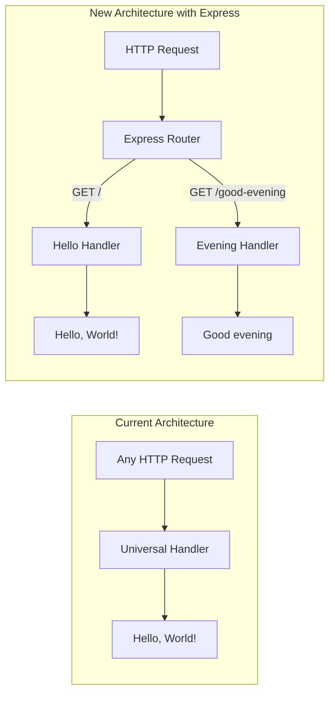

# Technical Specification

# 0. Agent Action Plan

## 0.1 Intent Clarification

### 0.1.1 Core Feature Objective

Based on the prompt, the Blitzy platform understands that the new feature requirement is to:

- **Integrate ExpressJS into an existing Node.js project**: The current project (`hello_world`) is a minimal HTTP server built with the Node.js built-in `http` module. It currently serves a single response of `"Hello, World!\n"` to all incoming HTTP requests regardless of method or path, bound to `127.0.0.1:3000`. The user wants to replace the raw `http` module server implementation with the ExpressJS framework.

- **Add a new HTTP endpoint returning "Good evening"**: A new route must be created that, when accessed, returns the plain-text response `"Good evening"`. This endpoint will coexist alongside the existing "Hello world" functionality, which must be preserved.

- **Preserve existing "Hello world" behavior**: The current universal response of `"Hello, World!"` must remain accessible via a dedicated route (the root path `/`), ensuring backward-compatible behavior for existing consumers.

**Implicit requirements detected:**

- The project must transition from a universal request handler (where every request returns the same response) to a route-based architecture with distinct endpoints
- The `package.json` must be updated to include Express as a dependency
- The `package-lock.json` will be regenerated upon dependency installation
- The `main` field in `package.json` currently points to a non-existent `index.js`; this should be corrected to point to `server.js`
- A `start` script should be added to `package.json` for standardized server startup via `npm start`
- The `README.md` should be updated to reflect the new endpoint and ExpressJS usage

### 0.1.2 Special Instructions and Constraints

- **User-specified rule**: "Do not make any updates or changes in GitHub App to create or update a workflow." — This means no `.github/workflows/` files should be created or modified.
- **Maintain tutorial simplicity**: The project is described as a tutorial, so the implementation should remain straightforward and educational in nature.
- **No design system specified**: This is a backend-only feature with no UI component requirements.
- **No Figma attachments**: No design assets are provided or required.
- **No environment variables or secrets**: The user has not provided any environment variables or secrets for this feature.

### 0.1.3 Technical Interpretation

These feature requirements translate to the following technical implementation strategy:

- To **integrate ExpressJS**, we will install the `express` npm package (v5.2.1, the latest stable release) as a project dependency and refactor `server.js` to import and use the Express application factory instead of the raw `http.createServer` pattern.

- To **preserve the "Hello world" endpoint**, we will create an Express route handler for `GET /` that responds with `"Hello, World!\n"` in plain text, maintaining identical response behavior to the current implementation.

- To **add the "Good evening" endpoint**, we will create a new Express route handler for `GET /good-evening` that responds with `"Good evening"` in plain text using the same response pattern.

- To **update project configuration**, we will modify `package.json` to declare Express as a dependency, fix the `main` entry point to `server.js`, and add a `start` script for convenient server execution.

- To **update documentation**, we will modify `README.md` to describe the available endpoints and how to run the server.

## 0.2 Repository Scope Discovery

### 0.2.1 Comprehensive File Analysis

The repository is a minimal Node.js project with exactly four files at the root level. Every file in the repository has been inspected and assessed for impact.

**Existing files requiring modification:**

| File Path | Current Purpose | Modification Required |
|-----------|----------------|----------------------|
| `server.js` | Minimal HTTP server using Node.js built-in `http` module; responds `"Hello, World!\n"` to all requests on `127.0.0.1:3000` | Refactor entirely to use ExpressJS; replace `http.createServer` with Express app; define `GET /` and `GET /good-evening` route handlers |
| `package.json` | npm manifest declaring project metadata; has zero dependencies, `main` points to non-existent `index.js`, no `start` script | Add `express` to `dependencies`; fix `main` to `server.js`; add `start` script (`node server.js`); update `description` |
| `package-lock.json` | npm lockfile with only root package metadata; no external dependency entries | Will be automatically regenerated by `npm install` when Express is added |
| `README.md` | Contains project heading `# hao-backprop-test` and description `test project for backprop integration.` | Update to document ExpressJS usage, available endpoints, and how to run the server |

**Integration point discovery:**

- **API endpoints**: Currently the server has no route discrimination — every HTTP request receives the same response. The refactoring introduces route-based handling with two distinct endpoints: `GET /` and `GET /good-evening`.
- **Database models/migrations**: Not applicable — no database in this project.
- **Service classes**: Not applicable — no service layer exists.
- **Controllers/handlers**: The single anonymous callback in `http.createServer` will be replaced by Express route handlers.
- **Middleware/interceptors**: Not applicable in the current codebase; no middleware is required for this feature.

### 0.2.2 Web Search Research Conducted

- **ExpressJS latest stable version**: Confirmed as v5.2.1 via the npm registry. Express 5.x is the current `latest` tag on npm, requires Node.js v18+, and the project's Node.js v20.20.1 runtime is fully compatible.
- **Express 5 routing patterns**: Express 5 supports standard `app.get(path, handler)` pattern for defining route handlers, consistent with the tutorial-level simplicity of this project.
- **Express 5 breaking changes from v4**: Express 5 drops support for Node.js versions before v18, removes deprecated API method signatures, and updates path-to-regexp. These changes do not affect this new integration since we are building fresh route handlers, not migrating from Express 4.

### 0.2.3 New File Requirements

No new source files need to be created for this feature. The existing `server.js` file will be refactored in-place to incorporate ExpressJS. The project's tutorial nature and minimal scope do not warrant the creation of separate route modules, service layers, or configuration files.

**New files — None required.** All changes are modifications to the four existing files.

**Rationale**: The project is an intentionally minimal tutorial server. Introducing additional files (e.g., separate route modules, middleware directories) would add unnecessary complexity that conflicts with the tutorial's educational purpose. The two route handlers will be defined directly within `server.js`.

## 0.3 Dependency Inventory

### 0.3.1 Private and Public Packages

The project currently has zero external dependencies. This feature introduces a single new dependency.

| Package Registry | Package Name | Version | Purpose |
|-----------------|-------------|---------|---------|
| npm | `express` | `^5.2.1` | Web application framework for Node.js; provides route-based HTTP request handling, middleware support, and response utilities to replace the raw `http` module implementation |

**Version justification**: Express v5.2.1 is the latest stable release confirmed on the npm registry. The `^5.2.1` semver range allows compatible minor and patch updates within the v5.x line. Express 5 requires Node.js v18 or higher; the project runs on Node.js v20.20.1, which is fully compatible.

**Transitive dependencies**: Installing Express v5.2.1 will bring in its dependency tree (including packages such as `body-parser`, `content-disposition`, `cookie`, `debug`, `finalhandler`, `path-to-regexp`, `qs`, `send`, `serve-static`, among others). These are all managed automatically by npm and recorded in `package-lock.json`.

### 0.3.2 Dependency Updates

**Import Updates**

The following file requires import changes:

- `server.js` — Replace the Node.js built-in `http` module import with the Express module import
  - Old: `const http = require('http');`
  - New: `const express = require('express');`

**External Reference Updates**

- `package.json` — Add `dependencies` block containing `"express": "^5.2.1"`
- `package-lock.json` — Automatically regenerated by `npm install` to include Express and all transitive dependencies
- `README.md` — Update project description to reference ExpressJS

**No CI/CD file changes**: Per the user's explicit rule, no GitHub workflow files will be created or modified.

## 0.4 Integration Analysis

### 0.4.1 Existing Code Touchpoints

**Direct modifications required:**

- **`server.js`** (entire file): This is the sole runtime source file in the repository. The complete request-handling logic must be refactored:
  - Remove `const http = require('http');` and replace with `const express = require('express');`
  - Remove `http.createServer(...)` invocation and replace with Express application instantiation (`const app = express();`)
  - Replace the universal anonymous request handler with two explicit route handlers:
    - `app.get('/', ...)` — responds with `"Hello, World!\n"`
    - `app.get('/good-evening', ...)` — responds with `"Good evening"`
  - Replace `server.listen(port, hostname, callback)` with `app.listen(port, callback)`
  - Preserve the existing `hostname` and `port` constants (`127.0.0.1` and `3000`)
  - Maintain the console startup log message

- **`package.json`** (lines 2–8): Multiple fields require updates:
  - Add `"dependencies": { "express": "^5.2.1" }` block
  - Change `"main": "index.js"` to `"main": "server.js"` to correctly reference the actual entry point
  - Add `"start": "node server.js"` to the `scripts` block for standardized startup
  - Update `"description"` to reflect ExpressJS usage

- **`package-lock.json`** (complete regeneration): Will be fully regenerated by `npm install` to include Express and its transitive dependency tree

- **`README.md`** (full content update): Update documentation to describe the two available endpoints and ExpressJS setup

### 0.4.2 Integration Flow

The following diagram illustrates how the integration transforms the request-handling architecture:



### 0.4.3 Behavioral Changes

| Aspect | Current Behavior | New Behavior |
|--------|-----------------|--------------|
| Framework | Node.js built-in `http` module | ExpressJS v5.2.1 |
| Routing | No routing — all requests return same response | Route-based: `GET /` and `GET /good-evening` |
| `GET /` response | `"Hello, World!\n"` (HTTP 200) | `"Hello, World!\n"` (HTTP 200) — preserved |
| `GET /good-evening` response | `"Hello, World!\n"` (HTTP 200) | `"Good evening"` (HTTP 200) — new |
| Unmatched routes | `"Hello, World!\n"` (HTTP 200) | Express default 404 response |
| Server binding | `127.0.0.1:3000` | `127.0.0.1:3000` — preserved |
| Content-Type | Explicit `text/plain` via `res.setHeader` | Automatic `text/html` via `res.send()` or explicit `text/plain` via `res.type('text').send()` |

**Database/Schema updates**: Not applicable — no database exists in this project.

**Dependency injections**: Not applicable — no dependency injection container exists.

## 0.5 Technical Implementation

### 0.5.1 File-by-File Execution Plan

Every file listed below MUST be modified during implementation. The files are organized into logical groups reflecting their execution order.

**Group 1 — Dependency Configuration:**

- **MODIFY: `package.json`** — Add Express dependency, fix entry point, add start script
  - Add `"dependencies": { "express": "^5.2.1" }` to the manifest
  - Change `"main": "index.js"` to `"main": "server.js"`
  - Add `"start": "node server.js"` to the `scripts` block
  - Update `"description"` to reflect ExpressJS usage

- **MODIFY: `package-lock.json`** — Regenerated automatically by running `npm install` after `package.json` is updated; will contain Express and all transitive dependencies with locked versions

**Group 2 — Core Feature Implementation:**

- **MODIFY: `server.js`** — Refactor from raw `http` module to Express application with route-based handling
  - Replace `require('http')` with `require('express')`
  - Create Express app instance via `const app = express();`
  - Define `GET /` route handler returning `"Hello, World!\n"`
  - Define `GET /good-evening` route handler returning `"Good evening"`
  - Use `app.listen(port, ...)` for server startup
  - Preserve port `3000` and console log startup message

**Group 3 — Documentation:**

- **MODIFY: `README.md`** — Update project documentation to describe the Express-based server, list available endpoints (`GET /` and `GET /good-evening`), and provide instructions for installation and running

### 0.5.2 Implementation Approach per File

The implementation follows a bottom-up approach, establishing the dependency foundation before modifying runtime code:

- **Step 1 — Establish dependency foundation**: Modify `package.json` to declare Express as a dependency and fix project metadata. Run `npm install` to install Express and regenerate `package-lock.json`.

- **Step 2 — Refactor core server**: Modify `server.js` to replace the raw `http` module pattern with Express. The refactored file will be concise, defining an Express application with two route handlers and a listener — consistent with the project's tutorial nature.

  Target structure for `server.js`:
  ```javascript
  const express = require('express');
  const app = express();
  ```

  Followed by route definitions and `app.listen()`.

- **Step 3 — Update documentation**: Modify `README.md` to describe the ExpressJS server, list endpoints, and provide run instructions.

### 0.5.3 User Interface Design

Not applicable. This is a backend-only HTTP server project with no user interface. All interactions occur via HTTP requests to the server's endpoints.

## 0.6 Scope Boundaries

### 0.6.1 Exhaustively In Scope

All files and changes required for this feature are listed below with their specific modification purposes:

**Source files:**
- `server.js` — Refactor to ExpressJS with `GET /` and `GET /good-evening` route handlers

**Configuration files:**
- `package.json` — Add Express dependency, fix `main` field, add `start` script
- `package-lock.json` — Regenerate with Express and transitive dependency tree

**Documentation files:**
- `README.md` — Update project description, endpoint documentation, and usage instructions

**Summary of all in-scope files (4 files total):**

| File | Action | Scope of Change |
|------|--------|----------------|
| `server.js` | MODIFY | Full refactor — replace `http` module with Express; add two route handlers |
| `package.json` | MODIFY | Add `dependencies`, fix `main`, add `start` script, update `description` |
| `package-lock.json` | MODIFY | Full regeneration via `npm install` |
| `README.md` | MODIFY | Full content update with endpoint documentation |

### 0.6.2 Explicitly Out of Scope

- **New source files**: No additional files (route modules, middleware, services, models) will be created — the tutorial-level project does not warrant them
- **Test files**: No test framework or test files exist in the project; adding test infrastructure is not part of this feature request
- **CI/CD workflows**: Per the user's explicit rule, no `.github/workflows/` files will be created or modified
- **Docker/containerization**: No `Dockerfile` or `docker-compose.yml` exists or is needed
- **Database**: No database layer exists or is needed for this feature
- **Environment variables**: No `.env` files or environment-specific configuration is required
- **Authentication/authorization**: Not relevant to this feature
- **Additional endpoints**: Only the two specified endpoints (`GET /` and `GET /good-evening`) are in scope; no other routes
- **Performance optimization**: Not applicable for this tutorial-level project
- **Refactoring of unrelated code**: The repository has no other code to refactor
- **TypeScript migration**: The project uses CommonJS JavaScript and will remain so

## 0.7 Rules for Feature Addition

### 0.7.1 User-Specified Rules

The following rule has been explicitly provided by the user and must be strictly observed:

- **No GitHub workflow modifications**: "Do not make any updates or changes in GitHub App to create or update a workflow." This rule prohibits the creation or modification of any files under `.github/workflows/` or any GitHub Actions configuration.

### 0.7.2 Derived Implementation Conventions

Based on analysis of the existing codebase, the following conventions must be maintained:

- **CommonJS module system**: The project uses `require()` syntax (CommonJS). All new code must continue using `require()` and `module.exports` — do not introduce ES module syntax (`import`/`export`).
- **Consistent variable naming**: The existing code uses `const` declarations with camelCase naming (e.g., `hostname`, `port`). New code must follow the same convention.
- **Port and host preservation**: The server must continue to bind to `127.0.0.1` on port `3000` to maintain behavioral compatibility.
- **Tutorial simplicity**: The project is described as a tutorial. All code changes must remain clear, minimal, and easy to understand — avoid introducing unnecessary abstraction layers, middleware patterns, or complex configurations.
- **Plain-text responses**: Both endpoints should serve plain-text content consistent with the existing response format.

## 0.8 References

### 0.8.1 Repository Files Searched

The following files and folders were comprehensively searched and analyzed to derive the conclusions in this Agent Action Plan:

| Path | Type | Key Findings |
|------|------|-------------|
| `` (root) | Folder | Contains exactly 4 files: `server.js`, `package.json`, `package-lock.json`, `README.md`; no subdirectories besides `.git` |
| `server.js` | File | Minimal HTTP server using Node.js built-in `http` module; binds to `127.0.0.1:3000`; returns `"Hello, World!\n"` to all requests |
| `package.json` | File | Project name `hello_world`, version `1.0.0`, no dependencies, `main` points to non-existent `index.js`, no `start` script |
| `package-lock.json` | File | lockfileVersion 3, only root package entry, no external dependencies |
| `README.md` | File | Heading `# hao-backprop-test`, description `test project for backprop integration.` |

### 0.8.2 Technical Specification Sections Reviewed

The following sections from the existing technical specification were retrieved and reviewed:

- **1.1 Executive Summary** — Confirmed project is a minimal Node.js HTTP server for Backprop integration testing
- **2.1 Feature Catalog** — Documented existing features F-001 (HTTP Server Initialization), F-002 (Universal Request Handler), F-003 (Test Harness Operations)
- **3.3 Frameworks & Libraries** — Confirmed intentional zero-framework design using only built-in `http` module
- **3.4 Open Source Dependencies** — Confirmed zero external dependencies with npm v9+ compatible lockfile
- **5.2 Component Details** — Detailed component architecture of current HTTP server, request handler, and test harness

### 0.8.3 External Research Conducted

| Research Topic | Source | Key Finding |
|---------------|--------|-------------|
| ExpressJS latest stable version | npm registry (`npmjs.com/package/express`) | Latest version is 5.2.1 |
| Express 5 Node.js compatibility | Express GitHub releases, expressjs.com | Requires Node.js v18+; project's v20.20.1 is compatible |
| Express 5 release status | expressjs.com blog | Express 5.1.0 became the `latest` tag on npm; v5 is now the actively supported line |

### 0.8.4 Attachments and Figma Assets

- **Attachments provided**: None
- **Figma URLs provided**: None
- **Environment files provided**: None
- **Environment variables**: None specified
- **Secrets**: None specified

