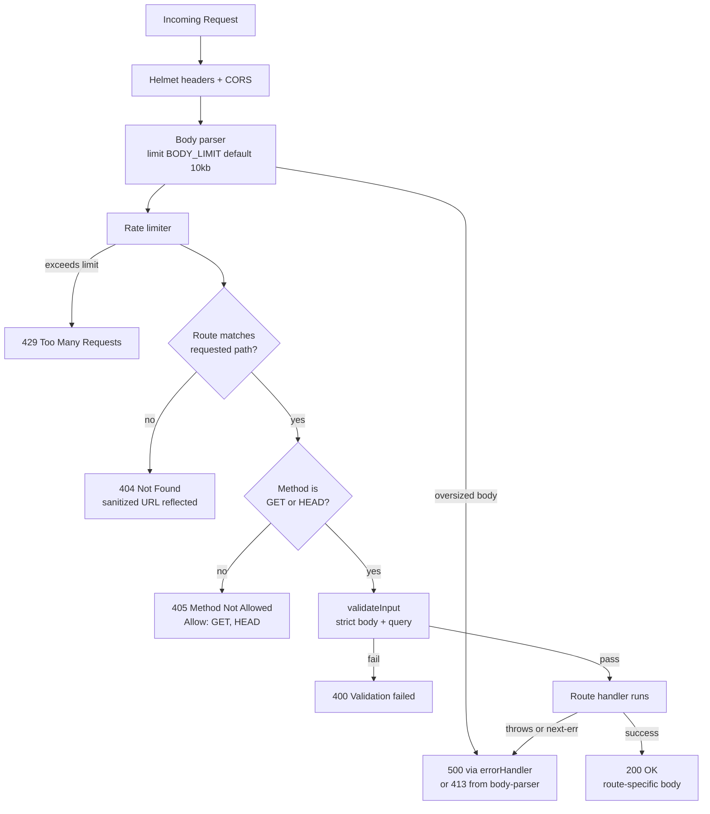
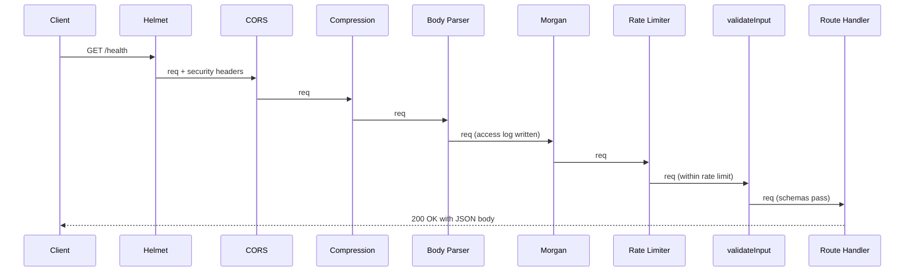

# REST API Reference

This document is the authoritative reference for every HTTP endpoint exposed by
the `hello_world` Node.js/Express service. The API is JSON-first with a single
`text/plain` exception at `GET /`, requires no authentication on any endpoint,
defaults to `http://localhost:3000`, and uses a single consistent error shape
(`{ status, statusCode, message }`) across 400, 404, 405, 429, and 500
responses. Every claim below is traceable to a source file in this repository.

> **Documentation owner:** This file is the canonical owner of HTTP contracts
> per the project's documentation plan. For middleware order and request
> lifecycle internals, see [`./architecture.md`](./architecture.md). For the
> security policy that underlies the error contracts described here, see
> [`./security.md`](./security.md). For per-module details, see
> [`../src/routes/README.md`](../src/routes/README.md) and
> [`../src/middleware/README.md`](../src/middleware/README.md).

## Table of Contents

- [Conventions](#conventions)
  - [Base URL](#base-url)
  - [HTTP Methods](#http-methods)
  - [Content Types](#content-types)
  - [Standard Error Shape](#standard-error-shape)
  - [Rate Limiting Headers](#rate-limiting-headers)
  - [Security Headers](#security-headers)
- [Endpoints](#endpoints)
  - [`GET /`](#get-)
  - [`GET /health`](#get-health)
  - [`GET /api`](#get-api)
  - [`GET /api/info`](#get-apiinfo)
- [Error Contracts](#error-contracts)
  - [400 Bad Request (Validation Failure)](#400-bad-request-validation-failure)
  - [404 Not Found](#404-not-found)
  - [405 Method Not Allowed](#405-method-not-allowed)
  - [429 Too Many Requests](#429-too-many-requests)
  - [500 Internal Server Error](#500-internal-server-error)
- [Status Code Routing](#status-code-routing)
- [Request Lifecycle](#request-lifecycle)
- [Limitations](#limitations)
- [Source Citations](#source-citations)

## Conventions

### Base URL

The default base URL for local development is `http://localhost:3000`. The
server binds to `0.0.0.0` (all interfaces) on port `3000` by default; operators
override these via the `HOST` and `PORT` environment variables.

| Setting | Default | Override                  | Source                                    |
|---------|---------|---------------------------|-------------------------------------------|
| Host    | `0.0.0.0` | `HOST` env var          | `src/config/index.js` line 27             |
| Port    | `3000`  | `PORT` env var            | `src/config/index.js` line 26             |

Because `0.0.0.0` resolves to the loopback interface for in-process clients,
local examples use `http://localhost:3000`.

Source: `src/config/index.js`, `.env.example`, `server.js`.

### HTTP Methods

Every defined route handler matches only `GET` (and the automatic `HEAD`
companion that Express derives from `router.get()`). All other methods are
explicitly rejected with `405 Method Not Allowed` by a `router.all()` catch-all
registered immediately after the corresponding `router.get()`.

Source: `src/routes/index.js` lines 54-60; `src/routes/health.js` lines 55-61;
`src/routes/api.js` lines 47-53 and 85-91.

### Content Types

| Endpoint        | Response Content-Type                 | Source                              |
|-----------------|---------------------------------------|-------------------------------------|
| `GET /`         | `text/plain; charset=utf-8`           | `src/routes/index.js` line 46       |
| `GET /health`   | `application/json; charset=utf-8`     | `src/routes/health.js` lines 42-48  |
| `GET /api`      | `application/json; charset=utf-8`     | `src/routes/api.js` lines 34-37     |
| `GET /api/info` | `application/json; charset=utf-8`     | `src/routes/api.js` lines 72-79     |
| All error bodies (400, 404, 405, 429, 500) | `application/json; charset=utf-8` | `src/middleware/*.js`, `src/routes/*.js`, `src/app.js` |

`GET /` is the only `text/plain` endpoint in the service. It is set explicitly
by `res.type('text/plain').send(...)`. All other endpoints use `res.json()`,
which yields `application/json; charset=utf-8` by Express default.

Source: `src/routes/index.js` line 46 (`res.type('text/plain').send(...)`);
`src/routes/health.js`, `src/routes/api.js`, `src/middleware/notFound.js`,
`src/middleware/errorHandler.js`, `src/middleware/validateInput.js`, and
`src/app.js` (all use `res.json(...)` for JSON bodies).

### Standard Error Shape

All non-success responses (400, 404, 405, 429, 500) share a single JSON shape:

```json
{
  "status": "error",
  "statusCode": 400,
  "message": "<human-readable description>"
}
```

In non-production environments (`NODE_ENV !== 'production'`), 500 responses
additionally include a `stack` field with the full error stack trace. In
production, the `stack` field is omitted and the `message` is masked to
`"Internal Server Error"` for 5xx errors to avoid information disclosure
(CWE-209).

Source: `src/middleware/errorHandler.js` lines 75-94;
`src/middleware/notFound.js` lines 47-51;
`src/middleware/validateInput.js` lines 77-81;
`src/app.js` lines 140-146 (rate-limit handler);
`src/routes/index.js` lines 54-60, `src/routes/health.js` lines 55-61,
`src/routes/api.js` lines 47-53 and 85-91 (405 handlers).

### Rate Limiting Headers

The service applies a per-IP rate limit using `express-rate-limit`. Every
response (success or 429) carries IETF draft-6 compliant `RateLimit-*` headers
because `standardHeaders: true` is set. Legacy `X-RateLimit-*` headers are
disabled because `legacyHeaders: false`.

| Header              | Description                                                    |
|---------------------|----------------------------------------------------------------|
| `RateLimit-Policy`  | The active rate-limit policy (e.g., `100;w=900`)               |
| `RateLimit-Limit`   | Maximum requests allowed in the current window                 |
| `RateLimit-Remaining` | Requests remaining in the current window                     |
| `RateLimit-Reset`   | Seconds until the rate-limit window resets                     |

Defaults: `100` requests per `900000 ms` (15 minutes) per IP. Operators tune
this via `RATE_LIMIT_MAX` and `RATE_LIMIT_WINDOW_MS`.

Source: `src/app.js` lines 135-148 (limiter configuration);
`src/config/index.js` lines 32-35 (`rateLimit.windowMs` default 900000,
`rateLimit.max` default 100).

### Security Headers

Every response also carries the Helmet-managed security header set, including
an API-hardened Content-Security-Policy (`default-src 'none'`,
`frame-ancestors 'none'`). The `X-Powered-By` header is suppressed by Helmet.
See [`./security.md`](./security.md) for the complete list and rationale.

Source: `src/app.js` lines 79-86.

## Endpoints

### `GET /`

The root welcome route. Returns a plain-text "Hello, World!" greeting with a
trailing newline. This is the only endpoint in the service whose response is
not JSON.

#### Request

```bash
curl -i http://localhost:3000/
```

- Path: `/`
- Method: `GET` (or `HEAD`)
- Query parameters: **none accepted** — the request is validated against
  `query: z.object({}).strict()`, which rejects every unknown key.
- Request body: **none accepted** — `body: z.object({}).strict().optional()`
  permits an absent body but rejects any body keys if a body is sent.

Source: `src/routes/index.js` line 44.

#### Response — 200 OK

| Attribute       | Value                                |
|-----------------|--------------------------------------|
| Status          | `200 OK`                             |
| Content-Type    | `text/plain; charset=utf-8`          |
| Body            | `Hello, World!\n` (14 bytes)         |

Raw HTTP exchange:

```bash
HTTP/1.1 200 OK
Content-Type: text/plain; charset=utf-8
Content-Length: 14

Hello, World!
```

> **Contract note (test-guarded):** The response body is **byte-identical** to
> the string `Hello, World!\n` — the trailing `\n` newline is REQUIRED. Removing
> or altering the newline breaks the documented contract and is guarded by
> `tests/routes/index.test.js` (which asserts `expect(res.text).toBe('Hello, World!\n')`).
> The `\n` preserves parity with the original `http.createServer()`
> implementation that this Express service replaced.

Source: `src/routes/index.js` line 46
(`res.type('text/plain').send('Hello, World!\n');`);
`tests/routes/index.test.js` (asserts `text/plain` content-type and exact
`Hello, World!\n` body with newline).

#### Response — 405 Method Not Allowed

Any method other than `GET` or `HEAD` is rejected with `405`. The response
includes the required `Allow: GET, HEAD` header per RFC 9110 §15.5.6.

```bash
curl -i -X POST http://localhost:3000/
```

```bash
HTTP/1.1 405 Method Not Allowed
Allow: GET, HEAD
Content-Type: application/json; charset=utf-8

{"status":"error","statusCode":405,"message":"Method Not Allowed"}
```

Source: `src/routes/index.js` lines 54-60.

#### Response — 400 Bad Request (Validation Error)

Sending any query parameter or unexpected body triggers a 400 from
`validateInput` before the route handler runs.

```bash
curl -i "http://localhost:3000/?foo=bar"
```

```json
{
  "status": "error",
  "statusCode": 400,
  "message": "Validation failed: query: Unrecognized key(s) in object: 'foo'"
}
```

Source: `src/middleware/validateInput.js` lines 62-82;
`src/routes/index.js` line 44 (Zod `query: z.object({}).strict()` schema).

### `GET /health`

Process health and runtime telemetry endpoint, intended for PM2 process
monitoring and external load balancer health probes. Returns JSON describing
the current process state.

#### Request

```bash
curl -i http://localhost:3000/health
```

- Path: `/health`
- Method: `GET` (or `HEAD`)
- Query parameters: **none accepted** — strict empty-object schema.
- Request body: **none accepted** — strict empty-object schema (optional).
- **Authentication: none.** This is deliberate — automated monitoring systems
  (PM2, load balancers, container orchestrators) must be able to probe the
  endpoint without credentials. The endpoint exposes only non-sensitive
  process telemetry.

Source: `src/routes/health.js` lines 8-9 (JSDoc), line 41 (validation schema).

#### Response — 200 OK

| Attribute       | Value                                  |
|-----------------|----------------------------------------|
| Status          | `200 OK`                               |
| Content-Type    | `application/json; charset=utf-8`      |

Example response body:

```json
{
  "status": "ok",
  "uptime": 12.345,
  "timestamp": "2024-05-20T14:22:11.042Z",
  "memory": {
    "rss": 52428800,
    "heapTotal": 33554432,
    "heapUsed": 22000000,
    "external": 1200000,
    "arrayBuffers": 60000
  },
  "nodeVersion": "v20.20.1"
}
```

Field reference (exactly five top-level fields — no other fields are returned):

| Field         | Type     | Meaning                                                     | Source                              |
|---------------|----------|-------------------------------------------------------------|-------------------------------------|
| `status`      | `string` | Always `"ok"` when the server is serving                    | `src/routes/health.js` line 43      |
| `uptime`      | `number` | Process uptime in seconds (fractional)                      | `src/routes/health.js` line 44      |
| `timestamp`   | `string` | Server wall-clock time as ISO 8601 (`YYYY-MM-DDTHH:mm:ss.sssZ`) | `src/routes/health.js` line 45  |
| `memory`      | `object` | Output of `process.memoryUsage()` in bytes (`rss`, `heapTotal`, `heapUsed`, `external`, `arrayBuffers`) | `src/routes/health.js` line 46 |
| `nodeVersion` | `string` | Value of `process.version`, e.g., `"v20.20.1"`              | `src/routes/health.js` line 47      |

> The `uptime`, `timestamp`, and `memory` values change on every call — they
> reflect live process state, not cached metrics.

Source: `src/routes/health.js` lines 42-48.

#### Response — 405 Method Not Allowed

Same shape as the root `GET /` 405 response. Always returns
`Allow: GET, HEAD`.

```bash
HTTP/1.1 405 Method Not Allowed
Allow: GET, HEAD
Content-Type: application/json; charset=utf-8

{"status":"error","statusCode":405,"message":"Method Not Allowed"}
```

Source: `src/routes/health.js` lines 55-61.

#### Response — 400 Bad Request (Validation Error)

Any query parameter triggers a 400 before the handler runs.

```bash
curl -i "http://localhost:3000/health?detail=true"
```

```json
{
  "status": "error",
  "statusCode": 400,
  "message": "Validation failed: query: Unrecognized key(s) in object: 'detail'"
}
```

Source: `src/middleware/validateInput.js` lines 62-82;
`src/routes/health.js` line 41.

### `GET /api`

API root welcome endpoint. Returns a JSON greeting that serves as the entry
point to the `/api/*` namespace.

#### Request

```bash
curl -i http://localhost:3000/api
```

- Path: `/api`
- Method: `GET` (or `HEAD`)
- Query parameters: **none accepted**.
- Request body: **none accepted**.

Source: `src/routes/api.js` line 33.

#### Response — 200 OK

| Attribute       | Value                                |
|-----------------|--------------------------------------|
| Status          | `200 OK`                             |
| Content-Type    | `application/json; charset=utf-8`    |

```json
{
  "status": "success",
  "message": "Welcome to the API"
}
```

| Field     | Type     | Meaning                       | Source                            |
|-----------|----------|-------------------------------|-----------------------------------|
| `status`  | `string` | Always `"success"`            | `src/routes/api.js` line 35       |
| `message` | `string` | Always `"Welcome to the API"` | `src/routes/api.js` line 36       |

Source: `src/routes/api.js` lines 33-37.

#### Response — 405 Method Not Allowed

```bash
curl -i -X DELETE http://localhost:3000/api
```

```bash
HTTP/1.1 405 Method Not Allowed
Allow: GET, HEAD
Content-Type: application/json; charset=utf-8

{"status":"error","statusCode":405,"message":"Method Not Allowed"}
```

Source: `src/routes/api.js` lines 47-53.

#### Response — 400 Bad Request (Validation Error)

Same shape as `GET /` 400. Triggered by unexpected query parameters.

Source: `src/middleware/validateInput.js` lines 62-82;
`src/routes/api.js` line 33.

### `GET /api/info`

Server metadata endpoint. Returns the running application version (read from
`package.json` at request time), the configured environment, and the Node.js
runtime version.

#### Request

```bash
curl -i http://localhost:3000/api/info
```

- Path: `/api/info`
- Method: `GET` (or `HEAD`)
- Query parameters: **none accepted**.
- Request body: **none accepted**.

Source: `src/routes/api.js` line 71.

#### Response — 200 OK

| Attribute       | Value                                  |
|-----------------|----------------------------------------|
| Status          | `200 OK`                               |
| Content-Type    | `application/json; charset=utf-8`      |

```json
{
  "status": "success",
  "data": {
    "version": "1.0.0",
    "environment": "development",
    "nodeVersion": "v20.20.1"
  }
}
```

Field reference. The `data` object contains exactly three fields — no other
fields are returned:

| Field               | Type     | Meaning                                                    | Source                            |
|---------------------|----------|------------------------------------------------------------|-----------------------------------|
| `status`            | `string` | Always `"success"`                                         | `src/routes/api.js` line 73       |
| `data.version`      | `string` | Read from `package.json` at request time (e.g., `"1.0.0"`) | `src/routes/api.js` line 75       |
| `data.environment` | `string` | Value of `config.env` (e.g., `"development"`, `"production"`) | `src/routes/api.js` line 76    |
| `data.nodeVersion` | `string` | Value of `process.version`, e.g., `"v20.20.1"`              | `src/routes/api.js` line 77       |

The `data.version` field is read dynamically from `require('../../package.json').version`
on every request, so a hot package.json change is reflected without a process
restart (though in practice `package.json` is read at module-load time by
Node's `require` cache and only re-evaluated on restart).

Source: `src/routes/api.js` lines 71-80.

#### Response — 405 Method Not Allowed

```bash
HTTP/1.1 405 Method Not Allowed
Allow: GET, HEAD
Content-Type: application/json; charset=utf-8

{"status":"error","statusCode":405,"message":"Method Not Allowed"}
```

Source: `src/routes/api.js` lines 85-91.

#### Response — 400 Bad Request (Validation Error)

Same shape as `GET /` 400. Triggered by unexpected query parameters.

Source: `src/middleware/validateInput.js` lines 62-82;
`src/routes/api.js` line 71.

## Error Contracts

The five error contracts below are produced by middleware layers shared across
all four endpoints. Each contract reuses the
[Standard Error Shape](#standard-error-shape) (`{ status, statusCode, message }`),
ensuring consumers can write a single error-parsing path.


### 400 Bad Request (Validation Failure)

Returned by `validateInput` when a request body or query string fails its Zod
schema check. Every GET endpoint applies a strict empty-object schema for both
`body` and `query`, so any unexpected key triggers a 400 before the route
handler runs.

Response shape:

```json
{
  "status": "error",
  "statusCode": 400,
  "message": "Validation failed: <field-path>: <message>; ..."
}
```

The `message` is built by joining each Zod error with `'; '`. Each segment is
formatted as `<key>.<dotted-field-path>: <zod-message>`. When the failure is at
the top level of a property (e.g., the whole `query` object is invalid), the
field path is just the property name itself.

Example messages:

- `Validation failed: query: Unrecognized key(s) in object: 'foo'`
- `Validation failed: body: Unrecognized key(s) in object: 'x'`

> The `message` is a single human-readable string, not a structured
> `errors: []` array. Consumers should treat it as opaque diagnostic text and
> rely on `statusCode === 400` for programmatic detection.

Source: `src/middleware/validateInput.js` lines 62-82 (formatter and response).

### 404 Not Found

Returned by the `notFound` middleware when no route matches the requested path.
This middleware is registered after all routes and before the error handler,
so it catches any unmatched URL that reached the application.

Response shape:

```json
{
  "status": "error",
  "statusCode": 404,
  "message": "Not Found - /<sanitized-path>"
}
```

The reflected path is HTML-entity encoded by `sanitizeUrl` to prevent reflected
content injection. Encoding rules (applied in order):

| Input character | Encoded form |
|-----------------|--------------|
| `&`             | `&amp;`      |
| `<`             | `&lt;`       |
| `>`             | `&gt;`       |
| `"`             | `&quot;`     |
| `'`             | `&#x27;`     |

Control characters and ANSI escape sequences are stripped before encoding. The
reflected URL is also capped at 2048 characters; anything longer is truncated
with a `...[truncated]` suffix.

Example — benign path:

```bash
curl -i http://localhost:3000/does/not/exist
```

```json
{
  "status": "error",
  "statusCode": 404,
  "message": "Not Found - /does/not/exist"
}
```

Example — HTML-unsafe characters are encoded:

```bash
curl -i 'http://localhost:3000/<script>'
```

```json
{
  "status": "error",
  "statusCode": 404,
  "message": "Not Found - /&lt;script&gt;"
}
```

> Consumers that need the original path can decode the HTML entities
> client-side, but they should generally rely on `statusCode === 404` and not
> parse the `message` for routing logic.

Source: `src/middleware/notFound.js` lines 42-52 (response);
`src/utils/sanitizer.js` lines 149-186 (`sanitizeUrl` implementation).

### 405 Method Not Allowed

Returned by each route's `router.all()` catch-all when a non-GET/HEAD method is
used. Always includes an `Allow: GET, HEAD` header per RFC 9110 §15.5.6, and
always has the verbatim message `"Method Not Allowed"`.

Response:

| Attribute       | Value                                |
|-----------------|--------------------------------------|
| Status          | `405 Method Not Allowed`             |
| Header          | `Allow: GET, HEAD`                   |
| Content-Type    | `application/json; charset=utf-8`    |

```json
{
  "status": "error",
  "statusCode": 405,
  "message": "Method Not Allowed"
}
```

Triggered on any of these paths when called with `POST`, `PUT`, `PATCH`,
`DELETE`, or any other method other than `GET`/`HEAD`:

- `/`
- `/health`
- `/api`
- `/api/info`

> Without these `router.all()` catch-alls, non-GET methods would bypass the
> per-route validation chain and fall through to the 404 handler, returning
> a misleading status code. The 405 contract preserves correct HTTP semantics.

Source: `src/routes/index.js` lines 54-60 (`/`);
`src/routes/health.js` lines 55-61 (`/health`);
`src/routes/api.js` lines 47-53 (`/api`) and 85-91 (`/api/info`).

### 429 Too Many Requests

Returned by the `express-rate-limit` middleware when an IP exceeds
`config.rateLimit.max` requests within `config.rateLimit.windowMs`.

| Setting          | Default     | Override env var          | Source                              |
|------------------|-------------|---------------------------|-------------------------------------|
| Max requests     | `100`       | `RATE_LIMIT_MAX`          | `src/config/index.js` line 34       |
| Window (ms)      | `900000`    | `RATE_LIMIT_WINDOW_MS`    | `src/config/index.js` line 33       |
| Window (minutes) | `15`        | derived                   | derived from window above           |

Response shape:

```json
{
  "status": "error",
  "statusCode": 429,
  "message": "Too many requests, please try again later."
}
```

The response also includes the standard `RateLimit-*` headers indicating the
client's current quota and reset time (see [Rate Limiting Headers](#rate-limiting-headers)).

> Clients implementing retry logic should observe `RateLimit-Reset` (seconds
> until the window resets) rather than blindly retrying. The IP-based limit
> applies to every endpoint, including `/health`, so high-frequency probes
> from a single source should stay well below 100 req / 15 min per IP.

Source: `src/app.js` lines 135-148 (limiter and custom JSON handler);
`src/config/index.js` lines 32-35 (rate-limit defaults).

### 500 Internal Server Error

Returned by the central `errorHandler` middleware when any earlier middleware,
route, or async route handler throws an error or invokes `next(err)`. Express 5
catches promise rejections from async handlers automatically and forwards them
here without manual `try/catch`.

Status code selection: the handler reads `err.statusCode || err.status || 500`,
so library-thrown errors that carry a status code preserve it; otherwise the
response is `500`.

#### Non-production (`NODE_ENV !== 'production'`)

```json
{
  "status": "error",
  "statusCode": 500,
  "message": "<original error message>",
  "stack": "<full stack trace from err.stack>"
}
```

The `stack` field aids debugging in development and test runs but is **never**
sent in production.

#### Production (`NODE_ENV === 'production'`)

```json
{
  "status": "error",
  "statusCode": 500,
  "message": "Internal Server Error"
}
```

The original `err.message` is masked to the literal string
`"Internal Server Error"` for any 5xx response. This is a deliberate CWE-209
mitigation: error messages may contain file paths, module names, connection
strings, or other internal details that should not be returned to clients.
The `stack` field is omitted.

Client errors (4xx) are not masked — their messages are preserved so that
API consumers can react to the specific failure mode.

Source: `src/middleware/errorHandler.js` lines 52-56 (status code chain),
lines 75-79 (5xx production masking),
lines 81-94 (response construction including conditional `stack`).
Cross-reference: [`./security.md`](./security.md) for CWE-209 details.

## Status Code Routing

The diagram below shows how an incoming request resolves to a specific status
code as it traverses the middleware pipeline. Decision branches are derived
from `src/app.js` (pipeline order), `src/middleware/validateInput.js`
(400 path), `src/middleware/notFound.js` (404 path), each route's
`router.all()` (405 path), the rate-limit handler in `src/app.js`
(429 path), and `src/middleware/errorHandler.js` (500 path).



> Note: `413 Payload Too Large` is the default Express body-parser response
> when a request body exceeds `BODY_LIMIT`. This is built-in Express behavior
> rather than a first-class custom contract in this service; it is mentioned
> here for completeness but not enumerated as a dedicated error contract.
> Source: `src/app.js` lines 112-113.

## Request Lifecycle

The sequence diagram below traces a single successful `GET /health` request
through the middleware pipeline in `src/app.js`.



Pipeline order is `Helmet → CORS → Compression → Body parsers → Morgan →
Rate limiter → Route → notFound → errorHandler`. The 404 (`notFound`) and 500
(`errorHandler`) terminal middleware are not shown above because a successful
request never reaches them.

Source: `src/app.js` lines 70-183 (full pipeline registration).

## Limitations

The following are explicit non-features of the service. Clients and operators
should plan around them.

- **No authentication or authorization layer.** All endpoints are public,
  including `/health`. `/health` is intentionally public so PM2 and load
  balancer probes do not require credentials (Source: `src/routes/health.js`
  lines 8-9).
- **No pagination, filtering, or sorting.** No list endpoints exist; every
  endpoint returns a fixed shape.
- **No WebSocket, Server-Sent Events, or streaming endpoints.** Every endpoint
  is a single request/response exchange.
- **No `trust proxy` setting.** Rate limiting and `req.ip` reflect the
  directly connecting peer, not the original client behind a reverse proxy.
  Operators deploying behind a load balancer or reverse proxy should be aware
  that `X-Forwarded-For` is not consulted; Source: `src/app.js` (no
  `app.set('trust proxy', ...)` is present).
- **Rate limit is per-process, in-memory.** In PM2 cluster mode the limit is
  per worker process, not shared across the cluster. With `instances: 'max'`
  the effective per-IP limit is approximately
  `RATE_LIMIT_MAX × <number of workers>` across the cluster.
- **No OpenAPI / Swagger specification.** This Markdown reference is
  authoritative. No machine-readable API descriptor is generated by the
  project.
- **No `Content-Type` negotiation.** Every endpoint returns a fixed
  `Content-Type` regardless of the client's `Accept` header.

Source: `src/routes/health.js` lines 8-9 (`/health` public by design);
`src/app.js` lines 135-148 (in-process rate limiter, no proxy trust);
`package.json` (no OpenAPI tooling listed).

## Source Citations

Every claim in this document is sourced from one or more of the following
files. Line numbers in the body of this document refer to the current
revision of these files.

- `src/routes/index.js` — root route (`GET /`) and 405 catch-all.
- `src/routes/health.js` — `/health` endpoint and 405 catch-all.
- `src/routes/api.js` — `/api`, `/api/info` endpoints and 405 catch-alls.
- `src/middleware/notFound.js` — 404 handler with sanitized URL reflection.
- `src/middleware/errorHandler.js` — 500 handler with CWE-209 masking and
  conditional stack inclusion.
- `src/middleware/validateInput.js` — 400 validation-failure handler.
- `src/app.js` — middleware pipeline, rate-limit configuration and 429
  handler, body-size limit, route mounting.
- `src/config/index.js` — runtime defaults (port, host, body limit, rate-limit
  window and max).
- `src/utils/sanitizer.js` — HTML-entity encoding used in 404 reflected URL.
- `tests/routes/index.test.js`, `tests/routes/health.test.js`,
  `tests/routes/api.test.js`, `tests/middleware/notFound.test.js`,
  `tests/middleware/errorHandler.test.js`,
  `tests/middleware/validateInput.test.js`, `tests/app.test.js` —
  authoritative contract assertions.

---

[Back to README](../README.md) · [Architecture](./architecture.md) ·
[Security](./security.md) · [Observability](./observability.md) ·
[Deployment](./deployment.md) · [Testing](./testing.md)

