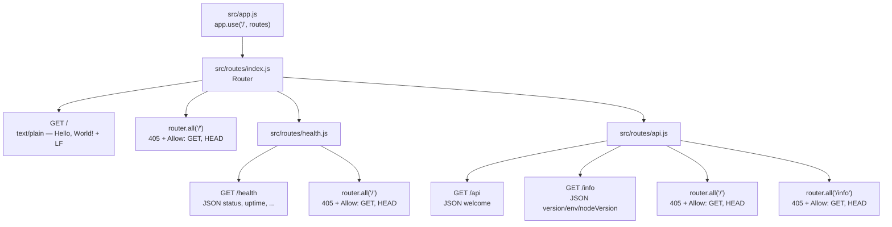
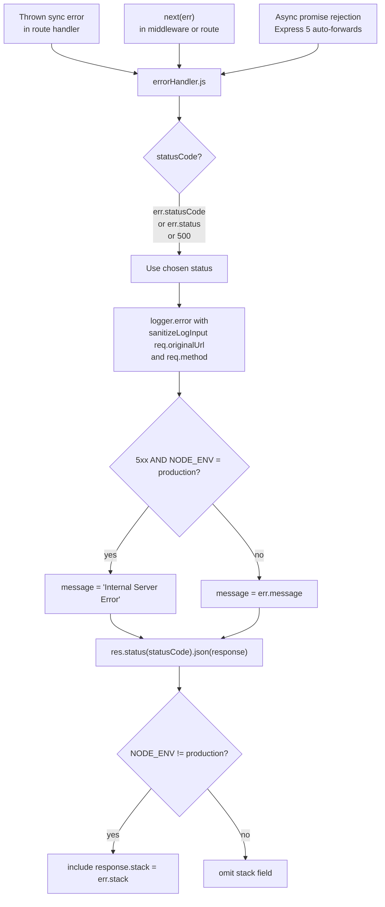
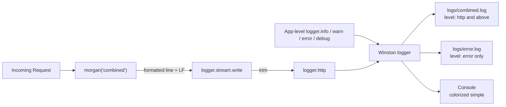
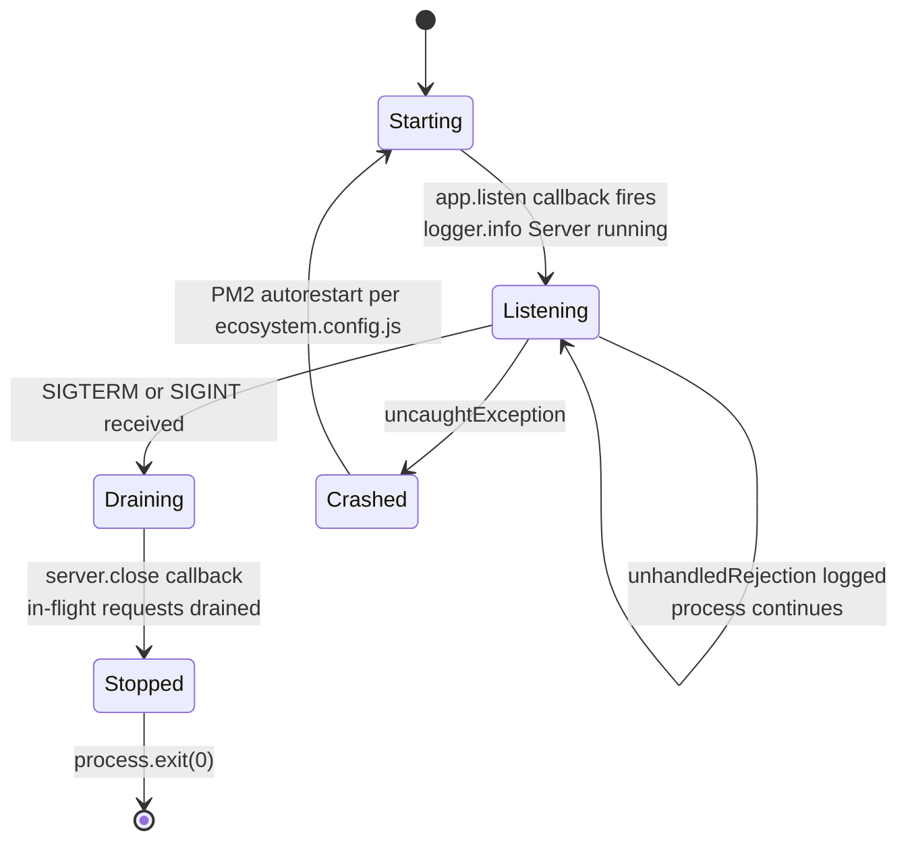
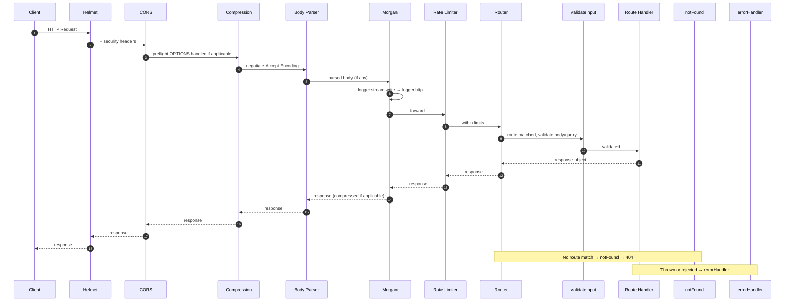

# Architecture Guide

The `hello_world` service is a single-process Node.js HTTP application built on
Node.js `>=18.0.0`, Express `^5.2.1`, and the CommonJS module system. The
runtime is composed of two bootstrap files (`server.js` for lifecycle and
`src/app.js` for composition), a strict 9-step middleware pipeline, three route
modules (`/`, `/health`, `/api`), unified Winston/Morgan logging, Zod-based
empty-body/empty-query request validation, frozen environment-driven
configuration, and PM2-friendly process signal handling. Every architectural
decision documented below is traceable to the source files cited inline.

This document is the canonical architectural reference for the service. For
endpoint contracts see [`./api.md`](./api.md), for security policy see
[`./security.md`](./security.md), for logging internals see
[`./observability.md`](./observability.md), for operational concerns see
[`./deployment.md`](./deployment.md), and for the Jest test suite see
[`./testing.md`](./testing.md).

## Overview

### Technology Stack

The technology stack below is taken verbatim from `package.json`. Versions are
range specifiers (`^x.y.z`) as recorded in the manifest; the lock file
(`package-lock.json`) holds the actual resolved versions.

| Concern | Package | Version | Role |
|---|---|---|---|
| Runtime | Node.js | `>=18.0.0` | JavaScript runtime (Source: `package.json` `engines.node`) |
| HTTP framework | `express` | `^5.2.1` | Routing + middleware pipeline (Source: `package.json` dependencies) |
| Security headers | `helmet` | `^8.1.0` | Hardened HTTP response headers (Source: `package.json` dependencies) |
| Cross-origin policy | `cors` | `^2.8.6` | CORS middleware (Source: `package.json` dependencies) |
| Compression | `compression` | `^1.8.1` | gzip/deflate response encoding (Source: `package.json` dependencies) |
| Access logs | `morgan` | `^1.10.1` | HTTP access log formatter, bridged into Winston (Source: `package.json`) |
| Rate limiting | `express-rate-limit` | `^8.3.1` | Per-IP request throttle (Source: `package.json` dependencies) |
| Structured logging | `winston` | `^3.19.0` | JSON file + colorized console transports (Source: `package.json`) |
| Input validation | `zod` | `^3.25.0` | Empty-body / empty-query schemas (Source: `package.json` dependencies) |
| Environment loader | `dotenv` | `^17.3.1` | Loads `.env` into `process.env` at startup (Source: `package.json`) |
| Process manager | PM2 | external (global) | Cluster-mode supervisor (Source: `ecosystem.config.js`) |
| Test runner | `jest` | `^30.3.0` | Unit / integration test runner (Source: `package.json` devDependencies) |
| HTTP test client | `supertest` | `^7.2.2` | In-memory HTTP assertion library (Source: `package.json` devDependencies) |

The service uses **CommonJS** throughout — every `.js` file uses
`require(...)` and `module.exports = ...`. There are no ES modules, no
TypeScript files, and no `import`/`export` statements anywhere in production
code (Source: `server.js`, `src/app.js`, `src/config/index.js`,
`src/routes/index.js`, `src/routes/health.js`, `src/routes/api.js`,
`src/middleware/errorHandler.js`, `src/middleware/notFound.js`,
`src/middleware/validateInput.js`, `src/utils/logger.js`,
`src/utils/sanitizer.js`, `ecosystem.config.js`).

### High-Level Topology

The runtime topology is intentionally minimal: a single Node.js process (or a
cluster of identical processes under PM2) hosting one Express application
instance that mounts a single aggregating router.

```mermaid
flowchart TD
    SRV["server.js<br/>bootstrap + signal handlers"]
    APP["src/app.js<br/>middleware pipeline + routes"]
    AGG["src/routes/index.js<br/>aggregator router"]
    ROOT["GET /<br/>router.all('/')"]
    HMOUNT["/health mount"]
    AMOUNT["/api mount"]
    HFILE["src/routes/health.js<br/>GET /<br/>router.all('/')"]
    AFILE["src/routes/api.js<br/>GET /<br/>GET /info<br/>router.all('/')<br/>router.all('/info')"]

    SRV -->|require + app.listen<br/>config.port, config.host| APP
    APP -->|app.use('/', routes)| AGG
    AGG --> ROOT
    AGG --> HMOUNT
    AGG --> AMOUNT
    HMOUNT --> HFILE
    AMOUNT --> AFILE
```

There is no database, no message queue, no external service dependency, no
worker thread pool, and no background scheduler. Every request is handled
synchronously by the Node.js event loop in the single owning worker (Source:
`src/app.js`, `src/routes/index.js`, `src/routes/health.js`,
`src/routes/api.js`).

## Bootstrap / App Separation

The service deliberately splits process bootstrap from application composition
across two files. This is sometimes called the "app factory" pattern in the
Express community and is a hard architectural invariant of this codebase.

### `server.js` Owns Lifecycle

`server.js` is the entry point declared by `package.json` `"main": "server.js"`
and by the PM2 ecosystem file's `script: 'server.js'` (Source: `package.json`
line 5; `ecosystem.config.js` line 34). It is responsible for **every
process-level concern** — environment loading, server binding, signal
handling, and fatal-error safety nets — and nothing else.

- Loads `.env` into `process.env` via `dotenv.config()` as the very first
  `require()` call (Source: `server.js` line 31).
- Imports the Express application, the centralized config, and the Winston
  logger (Source: `server.js` lines 40–42).
- Binds the app via `app.listen(config.port, config.host, cb)` and stores the
  returned `http.Server` instance for later use by signal handlers (Source:
  `server.js` line 56).
- Registers four `process.on(...)` handlers — `SIGTERM`, `SIGINT`,
  `unhandledRejection`, `uncaughtException` (Source: `server.js` lines 72, 80,
  104, 108).
- Exports nothing. The file ends with handler registrations and is not
  importable by other modules (Source: `server.js` end of file — no
  `module.exports`).

```js
// server.js (excerpt)
require('dotenv').config();             // Source: server.js line 31

const app = require('./src/app');       // Source: server.js line 40
const config = require('./src/config'); // Source: server.js line 41
const logger = require('./src/utils/logger'); // Source: server.js line 42

const server = app.listen(config.port, config.host, () => {
  logger.info(`Server running on http://${config.host}:${config.port} in ${config.env} mode`);
}); // Source: server.js lines 56-58
```

### `src/app.js` Owns Composition

`src/app.js` is a pure application factory. It creates the Express `app`
instance, registers every piece of middleware in a specific order, mounts the
single aggregator router, and finally exports the configured `app` (Source:
`src/app.js` lines 58, 79–183, 193).

- Creates `app = express()` (Source: `src/app.js` line 58).
- Registers the 9-step middleware pipeline at `src/app.js` lines 79–183 (each
  step is detailed below).
- Does **not** call `app.listen()` anywhere. There is no network side effect
  from `require('./src/app')` (Source: `src/app.js` lines 188–191, inline
  comment "The app is NOT started here").
- Exports the fully configured Express app: `module.exports = app` (Source:
  `src/app.js` line 193).

### Why the Split Exists

The split is enforced by the codebase's tests and by the rationale embedded in
`src/app.js` lines 19–22 and 188–191. The reasons:

- **Testability** — `tests/app.test.js` and `tests/routes/*.test.js` import
  the configured `app` from `src/app.js` and drive it with Supertest's
  in-memory request mechanism. Supertest does not need a bound socket — it
  works directly against the Express handler. If `app.listen()` lived inside
  `src/app.js`, importing the module would attempt to open a real TCP socket
  and tests would either fail or leak ports.
- **Bootstrap isolation** — `tests/server.test.js` uses
  `jest.mock('../src/app')` so it can verify `server.js`'s startup phases
  (dotenv loading order, listen call, signal handlers, exit codes) in
  isolation from any Express behavior.
- **Zero import side effects** — Because `src/app.js` only configures the app
  and never binds a port, any consumer can `require('./src/app')` without
  triggering network I/O (Source: `src/app.js` lines 188–191, inline comment
  "enabling this module to be imported independently for testing").

## Middleware Pipeline

### Pipeline Order Matters

The pipeline order in `src/app.js` is **a public contract**. The order is
encoded in `src/app.js` lines 79–183 and asserted by `tests/app.test.js`.
Reordering any step would silently change security, observability, or error
handling behavior — for example, placing the rate limiter before Helmet would
return rate-limit 429 responses without security headers; placing the body
parsers before CORS would crash preflight `OPTIONS` requests; placing the
error handler before the 404 catch-all would prevent unmatched routes from
reaching `notFound` (Source: `src/app.js` JSDoc header lines 8–17 and inline
comments lines 63–67).

The order MUST be:

1. Helmet (security headers)
2. CORS (cross-origin policy)
3. Compression (gzip/deflate)
4. Body parsers (JSON + urlencoded with size limits)
5. Morgan (HTTP access log, bridged to Winston)
6. Rate limiter (per-IP throttle)
7. Routes (root aggregator at `/`)
8. `notFound` (404 catch-all)
9. `errorHandler` (last-resort error middleware — must be last)

### Pipeline Diagram

```mermaid
flowchart LR
    R[Incoming Request] --> H[1. Helmet<br/>security headers + CSP]
    H --> C[2. CORS<br/>config.corsOrigin]
    C --> Z[3. Compression<br/>gzip / deflate]
    Z --> B[4. Body Parsers<br/>JSON + urlencoded<br/>limit = config.bodyLimit]
    B --> M[5. Morgan<br/>combined format → logger.stream]
    M --> L[6. Rate Limiter<br/>config.rateLimit<br/>custom 429 JSON]
    L --> T[7. Routes<br/>GET / · GET /health · GET /api · GET /api/info]
    T --> N[8. notFound<br/>404 JSON · sanitized URL]
    T --> E[9. errorHandler<br/>last-resort]
    N --> E
```



%% Derived verbatim from src/app.js lines 79-183. Do not reorder.

### Step-by-Step Rationale

#### 1. Helmet — Security Headers

Source: `src/app.js` lines 79–86.

Helmet is registered **first** so that no preceding middleware can produce a
response that lacks the security header set. The configuration overrides
Helmet's default `Content-Security-Policy` (which is web-page oriented) with
an API-only policy (Source: `src/app.js` inline comment lines 75–78).

```js
// src/app.js lines 79-86
app.use(helmet({
  contentSecurityPolicy: {
    directives: {
      defaultSrc: ["'none'"],
      frameAncestors: ["'none'"]
    }
  }
}));
```

- `default-src 'none'` — Disallows loading of any content source. Appropriate
  for a JSON API because no content (scripts, styles, frames, images) is ever
  loaded from API responses.
- `frame-ancestors 'none'` — Prevents the API from being embedded in any
  `<iframe>`, protecting against clickjacking even though the service does
  not render HTML.

Helmet additionally sets the standard hardening headers (Strict-Transport-
Security, X-Content-Type-Options, X-Frame-Options, etc.) per its defaults
(Source: `src/app.js` inline comment lines 70–74).

#### 2. CORS — Cross-Origin Resource Sharing

Source: `src/app.js` lines 92–94.

CORS is registered immediately after Helmet so that **preflight `OPTIONS`
requests are handled early** — before any downstream middleware that would
mistakenly treat them as application traffic. The allowed origin is read from
`config.corsOrigin` (Source: `src/app.js` line 93; `src/config/index.js` line
31 — default `'*'`).

```js
// src/app.js lines 92-94
app.use(cors({
  origin: config.corsOrigin
}));
```

#### 3. Compression

Source: `src/app.js` line 100.

Negotiates `Accept-Encoding` and applies gzip or deflate to response bodies.
Registered before body parsers so that response compression is active
regardless of how the response is produced downstream.

```js
// src/app.js line 100
app.use(compression());
```

#### 4. Body Parsers

Source: `src/app.js` lines 112–113.

Two body parsers are registered with **explicit size limits** sourced from
`config.bodyLimit` (default `'10kb'` per `src/config/index.js` line 33). The
explicit limit prevents payload-based DoS attacks (`CWE-400`) — without it,
Express 5 defaults to 100 KB, which is more than this service needs (Source:
`src/app.js` inline comment lines 107–111).

```js
// src/app.js lines 112-113
app.use(express.json({ limit: config.bodyLimit }));
app.use(express.urlencoded({ extended: false, limit: config.bodyLimit }));
```

`extended: false` selects Node.js's built-in `querystring` parser (smaller
attack surface than the `qs` library) (Source: `src/app.js` inline comment
lines 102–106).

#### 5. Morgan — HTTP Access Log

Source: `src/app.js` lines 121–123.

`morgan('combined', { stream: logger.stream })` bridges every incoming HTTP
request into the Winston logger at the `http` level. Registered **after** body
parsing (so the body size is known by the time Morgan formats the line) and
**before** rate limiting (so even rate-limit rejections at 429 are logged).

```js
// src/app.js lines 121-123
app.use(morgan('combined', {
  stream: logger.stream
}));
```

The `logger.stream` adapter is defined in `src/utils/logger.js` lines 111–115
and forwards each Morgan-formatted line to `logger.http(message.trim())`. See
[`./observability.md`](./observability.md) for the full logging pipeline.

#### 6. Rate Limiter

Source: `src/app.js` lines 135–148.

Throttles requests per source IP using the configured window and maximum from
`config.rateLimit` (defaults: `windowMs: 900000` ms / 15 minutes, `max: 100`
per window — Source: `src/config/index.js` lines 35–38).

```js
// src/app.js lines 135-148
const limiter = rateLimit({
  windowMs: config.rateLimit.windowMs,
  limit: config.rateLimit.max,
  standardHeaders: true,
  legacyHeaders: false,
  handler: (req, res) => {
    res.status(429).json({
      status: 'error',
      statusCode: 429,
      message: 'Too many requests, please try again later.'
    });
  }
});
app.use(limiter);
```

- `standardHeaders: true` — Emits IETF draft-6 `RateLimit-*` headers.
- `legacyHeaders: false` — Suppresses the deprecated `X-RateLimit-*` headers.
- Custom `handler` — Returns a JSON envelope **matching the same
  `{ status, statusCode, message }` shape** used by `errorHandler.js` and
  `notFound.js`. This consistency is deliberate (Source: `src/app.js` inline
  comment lines 131–134).

#### 7. Routes

Source: `src/app.js` line 161.

A single `app.use('/', routes)` call mounts the route aggregator at the root.
The aggregator (`src/routes/index.js`) internally defines the root welcome
route and mounts the `/health` and `/api` sub-routers (Source: `src/app.js`
inline comment lines 150–159).

```js
// src/app.js line 161
app.use('/', routes);
```

#### 8. notFound — 404 Catch-All

Source: `src/app.js` line 171.

Must come **after** all route handlers so that it only matches truly unmatched
paths. The handler is defined in `src/middleware/notFound.js` and:

- Logs the 404 event at the `warn` level using `sanitizeLogInput(req.originalUrl)`
  to prevent log injection — `CWE-117` (Source: `src/middleware/notFound.js`
  line 44).
- Sends a JSON response with status 404 whose `message` field reflects the
  request URL through `sanitizeUrl(req.originalUrl)` to prevent reflected
  HTML content injection (Source: `src/middleware/notFound.js` lines 47–51).

```js
// src/app.js line 171
app.use(notFound);
```

#### 9. errorHandler — Last-Resort Error Handler

Source: `src/app.js` line 183.

Must be the **last** `app.use()` call in the pipeline. Express identifies
error-handling middleware by its 4-argument signature `(err, req, res, next)`
and routes errors only to handlers that declare all four parameters (Source:
`src/middleware/errorHandler.js` JSDoc lines 14–18 and the function
declaration on line 51).

The handler:

- Picks the HTTP status code via the fallback chain
  `err.statusCode || err.status || 500` (Source: `src/middleware/errorHandler.js`
  line 56).
- Logs the error at the `error` level with the sanitized `req.originalUrl`
  and `req.method` to mitigate log injection (Source:
  `src/middleware/errorHandler.js` line 65).
- Masks 5xx messages to the generic string `'Internal Server Error'` when
  `process.env.NODE_ENV === 'production'`, while preserving the raw message
  for client (4xx) errors and in non-production environments — `CWE-209`
  information-disclosure defense (Source: `src/middleware/errorHandler.js`
  lines 75–79).
- Includes the `stack` field on the response body only when
  `NODE_ENV !== 'production'` (Source: `src/middleware/errorHandler.js`
  lines 92–94).

Express 5 automatically forwards rejected promises from async middleware and
route handlers to this error middleware — no manual `try/catch` wrapper is
required (Source: `src/middleware/errorHandler.js` JSDoc lines 20–23).

```js
// src/app.js line 183
app.use(errorHandler);
```

## Route Topology

### Aggregator Model

`src/routes/index.js` is the single Express `Router` instance mounted at `/`.
It owns the root `GET /` welcome route, a `router.all('/')` 405 method guard
for the root, and mounts the two sub-routers (Source: `src/routes/index.js`
lines 30, 44–47, 54–60, 67, 74).

| Step | Code | Source |
|---|---|---|
| Create router | `const router = express.Router()` | `src/routes/index.js` line 30 |
| Define `GET /` | `router.get('/', validateInput({ ... }), handler)` | lines 44–47 |
| 405 guard for `/` | `router.all('/', (req, res) => res.status(405).set('Allow', 'GET, HEAD').json({ ... }))` | lines 54–60 |
| Mount `/health` | `router.use('/health', healthRouter)` | line 67 |
| Mount `/api` | `router.use('/api', apiRouter)` | line 74 |

Each sub-router (`src/routes/health.js`, `src/routes/api.js`) follows the same
pattern: a `router.get('/', validateInput({...}), handler)` paired with a
`router.all('/', ...)` 405 guard. `src/routes/api.js` additionally defines
the `/info` endpoint with the same `get` + `all` pairing (Source:
`src/routes/health.js` lines 41, 55–61; `src/routes/api.js` lines 38, 52–58,
79–88, 95–101).

### Route Diagram



%% Derived verbatim from src/routes/index.js, health.js, api.js.

### Per-Route Validation and Method Guards

Every `router.get` in the routing layer applies the same defense-in-depth
validation factory:

```js
// From src/routes/index.js line 44, health.js line 41, api.js lines 38 and 79
router.get('/',
  validateInput({ body: z.object({}).strict().optional(), query: z.object({}).strict() }),
  (req, res) => { /* handler */ });
```

The schema `{ body: z.object({}).strict().optional(), query: z.object({}).strict() }`
expresses two intents (Source: `src/middleware/validateInput.js` JSDoc lines
21–26 and route files referenced above):

- `body: z.object({}).strict().optional()` — A body is allowed only if it is
  absent or strictly empty. Any unexpected key causes Zod to fail with
  `unrecognized_keys`.
- `query: z.object({}).strict()` — The query string must be strictly empty.
  Any unexpected key causes Zod to fail.

When validation fails, the middleware returns HTTP 400 with the standardized
envelope `{ status: 'error', statusCode: 400, message: 'Validation failed: <details>' }`
and **does not** invoke the route handler (Source:
`src/middleware/validateInput.js` lines 62–82).

Every `router.get` is paired with a `router.all(path, handler405)` whose
handler returns HTTP 405 with `Allow: GET, HEAD` and the same JSON envelope
(Source: `src/routes/index.js` lines 54–60; `src/routes/health.js` lines
55–61; `src/routes/api.js` lines 52–58, 95–101). The `router.all` declarations
sit **after** their matching `router.get` declarations because Express
matches the first declared handler that accepts the request method —
`router.get` claims GET/HEAD first, leaving `router.all` to claim every other
verb (Source: `src/routes/index.js` inline comment lines 49–53 citing
RFC 9110 §15.5.6).

## Error Flow

### Error Flow Diagram



%% Derived from src/middleware/errorHandler.js lines 51-99.

### Thrown Errors

Synchronous errors thrown inside a route handler propagate via Express's
internal error catcher to the registered error middleware (Source:
`src/middleware/errorHandler.js` JSDoc lines 6–8). Because the error handler
is the only 4-argument middleware in the pipeline, Express delivers every
synchronous throw to `errorHandler.js`.

### `next(err)` Calls

Any middleware or handler that calls `next(err)` skips the remaining
non-error middleware and enters Express's error chain. The pipeline then
proceeds directly to the next 4-argument handler — `errorHandler.js` —
because no other error middleware is registered (Source: `src/app.js` line
183 is the only `app.use(errorHandler)` call).

### Async Promise Rejections (Express 5)

Express 5 natively awaits async middleware and route handlers and forwards
their rejected promises to the error handler. No `asyncHandler` wrapper or
`.catch(next)` is needed for this codebase to capture async failures (Source:
`src/middleware/errorHandler.js` JSDoc lines 20–23).

### Production Masking

Source: `src/middleware/errorHandler.js` lines 75–79.

```js
// src/middleware/errorHandler.js lines 75-79
const isServerError = statusCode >= 500;
const isProduction = process.env.NODE_ENV === 'production';
const message = (isServerError && isProduction)
  ? 'Internal Server Error'
  : (err.message || 'Internal Server Error');
```

The combined condition `(isServerError && isProduction)` is the masking trigger.
Client errors (4xx) keep their original `err.message` in every environment, so
that callers receive actionable diagnostics. Server errors (5xx) keep their
original message in development and test environments (where stack traces are
also returned per `src/middleware/errorHandler.js` lines 92–94), and only get
masked in production. This satisfies `CWE-209` (Information Exposure Through
Error Message) without losing debuggability outside production (Source:
`src/middleware/errorHandler.js` JSDoc lines 30–34 and inline comment
lines 70–74).

## Configuration Loading Order

### Why `dotenv` Runs First

`src/config/index.js` reads `process.env` during module initialization — every
field of the exported object is computed at `require()` time (Source:
`src/config/index.js` lines 26–39). If `dotenv.config()` were called **after**
`require('./src/config')`, the config module would see only the variables
that the shell already exported, and any `.env`-only overrides would be
ignored.

`server.js` enforces the correct order:

```js
// server.js — startup order (excerpt)
require('dotenv').config();                     // line 31 — MUST be first
const app = require('./src/app');               // line 40
const config = require('./src/config');         // line 41
const logger = require('./src/utils/logger');   // line 42
```

The five-phase startup is documented in `server.js` JSDoc lines 9–15 and
phase comments at lines 24–29, 33–39, 44–55, 60–70, and 88–102. Phase 1
explicitly states that `dotenv` must be loaded before any other `require()`
call (Source: `server.js` inline comment lines 27–30).

### Why Config Is Frozen

`src/config/index.js` exports a **doubly frozen** object:

```js
// src/config/index.js (excerpt)
const config = {
  env: process.env.NODE_ENV || 'development',
  port: parseIntSafe(process.env.PORT, 3000),
  host: process.env.HOST || '0.0.0.0',
  logLevel: process.env.LOG_LEVEL || 'debug',
  corsOrigin: process.env.CORS_ORIGIN || '*',
  bodyLimit: process.env.BODY_LIMIT || '10kb',
  rateLimit: Object.freeze({                   // line 35 — inner freeze
    windowMs: parseIntSafe(process.env.RATE_LIMIT_WINDOW_MS, 900000),
    max: parseIntSafe(process.env.RATE_LIMIT_MAX, 100),
  }),
};

module.exports = Object.freeze(config);        // line 42 — outer freeze
```

Two `Object.freeze` calls are deliberate. `Object.freeze(config)` only
shallow-freezes the outer object — the nested `rateLimit` object would remain
mutable. The inner `Object.freeze({ windowMs, max })` on line 35 ensures the
**deep** immutability that downstream modules rely on (Source:
`src/config/index.js` lines 35 and 42).

Rationale:

- **Runtime safety** — Prevents accidental mutation of configuration by
  downstream modules, tests, or future code. Configuration is read once at
  startup and is then immutable.
- **Defense against test pollution** — Without freezing, a single test that
  forgot to restore a mutated property could silently affect subsequent
  tests in the same Jest process.
- **`parseIntSafe` zero-preservation** — Numeric env vars go through
  `parseIntSafe(value, fallback)` (Source: `src/config/index.js` lines
  21–24), which uses an explicit `Number.isNaN` check instead of the more
  common `parseInt(val, 10) || fallback` pattern. This preserves a legitimate
  value of `0` (which is falsy) rather than substituting the fallback.

The full environment-variable contract (names, defaults, allowed values) is
owned by `src/config/README.md` and `.env.example`; see those files for
operator-facing details.

## Logging Architecture

The logger is constructed in `src/utils/logger.js` lines 35–93. Key facts
distilled here for architectural context; see [`./observability.md`](./observability.md)
for the full operator-facing reference.

- **Single Winston instance** — `winston.createLogger({...})` (Source:
  `src/utils/logger.js` line 35).
- **Level from config** — `level: config.logLevel` (Source: `src/utils/logger.js`
  line 40), which is `'debug'` in development and `'warn'` in production per
  `ecosystem.config.js` lines 108–113 (dev) and 130–135 (prod).
- **Default metadata** — `defaultMeta: { service: 'hello-world' }` attaches a
  service tag to every log line, supporting multi-service log aggregation
  (Source: `src/utils/logger.js` line 54).
- **Three transports** (Source: `src/utils/logger.js` lines 58–92):
  - `logs/combined.log` — file transport at `http` level and above
    (`http`, `info`, `warn`, `error`), 5 MB × 5 rotating files.
  - `logs/error.log` — file transport restricted to `error` level only,
    5 MB × 5 rotating files.
  - Console — colorized simple output for terminal readability, overrides
    the base JSON format used by the file transports.
- **Morgan bridge** — `logger.stream.write(message)` forwards each Morgan
  access line into `logger.http(message.trim())` (Source:
  `src/utils/logger.js` lines 111–115, 122). `.trim()` strips Morgan's
  trailing newline to avoid double-spaced log entries.



%% Derived from src/utils/logger.js and src/app.js lines 121-123.

## Process Lifecycle

The process lifecycle is owned entirely by `server.js`. The Express app
itself has no lifecycle — it is just a request handler. All transitions
below are encoded in `server.js` lines 31–111 and `ecosystem.config.js`
lines 67–71 (restart policy).

### Process Lifecycle Diagram



%% Derived from server.js lines 56-110 and ecosystem.config.js lines 67-71.

The states:

- **Starting** — `dotenv.config()` runs (Source: `server.js` line 31), modules
  are required (lines 40–42), and `app.listen(config.port, config.host, cb)`
  is invoked (line 56). The returned `http.Server` is stored in the `server`
  variable for use by signal handlers.
- **Listening** — The `app.listen` callback fires and `logger.info('Server
  running on http://...')` is emitted (Source: `server.js` line 57). At this
  point the process serves traffic.
- **Draining** — On `SIGTERM` (sent by PM2 during `pm2 reload` and
  `pm2 stop`) or `SIGINT` (Ctrl+C in an interactive terminal), the
  handler logs the signal and calls `server.close(cb)` (Source: `server.js`
  lines 72–78 and 80–86). `server.close` stops accepting new connections and
  waits for in-flight requests to finish.
- **Stopped** — Inside the `server.close` callback, `logger.info('Process
  terminated.')` is emitted and `process.exit(0)` exits cleanly (Source:
  `server.js` lines 74–77 and 82–85).
- **Crashed** — `process.on('uncaughtException', ...)` (Source: `server.js`
  lines 108–111) logs the error and calls `process.exit(1)` — exit code 1
  signals abnormal termination to PM2, which then auto-restarts the worker
  per `ecosystem.config.js` `autorestart: true` (line 67) with delay
  `restart_delay: 4000` (line 70) and cap `max_restarts: 10` (line 71).
- **unhandledRejection** — `process.on('unhandledRejection', ...)` (Source:
  `server.js` lines 104–106) **logs the rejection without exiting**.
  Unhandled promise rejections are recorded for investigation; the process
  continues serving traffic.

See [`./deployment.md`](./deployment.md) for the full PM2 operator workflow.

## Request Lifecycle

A single happy-path request traverses every middleware in declaration order.
On error or unmatched route, the path forks into `errorHandler` or `notFound`
respectively. Both the forward and backward (response) phases are shown
below.

### Request Lifecycle Diagram (sequence)



%% Derived from src/app.js lines 79-183 and routes/middleware modules.

Behavioral notes:

- The diagram shows the **happy path** where the request matches a route and
  validation passes. The two `Note over` regions document the two diverging
  paths: an unmatched route falls through every `app.use` chain until the
  `notFound` middleware (Source: `src/app.js` line 171), and any thrown,
  `next(err)`-forwarded, or async-rejected error falls through to
  `errorHandler` (Source: `src/app.js` line 183).
- Morgan logs the request as soon as the response finishes — its access-log
  line includes the final status code, so the Morgan arrow in the diagram
  represents the per-line `logger.stream.write` call that fires at response
  completion (Source: `src/app.js` lines 121–123; `src/utils/logger.js`
  lines 111–115).

## Limitations

The architecture documented above intentionally excludes several common
service concerns. These are not bugs; they are out-of-scope by design.

- **No authentication or authorization layer** — Every endpoint is unauthenticated.
  `/health` is unauthenticated specifically so it remains probe-friendly for
  PM2 and load balancers (Source: `src/routes/health.js` JSDoc lines 8–9).
- **No database layer** — The service is stateless. `GET /health` reports
  in-process metrics only (`process.uptime()`, `process.memoryUsage()`,
  `process.version`) (Source: `src/routes/health.js` lines 41–49).
- **No background workers, queues, or scheduled jobs** — Every request is
  handled synchronously by the Node.js event loop in one worker process
  (Source: `src/app.js`; no `setInterval`, `setTimeout`, `bull`, `agenda`,
  or worker-threads imports).
- **No distributed tracing** — There is no OpenTelemetry, Datadog APM, or
  similar instrumentation. Logs include the `service: 'hello-world'` tag
  but no `traceId` / `spanId` (Source: `src/utils/logger.js` line 54).
- **Single-host cluster only** — PM2 cluster mode (Source:
  `ecosystem.config.js` lines 46–47) forks one worker per CPU core on the
  current host. Cross-host scaling, container orchestration, and service
  meshes are out of scope of this codebase.
- **No custom async hook** — Beyond what Express 5 provides natively
  (`async/await` route handlers, automatic promise-rejection forwarding to
  `errorHandler`), there are no `AsyncLocalStorage` integrations, custom
  request-scoped contexts, or domain handlers (Source: `src/app.js`).
- **No file uploads** — Body parsers are limited to JSON and `urlencoded`
  with `extended: false` (Source: `src/app.js` lines 112–113). There is no
  `multipart/form-data` support.

## Source Citations

Every claim in this document is derived from the following files:

- `server.js` — bootstrap, signal handlers, exit codes.
- `src/app.js` — middleware pipeline composition.
- `src/config/index.js` — frozen configuration object and `parseIntSafe`.
- `src/routes/index.js` — root route, root 405 guard, sub-router mounts.
- `src/routes/health.js` — `/health` handler and 405 guard.
- `src/routes/api.js` — `/api`, `/api/info` handlers and 405 guards.
- `src/middleware/errorHandler.js` — central error middleware, masking logic.
- `src/middleware/notFound.js` — 404 catch-all, sanitized logging and response.
- `src/middleware/validateInput.js` — Zod schema factory, 400 envelope.
- `src/utils/logger.js` — Winston logger, transports, Morgan stream adapter.
- `src/utils/sanitizer.js` — `sanitizeLogInput`, `sanitizeUrl`.
- `ecosystem.config.js` — PM2 cluster, restart policy, env blocks.
- `package.json` — runtime engines and dependency versions.
- `tests/app.test.js` — pipeline order enforcement (referenced by `src/app.js`
  JSDoc note "must not be reordered").

## Related Documentation

- Module READMEs:
  [`../src/README.md`](../src/README.md) ·
  [`../src/config/README.md`](../src/config/README.md) ·
  [`../src/middleware/README.md`](../src/middleware/README.md) ·
  [`../src/routes/README.md`](../src/routes/README.md) ·
  [`../src/utils/README.md`](../src/utils/README.md)
- Operator guides:
  [`./api.md`](./api.md) ·
  [`./security.md`](./security.md) ·
  [`./observability.md`](./observability.md) ·
  [`./deployment.md`](./deployment.md) ·
  [`./testing.md`](./testing.md)

[Back to README](../README.md)

