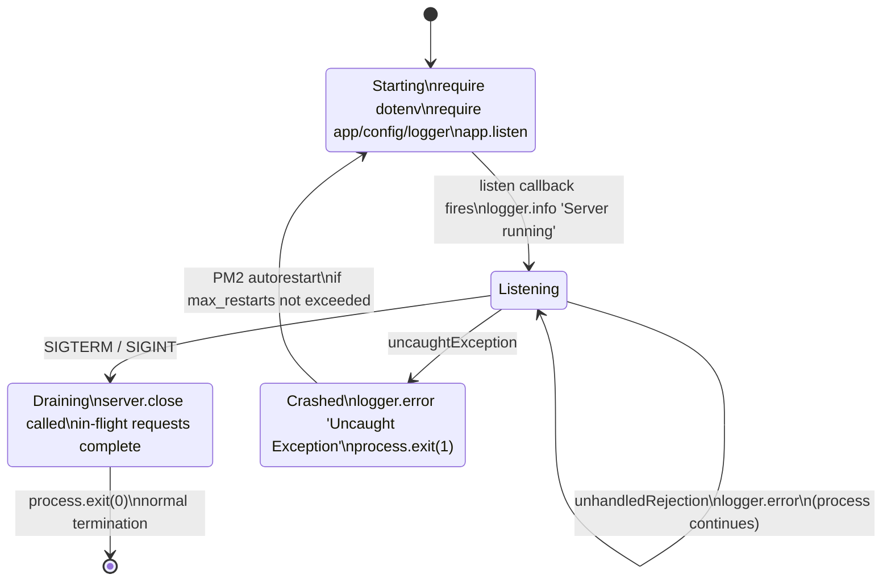

# Deployment Guide

This guide describes how to run the `hello-world` Express service in development
and production. The service targets Node.js 18 or higher (Source:
`package.json`) and can be launched either by invoking the entry point directly
with `node server.js` or by placing it under PM2 in cluster mode
(Source: `ecosystem.config.js`). The process honors `SIGTERM` and `SIGINT` for
graceful shutdown, exits with code `1` on `uncaughtException` to trigger PM2
auto-restart, and reads its runtime configuration from environment variables
loaded by `dotenv` at startup (Source: `server.js`, `src/config/index.js`).

For related operator topics, see [`./observability.md`](./observability.md) for
log destinations and tuning, [`./security.md`](./security.md) for the
production error-masking trigger (`NODE_ENV=production`), and
[`./api.md`](./api.md) for endpoint contracts used by smoke tests.

---

## Prerequisites

### Node.js and npm

The `engines` field in `package.json` requires Node.js 18 or higher
(Source: `package.json` `"engines": { "node": ">=18.0.0" }`). `npm` ships with
Node.js, so no separate install is required.

```bash
node --version    # must print v18.0.0 or higher
npm --version     # bundled with Node
```

Install application dependencies once after cloning the repository:

```bash
npm install
```

### PM2 (Optional for Direct Node)

PM2 is **only required** when using PM2-driven workflows: `npm run start:pm2`,
`npm run stop:pm2`, `npm run logs`, or any direct `pm2 ...` command (Source:
`package.json` scripts; `ecosystem.config.js`). Running the server with
`npm start`, `npm run dev`, or `node server.js` does **not** require PM2.

```bash
npm install -g pm2
pm2 --version
```

---

## Environment Configuration

### Copying the Template

The repository ships a documented template at `.env.example` and reads runtime
values from `.env` on startup (Source: `server.js` line 31 — `require('dotenv').config()`).
`.env` is listed in `.gitignore` and must not be committed; `.env.example` is
the versioned template (Source: `.gitignore`, `.env.example`).

```bash
cp .env.example .env
```

### Variable Reference

Defaults below come directly from `src/config/index.js`. When an environment
variable is unset, the value in the **Default** column applies (Source:
`src/config/index.js` lines 26–39).

| Variable | Default | Purpose | Source |
|---|---|---|---|
| `NODE_ENV` | `development` | App mode; `production` enables CWE-209 error masking | `src/config/index.js` line 27 |
| `PORT` | `3000` | HTTP listening port | `src/config/index.js` line 28 |
| `HOST` | `0.0.0.0` | Bind address; `0.0.0.0` listens on all interfaces | `src/config/index.js` line 29 |
| `LOG_LEVEL` | `debug` | Winston level; see [`./observability.md`](./observability.md) | `src/config/index.js` line 30 |
| `CORS_ORIGIN` | `*` | Allowed origin(s); narrow in production | `src/config/index.js` line 31 |
| `BODY_LIMIT` | `10kb` | Maximum request body size | `src/config/index.js` line 33 |
| `RATE_LIMIT_WINDOW_MS` | `900000` | Rate-limit window in ms (15 minutes) | `src/config/index.js` line 36 |
| `RATE_LIMIT_MAX` | `100` | Maximum requests per IP per window | `src/config/index.js` line 37 |

The exported config object is **frozen at module load** (Source:
`src/config/index.js` line 42 — `module.exports = Object.freeze(config)`). The
nested `rateLimit` object is also frozen (Source: `src/config/index.js` line 35).
Mutating environment variables at runtime has **no effect** until the process
restarts.

### Production Overrides

When PM2 is started with `--env production`, the `env_production` block
overrides the default `env` block (Source: `ecosystem.config.js` lines 130–135):

```js
env_production: {
  NODE_ENV: 'production',
  PORT: 3000,
  HOST: '0.0.0.0',
  LOG_LEVEL: 'warn',
}
```

Without `--env production`, the default `env` block applies (Source:
`ecosystem.config.js` lines 108–113):

```js
env: {
  NODE_ENV: 'development',
  PORT: 3000,
  HOST: '0.0.0.0',
  LOG_LEVEL: 'debug',
}
```

Direct execution with `node server.js` ignores both blocks — it reads only
`process.env`, which `dotenv` populates from `.env` (Source: `server.js` line 31).

---

## Direct Node Execution

### Starting

Both `npm start` and `npm run dev` alias to `node server.js` (Source:
`package.json` lines 7–8):

```bash
# Development (uses .env defaults; NODE_ENV from .env, typically 'development')
npm run dev

# Production-like (single process; sets NODE_ENV inline before node starts)
NODE_ENV=production npm start
```

On successful bind, the process logs (Source: `server.js` line 57):

```bash
Server running on http://0.0.0.0:3000 in development mode
```

### Stopping

In an interactive terminal, press **Ctrl+C** — this sends `SIGINT` to the
foreground process. The `SIGINT` handler closes the HTTP server gracefully and
then exits with code `0` (Source: `server.js` lines 80–86). Requests already
in flight complete before the process exits.

---

## PM2 Cluster Deployment

### Starting (Development)

```bash
pm2 start ecosystem.config.js
# Equivalent (same command, via npm)
npm run start:pm2
```

Source: `package.json` line 9 (`"start:pm2": "pm2 start ecosystem.config.js"`),
`ecosystem.config.js` line 7 header comment. With no `--env` flag, the default
`env` block applies (Source: `ecosystem.config.js` lines 108–113).

### Starting (Production)

```bash
pm2 start ecosystem.config.js --env production
```

The `--env production` flag activates the `env_production` block (Source:
`ecosystem.config.js` line 8 header comment; lines 130–135). `NODE_ENV` is set
to `production`, which enables 5xx error masking in the global error handler
(see [`./security.md`](./security.md)).

### Reloading, Stopping, and Status

```bash
pm2 reload hello-world        # zero-downtime reload (cluster mode)
pm2 stop hello-world          # stop all workers
pm2 delete hello-world        # remove from PM2 process list
pm2 status                    # cluster snapshot
pm2 logs hello-world          # tail merged worker logs
```

The `hello-world` identifier comes from the `name` field in
`ecosystem.config.js` (Source: `ecosystem.config.js` line 33). `pm2 reload`,
`pm2 stop`, and `pm2 delete` are documented in the header of
`ecosystem.config.js` (Source: `ecosystem.config.js` lines 7–11).

The repository also exposes `npm run stop:pm2` (aliased to
`pm2 stop ecosystem.config.js`) and `npm run logs` (aliased to `pm2 logs`)
(Source: `package.json` lines 10–11).

### Zero-Downtime Reload

`pm2 reload` performs a rolling restart across the cluster: PM2 stops and
re-forks workers one at a time while the remaining workers continue accepting
connections. This is enabled by `exec_mode: 'cluster'`, which activates
Node.js cluster integration (Source: `ecosystem.config.js` line 47; inline
comment lines 42–44).

---

## PM2 Configuration Reference

The table below enumerates every field set in `ecosystem.config.js`. All values
must match the file verbatim — they are **not** customizable through `.env` and
require a code change to alter.

| Field | Value | Purpose |
|---|---|---|
| `name` | `'hello-world'` | Kebab-case identifier in the PM2 process list (Source: `ecosystem.config.js` line 33) |
| `script` | `'server.js'` | Node.js entry point PM2 forks (Source: `ecosystem.config.js` line 34) |
| `instances` | `'max'` | One worker per logical CPU core (Source: `ecosystem.config.js` line 46) |
| `exec_mode` | `'cluster'` | Node.js cluster integration enables zero-downtime reloads (Source: `ecosystem.config.js` line 47) |
| `autorestart` | `true` | Restart workers on crash / unhandled exception / memory limit (Source: `ecosystem.config.js` line 67) |
| `watch` | `false` | File-watch is disabled to avoid full-cluster restart storms (Source: `ecosystem.config.js` line 68) |
| `max_memory_restart` | `'1G'` | Restart worker if heap usage exceeds 1 GB (Source: `ecosystem.config.js` line 69) |
| `restart_delay` | `4000` | Base delay (ms) between restart attempts; PM2 adds exponential backoff (Source: `ecosystem.config.js` line 70) |
| `max_restarts` | `10` | Upper bound on consecutive restart attempts (Source: `ecosystem.config.js` line 71) |
| `log_file` | `'./logs/pm2-combined.log'` | Combined stdout + stderr stream (Source: `ecosystem.config.js` line 88) |
| `out_file` | `'./logs/pm2-out.log'` | Stdout-only stream (Source: `ecosystem.config.js` line 89) |
| `error_file` | `'./logs/pm2-error.log'` | Stderr-only stream (Source: `ecosystem.config.js` line 90) |
| `log_date_format` | `'YYYY-MM-DD HH:mm:ss Z'` | Timestamp prefix on each PM2 log line (Source: `ecosystem.config.js` line 91) |
| `merge_logs` | `true` | All cluster workers share a single log file set (Source: `ecosystem.config.js` line 92) |
| `env.NODE_ENV` | `'development'` | Default env block, applied without `--env` flag (Source: `ecosystem.config.js` line 109) |
| `env.PORT` | `3000` | Default port (Source: `ecosystem.config.js` line 110) |
| `env.HOST` | `'0.0.0.0'` | Default bind address (Source: `ecosystem.config.js` line 111) |
| `env.LOG_LEVEL` | `'debug'` | Default Winston log level (Source: `ecosystem.config.js` line 112) |
| `env_production.NODE_ENV` | `'production'` | Activates 5xx error masking (Source: `ecosystem.config.js` line 131) |
| `env_production.PORT` | `3000` | Production port (Source: `ecosystem.config.js` line 132) |
| `env_production.HOST` | `'0.0.0.0'` | Production bind address (Source: `ecosystem.config.js` line 133) |
| `env_production.LOG_LEVEL` | `'warn'` | Reduced verbosity in production (Source: `ecosystem.config.js` line 134) |

---

## Restart Policy

### Automatic Restarts

`autorestart: true` causes PM2 to restart any worker that exits unexpectedly —
crashes, unhandled exceptions, and memory-limit terminations all qualify
(Source: `ecosystem.config.js` line 67; inline comment lines 52–53). A worker
that exits with code `0` (the graceful-shutdown path) is **not** restarted
because PM2 treats exit `0` as a deliberate termination.

### Memory-Based Restart

`max_memory_restart: '1G'` instructs PM2 to restart a worker whose heap usage
exceeds 1 GB (Source: `ecosystem.config.js` line 69; inline comment lines 57–59).
This guards the host against runaway memory growth from latent leaks.

### Restart Delay and Max Restarts

- `restart_delay: 4000` — 4-second base delay between restart attempts. PM2
  applies exponential backoff on top of this value to avoid rapid restart loops
  (Source: `ecosystem.config.js` line 70; inline comment lines 60–62).
- `max_restarts: 10` — upper bound on consecutive restart attempts. After 10
  failures in a row PM2 stops trying, preventing infinite loops when the app
  has a persistent startup failure (Source: `ecosystem.config.js` line 71;
  inline comment lines 63–65).

### Watch Mode (Disabled)

`watch: false` deliberately disables PM2's file-system watcher (Source:
`ecosystem.config.js` line 68; inline comment lines 54–56). In cluster mode,
file-watching would trigger a full-cluster restart on every file change — a
convenience appropriate for single-process development but destabilizing for
a production cluster. Use `npm run dev` (direct `node server.js`) plus an
external watcher for local change-driven workflows.

---

## Graceful Shutdown

### SIGTERM and SIGINT Handlers

Both handlers are registered at process startup (Source: `server.js` lines
72–86):

```js
process.on('SIGTERM', () => {
  logger.info('SIGTERM received. Shutting down gracefully...');
  server.close(() => {
    logger.info('Process terminated.');
    process.exit(0);
  });
});

process.on('SIGINT', () => {
  logger.info('SIGINT received. Shutting down gracefully...');
  server.close(() => {
    logger.info('Process terminated.');
    process.exit(0);
  });
});
```

Sources of each signal:

- **`SIGTERM`** — sent by PM2 during `pm2 reload` and `pm2 stop` (Source:
  `server.js` lines 63–65 inline comment).
- **`SIGINT`** — sent when **Ctrl+C** is pressed in an interactive terminal
  (Source: `server.js` lines 64–65 inline comment).

### Why `server.close()` Before `process.exit(0)`

`server.close()` stops the HTTP server from accepting **new** connections but
keeps existing connections open until their in-flight requests complete; the
callback fires only after every connection has drained (Source: `server.js`
lines 66–69 inline comment). Calling `process.exit(0)` from inside the callback
guarantees that no client sees a truncated response.

Exit code `0` signals normal termination. PM2 treats exit `0` as a deliberate
stop and does **not** auto-restart — this is the desired behavior for
`pm2 reload` and `pm2 stop`, which both deliver `SIGTERM`.

---

## Fatal Errors

### `uncaughtException` → Exit 1 → PM2 Auto-Restart

```js
process.on('uncaughtException', (error) => {
  logger.error('Uncaught Exception:', error);
  process.exit(1);
});
```

Source: `server.js` lines 108–111. After an uncaught synchronous throw, the
runtime state may be corrupted (open file descriptors, half-mutated objects,
unsettled promises), so the process **must** exit. Exit code `1` signals
abnormal termination; PM2 combines this with `autorestart: true` and
`max_restarts: 10` to fork a replacement worker automatically (Source:
`server.js` lines 98–101 inline comment; `ecosystem.config.js` lines 67, 71).

### `unhandledRejection` — Logged, Process Continues

```js
process.on('unhandledRejection', (reason, promise) => {
  logger.error('Unhandled Rejection', reason instanceof Error ? reason : new Error(String(reason)));
});
```

Source: `server.js` lines 104–106. Promise rejections with no `.catch()` are
logged for investigation but do **not** exit the process (Source: `server.js`
lines 95–97 inline comment). Rationale: most rejections are recoverable and
should not take down a worker serving unrelated traffic. This explicitly
overrides the Node.js 15+ default, which terminates the process on unhandled
rejections.

---

## Process Lifecycle Diagram



The `Crashed → Starting` transition is performed by PM2, not by the Node
process itself. With direct `node server.js`, an `uncaughtException` exits the
process and nothing restarts it.

---

## Operator Runbook

### Smoke Test

After starting the service (direct or under PM2), confirm each public endpoint
responds as documented in [`./api.md`](./api.md):

```bash
curl -i http://localhost:3000/
# Expect: HTTP/1.1 200 OK, Content-Type: text/plain, body: Hello, World!

curl -s http://localhost:3000/health | jq .
# Expect JSON with status="ok", uptime > 0, timestamp, memory, nodeVersion

curl -s http://localhost:3000/api | jq .
# Expect JSON: {"status":"success","message":"Welcome to the API"}

curl -s http://localhost:3000/api/info | jq .
# Expect JSON with data.version, data.environment, data.nodeVersion
```

Endpoint contracts are defined in `src/routes/index.js` (root plain-text
greeting), `src/routes/health.js` (health JSON), and `src/routes/api.js`
(`/api` and `/api/info` JSON).

### Checking Status and Logs

```bash
pm2 status                    # cluster snapshot — workers, restarts, memory
pm2 logs hello-world          # tail merged worker logs from PM2
tail -f logs/combined.log     # Winston JSON application log (http+ level)
tail -f logs/error.log        # Winston error-only stream
```

The Winston file transports write to `logs/combined.log` (level `http` and
above, rotating at 5 MB × 5 files) and `logs/error.log` (level `error` only,
rotating at 5 MB × 5 files) (Source: `src/utils/logger.js` lines 64–80). PM2's
own logs at `logs/pm2-combined.log`, `logs/pm2-out.log`, and
`logs/pm2-error.log` are separate from Winston output (Source:
`ecosystem.config.js` lines 88–90). See [`./observability.md`](./observability.md)
for the full logging architecture.

### Rolling Environment Changes

1. Edit `.env` (or set environment variables at the deployment platform level).
2. Reload the cluster with **zero downtime**:

   ```bash
   pm2 reload hello-world
   ```

   Or perform a full restart:

   ```bash
   pm2 restart hello-world
   ```

3. The frozen config object is re-read on every process start (Source:
   `src/config/index.js` line 42). Mutating `process.env` in a running worker
   has no effect on the existing frozen config.

---

## Limitations

- No load balancer or reverse-proxy configuration is included. Operators
  exposing the service publicly must provide one externally.
- TLS is **not** terminated inside the Node process. Terminate TLS at a
  reverse proxy (nginx, HAProxy, cloud load balancer).
- PM2 does **not** rotate its own log files by default. Install
  `pm2-logrotate` (`pm2 install pm2-logrotate`) if rotation of the
  `logs/pm2-*.log` files is required. The Winston file transports rotate
  independently at 5 MB × 5 files (Source: `src/utils/logger.js` lines 68, 79).
- `pm2 startup` / `pm2 save` (boot-time PM2 registration) is **not**
  pre-configured. Operators must run these commands manually to persist the
  process list across host reboots.
- Rate limiting is in-memory and per-worker — each PM2 worker maintains its
  own counter. Operators needing strict global limits should front the service
  with an API gateway. (See [`./security.md`](./security.md) for the rate-limit
  configuration.)

---

## Source Citations

- `server.js` — entry point, signal handlers, exit codes
- `ecosystem.config.js` — PM2 cluster configuration, env blocks, log paths
- `package.json` — engines, npm scripts (`start`, `dev`, `start:pm2`,
  `stop:pm2`, `logs`)
- `src/config/index.js` — environment variable contract and defaults
- `.env.example` — operator-facing environment template
- `src/utils/logger.js` — Winston transports and file rotation policy
- `src/routes/index.js`, `src/routes/health.js`, `src/routes/api.js` — endpoint
  contracts used by the smoke test

---

[Back to README](../README.md)
