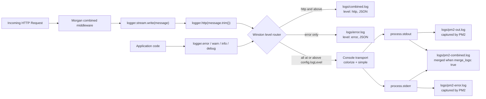

# Observability Guide

This is the canonical observability reference for the `hello-world` service.
The application emits structured JSON logs through a [Winston](https://github.com/winstonjs/winston)
logger, captures HTTP access logs through [Morgan](https://github.com/expressjs/morgan)
bridged via the `logger.stream` adapter, and additionally relies on PM2 to
capture raw stdout/stderr from each worker. All log files are written locally
under `./logs/`. There is **no** external log aggregator, no distributed
tracing, and no metrics endpoint — the service is intentionally
self-contained, and operators consume logs via `tail` or `pm2 logs`.

## Overview

The observability stack is composed of three independent layers, each
authoritatively configured by exactly one file:

| Layer | Source-of-Truth File | Purpose |
| --- | --- | --- |
| Winston application logger | `src/utils/logger.js` | Structured JSON logs to files; colorized console output |
| Morgan HTTP access logger | `src/app.js` (consumer) + `src/utils/logger.js` (stream) | Apache-combined access log lines, forwarded to Winston at the `http` level |
| PM2 process log capture | `ecosystem.config.js` | Raw stdout/stderr capture per worker, merged in cluster mode |

Library versions in use:

| Package | Version | Source |
| --- | --- | --- |
| `winston` | `^3.19.0` | `package.json` `dependencies` |
| `morgan` | `^1.10.1` | `package.json` `dependencies` |

Sources: `package.json`, `src/utils/logger.js`, `src/app.js`,
`ecosystem.config.js`.

There is **no** external log aggregation pipeline (no ELK, no Splunk, no
Datadog, no CloudWatch agent), **no** distributed tracing (no OpenTelemetry,
no Jaeger, no Zipkin), and **no** metrics endpoint (no Prometheus, no
StatsD). The full list of intentionally-absent integrations is enumerated in
[Limitations](#limitations).

## Winston Logger Construction

The Winston logger is created once during module load by
`src/utils/logger.js` and exported as the module's default `module.exports`,
with a `stream` adapter attached for Morgan integration. The same logger
instance is shared by every consumer in `src/`. Source: `src/utils/logger.js`
lines 34–127.

### Log Level Selection

The logger's `level` is sourced from `config.logLevel`, which is derived from
the `LOG_LEVEL` environment variable with a default of `'debug'`. Source:
`src/utils/logger.js` line 39; `src/config/index.js` line 28.

```js
const logger = winston.createLogger({
  level: config.logLevel,
  // ...
});
```

`config.logLevel` is set as follows (Source: `src/config/index.js` line 28):

```js
logLevel: process.env.LOG_LEVEL || 'debug',
```

Environment-specific defaults are supplied by `ecosystem.config.js`:

| PM2 block | `LOG_LEVEL` value | Source |
| --- | --- | --- |
| `env` (default) | `'debug'` | `ecosystem.config.js` line 112 |
| `env_production` | `'warn'` | `ecosystem.config.js` line 134 |

Winston's npm-default level hierarchy (Source: `src/utils/logger.js` lines
10–12 header comment):

| Level    | Priority | Included when `LOG_LEVEL=debug` | Included when `LOG_LEVEL=warn` |
| -------- | -------- | ------------------------------- | ------------------------------ |
| `error`  | 0        | ✓                               | ✓                              |
| `warn`   | 1        | ✓                               | ✓                              |
| `info`   | 2        | ✓                               | ✗                              |
| `http`   | 3        | ✓                               | ✗                              |
| `verbose`| 4        | ✓                               | ✗                              |
| `debug`  | 5        | ✓                               | ✗                              |
| `silly`  | 6        | ✗ (above `debug`)               | ✗                              |

A logger configured with `level: 'debug'` accepts every message whose level
priority number is **less than or equal to** the configured level's priority
number — so `error` (0) through `debug` (5) are emitted but `silly` (6) is
dropped. Setting `level: 'warn'` emits only `error` (0) and `warn` (1).

> **Important:** Production's `LOG_LEVEL=warn` setting suppresses `http`-level
> log lines entirely, which means the Morgan access log stream (forwarded at
> `http`) is **not** persisted in production. If HTTP access logs are
> required in production, raise `LOG_LEVEL` to `http` or lower (see
> [Tuning at Runtime](#tuning-at-runtime)). Source: `src/utils/logger.js`
> lines 110–121 and `src/app.js` lines 121–123.

### Base Format Pipeline

A single base format pipeline is shared by all transports that do not
override the format at the transport level. The pipeline is composed of
three Winston format helpers. Source: `src/utils/logger.js` lines 45–49.

```js
format: winston.format.combine(
  winston.format.timestamp(),
  winston.format.errors({ stack: true }),
  winston.format.json()
),
```

| Format helper          | Effect                                                                 | Source |
| ---------------------- | ---------------------------------------------------------------------- | ------ |
| `timestamp()`          | Adds an ISO-8601 `timestamp` field to every entry                      | `src/utils/logger.js` line 46 |
| `errors({stack:true})` | Serializes `Error` instances and includes the full `stack` property    | `src/utils/logger.js` line 47 |
| `json()`               | Produces a single newline-delimited JSON object per log entry          | `src/utils/logger.js` line 48 |

The pipeline applies to the two file transports
([Combined](#combined-file-transport-logscombinedlog) and
[Error-Only](#error-only-file-transport-logserrorlog)) but is replaced by a
colorized simple format on the [Console Transport](#console-transport).

Representative file-transport output (illustrative shape; field values
depend on the actual event):

```json
{
  "timestamp": "2024-05-20T14:22:11.042Z",
  "level": "error",
  "message": "500 - Database offline - /api/info - GET",
  "service": "hello-world",
  "stack": "Error: Database offline\n    at ..."
}
```

The `service` field is contributed by the logger's `defaultMeta` (see
[Default Metadata](#default-metadata)), and the `stack` field is contributed
by the `errors({ stack: true })` format helper when the logged value is an
`Error`.

### Default Metadata

Every log entry is automatically tagged with a `service` field via the
logger's `defaultMeta` option. Source: `src/utils/logger.js` line 53.

```js
defaultMeta: { service: 'hello-world' },
```

The value is the literal string `'hello-world'` (with a hyphen). This is
the only `defaultMeta` field configured on the logger; it enables
multi-service filtering when logs are eventually consolidated by tooling
external to this repository. No other default fields are added.

## Transports

The logger is configured with three transports — two file transports for
persistent storage and one console transport for interactive output. Each
transport may override the base format and/or the base level. Source:
`src/utils/logger.js` lines 57–91.

### Combined File Transport (`logs/combined.log`)

Source: `src/utils/logger.js` lines 63–68.

```js
new winston.transports.File({
  filename: 'logs/combined.log',
  level: 'http',
  maxsize: 5242880, // 5MB
  maxFiles: 5
}),
```

| Field      | Value                | Notes |
| ---------- | -------------------- | ----- |
| `filename` | `logs/combined.log`  | Path is relative to the process's current working directory |
| `level`    | `'http'`             | Captures `error`, `warn`, `info`, and `http` |
| `maxsize`  | `5242880` (5 MB)     | Triggers rotation when the file exceeds 5 MB |
| `maxFiles` | `5`                  | Retains up to five rotated archives |

This transport inherits the base JSON format from the logger's top-level
`format` option (see [Base Format Pipeline](#base-format-pipeline)). It is
the **persisted destination** for all application logs at `http` and above,
including the HTTP access lines forwarded from Morgan through the
`logger.stream` bridge (see [The `logger.stream` Bridge](#the-loggerstream-bridge)).

**Rotation semantics.** When `combined.log` exceeds 5,242,880 bytes,
Winston rotates the file by renaming it to `combined1.log` and creating a
new `combined.log`. Previously rotated archives shift up one slot
(`combined1.log` → `combined2.log`, ...), and any archive beyond
`combined4.log` is deleted to honor `maxFiles: 5`. Maximum disk usage for
this transport is approximately 25 MB
(5 MB × 5 files: the active file plus up to four rotated archives).

### Error-Only File Transport (`logs/error.log`)

Source: `src/utils/logger.js` lines 74–79.

```js
new winston.transports.File({
  filename: 'logs/error.log',
  level: 'error',
  maxsize: 5242880, // 5MB
  maxFiles: 5
}),
```

| Field      | Value                | Notes |
| ---------- | -------------------- | ----- |
| `filename` | `logs/error.log`     | Path is relative to the process's current working directory |
| `level`    | `'error'`            | Captures **only** `error` (priority 0) |
| `maxsize`  | `5242880` (5 MB)     | Same rotation policy as combined |
| `maxFiles` | `5`                  | Same rotation policy as combined |

Like the combined transport, the error-only transport inherits the base JSON
format. Its dedicated `level: 'error'` setting means it contains a focused
stream of the most severe events with no noise from `warn`/`info`/`http`
entries. The error handler middleware in `src/middleware/errorHandler.js`
emits at `logger.error(...)`, so every 4xx/5xx error response that reaches
the centralized handler is captured here. Source:
`src/middleware/errorHandler.js` line 65.

Typical operator usage (see [Viewing Logs](#viewing-logs)):

```bash
tail -F logs/error.log
```

The same 5 MB × 5 rotation policy applies, so maximum disk usage is
approximately 25 MB.

### Console Transport

Source: `src/utils/logger.js` lines 85–90.

```js
new winston.transports.Console({
  format: winston.format.combine(
    winston.format.colorize(),
    winston.format.simple()
  )
})
```

The console transport **overrides** the base JSON format with a colorized,
human-readable format. The override is intentional: structured JSON is
optimal for files (and for downstream parsers such as `jq`), but it is
difficult to read during interactive development. The
`colorize()` helper paints each level distinctly (red for `error`, yellow
for `warn`, green for `info`, etc.), and `simple()` reduces each entry to a
`level: message` line.

Because no `level` field is set on this transport, it inherits the logger's
top-level `level` (`config.logLevel`), and therefore emits **every** entry at
or above that level — including HTTP access lines at the `http` level when
`LOG_LEVEL=debug`.

**Interaction with PM2.** The console transport writes to `process.stdout`
and `process.stderr`. When the service runs under PM2 (the typical
production execution path), PM2 captures stdout into
`./logs/pm2-out.log` and stderr into `./logs/pm2-error.log`. Source:
`ecosystem.config.js` lines 88–90. PM2 captures the bytes **including** the
ANSI color escape sequences produced by `colorize()`, so the PM2 log files
contain colored output unless the consuming tool strips ANSI sequences.

## Morgan HTTP Access Logs

Morgan is registered as middleware in `src/app.js` to produce one log line
per HTTP request. Source: `src/app.js` lines 115–123.

### The `combined` Format

The first argument to `morgan(...)` selects a predefined log format. The
`'combined'` format emits Apache combined-log-format fields:

- remote address
- remote user (typically empty for this service since there is no auth)
- date/time of the request
- HTTP method, request URL, and HTTP version
- response status code
- response content length in bytes
- `Referer` request header
- `User-Agent` request header

Source: `src/app.js` lines 115–123 inline comments.

### The `logger.stream` Bridge

The second argument to `morgan(...)` provides a `stream` option — Morgan
writes each formatted log line to that stream instead of `process.stdout`.
The service supplies the Winston logger's attached stream adapter, defined
in `src/utils/logger.js` lines 110–121:

```js
const stream = {
  write: (message) => {
    logger.http(message.trim());
  }
};

// Attach the stream adapter directly to the logger instance...
logger.stream = stream;
```

The adapter satisfies the minimal `stream` interface Morgan expects (a
single `write(message)` method). Morgan calls `stream.write(line)` for every
request; the adapter trims the trailing newline Morgan appends, then
forwards the message to Winston at the `http` level
(`logger.http(...)` = npm level 3).

This is the **only** mechanism by which Morgan output is persisted: it does
not bypass Winston, and it does not write directly to the file system. The
Winston combined-file transport's `level: 'http'` configuration (see
[Combined File Transport](#combined-file-transport-logscombinedlog)) is the
exact reason these access lines land in `logs/combined.log` alongside
application events.

Idiomatic registration in `src/app.js` (Source: `src/app.js` lines 121–123):

```js
const morgan = require('morgan');
const logger = require('./utils/logger');
app.use(morgan('combined', { stream: logger.stream }));
```

A typical resulting line, after the stream adapter has trimmed the trailing
newline, would look like the following inside the JSON log record's
`message` field:

```json
{
  "timestamp": "2024-05-20T14:22:11.108Z",
  "level": "http",
  "message": "127.0.0.1 - - [20/May/2024:14:22:11 +0000] \"GET /health HTTP/1.1\" 200 95 \"-\" \"curl/8.4.0\"",
  "service": "hello-world"
}
```

## PM2 Logs

When the service runs under PM2 (the recommended production execution
path), PM2 captures each worker's stdout and stderr to disk in addition to
the Winston log files. PM2 logs are configured by the `apps[0]` block of
`ecosystem.config.js`.

### PM2 Log Files

Source: `ecosystem.config.js` lines 88–91.

| Field             | Value                            | Captures                                       | Source |
| ----------------- | -------------------------------- | ---------------------------------------------- | ------ |
| `log_file`        | `'./logs/pm2-combined.log'`      | Merged stdout + stderr                         | `ecosystem.config.js` line 88 |
| `out_file`        | `'./logs/pm2-out.log'`           | Stdout only                                    | `ecosystem.config.js` line 89 |
| `error_file`      | `'./logs/pm2-error.log'`         | Stderr only                                    | `ecosystem.config.js` line 90 |
| `log_date_format` | `'YYYY-MM-DD HH:mm:ss Z'`        | Prepended to each PM2 log line                 | `ecosystem.config.js` line 91 |

**PM2 logs are different from Winston's `combined.log` / `error.log`.**
Winston's files contain JSON entries produced by the file transports; PM2's
files contain the raw bytes written to `process.stdout` / `process.stderr`
by the worker process. The console transport in Winston writes to those
streams, so the colorized, simple-format console output is what ends up in
the PM2 log files. The two log families partially overlap because the same
events are visible in both formats — but they serve different tooling
(structured JSON for `jq`/aggregators, raw stream output for `pm2 logs`
and human terminal review).

### Log Merging in Cluster Mode

Source: `ecosystem.config.js` line 92.

```js
merge_logs: true,
```

In cluster mode (`instances: 'max'`, `exec_mode: 'cluster'` — Source:
`ecosystem.config.js` lines 46–47), each worker would by default write to
per-instance files (for example, `pm2-out-0.log`, `pm2-out-1.log`, and so
on, one per CPU core). Setting `merge_logs: true` redirects every worker
to the same set of files specified by `log_file`, `out_file`, and
`error_file`, which simplifies tailing and aggregation. Inline rationale is
recorded in `ecosystem.config.js` lines 84–86 (inline comment on the
`merge_logs` field).

### Log Rotation (PM2 vs. Winston)

The two log families have different rotation behaviors:

| System  | Rotates? | Mechanism                                   |
| ------- | -------- | ------------------------------------------- |
| Winston | Yes      | Built-in `maxsize: 5242880, maxFiles: 5`    |
| PM2     | No (by default) | None unless the `pm2-logrotate` module is installed separately |

Source: `src/utils/logger.js` lines 63–79 (Winston file transports);
`ecosystem.config.js` lines 73–92 (PM2 log configuration — no rotation
fields are set).

Installing PM2 log rotation is an **optional** operator action and is **not**
currently configured. If required, install the module:

```bash
pm2 install pm2-logrotate
```

This step is not performed automatically by the application code or
ecosystem file; operators who require PM2-side rotation must add and
configure `pm2-logrotate` themselves.

## Log Levels in Practice

### Development

Default development settings (Source: `ecosystem.config.js` lines 108–113
and `.env.example` line 30):

```bash
# .env or PM2 default env
NODE_ENV=development
LOG_LEVEL=debug
```

With `LOG_LEVEL=debug`, the logger emits every entry from priority `0`
(`error`) through `5` (`debug`). HTTP access logs at the `http` level are
captured in `logs/combined.log` and printed to the colorized console.

### Production

Default production settings (Source: `ecosystem.config.js` lines 130–135):

```js
env_production: {
  NODE_ENV: 'production',
  PORT: 3000,
  HOST: '0.0.0.0',
  LOG_LEVEL: 'warn',
},
```

Applied with:

```bash
pm2 start ecosystem.config.js --env production
```

With `LOG_LEVEL=warn`, only `error` (0) and `warn` (1) are emitted. Failed
requests still log at `error` via the centralized error handler (Source:
`src/middleware/errorHandler.js` line 65), so failures continue to land in
both `logs/combined.log` and `logs/error.log`. Successful requests at the
`http` level are **not** persisted in production with the default
`LOG_LEVEL`; raise the level to `'http'` or below if access logs are
required (see [Tuning at Runtime](#tuning-at-runtime)).

### Tuning at Runtime

The runtime log level is read once from `process.env.LOG_LEVEL` when
`src/config/index.js` is first required, and the resulting config object is
deeply frozen — see `module.exports = Object.freeze(config);` at
`src/config/index.js` line 38. Consequently:

- Setting `LOG_LEVEL` and **restarting** the process takes effect.
- Mutating `config.logLevel` at runtime has no effect (the frozen object
  silently rejects the assignment in non-strict mode and throws in strict
  mode).

To override the level for a given run, set the environment variable before
launch:

```bash
# Direct node execution
LOG_LEVEL=info node server.js

# Persistent change for npm scripts
echo "LOG_LEVEL=info" >> .env
npm start

# PM2 (overrides ecosystem.config.js env block on next start/reload)
LOG_LEVEL=info pm2 reload ecosystem.config.js
```

Source: `.env.example` line 30 (`LOG_LEVEL=debug`); `src/config/index.js`
lines 28 and 38; `ecosystem.config.js` lines 108–135.

## Log Data Flow Diagram

The diagram below traces every path by which data reaches the Winston
transports and the PM2 log files. Application code calls
`logger.error/warn/info/http/debug(...)` directly; Morgan reaches the same
logger through the `logger.stream` adapter at the `http` level. The console
transport's output is in turn captured by PM2 into `pm2-out.log` and
`pm2-error.log`. Source: `src/app.js` lines 121–123; `src/utils/logger.js`
lines 34–127; `ecosystem.config.js` lines 88–92.



## Viewing Logs

The choice of viewing command depends on whether the service is running
under direct `node` execution or under PM2.

### Direct Node Execution

When the service is started with `node server.js` (or `npm start` / `npm run
dev`, which both alias to `node server.js` per `package.json` lines 7–8),
the **only** persisted log files are those produced by Winston —
`logs/combined.log` and `logs/error.log`.

```bash
# Tail Winston application logs
tail -f logs/combined.log
tail -f logs/error.log

# Pretty-print Winston JSON entries with jq
tail -f logs/combined.log | jq .

# Filter to error-level entries only
tail -f logs/combined.log | jq 'select(.level == "error")'
```

The console transport also prints colorized output to the terminal in which
`node` is running.

### PM2 Execution

When the service is started with PM2 (`npm run start:pm2`, which aliases to
`pm2 start ecosystem.config.js` per `package.json` line 9), **both** the
Winston files and the PM2 files are produced. Operators typically tail PM2's
merged logs interactively and reserve the Winston JSON files for parsing
and analysis.

```bash
# Tail all PM2-managed processes (Winston console output captured by PM2)
npm run logs            # aliases to 'pm2 logs' per package.json line 11
pm2 logs                # equivalent invocation

# Only the hello-world process logs
pm2 logs hello-world

# Raw PM2 files (cluster-merged because merge_logs: true)
tail -f logs/pm2-combined.log
tail -f logs/pm2-out.log
tail -f logs/pm2-error.log

# Winston JSON files are still produced in PM2 mode
tail -f logs/combined.log | jq .
tail -f logs/error.log | jq .
```

Source: `package.json` lines 7–11 (scripts); `ecosystem.config.js` lines
88–92 (PM2 log file paths and `merge_logs`).

> **Note on ANSI in PM2 logs.** Because the Winston console transport applies
> `colorize()` to its output, the captured PM2 log files contain ANSI escape
> sequences. Use `tail`/`less -R` to render colors, or strip the sequences
> before pipeline processing (`sed -r 's/\x1B\[[0-9;]*[mK]//g'`).

## Limitations

This service is deliberately self-contained. The following capabilities are
**not** provided and would require introducing new dependencies or
configuration that is explicitly out of scope for this codebase:

- **No distributed tracing.** There is no OpenTelemetry, Jaeger, or Zipkin
  integration. No spans, traces, or W3C `traceparent` propagation is
  configured.
- **No external log aggregation.** No ELK/EFK stack, no Splunk forwarder,
  no Datadog agent, no AWS CloudWatch Logs integration. Logs are local
  files only.
- **No metrics endpoint.** No Prometheus `/metrics` endpoint, no StatsD
  client, no per-route latency histograms.
- **No alerting hooks.** Operators wiring alerting against
  `logs/error.log` must do so externally (e.g., via a tailing process or a
  log shipper that they themselves provide).
- **PM2 logs do not auto-rotate.** Without the optional
  `pm2-logrotate` module (see
  [Log Rotation (PM2 vs. Winston)](#log-rotation-pm2-vs-winston)),
  `logs/pm2-*.log` files grow unbounded.
- **The `logs/` directory must be writable.** Winston's file transports
  will throw at log-time if `./logs/` is missing or read-only. The
  application does not create the directory itself; ensure the deployment
  environment provides it (PM2 will create it on first write when the
  process's working directory is writable).
- **Log-level changes require process restart.** `config` is read once at
  module load and then frozen (Source: `src/config/index.js` line 38);
  there is no SIGHUP handler or admin endpoint that reloads the log level.
- **Only one `defaultMeta` field is set.** The logger attaches only
  `service: 'hello-world'`. No `version`, `hostname`, `pid`, or
  request-correlation ID is added automatically. Consumers needing
  additional fields must pass them explicitly to each
  `logger.<level>(message, meta)` call.

## Source Citations

Every technical claim in this document is traceable to one of the
following files in this repository:

- `src/utils/logger.js` — Winston logger construction, file/console
  transports, and the `logger.stream` adapter.
- `src/app.js` — Morgan middleware registration and its `stream` wiring to
  the Winston logger.
- `src/config/index.js` — `logLevel` resolution from `process.env.LOG_LEVEL`
  and the `Object.freeze(config)` immutability contract.
- `ecosystem.config.js` — PM2 log file paths, `log_date_format`,
  `merge_logs`, and the `env` / `env_production` `LOG_LEVEL` overrides.
- `package.json` — Library versions for `winston` and `morgan`; the
  `npm run logs` script alias.
- `.env.example` — Operator-facing template documenting `LOG_LEVEL` and
  the development default.
- `src/middleware/errorHandler.js` — Demonstrates `logger.error(...)` usage
  at the application's centralized error boundary.

## See Also

- [Module README: `src/utils/`](../src/utils/README.md) — Per-module
  documentation of the logger construction and sanitization helpers.
- [Deployment Guide](./deployment.md) — How PM2 launches the service, how
  `env_production.LOG_LEVEL` is applied, and how graceful shutdown
  interacts with log flushing.
- [Security Guide](./security.md) — How the error handler masks 5xx
  messages in production (CWE-209) and how `sanitizeLogInput` mitigates
  log-injection (CWE-117) before any user-controlled value reaches the
  logger.
- [Architecture Guide](./architecture.md) — Full middleware pipeline
  showing Morgan's position in the ordered chain.

[Back to README](../README.md)
