# src — Express Application Layer

## Purpose

This folder is the Node.js/Express 5 application source tree. It composes the full HTTP
request-handling pipeline — security headers, CORS policy, response compression, body
parsing, structured access logging, rate limiting, route dispatch, 404 handling, and
centralized error handling — but it does **not** bind a network port. Port binding,
signal handling, and unhandled-error safety nets are the responsibility of `server.js`
at the repository root.

The tree is organized into four focused submodules:

- `config/` — Immutable, environment-driven runtime configuration (frozen at module
  load). Source: `src/config/index.js`.
- `middleware/` — Reusable cross-cutting middleware: centralized error handler, 404
  catch-all, and Zod request-validation factory. Source: `src/middleware/*.js`.
- `routes/` — Route composition and endpoint definitions for `GET /`, `GET /health`,
  `GET /api`, and `GET /api/info`, including `router.all()` 405 method guards.
  Source: `src/routes/*.js`.
- `utils/` — Foundational utility infrastructure: the Winston structured logger
  (with a Morgan-compatible stream adapter) and the log/URL sanitization helpers.
  Source: `src/utils/*.js`.

The single integration point for these pieces is `src/app.js`, which exports the fully
wired, non-started Express `app` instance.

Source: `src/app.js` (factory), `server.js` (listener).

## Key Files

Every direct child of `src/` is listed below with its role and source citation.

| Path | Role | Source |
|---|---|---|
| `src/app.js` | Express application factory — middleware pipeline + route mounting; exports `app` | `src/app.js` |
| `src/config/` | Centralized, frozen, environment-driven configuration module | `src/config/index.js` |
| `src/middleware/` | Error handler, 404 handler, Zod request validation factory | `src/middleware/*.js` |
| `src/routes/` | `GET /`, `GET /health`, `GET /api`, `GET /api/info` + 405 method guards | `src/routes/*.js` |
| `src/utils/` | Winston logger (w/ Morgan stream bridge), log/URL sanitization helpers | `src/utils/*.js` |

## Architecture Fit

This folder follows the **Express application factory** pattern: a pure assembly
module that returns a configured but non-started `app` instance, separated from the
process-level bootstrap that owns the network socket and signal handlers.

- `src/app.js` creates and exports a fully configured Express `app` instance. Source:
  `src/app.js` line 58 (`const app = express();`) and line 193
  (`module.exports = app;`).
- `src/app.js` does **not** call `app.listen()`. That is deliberately the
  responsibility of `server.js`. Source: `src/app.js` JSDoc header lines 19–22
  (Architecture Notes); `server.js` line 56 (`app.listen(config.port, config.host, …)`).
- **Rationale — testability.** Tests can import `src/app.js` directly and drive it
  with Supertest without opening a socket. Source: `tests/app.test.js`. The companion
  bootstrap test `tests/server.test.js` mocks `../src/app` to test the bootstrap
  logic (signal handlers, exit codes) in isolation.
- **Rationale — clean separation of concerns.** The app factory owns middleware and
  routes; the bootstrap script owns network binding, signal-driven graceful
  shutdown, and process-level safety nets for `unhandledRejection` /
  `uncaughtException`. Source: `server.js` JSDoc header lines 9–20.

### Middleware Pipeline (9 ordered steps)

```mermaid
flowchart LR
    R[Incoming Request] --> H[1. Helmet<br/>API-hardened CSP<br/>default-src 'none'<br/>frame-ancestors 'none']
    H --> C[2. CORS<br/>origin: config.corsOrigin]
    C --> Z[3. Compression<br/>gzip/deflate]
    Z --> B[4. Body Parsers<br/>JSON + urlencoded<br/>limit: config.bodyLimit]
    B --> M[5. Morgan 'combined'<br/>stream: logger.stream]
    M --> L[6. Rate Limiter<br/>config.rateLimit<br/>custom JSON 429]
    L --> T[7. Routes<br/>GET /, /health, /api, /api/info]
    T --> N[8. notFound<br/>404 JSON sanitized URL]
    T --> E[9. errorHandler<br/>last resort]
    N --> E
```



The pipeline order is a public contract enforced by `tests/app.test.js`. Reordering
any step would silently change security, observability, or error-handling behavior.
For example, moving Helmet after Compression would briefly emit compressed responses
without security headers; moving the error handler before the 404 handler would cause
unmatched paths to return a generic 500 instead of a structured 404. Source:
`src/app.js` JSDoc header lines 8–17 (pipeline order is annotated "CRITICAL — must not
be reordered"); `tests/app.test.js`.

## Public Interface

- The only exported symbol from this folder's entry point is the Express `app`
  instance.
- Export form: `module.exports = app;`. Source: `src/app.js` line 193.
- Consumers:
  - `server.js` — binds the app to a network socket via `app.listen(config.port,
    config.host, …)`. Source: `server.js` line 56.
  - `tests/app.test.js` and `tests/routes/*.test.js` — use Supertest to assert
    behavior against the in-memory app instance (no socket).

Programmatic consumer example (matches the actual bootstrap in `server.js`):

```js
// server.js (bootstrap script)
require('dotenv').config();
const app = require('./src/app');
const config = require('./src/config');
app.listen(config.port, config.host, () => {
  console.log(`Server running on http://${config.host}:${config.port}`);
});
```

Source: `server.js` lines 31 (`require('dotenv').config();`), 40
(`require('./src/app')`), and 56–58 (`app.listen(...)`).

## Dependencies

The factory file `src/app.js` imports a small, fixed set of external packages and
internal modules. No transitive dependency is required by the documentation contract.

### External (npm)

The following packages are required at the top of `src/app.js` (lines 37–42):

- `express` — Web framework providing the `app` instance, router, body parsers, and
  middleware pipeline. Source: `src/app.js` line 37; `package.json` dependencies.
- `helmet` — HTTP security headers (sets 13 protective headers by default plus a
  hardened CSP). Source: `src/app.js` line 38.
- `cors` — Cross-Origin Resource Sharing policy enforcement; origin read from
  `config.corsOrigin`. Source: `src/app.js` line 39.
- `compression` — gzip/deflate response compression negotiated via the
  `Accept-Encoding` request header. Source: `src/app.js` line 40.
- `morgan` — HTTP access logging in `'combined'` format, piped through
  `logger.stream`. Source: `src/app.js` line 41.
- `express-rate-limit` — Per-IP rate limiting with custom JSON 429 handler.
  Source: `src/app.js` line 42.

### Internal (relative)

The following internal modules are required from `src/app.js` (lines 48–52):

- `./config` — Provides `config.corsOrigin`, `config.bodyLimit`, and the nested
  `config.rateLimit.{windowMs, max}` consumed by middleware setup. Source:
  `src/app.js` line 48.
- `./utils/logger` — Provides `logger.stream` (the Morgan-compatible write adapter)
  for HTTP access log forwarding to Winston. Source: `src/app.js` line 49;
  `src/utils/logger.js` lines 110–121.
- `./routes` — The aggregated Express `router` mounted at `/`. Source: `src/app.js`
  line 50; `src/routes/index.js` line 76 (`module.exports = router;`).
- `./middleware/errorHandler` — The 4-arg centralized error handler registered LAST
  in the pipeline. Source: `src/app.js` line 51; `src/middleware/errorHandler.js`
  line 102 (`module.exports = errorHandler;`).
- `./middleware/notFound` — The 404 catch-all registered second-to-last in the
  pipeline. Source: `src/app.js` line 52; `src/middleware/notFound.js` line 54
  (`module.exports = notFound;`).

**Load-order requirement.** The chain `dotenv` → `./src/config` → `./src/app` is
enforced by `server.js`, not by `src/app.js` itself. If `src/app.js` is required
before environment variables are loaded, `./config` will fall back to its hardcoded
defaults — the app still works, but operator overrides set in `.env` will be ignored.
Source: `server.js` lines 27–31 (Phase 1 comment + `dotenv.config()`); `server.js`
line 40 (`require('./src/app')`); `src/config/index.js` lines 24–36 (defaults
applied via `process.env.X || fallback`).

## Data Flow

The end-to-end request lifecycle through this folder is as follows. Step numbers
correspond to the middleware-pipeline diagram above and to the numbered comments in
`src/app.js`.

1. An incoming HTTP request is received by the Node.js HTTP server bound in
   `server.js`. Source: `server.js` line 56.
2. Express delegates to the middleware pipeline registered on `app`. Source:
   `src/app.js` lines 70–183.
3. **Step 1 — Helmet.** Security headers are written to the response (13 headers
   including a hardened Content-Security-Policy with `default-src 'none'` and
   `frame-ancestors 'none'`) before any downstream middleware can emit a response.
   Source: `src/app.js` lines 79–86.
4. **Step 2 — CORS.** Preflight `OPTIONS` requests are handled and the
   `config.corsOrigin` policy is enforced. Source: `src/app.js` lines 92–94.
5. **Step 3 — Compression.** gzip/deflate is negotiated based on the
   `Accept-Encoding` request header. Source: `src/app.js` line 100.
6. **Step 4 — Body parsers.** JSON and URL-encoded request bodies are parsed up to
   `config.bodyLimit` (default `10kb`). Source: `src/app.js` lines 112–113.
7. **Step 5 — Morgan.** A `'combined'`-format access log line is emitted and
   forwarded through `logger.stream.write` into Winston at the `http` level. Source:
   `src/app.js` lines 121–123; `src/utils/logger.js` lines 110–121.
8. **Step 6 — Rate limiter.** Per-IP request count is checked against
   `config.rateLimit.windowMs` and `config.rateLimit.max`. On excess, a 429 JSON
   response matching the standardized error shape is returned by the custom handler.
   Source: `src/app.js` lines 135–148.
9. **Step 7 — Routes.** The aggregated router (mounted at `/`) dispatches to the
   matching handler for `GET /`, `GET /health`, `GET /api`, or `GET /api/info`.
   Source: `src/app.js` line 161; `src/routes/index.js`.
10. **Step 8 — `notFound`.** If no route matches, a sanitized 404 JSON response is
    emitted (URL HTML-entity encoded; log entry sanitized for control characters).
    Source: `src/app.js` line 171; `src/middleware/notFound.js` lines 42–52.
11. **Step 9 — `errorHandler`.** If any handler calls `next(err)`, throws
    synchronously, or returns a rejected Promise (Express 5 auto-forwards async
    rejections), the centralized error handler produces a standardized JSON error
    response. Source: `src/app.js` line 183; `src/middleware/errorHandler.js`
    lines 51–100.

The Morgan HTTP access log is written to the same Winston logger used by application
code, producing unified structured output in `logs/combined.log` and a colorized
stream on `stdout`. Source: `src/utils/logger.js` lines 110–121.

Cross-reference: See `docs/architecture.md` for full sequence diagrams of the
request and error lifecycles.

## Configuration

- All configurable values consumed by `src/app.js` come from `./config`, never
  hardcoded in the factory. Source: `src/app.js` line 48 (`const config =
  require('./config');`); inline rationale comment at `src/app.js` lines 88–91
  (CORS), 107–113 (body limit), 125–134 (rate limit).
- The environment variable contract is documented canonically in
  `src/config/README.md`. The full operator-facing variable list is `NODE_ENV`,
  `PORT`, `HOST`, `LOG_LEVEL`, `CORS_ORIGIN`, `BODY_LIMIT`, `RATE_LIMIT_WINDOW_MS`,
  `RATE_LIMIT_MAX`. Source: `src/config/index.js` lines 24–36; `.env.example`.
- Defaults are defined inside `src/config/index.js` (e.g., `port=3000`,
  `host='0.0.0.0'`, `corsOrigin='*'`, `bodyLimit='10kb'`, `rateLimit.windowMs=900000`,
  `rateLimit.max=100`). Source: `src/config/index.js` lines 24–36.
- The configuration object is **frozen at module load** via `Object.freeze(config)`
  and `Object.freeze(rateLimit)`. Downstream modules — including this factory —
  cannot mutate it at runtime. Source: `src/config/index.js` lines 32 (nested
  freeze) and 38 (root freeze).
- Changing any configuration value requires modifying environment variables and
  restarting the process. There is no live-reload mechanism.

Link: [Configuration module →](./config/README.md).

## Error Handling

All errors emitted within this folder converge on a single sink:
`src/middleware/errorHandler.js`. There are three paths an error can take to get
there:

1. **Synchronous throws** from any middleware or route handler. Express catches the
   throw and forwards it to the error pipeline.
2. **Explicit `next(err)` calls** from any middleware or handler that detects an
   error condition.
3. **Rejected promises** from async middleware and handlers. Express 5 has built-in
   promise support: an unhandled rejection in an `async` handler is automatically
   forwarded to the error pipeline without manual `try/catch`. Source:
   `src/middleware/errorHandler.js` JSDoc lines 20–23.

Behaviors that apply to every error response in this folder:

- In production (`NODE_ENV=production`), 5xx error messages are masked to
  `Internal Server Error` to mitigate CWE-209 (Information Exposure Through Error
  Message). Client errors (4xx) preserve their specific messages because they are
  intended to inform API consumers. Source: `src/middleware/errorHandler.js` lines
  75–79.
- The standardized error JSON shape is `{ status: 'error', statusCode, message }`.
  This shape is shared by the 404 handler (`src/middleware/notFound.js`), the 429
  rate-limit handler (`src/app.js` lines 140–146), the 405 method-guard handlers
  (`src/routes/*.js`), and the final 500 handler (`src/middleware/errorHandler.js`).
- The 404 handler is registered BEFORE the error handler so that unmatched paths
  return a structured 404 rather than falling through to a generic 500. Source:
  `src/app.js` line 171 (`notFound`) and line 183 (`errorHandler`).
- In non-production environments, the error handler attaches the JavaScript
  `err.stack` to the response body to aid debugging. Source:
  `src/middleware/errorHandler.js` lines 92–94.

Link: [Middleware module →](./middleware/README.md).

## Security Notes

The security posture established by this folder is defense-in-depth across multiple
middleware layers and shared utilities. Each control below is enforced inside the
9-step pipeline (see Data Flow above) or at the route level via shared middleware
and utilities.

- **Helmet (security headers).** The first middleware in the pipeline. Configured
  with an API-hardened Content-Security-Policy using `defaultSrc: ["'none'"]` and
  `frameAncestors: ["'none'"]` because the service returns JSON or plain text — not
  rendered HTML — so the more restrictive policy is appropriate. Source:
  `src/app.js` lines 79–86; rationale inline comment lines 75–78.
- **CORS policy.** Origin is environment-driven via `config.corsOrigin` rather than
  hardcoded, so operators can tighten the policy per environment without code
  changes. Default is `'*'` in development. Source: `src/app.js` line 93;
  `src/config/index.js` line 29.
- **Rate limiting.** The custom rate-limit handler emits a JSON 429 response that
  matches the standardized error shape used by 400, 404, 405, and 500 responses.
  This guarantees consumers receive a consistent error contract across ALL failure
  modes. Source: `src/app.js` lines 140–146; rationale inline comment lines
  131–134.
- **Body size limits.** Both JSON and URL-encoded body parsers are capped at
  `config.bodyLimit` (default `10kb`) to mitigate CWE-400 (Uncontrolled Resource
  Consumption) via payload-based denial-of-service. Source: `src/app.js` lines
  107–113.
- **Minimal querystring parser.** `express.urlencoded({ extended: false })` uses
  the built-in `querystring` parser instead of the `qs` library, reducing the
  attack surface (no prototype-polluting nested object syntax). Source:
  `src/app.js` line 105 inline comment; line 113.
- **Input validation (Zod).** Every public `GET` endpoint applies a strict empty
  body / empty query schema via the `validateInput` middleware factory. Source:
  `src/routes/index.js` line 44, `src/routes/health.js` line 41, `src/routes/api.js`
  lines 33 and 71. See `src/middleware/README.md` for the schema factory contract.
- **405 method guards.** Each route file pairs its `router.get('/')` registration
  with a `router.all('/')` catch-all that returns 405 + `Allow: GET, HEAD`. Without
  these guards, non-GET methods would fall through to the 404 handler with a
  misleading status code. Source: `src/routes/index.js` lines 54–60;
  `src/routes/health.js` lines 55–61; `src/routes/api.js` lines 47–53 and 85–91.
- **Log injection prevention (CWE-117).** The shared `sanitizeLogInput` helper
  strips ANSI escape sequences and ASCII control characters before any
  user-controlled value (such as `req.originalUrl` or `req.method`) is written to
  the log. Source: `src/utils/sanitizer.js`; call sites in
  `src/middleware/errorHandler.js` line 65 and `src/middleware/notFound.js` line 44.
- **Reflected-content prevention.** The `sanitizeUrl` helper HTML-entity encodes
  the URL before including it in the 404 response body, preventing reflected
  injection if a client receives the body in a context that interprets HTML.
  Source: `src/utils/sanitizer.js`; call site in `src/middleware/notFound.js`
  line 50.
- **Error masking (CWE-209).** Production 5xx responses are masked to a generic
  `Internal Server Error` message, hiding internal details such as file paths,
  module names, or connection strings. Source: `src/middleware/errorHandler.js`
  lines 75–79.

Link: [Full security guide →](../docs/security.md).

## Examples

### Observable behavior (curl / bash)

Run the service via `npm run dev` or `npm start` from the repository root and
exercise the endpoints:

```bash
# 1. Root route — plain-text "Hello, World!" with trailing newline
curl -i http://localhost:3000/
# HTTP/1.1 200 OK
# Content-Type: text/plain; charset=utf-8
# Body: Hello, World!

# 2. Health check — JSON status payload for PM2 / load-balancer probes
curl -s http://localhost:3000/health
# {"status":"ok","uptime":12.34,"timestamp":"2025-01-01T00:00:00.000Z",
#  "memory":{"rss":...,"heapTotal":...,"heapUsed":...,"external":...,
#  "arrayBuffers":...},"nodeVersion":"v20.x.x"}

# 3. API welcome — JSON success message
curl -s http://localhost:3000/api
# {"status":"success","message":"Welcome to the API"}

# 4. API info — JSON metadata sourced from package.json and config
curl -s http://localhost:3000/api/info
# {"status":"success","data":{"version":"1.0.0","environment":"development",
#  "nodeVersion":"v20.x.x"}}

# 5. 405 Method Not Allowed — non-GET to a GET-only route
curl -i -X POST http://localhost:3000/
# HTTP/1.1 405 Method Not Allowed
# Allow: GET, HEAD
# {"status":"error","statusCode":405,"message":"Method Not Allowed"}

# 6. 404 Not Found — unmatched path with sanitized URL in the response body
curl -i http://localhost:3000/does-not-exist
# HTTP/1.1 404 Not Found
# {"status":"error","statusCode":404,"message":"Not Found - /does-not-exist"}
```

Source: `src/routes/index.js` line 46 (root plain-text contract);
`src/routes/health.js` lines 41–49 (health JSON shape); `src/routes/api.js` lines
33–38 and 71–80 (API welcome and info shapes); `src/routes/index.js` lines 54–60
(405 with `Allow` header); `src/middleware/notFound.js` lines 47–51 (404 JSON
shape).

### Programmatic usage (Supertest)

The factory is designed to be consumed by tests without binding a network port:

```js
// Using the app in a test with Supertest (no listen required)
const request = require('supertest');
const app = require('./src/app');

describe('GET /', () => {
  it('returns Hello, World! as text/plain', async () => {
    const res = await request(app).get('/');
    expect(res.status).toBe(200);
    expect(res.headers['content-type']).toMatch(/text\/plain/);
    expect(res.text).toBe('Hello, World!\n');
  });
});
```

Source: `src/app.js` line 193 (`module.exports = app;`); `src/routes/index.js`
line 46 (byte-identical plain-text body `'Hello, World!\n'`);
`tests/routes/index.test.js`.

### Inspecting the exported `app`

```js
const app = require('./src/app');
// `app` is an Express application instance.
// It is fully wired but NOT started — there is no open TCP socket.
console.log(typeof app);            // 'function' (Express apps are callable)
console.log(typeof app.listen);     // 'function'
console.log(typeof app.use);        // 'function'
```

Source: `src/app.js` lines 58 (`const app = express();`) and 193.

## Limitations

The following items are deliberately **not** provided by this folder. Each bullet
matches the current codebase and must not be inferred to exist.

- **No authentication or authorization layer.** All endpoints are public. `/health`
  is deliberately unauthenticated so that PM2, container orchestrators, and load
  balancers can probe it without credentials. Source: `src/routes/health.js` JSDoc
  lines 8–9.
- **No database, ORM, or persistence layer.** `/health` reports in-process metrics
  only (`process.uptime()`, `process.memoryUsage()`, `process.version`); it does
  not connect to or check any external system. Source: `src/routes/health.js`
  lines 42–48.
- **No background jobs, queues, or workers.** All request handling is synchronous on
  the Node.js event loop within the same process.
- **No websocket, server-sent events, or streaming endpoints.** Only request /
  response HTTP via the routes listed in `## Key Files`.
- **No TLS termination in-app.** The server binds plain HTTP via `app.listen`.
  Operators terminating TLS must do so at an upstream reverse proxy (e.g., nginx,
  a cloud load balancer). Source: `server.js` line 56.
- **No `trust proxy` setting.** Rate limiting is per-process and in-memory; behind
  a reverse proxy, the limiter will see the proxy's IP rather than the real client
  IP unless `trust proxy` is configured. `src/app.js` does not currently set
  `app.set('trust proxy', …)`. Source: `src/app.js` (absence verified across lines
  1–193).
- **The `app` instance is not started by this folder.** `src/app.js` alone cannot
  serve traffic; `server.js` must call `app.listen(...)` for the application to
  accept connections. Source: `src/app.js` JSDoc header lines 19–22; `server.js`
  line 56.
- **No documentation generator or static-site build.** All documentation in this
  repository is hand-authored Markdown rendered by the Git hosting platform.
  There is no `jsdoc`, `mkdocs`, `docusaurus`, or `sphinx` configuration.

## See Also

Module READMEs in this folder:

- [Configuration module](./config/README.md)
- [Middleware module](./middleware/README.md)
- [Routes module](./routes/README.md)
- [Utilities module](./utils/README.md)

Cross-cutting operator guides under `/docs/`:

- [Architecture guide](../docs/architecture.md)
- [API reference](../docs/api.md)
- [Security guide](../docs/security.md)
- [Observability guide](../docs/observability.md)
- [Deployment guide](../docs/deployment.md)
- [Testing guide](../docs/testing.md)

Repository root:

- [Back to project README](../README.md)
